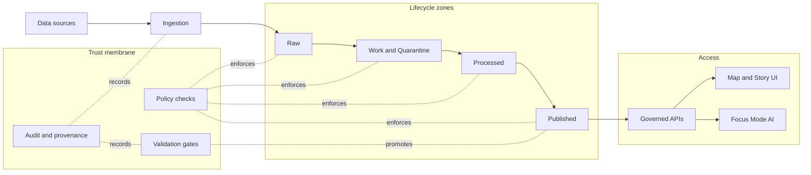
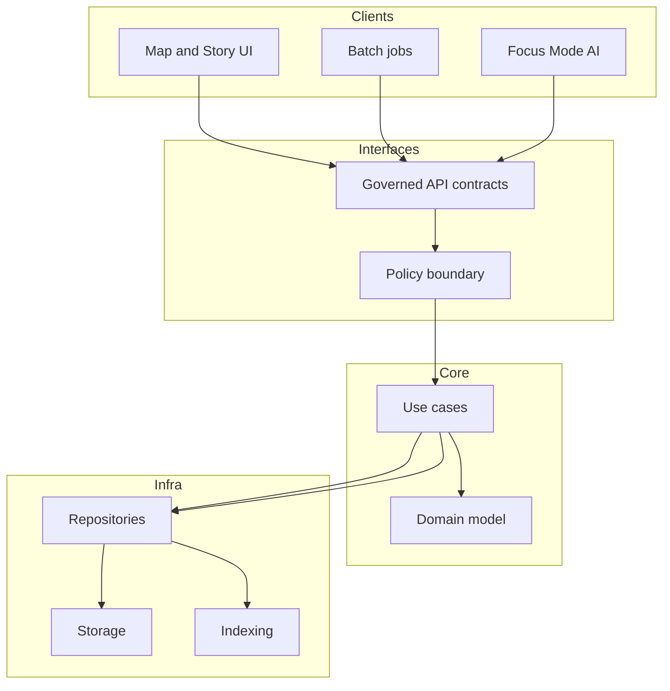

<!-- [KFM_META_BLOCK_V2]
doc_id: kfm://doc/a8e9c2e8-7a89-4b0c-9f4c-1e9d4a0f1c6d
title: Architecture
type: standard
version: v1
status: draft
owners: KFM Maintainers
created: 2026-02-24
updated: 2026-02-28
policy_label: restricted
related:
  - TODO: docs/governance/README.md
  - TODO: docs/apis/README.md
  - TODO: docs/data/README.md
  - TODO: docs/ui/README.md
tags: [kfm, architecture, trust-membrane, truth-path, promotion-contract]
notes:
  - Defines the trust membrane, truth path lifecycle, and promotion contract expectations for architecture changes.
  - TODO links are placeholders until repo paths are confirmed.
[/KFM_META_BLOCK_V2] -->

<a id="top"></a>

# Architecture

Governed, end-to-end system architecture and **trust membrane** rules for Kansas-Matrix-System.

**Map-first • Time-aware • Evidence-first • Governed • Cite-or-abstain**


 <!-- TODO: replace with real workflow badge -->

> [!WARNING]
> This directory documents production constraints. If a change alters **data lifecycle**, **policy enforcement**, **API boundaries**, or **claim traceability**, treat it as a **governed change** and update the relevant contracts + tests.
>
> Docs are not enforcement. If an invariant matters, it must be **merge-blocking in CI** and **runtime-enforced**.

---

## Navigation

- [System at a glance](#system-at-a-glance)
- [Truth discipline labels](#truth-discipline-labels)
- [Layering model](#layering-model)
- [Trust membrane invariants](#trust-membrane-invariants)
- [Canonical vs rebuildable stores](#canonical-vs-rebuildable-stores)
- [Time model](#time-model)
- [Truth path lifecycle zones](#truth-path-lifecycle-zones)
- [Promotion contract and audit](#promotion-contract-and-audit)
- [Interfaces and contracts](#interfaces-and-contracts)
- [Security, ethics, and location handling](#security-ethics-and-location-handling)
- [How to change architecture](#how-to-change-architecture)
- [Directory guide](#directory-guide)
- [Appendix](#appendix)

---

## System at a glance

Kansas-Matrix-System connects:

**upstream → connectors → RAW → WORK/QUARANTINE → PROCESSED → CATALOG/TRIPLET → index builders → governed API (PEP) → Map/Story UI + Focus Mode**

Key architectural idea: **catalogs + provenance are contract surfaces**, not “nice metadata”.


> [!NOTE]
> “Published” is not just a folder. It is the **governed runtime**: API responses, tiles, story pages, and Focus Mode outputs—each backed by promoted artifacts + receipts.

[(back to top)](#top)

---

## Truth discipline labels

To keep architecture docs actionable (and prevent accidental invention), we tag statements:

- **[CONFIRMED]** backed by governed docs / validated artifacts.
- **[PROPOSED]** an option or recommended design pattern.
- **[UNKNOWN]** requires verification in the live repo (and must not be assumed true).

> [!TIP]
> When adding a new architectural claim: include (1) evidence, (2) policy decision path, (3) the CI/runtime enforcement point.

[(back to top)](#top)

---

## Layering model

We enforce a layered design so governance is testable and bypass is hard.


### Practical meaning

- **Domain**: datasets, dataset versions, artifacts, catalogs, claims, evidence refs, policy decisions, receipts, story nodes.
- **Use cases**: ingest, validate, promote, resolve evidence, query slices, publish story nodes, run focus queries.
- **Interfaces**: API + evidence resolver + policy boundary (enforcement, not “helper lib”).
- **Infrastructure**: artifact stores + catalog store + audit ledger + projection stores (indexes, tiles, DB).

[(back to top)](#top)

---

## Trust membrane invariants

These are **non-negotiable**. Encode them as tests and enforce them in CI.

### Hard rules

- **Clients never access DB/object storage directly.** UI/clients must use governed APIs only.
- **Core logic never bypasses repositories.** Use cases talk to repos; repos talk to storage/indexes.
- **All access is policy-evaluated.** Policy evaluation returns **decision + obligations** (e.g., generalize geometry, remove fields).
- **Gates fail closed.** Missing license, missing policy label, missing catalogs, or missing receipts blocks promotion and release.
- **Citations are EvidenceRefs, not URLs.** Every user-facing claim must cite resolvable evidence or abstain.
- **Catalog triplet is required for runtime.** Runtime services read only promoted dataset versions with DCAT/STAC/PROV + receipts.
- **Deterministic identity is mandatory.** dataset_id + dataset_version_id + spec_hash + content digests prevent silent drift.

### Architectural smells (block on sight)

- New endpoint reads from DB/object store without policy evaluation.
- Client code contains database credentials.
- “Temporary bypass” around promotion gates for demos.
- Broken evidence links or non-resolvable citations in Story/Focus outputs.
- Index/data-store treated as canonical truth (it is a projection unless explicitly promoted as canonical).

> [!TIP]
> If you need performance: optimize **inside** the membrane (cache, precompute, better indexing), not by bypassing governance.

### Non-goals reminder (to keep scope buildable)

- Do not mirror/redistribute content with unclear licensing (prefer metadata-only references until cleared).
- Avoid “general chatbot” experiences. Focus Mode is a governed evidence workflow.
- Start map-first (2D); 3D is optional.

[(back to top)](#top)

---

## Canonical vs rebuildable stores

**[CONFIRMED]** Treat **object storage + catalogs + provenance/receipts** as canonical truth.

**[CONFIRMED]** Treat **databases and indexes** as projections that can be rebuilt from promoted artifacts.

Practical implications:

- Losing an index is recoverable (rebuild).
- Losing catalogs/receipts is catastrophic (breaks traceability).
- CI must prove cross-links resolve and that rebuilt projections match expected invariants.

[(back to top)](#top)

---

## Time model

KFM is time-aware. Prefer explicit time semantics to avoid “moving truth”.

**Recommended axes:**
- **Event time**: when something happened (what users usually explore in the map/timeline).
- **Transaction time**: when KFM acquired/published the record (audit + reproducibility).
- **Valid time (optional)**: when a statement is considered true (useful for boundary/admin history).

Implementation guidance:

- Store event time on records when available.
- Always store transaction time for all promoted artifacts and receipts.
- Use valid time only when domain requires it (boundaries, governance history, “as known on date X”).

[(back to top)](#top)

---

## Truth path lifecycle zones

Promotion is not a copy operation. It is a governed decision supported by artifacts and tests.

| Zone | Purpose | Typical contents | Mutability | Typical readers | Promotion out requires |
|---|---|---|---|---|---|
| Upstream | External source-of-record | Remote APIs, files, portals, feeds | Out of our control | Connectors | Capture terms snapshot + acquisition manifest |
| RAW | Immutable acquisition | Raw artifacts + checksums + acquisition/terms snapshot + fetch logs | Append-only | Pipeline maintainers | Identity + digests + license snapshot |
| WORK / QUARANTINE | Isolation + QA | Normalization outputs, reprojections, tiling jobs, QA reports, redaction candidates | Rewrite allowed | Data engineers, reviewers | Validation reports + policy label + redaction plan |
| PROCESSED | Publishable artifacts | Standard formats (GeoParquet, COG, PMTiles, etc.), stable IDs, checksums | Immutable per version | API/index builders | Meets QA thresholds + stable digests |
| CATALOG / TRIPLET | Contract surfaces | Cross-linked DCAT + STAC + PROV + run receipts + link maps | Immutable per version | Validators, resolvers | Validators pass + links resolve |
| PUBLISHED | Governed runtime surfaces | Policy-filtered API responses, tiles, story pages, Focus Mode outputs (with receipts) | Mutable as runtime, but backed by immutable versions | End users | Only serve promoted versions; audit every request/run |

### Minimum metadata (fail closed)

For any dataset version eligible for promotion, we require at least:

- `dataset_id`, `dataset_version_id` (stable IDs)
- `spec_ref` + `spec_hash` (deterministic definition of transforms + thresholds)
- License/rights + upstream terms snapshot
- Policy label + obligations/redaction plan (when needed)
- Spatial + temporal extents
- Checksums/digests for every artifact
- Catalog triplet + resolvable EvidenceRefs

[(back to top)](#top)

---

## Promotion contract and audit

### Promotion Contract v1 (minimum gates)

Promotion to PUBLISHED is blocked unless **all** minimum gates pass (fail closed).

| Gate | What must be present | Example CI check |
|---|---|---|
| A — Identity & versioning | dataset_id + dataset_version_id; deterministic spec_hash; content digests | Spec/schema validation; spec_hash golden tests; digest verification |
| B — Licensing & rights | License/rights fields + snapshot of upstream terms | Fail if license missing/unknown; terms snapshot exists |
| C — Sensitivity & redaction plan | policy_label + obligations (generalize geometry, remove fields, etc.) | Policy tests default-deny; verify obligations applied |
| D — Catalog triplet validation | DCAT/STAC/PROV validate and cross-link; EvidenceRefs resolve | Validators + linkcheck; fail on broken links |
| E — QA & thresholds | Dataset-specific checks + thresholds documented and met | QA report exists; quarantine failures |
| F — Run receipt & audit record | Receipt capturing inputs, tooling, hashes, policy decisions; audit ledger append-only | Receipt schema validation; attestation/signature checks (if enabled) |
| G — Release manifest | Promotion recorded as a manifest referencing artifacts + digests | Manifest exists; references match objects |

### Run receipt template (machine-verifiable)

Store receipts as JSON or YAML; schema-validate them in CI.

```yaml
run_id: "kfm://run/YYYY-MM-DDTHH:MM:SSZ.<suffix>"
created_at: "YYYY-MM-DDTHH:MM:SSZ"
actor:
  principal: "svc:pipeline|user:<id>"
  role: "pipeline|steward|admin"
operation: "ingest+publish|index_build|focus_query|story_publish"
dataset_version_id: "YYYY-MM.<hash>"
spec_hash: "sha256:..."
inputs:
  - uri: "raw/<path-or-uri>"
    digest: "sha256:..."
outputs:
  - uri: "processed/<path-or-uri>"
    digest: "sha256:..."
environment:
  container_digest: "sha256:..."
  git_commit: "<sha>"
  params_digest: "sha256:..."
validation:
  status: "pass|fail"
  report_digest: "sha256:..."
policy:
  decision_id: "kfm://policy_decision/<id>"
notes:
  - "Short explanation of what changed"
```

### Promotion manifest template (release record)

```json
{
  "kfm_promotion_manifest_version": "v1",
  "dataset_slug": "example_dataset",
  "dataset_version_id": "YYYY-MM.<hash>",
  "spec_hash": "sha256:<hash>",
  "released_at": "YYYY-MM-DDTHH:MM:SSZ",
  "artifacts": [
    {
      "path": "events.parquet",
      "digest": "sha256:<digest>",
      "media_type": "application/x-parquet"
    }
  ],
  "catalogs": [
    { "path": "dcat.jsonld", "digest": "sha256:<digest>" },
    { "path": "stac/collection.json", "digest": "sha256:<digest>" }
  ],
  "qa": { "status": "pass", "report_digest": "sha256:<digest>" },
  "policy": { "policy_label": "public", "decision_id": "kfm://policy_decision/<id>" },
  "approvals": [
    { "role": "steward", "principal": "<id>", "approved_at": "YYYY-MM-DDTHH:MM:SSZ" }
  ]
}
```

### Policy decision template (allow/deny + obligations)

```json
{
  "decision_id": "kfm://policy_decision/<id>",
  "policy_label": "restricted",
  "decision": "deny",
  "reason_codes": ["SENSITIVE_SITE", "RIGHTS_UNCLEAR"],
  "obligations": [
    { "type": "generalize_geometry", "min_cell_size_m": 5000 },
    { "type": "remove_attributes", "fields": ["exact_location", "owner_name"] }
  ],
  "evaluated_at": "YYYY-MM-DDTHH:MM:SSZ",
  "rule_id": "deny.restricted_dataset.default"
}
```

> [!NOTE]
> If sensitivity is unclear, **default to deny** and route to governance review.

[(back to top)](#top)

---

## Interfaces and contracts

This directory should point to the canonical contracts that define what clients may do.

### Contract registry

| Contract | Purpose | Location |
|---|---|---|
| API contract | Endpoints, auth, error model, audit_ref in errors | `docs/architecture/contracts/` or `docs/apis/` |
| Evidence resolver contract | EvidenceRef → EvidenceBundle; policy enforced | `docs/architecture/contracts/` or `docs/apis/` |
| Policy contract | policy_label, obligations, decision procedure; default-deny tests | `docs/architecture/contracts/` or `docs/governance/` |
| Catalog triplet profiles | DCAT/STAC/PROV required fields + cross-link rules | `docs/data/` (or `docs/architecture/contracts/`) |
| Receipt + manifest schemas | run receipt schema + promotion manifest schema | `docs/architecture/contracts/` |
| UI trust surfaces | Evidence drawer requirements, accessibility targets | `docs/ui/` |

> [!IMPORTANT]
> Keep contracts versioned and test them. The fastest way to break the trust membrane is to change behavior without updating the contract.

### EvidenceRef schemes (minimum)

Prefer explicit schemes so resolution is deterministic:

- `dcat://...` dataset/distribution metadata
- `stac://...` collection/item/asset metadata
- `prov://...` lineage + run receipts
- `doc://...` governed docs + story citations
- `graph://...` entity relations (if enabled)

### Evidence resolver contract (why this replaces “LLM citations”)

A “citation” is not a pasted URL. A citation is an **EvidenceRef** that resolves (via the resolver) into an **EvidenceBundle** containing inspectable metadata, provenance, digests, and policy results.

- Must apply policy and obligations.
- Must return machine + human views.
- UI should be able to use it in **≤ 2 calls**.
- Fail closed if unresolvable or unauthorized.

[(back to top)](#top)

---

## Security, ethics, and location handling

### Default-deny when unclear

If permission, sensitivity, or community constraints are unclear:

- **redact or generalize**
- flag for governance review
- do not promote or publish

### Vulnerable sites and sensitive locations

- Do not store or expose exact coordinates for vulnerable/private/culturally restricted locations.
- Prefer coarse geography and controlled access.
- Ensure obligations like geometry generalization are testable and enforced.

### Licensing is a policy input

- Do not redistribute content if rights are unclear.
- Story publishing must block if rights are unclear for included media.
- Exports should include attribution + license text automatically.

### Focus Mode safety posture

Focus Mode is a governed workflow:

- policy pre-check → retrieval → evidence bundling → synthesis → hard citation verification → receipt
- must cite resolvable evidence or abstain

[(back to top)](#top)

---

## How to change architecture

### Change types

| Change | Examples | Required updates |
|---|---|---|
| Interface change | new endpoint, auth change, error model change | API contract + tests + migration notes |
| Governance change | new policy_label, new obligation type | Policy contract + fixtures + review sign-off |
| Lifecycle change | new gate, new zone definition | Gate definitions + receipt/manifest schemas + CI checks |
| Catalog change | new DCAT/STAC/PROV profile field | Validators + linkcheck updates + fixtures |
| Storage/index change | new index type, partitioning | Repo adapters + rebuild/runbook + rollback plan |

### Definition of done (architecture changes)

- [ ] Updated this README if trust membrane, truth path, or contract surfaces changed
- [ ] ADR added/updated with decision + consequences + rollback
- [ ] Tests added to enforce invariants (merge-blocking)
- [ ] Migration plan exists and is reversible
- [ ] Security/privacy review complete (especially for sensitive locations)
- [ ] Evidence resolution still works end-to-end (Map/Story/Focus)

### Minimum verification steps (convert UNKNOWN → CONFIRMED)

Attach outputs of these checks to the next revision when architecture is changing:

- [ ] Capture repo commit hash + root tree (e.g., `git rev-parse HEAD`, `tree -L 3`)
- [ ] Enumerate CI gates from workflow config and document what blocks merges
- [ ] Confirm presence of validators, policy pack/tests, evidence resolver route, and receipt schemas
- [ ] Promote one MVP dataset end-to-end through all gates and store receipts + catalogs
- [ ] Confirm UI cannot bypass PEP (static + network policy checks)
- [ ] For Focus Mode: run evaluation harness and store golden outputs + diffs

[(back to top)](#top)

---

## Directory guide

### Purpose

`docs/architecture/` is the **system-level** documentation for:

- trust membrane + boundary rules
- layering model
- truth path lifecycle + promotion contract
- cross-cutting concerns: audit, policy, catalogs, evidence resolution, security

### Where it fits

This directory is the top of the documentation tree for architecture. Detailed docs should live in their domain directories and be linked from here.

### Acceptable inputs

- System diagrams that explain boundaries and flows
- ADRs for architecture decisions
- Contract pointers and versioning conventions
- Threat models and risk assessments
- Receipt/manifest schemas and examples

### Exclusions

- Product roadmaps and user stories
- Implementation tutorials for a single service
- Secrets, credentials, or production access instructions
- Exact coordinates for sensitive sites

### Recommended structure

**Current contents**

- `README.md` (this file)

**Suggested layout (PROPOSED)**

```text
docs/architecture/                                          # Architecture docs (invariants, decisions, diagrams, contracts)
├─ README.md                                                # Index + invariants (trust membrane) + truth path + promotion contract
│
├─ overview/                                                # High-level architecture narrative (what/why/how)
│  ├─ README.md                                             # How to read the architecture set + link map + glossary pointer
│  │
│  ├─ system-context.md                                     # System context + external actors/dependencies (C4-ish, map-first)
│  ├─ actors-and-trust-surfaces.md                          # Humans/services + UI trust surfaces + “what can touch what”
│  ├─ layering.md                                           # Layering model (Domain → Use cases → Interfaces → Infra) w/ examples
│  ├─ component-decomposition.md                            # Components/services/modules + responsibility boundaries
│  ├─ deployment-topology.md                                # Proposed deployment topology (envs, networks, gateways, secrets)
│  │
│  ├─ trust-membrane.md                                     # Boundary rules + enforcement points (PEP/PDP + UI trust surfaces)
│  ├─ policy-boundary.md                                    # PEP/PDP/obligations/redaction: where decisions happen + what they emit
│  ├─ evidence-and-claims.md                                # Claims/EvidenceRef/EvidenceBundle: meaning, linking rules, UX obligations
│  ├─ focus-mode-constraints.md                             # Cite-or-abstain behavior, failure modes, “no evidence → no claim”
│  │
│  ├─ truth-path.md                                         # Lifecycle zones + promotion contract explanation (Upstream→…→Published)
│  ├─ promotion-contract.md                                 # Promotion gates as an executable contract + audit receipt requirements
│  ├─ provenance-and-audit.md                               # Run receipts, audit ledger, provenance link graph, reproducibility
│  ├─ canonical-vs-rebuildable.md                           # Canonical vs rebuildable stores + rebuild guarantees and triggers
│  ├─ identity-and-hashing.md                               # Deterministic IDs, content hashing, stable references, collision posture
│  │
│  ├─ time-model.md                                         # Event/transaction/valid time conventions
│  ├─ time-queries-and-snapshots.md                         # “As-of” queries, temporal snapshots, time slicing, UI implications
│  │
│  ├─ security-and-privacy.md                               # Cross-cutting security posture + secrets handling (no creds in docs)
│  ├─ sensitive-locations.md                                # No exact coords for vulnerable sites; coarse geography + obligations
│  ├─ observability.md                                      # Logs/metrics/traces + audit correlation IDs across pipelines/APIs/UI
│  └─ glossary.md                                           # Architecture glossary (terms used consistently across docs/contracts)
│
├─ decisions/                                               # ADRs (small, reversible, versioned decisions)
│  ├─ README.md                                             # ADR process + review gates + how ADRs link to code/tests/contracts
│  ├─ adr-0000-template.md                                  # ADR template (decision record format)
│  ├─ adr-0001-example.md                                   # Example ADR (illustrative)
│  │
│  ├─ adr-0002-trust-membrane-enforcement.md                # Where/how invariants are enforced (tests, CI, runtime)
│  ├─ adr-0003-policy-engine-integration.md                 # PDP choice/integration + obligations model
│  ├─ adr-0004-evidence-resolution.md                       # Evidence resolver design + redaction guarantees
│  ├─ adr-0005-canonical-vs-rebuildable-stores.md            # Storage/index split + rebuild receipts
│  ├─ adr-0006-time-model.md                                # Why this time model + implications for schemas/APIs/UI
│  └─ adr-index.yml                                         # Optional: machine-readable ADR registry (id, title, status, links)
│
├─ diagrams/                                                # Mermaid sources (kept close to narrative)
│  ├─ README.md                                             # Diagram conventions (Mermaid style rules, naming, export policy)
│  │
│  ├─ system-context.mmd                                    # External actors + system boundary diagram
│  ├─ layering.mmd                                          # Layering/trust membrane boundaries diagram
│  ├─ truth-path.mmd                                        # Truth path + promotion gates diagram
│  ├─ contracts.mmd                                         # Contract surfaces + validation flow diagram
│  ├─ pep-pdp-obligations.mmd                               # PEP/PDP + obligations emission/consumption diagram
│  ├─ evidence-flow.mmd                                     # Evidence resolution flow (EvidenceRef → Bundle → redaction → cite UI)
│  ├─ time-model.mmd                                        # Event/valid/transaction time relationships + “as-of” query flow
│  ├─ deployment.mmd                                        # Deployment topology diagram (conceptual, no secrets)
│  │
│  └─ exports/                                              # OPTIONAL: rendered SVG/PNG exports (generated, not hand-edited)
│     ├─ .gitkeep                                            # Keep folder if your repo needs it
│     └─ README.md                                          # If exports are committed, define how they’re generated/verified
│
├─ contracts/                                               # Stable contracts (human + machine; link to /contracts when canonical)
│  ├─ README.md                                             # Contract set overview + versioning + “normative vs informative”
│  │
│  ├─ api-contract.md                                       # Human-readable API contract summary (normative behavior)
│  ├─ api-versioning-and-compat.md                          # Versioning rules, deprecation, compatibility gates
│  ├─ api-error-model.md                                    # Error shapes, trace IDs, policy-deny semantics, retry posture
│  ├─ authn-authz-contract.md                               # AuthN/Z expectations (scopes/roles), audit requirements
│  │
│  ├─ policy-contract.md                                    # Policy contract (labels, decisions, obligations, fail-closed)
│  ├─ policy-labels.vocab.json                              # Machine vocab for labels (public/restricted/…)
│  ├─ obligations.vocab.yml                                 # Machine vocab for obligations (redact/generalize/log/deny)
│  │
│  ├─ evidence-resolver-contract.md                         # Evidence resolution contract (inputs/outputs + obligations)
│  ├─ evidence-ref.schema.json                              # Machine schema for EvidenceRef
│  ├─ evidence-bundle.schema.json                           # Machine schema for EvidenceBundle (resolved + redaction notes)
│  │
│  ├─ run-receipt.schema.json                               # Machine schema (mirror/link to canonical contracts/)
│  ├─ run-receipt.example.json                              # Example receipt (golden fixture used in CI)
│  ├─ promotion-manifest.schema.json                        # Machine schema (mirror/link to canonical contracts/)
│  ├─ promotion-manifest.example.json                       # Example manifest (golden fixture used in CI)
│  │
│  ├─ story-node.schema.json                                # StoryNode schema (or pointer to canonical)
│  ├─ claim.schema.json                                     # Claim schema (statement + evidence links + policy decision refs)
│  └─ fixtures/                                             # Small canonical examples used by doc/tests
│     ├─ example-evidence-ref.json
│     ├─ example-evidence-bundle.json
│     ├─ example-claim.json
│     └─ example-story-node.json
│
├─ enforcement/                                             # “Make it testable”: how invariants become CI/runtime gates
│  ├─ README.md                                             # How enforcement works end-to-end (where to add checks)
│  ├─ invariants.md                                         # The invariant list (normative, test-linked)
│  ├─ policy-enforcement-points.md                          # Enumerate PEPs; required context; expected decisions/obligations
│  ├─ contract-testing.md                                   # Contract tests strategy (OpenAPI/schema validation; fixtures)
│  ├─ data-promotion-gates.md                               # Promotion gate mapping → checks → failing behavior (fail closed)
│  ├─ redaction-and-generalization-tests.md                  # How to test “no sensitive coords leak” etc.
│  └─ ci-checks.md                                          # Which CI jobs enforce what + required artifacts for pass
│
├─ registries/                                              # Small, machine-readable indexes that keep docs honest
│  ├─ README.md                                             # What registries are + how they’re validated
│  ├─ boundary-surface-registry.yml                          # All trust surfaces: UI, API, batch, Focus Mode, admin tools
│  ├─ service-catalog.yml                                   # Services/modules + owners + contracts + data touched
│  ├─ contract-index.yml                                    # Contract → canonical source → version → tests
│  ├─ pep-registry.yml                                      # List of PEP locations + endpoints + auth requirements
│  └─ policy-label-registry.yml                              # Human-friendly label registry mirroring machine vocab
│
├─ templates/                                               # Copy/paste templates to keep docs consistent + cheap to extend
│  ├─ README.md                                             # Template usage + Do/Don’t
│  ├─ kfm-meta-block-v2.txt                                 # MetaBlock v2 snippet (authoritative copy)
│  ├─ standard-doc.template.md                              # Standard doc skeleton (Context → Contract → Verification)
│  ├─ adr.template.md                                       # ADR skeleton (mirrors adr-0000-template.md)
│  ├─ contract-doc.template.md                              # “Normative behavior” contract skeleton
│  ├─ diagram.template.mmd                                  # Mermaid boilerplate + style rules
│  └─ review-checklist.md                                   # Architecture review checklist (link to enforcement/ gates)
│
└─ threat-model/                                            # Threat modeling (assets, actors, risks, mitigations)
   ├─ README.md                                             # Threat model overview + review cadence + acceptance criteria
   ├─ scope-and-assets.md                                   # What we protect + what we explicitly do NOT cover
   ├─ actors-and-entrypoints.md                             # Threat actors + entry points (UI/API/pipelines/admin)
   ├─ data-classification-and-handling.md                    # Sensitivity classes + handling + “default deny”
   ├─ abuse-cases.md                                        # Concrete misuse/abuse scenarios + expected system response
   ├─ control-mapping.md                                    # Controls mapped to threats (policy, gates, audit, auth, etc.)
   ├─ risk-register.md                                      # Risk table (likelihood/impact/mitigation/owner/status)
   └─ residual-risk.md                                      # What remains risky + why accepted + monitoring plan
```

[(back to top)](#top)

---

## Appendix

<details>
<summary>ADR template</summary>

```markdown
<!-- [KFM_META_BLOCK_V2]
doc_id: kfm://doc/TODO-UUID
title: ADR XXXX: Short title
type: standard
version: v1
status: draft
owners: TODO
created: YYYY-MM-DD
updated: YYYY-MM-DD
policy_label: restricted
related:
  - docs/architecture/README.md
tags: [kfm, adr]
notes:
  - One sentence summary.
[/KFM_META_BLOCK_V2] -->

# ADR XXXX: Short title

## Context

## Decision

## Consequences

## Alternatives considered

## Verification

- Tests:
- Migration:
- Rollback:
```

</details>

<details>
<summary>Architecture review checklist</summary>

- Boundary: Is every data access behind policy (PEP + resolver)?
- Traceability: Can a claim link to EvidenceRef → EvidenceBundle → receipts?
- Reproducibility: Can we rebuild PUBLISHED projections from PROCESSED + catalogs?
- Safety: Are sensitive locations protected (generalized/redacted) by obligations + tests?
- Licensing: Are rights + terms snapshots captured and enforced?
- Reversibility: Is rollback cheap and documented?
- CI: Do validators, linkcheck, policy tests, and schema checks block merges?

</details>

<details>
<summary>Risk register starter (architecture-level)</summary>

| Risk | Example failure | Mitigation direction |
|---|---|---|
| Policy bypass | Direct DB/storage access from client or service | Network controls + code review + tests that assert “no bypass” |
| Licensing violation | Unlicensed content mirrored or exported | Gate B fail-closed; terms snapshots; export auto-attribution |
| Sensitive location leakage | Precise archaeology/species sites exposed | Default-deny; obligations (generalize); redaction tests |
| Non-resolvable citations | Broken EvidenceRefs in story/focus | Linkcheck + resolver contract tests; publish gate blocks |
| Performance collapse | Large layers unusable in UI | Precompute tiles, caching, progressive disclosure, benchmarks |
| Focus Mode leakage/hallucination | Answers without admissible evidence | Hard citation verification + eval harness; abstain when unsupported |

</details>

[(back to top)](#top)<!-- [KFM_META_BLOCK_V2]
doc_id: kfm://doc/a8e9c2e8-7a89-4b0c-9f4c-1e9d4a0f1c6d
title: Architecture
type: standard
version: v1
status: draft
owners: KFM Maintainers
created: 2026-02-24
updated: 2026-02-24
policy_label: restricted
related:
  - TODO: docs/governance/README.md
  - TODO: docs/apis/README.md
  - TODO: docs/data/README.md
  - TODO: docs/ui/README.md
tags: [kfm, architecture]
notes:
  - This README defines the trust membrane and the minimum documentation set for architecture changes.
  - Update the TODO links once the repo paths are confirmed.
[/KFM_META_BLOCK_V2] -->

<a id="top"></a>

# Architecture

Governed, end-to-end system architecture and **trust membrane** rules for Kansas-Matrix-System.


> [!WARNING]
> This directory documents production constraints. If a change alters data lifecycle, policy enforcement, API boundaries, or claim traceability, treat it as a **governed change** and update the relevant sections and checklists below.

## Navigation

- [System at a glance](#system-at-a-glance)
- [Layering model](#layering-model)
- [Trust membrane invariants](#trust-membrane-invariants)
- [Data lifecycle zones](#data-lifecycle-zones)
- [Promotion gates and audit](#promotion-gates-and-audit)
- [Interfaces and contracts](#interfaces-and-contracts)
- [Security, ethics, and location handling](#security-ethics-and-location-handling)
- [How to change architecture](#how-to-change-architecture)
- [Directory guide](#directory-guide)
- [Appendix](#appendix)

---

## System at a glance

The Kansas-Matrix-System connects:

**data → pipelines → catalogs and provenance → storage and indexing → governed APIs → Map and Story UI → Focus Mode AI**



[(back to top)](#top)

---

## Layering model

We enforce a layered design to keep governance testable and prevent accidental bypass of policy.



### Practical meaning

- **Domain**: concepts like datasets, spatial features, story nodes, claims, evidence, and policies.
- **Use cases**: ingestion, validation, promotion, search, retrieval, redaction, and narrative composition.
- **Interfaces**: API and policy contracts that clients must go through.
- **Infrastructure**: databases, object stores, queues, indexes, and compute.

[(back to top)](#top)

---

## Trust membrane invariants

These are non-negotiable rules. Encode them as tests and enforce them in CI.

### Hard rules

- **Clients never access storage directly.** UI and other clients must use governed APIs.
- **Policy is a boundary, not a library.** Any data access that can affect exposure must pass through a policy decision.
- **Core logic does not bypass repositories.** Use cases talk to repositories; repositories talk to storage and indexing.
- **Gates fail closed.** Missing metadata, missing audit receipts, or unclear sensitivity must block promotion or release.
- **Every user-facing claim is traceable.** A claim must be backed by evidence and a policy decision path.

### Architectural smells

- New endpoint that reads from a database without calling policy evaluation.
- Any client code that contains database credentials.
- Data promoted to Published without a reproducible run receipt.
- “Temporary” bypasses for speed or demos.

> [!TIP]
> If you need performance, optimize inside the boundary: caching, precomputed indexes, or better batch promotion. Do not bypass governance.

[(back to top)](#top)

---

## Data lifecycle zones

Promotion is not a copy operation. It is a governed decision supported by artifacts.

| Zone | Purpose | Allowed contents | Typical readers | Promotion out requires |
|---|---|---|---|---|
| Raw | Immutable intake | Source data as received, minimal normalization | Pipeline maintainers | Identity metadata, licensing notes, checksums |
| Work and Quarantine | Cleaning and risk containment | Derived working tables, QA outputs, redaction candidates | Data engineers, reviewers | Validation results, provenance links, sensitivity label |
| Processed | Standardized products | Cleaned and standardized datasets, model-ready tables | Analysts, API backends | Schema documentation, quality thresholds met, reproducible transform |
| Published | Governed products | Only approved datasets and indexes | Governed APIs, end users | Audit receipt, policy decision record, release criteria |

### Minimum metadata for any zone

- Identity: name, version, source, license
- Schema: fields, types, units
- Extents: spatial and temporal coverage
- Sensitivity: policy label and handling requirements

[(back to top)](#top)

---

## Promotion gates and audit

### Promotion gate checklist

- [ ] Metadata complete: identity, schema, extents, license, sensitivity
- [ ] Validation complete: QA checks run and stored
- [ ] License checks complete: permitted usage confirmed
- [ ] Provenance complete: input refs, transforms, tool versions
- [ ] Integrity complete: checksums recorded
- [ ] Audit receipt emitted: who, what, when, why, inputs, outputs, policy decisions

### Run receipt template

Store receipts as machine-readable JSON or YAML so they can be verified in CI.

```yaml
run_id: "TODO"
started_at: "YYYY-MM-DDTHH:MM:SSZ"
ended_at: "YYYY-MM-DDTHH:MM:SSZ"
actor: "human_or_service"
pipeline:
  name: "TODO"
  version: "TODO"
inputs:
  - ref: "raw://path-or-id"
    checksum: "sha256:..."
outputs:
  - ref: "processed://path-or-id"
    checksum: "sha256:..."
quality:
  checks:
    - name: "TODO"
      status: "pass"
policy:
  label: "public|restricted|culturally_restricted|..."
  decisions:
    - rule: "TODO"
      outcome: "allow|deny|redact"
notes:
  - "Short explanation of what changed"
```

> [!NOTE]
> If sensitivity is unclear, default to **deny** and route to governance review.

[(back to top)](#top)

---

## Interfaces and contracts

This directory should point to the canonical contracts that define what clients may do.

### Contract registry

| Contract | Purpose | Location |
|---|---|---|
| API contract | Endpoints, auth, error model | `docs/architecture/contracts/` or `docs/apis/` |
| Policy contract | Sensitivity labels, redaction rules, decision procedures | `docs/architecture/contracts/` or `docs/governance/` |
| Data contracts | Dataset schemas and catalog metadata | `docs/data/` |
| UI interaction model | Map and story behaviors, accessibility targets | `docs/ui/` |

> [!IMPORTANT]
> Keep contracts versioned and test them. The fastest way to break the trust membrane is to change behavior without updating the contract.

[(back to top)](#top)

---

## Security, ethics, and location handling

### Default-deny when unclear

- If permission, sensitivity, or community constraints are unclear: **redact or generalize**, and flag for governance review.

### Vulnerable sites

- Do not store or expose exact coordinates for vulnerable, private, or culturally restricted locations.
- Prefer coarse geography and controlled access.

### Safety posture for outputs

Any output that affects datasets, public narratives, compliance posture, access control, or Focus Mode reasoning is a governed artifact:

- evidence-bound
- policy-aware
- auditable

[(back to top)](#top)

---

## How to change architecture

### Change types

| Change | Examples | Required updates |
|---|---|---|
| Interface change | new endpoint, auth change, error model change | Contract + tests + migration notes |
| Governance change | new sensitivity label, new redaction rule | Policy contract + fixtures + review sign-off |
| Data lifecycle change | new zone, promotion criteria change | Pipeline gates + run receipt schema + CI checks |
| Storage or indexing change | new index type, partitioning | Repository adapters + migration runbooks |

### Definition of done for architecture changes

- [ ] Updated this README if the trust membrane, lifecycle, or boundary rules changed
- [ ] Updated or added an ADR documenting the decision
- [ ] Tests added to enforce invariants
- [ ] Migration plan exists and is reversible
- [ ] Security and privacy review complete

> [!TIP]
> Prefer small, additive increments. If the change cannot be rolled back cheaply, split it.

[(back to top)](#top)

---

## Directory guide

### Purpose

`docs/architecture/` is the **system-level** documentation for:

- the trust membrane and boundary rules
- the layering model
- data lifecycle and promotion gates
- cross-cutting concerns: audit, policy, security

### Where it fits

This directory is the top of the documentation tree for architecture. More detailed docs should live in their domain directories and be linked from here.

### Acceptable inputs

- System diagrams that explain boundaries and flows
- ADRs for architecture decisions
- Contract pointers and versioning conventions
- Threat models and risk assessments
- Run receipt schemas and examples

### Exclusions

- Product requirements, user stories, and roadmaps
- Implementation tutorials for a single service
- Secrets, credentials, or production access instructions
- Exact coordinates for sensitive sites

### Recommended structure

**Current contents**

- `README.md` (this file)

**Suggested layout**

The rest is a suggested layout; create folders as the repo matures.

```text
docs/architecture/                                  # Architecture docs (invariants, decisions, diagrams, contracts)
├─ README.md                                        # Index + how to navigate architecture docs
│
├─ overview/                                        # High-level architecture narrative (what/why/how)
│  ├─ system-context.md                             # System context + external actors/dependencies
│  ├─ trust-membrane.md                             # Trust membrane definition (boundary rules + enforcement points)
│  └─ lifecycle.md                                  # Data lifecycle (raw → work → processed → catalog → published)
│
├─ decisions/                                       # Architecture Decision Records (ADRs)
│  ├─ adr-0000-template.md                          # ADR template (problem → options → decision → consequences)
│  └─ adr-0001-example.md                           # Example ADR (format reference)
│
├─ diagrams/                                        # Diagram sources (Mermaid .mmd; export images if desired)
│  ├─ system-context.mmd                            # Context diagram source
│  ├─ layering.mmd                                  # Layered architecture diagram source
│  └─ lifecycle.mmd                                 # Lifecycle flow diagram source
│
├─ contracts/                                       # Architecture-level contracts (human + machine)
│  ├─ api-contract.md                               # API boundary invariants (error shapes, auth, versioning)
│  ├─ policy-contract.md                            # Policy boundary invariants (default-deny, inputs/outputs)
│  └─ run-receipt.schema.json                       # Run receipt schema (machine contract referenced by CI/policy)
│
└─ threat-model/                                    # Threat modeling (risks + mitigations + assumptions)
   └─ README.md                                     # Threat model overview (assets, threats, controls, residual risk)
```

| Path | Purpose |
|---|---|
| `overview/` | System context, trust membrane narrative, lifecycle notes |
| `decisions/` | Architecture Decision Records |
| `diagrams/` | Diagram sources for review and reuse |
| `contracts/` | Stable contracts: API, policy, schemas |
| `threat-model/` | Threat modeling and security posture |

[(back to top)](#top)

---

## Appendix

<details>
<summary>ADR template</summary>

```markdown
<!-- [KFM_META_BLOCK_V2]
doc_id: kfm://doc/TODO-UUID
title: ADR XXXX: Short title
type: standard
version: v1
status: draft
owners: TODO
created: YYYY-MM-DD
updated: YYYY-MM-DD
policy_label: restricted
related:
  - docs/architecture/README.md
tags: [kfm, adr]
notes:
  - One sentence summary.
[/KFM_META_BLOCK_V2] -->

# ADR XXXX: Short title

## Context

## Decision

## Consequences

## Alternatives considered

## Verification

- Tests:
- Migration:
- Rollback:
```

</details>

<details>
<summary>Architecture review checklist</summary>

- Boundary: Is every data access behind policy?
- Traceability: Can a claim link to evidence and receipts?
- Reproducibility: Can we rebuild Published from Raw plus receipts?
- Safety: Are sensitive locations protected and generalized?
- Reversibility: Is rollback cheap and documented?

</details>

[(back to top)](#top)
