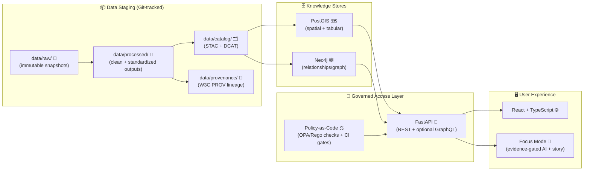
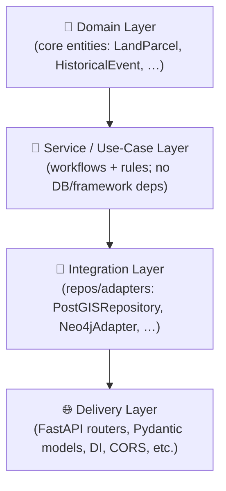

# 🏛️ KFM Architecture (docs/architecture)


> **According to a document from 2025-12-28 (Master Guide v13 draft)**, KFM’s architecture is defined by non‑negotiable pipeline ordering, strict API boundaries, and evidence/provenance requirements that must not regress.  [oai_citation:0‡MARKDOWN_GUIDE_v13.md.gdoc](file-service://file-UYVruFXfueR8veHMUKeugU) [oai_citation:1‡MARKDOWN_GUIDE_v13.md.gdoc](file-service://file-UYVruFXfueR8veHMUKeugU)

---

## 🧭 What this folder is for

This folder is the **canonical “architecture map”** for Kansas Frontier Matrix (KFM): what the platform is, what the boundaries are, how data flows, and where governance is enforced.

KFM is explicitly designed as a **pipeline → catalogs → databases/graph → API → UI** system (with Focus Mode + narrative layered on top), where *everything* is traceable to sources and governed through policy + metadata gates.  [oai_citation:2‡Kansas Frontier Matrix (KFM) – Comprehensive Technical Blueprint.pdf](sediment://file_000000006dbc71f89a5094ce310a452d) [oai_citation:3‡Kansas Frontier Matrix (KFM) – Comprehensive Technical Blueprint.pdf](sediment://file_000000006dbc71f89a5094ce310a452d)

---

## 🧩 TL;DR Architecture in one picture



**Key boundary rule:** the UI must never query the graph/databases directly — all access goes through the governed API.  [oai_citation:4‡Kansas Frontier Matrix (KFM) – Comprehensive Technical Blueprint.pdf](sediment://file_000000006dbc71f89a5094ce310a452d) [oai_citation:5‡MARKDOWN_GUIDE_v13.md.gdoc](file-service://file-UYVruFXfueR8veHMUKeugU)

---

## ✅ Non‑negotiables (architecture invariants)

These are “hard gates” — breaking them breaks the platform’s trust model:

- **Pipeline ordering is absolute:** `ETL → Catalogs (STAC/DCAT/PROV) → Graph → API → UI → Story Nodes → Focus Mode`  [oai_citation:6‡MARKDOWN_GUIDE_v13.md.gdoc](file-service://file-UYVruFXfueR8veHMUKeugU)
- **API boundary rule:** frontend must never talk to Neo4j directly; *governed API only*.  [oai_citation:7‡MARKDOWN_GUIDE_v13.md.gdoc](file-service://file-UYVruFXfueR8veHMUKeugU)
- **Provenance first:** anything “published” must have catalogs + lineage before graph/UI/narrative use.  [oai_citation:8‡MARKDOWN_GUIDE_v13.md.gdoc](file-service://file-UYVruFXfueR8veHMUKeugU)
- **Deterministic ETL:** idempotent, config-driven transforms with reproducible outputs and logged runs.  [oai_citation:9‡MARKDOWN_GUIDE_v13.md.gdoc](file-service://file-UYVruFXfueR8veHMUKeugU)
- **Evidence-first narrative:** no unsourced story content; AI output must be constrained + clearly labeled and tied to evidence.  [oai_citation:10‡MARKDOWN_GUIDE_v13.md.gdoc](file-service://file-UYVruFXfueR8veHMUKeugU)
- **Fail closed:** if metadata/policy checks fail, the system blocks merges/actions by default.  [oai_citation:11‡Kansas Frontier Matrix (KFM) – Comprehensive Technical Blueprint.pdf](sediment://file_000000006dbc71f89a5094ce310a452d)

---

## 🗺️ Repository layout (architecture view)

KFM uses a **monorepo** so code + data + docs evolve together (and lineage stays inspectable).  [oai_citation:12‡Kansas Frontier Matrix (KFM) – Comprehensive Technical Blueprint.pdf](sediment://file_000000006dbc71f89a5094ce310a452d)

```text
📦 Kansas-Frontier-Matrix/
├─ api/                🧠 FastAPI backend (Clean Architecture)
├─ web/                🖥️ React + TypeScript frontend
├─ pipelines/          🧪 ETL + enrichment jobs (deterministic/idempotent)
├─ data/
│  ├─ raw/             🧊 immutable source snapshots
│  ├─ processed/       🧼 standardized outputs
│  ├─ catalog/         🗂️ STAC items + DCAT records
│  └─ provenance/      🧾 W3C PROV lineage logs
├─ policy/             ⚖️ policy-as-code (OPA/Rego) + compliance rules
└─ docs/
   ├─ architecture/    🏛️ (this folder)
   ├─ standards/       📏 STAC/DCAT/PROV profiles + doc protocols
   └─ governance/      🧑‍⚖️ ethics, sovereignty, review gates
```

(Top-level structure summarized from KFM blueprint.)  [oai_citation:13‡Kansas Frontier Matrix (KFM) – Comprehensive Technical Blueprint.pdf](sediment://file_000000006dbc71f89a5094ce310a452d)

---

## 🧱 Backend architecture (Clean Architecture inside `api/`)

KFM’s backend is designed with a layered **Clean Architecture** so domain logic stays testable and independent of infrastructure choices.  [oai_citation:14‡Kansas Frontier Matrix (KFM) – Comprehensive Technical Blueprint.pdf](sediment://file_000000006dbc71f89a5094ce310a452d)



Implementation notes in the blueprint emphasize:
- FastAPI routers validate inputs, call services, and centralize enforcement (including governance checks).  [oai_citation:15‡Kansas Frontier Matrix (KFM) – Comprehensive Technical Blueprint.pdf](sediment://file_000000006dbc71f89a5094ce310a452d)
- Optional GraphQL can be mounted, with resolvers reusing the same service layer (avoid duplicated logic).  [oai_citation:16‡Kansas Frontier Matrix (KFM) – Comprehensive Technical Blueprint.pdf](sediment://file_000000006dbc71f89a5094ce310a452d)

---

## 🧾 Data lifecycle + “boundary artifacts” (why catalogs exist)

KFM treats **metadata + provenance** as first-class outputs — not an afterthought.

### Required boundary artifacts per dataset / evidence product

Per Master Guide v13 and KFM standards guidance, every dataset or derived “evidence artifact” must produce:
- **STAC** (assets + spatiotemporal indexing),
- **DCAT** (dataset discovery + distributions),
- **PROV** (lineage: inputs → activities → outputs → agents).  [oai_citation:17‡MARKDOWN_GUIDE_v13.md.gdoc](file-service://file-UYVruFXfueR8veHMUKeugU)

### Provenance logs (W3C PROV)

Provenance files record:
- **Entities** (inputs/outputs, checksums/refs),
- **Activities** (pipeline run + timestamp + params),
- **Agents** (software + human triggers).  [oai_citation:18‡Kansas Frontier Matrix (KFM) – Comprehensive Technical Blueprint.pdf](sediment://file_000000006dbc71f89a5094ce310a452d)

If something doesn’t have provenance, it’s treated as a red flag.  [oai_citation:19‡Kansas Frontier Matrix (KFM) – Comprehensive Technical Blueprint.pdf](sediment://file_000000006dbc71f89a5094ce310a452d)

---

## ⚖️ Governance & policy enforcement (how trust is maintained)

KFM operationalizes governance using **policy-as-code** stored in-repo (transparent, versioned, reviewable).  [oai_citation:20‡Kansas Frontier Matrix (KFM) – Comprehensive Technical Blueprint.pdf](sediment://file_000000006dbc71f89a5094ce310a452d)

### Policy-as-code (OPA/Rego)

Typical policy areas include:
- dataset metadata & licensing checks,
- AI behavior constraints,
- access control/security,
- compliance & protected/sensitive data handling.  [oai_citation:21‡Kansas Frontier Matrix (KFM) – Comprehensive Technical Blueprint.pdf](sediment://file_000000006dbc71f89a5094ce310a452d)

### CI enforcement (Conftest gate)

Policy checks are intended to run in CI so non-compliant contributions can’t merge (fail-closed).  [oai_citation:22‡Kansas Frontier Matrix (KFM) – Comprehensive Technical Blueprint.pdf](sediment://file_000000006dbc71f89a5094ce310a452d) [oai_citation:23‡Kansas Frontier Matrix (KFM) – Comprehensive Technical Blueprint.pdf](sediment://file_000000006dbc71f89a5094ce310a452d)

### Audit trails (example)

Master Guide v13 explicitly calls out audit trail events for sensitive handling (e.g., a redaction notice event emitted when Focus Mode withholds/generalizes data).  [oai_citation:24‡MARKDOWN_GUIDE_v13.md.gdoc](file-service://file-UYVruFXfueR8veHMUKeugU)

---

## 🧰 Local dev stack (Docker Compose baseline)

The blueprint describes a Compose stack with core services like:
- `db` → PostGIS on **5432**
- `graph` → Neo4j on **7474** (HTTP UI) and **7687** (Bolt)
- `api` → FastAPI on **8000**
- `web` → React dev server on **3000**
- optional `opa` → policy sidecar (example port **8181**)  [oai_citation:25‡Kansas Frontier Matrix (KFM) – Comprehensive Technical Blueprint.pdf](sediment://file_000000006dbc71f89a5094ce310a452d) [oai_citation:26‡Kansas Frontier Matrix (KFM) – Comprehensive Technical Blueprint.pdf](sediment://file_000000006dbc71f89a5094ce310a452d)

**Swagger UI (dev):**
```text
http://localhost:8000/docs
```
(Referenced as the common way to explore REST endpoints.)  [oai_citation:27‡Kansas Frontier Matrix (KFM) – Comprehensive Technical Blueprint.pdf](sediment://file_000000006dbc71f89a5094ce310a452d)

---

## 🔌 Extension points (where new capability should plug in)

### 1) Add a new data domain 📚🗺️
Follow the domain expansion pattern:
- put sources in `data/raw/<domain>/`
- produce outputs in `data/processed/<domain>/`
- publish catalogs + provenance (STAC/DCAT/PROV) before graph/UI use
- add a domain README under `docs/data/<domain>/` describing ETL + sources + governance notes  [oai_citation:28‡MARKDOWN_GUIDE_v13.md.gdoc](file-service://file-UYVruFXfueR8veHMUKeugU)

### 2) Add a new “evidence artifact” (model output / AI-derived layer) 🧪🤖
Treat it like a dataset:
- store it under `data/processed/...`
- catalog it in STAC/DCAT
- trace it in PROV (inputs, method/model, params, confidence metadata)
- only expose it through governed APIs (never hard-code into UI)  [oai_citation:29‡MARKDOWN_GUIDE_v13.md.gdoc](file-service://file-UYVruFXfueR8veHMUKeugU)

### 3) Add/modify API endpoints 🔧
Follow “contract-first” expectations: schemas/contracts are first-class artifacts that should version cleanly and trigger compatibility checks when changed.  [oai_citation:30‡MARKDOWN_GUIDE_v13.md.gdoc](file-service://file-UYVruFXfueR8veHMUKeugU)

---

## 📚 “What should I read next?”

If you’re orienting yourself in KFM architecture, start here:

1. **KFM Blueprint (system design + repo structure + governance)**  
   - KFM is pipeline–catalog–database–API–UI with provenance-first design.  [oai_citation:31‡Kansas Frontier Matrix (KFM) – Comprehensive Technical Blueprint.pdf](sediment://file_000000006dbc71f89a5094ce310a452d)
2. **Master Guide v13 (contracts + invariants + canonical paths)**  
   - Non-negotiables & pipeline ordering.  [oai_citation:32‡MARKDOWN_GUIDE_v13.md.gdoc](file-service://file-UYVruFXfueR8veHMUKeugU)
3. **STAC/DCAT/PROV alignment policy & profiles (docs/standards)**  
   - Required metadata records + linkage expectations.  [oai_citation:33‡MARKDOWN_GUIDE_v13.md.gdoc](file-service://file-UYVruFXfueR8veHMUKeugU)

> Tip 🧠: If any of the referenced “canonical docs” are missing in your working tree, treat that as a repo hygiene issue — v13 guidance expects one canonical home per subsystem and strict, discoverable docs.  [oai_citation:34‡MARKDOWN_GUIDE_v13.md.gdoc](file-service://file-UYVruFXfueR8veHMUKeugU)

---

## 🗂️ Expected architecture documents (v13 map)

The Master Guide v13 draft references (or expects) architecture artifacts like:  
- `docs/architecture/KFM_REDESIGN_BLUEPRINT_v13.md`  
- `docs/architecture/KFM_NEXT_STAGES_BLUEPRINT.md`  
- `docs/architecture/KFM_VISION_FULL_ARCHITECTURE.md`  [oai_citation:35‡MARKDOWN_GUIDE_v13.md.gdoc](file-service://file-UYVruFXfueR8veHMUKeugU) [oai_citation:36‡MARKDOWN_GUIDE_v13.md.gdoc](file-service://file-UYVruFXfueR8veHMUKeugU)

---

## 🔖 Sources (design lineage)

- **Kansas Frontier Matrix (KFM) – Comprehensive Technical Blueprint** (core architecture, clean layers, monorepo, Compose, governance)  [oai_citation:37‡Kansas Frontier Matrix (KFM) – Comprehensive Technical Blueprint.pdf](sediment://file_000000006dbc71f89a5094ce310a452d) [oai_citation:38‡Kansas Frontier Matrix (KFM) – Comprehensive Technical Blueprint.pdf](sediment://file_000000006dbc71f89a5094ce310a452d) [oai_citation:39‡Kansas Frontier Matrix (KFM) – Comprehensive Technical Blueprint.pdf](sediment://file_000000006dbc71f89a5094ce310a452d) [oai_citation:40‡Kansas Frontier Matrix (KFM) – Comprehensive Technical Blueprint.pdf](sediment://file_000000006dbc71f89a5094ce310a452d)
- **Kansas Frontier Matrix — Master Guide v13 (Draft)** (invariants, pipeline ordering, evidence-first narrative, audit trails, canonical docs map; dated 2025-12-28)  [oai_citation:41‡MARKDOWN_GUIDE_v13.md.gdoc](file-service://file-UYVruFXfueR8veHMUKeugU) [oai_citation:42‡MARKDOWN_GUIDE_v13.md.gdoc](file-service://file-UYVruFXfueR8veHMUKeugU)
- **STAC/DCAT/PROV Alignment Policy** (required boundary artifacts + linkage rules)  [oai_citation:43‡MARKDOWN_GUIDE_v13.md.gdoc](file-service://file-UYVruFXfueR8veHMUKeugU)