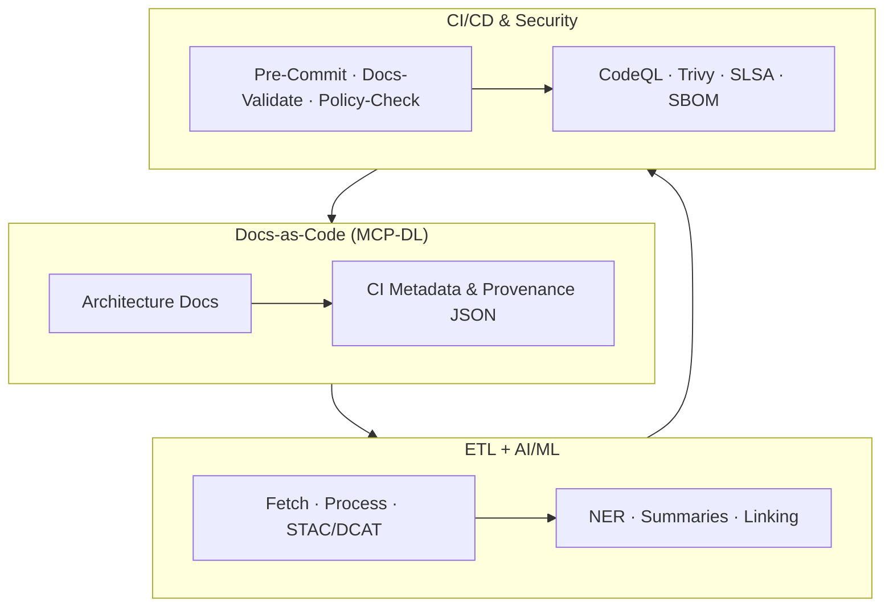
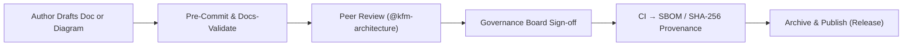
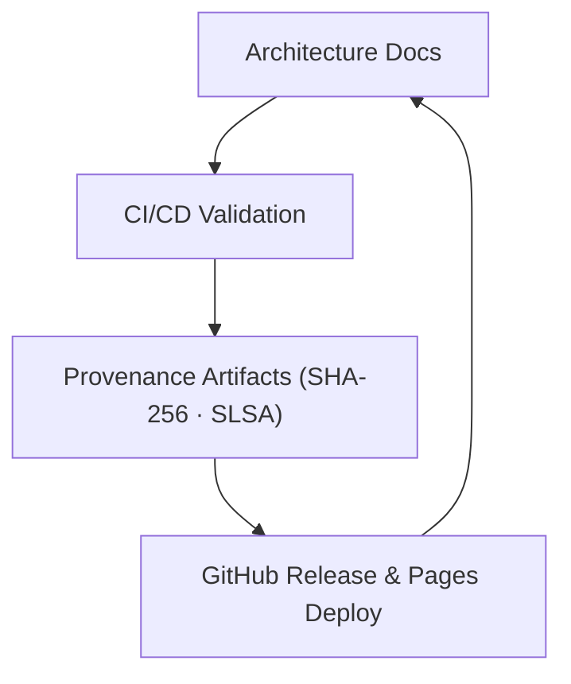

<div align="center">

# 🏛️ **Kansas Frontier Matrix — Architecture Documentation Hub (v2.1.1 · Tier-Ω+∞ Certified)**  
`docs/architecture/README.md`

**Mission:** Define, govern, and preserve the **complete architectural blueprint** of  
**Kansas Frontier Matrix (KFM)** — uniting ETL pipelines, AI enrichment, knowledge graphs, APIs, web interfaces,  
and CI/CD automation under **Master Coder Protocol (MCP-DL)** for full reproducibility, provenance, and FAIR/CARE alignment.

[](../../docs/)
[](../../.github/workflows/stac-validate.yml)
[](../../.github/workflows/codeql.yml)
[](../../.github/workflows/trivy.yml)
[](../../.github/workflows/sbom.yml)
[](../../.github/workflows/slsa.yml)
[](../../.github/workflows/docs-validate.yml)
[](../../LICENSE)

</div>

---

## 🧭 Overview

`docs/architecture/` describes **how the entire KFM ecosystem fits together** — from raw data to AI-driven insights — through **modular, reproducible** components.  
Every architectural decision is versioned, validated in CI, and linked to **provenance** artifacts.

Each document under this directory passes:
- ✅ `docs-validate.yml` (lint, links, front-matter, diagrams)  
- ✅ `policy-check.yml` (required fields & ownership)  
- ✅ Mermaid render test for diagrams (must end with `<!-- END OF MERMAID -->`)  
- ✅ `sbom.yml` (supply-chain completeness / SPDX)  

---

## 🗂️ Directory Layout

```bash
docs/architecture/
├── README.md                        # This index
├── system-architecture-overview.md  # Full-stack blueprint
├── data-architecture.md             # STAC/DCAT lineage & data flow
├── file-architecture.md             # Directory / storage map
├── web-ui-architecture.md           # React + MapLibre frontend
├── api-architecture.md              # FastAPI + GraphQL backend
├── knowledge-graph.md               # Neo4j · CIDOC CRM · OWL-Time
├── pipelines.md                     # ETL + AI/ML orchestration
├── ci-cd.md                         # Automation & governance
├── ai-automation.md                 # AI pipeline integration & gates
├── security.md                      # Threat & policy model
├── adr/                             # Architecture Decision Records
│   ├── ADR-0001-data-storage.md
│   └── ADR-0002-ontology-mapping.md
└── diagrams/
    ├── exported/
    └── templates/
```

---

## 🧮 Architecture + CI/CD Integration Map


<!-- END OF MERMAID -->

---

## 🧱 Core Domains

| Domain | Purpose | Key Doc |
|:--|:--|:--|
| **System** | End-to-end structure overview | `system-architecture-overview.md` |
| **Data** | STAC/DCAT lineage, metadata, storage | `data-architecture.md` |
| **Graph** | Knowledge graph schema & reasoning | `knowledge-graph.md` |
| **API** | FastAPI + GraphQL schema & endpoints | `api-architecture.md` |
| **Web UI** | MapLibre + Timeline + AI Assistant | `web-ui-architecture.md` |
| **AI Automation** | Model governance, bias gates | `ai-automation.md` |
| **Security** | Threats, roles, policy enforcement | `security.md` |
| **CI/CD** | Build, validate, deploy pipelines | `ci-cd.md` |

---

## 🧩 Cross-Component Dependencies

| From | To | Dependency Type | CI Check |
|:--|:--|:--|:--:|
| ETL (`src/pipelines/etl/`) | STAC (`data/stac/`) | Output schema | ✅ |
| STAC | Graph (`src/graph/`) | `derived_from` links | ✅ |
| Graph | API (`src/api/`) | Query contract (Cypher/GraphQL) | ✅ |
| API | Web (`web/src/`) | Typed endpoint interfaces | ✅ |
| Docs | CI (`.github/`) | Policy-check metadata | ✅ |

---

## ⚙️ AI Hooks & Automation

| Workflow | Trigger | Artifact | Purpose |
|:--|:--|:--|:--|
| `ai-model.yml` | Nightly | `metrics.json` · `model_card.md` | Train/evaluate models |
| `fetch.yml` | Weekly CRON | `data/raw/` | Sync datasets |
| `stac-validate.yml` | PR / Push | `stac-report.json` | Validate metadata |
| `policy-check.yml` | PR / Docs | `policy-results.json` | Enforce doc compliance |

---

## 🧠 Risk & Observability Framework

| Category | Risk | Mitigation | Metric |
|:--|:--|:--|:--|
| **Data Lineage** | Broken `derived_from` links | CI STAC validation | lineage_pass ≥ 99% |
| **Reproducibility** | Non-deterministic ETL outputs | Containers + hash locks | checksum_drift = 0 |
| **Performance** | Graph query latency | GraphQL profiling + cache | p95 ≤ 250 ms |
| **Provenance Drift** | Unsigned releases | Signed tags & SLSA attestations | verified_tags = 100% |
| **AI Bias** | Model regression | Bias benchmark suite | bias_score ≤ 0.05 |

---

## ⚖️ FAIR + CARE Integration

| Principle | Implementation | Evidence |
|:--|:--|:--|
| **Findable** | STAC/DCAT crosswalk + docs indexing | `data/stac/catalog.json` |
| **Accessible** | Public metadata; limited sensitive assets | Pages / Zenodo snapshot |
| **Interoperable** | JSON-LD & RDF exports (CIDOC, OWL-Time) | Graph exports |
| **Reusable** | CC-BY 4.0 license; reproducible Makefile | LICENSE · Makefile |
| **Collective Benefit (CARE)** | Indigenous data stewardship notes | `data/stac/*properties.data_ethics` |

---

## 🧾 Front-Matter Policy

Every architecture file **must** declare:

```yaml
---
title: "Component Name"
version: "vX.Y.Z"
last_updated: "YYYY-MM-DD"
owners: ["@kfm-architecture"]
license: "CC-BY 4.0"
---
```

> Missing fields **block merges** via `policy-check.yml`.

---

## 🧩 Governance Workflow


<!-- END OF MERMAID -->

---

## 🔗 ADR & SOP Integration

| Document | Purpose | Location |
|:--|:--|:--|
| **ADR-####** | Record architecture decisions (context, rationale, consequences) | `docs/architecture/adr/` |
| **SOPs** | Repeatable system or pipeline procedures | `docs/templates/sop.md` |
| **Experiments** | Data/model experiment logs | `docs/templates/experiment.md` |

> Each ADR is version-linked to the relevant architecture file and validated via `adr_validate.yml`.

---

## 🧩 Automated Provenance Export

```bash
make export-architecture
```

Creates:

```
artifacts/docs/architecture_provenance.json
artifacts/docs/architecture_checksums.sha256
```

These are attached to releases and retained ≥ 1 year for traceability.

---

## 🧮 Observability Metrics Dashboard

| Metric | Source | Target | Tool |
|:--|:--|:--|:--|
| diagram_validity | docs-validate | 100% | Mermaid CLI |
| metadata_completeness | policy-check | 100% | OPA / Conftest |
| ci_pass_rate | GitHub Actions | ≥ 99% | GH API |
| sbom_provenance | sbom.yml | 100% signed | Syft + Grype |
| ai_bias_score | ai-model.yml | ≤ 0.05 | Bias benchmark |

---

## 🧩 Architecture → CI/CD → Docs Feedback Loop


<!-- END OF MERMAID -->

---

## 🧠 Contribution Checklist

- [ ] Front-matter validated (`make docs-validate`)  
- [ ] Diagram renders (no Mermaid syntax errors)  
- [ ] STAC/DCAT cross-refs accurate  
- [ ] Provenance JSON export runs successfully  
- [ ] Semantic commit (`docs(architecture): …`)  
- [ ] Reviewed by `@kfm-architecture` and `@kfm-docs`  

---

## 🔄 Versioning & Lifecycle

```yaml
versioning:
  policy: "Semantic Versioning (MAJOR.MINOR.PATCH)"
  tag_pattern: "architecture-v*"
  doi_on_major: true
  provenance_bundle:
    - "architecture_provenance.json"
    - "architecture_checksums.sha256"
```

---

## 🕰 Version History

| Version | Date | Summary |
|:--|:--|:--|
| **v2.1.1** | 2025-11-16 | Badge alignment, STAC/DCAT terminology normalization, SBOM/SLSA badge split, and URL normalization. |
| v2.1.0 | 2025-11-16 | Risk & observability framework, ADR/SOP integration, governance diagram, cross-component matrix, AI validation hooks, and provenance exports. |
| v2.0.0 | 2025-11-15 | Refactor: CI integration & metrics tracking. |
| v1.3.0 | 2025-10-20 | Introduced AI automation & security governance references. |
| v1.0.0 | 2025-10-04 | Initial architecture index and baseline structure. |

---

<div align="center">

**Kansas Frontier Matrix © 2025**  
*“Every System has a Story — Every Story has a Provenance.”*  
📍 `docs/architecture/README.md` — Central architectural governance hub for the Kansas Frontier Matrix.

</div>