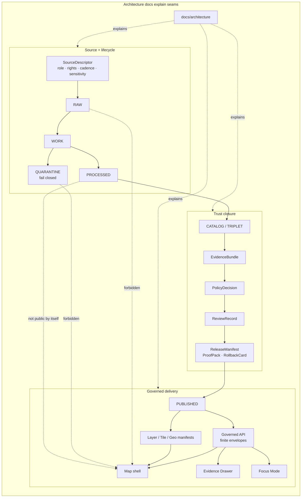

<!-- [KFM_META_BLOCK_V2]
doc_id: kfm://doc/NEEDS-VERIFICATION-docs-architecture-readme
title: Architecture
type: standard
version: v1
status: draft
owners: OWNER_TBD_NEEDS_VERIFICATION
created: NEEDS VERIFICATION
updated: 2026-05-06
policy_label: POLICY_LABEL_TBD_NEEDS_VERIFICATION
related: [../../README.md, ../README.md, ../adr/ADR-0001-schema-home.md, ./contract-schema-policy-split.md, ./governed-api.md, ./governed-ai/README.md, ./tiles/README.md, ../../policy/README.md, ../../apps/web/README.md, ../../apps/web/package.json]
tags: [kfm, architecture, governance, evidence, map-first, time-aware, governed-api, governed-ai, tiles]
notes: [Repo-ready revision for docs/architecture/README.md; mounted workspace had no local Git checkout, but GitHub connector inspection confirmed this path and selected adjacent repo files; owners, created date, policy label, full architecture inventory, CI enforcement, runtime behavior, release proof, and branch protections need maintainer verification]
[/KFM_META_BLOCK_V2] -->

<a id="top"></a>

# Architecture

Cross-cutting architecture home for KFM’s governed, evidence-first, map-first, time-aware system boundaries.


> [!IMPORTANT]
> **Status:** `active` directory / `draft` README  
> **Owners:** `OWNER_TBD_NEEDS_VERIFICATION`  
> **Path:** `docs/architecture/README.md`  
> **Current revision posture:** `CONFIRMED` selected repo paths through GitHub connector inspection; `CONFIRMED` local workspace was not a mounted Git checkout; `UNKNOWN` full implementation depth, CI enforcement, deployed runtime behavior, dashboards, release proof, and branch protections.  
> **Quick jumps:** [Scope](#scope) · [Repo fit](#repo-fit) · [Evidence snapshot](#current-evidence-snapshot) · [Accepted inputs](#accepted-inputs) · [Exclusions](#exclusions) · [Directory map](#directory-map) · [Architecture spine](#architecture-spine) · [Architecture boundaries](#architecture-boundaries) · [Change gates](#change-gates) · [Quickstart](#quickstart) · [Open verification](#open-verification-backlog)

> [!NOTE]
> This README is a repository landing page for architecture review and navigation. It intentionally avoids claiming that routes, schemas, policy gates, tests, workflows, proof packs, dashboards, or runtime behavior exist unless verified from current repo evidence.

---

## Scope

`docs/architecture/` is the human-facing home for **cross-domain system architecture**: the boundaries, flows, diagrams, and decision surfaces that explain how KFM preserves trust from source intake to governed public use.

KFM architecture starts from one operating law:

```text
RAW -> WORK / QUARANTINE -> PROCESSED -> CATALOG / TRIPLET -> PUBLISHED
```

Public clients, normal UI surfaces, map layers, exports, Focus Mode, and AI-assisted responses are downstream of governed evidence, policy, review, release, correction, and rollback state.

This directory should explain the architecture of:

- source-to-publication lifecycle seams;
- governed API and runtime boundaries;
- map shell and renderer boundaries;
- Evidence Drawer and Focus Mode trust surfaces;
- contract/schema/policy split;
- tile, layer, release, and rollback architecture;
- security, local exposure, and no-public-bypass posture;
- cross-domain architecture that applies to more than one lane.

It should not become a bucket for every domain model, emitted artifact, schema, policy rule, fixture, validator, or implementation file.

[Back to top](#top)

---

## Repo fit

| Relationship | Path | Status | Purpose |
|---|---|---:|---|
| This file | `docs/architecture/README.md` | `CONFIRMED path` / revised here | Architecture landing page and navigation surface. |
| Repo landing page | [`../../README.md`](../../README.md) | `CONFIRMED` | Repo-wide KFM purpose, trust law, responsibility roots, object families, and contributor posture. |
| Docs landing page | [`../README.md`](../README.md) | `CONFIRMED` / currently thin | Human-facing documentation root. |
| Schema-home ADR | [`../adr/ADR-0001-schema-home.md`](../adr/ADR-0001-schema-home.md) | `CONFIRMED` / `draft` | Proposed canonical machine-schema authority and contract/schema split. |
| Contract/schema/policy split | [`./contract-schema-policy-split.md`](./contract-schema-policy-split.md) | `CONFIRMED` | Architecture note for contracts as meaning, schemas as shape, and policy as admissibility. |
| Governed API architecture | [`./governed-api.md`](./governed-api.md) | `CONFIRMED` | Trust membrane for public, steward, map, Focus Mode, export, review, and diagnostic clients. |
| Governed AI architecture | [`./governed-ai/README.md`](./governed-ai/README.md) | `CONFIRMED` | AI boundary, Focus Mode, citations, receipts, and finite runtime outcomes. |
| Tile delivery architecture | [`./tiles/README.md`](./tiles/README.md) | `CONFIRMED` | Tile artifacts, layer manifests, release manifests, and renderer delivery boundaries. |
| Policy root | [`../../policy/README.md`](../../policy/README.md) | `CONFIRMED` | Deny-by-default policy posture, rights, sensitivity, review, release, correction, and runtime admissibility. |
| Web shell | [`../../apps/web/README.md`](../../apps/web/README.md) | `CONFIRMED` | Browser-facing map-first shell that renders governed outputs without becoming truth. |
| Web package metadata | [`../../apps/web/package.json`](../../apps/web/package.json) | `CONFIRMED` | Package-level signal for web shell tooling and map/tile dependencies; execution status remains unverified here. |

### Upstream sources

Architecture docs should be grounded in:

- Directory Rules and active ADRs;
- repo inventory and adjacent README conventions;
- contracts, schemas, policies, validators, tests, fixtures, workflows, and release artifacts when present;
- KFM doctrine and domain reports, with implementation claims kept bounded;
- current official standards or source-system research only when facts are version-sensitive or unresolved by project sources.

### Downstream consumers

Architecture docs should help maintainers update or review:

- contracts and schemas;
- policy gates and reason-code families;
- validators, fixtures, and CI checks;
- governed API, runtime, MapLibre, Evidence Drawer, Focus Mode, export, review, and release surfaces;
- runbooks, ADRs, registers, correction procedures, and rollback procedures.

> [!WARNING]
> Architecture prose must not substitute for machine validation, source-rights review, policy evaluation, proof-pack closure, release approval, or rollback readiness.

[Back to top](#top)

---

## Current evidence snapshot

This snapshot records what was checked for this revision. It is not a complete repository audit.

| Evidence area | Status | What it supports | What remains unresolved |
|---|---:|---|---|
| Local mounted repository | `CONFIRMED unavailable` | `/mnt/data` contained uploaded PDFs and no mounted Git checkout in the inspected workspace. | Local branch state, dirty state, local tests, local workflows, local runtime logs. |
| GitHub repository metadata | `CONFIRMED connector inspected` | Repository access and default-branch inspection were available through the GitHub connector. | Branch protections, latest workflow success, deployment settings, runtime status. |
| Existing target file | `CONFIRMED` | `docs/architecture/README.md` exists and already uses KFM Meta Block v2, badges, quick jumps, truth labels, diagrams, and verification backlog conventions. | Maintainer acceptance of this revised text and inbound anchor compatibility. |
| Root README | `CONFIRMED` | Root README defines KFM as governed, evidence-first, map-first, time-aware, and centered on inspectable claims. | Whether root README has moved beyond draft/proposed status. |
| `docs/README.md` | `CONFIRMED thin` | The docs root exists but is currently minimal. | Final documentation-root navigation and owner model. |
| ADR-0001 | `CONFIRMED draft` | Schema-home decision is documented as draft/proposed; `schemas/contracts/v1/` is proposed as machine-schema home. | Whether ADR-0001 is accepted, enforced, or superseded. |
| Governed API docs | `CONFIRMED` | A governed API architecture file exists and links the trust membrane to API, UI, contracts, fixtures, ADRs, and checks. | Full route inventory, test coverage, runtime deployment, and CI enforcement. |
| Governed AI docs | `CONFIRMED` | Governed AI is documented as evidence-subordinate and finite-outcome based. | Model adapters, citation validator execution, and production readiness. |
| Tile docs | `CONFIRMED` | Tile delivery has a documented architecture surface and adjacent tile-manifest docs. | Production release maturity, signing posture, proof-pack closure, and live emitted artifacts. |
| Policy docs | `CONFIRMED` | Policy README defines policy as a deny-by-default decision surface. | Policy-as-code coverage, toolchain, branch protection, and actual enforcement. |
| Web app package | `CONFIRMED file` | `apps/web/package.json` declares `npm@10`, Vite, MapLibre GL, PMTiles, Vitest, and a tile-publisher script. | Dependency install state, test success, build success, deployment, and runtime behavior. |

> [!IMPORTANT]
> File presence is not enforcement proof. A workflow file, package script, schema, validator, or API file can exist without proving branch protection, successful execution, production deployment, or release readiness.

[Back to top](#top)

---

## Accepted inputs

Content belongs in `docs/architecture/` when it describes cross-cutting system design rather than one domain’s isolated data model.

| Accepted input | Belongs here when it explains… | Typical companion homes |
|---|---|---|
| System context | How KFM components relate across source, pipeline, catalog, API, UI, release, correction, and review boundaries. | `docs/`, `control_plane/`, `contracts/` |
| Lifecycle architecture | How material moves through governed stages and what can fail closed. | `pipelines/`, `data/`, `release/`, `policy/` |
| Governed API architecture | How public and internal clients receive finite, evidence-bounded envelopes. | `apps/`, `contracts/api/`, `schemas/contracts/v1/` |
| Map shell architecture | How MapLibre and UI surfaces render released artifacts and inspect trust state. | `apps/web/`, `docs/domains/`, `contracts/runtime/` |
| Governed AI architecture | How Focus Mode, model adapters, citations, and receipts remain subordinate to evidence. | `contracts/runtime/`, `policy/`, `tests/` |
| Tile and layer architecture | How tiles, styles, layer manifests, and releases remain derived and rollback-capable. | `release/`, `data/published/`, `schemas/` |
| Security and exposure architecture | How public, steward, admin, and local/private exposure paths are separated. | `docs/security/`, `infra/`, `configs/` |
| Contract/schema/policy split | Which root owns meaning, shape, admissibility, verification, and emitted proof. | `contracts/`, `schemas/`, `policy/`, `tests/` |
| Architecture decision maps | What decisions require ADRs, registers, compatibility notes, or migration plans. | `docs/adr/`, `docs/registers/` |

---

## Exclusions

| Does not belong here | Why | Preferred home |
|---|---|---|
| Domain-only architecture | Domain burden belongs near domain stewards and lane-specific fixtures. | `docs/domains/<domain>/` |
| Machine schemas | Architecture can reference shape, but should not become validation authority. | `schemas/contracts/v1/` |
| Semantic object contracts | Architecture can link to meaning, but should not fork object definitions. | `contracts/` |
| Policy-as-code | Architecture can explain seams; policy decides admissibility. | `policy/` |
| Validator implementations | Architecture can define gates; tools enforce them. | `tools/validators/`, `tools/`, or `scripts/` after repo convention verification |
| Tests and fixtures | Architecture can define expected proof; tests prove behavior. | `tests/`, `fixtures/` |
| RAW, WORK, QUARANTINE, or unpublished data | Public docs must not expose internal-stage material or create bypass paths. | `data/raw/`, `data/work/`, `data/quarantine/` with access controls |
| Receipts, proof packs, and release manifests as live instances | These are emitted evidence-bearing objects, not architecture prose. | `data/receipts/`, `data/proofs/`, `release/` |
| Secrets, tokens, keys, private endpoints, `.env` values | Architecture must not leak operational credentials. | Secret manager or local ignored configuration |
| Direct model runtime instructions | Runtime facts are version-sensitive and belong behind governed runbooks. | `docs/runbooks/`, `runtime/`, `infra/` after verification |

> [!CAUTION]
> Architecture docs may describe an intended route, DTO, schema, policy gate, or workflow only when the claim is truth-labeled. If current repo evidence is missing, mark it `PROPOSED`, `UNKNOWN`, or `NEEDS VERIFICATION`.

[Back to top](#top)

---

## Directory map

### Architecture surfaces verified for this revision

| Path | Status | Role |
|---|---:|---|
| [`README.md`](./README.md) | `CONFIRMED target` | Architecture landing page. |
| [`contract-schema-policy-split.md`](./contract-schema-policy-split.md) | `CONFIRMED` | Contract/schema/policy responsibility boundary. |
| [`governed-api.md`](./governed-api.md) | `CONFIRMED` | Governed API trust membrane. |
| [`governed-ai/README.md`](./governed-ai/README.md) | `CONFIRMED` | Evidence-subordinate AI and Focus Mode boundary. |
| [`tiles/README.md`](./tiles/README.md) | `CONFIRMED` | Tile delivery architecture and released map-artifact posture. |
| [`tiles/TILE_MANIFEST_SPEC.md`](./tiles/TILE_MANIFEST_SPEC.md) | `CONFIRMED path surfaced` / `contents not fully re-reviewed here` | Tile manifest specification companion. |
| [`tiles/DELTA_UPDATE_MODEL.md`](./tiles/DELTA_UPDATE_MODEL.md) | `CONFIRMED path surfaced` / `contents not fully re-reviewed here` | Tile delta update model companion. |
| [`tiles/GOVERNED_TILE_RELEASE_PUBLISHER.md`](./tiles/GOVERNED_TILE_RELEASE_PUBLISHER.md) | `CONFIRMED path surfaced` / `contents not fully re-reviewed here` | Governed tile release companion. |

### Directory Rules target shape

Directory Rules identify `docs/architecture/` as the home for cross-cutting system design. A mature architecture directory may grow toward this shape after repo conventions, ADRs, and inbound links are checked:

```text
docs/
└── architecture/
    ├── README.md
    ├── system-context.md                    # PROPOSED target from Directory Rules
    ├── deployment-topology.md               # PROPOSED target from Directory Rules
    ├── governed-api.md
    ├── map-shell.md                         # PROPOSED target from Directory Rules
    ├── contract-schema-policy-split.md
    ├── governed-ai/
    │   └── README.md
    └── tiles/
        ├── README.md
        ├── TILE_MANIFEST_SPEC.md
        ├── DELTA_UPDATE_MODEL.md
        └── GOVERNED_TILE_RELEASE_PUBLISHER.md
```

> [!IMPORTANT]
> New files in this directory should be cross-domain. Domain-specific architecture usually belongs under `docs/domains/<domain>/` or the repo-native domain-lane convention.

[Back to top](#top)

---

## Architecture spine


```mermaid
flowchart LR
  subgraph Intake["Source + lifecycle"]
    S[SourceDescriptor<br/>role · rights · cadence · sensitivity] --> RAW[RAW]
    RAW --> W[WORK]
    W --> Q[QUARANTINE<br/>fail closed]
    W --> P[PROCESSED]
  end

  subgraph Trust["Trust closure"]
    P --> C[CATALOG / TRIPLET]
    C --> EB[EvidenceBundle]
    EB --> POL[PolicyDecision]
    POL --> REV[ReviewRecord]
    REV --> REL[ReleaseManifest<br/>ProofPack · RollbackCard]
  end

  subgraph Delivery["Governed delivery"]
    REL --> PUB[PUBLISHED]
    PUB --> API[Governed API<br/>finite envelopes]
    PUB --> LAYERS[Layer / Tile / Geo manifests]
    API --> UI[Map shell]
    LAYERS --> UI
    API --> DRAWER[Evidence Drawer]
    API --> FOCUS[Focus Mode]
  end

  subgraph Docs["Architecture docs explain seams"]
    ARCH[docs/architecture] -. explains .-> Intake
    ARCH -. explains .-> Trust
    ARCH -. explains .-> Delivery
  end

  RAW -. forbidden .-> UI
  Q -. forbidden .-> UI
  P -. not public by itself .-> UI
```

### Reading the diagram

Architecture docs explain the seams. They do not perform the seams.

- `SourceDescriptor` admits and constrains source use.
- `EvidenceBundle` resolves support for claims.
- `PolicyDecision` and review state decide whether exposure is allowed.
- `ReleaseManifest`, `ProofPack`, and `RollbackCard` make publication reversible.
- Governed APIs and released artifacts feed UI and runtime surfaces.
- Map shells, tiles, summaries, search indexes, graph projections, and AI answers remain downstream carriers.

[Back to top](#top)

---

## Architecture boundaries

| Boundary | Architecture rule | Failure mode to reject |
|---|---|---|
| Source → RAW | Capture source identity, role, rights, cadence, sensitivity, and retrieval context before downstream use. | Treating a downloaded file or API result as public truth. |
| WORK → QUARANTINE | Unsafe, unclear, conflicted, invalid, or rights-unclear material fails closed. | Smoothing uncertainty into normal processing. |
| PROCESSED → CATALOG / TRIPLET | Catalogs and graph projections are derived closure surfaces. | Making graph/search projection sovereign truth. |
| EvidenceRef → EvidenceBundle | Claims resolve to inspectable evidence or abstain. | Bare citation strings or unsupported summaries. |
| Policy → Release | Rights, sensitivity, review, proof, correction, and rollback are required before publication. | Publication as a copy, tile upload, route toggle, or model answer. |
| Release → API/UI | Public clients use governed APIs and released artifacts only. | Browser/UI direct access to raw, work, quarantine, canonical, or model-runtime paths. |
| Renderer boundary | MapLibre renders released artifacts and interaction state. | Renderer as policy, publication, citation, or truth authority. |
| AI boundary | AI interprets resolved evidence behind governed API. | Detached chatbot, direct model endpoint, or AI-only proof. |

---

## Architecture inventory checklist

Use this table when proposing a new architecture document or changing an existing one.

| Check | Required answer |
|---|---|
| Owning root | Why does this belong in `docs/architecture/` instead of `docs/domains/`, `contracts/`, `schemas/`, `policy/`, `tests/`, or `apps/`? |
| Directory Rules basis | What responsibility-root rule justifies the path? |
| Upstream evidence | Which docs, ADRs, code files, schemas, policies, tests, workflows, or source artifacts support it? |
| Downstream impact | Which contracts, schemas, policies, tests, apps, packages, data artifacts, releases, or runbooks need updates? |
| Truth labels | Which claims are `CONFIRMED`, `PROPOSED`, `UNKNOWN`, or `NEEDS VERIFICATION`? |
| Public exposure | Could this change affect public claims, map surfaces, exported artifacts, Focus Mode, or Evidence Drawer? |
| Evidence closure | Does the change preserve `EvidenceRef -> EvidenceBundle` resolution where claims depend on evidence? |
| Policy and sensitivity | Does the change alter rights, sensitivity, review, release, correction, or rollback posture? |
| Validation | What repo-native validation or review was run? What remains unrun? |
| Rollback | How does a maintainer revert or supersede the change without losing lineage? |

[Back to top](#top)

---

## Change gates

A non-trivial architecture change is ready for review when it satisfies the gates below.

- [ ] The target file path follows Directory Rules and nearby repo conventions.
- [ ] Existing adjacent docs and stable anchors were checked before rewriting.
- [ ] The change does not create a parallel schema, contract, policy, source, release, proof, receipt, or fixture authority.
- [ ] Material implementation claims are backed by repo evidence or explicitly labeled.
- [ ] Cross-domain architecture is separated from domain-lane burden.
- [ ] Public clients remain behind governed APIs and released artifacts.
- [ ] `EvidenceRef -> EvidenceBundle` resolution is preserved for claim-bearing flows.
- [ ] Policy, sensitivity, review, release, correction, and rollback impacts are documented.
- [ ] Mermaid diagrams reflect real responsibility boundaries, not decorative flow.
- [ ] Links are relative and checked from `docs/architecture/`.
- [ ] If behavior changes materially, companion docs, ADRs, schemas, policies, tests, or runbooks are updated or listed as follow-up.
- [ ] Rollback or supersession path is named.

> [!TIP]
> The right first architecture PR is usually not broad polish. It is a small alignment change that makes a trust seam easier to verify.

---

## Quickstart

Use these commands from a real checkout before reviewing architecture claims.

```bash
# Confirm repo state.
git status --short
git branch --show-current
git rev-parse --show-toplevel

# Inspect architecture and adjacent governance surfaces.
find docs/architecture docs/adr docs/registers docs/runbooks docs/domains \
  -maxdepth 4 -type f 2>/dev/null | sort

# Inspect trust-bearing implementation surfaces that architecture docs may reference.
find contracts schemas policy tests fixtures tools apps packages data release \
  -maxdepth 3 -type f 2>/dev/null | sort | sed -n '1,300p'

# Search for recurring KFM trust objects.
grep -RInE "EvidenceBundle|EvidenceRef|DecisionEnvelope|RuntimeResponseEnvelope|SourceDescriptor|ReleaseManifest|RollbackCard|LayerManifest|Focus Mode|Evidence Drawer" \
  docs contracts schemas policy tests fixtures tools apps packages data release 2>/dev/null | head -120
```

Run repo-native docs, link, schema, policy, and test commands if they exist. Do not report tests, workflows, validators, or release gates as passing unless they actually ran on the current checkout.

[Back to top](#top)

---

## Maintainer notes

### Naming

Use precise KFM terms already established in the repo and corpus:

- `EvidenceRef`
- `EvidenceBundle`
- `SourceDescriptor`
- `PolicyDecision`
- `DecisionEnvelope`
- `RuntimeResponseEnvelope`
- `RunReceipt`
- `AIReceipt`
- `ProofPack`
- `ReleaseManifest`
- `PromotionDecision`
- `CorrectionNotice`
- `RollbackCard`
- `LayerManifest`
- `GeoManifest`
- `Evidence Drawer`
- `Focus Mode`

Do not silently replace project terms with generic platform language.

### Links

Prefer relative links from `docs/architecture/README.md`. Use placeholders only when the path is not verified.

### Diagrams

Use Mermaid when the diagram clarifies responsibility boundaries, lifecycle, or trust seams. Avoid decorative diagrams that imply implementation depth.

### Metadata

Use KFM Meta Block v2 for standard docs unless an accepted repo convention says otherwise. Keep the visible title and metadata title synchronized.

---

## FAQ

### Is `docs/architecture/` canonical truth?

It is canonical human-facing architecture documentation when accepted and maintained. It is not machine-schema authority, policy-as-code, release proof, or runtime evidence.

### Can domain architecture live here?

Only if it is genuinely cross-domain. Lane-specific architecture usually belongs under `docs/domains/<domain>/` or the repo-native domain structure.

### Can this directory document proposed routes or DTOs?

Yes, when clearly labeled `PROPOSED` or `NEEDS VERIFICATION`. Route names, DTOs, package choices, workflow names, and runtime behavior must not be presented as current fact without repo evidence.

### What makes an architecture doc publishable?

It must preserve KFM trust law, link to upstream/downstream surfaces, separate confirmed implementation from proposed design, name validation and rollback, and avoid creating parallel authority.

---

## Open verification backlog

| Item | Status | How to close |
|---|---:|---|
| Owners for `docs/architecture/` | `NEEDS VERIFICATION` | Check `CODEOWNERS`, document registry, or maintainer assignment. |
| Created date for this README | `NEEDS VERIFICATION` | Confirm from git history or document registry. |
| Policy label | `NEEDS VERIFICATION` | Confirm with document registry or policy-label standard. |
| Full architecture directory inventory | `NEEDS VERIFICATION` | Run a complete repo tree scan in the target checkout. |
| Anchor compatibility | `NEEDS VERIFICATION` | Check inbound links before merge. |
| Link validity | `NEEDS VERIFICATION` | Run repo-native markdown/link checks. |
| CI enforcement | `UNKNOWN` | Inspect `.github/workflows/` and branch protections. |
| Runtime behavior | `UNKNOWN` | Verify through source code, tests, logs, dashboards, or emitted artifacts. |
| Release/proof object existence | `UNKNOWN` | Inspect `release/`, `data/proofs/`, `data/receipts/`, CI outputs, and generated artifacts. |
| Schema-home ADR status | `draft / NEEDS VERIFICATION` | Confirm whether ADR-0001 has been accepted, superseded, or remains proposed. |
| Tile subdoc contents | `NEEDS VERIFICATION` | Re-review tile subdocs before claiming contents beyond surfaced paths. |

[Back to top](#top)

---

<details>
<summary>Appendix A — Pre-publish checklist</summary>

- [ ] KFM Meta Block v2 present and reviewable.
- [ ] One H1 only.
- [ ] One-line purpose directly under the title.
- [ ] Impact block includes status, owners, badges, and quick jumps.
- [ ] Repo fit includes path and upstream/downstream links.
- [ ] Accepted inputs and exclusions are explicit.
- [ ] Directory map is grounded and truth-labeled.
- [ ] Mermaid diagram reflects KFM lifecycle and trust boundaries.
- [ ] Tables clarify boundaries, not decorative content.
- [ ] Quickstart commands are safe and marked as requiring a real checkout.
- [ ] Definition-of-done gates are present.
- [ ] Long appendix content is collapsed.
- [ ] No unsupported implementation, CI, test, route, or runtime claims.
- [ ] Remaining unknowns are visible.

</details>

<details>
<summary>Appendix B — Architecture review card</summary>

Use this in PR descriptions for substantial architecture changes.

```markdown
## Architecture review card

Goal:

Target path:

Owning root:
- [ ] docs/architecture
- [ ] other:

Directory Rules basis:

Upstream evidence:
- Docs:
- ADRs:
- Code/config:
- Contracts/schemas:
- Policy:
- Tests/fixtures:
- Workflows/artifacts:

Truth labels:
- CONFIRMED:
- PROPOSED:
- UNKNOWN:
- NEEDS VERIFICATION:

Affected surfaces:
- Contracts:
- Schemas:
- Policy:
- Tests/fixtures:
- Apps/packages:
- Data/release/proofs:
- UI/API/AI:
- Security:

Public exposure possible?
- [ ] yes
- [ ] no

EvidenceRef/EvidenceBundle impact:

Release/correction/rollback impact:

Validation run:

Rollback or supersession plan:
```

</details>

[Back to top](#top)
