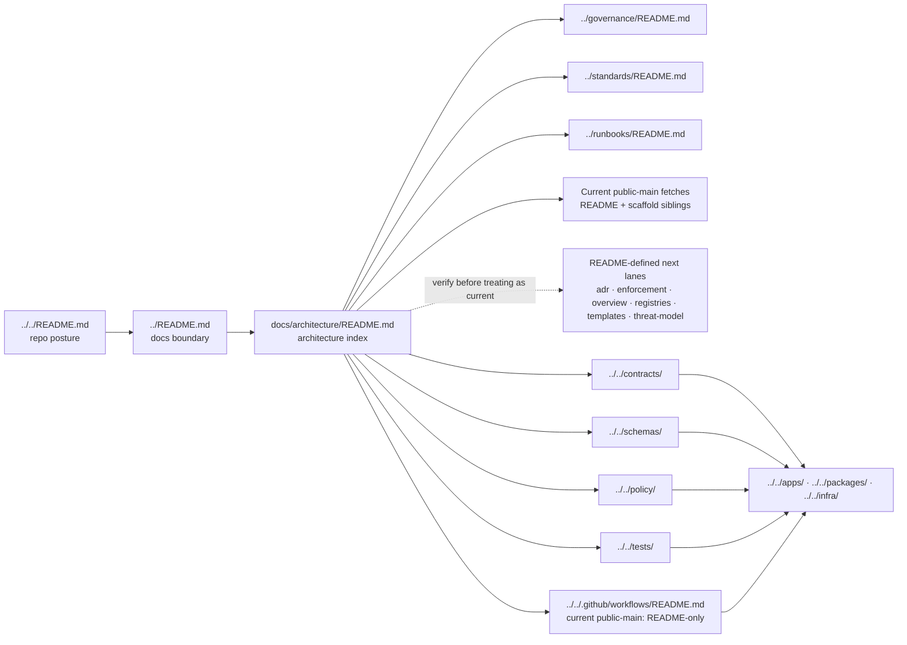

<!-- [KFM_META_BLOCK_V2]
doc_id: kfm://doc/<uuid-NEEDS-VERIFICATION>
title: Architecture
type: standard
version: v1
status: review
owners: @bartytime4life
created: YYYY-MM-DD
updated: YYYY-MM-DD
policy_label: NEEDS VERIFICATION
related: [../../README.md, ../README.md, ../governance/README.md, ../standards/README.md, ../runbooks/README.md, ../templates/README.md, ../../contracts/, ../../policy/, ../../schemas/, ../../tests/, ../../.github/workflows/README.md]
tags: [kfm, architecture, trust-membrane, truth-path, evidence-first]
notes: [doc_id, dates, and policy_label still need repo verification before commit; owners are confirmed from ../../.github/CODEOWNERS; current public main shows docs/architecture as a mixed surface of one substantive index plus multiple scaffold placeholders]
[/KFM_META_BLOCK_V2] -->

# Architecture

System-level architecture law, boundary map, and navigation hub for Kansas Frontier Matrix (KFM).

> **Status:** experimental  
> **Owners:** `@bartytime4life`  
> **Repo fit:** `docs/architecture/README.md` → upstream [`../README.md`](../README.md), [`../../README.md`](../../README.md) · adjacent [`../governance/README.md`](../governance/README.md), [`../standards/README.md`](../standards/README.md), [`../runbooks/README.md`](../runbooks/README.md), [`../templates/README.md`](../templates/README.md)  
>        
> **Quick jumps:** [Scope](#scope) · [Repo fit](#repo-fit) · [Inputs](#inputs) · [Exclusions](#exclusions) · [Current public-main snapshot](#current-public-main-snapshot) · [Directory tree](#directory-tree) · [Quickstart](#quickstart) · [Usage](#usage) · [Diagram](#diagram) · [Reference tables](#reference-tables) · [Task list](#task-list) · [FAQ](#faq) · [Appendix](#appendix)

> [!IMPORTANT]
> `docs/architecture/` should explain boundary law without overstating implementation maturity.
> On current public `main`, this surface is a mix of a substantive directory index and scaffold placeholders.
> Review, linking, and change planning should keep those states visibly separate.

## Scope

`docs/architecture/` is the system-level documentation home for KFM’s architectural laws and cross-cutting boundaries: the trust membrane, truth path lifecycle, authoritative-versus-derived split, governed API posture, runtime proof obligations, and the map-first, time-aware product shell.

This README is intentionally conservative. It should help a reviewer answer four questions quickly:

1. What architectural laws are non-negotiable?
2. What does current public `main` actually show here today?
3. Which architecture lanes are still target-shape or scaffold-level rather than fully filled?
4. What else must move when architecture changes?

### Truth posture used here

| Marker | Meaning in this README |
|---|---|
| `CONFIRMED` | Directly supported by current public-repo fetches or stable KFM doctrine |
| `INFERRED` | Strongly suggested by adjacent repo docs or repeated doctrine, but not directly re-fetched as current tree fact in this pass |
| `PROPOSED` | Doctrine-consistent repo shape, practice, or next step not yet proven as current implementation reality |
| `UNKNOWN` | Not verified strongly enough to present as current fact |
| `NEEDS VERIFICATION` | Placeholder value, ownership detail, or file/tree claim that should be checked before merge |

[Back to top](#architecture)

## Repo fit

| Field | Value |
|---|---|
| Path | `docs/architecture/README.md` |
| Directory role | Architecture index for system boundaries, trust rules, lifecycle law, and architecture-adjacent references |
| Primary upstream anchors | [`../../README.md`](../../README.md), [`../README.md`](../README.md), [`../governance/README.md`](../governance/README.md), [`../standards/README.md`](../standards/README.md), [`../runbooks/README.md`](../runbooks/README.md), [`../templates/README.md`](../templates/README.md) |
| Architecture-adjacent machine surfaces | [`../../contracts/`](../../contracts/), [`../../schemas/`](../../schemas/), [`../../policy/`](../../policy/), [`../../tests/`](../../tests/), [`../../.github/workflows/README.md`](../../.github/workflows/README.md) |
| Current public-main posture | One substantive directory README plus a wider belt of scaffold files and README-first adjacent control lanes |
| Why this directory matters | It keeps KFM’s system laws legible without creating a second truth path or quietly upgrading placeholders into architecture reality |

### Repo relationship map

Architecture docs sit between doctrine and execution:

- repo root explains **project identity and top-level posture**
- `docs/` explains the **documentation system**
- `docs/architecture/` explains **system law and boundary logic**
- `contracts/`, `policy/`, `schemas/`, `tests/`, and `.github/workflows/` express **machine-facing proof and control surfaces**
- `apps/`, `packages/`, and `infra/` implement or run the governed runtime

[Back to top](#architecture)

## Inputs

Content that belongs here includes:

- system context and boundary documents
- trust-membrane, truth-path, and authoritative-versus-derived design notes
- deployment topology and runtime-boundary docs
- architecture diagrams that explain flows, write-rights, and enforcement points
- ADRs and decision records for architecture-significant changes
- interface registries, threat models, and architecture-facing contract pointers
- cross-cutting architecture guidance that affects more than one service, product surface, or dataset lane
- explicit path-reservation docs that are still scaffold-level, so long as they stay labeled honestly

## Exclusions

The following do **not** belong here as their authoritative home:

| Do not put this here | Keep it instead |
|---|---|
| Policy rule bodies, obligation logic, deny-by-default fixtures, runtime decision code | [`../../policy/`](../../policy/) |
| Canonical machine contracts, OpenAPI, JSON Schemas, vocabularies, runtime envelopes | [`../../contracts/`](../../contracts/) and [`../../schemas/`](../../schemas/) |
| Runtime service code, workers, UI components, adapters | [`../../apps/`](../../apps/) and [`../../packages/`](../../packages/) |
| Merge-blocking workflow logic itself | [`../../.github/workflows/`](../../.github/workflows/) |
| Proof objects, manifests, receipts, release artifacts as live outputs | governed data / release / evidence surfaces |
| Secrets, credentials, production-only access instructions | approved secret-management and runtime configuration surfaces |
| Single-service implementation tutorials | service-local docs or [`../runbooks/README.md`](../runbooks/README.md) if operational |
| Prose that silently upgrades scaffold placeholders into “implemented architecture” | keep the placeholder visible or fill the file properly in the same change stream |

## Current public-main snapshot

Current public `main` is useful, but it is not flat. Some architecture paths are live only as placeholders created to reserve structure. That distinction matters.

### Directly fetched current surface

| Surface | Status | Current reading | Working use today |
|---|---|---|---|
| `README.md` | `CONFIRMED` | substantive directory index and boundary map | primary architecture navigation file |
| `SYSTEM_CONTEXT.md`, `TRUST_MEMBRANE.md`, `trust_membrane.md`, `TRUTH_PATH_LIFECYCLE.md`, `DEPLOYMENT_TOPOLOGY.md`, `canonical_vs_rebuildable.md`, `system_overview.md` | `CONFIRMED` | scaffold placeholders | reserved paths, not yet authoritative architecture law |
| `decisions/README.md`, `diagrams/README.md`, `interfaces/README.md` | `CONFIRMED` | scaffold directory readmes | starter lanes for future architecture material |
| `adr/`, `enforcement/`, `overview/`, `registries/`, `templates/`, `threat-model/` | `INFERRED` / `NEEDS VERIFICATION` | named by the current architecture README or older doctrine, but not all directly re-fetched in this pass | verify in a live checkout before treating as current tree fact |

### Architecture-adjacent surface maturity

| Surface | Current public-main signal | Why architecture should care |
|---|---|---|
| [`../../.github/workflows/README.md`](../../.github/workflows/README.md) | README-only; no checked-in workflow YAML visible on current public `main` | do not describe merge-blocking automation as already present |
| [`../../contracts/README.md`](../../contracts/README.md) | contract lane is documented, but schema-home authority remains unresolved | architecture changes should point to contracts without pretending the lattice is already executable |
| [`../../schemas/README.md`](../../schemas/README.md) | boundary guide exists; current public inventory is README-only | keep one schema authority, not two competing lanes |
| [`../../policy/README.md`](../../policy/README.md) | policy lane is documented; executable bundles and fixtures remain target state | architecture docs should keep policy implementation claims bounded |
| [`../../tests/README.md`](../../tests/README.md) | governed verification README exists | behavior-significant changes should name proof burden even when test inventory is still maturing |
| [`../../tools/README.md`](../../tools/README.md) and [`../../scripts/README.md`](../../scripts/README.md) | README-first helper lanes | useful supporting surfaces, but not substitutes for real workflow or runtime enforcement |

> [!NOTE]
> The highest-risk documentation failure here is **trust theater**: a file tree or table that sounds implemented because the names are strong, even when the current branch still shows placeholder content.

[Back to top](#architecture)

## Directory tree

### Directly fetched current public-main surface

```text
docs/architecture/
├── README.md
├── SYSTEM_CONTEXT.md
├── TRUST_MEMBRANE.md
├── TRUTH_PATH_LIFECYCLE.md
├── DEPLOYMENT_TOPOLOGY.md
├── canonical_vs_rebuildable.md
├── system_overview.md
├── trust_membrane.md
├── decisions/
│   └── README.md
├── diagrams/
│   └── README.md
└── interfaces/
    └── README.md
```

### README-defined or doctrine-referenced growth surface

```text
docs/architecture/
├── adr/                # NEEDS VERIFICATION
├── enforcement/        # NEEDS VERIFICATION
├── overview/           # NEEDS VERIFICATION
├── registries/         # NEEDS VERIFICATION
├── templates/          # NEEDS VERIFICATION
└── threat-model/       # NEEDS VERIFICATION
```

### Working interpretation rule

- a **directly fetched scaffold file** is a real path reservation, not a completed architecture document
- a **README-defined lane** is a useful navigation expectation, not current tree truth until re-fetched
- architecture docs should never blur those two states

## Quickstart

Use a verification-first reading sequence before editing anything under `docs/architecture/`.

```bash
# 1) Confirm the real subtree first
find docs/architecture -maxdepth 3 \( -type f -o -type d \) | sort

# 2) Read the architecture index and the docs boundary around it
sed -n '1,260p' docs/architecture/README.md
sed -n '1,220p' docs/README.md
sed -n '1,220p' docs/governance/README.md
sed -n '1,220p' docs/standards/README.md
sed -n '1,220p' docs/runbooks/README.md

# 3) Re-check machine-facing neighbors before claiming enforcement
sed -n '1,220p' contracts/README.md
sed -n '1,220p' schemas/README.md
sed -n '1,220p' policy/README.md
sed -n '1,220p' tests/README.md
sed -n '1,220p' .github/workflows/README.md

# 4) Inspect sibling architecture files for scaffold vs substantive content
for f in docs/architecture/*.md; do
  printf '\n=== %s ===\n' "$f"
  sed -n '1,40p' "$f"
done
```

### Starting a new architecture note

```bash
cp docs/templates/TEMPLATE__KFM_UNIVERSAL_DOC.md docs/architecture/<topic>.md
sed -n '1,120p' docs/architecture/<topic>.md
```

> [!WARNING]
> Current public `main` also exposes `docs/templates/TEMPLATE__KFM_UNIVERSAL_DOC.md` as a scaffold placeholder.
> Use the path, but do not assume a fully authored template body is already in place.

[Back to top](#architecture)

## Usage

### Reading order for reviewers

1. Read this file for boundary law and current public-main maturity.
2. Read [`../README.md`](../README.md) for the broader docs boundary.
3. Read [`../governance/README.md`](../governance/README.md), [`../standards/README.md`](../standards/README.md), and [`../runbooks/README.md`](../runbooks/README.md) before treating an architecture change as purely local.
4. Read sibling architecture files next, but treat scaffold placeholders as path reservations until they are filled.
5. When a claim sounds enforceable, re-check [`../../contracts/`](../../contracts/), [`../../policy/`](../../policy/), [`../../tests/`](../../tests/), and [`../../.github/workflows/README.md`](../../.github/workflows/README.md).

### Reading order for authors

1. Verify the live subtree you are about to change.
2. Decide whether you are updating:
   - the **index surface** (`README.md`)
   - a **scaffold placeholder** that should become authoritative
   - a **new architecture lane** that still needs explicit verification
3. Keep tree claims conservative unless the current branch proves them.
4. Update links, tables, and diagrams when path shape changes.
5. When behavior changes, move related docs, contracts, policy, tests, and workflow notes in the same governed stream.

### When an architecture change is governed

Treat the change as governed when it affects any of the following:

- trust membrane or client/store separation
- lifecycle zones or promotion gates
- evidence resolution or citation behavior
- authoritative-versus-derived rules
- runtime boundary posture, deployment topology, or exposure model
- sensitivity handling, geometry generalization, or public-safe location behavior
- scaffold-to-authority promotion of a previously placeholder architecture file

## Diagram


```mermaid
flowchart LR
  Root["../../README.md<br/>repo posture"] --> Docs["../README.md<br/>docs boundary"]
  Docs --> Arch["docs/architecture/README.md<br/>architecture index"]

  Arch --> Gov["../governance/README.md"]
  Arch --> Std["../standards/README.md"]
  Arch --> Run["../runbooks/README.md"]

  Arch --> Fetched["Current public-main fetches<br/>README + scaffold siblings"]
  Arch -. verify before treating as current .-> Growth["README-defined next lanes<br/>adr · enforcement · overview · registries · templates · threat-model"]

  Arch --> Contracts["../../contracts/"]
  Arch --> Schemas["../../schemas/"]
  Arch --> Policy["../../policy/"]
  Arch --> Tests["../../tests/"]
  Arch --> Workflows["../../.github/workflows/README.md<br/>current public-main: README-only"]

  Contracts --> Runtime["../../apps/ · ../../packages/ · ../../infra/"]
  Schemas --> Runtime
  Policy --> Runtime
  Tests --> Runtime
  Workflows --> Runtime
```

This directory is the bridge between KFM doctrine and repo execution, but it is also a reminder that **named paths are not the same thing as filled architecture content**.

[Back to top](#architecture)

## Reference tables

### KFM architecture laws this README keeps visible

| Law | Minimum architectural implication |
|---|---|
| Trust membrane | clients and public surfaces do not bypass the governed API / policy boundary |
| Truth path | promoted runtime surfaces stay downstream of `Source edge → RAW → WORK / QUARANTINE → PROCESSED → CATALOG / TRIPLET → PUBLISHED` |
| Authoritative vs derived | search, graph, tiles, summaries, scenes, and other projections do not silently become sovereign truth |
| Cite-or-abstain | consequential user-facing claims resolve to evidence or abstain |
| Fail-closed posture | missing rights, broken catalogs, unresolved citations, or absent policy should block promotion and release |
| Docs as production surface | behavior-significant changes update docs in the same governed change stream |
| Placeholder honesty | scaffold files stay visibly scaffold-level until they are replaced with substantive content |

### Architecture change matrix

| Change type | Examples | Required coordinated updates |
|---|---|---|
| Boundary change | new API edge, auth change, direct-store exception | contracts, policy, tests, architecture docs, workflow notes |
| Lifecycle change | new zone, new gate, new promotion rule | lifecycle docs, receipt/manifest expectations, release checks |
| Policy-sensitive change | new `policy_label`, new obligation, new withholding rule | governance docs, policy fixtures/tests, sign-off path |
| Derived-layer change | new index, graph, tile, scene, or cache surface | authoritative-versus-derived docs, rebuild plan, stale-state handling |
| Runtime topology change | new exposure path, new deployment posture, new AI runtime seam | infra docs, runbooks, rollback plan, verification notes |
| Scaffold promotion | replacing a placeholder file with real law or design content | Meta Block v2, real owners/dates, adjacent README links, proof burden, tree refresh |

### Architecture review cues for current public `main`

| Review cue | Why it matters |
|---|---|
| A path exists but contains only a scaffold line | the file is a reservation, not yet architecture authority |
| `.github/workflows/` is README-only on public `main` | do not imply merge-blocking workflow coverage is already checked in |
| `contracts/` and `schemas/` both exist | keep schema authority singular and explicit |
| `policy/`, `tests/`, `tools/`, and `scripts/` are README-first lanes | helpful structure exists, but public implementation depth is still bounded |

[Back to top](#architecture)

## Task list

### Definition of done for architecture changes

- [ ] This README is updated if the trust membrane, truth path, directory surface, or architecture contracts changed.
- [ ] Any newly substantive architecture file gets a KFM Meta Block v2 and stops pretending to be a scaffold.
- [ ] README-defined target lanes and directly fetched current lanes are kept visibly separate.
- [ ] Contracts, policy fixtures, tests, and workflow notes are updated where the change is enforceable.
- [ ] Reversible migration / rollback thinking is documented when runtime behavior changes.
- [ ] Security, privacy, and sensitive-location implications are reviewed.
- [ ] Any new `UNKNOWN`, `INFERRED`, or `NEEDS VERIFICATION` claim includes a concrete recheck step.

### High-value cleanup visible now

- [ ] Decide whether `TRUST_MEMBRANE.md` and `trust_membrane.md` are intentional peers or casing drift.
- [ ] Retire scaffold placeholders in dependency order: `SYSTEM_CONTEXT` → `TRUST_MEMBRANE` → `TRUTH_PATH_LIFECYCLE` → `DEPLOYMENT_TOPOLOGY` → `canonical_vs_rebuildable`.
- [ ] Fill the `docs/templates/` lane so the architecture quickstart points to a substantive reusable template.
- [ ] Reconcile this README’s target-surface language with the live subtree whenever a new architecture lane is actually added.

## FAQ

### Why does this README distinguish “current public-main fetches” from “README-defined target surface”?

Because those are not the same thing. KFM architecture docs should not let a strong intended shape masquerade as completed current reality.

### Are scaffold files safe to cite as architecture authority?

No. They are safe to cite as **reserved paths** or **planned lanes**, but not as filled doctrine until they contain substantive content.

### Why keep both `TRUST_MEMBRANE.md` and `trust_membrane.md` visible?

Because both paths currently resolve in public-main fetches. Consolidate only after confirming whether the casing split is intentional.

### Does this README prove merge-blocking automation already exists?

No. Current public `main` shows `.github/workflows/README.md`, but not checked-in workflow YAML in that directory.

### Do new architecture docs need Meta Block v2?

Yes. Start with the universal template path, but verify whether the template body itself is still scaffold-level before relying on it.

[Back to top](#architecture)

## Appendix

<details>
<summary>Appendix — directly fetched paths and authoring guardrails</summary>

### Directly fetched current public-main paths used in this README

- `docs/architecture/README.md`
- `docs/architecture/SYSTEM_CONTEXT.md`
- `docs/architecture/TRUST_MEMBRANE.md`
- `docs/architecture/trust_membrane.md`
- `docs/architecture/TRUTH_PATH_LIFECYCLE.md`
- `docs/architecture/DEPLOYMENT_TOPOLOGY.md`
- `docs/architecture/canonical_vs_rebuildable.md`
- `docs/architecture/system_overview.md`
- `docs/architecture/decisions/README.md`
- `docs/architecture/diagrams/README.md`
- `docs/architecture/interfaces/README.md`

### Architecture authoring rules worth keeping close

1. **Index honestly.** README files may describe target shape, but they should never erase the difference between placeholder and filled content.
2. **Link downstream to enforcement.** When a rule sounds executable, point readers to contracts, policy, tests, or workflow surfaces.
3. **Promote in dependency order.** Fill system context and trust law before low-level topology or optional visualization lanes.
4. **Do not let case drift become doctrine.** If two near-identical filenames exist, resolve intent before blessing one as canonical.
5. **Update the tree when the tree changes.** The snapshot table is part of the working system, not decorative prose.

### Minimal verification steps before merging a major architecture edit

```bash
# confirm subtree and adjacent control lanes
find docs/architecture -maxdepth 3 \( -type f -o -type d \) | sort
find .github/workflows contracts schemas policy tests -maxdepth 2 -type f 2>/dev/null | sort

# inspect ownership
sed -n '1,200p' .github/CODEOWNERS

# check for scaffold placeholders that should be retired or preserved explicitly
grep -RIn "Scaffold" docs/architecture docs/templates 2>/dev/null || true

# re-read the docs boundary before writing stronger claims
sed -n '1,220p' docs/README.md
sed -n '1,220p' docs/architecture/README.md
```

</details>

[Back to top](#architecture)
