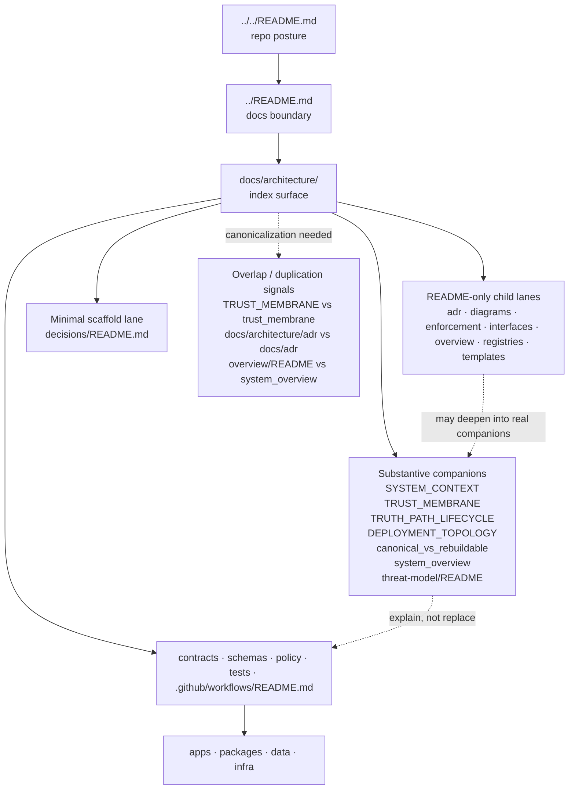

<!-- [KFM_META_BLOCK_V2]
doc_id: kfm://doc/<uuid-NEEDS-VERIFICATION>
title: Architecture
type: standard
version: v1
status: review
owners: @bartytime4life
created: YYYY-MM-DD
updated: YYYY-MM-DD
policy_label: NEEDS-VERIFICATION
related: [../../README.md, ../README.md, ./TRUST_MEMBRANE.md, ./TRUTH_PATH_LIFECYCLE.md, ./SYSTEM_CONTEXT.md, ./DEPLOYMENT_TOPOLOGY.md, ./canonical_vs_rebuildable.md, ./system_overview.md, ./threat-model/README.md, ../adr/README.md, ../../contracts/README.md, ../../policy/README.md, ../../schemas/README.md, ../../tests/README.md, ../../.github/workflows/README.md]
tags: [kfm, architecture, trust-membrane, truth-path, evidence-first]
notes: [doc_id, created, updated, and policy_label still need repo verification before commit; owners are confirmed from ../../.github/CODEOWNERS; current public main shows docs/architecture now mixes substantive companion docs, README-only child lanes, and duplication/overlap signals that this index should keep visible rather than flatten]
[/KFM_META_BLOCK_V2] -->

# Architecture

System-level architecture law, boundary map, and navigation hub for Kansas Frontier Matrix (KFM).

> **Status:** experimental surface · doc under review  
> **Owners:** `@bartytime4life`  
> **Repo fit:** `docs/architecture/README.md` → upstream [`../README.md`](../README.md), [`../../README.md`](../../README.md) · primary companions [`./SYSTEM_CONTEXT.md`](./SYSTEM_CONTEXT.md), [`./TRUST_MEMBRANE.md`](./TRUST_MEMBRANE.md), [`./TRUTH_PATH_LIFECYCLE.md`](./TRUTH_PATH_LIFECYCLE.md), [`./DEPLOYMENT_TOPOLOGY.md`](./DEPLOYMENT_TOPOLOGY.md), [`./canonical_vs_rebuildable.md`](./canonical_vs_rebuildable.md), [`./system_overview.md`](./system_overview.md), [`./threat-model/README.md`](./threat-model/README.md) · adjacent control surfaces [`../../contracts/README.md`](../../contracts/README.md), [`../../policy/README.md`](../../policy/README.md), [`../../schemas/README.md`](../../schemas/README.md), [`../../tests/README.md`](../../tests/README.md), [`../../.github/workflows/README.md`](../../.github/workflows/README.md)  
>        
> **Quick jumps:** [Scope](#scope) · [Repo fit](#repo-fit) · [Baseline & evidence basis](#baseline--evidence-basis) · [Accepted inputs](#accepted-inputs) · [Exclusions](#exclusions) · [Current public-main snapshot](#current-public-main-snapshot) · [Directory tree](#directory-tree) · [Quickstart](#quickstart) · [Usage](#usage) · [Diagram](#diagram) · [Reference tables](#reference-tables) · [Task list](#task-list) · [FAQ](#faq) · [Appendix](#appendix)

> [!IMPORTANT]
> This index should explain architectural law **without bluffing about implementation maturity**.
> On current public `main`, `docs/architecture/` is no longer best described as “one substantive index plus mostly placeholders.” Several companion files are now real architecture notes, several child directories are README-only lanes with meaningful directory contracts, and a few path overlaps or duplicate surfaces still need canonical resolution.

## Scope

`docs/architecture/` is the system-level documentation home for KFM’s architectural laws and cross-cutting boundaries:

- trust membrane
- truth path lifecycle
- authoritative-versus-derived separation
- map-first, time-aware shell law
- deployment and runtime boundary posture
- architecture-facing registries, diagrams, interfaces, enforcement, and ADR memory

This README is intentionally conservative. It should help a reviewer answer five questions quickly:

1. What architectural laws are non-negotiable?
2. What does current public `main` actually show in `docs/architecture/`?
3. Which files are substantive companions, and which remain README-only lanes or minimal scaffolds?
4. Where are the visible overlap, duplication, or canonical-location issues?
5. What other repo surfaces must move when architecture changes?

### Truth posture used here

| Marker | Meaning in this README |
|---|---|
| `CONFIRMED` | Directly supported by current public repo inspection or stable KFM doctrine |
| `INFERRED` | Conservative conclusion that follows from repeated doctrine or adjacent repo evidence |
| `PROPOSED` | Doctrine-consistent next step, packaging choice, or realization direction not yet proven as current mounted implementation |
| `UNKNOWN` | Not verified strongly enough in the current session to present as current fact |
| `NEEDS VERIFICATION` | Concrete detail that should be checked before merge or wider reliance |

[Back to top](#architecture)

## Repo fit

| Field | Value |
|---|---|
| Path | `docs/architecture/README.md` |
| Directory role | Architecture index for system law, boundary logic, trust-visible shell rules, and architecture-adjacent references |
| Primary upstream anchors | [`../../README.md`](../../README.md), [`../README.md`](../README.md), [`../governance/README.md`](../governance/README.md), [`../standards/README.md`](../standards/README.md), [`../runbooks/README.md`](../runbooks/README.md), [`../templates/README.md`](../templates/README.md) |
| Primary local companions | [`./SYSTEM_CONTEXT.md`](./SYSTEM_CONTEXT.md), [`./TRUST_MEMBRANE.md`](./TRUST_MEMBRANE.md), [`./TRUTH_PATH_LIFECYCLE.md`](./TRUTH_PATH_LIFECYCLE.md), [`./DEPLOYMENT_TOPOLOGY.md`](./DEPLOYMENT_TOPOLOGY.md), [`./canonical_vs_rebuildable.md`](./canonical_vs_rebuildable.md), [`./system_overview.md`](./system_overview.md), [`./threat-model/README.md`](./threat-model/README.md) |
| Machine-facing neighbors | [`../../contracts/README.md`](../../contracts/README.md), [`../../policy/README.md`](../../policy/README.md), [`../../schemas/README.md`](../../schemas/README.md), [`../../tests/README.md`](../../tests/README.md), [`../../.github/workflows/README.md`](../../.github/workflows/README.md) |
| Current public-main posture | Substantive index + substantive companions + README-only child lanes + visible duplication/overlap signals |
| Why this directory matters | It keeps KFM’s architecture law legible without letting file names, diagrams, or delivery surfaces impersonate completed runtime truth |

### Repo relationship map

Architecture docs sit between doctrine and execution:

- repo root explains **project identity and top-level posture**
- `docs/` explains the **documentation system**
- `docs/architecture/` explains **system law and boundary logic**
- `contracts/`, `policy/`, `schemas/`, `tests/`, and `.github/workflows/` express **machine-facing proof and control surfaces**
- `apps/`, `packages/`, `data/`, and `infra/` implement or operate governed runtime and delivery layers

[Back to top](#architecture)

## Baseline & evidence basis

### Baseline document

The redesign baseline for this file is the current public [`docs/architecture/README.md`](./README.md), revised against:

- the current public `main` architecture subtree
- adjacent public repo docs
- the March 2026 KFM doctrine corpus used as architecture law

### Evidence layers used in this revision

| Evidence layer | Status | Used for |
|---|---|---|
| Current public `docs/architecture/README.md` | `CONFIRMED` | Existing role, local navigation pattern, and prior section shape |
| Current public `docs/architecture/` subtree | `CONFIRMED` | Exact file and directory presence; substantive-vs-README-only classification |
| Current public adjacent docs (`docs/`, `contracts/`, `policy/`, `schemas/`, `tests/`, `.github/workflows/`) | `CONFIRMED` | Cross-links, neighboring responsibilities, and caution against overstated enforcement |
| `.github/CODEOWNERS` | `CONFIRMED` | Broad ownership signal for docs |
| March 2026 KFM doctrine corpus | `CONFIRMED` | Trust membrane, truth path, five-plane logic, map-first shell law, authoritative-versus-derived split, evidence-bounded Focus, fail-closed posture |
| GitHub rulesets, required checks, environment approvals, deployment manifests, runtime logs, dashboards, exact route trees, exact schema inventories, live services | `UNKNOWN` | Not presented here as current implementation fact |

### Working interpretation rule

Use the public repo tree for **what exists now** and the doctrine corpus for **what those surfaces are supposed to mean**. Do not let one silently replace the other.

[Back to top](#architecture)

## Accepted inputs

Content that belongs here includes:

- system-context and boundary documents
- trust-membrane, truth-path, and authoritative-versus-derived notes
- deployment-topology and runtime-boundary docs
- architecture diagrams explaining flows, write-rights, and enforcement points
- ADR and decision-memory guidance
- architecture-facing interface, registry, and enforcement guidance
- threat models, burden tests, and architecture review checklists
- explicitly labeled README-only lanes that reserve a path while honestly stating current depth

## Exclusions

The following do **not** belong here as their authoritative home:

| Do not put this here | Keep it instead |
|---|---|
| Executable policy rules, obligations, deny-by-default fixtures, decision logic | [`../../policy/README.md`](../../policy/README.md) |
| Canonical machine contracts, JSON Schemas, OpenAPI, vocabularies | [`../../contracts/README.md`](../../contracts/README.md) and [`../../schemas/README.md`](../../schemas/README.md) |
| Runtime service code, workers, UI components, adapters | [`../../apps/`](../../apps/) and [`../../packages/`](../../packages/) |
| Merge-blocking workflow logic itself | [`../../.github/workflows/`](../../.github/workflows/) |
| Live manifests, receipts, proofs, audit bundles, release artifacts | governed data / release / evidence surfaces |
| Secrets, credentials, or production-only access instructions | approved secret-management and runtime configuration surfaces |
| Service-local implementation tutorials | service-local docs or [`../runbooks/README.md`](../runbooks/README.md) if operational |
| Prose that upgrades an ambiguous or duplicate path into canonical truth without first resolving it | keep the ambiguity visible or resolve it explicitly in the same change stream |

[Back to top](#architecture)

## Current public-main snapshot

Current public `main` is **layered**, not flat. The key distinction is no longer “real index vs placeholders.” It is now:

- **substantive companion docs**
- **README-only child lanes**
- **minimal scaffold lanes**
- **overlap / duplication signals that need canonical resolution**

### Substantive architecture companions visible now

| Surface | Status | Current reading | Working use today |
|---|---|---|---|
| `README.md` | `CONFIRMED` | substantive directory index | architecture navigation hub |
| `SYSTEM_CONTEXT.md` | `CONFIRMED` | substantive system-context note | architecture boundary and system framing |
| `TRUST_MEMBRANE.md` | `CONFIRMED` | substantive trust-boundary doctrine note | primary membrane-law companion |
| `TRUTH_PATH_LIFECYCLE.md` | `CONFIRMED` | substantive lifecycle/state-model note | primary lifecycle companion |
| `DEPLOYMENT_TOPOLOGY.md` | `CONFIRMED` | substantive topology note | runtime/deployment boundary companion |
| `canonical_vs_rebuildable.md` | `CONFIRMED` | substantive authoritative-vs-derived rule note | authority split companion |
| `system_overview.md` | `CONFIRMED` | substantive short-form overview | quick whole-system orientation |
| `threat-model/README.md` | `CONFIRMED` | substantive threat-model guide | threat review starting point |

### README-only child lanes still visible

| Surface | Status | Current reading | Working use today |
|---|---|---|---|
| `adr/README.md` | `CONFIRMED` | README-only child lane with real directory contract | ADR lane, but canonical location is not fully settled |
| `diagrams/README.md` | `CONFIRMED` | README-only child lane with meaningful constraints | diagram lane and diagram-governance entry |
| `enforcement/README.md` | `CONFIRMED` | README-only child lane with architecture boundary prose | enforcement lane starter |
| `interfaces/README.md` | `CONFIRMED` | README-only child lane with interface-boundary prose | interface lane starter |
| `overview/README.md` | `CONFIRMED` | README-only summary lane | overview lane, but overlaps with `system_overview.md` |
| `registries/README.md` | `CONFIRMED` | README-only registry lane | registry lane starter |
| `templates/README.md` | `CONFIRMED` | README-only template lane | architecture template starter |
| `decisions/README.md` | `CONFIRMED` | minimal scaffold lane | reserved decision-memory lane with lighter current depth |

### Duplication and overlap signals visible now

| Surface or pair | Status | Why it matters |
|---|---|---|
| `TRUST_MEMBRANE.md` and `trust_membrane.md` | `CONFIRMED` | both paths exist on public `main`; the lowercase file should not be called a placeholder, but its relationship to the uppercase file needs canonicalization |
| `docs/architecture/adr/README.md` and `docs/adr/README.md` | `CONFIRMED` | parallel ADR landing surfaces create a real canonical-location question for architecture memory |
| `overview/README.md` and `system_overview.md` | `CONFIRMED` | summary/overview function is split between a lane README and a substantive file |

### Architecture-adjacent surface maturity

| Surface | Current public-main signal | Why architecture should care |
|---|---|---|
| [`../../.github/workflows/README.md`](../../.github/workflows/README.md) | README-only in `.github/workflows/` on current public `main` | do not describe merge-blocking workflow YAML as already checked in there |
| [`../../contracts/README.md`](../../contracts/README.md) | top-level contract surface is README-first | point to contracts without pretending the lattice is already fully materialized in visible public tree |
| [`../../schemas/README.md`](../../schemas/README.md) | top-level schema surface is distinct and architecture-significant | keep schema authority singular and explicit; avoid parallel “schema universes” |
| [`../../policy/README.md`](../../policy/README.md) | policy lane now has child directories in public tree | architecture claims may point to policy depth, but still should not imply verified runtime enforcement beyond visible artifacts |
| [`../../tests/README.md`](../../tests/README.md) | tests lane now has child directories in public tree | behavior-significant architecture changes should name proof burden even when public test depth remains partially opaque |
| [`../../packages/README.md`](../../packages/README.md) | `packages/` exists and exposes README-first child package boundaries | useful boundary signals, not proof of package-local implementation depth |
| [`../../infra/README.md`](../../infra/README.md) | multiple infra lanes are present in public tree | deployment/topology docs should link to infra without pretending mounted manifest proof was reverified here |

> [!NOTE]
> The highest-risk documentation failure here is still **trust theater**.
> In this directory, that risk no longer comes only from empty placeholders. It also comes from README-only lanes, duplicate locations, and overlapping filenames that sound resolved when they are not.

[Back to top](#architecture)

## Directory tree

### Directly visible current public-main surface

```text
docs/architecture/
├── adr/
│   └── README.md                  # README-only child lane; canonical ADR home still needs resolution
├── decisions/
│   └── README.md                  # minimal scaffold lane
├── diagrams/
│   └── README.md                  # README-only child lane
├── enforcement/
│   └── README.md                  # README-only child lane
├── interfaces/
│   └── README.md                  # README-only child lane
├── overview/
│   └── README.md                  # README-only summary lane; overlaps system_overview.md
├── registries/
│   └── README.md                  # README-only child lane
├── templates/
│   └── README.md                  # README-only child lane
├── threat-model/
│   └── README.md                  # substantive threat-model guide
├── DEPLOYMENT_TOPOLOGY.md         # substantive topology note
├── README.md                      # substantive index
├── SYSTEM_CONTEXT.md              # substantive context note
├── TRUST_MEMBRANE.md              # substantive membrane-law note
├── TRUTH_PATH_LIFECYCLE.md        # substantive lifecycle note
├── canonical_vs_rebuildable.md    # substantive authority/derived note
├── system_overview.md             # substantive overview bridge
```

### Closely related sibling surface outside this subtree

```text
docs/
└── adr/
    └── README.md                  # parallel ADR landing surface; canonical relationship needs verification
```

### Working interpretation rule

- a **substantive companion** is safe to cite as current architecture guidance, while still keeping deeper runtime claims bounded
- a **README-only child lane** is a real directory contract and navigation surface, but not the same thing as a populated registry or implementation inventory
- a **minimal scaffold lane** is a reserved path with intentionally lighter current depth
- an **overlap / duplication signal** is not noise; it is architecture work waiting to be resolved

[Back to top](#architecture)

## Quickstart

Use a verification-first reading sequence before editing anything under `docs/architecture/`.

```bash
# 1) Confirm the real subtree first
find docs/architecture -maxdepth 3 \( -type f -o -type d \) | sort

# 2) Check for sibling ambiguity surfaces that affect canonical architecture memory
find docs -maxdepth 2 -type f | grep -E '^docs/(adr|architecture)/' | sort

# 3) Read the architecture index and immediate companions
sed -n '1,260p' docs/architecture/README.md
sed -n '1,220p' docs/architecture/system_overview.md
sed -n '1,220p' docs/architecture/SYSTEM_CONTEXT.md
sed -n '1,220p' docs/architecture/TRUST_MEMBRANE.md
sed -n '1,220p' docs/architecture/TRUTH_PATH_LIFECYCLE.md
sed -n '1,220p' docs/architecture/DEPLOYMENT_TOPOLOGY.md
sed -n '1,220p' docs/architecture/canonical_vs_rebuildable.md
sed -n '1,220p' docs/architecture/threat-model/README.md

# 4) Re-check adjacent documentation boundaries
sed -n '1,220p' docs/README.md
sed -n '1,220p' docs/governance/README.md
sed -n '1,220p' docs/standards/README.md
sed -n '1,220p' docs/runbooks/README.md
sed -n '1,220p' docs/templates/README.md
sed -n '1,220p' docs/adr/README.md

# 5) Re-check machine-facing neighbors before claiming enforcement
sed -n '1,220p' contracts/README.md
sed -n '1,220p' schemas/README.md
sed -n '1,220p' policy/README.md
sed -n '1,220p' tests/README.md
sed -n '1,220p' .github/workflows/README.md
```

### Starting a new architecture note

```bash
cp docs/templates/TEMPLATE__KFM_UNIVERSAL_DOC.md docs/architecture/<topic>.md
sed -n '1,140p' docs/architecture/<topic>.md
```

> [!TIP]
> Use the universal template for structure and truth posture.
> Do **not** use it as proof that the target note already exists, is already promoted, or already has verified metadata.

[Back to top](#architecture)

## Usage

### Reading order for reviewers

1. Read this file for boundary law and current public-main maturity.
2. Read [`../README.md`](../README.md) for the broader docs boundary.
3. Read [`system_overview.md`](./system_overview.md) for a fast bridge into the architecture set.
4. Read the core companions in dependency order:
   - [`SYSTEM_CONTEXT.md`](./SYSTEM_CONTEXT.md)
   - [`TRUST_MEMBRANE.md`](./TRUST_MEMBRANE.md)
   - [`TRUTH_PATH_LIFECYCLE.md`](./TRUTH_PATH_LIFECYCLE.md)
   - [`canonical_vs_rebuildable.md`](./canonical_vs_rebuildable.md)
   - [`DEPLOYMENT_TOPOLOGY.md`](./DEPLOYMENT_TOPOLOGY.md)
5. Read [`threat-model/README.md`](./threat-model/README.md) and any relevant child-lane README next.
6. When a claim sounds enforceable, re-check [`../../contracts/README.md`](../../contracts/README.md), [`../../policy/README.md`](../../policy/README.md), [`../../schemas/README.md`](../../schemas/README.md), [`../../tests/README.md`](../../tests/README.md), and [`../../.github/workflows/README.md`](../../.github/workflows/README.md).

### Reading order for authors

1. Verify the live subtree you are about to change.
2. Decide whether you are updating:
   - the **index surface** (`README.md`)
   - a **substantive companion** that already carries architecture meaning
   - a **README-only child lane**
   - a **minimal scaffold lane**
   - an **ambiguity / duplicate path** that needs canonicalization
3. Keep tree claims conservative unless the current branch proves them.
4. Update links, tables, and diagrams when path shape or classification changes.
5. When behavior changes, move related docs, contracts, policy, tests, and workflow notes in the same governed stream.

### When an architecture change is governed

Treat the change as governed when it affects any of the following:

- trust membrane or client/store separation
- lifecycle zones or promotion gates
- authoritative-versus-derived rules
- catalog / policy / review plane behavior
- runtime trust-surface posture
- deployment topology or public/private exposure model
- Evidence Drawer, Focus, compare, export, or shell-state behavior
- canonical location of ADR memory or decision memory
- any duplication or overlap that changes which file is canonical for architecture guidance

[Back to top](#architecture)

## Diagram


```mermaid
flowchart TB
  Root["../../README.md<br/>repo posture"] --> Docs["../README.md<br/>docs boundary"]
  Docs --> Arch["docs/architecture/<br/>index surface"]

  Arch --> Core["Substantive companions<br/>SYSTEM_CONTEXT<br/>TRUST_MEMBRANE<br/>TRUTH_PATH_LIFECYCLE<br/>DEPLOYMENT_TOPOLOGY<br/>canonical_vs_rebuildable<br/>system_overview<br/>threat-model/README"]
  Arch --> Lanes["README-only child lanes<br/>adr · diagrams · enforcement · interfaces · overview · registries · templates"]
  Arch --> Minimal["Minimal scaffold lane<br/>decisions/README.md"]
  Arch --> Machine["contracts · schemas · policy · tests · .github/workflows/README.md"]
  Machine --> Runtime["apps · packages · data · infra"]

  Arch -. canonicalization needed .-> Ambiguity["Overlap / duplication signals<br/>TRUST_MEMBRANE vs trust_membrane<br/>docs/architecture/adr vs docs/adr<br/>overview/README vs system_overview"]
  Core -. explain, not replace .-> Machine
  Lanes -. may deepen into real companions .-> Core
```

This directory is the bridge between KFM doctrine and repo execution, but it is also a reminder that **named paths, README lanes, and overlapping files are not the same thing as fully resolved architecture authority**.

[Back to top](#architecture)

## Reference tables

### KFM architecture laws this README keeps visible

| Law | Minimum architectural implication |
|---|---|
| Trust membrane | clients and public surfaces do not bypass the governed API / evidence / policy boundary |
| Canonical truth path | promoted runtime surfaces remain downstream of `Source edge → RAW → WORK / QUARANTINE → PROCESSED → CATALOG → PUBLISHED` |
| Authoritative vs derived | graph, search, tiles, vectors, scenes, caches, summaries, and embeddings do not quietly become sovereign truth |
| Map-first and time-explicit operation | geography and time remain coequal operating dimensions in shell and data |
| Evidence Drawer / trust-visible shell | consequential surfaces expose provenance, freshness, review state, and policy context at point of use |
| 2D default; 3D burden-bearing | 3D is conditional context, not default spectacle |
| Fail-closed negative outcomes | deny, abstain, hold, stale-visible, generalized, superseded, withdrawn, and error states are valid architecture outputs |
| Placeholder honesty | README-only lanes, minimal scaffolds, and duplicate paths stay visibly distinct until resolved |

### Architecture change matrix

| Change type | Examples | Required coordinated updates |
|---|---|---|
| Boundary change | new API edge, auth change, direct-store exception | contracts, policy, tests, architecture docs, workflow notes |
| Lifecycle change | new zone, new gate, new promotion rule | lifecycle docs, release/proof expectations, review notes |
| Policy-sensitive change | new `policy_label`, new obligation, new withholding rule | governance docs, policy fixtures/tests, sign-off path |
| Derived-layer change | new index, graph, tile, scene, or cache surface | authority/derived docs, rebuild plan, stale-state handling |
| Topology change | new exposure path, runtime split, new deployment posture | infra docs, runbooks, rollback plan, verification notes |
| Canonical-location change | moving ADRs, collapsing duplicate files, choosing one summary home | local READMEs, links, diagrams, task lists, migration notes |
| README-lane promotion | turning a README-only lane into a real architecture registry or companion | Meta Block v2, owners/dates, proof burden, adjacent links, snapshot refresh |

### Current public-main review cues

| Review cue | Why it matters |
|---|---|
| A file once described as placeholder now has real doctrine sections | update the index instead of preserving stale classification |
| A path is a README-only lane with meaningful prose | treat it as a real directory contract, not as a populated registry |
| A lane is explicitly minimal or scaffold-like | preserve the limitation instead of inflating it |
| Two plausible canonical homes exist for the same function | architecture memory and contributor flow will drift unless the repo resolves one |
| `.github/workflows/` is README-only on public `main` | do not imply visible merge-gate YAML coverage there |
| `contracts/` and `schemas/` both exist as top-level surfaces | keep schema / contract authority explicit and singular in prose |
| `policy/` and `tests/` now have visible child directories | architecture changes may point to real neighboring structure without overstating verified execution depth |

[Back to top](#architecture)

## Task list

### Definition of done for architecture changes

- [ ] This README is updated when the trust membrane, truth path, shell law, directory surface, or companion classification changes.
- [ ] Newly substantive architecture files stop being described here as placeholders.
- [ ] README-only lanes, minimal scaffolds, and duplicate-path issues remain visibly distinct.
- [ ] Contracts, policy fixtures, tests, and workflow notes are updated where the change is enforceable.
- [ ] Reversible migration / rollback thinking is documented when runtime or topology behavior changes.
- [ ] Security, privacy, and sensitive-location implications are reviewed.
- [ ] Any new `UNKNOWN`, `INFERRED`, or `NEEDS VERIFICATION` claim includes a concrete recheck step.

### High-value cleanup visible now

- [ ] Resolve whether `TRUST_MEMBRANE.md` and `trust_membrane.md` are intentional peers or casing drift.
- [ ] Resolve the canonical ADR home between `docs/architecture/adr/` and `docs/adr/`.
- [ ] Decide whether `overview/README.md` or `system_overview.md` is the canonical reader-first summary surface.
- [ ] Decide whether `decisions/README.md` should remain a minimal lane, become substantive, or merge into a clearer decision-memory structure.
- [ ] Keep this index synchronized whenever the architecture tree changes on `main`.

[Back to top](#architecture)

## FAQ

### Why no longer describe `SYSTEM_CONTEXT.md`, `DEPLOYMENT_TOPOLOGY.md`, and `canonical_vs_rebuildable.md` as placeholders?

Because current public `main` now exposes substantive content in those files. Calling them placeholders would make the index less truthful than the tree it is supposed to describe.

### Are README-only child lanes the same thing as filled architecture registries?

No. They are real directory contracts and navigation surfaces, but they are not the same thing as a populated registry, implementation inventory, or verified runtime harness.

### Does this README prove merge-blocking automation already exists?

No. Current public `main` still shows `.github/workflows/README.md` in that directory, and this file should not imply more checked-in workflow depth there than the public tree proves.

### Why call out duplicate or overlapping paths instead of quietly choosing one?

Because architecture memory is part of trust. Quietly blessing one path as canonical when the repo currently exposes two plausible homes would create silent drift for authors and reviewers.

### Do new architecture docs need Meta Block v2?

Yes. Use the universal template and replace placeholders only where repo evidence actually supports the values.

[Back to top](#architecture)

## Appendix

<details>
<summary>Appendix — current public-main paths and authoring guardrails</summary>

### Directly visible current public-main paths used in this README

- `docs/architecture/README.md`
- `docs/architecture/system_overview.md`
- `docs/architecture/SYSTEM_CONTEXT.md`
- `docs/architecture/TRUST_MEMBRANE.md`
- `docs/architecture/TRUTH_PATH_LIFECYCLE.md`
- `docs/architecture/DEPLOYMENT_TOPOLOGY.md`
- `docs/architecture/canonical_vs_rebuildable.md`
- `docs/architecture/trust_membrane.md`
- `docs/architecture/threat-model/README.md`
- `docs/architecture/adr/README.md`
- `docs/architecture/decisions/README.md`
- `docs/architecture/diagrams/README.md`
- `docs/architecture/enforcement/README.md`
- `docs/architecture/interfaces/README.md`
- `docs/architecture/overview/README.md`
- `docs/architecture/registries/README.md`
- `docs/architecture/templates/README.md`
- `docs/adr/README.md`
- `docs/README.md`
- `docs/governance/README.md`
- `docs/standards/README.md`
- `docs/runbooks/README.md`
- `docs/templates/README.md`
- `contracts/README.md`
- `policy/README.md`
- `schemas/README.md`
- `tests/README.md`
- `.github/CODEOWNERS`
- `.github/workflows/README.md`

### Architecture authoring rules worth keeping close

1. **Index what exists now.** The tree snapshot is part of the working system, not decorative prose.
2. **Keep doctrine and branch state separate.** A strong target state is not the same thing as current mounted public reality.
3. **Treat duplicate paths as work.** If two plausible canonical homes exist, surface that explicitly until one is resolved.
4. **Point downstream to proof surfaces.** When a rule sounds executable, link readers to contracts, schemas, policy, tests, or workflow notes.
5. **Promote honestly.** If a file becomes substantive, update the index. If it remains README-only, say so plainly.
6. **Do not let case drift become doctrine.** Resolve intent before blessing filename variants as canonical.
7. **Keep public-safe claims proportionate.** Public repo tree evidence is not the same thing as verified live runtime evidence.

### Minimal verification steps before merging a major architecture edit

```bash
# confirm subtree and sibling ambiguity surfaces
find docs/architecture -maxdepth 3 \( -type f -o -type d \) | sort
find docs -maxdepth 2 -type f | grep -E '^docs/(adr|architecture)/' | sort

# inspect ownership
sed -n '1,200p' .github/CODEOWNERS

# re-check adjacent control lanes
find .github/workflows contracts schemas policy tests -maxdepth 2 -type f 2>/dev/null | sort

# re-read the docs boundary before strengthening claims
sed -n '1,220p' docs/README.md
sed -n '1,260p' docs/architecture/README.md
```

</details>

[Back to top](#architecture)