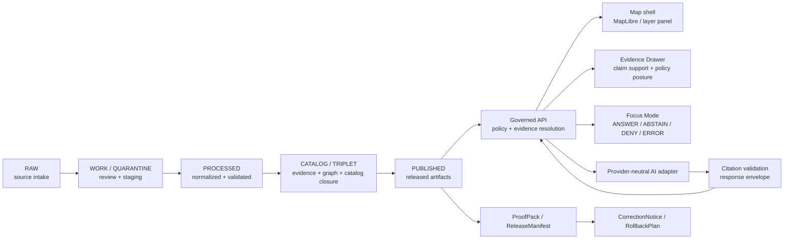

<!-- [KFM_META_BLOCK_V2]
doc_id: TODO: assign kfm://doc/<uuid>
title: Architecture
type: standard
version: v1
status: draft
owners: TODO: verify architecture/docs owner
created: TODO: verify original creation date
updated: 2026-04-26
policy_label: TODO: verify public/restricted label
related: [TODO: verify ../README.md, TODO: verify ../registers/AUTHORITY_LADDER.md, TODO: verify ../runbooks/PROMOTION_GATE.md, TODO: verify ./ai/README.md, TODO: verify ./shell/README.md]
tags: [kfm, architecture, governance, evidence, map-first, time-aware]
notes: [Draft architecture landing page; repo implementation depth remains UNKNOWN until current checkout evidence verifies paths, tests, workflows, schemas, and runtime behavior]
[/KFM_META_BLOCK_V2] -->

<a id="top"></a>

# Architecture

<p align="center">
  <strong>Evidence-first • map-first • time-aware • governed • reversible</strong>
</p>

<p align="center">
  
  
  
  
  
</p>

<p align="center">
  <a href="#scope">Scope</a> ·
  <a href="#repo-fit">Repo fit</a> ·
  <a href="#governing-rules">Governing rules</a> ·
  <a href="#architecture-map">Architecture map</a> ·
  <a href="#document-family">Document family</a> ·
  <a href="#validation">Validation</a> ·
  <a href="#rollback-and-correction">Rollback</a>
</p>

> [!IMPORTANT]
> This README is an architecture landing page, not proof of current implementation. Claims about actual files, tests, workflows, routes, schemas, dashboards, proof objects, or runtime behavior remain `UNKNOWN` until verified from the current repository checkout.

| Field | Value |
|---|---|
| Status | `draft` |
| Target path | `docs/architecture/README.md` |
| Owners | `TODO: verify architecture/docs owner` |
| Evidence mode | `CORPUS_ONLY` for doctrine; current implementation remains `UNKNOWN` |
| Policy label | `TODO: verify public/restricted label` |
| Repo fit | Architecture directory landing page for governed system design, boundaries, subdocs, ADRs, and review gates |
| Public posture | Cite-or-abstain; fail closed on unresolved rights, sensitivity, source role, review state, or release state |

## Scope

This directory is the architecture control surface for Kansas Frontier Matrix.

It should explain how KFM preserves the public unit of value: an inspectable claim that can be reconstructed to admissible evidence, spatial scope, temporal scope, source role, policy posture, review state, release state, correction lineage, and rollback target.

This landing page should help maintainers answer:

- What architecture rules must every KFM subsystem preserve?
- Which documents define data, evidence, publication, UI, AI, security, and domain-lane boundaries?
- Which paths are confirmed, proposed, or still awaiting repository verification?
- What must be validated before a change becomes publishable or public-facing?

| What this document does | What it does not do |
|---|---|
| Defines the role of `docs/architecture/` as a governed architecture landing area. | Does not prove current repo implementation. |
| Summarizes non-negotiable KFM architecture boundaries. | Does not authorize public release. |
| Lists proposed or to-be-verified architecture subdocs. | Does not invent routes, DTOs, workflows, owners, or tests. |
| Gives review and validation gates for architecture changes. | Does not replace ADRs, schemas, policy, source registries, proof packs, or release manifests. |

<p align="right"><a href="#top">Back to top ↑</a></p>

## Repo fit

`docs/architecture/README.md` should sit between the repository’s general documentation landing page and subsystem-specific architecture documents.

| Relationship | Target | Status |
|---|---|---|
| Upstream docs landing | `../README.md` | `TODO: verify path` |
| Source authority / truth labels | `../registers/AUTHORITY_LADDER.md` | `TODO: verify or create` |
| Canon / lineage / exploratory register | `../registers/CANONICAL_LINEAGE_EXPLORATORY.md` | `TODO: verify or create` |
| ADR index | `../adr/README.md` | `TODO: verify path` |
| Promotion gate runbook | `../runbooks/PROMOTION_GATE.md` | `TODO: verify or create` |
| Correction and rollback runbook | `../runbooks/CORRECTION_AND_ROLLBACK.md` | `TODO: verify or create` |
| Architecture subdocs | `./*/README.md` | `TODO: verify current directory structure` |

> [!NOTE]
> If the mounted repository uses different homes for registers, ADRs, runbooks, schemas, contracts, or policies, update this README through an ADR-backed path correction instead of silently duplicating authority.

<p align="right"><a href="#top">Back to top ↑</a></p>

## Accepted inputs

Architecture documents in this directory may depend on:

| Input | Accepted use |
|---|---|
| Current repository evidence | Proves current files, tests, workflows, schemas, manifests, configs, runtime behavior, logs, dashboards, emitted artifacts, and branch state. |
| Accepted KFM doctrine | Defines project architecture, terminology, invariants, and governance expectations. |
| ADRs and decision registers | Record irreversible or cross-cutting architecture choices. |
| Schemas, contracts, and policies | Turn doctrine into machine-checkable boundaries. |
| Fixtures and validators | Prove positive and negative paths before broad implementation. |
| Proof packs, receipts, release manifests, and correction notices | Preserve reviewability, reversibility, and publication lineage. |
| External official sources | Verify current standards, APIs, licensing, source terms, security guidance, and version-sensitive facts. |

## Exclusions

Architecture docs must not treat the following as current proof unless directly verified:

| Excluded as proof | Reason |
|---|---|
| Generated language | AI output is interpretive, not sovereign truth. |
| Maps, tiles, dashboards, scenes, or summaries alone | Rendered surfaces are carriers, not proof objects. |
| RAW, WORK, QUARANTINE, or unpublished candidate data | Public and ordinary UI surfaces must not read these directly. |
| Prior PDFs or scaffold reports | Useful lineage, but not proof of current repo files or runtime behavior. |
| Live-source assumptions | Rights, endpoint behavior, cadence, quotas, and licenses are version-sensitive. |
| Badges without verified targets | Badges can summarize state only after the target is checked. |
| Direct model-client paths | Public clients must not call model runtimes directly. |

<p align="right"><a href="#top">Back to top ↑</a></p>

## Governing rules

### 1. Lifecycle is architecture, not storage decoration

KFM’s default truth path is:

```text
RAW -> WORK / QUARANTINE -> PROCESSED -> CATALOG / TRIPLET -> PUBLISHED
```

Promotion is a governed state transition. It is not a file move, styling choice, or UI toggle.

### 2. Public surfaces use governed interfaces

Public clients and ordinary UI surfaces should consume released artifacts, governed APIs, catalog records, tile services, graph/triplet records where applicable, and EvidenceRef-to-EvidenceBundle resolution.

They should not directly consume canonical/internal stores, source-system side effects, model output, or unreleased candidate data.

### 3. EvidenceBundle outranks generated language

AI, Focus Mode, story text, summaries, exports, map popups, and dashboards are downstream carriers. They may interpret, summarize, navigate, or explain only after evidence and policy checks have bounded the answer.

### 4. Map-first does not mean map-sovereign

MapLibre, Cesium, tiles, PMTiles, COGs, 3D Tiles, GeoJSON, vector indexes, search layers, and scenes are delivery or rendering surfaces. They must remain rebuildable derivatives unless a current architecture decision proves otherwise.

### 5. Policy is enforceable or it is incomplete

Sensitive geometry, rights uncertainty, source-role ambiguity, missing review state, missing release state, and unresolved evidence should produce explicit finite outcomes such as `ABSTAIN`, `DENY`, or `ERROR`, not silent publication.

### 6. Reversibility is a design requirement

Architecture changes that affect public meaning, evidence handling, source authority, publication, policy, or sensitive exposure need a rollback or correction path before release.

> [!CAUTION]
> Exact locations for archaeology, rare species, sensitive habitat, critical infrastructure, living-person exposure, DNA/genomics, private land ownership, sacred sites, burials, or culturally sensitive material should fail closed until review and public-safe transforms are documented.

<p align="right"><a href="#top">Back to top ↑</a></p>

## Architecture map


```mermaid
flowchart LR
  RAW[RAW<br>source intake] --> WORK[WORK / QUARANTINE<br>review + staging]
  WORK --> PROCESSED[PROCESSED<br>normalized + validated]
  PROCESSED --> CATALOG[CATALOG / TRIPLET<br>evidence + graph + catalog closure]
  CATALOG --> PUBLISHED[PUBLISHED<br>released artifacts]

  PUBLISHED --> API[Governed API<br>policy + evidence resolution]
  API --> MAP[Map shell<br>MapLibre / layer panel]
  API --> DRAWER[Evidence Drawer<br>claim support + policy posture]
  API --> FOCUS[Focus Mode<br>ANSWER / ABSTAIN / DENY / ERROR]

  API --> MODEL[Provider-neutral AI adapter]
  MODEL --> CITATION[Citation validation<br>response envelope]
  CITATION --> API

  PUBLISHED --> PROOF[ProofPack / ReleaseManifest]
  PROOF --> CORRECTION[CorrectionNotice / RollbackPlan]
```

### Boundary summary

| Boundary | Must preserve | Must never become |
|---|---|---|
| Data lifecycle | Staged, reviewable movement from source intake to publication. | A hidden direct path from raw data to public UI. |
| Governed API | Evidence resolution, policy checks, finite outcomes, and runtime envelopes. | A pass-through to canonical stores or model runtimes. |
| Map shell | Place, time, evidence, policy, and review state visible at the point of use. | Decorative chrome over an ungoverned truth system. |
| Evidence Drawer | The mandatory trust object for consequential claims, layers, Focus outputs, and exports. | Optional tooltip, developer-only appendix, or afterthought. |
| Focus Mode | Bounded synthesis over released, policy-safe evidence. | Detached chatbot or autonomous publisher. |
| Proof and release objects | Distinct receipts, manifests, validation reports, decisions, and rollback references. | A single blended artifact that cannot be audited. |

<p align="right"><a href="#top">Back to top ↑</a></p>

## Document family

The following architecture documents should be verified, created, or revised as the repository matures. Do not treat these paths as confirmed until the current checkout is inspected.

| Architecture area | Suggested document | Status |
|---|---|---|
| Architecture landing | `docs/architecture/README.md` | `draft` |
| Data lifecycle and storage boundaries | `docs/architecture/data/README.md` | `TODO: verify or create` |
| Evidence and claim model | `docs/architecture/evidence/README.md` | `TODO: verify or create` |
| Publication, promotion, and release | `docs/architecture/publication/README.md` | `TODO: verify or create` |
| Map shell and Evidence Drawer | `docs/architecture/shell/README.md` | `TODO: verify or create` |
| Map rendering and delivery | `docs/architecture/map-rendering/README.md` | `TODO: verify or create` |
| Governed AI and Focus Mode | `docs/architecture/ai/README.md` | `TODO: verify or create` |
| Security and local exposure | `docs/architecture/security/README.md` | `TODO: verify or create` |
| Domain-lane architecture crosswalk | `docs/architecture/domains/README.md` or `docs/domains/README.md` | `TODO: resolve path` |
| ADRs | `docs/adr/README.md` | `TODO: verify or create` |

### Shared object-family vocabulary

These are architecture vocabulary anchors to verify or implement. They should not be claimed as existing repository objects until schemas, contracts, fixtures, tests, or emitted artifacts confirm them.

| Object family | Role |
|---|---|
| `SourceDescriptor` | Describes source role, rights, sensitivity, cadence, access, and authority limits. |
| `SourceIntakeRecord` | Records intake decision, source status, and allowed downstream use. |
| `EvidenceRef` | Stable reference from a claim or payload to admissible evidence. |
| `EvidenceBundle` | Resolved evidence package used to support or deny claims. |
| `DecisionEnvelope` | Records finite decision outcomes and their basis. |
| `PolicyDecision` | Captures rights, sensitivity, access, and release-policy results. |
| `RuntimeResponseEnvelope` | Bounds API or AI-assisted runtime responses. |
| `CitationValidationReport` | Verifies that outward claims are supported by cited evidence. |
| `RunReceipt` / `AIReceipt` | Records process execution without becoming proof by itself. |
| `RedactionReceipt` | Records sensitive transforms, suppression, or generalization. |
| `ValidationReport` | Captures schema, policy, citation, fixture, or release validation results. |
| `PromotionDecision` | Records governed movement toward release or denial. |
| `ReleaseManifest` | Defines published artifacts, integrity, scope, and release state. |
| `ProofPack` | Bundles reviewable evidence of validation, policy, and release closure. |
| `CatalogMatrix` | Links datasets, distributions, claims, evidence, and release objects. |
| `CorrectionNotice` | Records post-release correction lineage. |
| `RollbackPlan` | Defines reversible recovery path for released or promoted artifacts. |
| `GeoManifest` | Describes spatial artifacts, bounds, transforms, checksums, and delivery posture. |

<p align="right"><a href="#top">Back to top ↑</a></p>

## Architecture change rules

Architecture changes should be small, explicit, and reversible.

| Change type | Required support |
|---|---|
| New architecture doctrine | Source basis, truth labels, affected docs, validation plan, rollback/correction path. |
| New schema or contract family | ADR or registry entry, valid and invalid fixtures, validator path, compatibility notes. |
| New public UI behavior | Evidence Drawer payload, policy posture, negative states, public-safe release state. |
| New AI behavior | Governed API boundary, EvidenceBundle resolution, citation validation, finite outcome envelope. |
| New source family | SourceDescriptor, rights review, sensitivity review, cadence, source-role constraints, quarantine path. |
| New release path | PromotionDecision, ReleaseManifest, ProofPack, correction path, rollback path. |
| New domain lane | Source roles, domain boundaries, public-safe layer plan, evidence and policy fixtures. |

> [!WARNING]
> Do not use architecture docs to backfill confidence after implementation. Architecture documents should make source authority, assumptions, tests, and open verification work easier to inspect.

## Validation

Before this README or any linked architecture doc is promoted beyond draft:

- [ ] Confirm the current repository branch and dirty state.
- [ ] Verify `docs/architecture/README.md` is the intended path.
- [ ] Verify owner, policy label, related docs, and ADR paths.
- [ ] Confirm or replace all `TODO` placeholders.
- [ ] Verify any badges target real workflows or remain clearly static.
- [ ] Check every link target.
- [ ] Confirm no architecture claim implies unverified runtime behavior.
- [ ] Confirm lifecycle, evidence, policy, review, release, correction, and rollback boundaries remain distinct.
- [ ] Confirm public clients do not gain direct RAW, WORK, QUARANTINE, canonical-store, or model-runtime access.
- [ ] Run repository-native documentation, schema, policy, and fixture validation.

Illustrative command sequence only:

```bash
# NEEDS VERIFICATION: adapt to repository tooling before use.
git status --short
git branch --show-current

# TODO: replace with repository-native documentation checks.
# Example placeholders:
# npm run docs:lint
# python tools/validators/check_docs.py docs/architecture/README.md
# pytest tests/docs tests/fixtures
```

<p align="right"><a href="#top">Back to top ↑</a></p>

## Definition of Done

- [ ] Architecture scope is explicit.
- [ ] Truth labels distinguish `CONFIRMED`, `PROPOSED`, `UNKNOWN`, and `NEEDS VERIFICATION`.
- [ ] Current repo evidence supports any implementation claims.
- [ ] Source authority, evidence, policy, review, release, correction, and rollback are visible.
- [ ] Public and steward paths remain behind governed interfaces.
- [ ] AI and renderer surfaces remain subordinate to evidence and policy.
- [ ] Sensitive or rights-uncertain material fails closed.
- [ ] Valid and invalid examples exist where architecture becomes a contract.
- [ ] Documentation links, badges, owners, and policy labels are verified or clearly marked `TODO`.
- [ ] Rollback and correction steps exist for public-meaning changes.

## Rollback and correction

Architecture docs are part of the working system. If this README introduces wrong or premature guidance:

1. Revert the documentation change or mark the affected section `WITHDRAWN`.
2. Add a correction note in the repository’s correction or drift register.
3. Update affected ADRs, schemas, contracts, policy files, fixtures, and linked docs.
4. Invalidate or revise any downstream proof packs, release manifests, layer manifests, or UI payload examples that depended on the corrected guidance.
5. Keep the correction trail visible enough for maintainers to reconstruct what changed and why.

> [!TIP]
> If a future repo inspection proves different architecture homes, prefer a small path-resolution ADR plus link updates over duplicating competing architecture documents.

<p align="right"><a href="#top">Back to top ↑</a></p>

## Open verification backlog

| Item | Status | Resolution needed |
|---|---|---|
| Document owner | `UNKNOWN` | Verify responsible maintainer or team. |
| Policy label | `UNKNOWN` | Confirm public/restricted/internal label. |
| Existing `docs/architecture/` contents | `UNKNOWN` | Inventory current checkout before adding subdocs. |
| Badge targets | `NEEDS VERIFICATION` | Replace static badges only with verified workflow targets. |
| ADR home | `NEEDS VERIFICATION` | Confirm `docs/adr/` or accepted ADR location. |
| Registers home | `NEEDS VERIFICATION` | Confirm where authority, canon, drift, and intake registers live. |
| Schema-home authority | `NEEDS VERIFICATION` | Resolve `contracts/` vs `schemas/` authority through ADR if still ambiguous. |
| Validation commands | `UNKNOWN` | Replace illustrative commands with repository-native checks. |
| Architecture subdoc paths | `UNKNOWN` | Confirm or create linked architecture subdirectories. |
| Runtime/API/UI claims | `UNKNOWN` | Verify from code, tests, contracts, routes, logs, or emitted artifacts before documenting as implemented. |

<details>
<summary>Appendix — Architecture anti-patterns to reject</summary>

| Anti-pattern | Why it fails KFM |
|---|---|
| Public map reads RAW or WORK data | Bypasses governed lifecycle and review state. |
| Focus Mode calls a model directly | Bypasses evidence resolution and policy checks. |
| Vector index becomes truth source | Turns a derivative accelerator into sovereign truth. |
| Pretty map without Evidence Drawer path | Creates persuasive but unsupported public meaning. |
| Promotion by file move | Hides review, policy, release, and rollback state. |
| One blended “proof” artifact | Makes validation, receipt, release, and correction hard to audit. |
| Exact sensitive geometry by default | Exposes archaeology, rare species, infrastructure, or private/person-sensitive risk. |
| Fake badge confidence | Claims maturity without verified targets. |
| Architecture rewrite without preservation matrix | Risks losing prior doctrine, continuity, and source lineage. |

</details>
