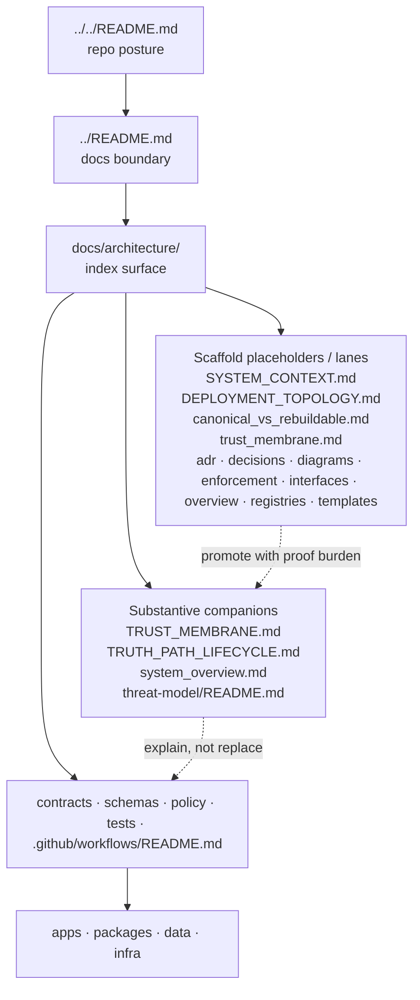

<!-- [KFM_META_BLOCK_V2]
doc_id: kfm://doc/<uuid-NEEDS-VERIFICATION>
title: Architecture
type: standard
version: v1
status: review
owners: @bartytime4life
created: YYYY-MM-DD
updated: YYYY-MM-DD
policy_label: NEEDS-VERIFICATION
related: [../../README.md, ../README.md, ../governance/README.md, ../standards/README.md, ../runbooks/README.md, ../templates/README.md, ../../contracts/README.md, ../../policy/README.md, ../../schemas/README.md, ../../tests/README.md, ../../.github/workflows/README.md]
tags: [kfm, architecture, trust-membrane, truth-path, evidence-first]
notes: [doc_id, created, updated, and policy_label still need repo verification before commit; owners are confirmed from ../../.github/CODEOWNERS; current public main shows docs/architecture as a mixed surface with substantive companion docs and scaffold placeholders/readmes]
[/KFM_META_BLOCK_V2] -->

# Architecture

System-level architecture law, boundary map, and navigation hub for Kansas Frontier Matrix (KFM).

> **Status:** experimental surface · doc under review  
> **Owners:** `@bartytime4life`  
> **Repo fit:** `docs/architecture/README.md` → upstream [`../README.md`](../README.md), [`../../README.md`](../../README.md) · adjacent [`../governance/README.md`](../governance/README.md), [`../standards/README.md`](../standards/README.md), [`../runbooks/README.md`](../runbooks/README.md), [`../templates/README.md`](../templates/README.md) · machine-facing neighbors [`../../contracts/README.md`](../../contracts/README.md), [`../../schemas/README.md`](../../schemas/README.md), [`../../policy/README.md`](../../policy/README.md), [`../../tests/README.md`](../../tests/README.md), [`../../.github/workflows/README.md`](../../.github/workflows/README.md)  
>        
> **Quick jumps:** [Scope](#scope) · [Repo fit](#repo-fit) · [Baseline & evidence basis](#baseline--evidence-basis) · [Accepted inputs](#accepted-inputs) · [Exclusions](#exclusions) · [Current public-main snapshot](#current-public-main-snapshot) · [Directory tree](#directory-tree) · [Quickstart](#quickstart) · [Usage](#usage) · [Diagram](#diagram) · [Reference tables](#reference-tables) · [Task list](#task-list) · [FAQ](#faq) · [Appendix](#appendix)

> [!IMPORTANT]
> `docs/architecture/` should explain boundary law without overstating implementation maturity.
> On current public `main`, this directory is neither empty nor fully filled: it mixes substantive companion docs, scaffold placeholders, and scaffold directory READMEs.
> This index keeps those states visibly separate on purpose.

## Scope

`docs/architecture/` is the system-level documentation home for KFM’s architectural laws and cross-cutting boundaries: the trust membrane, truth path lifecycle, authoritative-versus-derived split, governed API posture, runtime proof obligations, and the map-first, time-aware product shell.

This README is intentionally conservative. It should help a reviewer answer four questions quickly:

1. What architectural laws are non-negotiable?
2. What does current public `main` actually show here today?
3. Which architecture lanes are substantive, and which are still scaffold-level?
4. What else must move when architecture changes?

### Truth posture used here

| Marker | Meaning in this README |
|---|---|
| `CONFIRMED` | Directly supported by current public-repo inspection or stable KFM doctrine |
| `INFERRED` | Conservative conclusion that follows from repeated doctrine or adjacent repo evidence |
| `PROPOSED` | Doctrine-consistent next step, packaging choice, or implementation direction not yet proven as current mounted reality |
| `UNKNOWN` | Not verified strongly enough to present as current fact |
| `NEEDS VERIFICATION` | Concrete detail that should be checked before merge or wider reliance |

[Back to top](#architecture)

## Repo fit

| Field | Value |
|---|---|
| Path | `docs/architecture/README.md` |
| Directory role | Architecture index for system boundaries, trust rules, lifecycle law, and architecture-adjacent references |
| Primary upstream anchors | [`../../README.md`](../../README.md), [`../README.md`](../README.md), [`../governance/README.md`](../governance/README.md), [`../standards/README.md`](../standards/README.md), [`../runbooks/README.md`](../runbooks/README.md), [`../templates/README.md`](../templates/README.md) |
| Machine-facing neighbors | [`../../contracts/README.md`](../../contracts/README.md), [`../../schemas/README.md`](../../schemas/README.md), [`../../policy/README.md`](../../policy/README.md), [`../../tests/README.md`](../../tests/README.md), [`../../.github/workflows/README.md`](../../.github/workflows/README.md) |
| Current public-main posture | Substantive index + substantive companions + scaffold placeholders/readmes |
| Why this directory matters | It keeps KFM’s system laws legible without creating a second truth path or quietly upgrading placeholders into architecture reality |

### Repo relationship map

Architecture docs sit between doctrine and execution:

- repo root explains **project identity and top-level posture**
- `docs/` explains the **documentation system**
- `docs/architecture/` explains **system law and boundary logic**
- `contracts/`, `policy/`, `schemas/`, `tests/`, and `.github/workflows/` express **machine-facing proof and control surfaces**
- `apps/`, `packages/`, `data/`, and `infra/` implement or operate the governed runtime and delivery stack

[Back to top](#architecture)

## Baseline & evidence basis

### Baseline document

The redesign baseline for this file is the current public [`docs/architecture/README.md`](./README.md), revised against the current public `main` tree and the March 2026 KFM doctrine corpus.

### Evidence layers used in this revision

| Evidence layer | Status | Used for |
|---|---|---|
| Current public `docs/architecture/README.md` | `CONFIRMED` | Existing section order, local link strategy, and README role |
| Current public `main` tree | `CONFIRMED` | Exact directory/file presence and substantive-vs-scaffold classification |
| `.github/CODEOWNERS` | `CONFIRMED` | Current broad ownership signal for this path |
| March 2026 KFM doctrine corpus | `CONFIRMED` | Trust membrane, truth path, authoritative-versus-derived split, fail-closed posture, map-first shell, correction visibility |
| Private settings, rulesets, required checks, environment approvals, runtime manifests, dashboards, and logs | `UNKNOWN` | Not presented as current implementation fact |

### Working interpretation rule

Use the public tree for **what exists now** and the doctrine corpus for **what those surfaces are supposed to mean**. Do not let one silently replace the other.

[Back to top](#architecture)

## Accepted inputs

Content that belongs here includes:

- system context and boundary documents
- trust-membrane, truth-path, and authoritative-versus-derived design notes
- deployment topology and runtime-boundary docs
- architecture diagrams that explain flows, write-rights, and enforcement points
- ADRs and decision records for architecture-significant changes
- interface registries, threat models, and architecture-facing contract pointers
- cross-cutting architecture guidance that affects more than one service, product surface, or dataset lane
- explicit path-reservation docs that are still scaffold-level, so long as they stay labeled honestly

## Exclusions

The following do **not** belong here as their authoritative home:

| Do not put this here | Keep it instead |
|---|---|
| Policy rule bodies, obligation logic, deny-by-default fixtures, runtime decision code | [`../../policy/README.md`](../../policy/README.md) |
| Canonical machine contracts, OpenAPI, JSON Schemas, vocabularies, runtime envelopes | [`../../contracts/README.md`](../../contracts/README.md) and [`../../schemas/README.md`](../../schemas/README.md) |
| Runtime service code, workers, UI components, adapters | [`../../apps/`](../../apps/) and [`../../packages/`](../../packages/) |
| Merge-blocking workflow logic itself | [`../../.github/workflows/`](../../.github/workflows/) |
| Proof objects, manifests, receipts, and release artifacts as live outputs | governed data / release / evidence surfaces |
| Secrets, credentials, and production-only access instructions | approved secret-management and runtime configuration surfaces |
| Single-service implementation tutorials | service-local docs or [`../runbooks/README.md`](../runbooks/README.md) if operational |
| Prose that silently upgrades scaffold placeholders into “implemented architecture” | keep the placeholder visible or fill the file properly in the same change stream |

[Back to top](#architecture)

## Current public-main snapshot

Current public `main` is mixed, not flat. Some architecture paths are now substantive companion docs; others remain placeholders or reserved lanes.

### Substantive architecture companions visible now

| Surface | Status | Current reading | Working use today |
|---|---|---|---|
| `README.md` | `CONFIRMED` | substantive directory index and boundary map | primary architecture navigation file |
| `TRUST_MEMBRANE.md` | `CONFIRMED` | substantive trust-boundary doctrine note | primary membrane-law companion |
| `TRUTH_PATH_LIFECYCLE.md` | `CONFIRMED` | substantive lifecycle/state-model note | primary lifecycle companion |
| `system_overview.md` | `CONFIRMED` | substantive short-form system bridge | quick whole-system orientation |
| `threat-model/README.md` | `CONFIRMED` | substantive threat-model guide | threat review starting point |

### Scaffold placeholders and scaffold directory READMEs still visible

| Surface | Status | Current reading | Working use today |
|---|---|---|---|
| `SYSTEM_CONTEXT.md`, `DEPLOYMENT_TOPOLOGY.md`, `canonical_vs_rebuildable.md`, `trust_membrane.md` | `CONFIRMED` | scaffold placeholders | reserved paths, not yet authoritative architecture law |
| `adr/README.md`, `decisions/README.md`, `diagrams/README.md`, `enforcement/README.md`, `interfaces/README.md`, `overview/README.md`, `registries/README.md`, `templates/README.md` | `CONFIRMED` | scaffold directory readmes | starter lanes for future architecture material |

### Architecture-adjacent surface maturity

| Surface | Current public-main signal | Why architecture should care |
|---|---|---|
| [`../../.github/workflows/README.md`](../../.github/workflows/README.md) | README-only; no checked-in workflow YAML is visible on current public `main` | do not describe merge-blocking automation as already present |
| [`../../contracts/README.md`](../../contracts/README.md) | contract lane is documented | architecture changes should point to contracts without pretending the lattice is already executable |
| [`../../schemas/README.md`](../../schemas/README.md) | boundary guide exists; current public inventory is README-only | keep schema authority singular and explicit |
| [`../../policy/README.md`](../../policy/README.md) | policy lane is documented; executable bundles and fixtures remain bounded | architecture docs should keep policy implementation claims proportionate |
| [`../../tests/README.md`](../../tests/README.md) | governed verification README exists | behavior-significant changes should name proof burden even when test inventory is still maturing |
| [`../../tools/README.md`](../../tools/README.md) and [`../../scripts/README.md`](../../scripts/README.md) | README-first helper lanes | useful supporting surfaces, but not substitutes for real workflow or runtime enforcement |

> [!NOTE]
> The highest-risk documentation failure here is **trust theater**: a file tree or table that sounds implemented because the names are strong, even when some current branch surfaces are still placeholders.

[Back to top](#architecture)

## Directory tree

### Directly visible current public-main surface

```text
docs/architecture/
├── adr/
│   └── README.md                  # scaffold
├── decisions/
│   └── README.md                  # scaffold
├── diagrams/
│   └── README.md                  # scaffold
├── enforcement/
│   └── README.md                  # scaffold
├── interfaces/
│   └── README.md                  # scaffold
├── overview/
│   └── README.md                  # scaffold
├── registries/
│   └── README.md                  # scaffold
├── templates/
│   └── README.md                  # scaffold
├── threat-model/
│   └── README.md                  # substantive
├── DEPLOYMENT_TOPOLOGY.md         # scaffold
├── README.md                      # substantive index
├── SYSTEM_CONTEXT.md              # scaffold
├── TRUST_MEMBRANE.md              # substantive
├── TRUTH_PATH_LIFECYCLE.md        # substantive
├── canonical_vs_rebuildable.md    # scaffold
├── system_overview.md             # substantive
└── trust_membrane.md              # scaffold / casing-drift candidate
```

### Working interpretation rule

- a **substantive companion** is safe to cite as architecture guidance, while keeping deeper runtime claims bounded
- a **scaffold placeholder** is a reserved path, not completed architecture law
- a **scaffold README lane** is a starter shelf for future architecture material, not evidence that the lane is operational

[Back to top](#architecture)

## Quickstart

Use a verification-first reading sequence before editing anything under `docs/architecture/`.

```bash
# 1) Confirm the real subtree first
find docs/architecture -maxdepth 3 \( -type f -o -type d \) | sort

# 2) Read the architecture index and the docs boundary around it
sed -n '1,260p' docs/architecture/README.md
sed -n '1,220p' docs/README.md
sed -n '1,220p' docs/governance/README.md
sed -n '1,220p' docs/standards/README.md
sed -n '1,220p' docs/runbooks/README.md
sed -n '1,220p' docs/templates/README.md

# 3) Re-check machine-facing neighbors before claiming enforcement
sed -n '1,220p' contracts/README.md
sed -n '1,220p' schemas/README.md
sed -n '1,220p' policy/README.md
sed -n '1,220p' tests/README.md
sed -n '1,220p' .github/workflows/README.md

# 4) Inspect substantive vs scaffold surfaces explicitly
find docs/architecture -maxdepth 2 -type f | sort | while read -r f; do
  printf '\n=== %s ===\n' "$f"
  sed -n '1,40p' "$f"
done
```

### Starting a new architecture note

```bash
cp docs/templates/TEMPLATE__KFM_UNIVERSAL_DOC.md docs/architecture/<topic>.md
sed -n '1,140p' docs/architecture/<topic>.md
```

> [!TIP]
> `docs/templates/TEMPLATE__KFM_UNIVERSAL_DOC.md` is a substantive reusable template on current public `main`.
> Use it as a scaffold for structure and truth posture, not as proof that the target architecture note already exists or is already filled.

[Back to top](#architecture)

## Usage

### Reading order for reviewers

1. Read this file for boundary law and current public-main maturity.
2. Read [`../README.md`](../README.md) for the broader docs boundary.
3. Read [`TRUST_MEMBRANE.md`](./TRUST_MEMBRANE.md), [`TRUTH_PATH_LIFECYCLE.md`](./TRUTH_PATH_LIFECYCLE.md), [`system_overview.md`](./system_overview.md), and [`threat-model/README.md`](./threat-model/README.md) next.
4. Treat remaining scaffold placeholders and scaffold directory READMEs as path reservations until they are filled.
5. When a claim sounds enforceable, re-check [`../../contracts/README.md`](../../contracts/README.md), [`../../policy/README.md`](../../policy/README.md), [`../../tests/README.md`](../../tests/README.md), and [`../../.github/workflows/README.md`](../../.github/workflows/README.md).

### Reading order for authors

1. Verify the live subtree you are about to change.
2. Decide whether you are updating:
   - the **index surface** (`README.md`)
   - a **substantive companion** that already carries architecture meaning
   - a **scaffold placeholder** that should become authoritative
   - a **scaffold lane README** that should stay a starter lane or be promoted into real content
3. Keep tree claims conservative unless the current branch proves them.
4. Update links, tables, and diagrams when path shape changes.
5. When behavior changes, move related docs, contracts, policy, tests, and workflow notes in the same governed stream.

### When an architecture change is governed

Treat the change as governed when it affects any of the following:

- trust membrane or client/store separation
- lifecycle zones or promotion gates
- evidence resolution or citation behavior
- authoritative-versus-derived rules
- runtime boundary posture, deployment topology, or exposure model
- sensitivity handling, geometry generalization, or public-safe location behavior
- scaffold-to-authority promotion of a previously placeholder architecture file

[Back to top](#architecture)

## Diagram


```mermaid
flowchart TB
  Root["../../README.md<br/>repo posture"] --> Docs["../README.md<br/>docs boundary"]
  Docs --> Arch["docs/architecture/<br/>index surface"]

  Arch --> Core["Substantive companions<br/>TRUST_MEMBRANE.md<br/>TRUTH_PATH_LIFECYCLE.md<br/>system_overview.md<br/>threat-model/README.md"]
  Arch --> Scaffolds["Scaffold placeholders / lanes<br/>SYSTEM_CONTEXT.md<br/>DEPLOYMENT_TOPOLOGY.md<br/>canonical_vs_rebuildable.md<br/>trust_membrane.md<br/>adr · decisions · diagrams · enforcement · interfaces · overview · registries · templates"]
  Arch --> Machine["contracts · schemas · policy · tests · .github/workflows/README.md"]
  Machine --> Runtime["apps · packages · data · infra"]

  Scaffolds -. promote with proof burden .-> Core
  Core -. explain, not replace .-> Machine
```

This directory is the bridge between KFM doctrine and repo execution, but it is also a reminder that **named paths are not the same thing as filled architecture content**.

[Back to top](#architecture)

## Reference tables

### KFM architecture laws this README keeps visible

| Law | Minimum architectural implication |
|---|---|
| Trust membrane | clients and public surfaces do not bypass the governed API / policy boundary |
| Truth path | promoted runtime surfaces stay downstream of `Source edge → RAW → WORK / QUARANTINE → PROCESSED → CATALOG / PUBLISHED` |
| Authoritative vs derived | search, graph, tiles, summaries, scenes, and other projections do not silently become sovereign truth |
| Cite-or-abstain | consequential user-facing claims resolve to evidence or abstain |
| Fail-closed posture | missing rights, broken catalogs, unresolved citations, or absent policy should block promotion and release |
| Docs as production surface | behavior-significant changes update docs in the same governed change stream |
| Placeholder honesty | scaffold files stay visibly scaffold-level until they are replaced with substantive content |

### Architecture change matrix

| Change type | Examples | Required coordinated updates |
|---|---|---|
| Boundary change | new API edge, auth change, direct-store exception | contracts, policy, tests, architecture docs, workflow notes |
| Lifecycle change | new zone, new gate, new promotion rule | lifecycle docs, receipt/manifest expectations, release checks |
| Policy-sensitive change | new `policy_label`, new obligation, new withholding rule | governance docs, policy fixtures/tests, sign-off path |
| Derived-layer change | new index, graph, tile, scene, or cache surface | authoritative-versus-derived docs, rebuild plan, stale-state handling |
| Runtime topology change | new exposure path, new deployment posture, new AI/runtime seam | infra docs, runbooks, rollback plan, verification notes |
| Scaffold promotion | replacing a placeholder file or lane README with real law or design content | Meta Block v2, real owners/dates, adjacent README links, proof burden, tree refresh |

### Architecture review cues for current public `main`

| Review cue | Why it matters |
|---|---|
| A path exists but contains only a scaffold line | the file is a reservation, not yet architecture authority |
| A path exists and already carries real doctrine prose | it can now be cited as architecture guidance, while deeper runtime claims still stay bounded |
| `.github/workflows/` is README-only on public `main` | do not imply merge-blocking workflow coverage is already checked in |
| `contracts/` and `schemas/` both exist | keep schema authority singular and explicit |
| `policy/`, `tests/`, `tools/`, and `scripts/` are README-first lanes | useful structure exists, but public implementation depth is still bounded |

[Back to top](#architecture)

## Task list

### Definition of done for architecture changes

- [ ] This README is updated if the trust membrane, truth path, directory surface, or architecture contracts changed.
- [ ] Any newly substantive architecture file gets a KFM Meta Block v2 and stops pretending to be a scaffold.
- [ ] Substantive companions, scaffold placeholders, and scaffold lane READMEs are kept visibly separate.
- [ ] Contracts, policy fixtures, tests, and workflow notes are updated where the change is enforceable.
- [ ] Reversible migration / rollback thinking is documented when runtime behavior changes.
- [ ] Security, privacy, and sensitive-location implications are reviewed.
- [ ] Any new `UNKNOWN`, `INFERRED`, or `NEEDS VERIFICATION` claim includes a concrete recheck step.

### High-value cleanup visible now

- [ ] Decide whether `TRUST_MEMBRANE.md` and `trust_membrane.md` are intentional peers or casing drift.
- [ ] Promote `SYSTEM_CONTEXT.md`, `DEPLOYMENT_TOPOLOGY.md`, and `canonical_vs_rebuildable.md` in dependency order.
- [ ] Decide whether `overview/README.md` should stay a reserved lane or yield to `system_overview.md` as the canonical short-form overview.
- [ ] Fill or retire scaffold directory READMEs in `adr/`, `decisions/`, `diagrams/`, `enforcement/`, `interfaces/`, `registries/`, and `templates/`.
- [ ] Keep this index synchronized whenever the architecture tree changes on `main`.

[Back to top](#architecture)

## FAQ

### Why distinguish substantive companions from scaffold surfaces?

Because those are not the same thing. KFM architecture docs should not let a strong intended shape masquerade as completed current reality.

### Are scaffold files safe to cite as architecture authority?

No. They are safe to cite as **reserved paths** or **planned lanes**, but not as filled doctrine until they contain substantive content.

### Does this README prove merge-blocking automation already exists?

No. Current public `main` shows `.github/workflows/README.md`, but not checked-in workflow YAML in that directory.

### Why keep both `TRUST_MEMBRANE.md` and `trust_membrane.md` visible?

Because both paths currently resolve on public `main`, but only the uppercase file is substantive. Consolidate only after confirming whether the lowercase path is intentional or casing drift.

### Do new architecture docs need Meta Block v2?

Yes. Start with the universal template path, then replace placeholder fields only where repo evidence actually supports them.

[Back to top](#architecture)

## Appendix

<details>
<summary>Appendix — current public-main paths and authoring guardrails</summary>

### Directly visible current public-main paths used in this README

- `docs/architecture/README.md`
- `docs/architecture/SYSTEM_CONTEXT.md`
- `docs/architecture/TRUST_MEMBRANE.md`
- `docs/architecture/TRUTH_PATH_LIFECYCLE.md`
- `docs/architecture/DEPLOYMENT_TOPOLOGY.md`
- `docs/architecture/canonical_vs_rebuildable.md`
- `docs/architecture/system_overview.md`
- `docs/architecture/trust_membrane.md`
- `docs/architecture/adr/README.md`
- `docs/architecture/decisions/README.md`
- `docs/architecture/diagrams/README.md`
- `docs/architecture/enforcement/README.md`
- `docs/architecture/interfaces/README.md`
- `docs/architecture/overview/README.md`
- `docs/architecture/registries/README.md`
- `docs/architecture/templates/README.md`
- `docs/architecture/threat-model/README.md`

### Architecture authoring rules worth keeping close

1. **Index honestly.** README files may describe target shape, but they should never erase the difference between placeholder, scaffold lane, and filled content.
2. **Link downstream to enforcement.** When a rule sounds executable, point readers to contracts, policy, tests, or workflow surfaces.
3. **Promote in dependency order.** Fill system context and lifecycle/topology law before optional visualization or registry lanes.
4. **Do not let case drift become doctrine.** If two near-identical filenames exist, resolve intent before blessing one as canonical.
5. **Update the tree when the tree changes.** The snapshot table is part of the working system, not decorative prose.

### Minimal verification steps before merging a major architecture edit

```bash
# confirm subtree and adjacent control lanes
find docs/architecture -maxdepth 3 \( -type f -o -type d \) | sort
find .github/workflows contracts schemas policy tests -maxdepth 2 -type f 2>/dev/null | sort

# inspect ownership
sed -n '1,200p' .github/CODEOWNERS

# check for scaffold placeholders that should be retired or preserved explicitly
grep -RIn "Scaffold" docs/architecture docs/templates 2>/dev/null || true

# re-read the docs boundary before writing stronger claims
sed -n '1,220p' docs/README.md
sed -n '1,260p' docs/architecture/README.md
```

</details>

[Back to top](#architecture)
