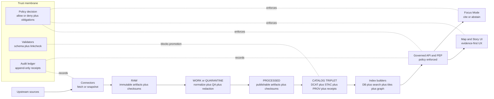
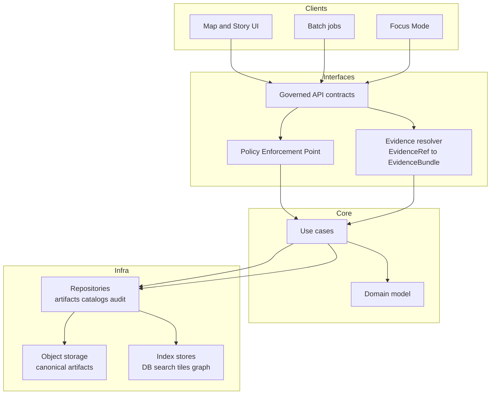

<!-- [KFM_META_BLOCK_V2]
doc_id: kfm://doc/a8e9c2e8-7a89-4b0c-9f4c-1e9d4a0f1c6d
title: Architecture
type: standard
version: v1
status: draft
owners: KFM Maintainers
created: 2026-02-24
updated: 2026-03-05
policy_label: restricted
related:
  - TODO: docs/governance/README.md
  - TODO: docs/apis/README.md
  - TODO: docs/data/README.md
  - TODO: docs/ui/README.md
tags: [kfm, architecture, trust-membrane, truth-path, promotion-contract]
notes:
  - Defines the trust membrane, truth path lifecycle, and promotion contract expectations for architecture changes.
  - This document is normative. Any statements about the current live repo or deployed runtime are UNKNOWN unless backed by a captured commit hash + tree dump.
  - Directory layouts include PROPOSED target expansions; do not treat PROPOSED subtrees as repo fact without verification.
[/KFM_META_BLOCK_V2] -->

<a id="top"></a>

# Architecture
Governed, end-to-end system architecture and **trust membrane** rules for **Kansas Frontier Matrix (KFM)**.

**Map-first · Time-aware · Evidence-first · Governed · Cite-or-abstain**

> **Status:** draft · **Owners:** KFM Maintainers · **Policy:** restricted  
> **Doc role:** This is a *normative contract* for boundaries, promotion gates, and claim traceability.  
> **Repo facts:** Any repo-specific paths and “what exists today” statements are **UNKNOWN** unless linked to a commit hash + tree dump.


 <!-- TODO: replace with real workflow badge -->

> [!WARNING]
> This directory documents production constraints.
>
> If a change alters **data lifecycle**, **policy enforcement**, **API boundaries**, **claim traceability**, or **sensitive-location handling**, treat it as a **governed change** and update:
> 1) the relevant contracts, 2) the enforcement docs, and 3) the merge-blocking CI checks.
>
> Docs are not enforcement. If an invariant matters, it must be **runtime enforced** and **merge-blocking in CI**.

---

## Quick navigation

- [Status and intent](#status-and-intent)
- [System at a glance](#system-at-a-glance)
- [Truth discipline labels](#truth-discipline-labels)
- [Layering model](#layering-model)
- [Trust membrane invariants](#trust-membrane-invariants)
- [Truth path lifecycle zones](#truth-path-lifecycle-zones)
- [Promotion contract and audit](#promotion-contract-and-audit)
- [Interfaces and contracts](#interfaces-and-contracts)
- [Security ethics and location handling](#security-ethics-and-location-handling)
- [How to change architecture](#how-to-change-architecture)
- [Directory guide](#directory-guide)
- [Appendix](#appendix)

---

## Status and intent

This document contains two kinds of statements:

1) **Normative requirements** for KFM architecture  
   These use RFC-style keywords like **MUST**, **MUST NOT**, **SHOULD**, **MAY**.  
   They describe what the system is required to do, even if the current implementation is incomplete.

2) **Descriptive claims** about the repo or runtime  
   These must be labeled **[CONFIRMED]**, **[PROPOSED]**, or **[UNKNOWN]**.  
   If a descriptive claim is **[UNKNOWN]**, the doc must include the smallest verification steps needed to make it **[CONFIRMED]**.

> [!IMPORTANT]
> Avoid “accidental invention.” If you cannot point to a specific commit tree, validator output, or governed run receipt, treat repo/runtime facts as **[UNKNOWN]**.

[(back to top)](#top)

---

## System at a glance

KFM’s reference pipeline is:

**upstream → connectors → RAW → WORK or QUARANTINE → PROCESSED → CATALOG TRIPLET → index builders → governed API and PEP → Map and Story UI + Focus Mode**

Key architectural idea: **catalogs and provenance are contract surfaces**, not “nice metadata.”


```mermaid
flowchart LR
  UP[Upstream sources] --> CON[Connectors\nfetch or snapshot]
  CON --> RAW[RAW\nimmutable artifacts plus checksums]
  RAW --> WRK[WORK or QUARANTINE\nnormalize plus QA plus redaction]
  WRK --> PRC[PROCESSED\npublishable artifacts plus checksums]
  PRC --> CAT[CATALOG TRIPLET\nDCAT plus STAC plus PROV plus receipts]
  CAT --> IDX[Index builders\nDB plus search plus tiles plus graph]
  IDX --> PEP[Governed API and PEP\npolicy enforced]
  PEP --> UI[Map and Story UI\nevidence-first UX]
  PEP --> FOCUS[Focus Mode\ncite or abstain]

  subgraph TM[Trust membrane]
    POL[Policy decision\nallow or deny plus obligations]
    VAL[Validators\nschema plus linkcheck]
    AUD[Audit ledger\nappend-only receipts]
  end

  POL -.enforces.- PEP
  POL -.enforces.- UI
  POL -.enforces.- FOCUS

  VAL -.blocks promotion.- CAT
  AUD -.records.- CON
  AUD -.records.- PEP
```

> [!NOTE]
> “Published” is not just a folder. It is the **governed runtime surface**: API responses, tiles, story pages, and Focus Mode outputs—each backed by promoted artifacts and auditable receipts.

[(back to top)](#top)

---

## Truth discipline labels

To keep docs actionable and prevent accidental invention, we tag descriptive statements:

- **[CONFIRMED]** backed by a commit hash + tree dump, validator outputs, or governed run receipts.
- **[PROPOSED]** a recommended design or target state.
- **[UNKNOWN]** requires verification and must not be treated as fact.

> [!TIP]
> When adding a new architectural claim: include (1) evidence, (2) policy decision path, (3) the CI or runtime enforcement point.

[(back to top)](#top)

---

## Layering model

Layering is a requirement so governance is testable and bypass is hard.


```mermaid
flowchart TB
  subgraph Clients
    UI[Map and Story UI]
    BATCH[Batch jobs]
    FOCUS[Focus Mode]
  end

  subgraph Interfaces
    API[Governed API contracts]
    PEP[Policy Enforcement Point]
    EVR[Evidence resolver\nEvidenceRef to EvidenceBundle]
  end

  subgraph Core
    UC[Use cases]
    DOM[Domain model]
  end

  subgraph Infra
    REPO[Repositories\nartifacts catalogs audit]
    STORE[Object storage\ncanonical artifacts]
    IDX[Index stores\nDB search tiles graph]
  end

  UI --> API
  BATCH --> API
  FOCUS --> API

  API --> PEP --> UC --> DOM
  API --> EVR --> UC

  UC --> REPO --> STORE
  UC --> REPO --> IDX
```

### Practical meaning

- **Domain**: datasets, dataset versions, artifacts, catalogs, claims, evidence refs, policy decisions, receipts, story nodes.
- **Use cases**: ingest, validate, promote, resolve evidence, query slices, publish story nodes, run focus queries.
- **Interfaces**: API, evidence resolver, policy boundary enforcement.
- **Infrastructure**: artifact stores, catalog store, audit ledger, projection stores such as indexes, tiles, search, DB, graph.

### Key terms

- **PEP**: Policy Enforcement Point. The component that enforces allow or deny decisions and obligations.
- **PDP**: Policy Decision Point. The component that evaluates policy and returns decision plus obligations.  
  The PDP may be packaged with the PEP, but the enforcement boundary must remain explicit.
- **EvidenceRef**: Stable identifier for a citable object.
- **EvidenceBundle**: Resolver output containing metadata, provenance, digests, and policy-applied views.
- **Projection store**: A rebuildable index derived from promoted artifacts. It is not canonical truth.

[(back to top)](#top)

---

## Trust membrane invariants

These are **non-negotiable requirements**. Encode them as tests and enforce them in CI and runtime.

### Hard rules

- **Clients MUST NOT access DB or object storage directly.** UI and external clients MUST use governed APIs only.
- **Core logic MUST NOT bypass repositories.** Use cases talk to repos; repos talk to storage and projection stores.
- **All access MUST be policy-evaluated.** Policy evaluation returns **decision plus obligations**.
- **Gates MUST fail closed.** Missing license, missing policy label, missing catalogs, or missing receipts MUST block promotion and release.
- **User-facing citations MUST be EvidenceRefs, not pasted URLs.** Every claim MUST cite resolvable evidence or abstain.
- **Runtime MUST only serve promoted versions.** Runtime services read only promoted dataset versions with catalogs plus receipts.
- **Deterministic identity is mandatory.** `dataset_id`, `dataset_version_id`, `spec_hash`, and content digests prevent silent drift.

### Architectural smells

Block on sight:

- New endpoint reads from DB or object storage without policy evaluation.
- Client code contains database credentials or object storage credentials.
- Temporary bypass around promotion gates for demos.
- Broken evidence links or non-resolvable citations in Story or Focus outputs.
- Projection store treated as canonical truth without explicit promotion and provenance.

> [!TIP]
> If you need performance: optimize **inside** the membrane with caching, precompute, better indexing, or better retrieval—not by bypassing governance.

[(back to top)](#top)

---

## Truth path lifecycle zones

Promotion is not a copy operation. It is a governed decision supported by artifacts and tests.

| Zone | Purpose | Typical contents | Mutability | Typical readers | Promotion out requires |
|---|---|---|---|---|---|
| Upstream | External source of record | Remote APIs, files, portals, feeds | Out of our control | Connectors | Capture terms snapshot plus acquisition manifest |
| RAW | Immutable acquisition | Raw artifacts plus checksums plus acquisition and terms snapshot plus fetch logs | Append-only | Pipeline maintainers | Identity plus digests plus license snapshot |
| WORK or QUARANTINE | Isolation and QA | Normalization outputs, reprojections, tiling jobs, QA reports, redaction candidates | Rewrite allowed | Data engineers, reviewers | Validation reports plus policy label plus redaction plan |
| PROCESSED | Publishable artifacts | Standard formats, stable IDs, checksums | Immutable per version | API and index builders | Meets QA thresholds plus stable digests |
| CATALOG TRIPLET | Contract surfaces | Cross-linked DCAT plus STAC plus PROV plus run receipts plus link maps | Immutable per version | Validators, resolvers | Validators pass plus links resolve |
| PUBLISHED | Governed runtime surfaces | Policy-filtered API responses, tiles, story pages, Focus outputs with receipts | Mutable at runtime, backed by immutable versions | End users | Only serve promoted versions; audit every request or run |

> [!NOTE]
> “Standard formats” are examples, not a guarantee of current usage. Treat specific formats as **[PROPOSED]** unless your dataset specs require them.

### Minimum metadata

For any dataset version eligible for promotion, the minimum contract includes:

- `dataset_id`, `dataset_version_id` as stable identifiers
- `spec_ref` plus `spec_hash` as deterministic transform definition
- License and rights plus upstream terms snapshot
- Policy label plus obligations or redaction plan when needed
- Spatial and temporal extents
- Checksums or digests for every artifact
- Catalog triplet plus resolvable EvidenceRefs

[(back to top)](#top)

---

## Promotion contract and audit

Promotion to PUBLISHED MUST be blocked unless **all** minimum gates pass.

### Promotion contract v1

| Gate | What must be present | Example CI check |
|---|---|---|
| A — Identity and versioning | `dataset_id`, `dataset_version_id`, deterministic `spec_hash`, content digests | Spec and schema validation; digest verification |
| B — Licensing and rights | License and rights fields plus upstream terms snapshot | Fail if license missing or unknown; terms snapshot exists |
| C — Sensitivity and redaction plan | `policy_label` plus obligations | Default-deny policy tests; verify obligations applied |
| D — Catalog triplet validation | DCAT, STAC, PROV validate and cross-link; EvidenceRefs resolve | Validators and linkcheck; fail on broken links |
| E — QA and thresholds | Dataset-specific checks and thresholds documented and met | QA report exists; quarantine failures |
| F — Run receipt and audit record | Receipt captures inputs, tooling, hashes, policy decisions; audit ledger append-only | Receipt schema validation; attestation verification if enabled |
| G — Release manifest | Promotion recorded as a manifest referencing artifacts and digests | Manifest exists; references match objects |

### Run receipt template

```yaml
run_id: "kfm://run/YYYY-MM-DDTHH:MM:SSZ.<suffix>"
created_at: "YYYY-MM-DDTHH:MM:SSZ"
actor:
  principal: "svc:pipeline|user:<id>"
  role: "pipeline|steward|admin"
operation: "ingest+publish|index_build|focus_query|story_publish"
dataset_version_id: "YYYY-MM.<hash>"
spec_hash: "sha256:..."
inputs:
  - uri: "raw/<path-or-uri>"
    digest: "sha256:..."
outputs:
  - uri: "processed/<path-or-uri>"
    digest: "sha256:..."
environment:
  container_digest: "sha256:..."
  git_commit: "<sha>"
  params_digest: "sha256:..."
validation:
  status: "pass|fail"
  report_digest: "sha256:..."
policy:
  decision_id: "kfm://policy_decision/<id>"
notes:
  - "Short explanation of what changed"
```

> [!NOTE]
> If sensitivity is unclear, **default to deny** and route to governance review.

[(back to top)](#top)

---

## Interfaces and contracts

### Contract registry

| Contract | Purpose | Recommended location |
|---|---|---|
| API contract | Endpoints, auth, error model, audit reference in errors | `contracts/openapi/` plus `docs/apis/` |
| Evidence resolver contract | EvidenceRef to EvidenceBundle, policy enforced | `contracts/schemas/` plus `docs/apis/` |
| Policy contract | Policy labels, obligations, default-deny tests | `policy/` plus `docs/governance/` |
| Catalog triplet profiles | DCAT, STAC, PROV required fields plus cross-link rules | `contracts/schemas/` plus `docs/data/` |
| Receipt and manifest schemas | Run receipt schema plus promotion manifest schema | `contracts/schemas/` |
| UI trust surfaces | Evidence drawer requirements, accessibility targets | `docs/ui/` |

> [!IMPORTANT]
> Keep contracts versioned and test them. The fastest way to break the trust membrane is to change behavior without updating the contract and its tests.

### EvidenceRef schemes

Prefer explicit schemes so resolution is deterministic:

- `dcat://...` dataset or distribution metadata
- `stac://...` collection, item, asset metadata
- `prov://...` lineage and run receipts
- `doc://...` governed docs and story citations
- `graph://...` entity relations when enabled

### Evidence resolver contract

A “citation” is not a pasted URL. A citation is an **EvidenceRef** that resolves into an **EvidenceBundle** containing inspectable metadata, provenance, digests, and policy-applied results.

Resolver requirements:

- MUST apply policy and obligations.
- MUST return machine and human views.
- SHOULD be usable by the UI in two calls or fewer.
- MUST fail closed if unresolvable or unauthorized.

[(back to top)](#top)

---

## Security ethics and location handling

### Default-deny when unclear

If permission, sensitivity, or community constraints are unclear:

- redact or generalize
- flag for governance review
- do not promote or publish

### Vulnerable sites and sensitive locations

- Do not store or expose exact coordinates for vulnerable, private, or culturally restricted locations.
- Prefer coarse geography and controlled access.
- Ensure obligations like geometry generalization are testable and enforced.

### Focus Mode safety posture

Focus Mode is a governed workflow:

- policy pre-check → retrieval → evidence bundling → synthesis → hard citation verification → receipt
- MUST cite resolvable evidence or abstain

[(back to top)](#top)

---

## How to change architecture

### Change types

| Change | Examples | Required updates |
|---|---|---|
| Interface change | new endpoint, auth change, error model change | API contract, tests, migration notes |
| Governance change | new policy label, new obligation type | Policy contract, fixtures, review sign-off |
| Lifecycle change | new gate, new zone definition | Gate definitions, receipt and manifest schemas, CI checks |
| Catalog change | new DCAT, STAC, PROV profile field | Validators, linkcheck updates, fixtures |
| Storage or index change | new index type, partitioning | Repo adapters, rebuild runbook, rollback plan |

### Definition of done

- [ ] Updated this doc if trust membrane, truth path, or contract surfaces changed
- [ ] ADR added or updated with decision, consequences, rollback
- [ ] Tests added to enforce invariants and block merges
- [ ] Migration plan exists and is reversible
- [ ] Security and privacy review complete, especially for sensitive locations
- [ ] Evidence resolution still works end-to-end in Map, Story, Focus

### Minimum verification steps

Use these to convert **[UNKNOWN]** to **[CONFIRMED]** during architecture work:

- [ ] Capture repo commit hash plus root tree, for example `git rev-parse HEAD` and `tree -L 3`
- [ ] Enumerate CI gates from workflow config and document what blocks merges
- [ ] Confirm presence of validators, policy tests, evidence resolver route, receipt schemas
- [ ] Promote one MVP dataset end-to-end through all gates and store receipts plus catalogs
- [ ] Confirm UI cannot bypass PEP with static checks plus network policy checks
- [ ] For Focus Mode: run evaluation harness and store golden outputs plus diffs

[(back to top)](#top)

---

## Directory guide

### Purpose

`docs/architecture/` is the system-level documentation for:

- trust membrane and boundary rules
- layering model
- truth path lifecycle and promotion contract
- cross-cutting concerns: audit, policy, catalogs, evidence resolution, security

### Where it fits

This directory is the top of the documentation tree for architecture. Detailed docs should live in domain directories and be linked from here.

### Acceptable inputs

- System diagrams that explain boundaries and flows
- ADRs for architecture decisions
- Contract pointers and versioning conventions
- Threat models and risk assessments
- Receipt and manifest schemas and examples

### Exclusions

- Product roadmaps and user stories
- Implementation tutorials for a single service
- Secrets, credentials, or production access instructions
- Exact coordinates for sensitive sites

---

## Directory layout

This section answers “Where does everything go?” while staying honest about what is repo fact versus target design.

### Repo root layout

- **[UNKNOWN]** Without a captured `git rev-parse HEAD` plus `tree`, this document cannot assert the exact root layout of the live repo.
- **Verification step:** attach a root tree dump to convert this to **[CONFIRMED]**.

#### Target expansion

The following is a buildable target layout that supports the trust membrane, truth path, and contract surfaces:

```text
repo-root/
├─ README.md
├─ CHANGELOG.md
├─ LICENSE
│
├─ .github/
│  ├─ workflows/                              # CI: lint, test, policy, linkcheck, contracts, promotion gates
│  ├─ ISSUE_TEMPLATE/
│  ├─ PULL_REQUEST_TEMPLATE.md
│  └─ CODEOWNERS
│
├─ docs/                                      # Human-readable docs and governance
│  ├─ README.md                               # Docs index plus link map
│  ├─ architecture/                           # Trust membrane plus truth path
│  ├─ governance/                             # Policy labels, review workflows, steward playbooks
│  ├─ data/                                   # Data contracts, zone semantics, dataset specs, catalog profiles
│  ├─ apis/                                   # Human API docs, auth model, error model, examples
│  ├─ ui/                                     # Map, Story, Focus UX contracts plus accessibility targets
│  ├─ ops/                                    # Runtime posture, environments, observability
│  ├─ runbooks/                               # Rebuild, incident response, promotion troubleshooting
│  ├─ dev/                                    # Contributing, local dev, testing, release process
│  └─ templates/                              # MetaBlock plus ADR plus contract templates
│
├─ contracts/                                 # Canonical machine contracts
│  ├─ openapi/                                # OpenAPI specs
│  ├─ schemas/                                # JSON Schemas for receipts, manifests, EvidenceRef, registries
│  ├─ vocab/                                  # Controlled vocabularies
│  ├─ examples/                               # Golden fixtures for CI
│  └─ README.md
│
├─ policy/                                    # Policy packs plus tests
│  ├─ rego/                                   # Or equivalent
│  ├─ fixtures/
│  ├─ tests/
│  └─ README.md
│
├─ data/                                      # Data registry plus zone manifests
│  ├─ README.md
│  ├─ registry/
│  │  ├─ datasets/                            # Dataset entries, YAML
│  │  ├─ sources/                             # Upstream source descriptors plus terms pointers
│  │  ├─ specs/                               # Transform plus QA threshold specs
│  │  ├─ schemas/                             # Registry schemas
│  │  └─ fixtures/
│  │
│  ├─ zones/                                  # Local or dev zone structure
│  │  ├─ raw/
│  │  ├─ work/
│  │  ├─ processed/
│  │  ├─ catalog/
│  │  └─ published/
│  │
│  └─ manifests/
│     ├─ runs/                                # Run receipts examples
│     └─ promotions/                          # Promotion manifests examples
│
├─ apps/                                      # Runnable services, deployable units
│  ├─ api/                                    # Governed API service, includes PEP
│  ├─ ui/                                     # Map, Story, Focus web app
│  ├─ workers/                                # Pipeline runners, index builders, async jobs
│  └─ cli/                                    # Steward and dev CLI tools
│
├─ packages/                                  # Shared libraries
│  ├─ domain/
│  ├─ usecases/
│  ├─ repositories/
│  ├─ ingest/
│  ├─ catalog/
│  ├─ evidence/
│  ├─ indexers/
│  ├─ policy/
│  └─ shared/
│
├─ infra/                                     # Deployment and ops, no secrets
│  ├─ k8s/
│  ├─ helm/
│  ├─ terraform/
│  ├─ gitops/
│  └─ dashboards/
│
├─ tools/                                     # Validators plus doc tooling
│  ├─ validators/
│  ├─ linkcheck/
│  ├─ spec-hash/
│  └─ README.md
│
├─ configs/                                   # Configuration templates
├─ scripts/
├─ migrations/
├─ examples/
└─ tests/
```

[(back to top)](#top)

---

### docs architecture layout

This is a target layout for `docs/architecture/` to keep the architecture surface modular and retrievable:

```text
docs/architecture/
├─ README.md                                  # This file
│
├─ overview/
│  ├─ README.md
│  ├─ system-context.md
│  ├─ actors-and-trust-surfaces.md
│  ├─ layering.md
│  ├─ component-decomposition.md
│  ├─ deployment-topology.md
│  ├─ trust-membrane.md
│  ├─ policy-boundary.md
│  ├─ evidence-and-claims.md
│  ├─ focus-mode-constraints.md
│  ├─ truth-path.md
│  ├─ promotion-contract.md
│  ├─ provenance-and-audit.md
│  ├─ canonical-vs-rebuildable.md
│  ├─ identity-and-hashing.md
│  ├─ time-model.md
│  ├─ time-queries-and-snapshots.md
│  ├─ security-and-privacy.md
│  ├─ sensitive-locations.md
│  ├─ observability.md
│  └─ glossary.md
│
├─ decisions/
│  ├─ README.md
│  ├─ adr-0000-template.md
│  ├─ adr-0001-example.md
│  └─ adr-index.yml
│
├─ diagrams/
│  ├─ README.md
│  ├─ system-context.mmd
│  ├─ layering.mmd
│  ├─ truth-path.mmd
│  ├─ contracts.mmd
│  ├─ pep-pdp-obligations.mmd
│  ├─ evidence-flow.mmd
│  ├─ time-model.mmd
│  ├─ deployment.mmd
│  └─ exports/
│     ├─ .gitkeep
│     └─ README.md
│
├─ enforcement/
│  ├─ README.md
│  ├─ invariants.md
│  ├─ policy-enforcement-points.md
│  ├─ contract-testing.md
│  ├─ data-promotion-gates.md
│  ├─ redaction-and-generalization-tests.md
│  └─ ci-checks.md
│
├─ registries/
│  ├─ README.md
│  ├─ boundary-surface-registry.yml
│  ├─ service-catalog.yml
│  ├─ contract-index.yml
│  ├─ pep-registry.yml
│  └─ policy-label-registry.yml
│
├─ templates/
│  ├─ README.md
│  ├─ kfm-meta-block-v2.txt
│  ├─ standard-doc.template.md
│  ├─ adr.template.md
│  ├─ contract-doc.template.md
│  ├─ diagram.template.mmd
│  └─ review-checklist.md
│
└─ threat-model/
   ├─ README.md
   ├─ scope-and-assets.md
   ├─ actors-and-entrypoints.md
   ├─ data-classification-and-handling.md
   ├─ abuse-cases.md
   ├─ control-mapping.md
   ├─ risk-register.md
   └─ residual-risk.md
```

[(back to top)](#top)

---

## Appendix

<details>
<summary>Hallucination audit and fixes applied in this revision</summary>

This revision removed or downgraded repo-specific claims that were not backed by a commit tree.

- Fixed: “Repo root layout is CONFIRMED” → now **[UNKNOWN]** with explicit verification steps.
- Clarified: Normative requirements are not descriptions of current enforcement.
- Added: “Status and intent” section to prevent conflating desired architecture with implemented reality.

</details>

<details>
<summary>ADR template</summary>

```markdown
<!-- [KFM_META_BLOCK_V2]
doc_id: kfm://doc/TODO-UUID
title: ADR XXXX: Short title
type: standard
version: v1
status: draft
owners: TODO
created: YYYY-MM-DD
updated: YYYY-MM-DD
policy_label: restricted
related:
  - docs/architecture/README.md
tags: [kfm, adr]
notes:
  - One sentence summary.
[/KFM_META_BLOCK_V2] -->

# ADR XXXX: Short title

## Context

## Decision

## Consequences

## Alternatives considered

## Verification

- Tests:
- Migration:
- Rollback:
```

</details>

<details>
<summary>Architecture review checklist</summary>

- Boundary: Is every data access behind policy enforcement and an evidence resolver?
- Traceability: Can a claim link EvidenceRef → EvidenceBundle → receipts?
- Reproducibility: Can we rebuild published projections from processed artifacts plus catalogs?
- Safety: Are sensitive locations protected by obligations plus tests?
- Licensing: Are rights and terms snapshots captured and enforced?
- Reversibility: Is rollback cheap and documented?
- CI: Do validators, linkcheck, policy tests, and schema checks block merges?

</details>

[(back to top)](#top)
