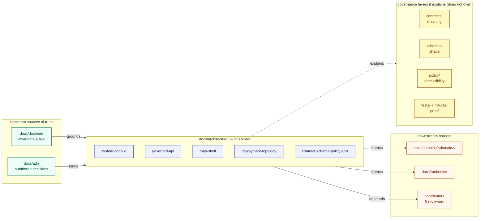

# `docs/architecture/`

> **Cross-cutting architecture explanations for the Kansas Frontier Matrix — the human-readable "how it fits together" companion to doctrine, ADRs, and domain dossiers.**

<!-- Badges: targets are placeholders until CI, repo, and ownership are verified. -->
[](#authority-level)
[](#repo-fit)
[](../doctrine/lifecycle-law.md)
[](../adr/ADR-0001-schema-home.md)
[](#status)
[](#last-reviewed)

| Field | Value |
|---|---|
| **Folder role** | Human-facing architecture surface (cross-cutting; not domain, not doctrine, not ADR). |
| **Authority level** | Canonical (per Directory Rules §5 — `docs/` is the human-facing control plane). |
| **Owners** | Architecture steward · Docs steward *(placeholder — confirm in `CODEOWNERS` / `docs/governance/`)*. |
| **Status** | Active. Folder presence in the mounted repo is **PROPOSED / NEEDS VERIFICATION**. |
| **Repo fit** | Sits inside `docs/`. Reads from `docs/doctrine/` & `docs/adr/`. Read by `docs/domains/<domain>/`, `docs/runbooks/`, contributors. |
| **Conformance** | Follows Directory Rules §15 (Required README Contract). |

**Quick jump:** [Purpose](#purpose) · [Authority level](#authority-level) · [What belongs](#what-belongs-here) · [What doesn't](#what-does-not-belong-here) · [Folder map](#folder-map) · [How to read this folder](#how-to-read-this-folder) · [Diagram](#how-this-folder-fits) · [Inputs](#inputs) · [Outputs](#outputs) · [Validation](#validation) · [Review burden](#review-burden) · [Related folders](#related-folders) · [ADRs](#adrs) · [FAQ](#faq) · [Last reviewed](#last-reviewed)

---

## Purpose

`docs/architecture/` explains the **shape of the system** in human-readable prose: how the trust membrane, the lifecycle law, the contract/schema/policy split, the map shell, and the deployment topology fit together. It is the bridge between doctrine (`docs/doctrine/`, which states the invariants) and decisions (`docs/adr/`, which records the binding choices) — and it is what onboarding readers, reviewers, and domain stewards reach for first when they need a cross-cutting mental model.

It does not decide anything. Decisions live in `docs/adr/`. Object meaning lives in `contracts/`. Shape lives in `schemas/`. Admissibility lives in `policy/`. This folder **explains those layers and how they compose**.

[↑ Back to top](#docsarchitecture)

---

## Authority level

**Canonical** — `docs/` is one of KFM's canonical roots (Directory Rules §5). Within `docs/`, this folder is the cross-cutting architecture surface listed explicitly in Directory Rules §6.1.

| Property | Value |
|---|---|
| Authority class | Canonical |
| Authority kind | Explanatory (not enforcement, not decision) |
| Conflicts with | Doctrine (`docs/doctrine/`) wins. ADRs (`docs/adr/`) win on numbered decisions. |
| Cited by | Directory Rules §0 (`contract-schema-policy-split.md` is named as related doctrine). |

> [!IMPORTANT]
> A `docs/architecture/` page is **not the source of canonical decision**. If a page is cited as the deciding rule, that is anti-pattern §13 *Documentation as truth* — promote the rule to an ADR, doctrine, or `control_plane/` register.

[↑ Back to top](#docsarchitecture)

---

## Status

| Item | Status | Note |
|---|---|---|
| Folder doctrine (this contract) | **CONFIRMED** | Anchored in Directory Rules §6.1 and §15. |
| Folder presence in current repo | **PROPOSED / NEEDS VERIFICATION** | No mounted repo in this session; presence not inspected. |
| Specific child files listed below | **PROPOSED** | Names and roles are doctrinal; existence on disk is unverified. |
| Owners | **NEEDS VERIFICATION** | Confirm against `CODEOWNERS` and `docs/governance/`. |
| ADR linkage | **CONFIRMED for ADR-0001**, **PROPOSED otherwise** | Other ADRs are placeholders until enumerated. |

[↑ Back to top](#docsarchitecture)

---

## What belongs here

Files that are **cross-cutting**, **human-readable**, and **explain how multiple roots compose**.

- **System context** — what KFM is, what it isn't, who it serves, what it interfaces with (sources, public clients, reviewers, downstream consumers).
- **Deployment topology** — how KFM is deployed, exposure posture, trust boundaries between `apps/`, `runtime/`, `infra/`, and the public network.
- **Governed API** — the trust membrane in narrative form: `apps/governed-api/`, `RuntimeResponseEnvelope`, finite outcomes (`ANSWER | ABSTAIN | DENY | ERROR`), endpoint categories, denial tests.
- **Map shell** — MapLibre as a disciplined renderer behind the governed API; the click-to-evidence flow; what the renderer is *not* (truth, policy, citation, AI authority).
- **Contract / schema / policy split** — the four-layer division of labor: `contracts/` (meaning) · `schemas/` (shape) · `policy/` (admissibility) · `tests/` + `fixtures/` (proof of enforceability). This file is named in Directory Rules §0 as related doctrine.
- **New cross-cutting architecture pages** — only when they span multiple roots and are not domain-specific. Pair with an ADR if the page introduces a binding rule.

> [!TIP]
> If a page would only describe one root, it usually belongs in that root's README (e.g., `apps/governed-api/README.md`, `packages/maplibre/README.md`) rather than here. This folder is the **cross-cutting** view.

[↑ Back to top](#docsarchitecture)

---

## What does NOT belong here

| Content | Goes to | Why |
|---|---|---|
| Invariants and law (lifecycle, truth posture, trust membrane, authority ladder, watcher-as-non-publisher) | `docs/doctrine/` | Doctrine is the *what is true*; architecture is the *how it's expressed*. |
| Numbered decisions with `proposed | accepted | superseded | rejected` status | `docs/adr/` | ADRs are the binding decision record per Directory Rules §2.4. |
| Domain-specific architecture (hydrology, soil, fauna, archaeology, …) | `docs/domains/<domain>/` | Domain Placement Law (Directory Rules §12). |
| Object-meaning definitions | `contracts/` | Different governance layer. |
| Machine-checkable schema | `schemas/contracts/v1/...` | Schema-home rule (ADR-0001). |
| Allow / deny / restrict / abstain rules | `policy/` | Policy is executable; explanation about it lives here. |
| Operational procedures, rollback drills, validation runs | `docs/runbooks/` | Runbooks are *how to operate*; this folder is *how it's built*. |
| Generated review/release reports | `docs/reports/` | Generated artifacts; read-only. |
| Machine-readable governance maps and registers | `control_plane/` or `docs/registers/` | Indexes belong with the index layer. |
| Source-descriptor standards or external standards (STAC, DCAT, PROV) | `docs/sources/`, `docs/standards/` | Different concerns. |
| Brand, logos, voice, style | `docs/brand/` or `packages/ui/` | Different concerns. |

[↑ Back to top](#docsarchitecture)

---

## Folder map

The five files below are the doctrinal contents of this folder per Directory Rules §6.1. Each is **PROPOSED** for repo presence until verified against the mounted repo.

```
docs/architecture/
├── README.md                            # this file — folder landing page
├── system-context.md                    # what KFM is and what it interfaces with
├── deployment-topology.md               # how it's deployed, exposed, audited
├── governed-api.md                      # apps/governed-api/ in narrative form
├── map-shell.md                         # MapLibre boundary and click-to-evidence
└── contract-schema-policy-split.md      # the four-layer governance split
```

| File | Role | Audience | Status |
|---|---|---|---|
| `README.md` | This folder's contract and entry point. | All readers. | CONFIRMED contract · PROPOSED on disk |
| `system-context.md` | The KFM "what / who / interfaces" view. | New contributors, reviewers, partners. | PROPOSED |
| `deployment-topology.md` | Components, hosts, network exposure, trust boundaries; expresses `infra/` deny-by-default in prose. | Operators, security reviewers. | PROPOSED |
| `governed-api.md` | Trust membrane; `RuntimeResponseEnvelope`; finite outcomes; endpoint categories; denial tests. | API authors, integrators, reviewers. | PROPOSED |
| `map-shell.md` | MapLibre rules, click-to-evidence flow, evidence drawer fields, UI states. | UI authors, reviewers. | PROPOSED |
| `contract-schema-policy-split.md` | The four-layer division (contracts · schemas · policy · tests/fixtures). | Schema authors, contract authors, reviewers. | PROPOSED |

Additional architecture pages MAY be added when (a) they are cross-cutting, (b) doctrine and an ADR support them, and (c) they are not better placed in a per-root README.

[↑ Back to top](#docsarchitecture)

---

## How to read this folder

Pick the entry point that matches what you came for.

| If you are… | Read first | Then |
|---|---|---|
| New to KFM | `system-context.md` → `contract-schema-policy-split.md` | `docs/doctrine/lifecycle-law.md`, then a domain README under `docs/domains/`. |
| Reviewing a public-API change | `governed-api.md` | `docs/doctrine/trust-membrane.md`, the `apps/governed-api/` README, and any relevant `policy/runtime/` rules. |
| Reviewing a UI / map change | `map-shell.md` | `docs/doctrine/truth-posture.md` (cite-or-abstain), the `apps/explorer-web/` and `packages/maplibre/` READMEs. |
| Reviewing a new schema or contract | `contract-schema-policy-split.md` | ADR-0001 (schema home), `contracts/README.md`, `schemas/README.md`. |
| Working on deployment, exposure, or hardening | `deployment-topology.md` | `infra/README.md`, `docs/security/`, `docs/runbooks/`. |
| Adding a new domain | `system-context.md` → `contract-schema-policy-split.md` | `docs/domains/README.md` and Directory Rules §12 (Domain Placement Law). |

[↑ Back to top](#docsarchitecture)

---

## How this folder fits


```mermaid
flowchart LR
  subgraph upstream["upstream sources of truth"]
    direction TB
    doctrine["docs/doctrine/<br/>invariants & law"]
    adr["docs/adr/<br/>numbered decisions"]
  end

  subgraph here["docs/architecture/ — this folder"]
    direction TB
    sc[system-context]
    gapi[governed-api]
    msh[map-shell]
    dt[deployment-topology]
    csp[contract-schema-policy-split]
  end

  subgraph downstream["downstream readers"]
    direction TB
    domains["docs/domains/&lt;domain&gt;/"]
    runbooks["docs/runbooks/"]
    contributors["contributors<br/>& reviewers"]
  end

  subgraph layers["governance layers it explains (does not own)"]
    direction LR
    contracts["contracts/<br/>meaning"]
    schemas["schemas/<br/>shape"]
    policy["policy/<br/>admissibility"]
    tests["tests/ + fixtures/<br/>proof"]
  end

  doctrine -->|grounds| here
  adr -->|binds| here
  here -->|frames| domains
  here -->|frames| runbooks
  here -->|onboards| contributors
  here -.explains.-> layers

  classDef this fill:#eef2ff,stroke:#3730a3,color:#1e1b4b;
  classDef upstr fill:#ecfdf5,stroke:#047857,color:#064e3b;
  classDef downstr fill:#fff7ed,stroke:#9a3412,color:#7c2d12;
  classDef layer fill:#fef9c3,stroke:#854d0e,color:#713f12;
  class sc,gapi,msh,dt,csp this
  class doctrine,adr upstr
  class domains,runbooks,contributors downstr
  class contracts,schemas,policy,tests layer
```

The diagram reflects the four-layer division named in Directory Rules §6.1: *"docs/ explains; control_plane/ indexes; contracts/ defines meaning; schemas/ defines shape."* This folder lives in the `docs/` layer and explicitly **does not** carry meaning, shape, admissibility, or proof — it points at the homes that do.

[↑ Back to top](#docsarchitecture)

---

## Inputs

Where the content in this folder draws from:

- **Doctrine** — `docs/doctrine/` for the invariants this folder explains in narrative form.
- **ADRs** — `docs/adr/` for binding decisions cited by name and number (e.g., ADR-0001 schema home).
- **Implementation evidence** — READMEs and visible behavior under `apps/`, `packages/`, `runtime/`, `infra/`, `connectors/`, `pipelines/`. Used to keep architecture prose honest.
- **Domain dossiers (lineage)** — domain plans and prior architecture reports under `docs/domains/<domain>/` and `docs/archive/`. Treated as supporting evidence, not authority (Directory Rules §2.1, item 5).
- **External standards** — `docs/standards/` for STAC, DCAT, PROV, and similar references where applicable.

[↑ Back to top](#docsarchitecture)

---

## Outputs

What this folder enables downstream:

- **Onboarding context** for new contributors and reviewers without sending them straight into doctrine.
- **Reviewer mental model** for PRs that touch the trust membrane, the map shell, the contract/schema/policy split, or deployment posture.
- **Cross-references** for `docs/domains/<domain>/` READMEs, `docs/runbooks/`, and per-root READMEs that need a single canonical link to "the architecture page for X".
- **The narrative spine** that ties `contracts/`, `schemas/`, `policy/`, `data/`, and `release/` into a coherent system rather than five disconnected roots.

[↑ Back to top](#docsarchitecture)

---

## Validation

Architecture docs are validated as documents, not as runtime systems. Validators below are **PROPOSED / NEEDS VERIFICATION** until inspected against the mounted repo.

- **Link integrity** — relative links resolve; permalinks (when used to pin a line) point to a real SHA. *(PROPOSED validator: `tools/validators/docs_link_check`.)*
- **Anchor stability** — heading anchors used by other docs do not break silently on revision.
- **Path-claim discipline** — every path mentioned exists in the repo or is labeled `PROPOSED` / `NEEDS VERIFICATION`.
- **ADR linkage** — each ADR cited resolves to an `accepted` or explicitly `proposed`/`superseded` ADR file under `docs/adr/`.
- **Terminology consistency** — names like *RuntimeResponseEnvelope*, *EvidenceBundle*, *EvidenceRef*, *DecisionEnvelope*, *PromotionDecision*, *ReleaseManifest*, *RollbackCard*, *CorrectionNotice*, *RunReceipt*, *AIReceipt* match the contracts that own them; this folder does not silently rename them.
- **Drift register** — material conflicts between this folder and the repo open an entry in `docs/registers/DRIFT_REGISTER.md` rather than silently conforming (Directory Rules §2.5).

> [!NOTE]
> Architecture docs MUST NOT be cited as the source of a canonical decision. If a reviewer is reaching for a sentence in this folder to settle an enforcement dispute, that signals an ADR or doctrine page should exist (Directory Rules §13.5 *Documentation as truth*).

[↑ Back to top](#docsarchitecture)

---

## Review burden

| Change | Reviewers | Extras |
|---|---|---|
| Typo, link fix, formatting | Architecture steward **or** Docs steward. | None. |
| New cross-cutting architecture page | Architecture steward + Docs steward. | If the page introduces a binding rule, an **ADR is required** (Directory Rules §2.4). |
| Substantive revision touching trust membrane, lifecycle invariant, or four-layer split | Architecture steward + Docs steward + at least one subsystem owner of the affected root. | Update `docs/doctrine/` if the invariant moved; cite the ADR. |
| Deletion / relocation of a file | Architecture steward + Docs steward. | Follow Directory Rules §14 migration discipline; preserve anchors or note breakage. |
| Domain-specific change masquerading as cross-cutting | **Reject** with a pointer to `docs/domains/<domain>/`. | — |

Owners are placeholders until confirmed in `CODEOWNERS` (or `.github/CODEOWNERS`) and `docs/governance/`.

[↑ Back to top](#docsarchitecture)

---

## Related folders

<details>
<summary><strong>Doctrine, decisions, and registers (click to expand)</strong></summary>

| Folder | Relationship |
|---|---|
| [`docs/doctrine/`](../doctrine/) | Invariants and law. Architecture explains them; it never overrides them. |
| [`docs/adr/`](../adr/) | Numbered architecture decisions. Architecture pages cite ADRs; ADRs do not live here. |
| [`docs/domains/`](../domains/) | Per-domain architecture. Cross-cutting pages here, domain-specific pages there. |
| [`docs/runbooks/`](../runbooks/) | Operational procedures. This folder frames the system; runbooks operate it. |
| [`docs/registers/`](../registers/) | Drift, verification, authority-ladder, deprecation registers. |
| [`docs/standards/`](../standards/) | External standards KFM conforms to (STAC, DCAT, PROV, etc.). |
| [`docs/security/`](../security/) | Threat model, exposure posture, incident response. Pairs with `deployment-topology.md`. |
| [`docs/governance/`](../governance/) | Roles, review burden, separation of duties. Pairs with `governed-api.md`. |

</details>

<details>
<summary><strong>Implementation roots this folder explains (click to expand)</strong></summary>

| Folder | What this folder says about it |
|---|---|
| [`contracts/`](../../contracts/) | Owns object meaning. `contract-schema-policy-split.md` explains the boundary with `schemas/` and `policy/`. |
| [`schemas/`](../../schemas/) | Owns machine-checkable shape. Default home `schemas/contracts/v1/...` per ADR-0001. |
| [`policy/`](../../policy/) | Owns admissibility (allow/deny/restrict/abstain). Singular root; `policies/` is compatibility only (Directory Rules §6.5). |
| [`apps/governed-api/`](../../apps/governed-api/) | The trust membrane in executable form; `governed-api.md` is its narrative. |
| [`apps/explorer-web/`](../../apps/explorer-web/) + [`packages/maplibre/`](../../packages/maplibre/) | The disciplined map shell; `map-shell.md` is its narrative. |
| [`runtime/`](../../runtime/), [`infra/`](../../infra/) | Local adapters and deployment posture; `deployment-topology.md` is their narrative. |
| [`control_plane/`](../../control_plane/) | Machine-readable indexes. This folder explains; `control_plane/` indexes. |

All paths above are **PROPOSED / NEEDS VERIFICATION** for current repo presence.

</details>

[↑ Back to top](#docsarchitecture)

---

## ADRs

| ADR | Status | Why it matters here |
|---|---|---|
| **ADR-0001 — Schema home** | Cited as accepted in Directory Rules §0 (CONFIRMED in doctrine; **NEEDS VERIFICATION** for the ADR file's presence on disk). | Sets `schemas/contracts/v1/...` as default schema home; central to `contract-schema-policy-split.md`. |
| *(future) ADR for `apps/api/` vs `apps/governed-api/` boundary* | PROPOSED | Directory Rules §7.1 leaves this open; resolution belongs in an ADR, summarized here. |
| *(future) ADR for `policies/` ↔ `policy/` resolution* | PROPOSED | Directory Rules §6.5 names this as open; resolution belongs in an ADR, summarized here. |
| *(future) ADR for `triplets/` vs `triplet/` form* | PROPOSED | Directory Rules §18 lists as open. |

Adding an ADR here means linking it from the relevant architecture page **and** from `docs/adr/README.md`.

[↑ Back to top](#docsarchitecture)

---

## FAQ

<details>
<summary><strong>How is this folder different from <code>docs/doctrine/</code>?</strong></summary>

Doctrine states *what is true* (the invariants: lifecycle law, truth posture, trust membrane, authority ladder, watcher-as-non-publisher). Architecture explains *how those truths are expressed in the running system* — the topology, the API envelope, the map boundary, the four-layer split. Doctrine wins on conflict.
</details>

<details>
<summary><strong>How is this folder different from <code>docs/adr/</code>?</strong></summary>

ADRs are decisions: dated, numbered, with `proposed | accepted | superseded | rejected` status. Architecture pages explain the resulting system and cite ADRs by number. A page here SHOULD NOT be the binding record of a decision; promote that to an ADR (Directory Rules §13.5).
</details>

<details>
<summary><strong>Where does a domain-specific architecture page go?</strong></summary>

`docs/domains/<domain>/`, not here. Domain Placement Law (Directory Rules §12) says domains live as lanes inside responsibility roots. Cross-cutting prose that genuinely spans multiple domains MAY live here; if it would only matter to one domain, it belongs in that domain's folder.
</details>

<details>
<summary><strong>Should I add diagrams?</strong></summary>

Yes, when they reflect real structure or responsibility boundaries. Mermaid is preferred for inline rendering on GitHub. Decorative diagrams are out; diagrams that paper over weak grounding should be replaced with `Diagram omitted — NEEDS VERIFICATION` and an open question.
</details>

<details>
<summary><strong>What if the repo conflicts with what an architecture page describes?</strong></summary>

Open a `docs/registers/DRIFT_REGISTER.md` entry and propose a resolution: an ADR amending architecture, or a migration plan bringing the repo into conformance. Do not silently update the page to match the repo (Directory Rules §2.5).
</details>

<details>
<summary><strong>What goes in <code>contract-schema-policy-split.md</code> versus <code>contracts/README.md</code>?</strong></summary>

`contract-schema-policy-split.md` explains the **division of labor** across `contracts/`, `schemas/`, `policy/`, and `tests/` — the four-layer story. `contracts/README.md` describes only what `contracts/` itself owns. The split file is the cross-cutting view; the per-root README is the local view.
</details>

[↑ Back to top](#docsarchitecture)

---

## Last reviewed

| Field | Value |
|---|---|
| Last reviewed | `YYYY-MM-DD` *(placeholder — set on first PR)* |
| Reviewer | `<name>` *(placeholder)* |
| Next review trigger | Material change to doctrine, schema-home rule, governed-API envelope, or map-shell boundary; or 6 months since last review (Directory Rules §15). |

> If this date is older than six months, the folder is a drift candidate. Open a verification PR or a `docs/registers/DRIFT_REGISTER.md` entry.

[↑ Back to top](#docsarchitecture)
