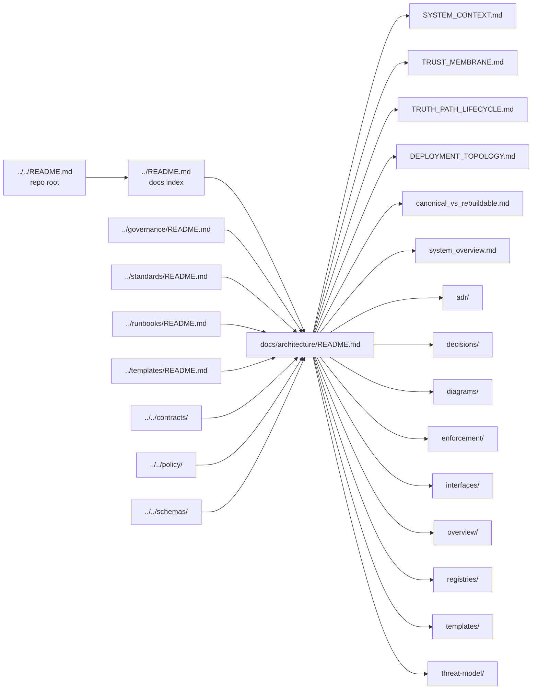

<!-- [KFM_META_BLOCK_V2]
doc_id: kfm://doc/<uuid-NEEDS-VERIFICATION>
title: Architecture
type: standard
version: v1
status: review
owners: NEEDS VERIFICATION — see ../../.github/CODEOWNERS
created: YYYY-MM-DD
updated: YYYY-MM-DD
policy_label: NEEDS VERIFICATION
related: [../../README.md, ../README.md, ../governance/README.md, ../standards/README.md, ../runbooks/README.md, ../templates/README.md, ../../contracts/, ../../policy/, ../../schemas/]
tags: [kfm, architecture, trust-membrane, truth-path, evidence-first]
notes: [doc_id, owners, dates, and policy_label require repo verification before commit; current directory surface verified from the public repo tree; deeper subdirectory contents still need per-file verification]
[/KFM_META_BLOCK_V2] -->

# Architecture

System-level architecture law, boundary map, and navigation hub for Kansas Frontier Matrix (KFM).

> Status: experimental _(NEEDS VERIFICATION against branch owner intent)_  
> Owners: NEEDS VERIFICATION — check [`../../.github/CODEOWNERS`](../../.github/CODEOWNERS)  
>        
> Quick jumps: [Scope](#scope) · [Repo fit](#repo-fit) · [Inputs](#inputs) · [Exclusions](#exclusions) · [Directory tree](#directory-tree) · [Quickstart](#quickstart) · [Usage](#usage) · [Diagram](#diagram) · [Reference tables](#reference-tables) · [Task list](#task-list) · [FAQ](#faq) · [Appendix](#appendix)

> [!IMPORTANT]
> `docs/architecture/` is part of KFM’s trust model. It explains architectural law; it does not replace runtime enforcement. If a change alters trust boundaries, truth-path stages, contract surfaces, citation behavior, policy mediation, or release proof obligations, update the relevant docs, contracts, policy fixtures, and merge-blocking checks in the same governed change stream.

## Scope

`docs/architecture/` is the system-level documentation home for KFM’s architectural laws and cross-cutting boundaries: the trust membrane, truth path lifecycle, authoritative-versus-rebuildable split, governed API posture, runtime proof obligations, and the map-first/time-aware product shell.

This README is intentionally conservative. It should help a reviewer answer four questions quickly:

1. What architectural laws are non-negotiable?
2. Which files and folders currently make up the architecture surface?
3. Where should new architecture material go?
4. What must be updated when architecture changes?

### Truth posture used here

| Marker | Meaning in this README |
|---|---|
| `CONFIRMED` | Directly supported by visible repo structure or stable KFM doctrine |
| `PROPOSED` | Buildable repo-native direction consistent with KFM doctrine, but not proven as current branch behavior |
| `UNKNOWN` | Not verified strongly enough to present as current implementation fact |
| `NEEDS VERIFICATION` | Placeholder path, owner, date, or repo detail that should be checked before commit |

[Back to top](#architecture)

## Repo fit

| Field | Value |
|---|---|
| Path | `docs/architecture/README.md` |
| Directory role | Architecture index for system boundaries, trust rules, lifecycle law, and architecture-adjacent references |
| Primary upstream anchors | [`../../README.md`](../../README.md), [`../README.md`](../README.md), [`../governance/README.md`](../governance/README.md), [`../standards/README.md`](../standards/README.md), [`../runbooks/README.md`](../runbooks/README.md), [`../templates/README.md`](../templates/README.md) |
| Architecture-critical machine surfaces | [`../../contracts/`](../../contracts/), [`../../policy/`](../../policy/), [`../../schemas/`](../../schemas/) |
| Current downstream surface | Files and folders currently visible under `docs/architecture/` in the public tree; see [Directory tree](#directory-tree) |
| Why this directory matters | It keeps KFM’s system laws legible without creating a second truth path |

### Repo relationship map

Architecture docs sit between doctrine and execution:

- repo root explains **project identity and top-level posture**
- `docs/` explains the **documentation system**
- `docs/architecture/` explains **system law and boundary logic**
- `contracts/`, `policy/`, and `schemas/` make critical parts **machine-checkable**
- `apps/`, `packages/`, `data/`, and `infra/` implement the governed runtime and lifecycle

[Back to top](#architecture)

## Inputs

Content that belongs here includes:

- system context and boundary documents
- trust membrane, truth-path, and authoritative-versus-derived design notes
- deployment topology and runtime boundary docs
- architecture diagrams that explain flows, write-rights, and enforcement points
- ADRs and decision records for architecture-significant changes
- interface registries, threat models, and architecture-facing contract pointers
- cross-cutting architecture guidance that affects more than one service or one dataset lane

## Exclusions

The following do **not** belong here as their authoritative home:

| Do not put this here | Keep it instead |
|---|---|
| Policy rule bodies, obligation logic, default-deny fixtures | [`../../policy/`](../../policy/) |
| Canonical machine contracts, OpenAPI, JSON Schemas, vocabularies | [`../../contracts/`](../../contracts/) and [`../../schemas/`](../../schemas/) |
| Runtime service code, workers, UI components, adapters | [`../../apps/`](../../apps/) and [`../../packages/`](../../packages/) |
| Secrets, credentials, production-only access instructions | approved secret-management / runtime configuration surfaces |
| Run outputs, receipts, manifests, proof objects as live artifacts | governed data / release / evidence surfaces, not ad hoc docs storage |
| Product roadmap prose, user stories, project-planning notes | project planning surfaces, ADRs, or other governed docs only when promoted |
| Single-service implementation tutorials | service-local docs or [`../runbooks/README.md`](../runbooks/README.md) if operational |
| Exact coordinates for sensitive or restricted locations | generalized or restricted handling under governance rules |

[Back to top](#architecture)

## Current verified snapshot

The public repo tree currently confirms that `docs/architecture/` exists and contains both subdirectories and standalone architecture files.

> [!NOTE]
> Presence is confirmed from the current public tree. Exact purpose is obvious in many cases from filenames, but deeper content claims should still be checked file-by-file before being promoted from `PROPOSED` to `CONFIRMED`.

## Directory tree

### Current visible tree

```text
docs/architecture/
├── adr/
├── decisions/
├── diagrams/
├── enforcement/
├── interfaces/
├── overview/
├── registries/
├── templates/
├── threat-model/
├── DEPLOYMENT_TOPOLOGY.md
├── README.md
├── SYSTEM_CONTEXT.md
├── TRUST_MEMBRANE.md
├── TRUTH_PATH_LIFECYCLE.md
├── canonical_vs_rebuildable.md
├── system_overview.md
└── trust_membrane.md
```

### Current surface notes

| Path | Status | Working use |
|---|---|---|
| `adr/` | `CONFIRMED` | Architecture decision records |
| `decisions/` | `CONFIRMED` | Additional decision material or decision logs |
| `diagrams/` | `CONFIRMED` | Architecture visuals and source diagrams |
| `enforcement/` | `CONFIRMED` | Architecture-facing enforcement references |
| `interfaces/` | `CONFIRMED` | Interface and boundary documentation |
| `overview/` | `CONFIRMED` | High-level architecture overviews |
| `registries/` | `CONFIRMED` | Architecture-facing registries / inventories |
| `templates/` | `CONFIRMED` | Architecture-local template material |
| `threat-model/` | `CONFIRMED` | Threat-modeling artifacts |
| `SYSTEM_CONTEXT.md` | `CONFIRMED` | System boundary and context anchor |
| `TRUST_MEMBRANE.md` | `CONFIRMED` | Normative trust boundary reference |
| `TRUTH_PATH_LIFECYCLE.md` | `CONFIRMED` | Lifecycle and promotion-path reference |
| `DEPLOYMENT_TOPOLOGY.md` | `CONFIRMED` | Deployment and runtime-topology reference |
| `canonical_vs_rebuildable.md` | `CONFIRMED` | Authority vs projection / rebuildability rule |
| `system_overview.md` | `CONFIRMED` | General system overview |
| `trust_membrane.md` | `CONFIRMED` | **Needs review**: case-variant duplicate or separate document; confirm intent before cross-linking as canonical |

### Architectural law this tree must preserve

- docs explain boundaries; they do not bypass them
- runtime truth stays downstream of the governed API and policy boundary
- authoritative data remains distinct from derived or rebuildable delivery layers
- architecture docs must stay aligned with contracts, policy, and CI gates when behavior changes

[Back to top](#architecture)

## Quickstart

Use a verification-first reading sequence before editing anything under `docs/architecture/`.

```bash
# Start at the repo root
sed -n '1,120p' README.md

# Read the docs index and neighboring governing surfaces
sed -n '1,160p' docs/README.md
sed -n '1,200p' docs/governance/README.md
sed -n '1,200p' docs/standards/README.md
sed -n '1,200p' docs/runbooks/README.md
sed -n '1,200p' docs/templates/README.md

# Then inspect the architecture surface itself
find docs/architecture -maxdepth 2 -type f | sort
sed -n '1,220p' docs/architecture/README.md
```

### Starting a new architecture note

Use the repo’s general-purpose KFM template and fill in MetaBlock v2 before writing content.

```bash
cp docs/templates/TEMPLATE__KFM_UNIVERSAL_DOC.md docs/architecture/<topic>.md
```

[Back to top](#architecture)

## Usage

### Reading order for reviewers

1. Read this file for architecture law and pathing.
2. Read `SYSTEM_CONTEXT.md`, `TRUST_MEMBRANE.md`, and `TRUTH_PATH_LIFECYCLE.md` before touching service shape or runtime flow.
3. Move into `interfaces/`, `enforcement/`, `diagrams/`, and `threat-model/` only after the core invariants are clear.
4. If the change touches policy, standards, or runtime procedure, review neighboring docs in `../governance/`, `../standards/`, and `../runbooks/` in the same pass.

### Reading order for authors

1. Verify the existing path and file name you intend to edit.
2. State architectural claims with `CONFIRMED`, `PROPOSED`, `UNKNOWN`, or `NEEDS VERIFICATION` when precision matters.
3. Keep repo-shaped claims conservative unless the current branch proves them.
4. Update links, tables, and diagrams when directory shape changes.
5. When behavior changes, update the relevant contracts and tests alongside docs.

### When an architecture change is governed

Treat the change as governed when it affects any of the following:

- trust membrane or client/store separation
- lifecycle zones or promotion gates
- evidence resolution or citation behavior
- authoritative-versus-rebuildable rules
- runtime boundary posture, deployment topology, or exposure model
- sensitivity handling, geometry generalization, or public-safe location behavior

[Back to top](#architecture)

## Diagram


```mermaid
flowchart LR
  Root["../../README.md<br/>repo root"] --> Docs["../README.md<br/>docs index"]
  Docs --> Arch["docs/architecture/README.md"]

  Arch --> Ctx["SYSTEM_CONTEXT.md"]
  Arch --> Mem["TRUST_MEMBRANE.md"]
  Arch --> Life["TRUTH_PATH_LIFECYCLE.md"]
  Arch --> Dep["DEPLOYMENT_TOPOLOGY.md"]
  Arch --> Canon["canonical_vs_rebuildable.md"]
  Arch --> Over["system_overview.md"]

  Arch --> ADR["adr/"]
  Arch --> Dec["decisions/"]
  Arch --> Dia["diagrams/"]
  Arch --> Enf["enforcement/"]
  Arch --> Int["interfaces/"]
  Arch --> Ovr["overview/"]
  Arch --> Reg["registries/"]
  Arch --> Tmp["templates/"]
  Arch --> Thr["threat-model/"]

  Gov["../governance/README.md"] --> Arch
  Std["../standards/README.md"] --> Arch
  Run["../runbooks/README.md"] --> Arch
  Tpl["../templates/README.md"] --> Arch
  Con["../../contracts/"] --> Arch
  Pol["../../policy/"] --> Arch
  Sch["../../schemas/"] --> Arch
```

This directory is the bridge between KFM doctrine and repo execution: it explains the laws that contracts, policy, CI, and runtime are expected to enforce.

[Back to top](#architecture)

## Reference tables

### KFM architecture laws this README should keep visible

| Law | Minimum architectural implication |
|---|---|
| Trust membrane | clients and public surfaces do not bypass the governed API / policy boundary |
| Truth path | promoted runtime surfaces stay downstream of `Source edge → RAW → WORK / QUARANTINE → PROCESSED → CATALOG / TRIPLET → PUBLISHED` |
| Authoritative vs rebuildable | search, graph, tiles, summaries, and other projections do not silently become sovereign truth |
| Cite-or-abstain | consequential user-facing claims resolve to evidence or abstain |
| Fail-closed posture | missing rights, broken catalogs, unresolved citations, or absent policy block promotion and release |
| Docs are not enforcement | important invariants must have contract, policy, CI, or runtime enforcement points |

### Cross-repo architecture surfaces

| Surface | Why architecture readers care |
|---|---|
| [`../../contracts/`](../../contracts/) | canonical machine contracts and interface definitions |
| [`../../schemas/`](../../schemas/) | machine-validatable object structure |
| [`../../policy/`](../../policy/) | default-deny logic, obligations, and policy tests |
| [`../governance/README.md`](../governance/README.md) | review gates, sovereignty, sensitivity, waiver logic |
| [`../standards/README.md`](../standards/README.md) | normative profiles, authoring standards, change control |
| [`../runbooks/README.md`](../runbooks/README.md) | safe operational procedures, rollback, and evidence capture |
| [`../templates/README.md`](../templates/README.md) | MetaBlock v2 and governed document templates |
| [`../../apps/`](../../apps/) and [`../../packages/`](../../packages/) | implementation surfaces that must obey the documented boundaries |

### Architecture change matrix

| Change type | Examples | Required coordinated updates |
|---|---|---|
| Interface boundary change | new endpoint, auth change, error model shift | contracts, tests, migration notes, architecture references |
| Governance-sensitive change | new `policy_label`, new obligation, new review rule | governance docs, policy fixtures/tests, sign-off path |
| Lifecycle change | new gate, new zone, new promotion rule | lifecycle docs, receipt/manifest expectations, CI checks |
| Catalog / evidence change | new STAC/DCAT/PROV rule, resolver behavior, citation contract | validators, link checks, evidence docs, fixtures |
| Runtime topology change | new exposure path, new deployment posture, model-runtime move | deployment docs, threat model, runbooks, rollback plan |
| Derived-layer change | new index, graph, tile, or cache surface | authoritative-vs-rebuildable docs, rebuild plan, policy inheritance notes |

[Back to top](#architecture)

## Task list

### Definition of done for architecture changes

- [ ] This README is updated if the trust membrane, truth path, directory surface, or architecture contracts changed.
- [ ] The relevant ADR or decision record is added or updated.
- [ ] Contracts, policy fixtures, and merge-blocking checks are updated where the change is enforceable.
- [ ] Reversible migration / rollback thinking is documented when behavior changes.
- [ ] Security, privacy, and sensitive-location implications are reviewed.
- [ ] Evidence resolution still works end-to-end for the affected surface.
- [ ] Any `UNKNOWN` / `NEEDS VERIFICATION` claims introduced by the change include a concrete verification step.

### Minimum verification steps before upgrading a claim to `CONFIRMED`

- [ ] capture repo commit hash and current tree
- [ ] enumerate current merge-blocking CI checks
- [ ] verify policy pack/tests, validators, and relevant contract files
- [ ] verify the evidence resolver path used by affected surfaces
- [ ] verify no client bypass of the governed API / PEP
- [ ] retain proof artifacts for one representative end-to-end path

### High-value cleanup items visible now

- [ ] confirm whether `TRUST_MEMBRANE.md` and `trust_membrane.md` are intentional peers or casing drift
- [ ] confirm owners from `../../.github/CODEOWNERS`
- [ ] replace placeholder MetaBlock values with stable repo values
- [ ] add or confirm per-subdirectory `README.md` files where navigation would otherwise stay implicit

[Back to top](#architecture)

## FAQ

### Why is this README not the authoritative source for contracts or policy?

Because KFM separates human-readable guidance from machine-enforced truth. This README should explain the architectural law, but the actual contract and policy bodies belong in `contracts/`, `schemas/`, and `policy/`.

### Should I put service-specific design notes here?

Only if the note changes a cross-cutting architectural boundary or a shared invariant. Service-local implementation detail belongs closer to the service or in a runbook.

### Do architecture docs get to overrule governance or standards?

No. Architecture, governance, standards, contracts, and runbooks must agree. If they do not, resolve the contradiction explicitly and update the affected surfaces in the same change stream.

### Do new architecture notes need MetaBlock v2?

Yes. Start from the KFM universal template, keep the HTML-comment MetaBlock, and fill in placeholders before merge.

### Are diagrams enough to make a rule real?

No. Diagrams clarify. Contracts, policy, CI gates, and runtime behavior enforce.

[Back to top](#architecture)

## Appendix

<details>
<summary>Appendix — verified paths, authoring rules, and review notes</summary>

### Verified path set used by this README

The current public tree confirms these architecture paths:

- `docs/architecture/adr/`
- `docs/architecture/decisions/`
- `docs/architecture/diagrams/`
- `docs/architecture/enforcement/`
- `docs/architecture/interfaces/`
- `docs/architecture/overview/`
- `docs/architecture/registries/`
- `docs/architecture/templates/`
- `docs/architecture/threat-model/`
- `docs/architecture/DEPLOYMENT_TOPOLOGY.md`
- `docs/architecture/SYSTEM_CONTEXT.md`
- `docs/architecture/TRUST_MEMBRANE.md`
- `docs/architecture/TRUTH_PATH_LIFECYCLE.md`
- `docs/architecture/canonical_vs_rebuildable.md`
- `docs/architecture/system_overview.md`
- `docs/architecture/trust_membrane.md`

### Authoring rule for new architecture docs

Use [`../templates/README.md`](../templates/README.md) and start from [`../templates/TEMPLATE__KFM_UNIVERSAL_DOC.md`](../templates/TEMPLATE__KFM_UNIVERSAL_DOC.md). Fill in MetaBlock v2, bind claims to evidence, then run the relevant checks before opening a PR.

### Review note on path drift

This directory currently shows one obvious review target: the simultaneous presence of `TRUST_MEMBRANE.md` and `trust_membrane.md`. Until that is resolved, avoid assuming one is canonical without checking content and branch history.

</details>

[Back to top](#architecture)