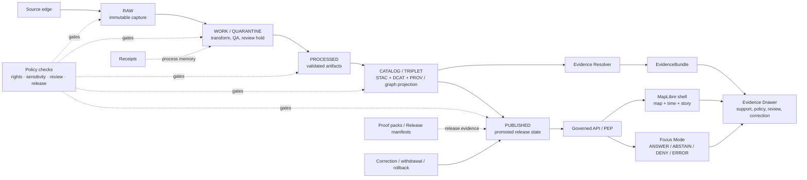

<!-- [KFM_META_BLOCK_V2]
doc_id: "TODO(repo-review): assign kfm://doc/<uuid>"
title: KFM Architecture Documentation
type: standard
version: v1
status: draft
owners: "TODO(repo-review): confirm docs/architecture owners"
created: "TODO(repo-review): confirm original creation date, or set to 2026-04-22 if this is a new file"
updated: 2026-04-22
policy_label: "TODO(repo-review): confirm public|restricted"
related: ["TODO(repo-review): docs/README.md", "TODO(repo-review): docs/registers/AUTHORITY_LADDER.md", "TODO(repo-review): contracts/OBJECT_MAP.md", "TODO(repo-review): schemas/contracts/v1/"]
tags: [kfm, architecture, evidence-first, map-first, governed]
notes: ["Drafted from attached KFM corpus and current workspace inspection.", "Mounted repo tree was not available during authoring; verify owners, links, doc_id, and adjacent paths before publishing."]
[/KFM_META_BLOCK_V2] -->

<a id="top"></a>

# KFM Architecture Documentation

Orientation and guardrails for architecture docs that preserve KFM’s governed, evidence-first, map-first, time-aware trust model.


> [!IMPORTANT]
> **Status:** experimental README draft  
> **Owners:** TODO(repo-review): confirm `docs/architecture/` owner or team  
> **Path:** `docs/architecture/README.md`  
> **Role:** landing page and review contract for architecture documentation, not a substitute for schemas, policies, proofs, or implementation evidence  
> **Quick jumps:** [Scope](#scope) · [Repo fit](#repo-fit) · [Inputs](#inputs) · [Exclusions](#exclusions) · [Directory tree](#directory-tree) · [Architecture boundaries](#architecture-boundaries) · [Diagram](#diagram) · [Review gates](#review-gates) · [Verification backlog](#verification-backlog)

---

## Scope

`docs/architecture/` is the repo home for **architecture-level explanation, boundary setting, and design governance**.

Use this directory to explain how KFM’s major responsibilities fit together:

- evidence lifecycle and promotion boundaries
- governed API, EvidenceBundle, policy, and publication boundaries
- MapLibre shell, Evidence Drawer, Focus Mode, and trust-visible UI responsibilities
- domain-lane architecture patterns that apply across hydrology, soils, habitat, fauna, flora, hazards, archaeology, infrastructure, and related lanes
- contracts-versus-schemas-versus-policy placement decisions
- architecture decision records and cross-cutting diagrams that help maintainers reason about the system

This directory should help a maintainer answer:

1. **What is the architectural boundary?**
2. **What evidence or doctrine supports it?**
3. **What is confirmed, proposed, unknown, or still awaiting verification?**
4. **What must never be bypassed by implementation, UI, AI, or publication work?**

[Back to top](#top)

---

## Current verification boundary

| Claim area | Status | What this README can safely say |
|---|---:|---|
| KFM doctrine | **CONFIRMED from supplied corpus** | KFM is governed, evidence-first, map-first, time-aware, and publication-conscious. |
| Target path | **CONFIRMED from task** | This draft targets `docs/architecture/README.md`. |
| Actual repo tree | **UNKNOWN** | The mounted checkout was not available during authoring; adjacent links and owners need review. |
| Implementation maturity | **UNKNOWN** | Do not infer route names, DTOs, tests, workflows, dashboards, or runtime enforcement from this README alone. |
| File homes below | **PROPOSED / NEEDS VERIFICATION** | Use the path map as a review scaffold until the real repository confirms conventions. |

> [!WARNING]
> Architecture docs may describe KFM doctrine and intended boundaries, but they must not claim that enforcement, tests, APIs, schemas, workflows, or runtime behavior exist unless verified from repo files, CI output, logs, emitted artifacts, or other direct implementation evidence.

---

## Repo fit

**Path:** `docs/architecture/README.md`  
**Directory role:** architecture landing page and contributor orientation surface.

| Direction | Surface | Status | Relationship |
|---|---|---:|---|
| Upstream | `docs/README.md` | **NEEDS VERIFICATION** | Parent docs landing should link here after repo review. |
| Upstream | root `README.md` | **NEEDS VERIFICATION** | Root landing should point to the architecture spine only if this file is accepted. |
| Peer | `docs/adr/` | **PROPOSED / NEEDS VERIFICATION** | ADRs should record durable architecture decisions, especially schema-home and boundary decisions. |
| Peer | `docs/registers/` | **PROPOSED / NEEDS VERIFICATION** | Registers should hold authority ladders, object maps, and canonical/lineage/exploratory indexes. |
| Peer | `docs/domains/` | **PROPOSED / NEEDS VERIFICATION** | Domain docs should apply shared architecture rules without redefining the whole system. |
| Downstream | `schemas/contracts/v1/` | **PROPOSED / NEEDS VERIFICATION** | Machine-readable contracts should be linked, not copied into prose. |
| Downstream | `contracts/api/` and `contracts/runtime/` | **PROPOSED / NEEDS VERIFICATION** | API/runtime contracts should bind architecture claims to interface surfaces. |
| Downstream | `policy/` | **PROPOSED / NEEDS VERIFICATION** | Policy-as-code should enforce release, rights, sensitivity, and trust-boundary behavior. |
| Downstream | `data/receipts/`, `data/proofs/`, `release/` | **PROPOSED / NEEDS VERIFICATION** | Receipts, proofs, and releases must remain separate trust objects, not prose summaries. |

### Fit rule

This README belongs here because architecture docs sit between **doctrine** and **implementation**. They should clarify system shape without pretending to be source code, schema registry, policy engine, proof pack, or release manifest.

[Back to top](#top)

---

## Inputs

Architecture docs in this directory may accept the following source-grounded inputs.

| Input | Belongs here when… | Required posture |
|---|---|---|
| KFM doctrine | It defines a stable invariant, boundary, or trust rule. | Label as **CONFIRMED doctrine** when supported by corpus. |
| ADRs | A choice changes architecture, file homes, contracts, policy boundaries, publication flow, UI/AI placement, or release behavior. | Keep decision, context, consequences, rollback, and verification path visible. |
| Contract/schema summaries | They explain where machine contracts live and how they relate. | Link to machine files; do not duplicate as prose-only truth. |
| Policy boundary notes | They explain rights, sensitivity, public exposure, AI, or map-client restrictions. | Treat fail-closed behavior as the default when risk matters. |
| Domain-lane architecture | A domain needs shared architecture rules applied to its source roles, artifacts, and publication path. | Keep domain-specific detail in `docs/domains/` where possible; link back here for shared rules. |
| UI architecture | It explains shell-level trust behavior, Evidence Drawer payloads, layer boundaries, or Focus Mode constraints. | Preserve map-first, time-aware, evidence-visible operation. |
| Implementation evidence | Repo files, tests, workflows, logs, emitted receipts, or generated proof objects support a current-state claim. | Cite or link the evidence; otherwise mark **NEEDS VERIFICATION**. |

---

## Exclusions

Do **not** use `docs/architecture/` as a dumping ground for everything technical.

| Excluded material | Why it does not belong here | Better home |
|---|---|---|
| RAW, WORK, or QUARANTINE data | Architecture prose must not become a data store or bypass lifecycle controls. | `data/raw/`, `data/work/`, `data/quarantine/` — **NEEDS VERIFICATION** |
| Generated proofs, receipts, manifests, or attestations | These are trust objects, not documentation decoration. | `data/proofs/`, `data/receipts/`, `release/` — **NEEDS VERIFICATION** |
| Machine schemas copied into prose | Prose drifts; machine contracts need validation. | `schemas/contracts/v1/` or repo-confirmed schema home |
| Policy rules embedded only in Markdown | Public safety and publication controls need executable enforcement. | `policy/` plus tests |
| Live source credentials or secrets | Security boundary violation. | Secret manager / infra configuration — **NEEDS VERIFICATION** |
| Exact sensitive locations | Archaeology, rare species, cultural/sacred locations, critical infrastructure, DNA/living-person context, and similar surfaces fail closed. | Restricted governed stores with redaction/generalization receipts |
| Exploratory idea packets promoted as architecture law | New ideas are useful pressure, not canon by default. | `docs/intake/` or repo-confirmed idea intake lane |
| UI polish without trust payloads | KFM UI is a trust surface, not decoration. | UI implementation docs plus Evidence Drawer / LayerManifest contracts |

[Back to top](#top)

---

## Directory tree

The real repository tree was not mounted during this drafting pass. This is therefore the **minimum target tree**, not a confirmed inventory.

```text
docs/
└── architecture/
    └── README.md  # this file; target path supplied by the task
```

### Proposed adjacent documentation homes

These homes are consistent with the current KFM corpus but remain **NEEDS VERIFICATION** until checked against the actual repository.

```text
docs/
├── adr/
├── architecture/
├── domains/
├── registers/
└── runbooks/

schemas/
└── contracts/
    └── v1/

contracts/
├── api/
└── runtime/

policy/
tools/
pipelines/
data/
release/
apps/
packages/
tests/
.github/
```

> [!NOTE]
> If the mounted repo proves a different convention, keep the architecture meaning stable and adapt paths through an ADR. Do not fork the architecture into parallel homes.

[Back to top](#top)

---

## Architecture boundaries

KFM architecture documentation should preserve these boundaries before it optimizes for polish.

| Boundary | Architecture rule | Common failure to reject |
|---|---|---|
| Lifecycle | `RAW -> WORK / QUARANTINE -> PROCESSED -> CATALOG / TRIPLET -> PUBLISHED` remains the governing flow. | Publishing because a layer looks right. |
| Trust membrane | Public clients use governed APIs, released artifacts, catalogs, tile services, and EvidenceBundle resolution. | UI, AI, or scripts reading canonical/internal stores directly. |
| Evidence hierarchy | EvidenceBundle and source evidence outrank generated language, indexes, tiles, graph projections, scenes, and summaries. | Treating an AI answer, map tile, or graph edge as root truth. |
| Catalog closure | STAC / DCAT / PROV-style closure belongs at the catalog/release boundary, not as detached prose. | Flattening catalog, proof, receipt, and release objects into one Markdown note. |
| Policy | Rights, sensitivity, review, publication, and exact-location exposure fail closed where risk matters. | Bolting policy onto the UI after data is already public. |
| UI shell | MapLibre is a disciplined 2D renderer inside a governed shell, not the source of authority. | Letting renderer convenience define truth boundaries. |
| Focus Mode | Focus is bounded synthesis over admissible evidence with finite outcomes. | A detached chatbot that can answer without EvidenceBundle closure. |
| Domain lanes | Domain lanes specialize shared governance objects; they do not redefine KFM law. | Each lane inventing its own source, proof, policy, or release vocabulary. |

---

## Diagram

The diagram below is a doctrine-level architecture map. It is not proof of implementation.


```mermaid
flowchart LR
    SE["Source edge"] --> RAW["RAW<br/>immutable capture"]
    RAW --> WQ["WORK / QUARANTINE<br/>transform, QA, review hold"]
    WQ --> PR["PROCESSED<br/>validated artifacts"]
    PR --> CAT["CATALOG / TRIPLET<br/>STAC + DCAT + PROV / graph projection"]
    CAT --> PUB["PUBLISHED<br/>promoted release state"]

    PUB --> API["Governed API / PEP"]
    CAT --> ER["Evidence Resolver"]
    ER --> EB["EvidenceBundle"]

    API --> MAP["MapLibre shell<br/>map + time + story"]
    API --> FOCUS["Focus Mode<br/>ANSWER / ABSTAIN / DENY / ERROR"]
    EB --> DRAWER["Evidence Drawer<br/>support, policy, review, correction"]

    MAP --> DRAWER
    FOCUS --> DRAWER

    POL["Policy checks<br/>rights · sensitivity · review · release"] -. gates .-> RAW
    POL -. gates .-> WQ
    POL -. gates .-> PR
    POL -. gates .-> CAT
    POL -. gates .-> PUB

    REC["Receipts"] -. process memory .-> WQ
    PROOF["Proof packs / Release manifests"] -. release evidence .-> PUB
    CORR["Correction / withdrawal / rollback"] --> PUB
```

[Back to top](#top)

---

## Architecture document types

| Document type | Use it for | Must include |
|---|---|---|
| Architecture README | Landing, navigation, scope, accepted inputs, exclusions, and review posture. | Impact block, repo fit, truth labels, verification notes. |
| ADR | A durable choice with consequences. | Context, decision, alternatives, consequences, validation, rollback. |
| Boundary note | A focused explanation of a trust, API, UI, schema, or policy seam. | What crosses the seam, what must not cross, and how to test it. |
| Object map | Relationship between proof objects, contracts, schemas, policies, fixtures, receipts, manifests, and releases. | Status labels and canonical homes. |
| Diagram note | A visual architecture explanation. | Mermaid or repo-relative image plus text explaining source of truth and limits. |
| Migration note | A transition from old path, term, or pattern to new one. | Compatibility, supersession, rollback, and link updates. |

---

## Proof vocabulary quick reference

This README may mention the object families below as KFM vocabulary. It must not claim machine implementation unless verified.

| Object family | Architecture role | Repo-status language to use until verified |
|---|---|---|
| `SourceDescriptor` | Source identity, role, rights, cadence, activation, and sensitivity boundary. | **PROPOSED / NEEDS VERIFICATION** |
| `EvidenceRef` | Pointer from claim or runtime payload to resolvable evidence. | **PROPOSED / NEEDS VERIFICATION** |
| `EvidenceBundle` | Resolved support package for a claim, layer, drawer item, or Focus response. | **PROPOSED / NEEDS VERIFICATION** |
| `PolicyDecision` | Rights, sensitivity, exposure, and release decision surface. | **PROPOSED / NEEDS VERIFICATION** |
| `ValidationReport` | Machine-readable validation result. | **PROPOSED / NEEDS VERIFICATION** |
| `RunReceipt` | Process memory for ingestion, transform, validation, redaction, or promotion run. | **PROPOSED / NEEDS VERIFICATION** |
| `ReleaseManifest` | Release-state declaration and rollback target. | **PROPOSED / NEEDS VERIFICATION** |
| `LayerManifest` | Public-safe layer descriptor for map delivery. | **PROPOSED / NEEDS VERIFICATION** |
| `RuntimeResponseEnvelope` | Finite runtime answer envelope for AI or governed synthesis. | **PROPOSED / NEEDS VERIFICATION** |
| `CorrectionNotice` | Public or steward-facing correction, withdrawal, or supersession record. | **PROPOSED / NEEDS VERIFICATION** |

---

## Quickstart for reviewers

Run these checks after mounting the real repository.

```bash
# Non-destructive repo sanity checks.
git status --short
git branch --show-current

# Confirm target file and nearby docs.
test -f docs/architecture/README.md
find docs/architecture -maxdepth 2 -type f | sort

# Find metadata blocks and truth labels.
grep -R "KFM_META_BLOCK_V2" docs/architecture docs/adr docs/registers 2>/dev/null || true
grep -R "NEEDS VERIFICATION\|UNKNOWN\|PROPOSED\|CONFIRMED" docs/architecture -n

# Check for likely broken relative-link placeholders.
grep -R "TODO(repo-review)" docs/architecture -n
```

> [!TIP]
> After repo conventions are confirmed, replace placeholder paths with valid relative links and update parent navigation in the root and docs landing pages.

---

## Review gates

Architecture changes should clear these gates before merge.

- [ ] **Evidence gate:** every material current-state claim is backed by attached doctrine, repo evidence, tests, workflows, logs, emitted artifacts, or a clear truth label.
- [ ] **Boundary gate:** the change does not bypass the trust membrane or normalize direct public access to canonical/internal stores.
- [ ] **Lifecycle gate:** the change preserves `RAW -> WORK / QUARANTINE -> PROCESSED -> CATALOG / TRIPLET -> PUBLISHED`.
- [ ] **Policy gate:** rights, sensitivity, cultural/stewardship, privacy, exact-location, and publication risk are fail-closed where unresolved.
- [ ] **Object gate:** receipts, proofs, catalogs, manifests, releases, reviews, and corrections remain separate object families.
- [ ] **UI/AI gate:** MapLibre, Story, Evidence Drawer, and Focus Mode consume governed outputs rather than raw stores or direct model text.
- [ ] **Schema-home gate:** machine-contract homes are linked and not duplicated in prose.
- [ ] **Documentation gate:** root/docs landings and any affected ADR/register pages are updated or explicitly marked not affected.
- [ ] **Rollback gate:** there is a clear way to revert the doc change without changing data, runtime, or release state.

---

## Definition of done

A change to this directory is done when:

1. the document declares its truth posture;
2. placeholders are either resolved or intentionally retained with `TODO(repo-review)` or `NEEDS VERIFICATION`;
3. links are relative and valid from the file location;
4. diagrams reflect real doctrine, implementation evidence, or clearly marked proposals;
5. the change does not silently rename KFM concepts into generic industry terms;
6. affected owners, paths, contracts, schemas, policies, tests, and downstream docs are identified;
7. any implementation claim is supported by current repo evidence;
8. the rollback path is obvious to a maintainer.

[Back to top](#top)

---

## Verification backlog

| Item | Status | Why it matters |
|---|---:|---|
| Assign stable `doc_id` | **TODO(repo-review)** | Required for KFM metadata discipline. |
| Confirm owners | **TODO(repo-review)** | Routing reviews and CODEOWNERS alignment depends on it. |
| Confirm policy label | **TODO(repo-review)** | Public/restricted posture should not be guessed. |
| Confirm parent docs landing | **NEEDS VERIFICATION** | This README should be reachable from repo navigation. |
| Confirm `docs/architecture/` existing contents | **UNKNOWN** | Avoid overwriting strong existing architecture material. |
| Confirm ADR home | **UNKNOWN** | Schema-home, UI/API boundary, and trust-membrane decisions need durable ADR placement. |
| Confirm schema/contract authority | **UNKNOWN / possibly CONFLICTED** | KFM materials repeatedly warn against parallel `contracts/` versus `schemas/` drift. |
| Confirm workflow/test gates | **UNKNOWN** | CI enforcement cannot be claimed without workflow evidence. |
| Confirm emitted receipts/proofs/release objects | **UNKNOWN** | Publication maturity cannot be claimed without proof artifacts. |
| Confirm UI and API route homes | **UNKNOWN** | MapLibre, Evidence Drawer, Focus Mode, and governed API paths must not be invented. |

---

## Appendix: truth labels

<details>
<summary>Truth-label usage in architecture docs</summary>

| Label | Use in `docs/architecture/` |
|---|---|
| **CONFIRMED** | Verified from attached doctrine, current repo files, schemas, contracts, tests, workflows, logs, dashboards, generated artifacts, or other direct evidence. |
| **INFERRED** | Strong structural inference from confirmed doctrine or implementation evidence, but not directly verified as an implementation fact. |
| **PROPOSED** | Design recommendation, future path, planned contract, or implementation direction not yet proven in repo/runtime evidence. |
| **UNKNOWN** | Not verified strongly enough from available evidence. |
| **NEEDS VERIFICATION** | A specific check must be performed before publication, implementation, or current-state claim. |
| **CONFLICTED** | Sources, paths, or conventions appear to disagree and require an ADR or direct implementation inspection. |

</details>

[Back to top](#top)
