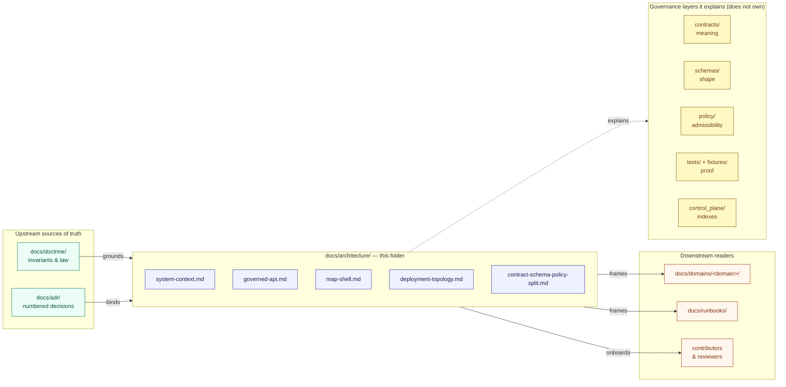

# `docs/architecture/`

> **Cross-cutting architecture explanations for the Kansas Frontier Matrix — the human-readable "how it fits together" companion to doctrine, ADRs, and domain dossiers. Doctrine states what is true; this folder explains how the running system expresses it.**

<!--
Badge targets are placeholders until CI, repo owners, and CODEOWNERS are verified
against the mounted repository. Replace TODOs with real Shields.io endpoints in the
first verification PR. Doctrine basis: Directory Rules §0, §6.1, §15.
-->

[](#authority-level)
[](#how-this-folder-fits)
[](../doctrine/lifecycle-law.md)
[](../adr/ADR-0001-schema-home.md)
[](./governed-api.md)
[](./governed-api.md)
[](#status)
[](#last-reviewed)

| Field | Value |
|---|---|
| **Folder role** | Human-facing architecture surface (cross-cutting; not domain, not doctrine, not ADR). |
| **Authority class** | Canonical — `docs/` is the human-facing control plane (Directory Rules §5, §6.1). |
| **Authority kind** | Explanatory. Does not own decisions, meaning, shape, admissibility, or proof. |
| **Owners** | Architecture steward · Docs steward *(placeholder — confirm against `CODEOWNERS` / `docs/governance/`)*. |
| **Status** | Folder doctrine: **CONFIRMED**. Folder presence on disk: **PROPOSED / NEEDS VERIFICATION** (no mounted repo this session). |
| **Repo fit** | Sits inside `docs/`. Reads from `docs/doctrine/` and `docs/adr/`. Read by `docs/domains/<domain>/`, `docs/runbooks/`, contributors, reviewers. |
| **Conformance** | Follows Directory Rules §15 *Required README Contract* and §16 *Path-Validation Checklist*. |

**Quick jump:** [Purpose](#purpose) · [Authority level](#authority-level) · [Status](#status) · [What belongs](#what-belongs-here) · [What doesn't](#what-does-not-belong-here) · [Folder map](#folder-map) · [How to read this folder](#how-to-read-this-folder) · [Doctrinal map](#doctrinal-invariants-this-folder-explains) · [Diagram](#how-this-folder-fits) · [Inputs](#inputs) · [Outputs](#outputs) · [Validation](#validation) · [Anti-patterns](#anti-patterns-specific-to-this-folder) · [Review burden](#review-burden) · [Related folders](#related-folders) · [ADRs](#adrs) · [FAQ](#faq) · [Last reviewed](#last-reviewed)

---

## Purpose

`docs/architecture/` explains the **shape of the system** in human-readable prose: how the trust membrane, the lifecycle invariant, the contract / schema / policy / tests split, the map shell, and the deployment topology fit together. It is the bridge between **doctrine** (`docs/doctrine/`, which states the invariants) and **decisions** (`docs/adr/`, which records the binding choices) — and it is what onboarding readers, reviewers, and domain stewards reach for first when they need a cross-cutting mental model.

It **does not decide anything**. Decisions live in `docs/adr/`. Object meaning lives in `contracts/`. Machine-checkable shape lives in `schemas/`. Admissibility (allow / deny / restrict / abstain) lives in `policy/`. Enforceability proof lives in `tests/` + `fixtures/`. Machine-readable indexes live in `control_plane/`. This folder **explains those layers and how they compose** — it never replaces them.

> [!IMPORTANT]
> Architecture pages are **not** the source of canonical decision. If a reviewer is reaching for a sentence here to settle an enforcement dispute, that is Directory Rules §13.5 *Documentation as truth* anti-pattern — promote the rule to an ADR, a doctrine page, or a `control_plane/` register.

[↑ Back to top](#docsarchitecture)

---

## Authority level

`docs/` is one of KFM's canonical roots (Directory Rules §5). Within `docs/`, this folder is the cross-cutting architecture surface listed explicitly in Directory Rules §6.1 and named in §0 as related doctrine to Directory Rules itself (`contract-schema-policy-split.md`).

| Property | Value |
|---|---|
| Authority class | **Canonical** |
| Authority kind | **Explanatory** (not enforcement, not decision, not validation) |
| Wins over | Per-root READMEs *for cross-cutting prose*; domain dossiers and prior architecture reports (lineage only, per §2.1 item 5). |
| Loses to | **Doctrine** (`docs/doctrine/`) on invariants. **Accepted ADRs** (`docs/adr/`) on numbered decisions. **Mounted repo evidence** on current-state claims. |
| Cited in doctrine | Directory Rules §0 names `contract-schema-policy-split.md` as related doctrine. |

[↑ Back to top](#docsarchitecture)

---

## Status

| Item | Status | Note |
|---|---|---|
| Folder doctrine (this README contract) | **CONFIRMED** | Anchored in Directory Rules §6.1 and §15. |
| Folder presence on current disk | **PROPOSED / NEEDS VERIFICATION** | No mounted repo in this session. Verify with a `git ls-tree`-equivalent inspection. |
| Specific child files listed below | **PROPOSED** | Names and roles are doctrinal; on-disk existence unverified. |
| Owners | **NEEDS VERIFICATION** | Confirm against `CODEOWNERS` (or `.github/CODEOWNERS`) and `docs/governance/`. |
| ADR-0001 (schema home) linkage | **CONFIRMED in doctrine** · **NEEDS VERIFICATION for ADR file on disk** | Directory Rules §0 cites ADR-0001 as accepted convention. |
| Other ADRs cited | **PROPOSED** | Placeholders until the ADR index is enumerated. |
| Conformance to Directory Rules §15 | **CONFIRMED for this file** | This README's sections, in order, satisfy the contract. |

[↑ Back to top](#docsarchitecture)

---

## What belongs here

Files that are **cross-cutting**, **human-readable**, and **explain how multiple responsibility roots compose**.

- **System context** — what KFM is, what it isn't, who it serves, what it interfaces with (sources, public clients, reviewers, downstream consumers).
- **Deployment topology** — how KFM is deployed, exposure posture, trust boundaries between `apps/`, `runtime/`, `infra/`, and the public network. Expresses `infra/` deny-by-default in narrative form.
- **Governed API** — the trust membrane in narrative form: `apps/governed-api/`, `RuntimeResponseEnvelope`, the finite outcomes (`ANSWER` · `ABSTAIN` · `DENY` · `ERROR`; with `HOLD`, `PASS`, `FAIL` as validator-class and review-class outcomes per Atlas v1.1 §24.3), endpoint categories, denial tests.
- **Map shell** — MapLibre as a disciplined renderer **behind** the governed API; the *released layer → user click → governed API → `EvidenceRef` → `EvidenceBundle` → Evidence Drawer → Focus Mode outcome* flow; what the renderer is *not* (truth, policy, citation, AI authority).
- **Contract / schema / policy split** — the four-layer division of labor: `contracts/` (meaning) · `schemas/` (shape) · `policy/` (admissibility) · `tests/` + `fixtures/` (proof of enforceability). Named in Directory Rules §0 as related doctrine.
- **New cross-cutting architecture pages** — only when they span multiple responsibility roots and are not domain-specific. A page introducing a binding rule **MUST** pair with an ADR (Directory Rules §2.4).

> [!TIP]
> If a page would only describe one root, it usually belongs in that root's own README (e.g., `apps/governed-api/README.md`, `packages/maplibre/README.md`) rather than here. This folder is the **cross-cutting** view; per-root READMEs are the **local** view.

[↑ Back to top](#docsarchitecture)

---

## What does NOT belong here

| Content | Goes to | Why |
|---|---|---|
| Invariants and law (lifecycle, truth posture, trust membrane, authority ladder, **watcher-as-non-publisher**) | `docs/doctrine/` | Doctrine is the *what is true*; architecture is the *how it's expressed*. |
| Numbered decisions with `proposed \| accepted \| superseded \| rejected` status | `docs/adr/` | ADRs are the binding decision record (Directory Rules §2.4). |
| Domain-specific architecture (hydrology, soil, fauna, archaeology, …) | `docs/domains/<domain>/` | Domain Placement Law (Directory Rules §12). |
| Object-meaning definitions (`SourceDescriptor`, `EvidenceBundle`, `DecisionEnvelope`, `ReleaseManifest`, …) | `contracts/` | Different governance layer. |
| Machine-checkable schema | `schemas/contracts/v1/...` | Schema-home rule (ADR-0001). |
| Allow / deny / restrict / abstain rules (Rego/OPA bundles) | `policy/` | Policy is executable; explanation about it lives here. |
| Operational procedures, rollback drills, release dry-runs, validation runs | `docs/runbooks/` | Runbooks are *how to operate*; this folder is *how it's built*. |
| Generated review/release reports | `docs/reports/` | Generated artifacts; read-only. |
| Machine-readable governance maps and registers | `control_plane/` or `docs/registers/` | Indexes belong with the index layer. |
| Source-descriptor standards or external standards (STAC, DCAT, PROV, …) | `docs/sources/`, `docs/standards/` | Different concerns. |
| Lane-internal manifests (per-layer `LayerManifest`, tile manifests) | `data/published/layers/<domain>/` (data plane) | Release manifests live in `release/manifests/`; lane-internal manifests live with their lifecycle (Directory Rules §18 open question). |
| Brand, logos, voice, style | `docs/brand/` or `packages/ui/` | Different concerns. |

[↑ Back to top](#docsarchitecture)

---

## Folder map

The five files below are the **doctrinal contents** of this folder per Directory Rules §6.1. Subfolders for `ui/`, `governed-ai/`, `story/`, and `review/` are **PROPOSED** in the Whole-UI Governed AI Expansion plan and remain placeholders until an ADR or migration note lands.

```text
docs/architecture/
├── README.md                            # this file — folder landing page
├── system-context.md                    # what KFM is and what it interfaces with
├── deployment-topology.md               # how it's deployed, exposed, audited
├── governed-api.md                      # apps/governed-api/ in narrative form
├── map-shell.md                         # MapLibre boundary and click-to-evidence
├── contract-schema-policy-split.md      # the four-layer governance split
├── ui/                                  # (PROPOSED) shell, layout, state ownership
├── governed-ai/                         # (PROPOSED) Focus Mode boundary, MockAdapter
├── story/                               # (PROPOSED) StoryManifest / StoryNode behavior
└── review/                              # (PROPOSED) review-console architecture
```

| File or subfolder | Role | Audience | Status |
|---|---|---|---|
| `README.md` | This folder's contract and entry point. | All readers. | **CONFIRMED** contract · **PROPOSED** on disk |
| `system-context.md` | The KFM *what / who / interfaces* view. | New contributors, reviewers, partners. | **PROPOSED** |
| `deployment-topology.md` | Components, hosts, network exposure, trust boundaries; expresses `infra/` deny-by-default in prose. | Operators, security reviewers. | **PROPOSED** |
| `governed-api.md` | Trust membrane; `RuntimeResponseEnvelope`; finite outcomes; endpoint categories; denial tests. | API authors, integrators, reviewers. | **PROPOSED** |
| `map-shell.md` | MapLibre rules, *click-to-evidence* flow, `EvidenceDrawerPayload` fields, UI states. | UI authors, reviewers. | **PROPOSED** |
| `contract-schema-policy-split.md` | The four-layer division (`contracts/` · `schemas/` · `policy/` · `tests/` + `fixtures/`). | Schema authors, contract authors, reviewers. | **PROPOSED** |
| `ui/`, `governed-ai/`, `story/`, `review/` | Subsystem architecture pages flagged in the Whole-UI Governed AI Expansion plan. | Subsystem authors. | **PROPOSED** — pending ADR or scoping note |

Additional architecture pages MAY be added when (a) they are cross-cutting, (b) doctrine and an accepted ADR support them, and (c) they are not better placed in a per-root README.

[↑ Back to top](#docsarchitecture)

---

## How to read this folder

Pick the entry point that matches what you came for.

| If you are… | Read first | Then |
|---|---|---|
| New to KFM | `system-context.md` → `contract-schema-policy-split.md` | `docs/doctrine/lifecycle-law.md`, then a domain README under `docs/domains/`. |
| Reviewing a public-API change | `governed-api.md` | `docs/doctrine/trust-membrane.md`, the `apps/governed-api/` README, and the relevant `policy/runtime/` rules. |
| Reviewing a UI / map change | `map-shell.md` | `docs/doctrine/truth-posture.md` (cite-or-abstain), the `apps/explorer-web/` and `packages/maplibre/` READMEs. |
| Reviewing a new schema or contract | `contract-schema-policy-split.md` | ADR-0001 (schema home), `contracts/README.md`, `schemas/README.md`. |
| Working on deployment, exposure, or hardening | `deployment-topology.md` | `infra/README.md`, `docs/security/`, `docs/runbooks/`. |
| Adding a new domain | `system-context.md` → `contract-schema-policy-split.md` | `docs/domains/README.md` and Directory Rules §12 *Domain Placement Law*. |
| Investigating a drift or conflict | `contract-schema-policy-split.md` | `docs/registers/DRIFT_REGISTER.md` and Directory Rules §2.5. |

[↑ Back to top](#docsarchitecture)

---

## Doctrinal invariants this folder explains

This folder narrates the invariants below; it does **not** own them. If prose here drifts from the named doctrine page, the doctrine page wins and a drift entry SHOULD open in `docs/registers/DRIFT_REGISTER.md` (Directory Rules §2.5).

| Invariant | Owned by | Explained in |
|---|---|---|
| **Lifecycle law** — `RAW → WORK / QUARANTINE → PROCESSED → CATALOG / TRIPLET → PUBLISHED`; promotion is a **governed state transition, not a file move** | `docs/doctrine/lifecycle-law.md` | `system-context.md`, `deployment-topology.md` |
| **Truth posture** — *cite-or-abstain*; uncited inference is denied | `docs/doctrine/truth-posture.md` | `governed-api.md`, `map-shell.md` |
| **Trust membrane** — public clients reach data **only** through `apps/governed-api/`; no public RAW path; no direct model client | `docs/doctrine/trust-membrane.md` | `governed-api.md`, `map-shell.md` |
| **Authority ladder** — doctrine ▸ ADR ▸ Directory Rules ▸ per-root README ▸ lineage ▸ repo state | `docs/doctrine/authority-ladder.md` | `system-context.md` |
| **Watcher-as-non-publisher** — workers emit `RunReceipt`, `AIReceipt`, candidates only; **never** publish, mutate canonical records, or bypass review | `docs/doctrine/` *(named in Directory Rules §19 glossary)* | `deployment-topology.md`, `governed-api.md` |
| **Directory Rules** — responsibility-rooted placement; root is boring; domains are lanes | `docs/doctrine/directory-rules.md` | every page here, but especially `contract-schema-policy-split.md` |

[↑ Back to top](#docsarchitecture)

---

## How this folder fits


```mermaid
flowchart LR
  subgraph upstream["Upstream sources of truth"]
    direction TB
    doctrine["docs/doctrine/<br/>invariants & law"]
    adr["docs/adr/<br/>numbered decisions"]
  end

  subgraph here["docs/architecture/ — this folder"]
    direction TB
    sc["system-context.md"]
    gapi["governed-api.md"]
    msh["map-shell.md"]
    dt["deployment-topology.md"]
    csp["contract-schema-policy-split.md"]
  end

  subgraph downstream["Downstream readers"]
    direction TB
    domains["docs/domains/&lt;domain&gt;/"]
    runbooks["docs/runbooks/"]
    contributors["contributors<br/>& reviewers"]
  end

  subgraph layers["Governance layers it explains (does not own)"]
    direction LR
    contracts["contracts/<br/>meaning"]
    schemas["schemas/<br/>shape"]
    policy["policy/<br/>admissibility"]
    tests["tests/ + fixtures/<br/>proof"]
    cp["control_plane/<br/>indexes"]
  end

  doctrine -->|grounds| here
  adr -->|binds| here
  here -->|frames| domains
  here -->|frames| runbooks
  here -->|onboards| contributors
  here -.explains.-> layers

  classDef this fill:#eef2ff,stroke:#3730a3,color:#1e1b4b;
  classDef upstr fill:#ecfdf5,stroke:#047857,color:#064e3b;
  classDef downstr fill:#fff7ed,stroke:#9a3412,color:#7c2d12;
  classDef layer fill:#fef9c3,stroke:#854d0e,color:#713f12;
  class sc,gapi,msh,dt,csp this;
  class doctrine,adr upstr;
  class domains,runbooks,contributors downstr;
  class contracts,schemas,policy,tests,cp layer;
```

The diagram reflects the four-layer division named in Directory Rules §6.1: *`docs/` explains; `control_plane/` indexes; `contracts/` defines meaning; `schemas/` defines shape.* This folder lives in the `docs/` layer and explicitly **does not** carry meaning, shape, admissibility, or proof — it points at the homes that do.

[↑ Back to top](#docsarchitecture)

---

## Inputs

Where the content in this folder draws from:

- **Doctrine** — `docs/doctrine/` for the invariants this folder explains in narrative form.
- **ADRs** — `docs/adr/` for binding decisions cited by name and number (e.g., ADR-0001 schema home).
- **Implementation evidence** — READMEs and visible behavior under `apps/`, `packages/`, `runtime/`, `infra/`, `connectors/`, `pipelines/`. Used to keep architecture prose honest against repo reality.
- **Domain dossiers (lineage)** — domain plans and prior architecture reports under `docs/domains/<domain>/` and `docs/archive/`. Treated as **supporting evidence**, not authority (Directory Rules §2.1, item 5).
- **External standards** — `docs/standards/` for STAC, DCAT, PROV, and similar references where applicable.

[↑ Back to top](#docsarchitecture)

---

## Outputs

What this folder enables downstream:

- **Onboarding context** for new contributors and reviewers without sending them straight into doctrine.
- **Reviewer mental model** for PRs that touch the trust membrane, the map shell, the contract/schema/policy split, or deployment posture.
- **Cross-references** for `docs/domains/<domain>/` READMEs, `docs/runbooks/`, and per-root READMEs that need a single canonical link to "the architecture page for X."
- **The narrative spine** that ties `contracts/`, `schemas/`, `policy/`, `data/`, `release/`, and `control_plane/` into a coherent system rather than six disconnected roots.

[↑ Back to top](#docsarchitecture)

---

## Validation

Architecture docs are validated **as documents**, not as runtime systems. Validators below are **PROPOSED / NEEDS VERIFICATION** until inspected against the mounted repo.

- **Link integrity** — relative links resolve; permalinks (when used to pin a line) point to a real SHA. *(PROPOSED validator: `tools/validators/docs_link_check`.)*
- **Anchor stability** — heading anchors used by other docs do not break silently on revision.
- **Path-claim discipline** — every path mentioned exists in the repo or is labeled `PROPOSED` / `NEEDS VERIFICATION`. *(PROPOSED validator: `tools/validators/path_claim_check`.)*
- **ADR linkage** — each ADR cited resolves to an `accepted` (or explicitly `proposed` / `superseded`) ADR file under `docs/adr/`.
- **Terminology consistency** — names match the contracts that own them; this folder MUST NOT silently rename them. Names that MUST be preserved exactly include: `RuntimeResponseEnvelope`, `DecisionEnvelope`, `EvidenceBundle`, `EvidenceRef`, `EvidenceDrawerPayload`, `SourceDescriptor`, `LayerManifest`, `LayerCatalogItem`, `LayerDescriptor`, `MapReleaseManifest`, `KFMGeoManifest`, `TileArtifactManifest`, `PolicyDecision`, `PromotionDecision`, `ReleaseManifest`, `RollbackCard`, `CorrectionNotice`, `ReviewRecord`, `RunReceipt`, `AIReceipt`, `ValidationReport`, `CitationValidationReport`, `StoryManifest`, `StoryNode`, `spec_hash`, *finite outcomes*. Lifecycle phases preserved exactly: `RAW → WORK / QUARANTINE → PROCESSED → CATALOG / TRIPLET → PUBLISHED`.
- **Outcome-vocabulary consistency** — finite outcomes referenced here MUST match Atlas v1.1 §24.3: `ANSWER` · `ABSTAIN` · `DENY` · `ERROR` (governed-API class); `HOLD` (review/promotion paused); `PASS` / `FAIL` (validator class).
- **Drift register** — material conflicts between this folder and the repo open an entry in `docs/registers/DRIFT_REGISTER.md` rather than silently conforming (Directory Rules §2.5).

> [!NOTE]
> Architecture docs MUST NOT be cited as the source of a canonical decision. If a reviewer is reaching for a sentence in this folder to settle an enforcement dispute, that signals an ADR or doctrine page should exist (Directory Rules §13.5 *Documentation as truth*).

[↑ Back to top](#docsarchitecture)

---

## Anti-patterns specific to this folder

Drift forms specific to architecture docs. These are local restatements of Directory Rules §13; the canonical list lives there.

| Anti-pattern | Symptom | Fix |
|---|---|---|
| **Architecture as decision** | A `.md` page here is cited as the binding rule for a policy or schema choice. | Promote the rule to an ADR or doctrine page. Update this folder to *cite*, not *decide*. (§13.5) |
| **Domain page in cross-cutting folder** | A hydrology-only architecture page lands here. | Move under `docs/domains/hydrology/`. Domain Placement Law (§12). |
| **Mirror divergence with per-root README** | An architecture page contradicts the owning root's README (e.g., `governed-api.md` ≠ `apps/governed-api/README.md`). | Per-root README wins on local detail; architecture is the cross-cutting view. Open a drift entry. |
| **Stale topology** | `deployment-topology.md` describes a host or component that no longer exists. | Verify against `infra/` and `apps/`; update or open a `VERIFICATION_BACKLOG.md` entry. |
| **Renamed canonical term** | An architecture page silently calls `RuntimeResponseEnvelope` a "response object" or `EvidenceBundle` a "citation pack." | Restore the exact KFM term; preserve compound capitalization. |
| **Outcome vocabulary drift** | A page introduces "success / failure" instead of the finite outcome set. | Use the exact set: `ANSWER` · `ABSTAIN` · `DENY` · `ERROR` (plus `HOLD`, `PASS`, `FAIL` per Atlas v1.1 §24.3). |

[↑ Back to top](#docsarchitecture)

---

## Review burden

| Change | Reviewers | Extras |
|---|---|---|
| Typo, link fix, formatting | Architecture steward **or** Docs steward. | None. |
| New cross-cutting architecture page | Architecture steward + Docs steward. | If the page introduces a binding rule, an **ADR is required** (Directory Rules §2.4). |
| Substantive revision touching trust membrane, lifecycle invariant, or four-layer split | Architecture steward + Docs steward + at least one subsystem owner of the affected root. | Update `docs/doctrine/` if the invariant moved; cite the ADR. |
| Deletion / relocation of a file | Architecture steward + Docs steward. | Follow Directory Rules §14 *Migration Discipline*; preserve anchors or note breakage. |
| Domain-specific change masquerading as cross-cutting | **Reject** with a pointer to `docs/domains/<domain>/`. | — |
| Outcome-vocabulary change | Architecture steward + Governed-API owner + Policy owner. | ADR required if the finite-outcome set changes. |

Owners are placeholders until confirmed in `CODEOWNERS` (or `.github/CODEOWNERS`) and `docs/governance/`.

[↑ Back to top](#docsarchitecture)

---

## Related folders

<details>
<summary><strong>Doctrine, decisions, and registers (click to expand)</strong></summary>

| Folder | Relationship |
|---|---|
| [`docs/doctrine/`](../doctrine/) | Invariants and law. Architecture explains them; it never overrides them. |
| [`docs/adr/`](../adr/) | Numbered architecture decisions. Architecture pages cite ADRs; ADRs do not live here. |
| [`docs/domains/`](../domains/) | Per-domain architecture. Cross-cutting pages here, domain-specific pages there. |
| [`docs/runbooks/`](../runbooks/) | Operational procedures. This folder frames the system; runbooks operate it. |
| [`docs/registers/`](../registers/) | `AUTHORITY_LADDER`, `CANONICAL_LINEAGE_EXPLORATORY`, `DRIFT_REGISTER`, `VERIFICATION_BACKLOG`, `OBJECT_FAMILY_MAP`. |
| [`docs/standards/`](../standards/) | External standards KFM conforms to (STAC, DCAT, PROV, etc.). |
| [`docs/security/`](../security/) | Threat model, exposure posture, incident response. Pairs with `deployment-topology.md`. |
| [`docs/governance/`](../governance/) | Roles, review burden, separation of duties. Pairs with `governed-api.md`. |
| [`docs/intake/`](../intake/) | `IDEA_INTAKE`, `NEW_IDEAS_INDEX` — exploratory ideas; not promoted to architecture without review. |
| [`docs/archive/`](../archive/) | Lineage, exploratory, deprecated. Supporting evidence only. |

</details>

<details>
<summary><strong>Implementation roots this folder explains (click to expand)</strong></summary>

| Folder | What this folder says about it |
|---|---|
| [`contracts/`](../../contracts/) | Owns object meaning. `contract-schema-policy-split.md` explains the boundary with `schemas/` and `policy/`. |
| [`schemas/`](../../schemas/) | Owns machine-checkable shape. Default home `schemas/contracts/v1/...` per ADR-0001. |
| [`policy/`](../../policy/) | Owns admissibility (allow / deny / restrict / abstain). Singular root; `policies/` is compatibility only (Directory Rules §6.5, §8). |
| [`tests/`](../../tests/) and [`fixtures/`](../../fixtures/) | Own enforceability proof. `contract-schema-policy-split.md` names them as the fourth governance layer. |
| [`apps/governed-api/`](../../apps/governed-api/) | The trust membrane in executable form; `governed-api.md` is its narrative. |
| [`apps/explorer-web/`](../../apps/explorer-web/) + [`packages/maplibre/`](../../packages/maplibre/) | The disciplined map shell; `map-shell.md` is its narrative. |
| [`apps/workers/`](../../apps/workers/) | Watcher-as-non-publisher in executable form; emits `RunReceipt` / `AIReceipt` / candidates only. |
| [`runtime/`](../../runtime/), [`infra/`](../../infra/) | Local adapters and deployment posture; `deployment-topology.md` is their narrative. |
| [`release/`](../../release/) | Release decisions (`ReleaseManifest`, `RollbackCard`, `CorrectionNotice`). |
| [`control_plane/`](../../control_plane/) | Machine-readable indexes. This folder **explains**; `control_plane/` **indexes**. |

All paths above are **PROPOSED / NEEDS VERIFICATION** for current repo presence.

</details>

[↑ Back to top](#docsarchitecture)

---

## ADRs

| ADR | Status | Why it matters here |
|---|---|---|
| **ADR-0001 — Schema home** | **Cited as accepted** in Directory Rules §0 (CONFIRMED in doctrine; **NEEDS VERIFICATION** for the ADR file on disk). | Sets `schemas/contracts/v1/...` as default schema home; central to `contract-schema-policy-split.md`. |
| *(future) ADR — `apps/api/` vs `apps/governed-api/` boundary* | **PROPOSED** | Directory Rules §7.1 and §18 list this boundary as **open**; resolution belongs in an ADR, summarized here. |
| *(future) ADR — `policies/` ↔ `policy/` resolution* | **PROPOSED** | Directory Rules §6.5, §8, §18 name this as open; default canonical is `policy/`. |
| *(future) ADR — `triplets/` vs `triplet/` form in `data/`* | **PROPOSED** | Directory Rules §18 open question; current doctrine uses **`triplets/`** (plural). |
| *(future) ADR — `data/manifests/` vs `release/manifests/` boundary* | **PROPOSED** | Directory Rules §18 open question; current doctrine keeps `release/manifests/` canonical for release manifests, with lane-internal manifests inside `data/published/`. |
| *(future) ADR — `data/rollback/` vs `release/rollback_cards/` boundary* | **PROPOSED** | Directory Rules §18 open question; current doctrine keeps the **decision** in `release/rollback_cards/` and **data-plane alias-revert receipts** in `data/rollback/`. |

> [!NOTE]
> ADRs follow the template fields named in Directory Rules §2.4: `id`, `title`, `status` (`proposed | accepted | superseded | rejected`), `date`, `context`, `decision`, `consequences`, `alternatives`. Adding an ADR here means linking it from the relevant architecture page **and** from `docs/adr/README.md`.

[↑ Back to top](#docsarchitecture)

---

## FAQ

<details>
<summary><strong>How is this folder different from <code>docs/doctrine/</code>?</strong></summary>

Doctrine states *what is true* — the invariants: lifecycle law, truth posture, trust membrane, authority ladder, watcher-as-non-publisher. Architecture explains *how those truths are expressed in the running system* — the topology, the API envelope, the map boundary, the four-layer split. **Doctrine wins on conflict.**
</details>

<details>
<summary><strong>How is this folder different from <code>docs/adr/</code>?</strong></summary>

ADRs are decisions: dated, numbered, with `proposed | accepted | superseded | rejected` status. Architecture pages explain the resulting system and cite ADRs by number. A page here SHOULD NOT be the binding record of a decision; promote that to an ADR (Directory Rules §13.5).
</details>

<details>
<summary><strong>Where does a domain-specific architecture page go?</strong></summary>

`docs/domains/<domain>/`, not here. Domain Placement Law (Directory Rules §12) says domains live as **lanes** inside responsibility roots. Cross-cutting prose that genuinely spans multiple domains MAY live here; if it would only matter to one domain, it belongs in that domain's folder.
</details>

<details>
<summary><strong>Should I add diagrams?</strong></summary>

Yes, when they reflect real structure or responsibility boundaries. Mermaid is preferred for inline rendering on GitHub. Decorative diagrams are out; diagrams that paper over weak grounding should be replaced with a *Diagram omitted — NEEDS VERIFICATION* note and an open question.
</details>

<details>
<summary><strong>What if the repo conflicts with what an architecture page describes?</strong></summary>

Open a `docs/registers/DRIFT_REGISTER.md` entry and propose a resolution: an ADR amending architecture, or a migration plan bringing the repo into conformance. **Do not silently update the page to match the repo** (Directory Rules §2.5).
</details>

<details>
<summary><strong>What goes in <code>contract-schema-policy-split.md</code> versus <code>contracts/README.md</code>?</strong></summary>

`contract-schema-policy-split.md` explains the **division of labor** across `contracts/`, `schemas/`, `policy/`, and `tests/` + `fixtures/` — the four-layer story. `contracts/README.md` describes only what `contracts/` itself owns. The split file is the *cross-cutting* view; the per-root README is the *local* view.
</details>

<details>
<summary><strong>Which finite outcomes are canonical?</strong></summary>

For governed-API surfaces: `ANSWER` · `ABSTAIN` · `DENY` · `ERROR`. For review/promotion paused state: `HOLD`. For validator-class outcomes: `PASS` / `FAIL`. The full mapping by surface lives in `governed-api.md`; the doctrinal anchor is Atlas v1.1 §24.3 *Master Decision Outcome Envelope Reference*. Sensitive lanes default to `DENY` (fail closed).
</details>

<details>
<summary><strong>Where do <code>ui/</code>, <code>governed-ai/</code>, <code>story/</code>, and <code>review/</code> subfolders come from?</strong></summary>

They are PROPOSED in the *KFM Whole-UI + Governed AI Expansion* plan as architecture-level subsystem homes. They are not yet ADR-bound. Until an ADR or scoping note lands, treat them as placeholders; substantive subsystem prose MAY live as a single file under this folder (e.g., `map-shell.md` instead of `ui/map-shell.md`).
</details>

[↑ Back to top](#docsarchitecture)

---

## Last reviewed

| Field | Value |
|---|---|
| Last reviewed | `YYYY-MM-DD` *(placeholder — set on first PR)* |
| Reviewer | `<name>` *(placeholder)* |
| Next review trigger | Material change to doctrine, schema-home rule, governed-API envelope, map-shell boundary, or finite-outcome set; **or** 6 months since last review (Directory Rules §15). |

> If this date is older than six months, the folder is a **drift candidate**. Open a verification PR or a `docs/registers/DRIFT_REGISTER.md` entry.

---

### Related docs

- [`docs/doctrine/directory-rules.md`](../doctrine/directory-rules.md) — placement law (this README's contract anchor)
- [`docs/doctrine/lifecycle-law.md`](../doctrine/lifecycle-law.md) — `RAW → … → PUBLISHED`
- [`docs/doctrine/trust-membrane.md`](../doctrine/trust-membrane.md) — `apps/governed-api/` invariant
- [`docs/doctrine/truth-posture.md`](../doctrine/truth-posture.md) — cite-or-abstain
- [`docs/adr/ADR-0001-schema-home.md`](../adr/ADR-0001-schema-home.md) — schema home convention
- [`docs/registers/DRIFT_REGISTER.md`](../registers/DRIFT_REGISTER.md) — open this when prose drifts from repo

*Last updated:* `YYYY-MM-DD` *(placeholder)* · [↑ Back to top](#docsarchitecture)
