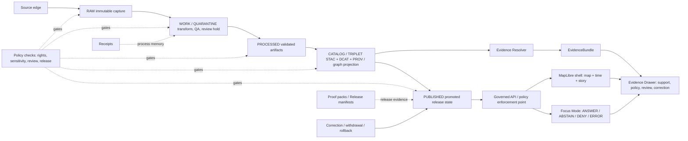

<!-- [KFM_META_BLOCK_V2]
doc_id: kfm://doc/TODO-NEEDS-UUID
title: KFM Architecture Documentation
type: standard
version: v1
status: draft
owners: @bartytime4life
created: TODO-NEEDS-VERIFICATION
updated: 2026-04-26
policy_label: TODO-NEEDS-POLICY-LABEL
related: [../../README.md, ../README.md, ../runbooks/repository-next-steps.md, ../../.github/CODEOWNERS, ../../.github/workflows/verification-baseline.yml]
tags: [kfm, architecture, documentation, evidence, governance]
notes: [Owner is based on public-main CODEOWNERS fallback; branch/ruleset enforcement and local checkout state still need verification.]
[/KFM_META_BLOCK_V2] -->

# KFM Architecture Documentation

Orientation and guardrails for architecture docs that preserve KFM's governed, evidence-first, map-first, time-aware trust model.


> [!IMPORTANT]
> **Status:** draft architecture landing README  
> **Owner:** `@bartytime4life` as public-main CODEOWNERS fallback; branch protection and required review enforcement remain **NEEDS VERIFICATION**.  
> **Path:** `docs/architecture/README.md`  
> **Evidence mode:** `PUBLIC_REPO_EVIDENCE` plus **NEEDS LOCAL VERIFICATION** before treating this as working-branch state.  
> **Role:** landing page and review contract for architecture documentation, not a substitute for schemas, policies, proofs, emitted artifacts, or implementation evidence.

**Quick jumps:** [Scope](#scope) · [Evidence boundary](#evidence-boundary) · [Repo fit](#repo-fit) · [Inputs](#inputs) · [Exclusions](#exclusions) · [Directory map](#directory-map) · [Architecture boundaries](#architecture-boundaries) · [Review gates](#review-gates) · [Definition of done](#definition-of-done) · [Verification backlog](#verification-backlog)

---

## Scope

`docs/architecture/` is the repo-facing home for architecture-level explanation, boundary setting, and design governance.

Use this directory to explain how KFM's major responsibilities fit together:

| Architecture concern | What belongs here |
|---|---|
| Evidence lifecycle | How `RAW -> WORK / QUARANTINE -> PROCESSED -> CATALOG / TRIPLET -> PUBLISHED` is preserved. |
| Trust membrane | How public clients, UI surfaces, governed APIs, release artifacts, and EvidenceBundle resolution stay separated from canonical/internal stores. |
| Contract placement | How schemas, contracts, policies, receipts, proofs, manifests, and release objects relate without duplicating authority. |
| UI and AI placement | How MapLibre, Evidence Drawer, Focus Mode, story/export surfaces, and model-assisted synthesis remain downstream of governed evidence. |
| Domain-lane patterns | How hydrology, soils, habitat, fauna, flora, hazards, archaeology, infrastructure, people/land, and adjacent lanes specialize shared KFM rules. |
| Architecture decisions | Which choices need ADRs, validation, rollback, and successor links. |

This directory should help a maintainer answer four questions:

1. What is the architectural boundary?
2. What evidence or doctrine supports it?
3. What is confirmed, proposed, unknown, or still awaiting verification?
4. What must never be bypassed by implementation, UI, AI, automation, or publication work?

[Back to top](#kfm-architecture-documentation)

---

## Evidence boundary

This README intentionally separates public-main evidence from local working-branch proof.

| Claim area | Status | What this README can safely say |
|---|---:|---|
| KFM doctrine | **CONFIRMED doctrine** | KFM is governed, evidence-first, map-first, time-aware, publication-conscious, and cite-or-abstain. |
| Public-main path | **PUBLIC_REPO_EVIDENCE** | `docs/architecture/README.md` is visible on the public `main` branch. |
| Parent and adjacent public surfaces | **PUBLIC_REPO_EVIDENCE** | Public `main` exposes root/docs navigation, `.github/CODEOWNERS`, and the baseline workflow file. |
| Local checkout state | **NEEDS LOCAL VERIFICATION** | Branch, dirty state, local file contents, generated artifacts, and test results must be checked in the mounted repo. |
| Enforcement state | **NEEDS PLATFORM VERIFICATION** | Workflow files are not proof of branch protection, required status checks, environment approvals, or reviewer enforcement. |
| Runtime maturity | **UNKNOWN until verified** | Do not infer route names, DTO inventories, dashboard behavior, emitted proof bundles, or deployed runtime behavior from this README. |
| Baseline pass count | **CONFLICTED / NEEDS VERIFICATION** | Root README and runbook snapshots may report different pass counts after later cycles. Reconcile from the current checkout before repeating a number. |

> [!WARNING]
> Architecture docs may describe KFM doctrine and intended boundaries, but they must not claim that enforcement, tests, APIs, schemas, workflows, or runtime behavior exist unless verified from repo files, CI output, logs, emitted artifacts, or platform state.

[Back to top](#kfm-architecture-documentation)

---

## Repo fit

**Path:** `docs/architecture/README.md`  
**Directory role:** architecture landing page and contributor orientation surface.

| Relationship | Target | Status | Relationship |
|---|---|---:|---|
| Upstream | [`../README.md`](../README.md) | **PUBLIC_REPO_EVIDENCE / LOCAL RECHECK** | Parent docs landing. |
| Upstream | [`../../README.md`](../../README.md) | **PUBLIC_REPO_EVIDENCE / LOCAL RECHECK** | Root orientation and project status snapshot. |
| Operational runbook | [`../runbooks/repository-next-steps.md`](../runbooks/repository-next-steps.md) | **PUBLIC_REPO_EVIDENCE / LOCAL RECHECK** | Current next-step sequencing and marker-debt targets. |
| Review ownership | [`../../.github/CODEOWNERS`](../../.github/CODEOWNERS) | **PUBLIC_REPO_EVIDENCE / PLATFORM RECHECK** | Broad fallback ownership; enforcement depends on repository settings. |
| Baseline workflow | [`../../.github/workflows/verification-baseline.yml`](../../.github/workflows/verification-baseline.yml) | **PUBLIC_REPO_EVIDENCE / CI RECHECK** | Baseline workflow file; current run result still requires CI/local evidence. |
| Machine meaning | `../../contracts/` and `../../schemas/` | **PUBLIC_REPO_EVIDENCE / AUTHORITY RECHECK** | Contract/schema homes must be linked, not copied into prose. |
| Policy and gates | `../../policy/` | **PUBLIC_REPO_EVIDENCE / POLICY RECHECK** | Policy rules and release admissibility live outside architecture prose. |
| Tests and tooling | `../../tests/` and `../../tools/` | **PUBLIC_REPO_EVIDENCE / LOCAL RECHECK** | Architecture docs may point to validation, but tests/tools prove behavior. |
| Runtime/UI | `../../apps/`, `../../ui/`, `../../web/`, `../../packages/` | **PUBLIC_REPO_EVIDENCE / LOCAL RECHECK** | Public surfaces must consume governed outputs rather than raw stores or direct model output. |

### Fit rule

Architecture docs sit between doctrine and implementation. They clarify system shape without pretending to be source code, schema registry, policy engine, proof pack, workflow run, or release manifest.

[Back to top](#kfm-architecture-documentation)

---

## Inputs

Architecture docs in this directory may accept source-grounded inputs that clarify durable boundaries.

| Input | Belongs here when... | Required posture |
|---|---|---|
| KFM doctrine | It defines a stable invariant, boundary, or trust rule. | Label as **CONFIRMED doctrine** when supported by controlling KFM materials. |
| ADRs | A choice changes architecture, file homes, contracts, policy boundaries, publication flow, UI/AI placement, or release behavior. | Keep decision, context, consequences, validation, and rollback visible. |
| Contract/schema summaries | They explain where machine contracts live and how they relate. | Link to machine files; do not duplicate as prose-only truth. |
| Policy boundary notes | They explain rights, sensitivity, public exposure, AI, or map-client restrictions. | Treat fail-closed behavior as the default when risk matters. |
| Domain-lane architecture | A domain needs shared architecture rules applied to its source roles, artifacts, and publication path. | Keep domain-specific detail in `../domains/` where possible; link back here for shared rules. |
| UI architecture | It explains shell-level trust behavior, Evidence Drawer payloads, layer boundaries, or Focus Mode constraints. | Preserve map-first, time-aware, evidence-visible operation. |
| Implementation evidence | Repo files, tests, workflows, logs, emitted receipts, or generated proof objects support a current-state claim. | Link the evidence and name the evidence class; otherwise mark **NEEDS VERIFICATION**. |

[Back to top](#kfm-architecture-documentation)

---

## Exclusions

Do not use `docs/architecture/` as a dumping ground for everything technical.

| Excluded material | Why it does not belong here | Better home |
|---|---|---|
| RAW, WORK, or QUARANTINE data | Architecture prose must not become a data store or bypass lifecycle controls. | Repo-confirmed lifecycle homes under `data/`. |
| Generated proofs, receipts, manifests, or attestations | These are trust objects, not documentation decoration. | Repo-confirmed `data/`, `artifacts/`, or `release/` homes. |
| Machine schemas copied into prose | Prose drifts; machine contracts need validation. | `schemas/`, `contracts/`, and validation tests. |
| Policy rules embedded only in Markdown | Public safety and publication controls need executable enforcement. | `policy/` plus policy fixtures/tests. |
| Live source credentials or secrets | Security boundary violation. | Repository/environment secrets and infra documentation. |
| Exact sensitive locations | Archaeology, rare species, cultural/sacred locations, critical infrastructure, DNA/living-person context, and similar surfaces fail closed. | Restricted governed stores with redaction/generalization receipts. |
| Exploratory packets promoted as architecture law | New ideas are useful pressure, not canon by default. | Governed intake/register process with status labels. |
| UI polish without trust payloads | KFM UI is a trust surface, not decoration. | UI implementation docs plus Evidence Drawer and LayerManifest contracts. |

[Back to top](#kfm-architecture-documentation)

---

## Directory map

Public `main` confirms a repository-level architecture that includes `.github/`, `apps/`, `contracts/`, `data/`, `docs/`, `policy/`, `release/`, `schemas/`, `tests/`, `tools/`, `ui/`, and `web/`. The current local working tree still needs inspection before this map is treated as branch-local fact.

```text
docs/
├── README.md                  # parent docs landing; public-main evidence, local recheck
├── architecture/
│   └── README.md              # this file
├── adr/                       # public path surfaced by root README; local contents recheck
├── domains/                   # public path surfaced by root README; local contents recheck
└── runbooks/
    └── repository-next-steps.md
```

> [!NOTE]
> If the mounted repo proves a different convention, keep the architecture meaning stable and adapt paths through an ADR. Do not fork the architecture into parallel homes.

[Back to top](#kfm-architecture-documentation)

---

## Architecture boundaries

KFM architecture documentation should preserve these boundaries before it optimizes for polish.

| Boundary | Architecture rule | Common failure to reject |
|---|---|---|
| Lifecycle | `RAW -> WORK / QUARANTINE -> PROCESSED -> CATALOG / TRIPLET -> PUBLISHED` remains the governing flow. | Publishing because a layer looks right. |
| Trust membrane | Public clients use governed APIs, released artifacts, catalogs, tile services, and EvidenceBundle resolution. | UI, AI, or scripts reading canonical/internal stores directly. |
| Evidence hierarchy | EvidenceBundle and source evidence outrank generated language, indexes, tiles, graph projections, scenes, and summaries. | Treating an AI answer, map tile, or graph edge as root truth. |
| Catalog closure | STAC / DCAT / PROV-style closure belongs at the catalog/release boundary, not as detached prose. | Flattening catalog, proof, receipt, and release objects into one Markdown note. |
| Policy | Rights, sensitivity, review, publication, and exact-location exposure fail closed where risk matters. | Bolting policy onto the UI after data is already public. |
| UI shell | MapLibre is a disciplined 2D renderer inside a governed shell, not the source of authority. | Letting renderer convenience define truth boundaries. |
| Focus Mode | Focus is bounded synthesis over admissible evidence with finite outcomes. | A detached chatbot that can answer without EvidenceBundle closure. |
| Domain lanes | Domain lanes specialize shared governance objects; they do not redefine KFM law. | Each lane inventing its own source, proof, policy, or release vocabulary. |

### Doctrine-level flow

This diagram is a doctrine-level architecture map. It is not proof of implementation.


```mermaid
flowchart LR
  SE[Source edge] --> RAW[RAW immutable capture]
  RAW --> WQ[WORK / QUARANTINE transform, QA, review hold]
  WQ --> PR[PROCESSED validated artifacts]
  PR --> CAT[CATALOG / TRIPLET STAC + DCAT + PROV / graph projection]
  CAT --> PUB[PUBLISHED promoted release state]
  PUB --> API[Governed API / policy enforcement point]
  CAT --> ER[Evidence Resolver]
  ER --> EB[EvidenceBundle]
  API --> MAP[MapLibre shell: map + time + story]
  API --> FOCUS[Focus Mode: ANSWER / ABSTAIN / DENY / ERROR]
  EB --> DRAWER[Evidence Drawer: support, policy, review, correction]
  MAP --> DRAWER
  FOCUS --> DRAWER
  POL[Policy checks: rights, sensitivity, review, release] -. gates .-> RAW
  POL -. gates .-> WQ
  POL -. gates .-> PR
  POL -. gates .-> CAT
  POL -. gates .-> PUB
  REC[Receipts] -. process memory .-> WQ
  PROOF[Proof packs / Release manifests] -. release evidence .-> PUB
  CORR[Correction / withdrawal / rollback] --> PUB
```

[Back to top](#kfm-architecture-documentation)

---

## Architecture document types

| Document type | Use it for | Must include |
|---|---|---|
| Architecture README | Landing, navigation, scope, accepted inputs, exclusions, and review posture. | Impact block, repo fit, truth labels, verification notes. |
| ADR | A durable choice with consequences. | Context, decision, alternatives, consequences, validation, rollback. |
| Boundary note | A focused explanation of a trust, API, UI, schema, or policy seam. | What crosses the seam, what must not cross, and how to test it. |
| Object map | Relationship between proof objects, contracts, schemas, policies, fixtures, receipts, manifests, and releases. | Status labels and canonical homes. |
| Diagram note | A visual architecture explanation. | Mermaid or repo-relative image plus text explaining source of truth and limits. |
| Migration note | A transition from old path, term, or pattern to new one. | Compatibility, supersession, rollback, and link updates. |

[Back to top](#kfm-architecture-documentation)

---

## Proof vocabulary quick reference

This README may mention the object families below as KFM vocabulary. It must not claim machine implementation unless verified.

| Object family | Architecture role | Repo-status language to use until verified |
|---|---|---|
| `SourceDescriptor` | Source identity, role, rights, cadence, activation, and sensitivity boundary. | **PROPOSED / NEEDS VERIFICATION** |
| `EvidenceRef` | Pointer from claim or runtime payload to resolvable evidence. | **PROPOSED / NEEDS VERIFICATION** |
| `EvidenceBundle` | Resolved support package for a claim, layer, drawer item, or Focus response. | **PROPOSED / NEEDS VERIFICATION** |
| `PolicyDecision` | Rights, sensitivity, exposure, and release decision surface. | **PROPOSED / NEEDS VERIFICATION** |
| `ValidationReport` | Machine-readable validation result. | **PROPOSED / NEEDS VERIFICATION** |
| `RunReceipt` | Process memory for ingestion, transform, validation, redaction, or promotion run. | **PROPOSED / NEEDS VERIFICATION** |
| `ReleaseManifest` | Release-state declaration and rollback target. | **PROPOSED / NEEDS VERIFICATION** |
| `LayerManifest` | Public-safe layer descriptor for map delivery. | **PROPOSED / NEEDS VERIFICATION** |
| `RuntimeResponseEnvelope` | Finite runtime answer envelope for AI or governed synthesis. | **PROPOSED / NEEDS VERIFICATION** |
| `CorrectionNotice` | Public or steward-facing correction, withdrawal, or supersession record. | **PROPOSED / NEEDS VERIFICATION** |

[Back to top](#kfm-architecture-documentation)

---

## Quickstart for reviewers

Run these checks after mounting the real repository.

```bash
# Non-destructive repo sanity checks.
git status --short
git branch --show-current

# Confirm target file and nearby docs.
test -f docs/architecture/README.md
find docs/architecture -maxdepth 2 -type f | sort

# Confirm public-main evidence against the local branch.
test -f README.md
test -f docs/README.md
test -f docs/runbooks/repository-next-steps.md
test -f .github/CODEOWNERS
test -f .github/workflows/verification-baseline.yml

# Find metadata blocks and truth labels.
grep -R "KFM_META_BLOCK_V2" docs/architecture docs/adr docs/registers 2>/dev/null || true
grep -R "NEEDS VERIFICATION\|UNKNOWN\|PROPOSED\|CONFIRMED\|PUBLIC_REPO_EVIDENCE" docs/architecture -n

# Reconcile baseline status snapshots before repeating any pass count.
grep -R "passed\|Baseline\|baseline" README.md docs/runbooks/repository-next-steps.md -n
```

> [!TIP]
> After repo conventions are confirmed, replace verification placeholders with valid relative links and update parent navigation in the root and docs landing pages.

[Back to top](#kfm-architecture-documentation)

---

## Review gates

Architecture changes should clear these gates before merge.

- [ ] **Evidence gate:** every material current-state claim is backed by doctrine, repo evidence, tests, workflows, logs, emitted artifacts, platform settings, or a clear truth label.
- [ ] **Boundary gate:** the change does not bypass the trust membrane or normalize direct public access to canonical/internal stores.
- [ ] **Lifecycle gate:** the change preserves `RAW -> WORK / QUARANTINE -> PROCESSED -> CATALOG / TRIPLET -> PUBLISHED`.
- [ ] **Policy gate:** rights, sensitivity, cultural/stewardship, privacy, exact-location, and publication risk are fail-closed where unresolved.
- [ ] **Object gate:** receipts, proofs, catalogs, manifests, releases, reviews, and corrections remain separate object families.
- [ ] **UI/AI gate:** MapLibre, Story, Evidence Drawer, and Focus Mode consume governed outputs rather than raw stores or direct model text.
- [ ] **Schema-home gate:** machine-contract homes are linked and not duplicated in prose.
- [ ] **Documentation gate:** root/docs landings and any affected ADR/register pages are updated or explicitly marked not affected.
- [ ] **Rollback gate:** there is a clear way to revert the doc change without changing data, runtime, or release state.

[Back to top](#kfm-architecture-documentation)

---

## Definition of done

A change to this directory is done when:

1. the document declares its truth posture and evidence mode;
2. placeholders are either resolved or intentionally retained with `TODO` or `NEEDS VERIFICATION`;
3. public-repo claims have been reconciled against the local branch before merge;
4. links are relative and valid from the file location;
5. diagrams reflect confirmed doctrine, implementation evidence, or clearly marked proposals;
6. the change does not silently rename KFM concepts into generic industry terms;
7. affected owners, paths, contracts, schemas, policies, tests, and downstream docs are identified;
8. any implementation claim is supported by current repo evidence;
9. the rollback path is obvious to a maintainer.

[Back to top](#kfm-architecture-documentation)

---

## Verification backlog

| Item | Status | Why it matters |
|---|---:|---|
| Assign stable `doc_id` | **TODO** | Required for KFM metadata discipline. |
| Confirm policy label | **TODO** | Public/restricted posture should not be guessed. |
| Reconcile public-main file with local branch | **NEEDS LOCAL VERIFICATION** | Public repo evidence is not working-branch proof. |
| Reconcile baseline pass count snapshots | **CONFLICTED / NEEDS VERIFICATION** | Avoid repeating stale or contradictory validation numbers. |
| Confirm `docs/architecture/` child inventory | **NEEDS LOCAL VERIFICATION** | Avoid overwriting strong existing architecture material. |
| Confirm ADR home and schema-home decision status | **NEEDS LOCAL VERIFICATION** | Schema-home, UI/API boundary, and trust-membrane decisions need durable ADR placement. |
| Confirm workflow/test gate behavior | **NEEDS CI / PLATFORM VERIFICATION** | Workflow YAML is not proof of merge-blocking enforcement. |
| Confirm emitted receipts/proofs/release objects before claiming publication maturity | **UNKNOWN** | Publication maturity cannot be claimed without proof artifacts. |
| Confirm UI and API route homes before naming routes or DTOs | **UNKNOWN** | MapLibre, Evidence Drawer, Focus Mode, and governed API paths must not be invented. |

[Back to top](#kfm-architecture-documentation)

---

## Appendix: truth labels

| Label | Use in `docs/architecture/` |
|---|---|
| **CONFIRMED** | Verified from attached doctrine, current repo files, schemas, contracts, tests, workflows, logs, dashboards, generated artifacts, or other direct evidence. |
| **PUBLIC_REPO_EVIDENCE** | Verified on public `main`; useful, but not proof of the local working branch. |
| **INFERRED** | Strong structural inference from confirmed doctrine or implementation evidence, but not directly verified as an implementation fact. |
| **PROPOSED** | Design recommendation, future path, planned contract, or implementation direction not yet proven in repo/runtime evidence. |
| **UNKNOWN** | Not verified strongly enough from available evidence. |
| **NEEDS VERIFICATION** | A specific check must be performed before publication, implementation, or current-state claim. |
| **CONFLICTED** | Sources, paths, or conventions appear to disagree and require an ADR or direct implementation inspection. |

[Back to top](#kfm-architecture-documentation)
