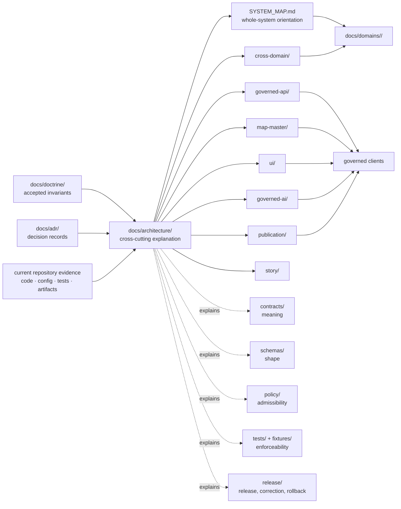

<a id="top"></a>

# `docs/architecture/`

> **Purpose.** Provide the human-readable, cross-cutting architecture map for the Kansas Frontier Matrix: how accepted doctrine, ADRs, responsibility roots, lifecycle states, trust objects, subsystem boundaries, governed interfaces, release controls, correction, and rollback fit together.

> [!IMPORTANT]
> **Explanatory, not sovereign.** This folder does not decide doctrine, object meaning, machine shape, admissibility, review, release, or publication. Those responsibilities remain with accepted doctrine and ADRs, `contracts/`, `schemas/`, `policy/`, executable implementation and tests, receipts and proofs, and append-only release records.

## Current checkpoint

| Field | Current bounded result |
|---|---|
| Evidence snapshot | `main@452ccf7250e04a40a05776895f0e4ca8129d7f1c` |
| Base architecture tree | `7130327e01542244e96c51ebc4b61974bea9278b` |
| Prior README blob | `636e433b96ff32bb756cc6f15d2190072ab238ca` |
| Direct Markdown files | **41** |
| Direct subdirectories | **8** |
| Markdown files in those subdirectories | **62** |
| Total Markdown documents | **103** |
| Placement authority | [ADR-0029](../adr/ADR-0029-adopt-directory-governance-standard-v2.md) accepts the exact Directory Rules v2 bytes at [`docs/doctrine/directory-rules.md`](../doctrine/directory-rules.md) |
| Whole-system orientation | [`SYSTEM_MAP.md`](./SYSTEM_MAP.md) is the primary repository-grounded orientation candidate |
| Active topology hazard | `TRUST_MEMBRANE.md` and `trust-membrane.md` are a case-insensitive path collision; the current-main identity, content, fragment, and consumer inventory leaves structural migration on explicit **HOLD** |
| Skeleton Map posture | [`SKELETON_MAP.md`](./SKELETON_MAP.md) is the source-maintained physical-topology and responsibility-routing companion; [PR #3097](https://github.com/bartytime4life/Kansas-Frontier-Matrix/pull/3097) records retirement of the temporary one-shot writer, and current `main@fec1f92fde6fb7dd83c995f9984d495bb61a84bb` has no active workflow at the former path |
| Review route | `@bartytime4life` through `.github/CODEOWNERS`; specialist architecture and documentation stewardship remains **NEEDS VERIFICATION** |
| Convergence state | Wave 0 plan merged in [PR #3031](https://github.com/bartytime4life/Kansas-Frontier-Matrix/pull/3031); structural moves and retirements remain unexecuted |
| Release/publication effect | None |

The inventory is **CONFIRMED** at the pinned tree. Document roles below are repository-grounded where inspected. Future migrations remain **PROPOSED** or **HOLD** until content, identity, consumer, authority, validation, and rollback closure is complete.

**Quick navigation:** [Purpose and authority](#purpose-and-authority) · [Status](#status) · [Trust-membrane migration checkpoint](#trust-membrane-migration-checkpoint) · [What belongs here](#what-belongs-here) · [What does not belong here](#what-does-not-belong-here) · [Folder map](#folder-map) · [Reading paths](#how-to-read-this-folder) · [Invariants](#doctrinal-invariants-this-folder-explains) · [System fit](#how-this-folder-fits) · [Validation](#validation) · [Anti-patterns](#anti-patterns-specific-to-this-folder) · [Review](#review-burden) · [ADRs](#adrs) · [FAQ](#faq) · [Last reviewed](#last-reviewed)

---

## Purpose and authority

`docs/architecture/` explains how KFM responsibilities compose across the repository. It is the bridge between:

- [`docs/doctrine/`](../doctrine/) — accepted invariants and operating law;
- [`docs/adr/`](../adr/) — dated decisions and their status;
- responsibility roots such as `contracts/`, `schemas/`, `policy/`, `apps/`, `packages/`, `data/`, `release/`, `tools/`, `tests/`, and `fixtures/`; and
- domain, runbook, security, standards, source, and review documentation that needs a shared system context.

A path in this folder is an authority claim about **who explains a concern**, not proof that the explained feature is implemented, secure, deployed, released, public-safe, or operational.

| Question | Owning evidence |
|---|---|
| What is an invariant? | Accepted doctrine and accepted ADRs |
| What exists now? | Commit-pinned repository files and configuration |
| What works now? | Implementation plus representative tests, workflows, artifacts, logs, or observed runtime evidence |
| What does an object mean? | `contracts/` |
| What machine shape is valid? | `schemas/` |
| What is allowed, denied, restricted, or withheld? | `policy/`, rights, sensitivity, review, and release evidence |
| What was executed? | Receipts and bounded process evidence |
| What is released, corrected, withdrawn, or rollback-ready? | `release/` and the applicable public-safe carrier records |
| What does this folder own? | Cross-cutting human explanation and navigation |

> [!CAUTION]
> Architecture prose must not become a substitute for a missing contract, schema, policy rule, test, review record, release decision, or runtime proof. When prose and implementation conflict, record the conflict instead of silently upgrading either side.

[Back to top](#top)

---

## Status

| Surface | Current status | Safe interpretation |
|---|---|---|
| Folder and current tree | **CONFIRMED** | `docs/architecture/` contains 103 Markdown documents at the pinned checkpoint. |
| Directory Rules v2 | **ACCEPTED** | ADR-0029 adopts the exact current doctrine bytes as placement authority. |
| Root README | **PLACE / modernized in place** | This page is the architecture entrypoint and directory contract. |
| [`SYSTEM_MAP.md`](./SYSTEM_MAP.md) | **PLACE** | Primary whole-system orientation candidate; repository-grounded at its own evidence snapshot. |
| [`SKELETON_MAP.md`](./SKELETON_MAP.md) | **PLACE / source-maintained** | Repository-grounded physical-topology and responsibility-routing companion. PR #3097 records retirement of the temporary one-shot writer; no active current-main workflow targets this file. |
| Upper/lower trust-membrane pair | **CONFLICTED / explicit HOLD** | Both are full documents with distinct identities, content, and fragment schemes. The repository-local reference inventory is recorded below; no structural migration occurs through this README. |
| Folder landing pages | **PLACE** | `cross-domain/`, `governed-ai/`, `governed-api/`, `map-master/`, `publication/`, `settlements-infrastructure/`, `story/`, and `ui/` are repository-present lanes. |
| Flat/folder overlaps | **PROPOSED convergence** | Governed AI, Governed API, Map/MapLibre, publication, Evidence Drawer, and other clusters still have competing or overlapping entrypoints. |
| Dated implementation notes | **HOLD** | Preserve until a verified report, archive, or history lane and supersession treatment are established. |
| Runtime, deployment, public operation | **UNKNOWN unless separately proved** | Documentation presence and quality do not establish operational maturity. |

The current convergence ledger and dependency order are recorded in [`document-convergence-plan.md`](./document-convergence-plan.md). Its original 102-document census is a pinned Wave 0 baseline; the merged plan itself is the additional document that brings the current tree to 103.

[Back to top](#top)

---

## Trust-membrane migration checkpoint

The dependency-ordered follow-up to [PR #3031](https://github.com/bartytime4life/Kansas-Frontier-Matrix/pull/3031) stops at **HOLD** on `main@452ccf7250e04a40a05776895f0e4ca8129d7f1c`. This inventory resolves repository-local references to the two architecture-root case variants. It deliberately excludes the separate authority at [`docs/doctrine/trust-membrane.md`](../doctrine/trust-membrane.md) and the separate cross-domain page at [`docs/architecture/cross-domain/trust-membrane.md`](./cross-domain/trust-membrane.md).

| Closure dimension | Current bounded result | Evidence |
|---|---|---|
| Document identity | **OPEN / HOLD** | `TRUST_MEMBRANE.md` declares `kfm://doc/architecture/trust-membrane`; `trust-membrane.md` declares `kfm://doc/arch-trust-membrane`. The uppercase identity is also consumed by [`docs/runbooks/geology/SOURCE_REFRESH_RUNBOOK.md`](../runbooks/geology/SOURCE_REFRESH_RUNBOOK.md); the lowercase identity is self-only in the repository-local identity search. |
| No-loss content | **OPEN / HOLD** | The uppercase document is 758 lines / 43,588 bytes; the lowercase document is 809 lines / 50,033 bytes. A complete no-index comparison changes 1,209 lines: 630 insertions and 579 deletions. Their section sets and current-state postures are materially different. |
| Inbound references | **INVENTORIED / not converged** | The path-resolution-aware referencing-file inventory is recorded below. Both variants have active repository references, including policy, domain, runbook, fixture, UI, and architecture consumers. |
| Fragments | **OPEN / HOLD** | No repository-local inbound link with a `TRUST_MEMBRANE.md#...` or `trust-membrane.md#...` suffix was found. That does not close compatibility: the uppercase document uses long generated heading slugs, while the lowercase document preserves numbered anchors such as `#1`, `#1.2`, and `#related`; external or cached consumers remain unproved. |
| Writers, generators, and registries | **OPEN / HOLD** | No workflow or generator appeared in the exact-path or document-identity inventory, but `control_plane/document_registry.yaml` registers neither identity and is itself `PROPOSED`. The geology runbook's uppercase `doc_id` dependency prevents an identity-blind rename. |
| Structural rollback | **OPEN / HOLD** | A safe migration would need an accepted survivor identity, a no-loss merged body, preserved fragment aliases or an explicit compatibility decision, atomic rewrite of all consumers, and a tested temporary-name rollback. None is selected here because no structural mutation is executed. |
| This README change | **CLOSED / bounded** | Revert the focused README commit. No trust-membrane path, bytes, identity, reference, workflow, registry, runtime, release, deployment, or publication state changes. |

<details>
<summary><strong><code>TRUST_MEMBRANE.md</code> referencing files — 10</strong></summary>

- `docs/architecture/TRUST_MEMBRANE.md` — source metadata, current path, and sibling-conflict text;
- `docs/architecture/README.md` — architecture inventory and HOLD;
- `docs/architecture/ui/BOUNDARIES.md` — UI related-document and boundary references;
- `docs/architecture/hazards-trust-membrane.md` — Hazards related-document and authority references;
- `docs/architecture/ecology-cross-domain.md`;
- `docs/architecture/domain-placement-law.md`;
- `docs/architecture/critical-asset-exposure.md`;
- `docs/architecture/document-convergence-plan.md`;
- `docs/architecture/cross-lane-join-policy.md`; and
- `docs/architecture/cross-domain-invasives.md`.

</details>

<details>
<summary><strong><code>trust-membrane.md</code> referencing files — 13</strong></summary>

- `docs/architecture/trust-membrane.md` — source metadata and proposed path;
- `docs/architecture/TRUST_MEMBRANE.md` — lowercase sibling reference and conflict text;
- `docs/architecture/README.md` — filename-level pair inventory and HOLD;
- `docs/architecture/document-convergence-plan.md` — proposed survivor and migration plan;
- `docs/brand/trust-state-visuals.md`;
- `docs/brand/finite-outcome-microcopy.md`;
- `policy/biotopes/README.md`;
- `policy/ai_builder/README.md`;
- `docs/domains/flora/API_CONTRACTS.md`;
- `docs/domains/geology/API_CONTRACTS.md`;
- `docs/domains/flora/MAP_UI_CONTRACTS.md`;
- `docs/runbooks/geology/SOURCE_REFRESH_RUNBOOK.md`; and
- `fixtures/domains/hazards/invalid/ui_reads_raw_directly/README.md`.

</details>

> [!CAUTION]
> A basename search also finds links that resolve to `docs/doctrine/trust-membrane.md` or `docs/architecture/cross-domain/trust-membrane.md`. Those are distinct documents and are not consumers of this case-collision pair.

**Structural result: explicit HOLD.** No temporary-path rename, case-only move, content merge, alias, redirect, `doc_id` reassignment, fragment rewrite, consumer rewrite, retirement, or deletion is included. The smallest safe next decision is to choose the surviving identity and compatibility obligations through accountable review before preparing one atomic migration commit.

[Back to top](#top)

---

## What belongs here

Material belongs in `docs/architecture/` when its primary responsibility is to explain how multiple KFM roots, lifecycle stages, or subsystems compose.

Typical examples:

- whole-system context and responsibility-plane orientation;
- trust-membrane wiring and governed public-path boundaries;
- contract/schema/policy/test division of responsibility;
- evidence, identity, source-role, classification, and temporal composition;
- MapLibre, UI, Governed API, Governed AI, publication, story, and cross-domain subsystem architecture;
- deployment and exposure topology at an explanatory level;
- cross-domain seams that genuinely span multiple domain lanes; and
- convergence plans that record current topology, conflicts, migration preconditions, validation, and rollback.

A substantial subsystem should normally have one active landing page. Deeper pages should own narrower local responsibilities and point back to that landing page rather than compete with it.

[Back to top](#top)

---

## What does not belong here

| Content | Owning lane | Reason |
|---|---|---|
| Invariants and operating law | `docs/doctrine/` | Doctrine states what is true. |
| Numbered architecture decisions | `docs/adr/` | ADRs record decision status and consequences. |
| Domain-only architecture | `docs/domains/<domain>/` | Domains are lanes inside responsibility roots, not architecture-root topics by importance alone. |
| Object-family semantics | `contracts/` | Contracts define meaning. |
| Machine validation shape | `schemas/` | Schemas define fields and constraints. |
| Allow/deny/restrict/abstain logic | `policy/` | Policy owns admissibility. |
| Executable behavior | `apps/`, `packages/`, `connectors/`, `pipelines/`, `runtime/`, `tools/` | Code and configuration own behavior. |
| Validation proof | `tests/`, `fixtures/`, workflows, emitted reports | Documentation cannot prove enforceability. |
| Lifecycle bytes and governed records | `data/<phase>/`, `data/receipts/`, `data/proofs/`, `release/` | Lifecycle and accountability objects remain separate. |
| Operational procedures | `docs/runbooks/` | Runbooks explain how to operate a verified surface. |
| Threat and incident detail | `docs/security/` | Security documentation owns threat, exposure, and incident responsibilities. |
| Source catalogs and standards profiles | `docs/sources/`, `docs/standards/` | Source identity and external-standard interpretation have separate lanes. |
| Generated or historical reports | `docs/reports/`, verified archive/history lanes | Durable architecture should not compete with dated run history. |

[Back to top](#top)

---

## Folder map

```text
docs/architecture/
├── README.md                         # this entrypoint
├── SYSTEM_MAP.md                     # primary whole-system orientation candidate
├── SKELETON_MAP.md                   # physical topology and responsibility routing
├── document-convergence-plan.md      # 102-file Wave 0 ledger and migration sequence
├── system-context.md                 # system boundary and external interfaces
├── contract-schema-policy-split.md   # meaning / shape / admissibility / proof split
├── ... 35 additional direct Markdown pages
├── cross-domain/                     # 9 Markdown files
├── governed-ai/                      # 10 Markdown files
├── governed-api/                     # 8 Markdown files
├── map-master/                       # 8 Markdown files
├── publication/                      # 9 Markdown files
├── settlements-infrastructure/       # 1 Markdown file
├── story/                            # 2 Markdown files
└── ui/                               # 15 Markdown files
```

### Primary orientation and control pages

| Page | Current role | Status |
|---|---|---|
| [`SYSTEM_MAP.md`](./SYSTEM_MAP.md) | Repository-grounded whole-system orientation | `PLACE` |
| [`system-context.md`](./system-context.md) | System boundary, audiences, and external interfaces | `PLACE` |
| [`contract-schema-policy-split.md`](./contract-schema-policy-split.md) | Cross-root meaning/shape/admissibility/enforceability explanation | `PLACE` |
| [`document-convergence-plan.md`](./document-convergence-plan.md) | Current overlap ledger, migration waves, validation, and rollback | `PLACE`; non-authoritative plan |
| [`SKELETON_MAP.md`](./SKELETON_MAP.md) | Commit-pinned physical topology and responsibility routing | `PLACE`; source-maintained |

### Subsystem landing lanes

| Lane | Files | Read first | Current boundary |
|---|---:|---|---|
| Cross-domain | 9 | [`cross-domain/README.md`](./cross-domain/README.md) | Shared kernel, cross-lane relations, seams, and anti-collapse rules |
| Governed AI | 10 | [`governed-ai/README.md`](./governed-ai/README.md) | Adapter, evidence, Focus Mode, prompt-injection, receipt, and provider boundaries |
| Governed API | 8 | [`governed-api/README.md`](./governed-api/README.md) | Audience, envelope, lifecycle, deployment, error, and threat boundaries |
| Map/rendering | 8 | [`map-master/README.md`](./map-master/README.md) | Renderer, layer lifecycle, tiles, parity, viewer verification, and performance |
| Publication | 9 | [`publication/README.md`](./publication/README.md) | Release objects, gates, state, correction, rollback, and geospatial manifests |
| Settlements/infrastructure | 1 | [`settlements-infrastructure/README.md`](./settlements-infrastructure/README.md) | Architecture-adjacent domain lane under review for final placement |
| Story | 2 | [`story/README.md`](./story/README.md) | Story identity and continuity |
| UI | 15 | [`ui/README.md`](./ui/README.md) | Governed shell, Evidence Drawer, Focus Mode, review, accessibility, telemetry, and export |

### Root-level overlap clusters

| Cluster | Current active reading posture | Convergence state |
|---|---|---|
| Trust membrane | Read doctrine first, then the two architecture variants with the conflict visible | `TRUST_MEMBRANE.md` and `trust-membrane.md` remain `CONFLICTED / HOLD` |
| Governed AI | Folder README is the landing-page candidate; flat `governed-ai.md` remains a migration source | `PROPOSED` no-loss convergence |
| Governed API | Folder README is the landing-page candidate; flat `governed-api.md` remains a migration source | `PROPOSED` no-loss convergence |
| Map/MapLibre | `map-master/README.md` is the landing-page candidate; flat map and MapLibre pages remain overlapping inputs | `PROPOSED` responsibility split |
| Publication/release | `publication/README.md` is the landing-page candidate; flat release pages remain overlapping inputs | `HOLD` where gate vocabulary is unresolved |
| Evidence Drawer | Root concept page plus UI- and map-specific pages | Root owns universal boundary; subordinate pages should narrow |
| Evidence identity/hash | `evidence-identity.md` plus older hash guidance | Normative hash grammar remains outside architecture prose |
| Source roles | Root anti-collapse rule plus taxonomy and cross-domain duplicate | Taxonomy, enforcement, and seam responsibilities remain to split |
| Sensitivity/classification | Multiple architecture, doctrine, security, policy, and domain surfaces | Vocabulary and authority conflicts remain `HOLD` |
| Cross-domain seams | `cross-domain/` plus several flat seam pages | Move only after domain, sensitivity, naming, link, and consumer review |
| Dated briefing work | Durable briefing architecture plus campaign and repair records | Preserve; verify report/archive/history destination before movement |

> [!WARNING]
> Do not “fix” overlap by deleting the older-looking page. A migration is complete only when unique content, document identity, inbound links, writers, generated consumers, external compatibility, validation, and rollback are closed.

[Back to top](#top)

---

## How to read this folder

| Task | Start here | Continue with |
|---|---|---|
| Understand KFM as a whole | [`SYSTEM_MAP.md`](./SYSTEM_MAP.md) | [`system-context.md`](./system-context.md), then applicable doctrine |
| Understand authority and placement | [`document-convergence-plan.md`](./document-convergence-plan.md) | [Directory Rules](../doctrine/directory-rules.md), [ADR-0029](../adr/ADR-0029-adopt-directory-governance-standard-v2.md) |
| Review a public API boundary | [`governed-api/README.md`](./governed-api/README.md) | Trust-membrane conflict pair, runtime contracts/schemas, policy, tests |
| Review map or renderer work | [`map-master/README.md`](./map-master/README.md) | [`ui/README.md`](./ui/README.md), [`evidence-drawer.md`](./evidence-drawer.md) |
| Review the governed shell or accessibility | [`ui/README.md`](./ui/README.md) | UI child page for the exact surface, then implementation/tests |
| Review Focus Mode or model integration | [`governed-ai/README.md`](./governed-ai/README.md) | Adapter, evidence, receipt, injection, and policy surfaces |
| Review release, correction, or rollback | [`publication/README.md`](./publication/README.md) | `release/`, schemas/contracts, fixtures, validators, runbooks |
| Review a cross-domain seam | [`cross-domain/README.md`](./cross-domain/README.md) | Owning domain docs, source-role and sensitivity rules |
| Review a new contract or schema | [`contract-schema-policy-split.md`](./contract-schema-policy-split.md) | `contracts/README.md`, `schemas/README.md`, applicable policy and fixtures |
| Investigate architecture drift | [`document-convergence-plan.md`](./document-convergence-plan.md) | [`docs/registers/DRIFT_REGISTER.md`](../registers/DRIFT_REGISTER.md), current repository evidence |
| Investigate `SKELETON_MAP.md` | Read it as the source-maintained physical-topology companion | Check its pinned root inventory, root registry projection, current drift register, and retired writer lineage |

[Back to top](#top)

---

## Doctrinal invariants this folder explains

| Invariant | Doctrinal owner | Architecture surfaces |
|---|---|---|
| Lifecycle: `RAW -> WORK / QUARANTINE -> PROCESSED -> CATALOG / TRIPLET -> PUBLISHED` | [`lifecycle-law.md`](../doctrine/lifecycle-law.md) | System Map, deployment, publication, trust membrane |
| Evidence first and cite-or-abstain | [`evidence-first.md`](../doctrine/evidence-first.md) and truth-posture doctrine | Governed API, Governed AI, Evidence Drawer, evidence identity |
| Public clients use governed interfaces, not canonical/internal stores | [`trust-membrane.md`](../doctrine/trust-membrane.md) | Trust membrane, Governed API, map, UI, critical exposure |
| Derived carriers remain derived | [`derived-stays-derived.md`](../doctrine/derived-stays-derived.md) | Map, tiles, graphs, AI, story, 3D, publication |
| Corrections and rollback remain first-class | [`corrections-first-class.md`](../doctrine/corrections-first-class.md) | Publication, Evidence Drawer, API, story, UI |
| File placement expresses responsibility and authority | [`directory-rules.md`](../doctrine/directory-rules.md) | This README, domain placement, cross-domain, convergence plan |
| AI is interpretive and subordinate to evidence and policy | [`ai-as-assistant.md`](../doctrine/ai-as-assistant.md) | Governed AI, Focus Mode, API, prompt-injection architecture |

Architecture pages narrate these rules; they do not amend them.

[Back to top](#top)

---

## How this folder fits


```mermaid
flowchart LR
  D["docs/doctrine/<br/>accepted invariants"] --> A["docs/architecture/<br/>cross-cutting explanation"]
  R["docs/adr/<br/>decision records"] --> A
  E["current repository evidence<br/>code · config · tests · artifacts"] --> A

  A --> S["SYSTEM_MAP.md<br/>whole-system orientation"]
  A --> C["cross-domain/"]
  A --> GAI["governed-ai/"]
  A --> GAPI["governed-api/"]
  A --> MAP["map-master/"]
  A --> PUB["publication/"]
  A --> UI["ui/"]
  A --> STORY["story/"]

  A -. explains .-> K["contracts/<br/>meaning"]
  A -. explains .-> J["schemas/<br/>shape"]
  A -. explains .-> P["policy/<br/>admissibility"]
  A -. explains .-> T["tests/ + fixtures/<br/>enforceability"]
  A -. explains .-> REL["release/<br/>release, correction, rollback"]

  S --> DOMAIN["docs/domains/<domain>/"]
  C --> DOMAIN
  GAPI --> CLIENT["governed clients"]
  MAP --> CLIENT
  UI --> CLIENT
  GAI --> CLIENT
  PUB --> CLIENT
```

The arrows into architecture mean **grounds or informs**. The dotted arrows mean **explains but does not own**. No edge in this diagram authorizes a lifecycle transition or public release.

[Back to top](#top)

---

## Inputs

Architecture work should be grounded in the smallest relevant closure of:

- accepted doctrine and ADRs;
- the current repository tree and exact file bytes;
- semantic contracts, machine schemas, policy, configuration, and implementation;
- representative fixtures and tests;
- workflow definitions and exact-head results where available;
- emitted receipts, proofs, manifests, correction, withdrawal, and rollback records;
- subsystem and domain READMEs;
- current standards/source evidence where facts are version-sensitive; and
- the document graph, registry, drift register, and convergence plan.

A prior PDF, atlas, dossier, prompt, issue, or pull-request description may supply lineage or a proposal. It does not prove current behavior by itself.

[Back to top](#top)

---

## Outputs

This folder should provide:

- an accurate entrypoint into the current architecture collection;
- a reading order for maintainers and reviewers;
- explicit boundaries between explanatory prose and authority-bearing roots;
- visible conflicts, holds, migration state, and evidence limits;
- stable links to subsystem landing pages;
- a no-loss convergence path for duplicate and misplaced pages; and
- documentation updates paired with behavior changes when architecture materially changes.

[Back to top](#top)

---

## Validation

Run the repository-native changed-area checks from the feature branch. Replace `<BASE_SHA>` with the immutable base used for the pull request.

```bash
git diff --check

python tools/validators/docs/document-graph/check_document_graph.py \
  --repo-root . \
  --entrypoint README.md \
  --entrypoint docs/README.md \
  --registry control_plane/document_registry.yaml \
  --git-diff <BASE_SHA>...HEAD \
  --format markdown \
  README.md docs tools/validators/docs

python tools/validators/docs/link-check/check_links.py \
  --repo-root . \
  --git-diff <BASE_SHA>...HEAD \
  --format json

python tools/validators/docs/meta-block/check_meta_blocks.py \
  --repo-root . \
  --profile present \
  --registry control_plane/document_registry.yaml \
  --git-diff <BASE_SHA>...HEAD \
  --format markdown \
  --output /tmp/docs-meta-block.md \
  --registry-delta-output /tmp/document-registry-delta.json \
  README.md docs tools/validators/docs

python tools/validators/directory_governance/validate_repository_topology.py \
  --format text
```

These checks prove only their declared QA profiles. They do not choose document authority, accept an ADR, establish evidence sufficiency, approve policy, perform review, release data, deploy software, or publish KFM.

[Back to top](#top)

---

## Anti-patterns specific to this folder

| Anti-pattern | Failure | Required response |
|---|---|---|
| Architecture as decision authority | Explanatory prose settles a contract, policy, schema, or release dispute | Route the rule to its owning authority and cite it here |
| Proposal-era inventory presented as current | Real files are labeled absent or hypothetical | Refresh from a pinned tree and keep the evidence snapshot visible |
| Duplicate landing pages | Readers cannot tell where a subsystem begins | Compare content and consumers; converge through a no-loss migration |
| Case-insensitive collision | Windows/macOS checkouts cannot represent both paths safely | Use one atomic case-safe migration; do not leave two writable variants |
| Manual edit of a writer-bound page | A workflow or generator overwrites or diverges from the edit | Reconcile the writer, source, output, receipt, and rollback first |
| Domain material promoted to the architecture root | Topic importance replaces responsibility-root placement | Route to `docs/domains/<domain>/` or a bounded cross-domain seam |
| Dated run history treated as durable architecture | Stale operational state competes with current design | Preserve lineage in a verified report/archive/history lane |
| Runtime claim inferred from a document | “The system does X” lacks code/test/runtime evidence | Narrow the claim and link to current implementation evidence |
| Compatibility copy becomes writable authority | A mirror drifts from its source | Make the relationship one-way, time-bounded, and exit-tested |
| Cleanup resolves a vocabulary dispute | File movement silently selects a gate, sensitivity, or outcome model | Keep the conflict visible until an accepted decision exists |

[Back to top](#top)

---

## Review burden

| Change | Minimum review route | Additional closure |
|---|---|---|
| Typo, exact link, or formatting repair | `@bartytime4life` through CODEOWNERS | Changed-area documentation checks |
| Root README inventory update | CODEOWNERS route plus architecture/docs stewardship review when assigned | Pinned tree census and link/graph validation |
| New cross-cutting page | CODEOWNERS route plus affected subsystem owner | Placement decision, non-duplication search, document identity |
| Substantive trust/evidence/release change | CODEOWNERS route plus applicable evidence, policy, security, release, or domain reviewer | Contracts/schemas/policy/tests and current behavior evidence |
| Move, rename, split, mirror, or retirement | CODEOWNERS route plus owners of every affected responsibility | No-loss comparison, inbound links, writers, registry, compatibility, rollback |
| Vocabulary or authority change | Accepted ADR or other governing decision | Do not let the same change authorize its dependent migration |

`.github/CODEOWNERS` currently verifies one executable review route: `@bartytime4life`. Role names such as architecture steward, docs steward, policy steward, or release authority remain governance roles, not GitHub identities, until separately assigned and verified.

[Back to top](#top)

---

## Related folders

| Lane | Relationship |
|---|---|
| [`docs/doctrine/`](../doctrine/) | Invariants and operating law that architecture explains |
| [`docs/adr/`](../adr/) | Decision records that bind architecture |
| [`docs/domains/`](../domains/) | Domain-specific architecture and evidence boundaries |
| [`docs/runbooks/`](../runbooks/) | Operational procedures for verified surfaces |
| [`docs/security/`](../security/) | Threat, exposure, and incident responsibilities |
| [`docs/sources/`](../sources/) | Source identity, roles, terms, and onboarding |
| [`docs/standards/`](../standards/) | External-standard profiles and interpretation |
| [`docs/registers/`](../registers/) | Drift, verification, lineage, and document registers |
| [`contracts/`](../../contracts/) | Semantic meaning |
| [`schemas/`](../../schemas/) | Machine-checkable shape |
| [`policy/`](../../policy/) | Admissibility and obligations |
| [`apps/`](../../apps/) and [`packages/`](../../packages/) | Deployable and reusable implementation |
| [`tests/`](../../tests/) and [`fixtures/`](../../fixtures/) | Enforceability evidence |
| [`data/`](../../data/) | Lifecycle, registry, receipt, proof, and public-safe carrier planes |
| [`release/`](../../release/) | Promotion, release, correction, withdrawal, and rollback authority |
| [`control_plane/`](../../control_plane/) | Machine-readable governance projections |

[Back to top](#top)

---

## ADRs

| Decision | Current status | Effect on this folder |
|---|---|---|
| [ADR-0029 — Adopt Directory Governance Standard v2](../adr/ADR-0029-adopt-directory-governance-standard-v2.md) | **ACCEPTED** | Controls placement, responsibility roots, compatibility, migration, and rollback discipline |
| [ADR index](../adr/INDEX.md) | Current decision inventory | Check actual status before presenting any numbered ADR as binding |
| Schema-home, Governed API, public-client, renderer, promotion-gate, and other architecture ADRs | Status varies; many remain proposed | Architecture may explain proposals but must not silently accept them |

[Back to top](#top)

---

## FAQ

<details>
<summary><strong>How is architecture different from doctrine?</strong></summary>

Doctrine states KFM's accepted operating law. Architecture explains how repository responsibilities and subsystems express that law. Doctrine wins on an invariant conflict; current implementation evidence wins on a current-behavior claim.
</details>

<details>
<summary><strong>How is <code>SYSTEM_MAP.md</code> different from <code>SKELETON_MAP.md</code>?</strong></summary>

`SYSTEM_MAP.md` is the current primary whole-system orientation candidate. `SKELETON_MAP.md` is the separate source-maintained, commit-pinned physical-topology and responsibility-routing companion. PR #3097 records retirement of its temporary one-shot writer, and current main has no active workflow targeting the file; historical writer lineage is evidence, not a manual-edit gate.
</details>

<details>
<summary><strong>Why are both trust-membrane architecture pages still present?</strong></summary>

They are a known case-insensitive collision with distinct document identities, materially different content, incompatible fragment schemes, and active consumers of both path forms. The uppercase identity also has a runbook consumer. The current-main inventory therefore leaves migration on explicit **HOLD** until a survivor identity, no-loss merged body, fragment compatibility, atomic consumer rewrite, review route, and rollback are closed.
</details>

<details>
<summary><strong>Which finite outcomes are safe to cite?</strong></summary>

The current runtime response schema uses `ANSWER`, `ABSTAIN`, `DENY`, and `ERROR`. `HOLD`, `PASS`, `FAIL`, `RESOLVED`, and `UNRESOLVED` belong to other review, validator, or package-local surfaces unless a governing contract says otherwise. Do not merge these vocabularies through documentation cleanup.
</details>

<details>
<summary><strong>How should a new architecture page be added?</strong></summary>

Identify the one explanatory responsibility, search for an existing landing page or equivalent, verify the owning lane under accepted Directory Rules, preserve domain and subsystem boundaries, assign stable identity where required, connect the page to navigation, and add changed-area validation. A new binding rule requires its own accepted decision path.
</details>

<details>
<summary><strong>What happens when documentation and implementation disagree?</strong></summary>

State the conflict and determine which evidence owns the question. Do not silently rewrite implementation from a plan or rewrite doctrine from a current accident. Use the drift register, an ADR, a bounded implementation change, or a correction according to the responsibility involved.
</details>

<details>
<summary><strong>Does a merged documentation pull request publish KFM?</strong></summary>

No. A commit, pull request, merge, badge, validator pass, or architecture page is not a governed lifecycle promotion, release, deployment, or publication.
</details>

[Back to top](#top)

---

## Last reviewed

| Field | Value |
|---|---|
| Review date | 2026-08-19 |
| Evidence base | `main@452ccf7250e04a40a05776895f0e4ca8129d7f1c` |
| Focused correction evidence | [PR #3097](https://github.com/bartytime4life/Kansas-Frontier-Matrix/pull/3097) and `main@fec1f92fde6fb7dd83c995f9984d495bb61a84bb` confirm temporary writer retirement and absence of the former workflow path |
| Base architecture tree | `7130327e01542244e96c51ebc4b61974bea9278b` |
| Review route | `@bartytime4life` through `.github/CODEOWNERS` |
| Specialist stewardship | **NEEDS VERIFICATION** |
| Next review trigger | Architecture-tree change; accepted ADR affecting placement or subsystem ownership; trust-membrane convergence; a new Skeleton Map writer or role change; or material runtime/release boundary change |
| Rollback | Revert the focused README commit; no runtime, data, policy, release, deployment, or publication state changes |

### Related documents

- [`SYSTEM_MAP.md`](./SYSTEM_MAP.md)
- [`document-convergence-plan.md`](./document-convergence-plan.md)
- [`docs/doctrine/directory-rules.md`](../doctrine/directory-rules.md)
- [`ADR-0029`](../adr/ADR-0029-adopt-directory-governance-standard-v2.md)
- [`docs/registers/DRIFT_REGISTER.md`](../registers/DRIFT_REGISTER.md)
- [`docs/registers/DOCUMENT_REGISTRY.md`](../registers/DOCUMENT_REGISTRY.md)
- [`control_plane/document_registry.yaml`](../../control_plane/document_registry.yaml)
- [`tools/validators/docs/document-graph/README.md`](../../tools/validators/docs/document-graph/README.md)
- [`tools/validators/docs/link-check/README.md`](../../tools/validators/docs/link-check/README.md)
- [`tools/validators/docs/meta-block/README.md`](../../tools/validators/docs/meta-block/README.md)
- [`tools/validators/directory_governance/README.md`](../../tools/validators/directory_governance/README.md)

[Back to top](#top)
