<div align="center">

# 🏗️ Kansas Frontier Matrix — **System Architecture & Design Framework**  
`docs/architecture/README.md`

**Purpose:**  
Define the **architectural blueprint, predictive modeling framework, and AI-governed design system** for the Kansas Frontier Matrix (KFM).  
Ensure **FAIR+CARE compliance**, **ISO sustainability**, and **MCP-DL v6.3 reproducibility**, connecting geospatial, historical, ecological, and security domains within a unified, ethical, and transparent architecture.

[](../README.md)
[](../../LICENSE)
[](../standards/faircare.md)
[]()
[]()
</div>

---

## 📘 Overview

The **System Architecture & Design Framework** describes the **full-stack, containerized, ontology-driven, AI-enhanced ecosystem** that powers KFM. It integrates **geospatial, tabular, textual, and streaming data** across environmental, cultural, historical, and security domains, with end-to-end **governance automation and telemetry**.

### 🎯 Strategic Objectives
- 🧱 **Modular, domain-separated architecture** — scalable and federated (climate, hazards, hydrology, treaties, archaeology, ecology, historical).  
- ⚙️ **Reproducible AI/ETL pipelines** — compliant with **FAIR+CARE**, **ISO**, **MCP-DL**.  
- 🔐 **Verifiable provenance & supply-chain integrity** — **SLSA**, **Sigstore**, **SPDX** SBOMs.  
- 🌎 **Interoperability-first design** — **STAC 1.0**, **DCAT 3.0**, **GeoSPARQL**, **CIDOC-CRM**, **OWL-Time**, **PROV-O**.  
- 🤖 **Focus Mode v2+** — predictive modeling, ethical AI governance, explainable insights across layers.  
- 🔄 **Workflow Governance** — CI/CD workflows documented in `docs/workflows/` and enforced via **branch protections** and telemetry.  
- 🛡️ **Security-by-design** — **Threat modeling (STRIDE/LINDDUN)**, **secrets policy**, **supply-chain provenance**, **IR playbooks** integrated with architecture.

---

## 🗂️ Architecture Layout

```plaintext
docs/architecture/
├─ README.md                   # System Architecture & Predictive AI framework (this file)
├─ data-architecture.md        # STAC/DCAT/CIDOC/GeoSPARQL/OWL-Time data model
├─ api-architecture.md         # FastAPI + GraphQL + Neo4j Knowledge Graph
├─ web-ui-design.md            # MapLibre + a11y-first frontend (timeline + Focus Mode)
├─ github-architecture.md      # CI/CD & governance automation on GitHub
├─ validation-framework.md     # FAIR+CARE + ISO compliance validator system
├─ telemetry-architecture.md   # Sustainability and real-time energy/usage telemetry
├─ predictive-framework.md     # Predictive scenario modeling (v9.9.0+)
├─ data-flow-diagrams.md       # Visualized architecture & data flow diagrams
└─ repo-focus.md               # Monorepo modules & CI/CD design
```

**Related**  
- **Analyses:** `../analyses/README.md` (Hydrology · Climatology · Geology · Ecology · Historical)  
- **Security:** `../security/README.md` (Threat model · Supply chain · Secrets · IR · Prompt defense)  
- **Workflows index:** `../workflows/README.md`  
- **Standards:** `../standards/*.md` (incl. `telemetry_standards.md`, `faircare.md`, `data-contracts.md`)  

---

## ⚙️ End-to-End Architecture Workflow

```mermaid
flowchart TD
    A["External Data (NOAA · USGS · KHS · DASC · GBIF · GLO)"] --> B["ETL Pipelines (src/pipelines/etl/*)"]
    B --> C["AI Enrichment (src/pipelines/ai/* · focus_transformer_v2)"]
    C --> D["Validation & FAIR+CARE (src/pipelines/validation/*)"]
    D --> E["Governance Ledger Sync (src/pipelines/governance/*)"]
    E --> F["Telemetry & Predictive Analytics (src/pipelines/telemetry/*)"]
    F --> G["Web Visualization & Focus Mode (web/frontend/)"]
    E --> H["Workflows & CI/CD (docs/workflows/* · .github/workflows)"]
    G --> I["Security Controls (docs/security/* · API gateway policies)"]
```



### 🔍 Key Workflow
1. **ETL Pipelines:** Fetch, clean, normalize; compute cryptographic checksums (SPDX).  
2. **AI Enrichment:** NER, geocoding, summarization, embeddings, explainability (SHAP/LIME).  
3. **Validation:** Enforce **FAIR+CARE**, **data contracts** (JSON Schema), **ISO** gates.  
4. **Governance:** Sync ethical decisions and provenance to immutable ledger.  
5. **Telemetry:** Stream bias, drift, a11y, energy (ISO 50001) to `focus-telemetry.json`.  
6. **Predictive Analysis:** Feed trained models into timeline scenarios; export STAC “projection” assets.  
7. **Security Controls:** Prompt-defense gates, tool allowlists, secrets rotation, SLSA provenance, IR hooks.  
8. **Workflows:** CI/CD orchestration documented in `docs/workflows/` and enforced via branch protections; `telemetry-export.yml` merges metrics.

---

## 🧩 System Blueprint (Layered Design)

| Layer | Function | Standards |
|------|-----------|------------|
| **Data Layer** | Ingest & normalize open/archival/streaming data. | FAIR+CARE · ISO 19115 |
| **Work Layer** | Staging + validation; contract-aligned transforms. | MCP-DL v6.3 |
| **AI/Analytics Layer** | NER, embeddings, predictive models, explainability. | FAIR+CARE · ISO 14064 |
| **Knowledge Graph** | Neo4j + RDF federation with STAC/DCAT bindings. | CIDOC-CRM · OWL-Time · PROV-O |
| **Governance Layer** | Ethics, consent & role gating; ledger sync. | ISO 50001 · FAIR+CARE Council |
| **Security Layer** | Threat model, secrets, provenance, IR, prompt defense. | STRIDE/LINDDUN · SLSA · ISO 27035 |
| **Web Layer** | Map/timeline/Focus UI; strong a11y guarantees. | WAI-ARIA · FAIR+CARE |

---

## 🔄 Workflow Orchestration & Compliance

| Workflow Doc | Purpose | Artifacts → Telemetry |
|--------------|--------|-----------------------|
| `docs/workflows/docs-lint.yml.md` | Markdown/front-matter, links, mermaid guardrails | `reports/docs_lint.json` → `focus-telemetry.json` |
| `docs/workflows/faircare-validate.yml.md` | FAIR+CARE audits, PII scan, quarantine registry | `reports/faircare_summary.json` |
| `docs/workflows/stac-validate.yml.md` | STAC/DCAT + asset/checksum validation | `reports/stac_validation.json` |
| `docs/workflows/site.yml.md` | Build & deploy docs/portal (SLSA provenance) | `releases/v*/site-artifacts/*` |
| `docs/workflows/ai-train.yml.md` | Training, drift/explainability, SBOM, SLSA | `reports/ai/**` · `releases/models/**` |
| `docs/workflows/telemetry-export.yml.md` | Merge all metrics to ledger | `releases/*/focus-telemetry.json` |

> **Policy:** Any dataset flagged by `faircare-validate.yml` is quarantined to `data/work/staging/tabular/abandonment_candidates/` and **must not** flow into AI or publication paths until remediated and council-approved.

---

## 🛰 STAC · DCAT · Graph Interoperability

- **STAC v1.0** — `data/stac/**` validated and mirrored to DCAT; assets checksum-audited.  
- **DCAT 3.0** — Dataset discoverability & licensing; round-trip parity checks.  
- **CIDOC-CRM + GeoSPARQL** — Cultural heritage and spatial semantics unify `Person`, `Place`, `Event`, `Dataset`, `Document`.  
- **Focus Mode AI** — Composes narrative subgraphs (entity ↔ dataset ↔ event) with explainability and CARE filters.  
- **Predictive Projections** — Modeled futures exported as STAC Items (`kfm:projection` extension) for timeline overlays.

---

## 🛡️ Integrated Security Architecture (excerpt)

| Control Domain | Primary Controls | Where Enforced |
|----------------|------------------|----------------|
| **Threat Modeling** | STRIDE/LINDDUN risk register | `docs/security/threat-model.md` |
| **Supply Chain** | SLSA provenance, SBOM (SPDX/CycloneDX), Sigstore | `docs/security/supply-chain.md` |
| **Secrets** | ZTA, KMS/Vault rotation, RBAC | `docs/security/secrets-policy.md` |
| **IR & Recovery** | NIST 800-61 / ISO 27035 runbooks | `docs/security/incident-response.md` |
| **Prompt Defense** | Signed prompts, tool allowlists, sandboxed rendering | `docs/security/prompt-injection-defense.md` |

---

## 📊 Predictive & Sustainability Telemetry

| Metric | Target | Current | Source |
|--------|--------|--------|--------|
| FAIR+CARE Alignment | 100% | ✅ | `faircare-validate.yml` |
| Ethical Drift Detection | Enabled | ✅ | `ai-train.yml` |
| Energy per build (Wh) | ≤ 25 | 22.3 | `telemetry-export.yml` |
| Carbon Offset | 100% | ✅ | Governance ledger |
| Forecast Accuracy (AI v2) | ≥ 94% | 95.6% | `ai-train.yml` |

Telemetry reference: `../../releases/v10.2.0/focus-telemetry.json` · Standards: `../standards/telemetry_standards.md`

---

## 🧾 Citation (Internal Reference)

```text
Kansas Frontier Matrix (2025). System Architecture & Design Framework (v10.2.3).
FAIR+CARE · ISO · MCP-DL aligned, workflow-governed architecture for data, AI, security, and web systems with end-to-end telemetry and governance automation.
```

---

## 🕰️ Version History

| Version | Date | Author | Summary |
|---------:|------|--------|----------|
| v10.2.3 | 2025-11-09 | `@kfm-architecture` | Align to v10.2: added integrated Security Layer, updated workflows table (site.yml), refreshed telemetry refs & interoperability notes. |
| v10.2.2 | 2025-11-09 | `@kfm-architecture` | Linked analyses & security directories; clarified governance and predictive exports as STAC items. |
| v9.9.2 | 2025-11-08 | `@kfm-architecture` | Added `data-flow-diagrams.md`; synchronized references to telemetry and predictive architecture. |

---

<div align="center">

**Kansas Frontier Matrix**  
*Architecture Integrity × Predictive AI × FAIR+CARE Sustainability*  
© 2025 Kansas Frontier Matrix · MIT · Master Coder Protocol v6.3 · FAIR+CARE Certified · Diamond⁹ Ω / Crown∞Ω Ultimate Certified  

[Back to Docs Index](../README.md) · [Governance Charter](../../docs/standards/governance/ROOT-GOVERNANCE.md)

</div>
