<div align="center">

# 🏗️ Kansas Frontier Matrix — **System Architecture & Design Framework**  
`docs/architecture/README.md`

**Purpose:**  
Defines the **architectural blueprint, predictive modeling framework, and AI-governed design system** for the Kansas Frontier Matrix (KFM).  
This document ensures **FAIR+CARE compliance**, **ISO sustainability**, and **MCP-DL v6.3 reproducibility**, connecting geospatial, historical, and ecological data within a unified, ethical, and transparent architecture.

[](../README.md)
[](../../LICENSE)
[](../standards/faircare-validation.md)
[]()
[]()

</div>

---

## 📘 Overview

The **System Architecture & Design Framework** describes the **full-stack, containerized, ontology-driven, AI-enhanced ecosystem** that powers the Kansas Frontier Matrix. It integrates **geospatial, tabular, textual, and streaming data** across environmental, cultural, and historical domains.

### 🎯 Strategic Objectives
- 🧱 **Modular, domain-separated architecture** — scalable and federated for climate, hazards, hydrology, treaties, and archaeology.  
- ⚙️ **Reproducible AI/ETL pipelines** — compliant with FAIR+CARE, ISO, and MCP-DL.  
- 🔐 **Verifiable provenance & sustainability** — ISO-aligned governance and SPDX-based SBOMs.  
- 🌎 **Interoperability-first design** — powered by **STAC 1.0**, **DCAT 3.0**, **GeoSPARQL**, **OWL-Time**, and **PROV-O**.  
- 🤖 **AI Focus v2+** — predictive modeling, ethical AI governance, and explainable insights across all layers.  

---

## 🗂️ Architecture Layout

```plaintext
docs/architecture/
├── README.md                      # System Architecture & Predictive AI framework
├── repo-focus.md                  # Monorepo module and CI/CD design
├── data-flow-diagrams.md          # End-to-end data, AI, and governance workflows
├── ai-system-architecture.md      # NER, transformer explainability, Focus Mode AI v2
├── validation-framework.md        # FAIR+CARE + ISO compliance validator system
├── telemetry-architecture.md      # Sustainability and real-time energy telemetry
├── predictive-framework.md        # Predictive scenario modeling (v9.9.0+)
└── web-ui-design.md               # MapLibre + Cesium 3D timeline and focus interface
```

---

## ⚙️ End-to-End Architecture Workflow

```mermaid
flowchart TD
    A["External Data (NOAA · USGS · KHS · DASC · GBIF · GLO)"] --> B["ETL Pipelines (src/pipelines/etl/*)"]
    B --> C["AI Enrichment (src/pipelines/ai/* · focus_transformer_v2)"]
    C --> D["Validation & FAIR+CARE (src/pipelines/validation/*)"]
    D --> E["Governance Ledger Sync (src/pipelines/governance/*)"]
    E --> F["Telemetry & Predictive Analytics (src/pipelines/telemetry/*)"]
    F --> G["Web Visualization & Focus Mode (web/frontend/)"]
```



### 🔍 Key Workflow
1. **ETL Pipelines:** Fetch, clean, and normalize multi-domain data; compute cryptographic checksums.  
2. **AI Enrichment:** Apply NER, summarization, geocoding, explainability, and Focus AI embeddings.  
3. **Validation:** Enforce FAIR+CARE + ISO rules before merging into the knowledge graph.  
4. **Governance:** Synchronize ethical ledgers and blockchain-backed provenance.  
5. **Telemetry:** Stream runtime metrics on bias, drift, and energy consumption for audits.  
6. **Predictive Analysis:** Feed trained models into timeline projections and scenario forecasts.  

---

## 🧩 System Blueprint (Layered Design)

| Layer | Function | Standards |
|------|-----------|------------|
| **Data Layer** | Ingests & normalizes open, archival, and streaming data. | FAIR+CARE · ISO 19115 |
| **Work Layer** | Prepares validated & enriched datasets for modeling. | MCP-DL v6.3 |
| **AI/Analytics Layer** | Runs transformer-based NER, embeddings, and predictive modeling. | FAIR+CARE · ISO 14064 |
| **Knowledge Graph** | Neo4j + RDF federation with STAC/DCAT bindings. | CIDOC-CRM · OWL-Time · PROV-O |
| **Governance Layer** | FAIR+CARE + ISO compliance and ethical oversight. | ISO 50001 · FAIR+CARE Council |
| **Web Layer** | 3D map & timeline with Focus Mode & accessibility standards. | WAI-ARIA · FAIR+CARE |

---

## 🧠 FAIR+CARE × MCP-DL Governance Matrix

| Principle | Implementation |
|-----------|----------------|
| **Findable** | UUID-indexed STAC/DCAT datasets and SPDX manifests with schema cross-links. |
| **Accessible** | Open REST/GraphQL APIs and versioned metadata catalogs. |
| **Interoperable** | STAC v1.0 + DCAT 3.0 aligned RDF graphs with ISO/CF/PROV compliance. |
| **Reusable** | Documentation-first workflows and open-source release procedures. |
| **Collective Benefit** | Public data architecture benefiting climate, heritage, and civic research. |
| **Authority to Control** | Governance Council approval with verifiable ledgers. |
| **Responsibility** | Maintainers ensure data ethics, explainability, and traceability. |
| **Ethics** | Accessible, inclusive, bias-monitored AI and geospatial tools. |

Governance audit logs:  
- `reports/audit/system_architecture_ledger.json`  
- `releases/v9.9.0/governance/ledger_snapshot_2025Q4.json`

---

## 📊 Core Architectural Components

| Component | Role | Compliance |
|-----------|------|-------------|
| `src/pipelines/` | AI/ETL/validation/telemetry/governance automation. | FAIR+CARE · ISO 19115 |
| `src/ai/focus/` | Focus AI v2 narrative transformer, bias & drift explainability. | MCP-DL v6.3 |
| `data/work/` | Workspaces for schema-validated staging datasets. | FAIR+CARE · CF |
| `releases/` | Versioned manifests, SBOMs, and telemetry artifacts. | SPDX · FAIR+CARE |
| `tools/` | CLI validators, ontology mappers, provenance generators. | ISO 50001 |
| `web/` | React + Cesium + MapLibre interface for timeline visualization. | FAIR+CARE · WAI-ARIA |

---

## 🛰 STAC · DCAT · Graph Interoperability

- **STAC v1.0** — `data/stac/**` holds static catalogs validated via CI.  
- **DCAT 3.0** — Dataset-level descriptors feed external discovery portals.  
- **CIDOC-CRM + GeoSPARQL** — Semantic relationships unify places, events, and documents.  
- **Focus Mode AI** — Merges narrative, ontology, and STAC references for explainable subgraphs.  
- **Predictive Layer (v9.9.0)** — Integrates AI scenario data (climate, population, landcover) as forward-projected STAC assets.  

---

## ⚙️ Predictive & Sustainability Telemetry

| Metric | Target | v9.9.0 Result | Verified By |
|--------|--------|----------------|--------------|
| FAIR+CARE Alignment | 100% | ✅ | `@kfm-fair` |
| Ethical Drift Detection | Enabled | ✅ | `@kfm-ai` |
| Energy Efficiency | ≤ 25 Wh/build | 22.3 Wh/build | `@kfm-telemetry` |
| Carbon Offset | 100% | ✅ | `@kfm-sustainability` |
| Forecast Accuracy (AI v2) | ≥ 94% | 95.6% | `@kfm-focus` |

Telemetry reference: `../../releases/v9.9.0/focus-telemetry.json`

---

## 🧾 Citation (Internal Reference)

```text
Kansas Frontier Matrix (2025). System Architecture & Design Framework (v9.9.0).
FAIR+CARE · ISO · MCP-DL aligned predictive architecture for AI, governance, and geospatial systems.
Ensures traceable, ethical, and sustainable operations across all layers.
```

---

## 🕰️ Version History

| Version | Date | Author | Summary |
|----------|------|--------|----------|
| v9.9.0 | 2025-11-07 | `@kfm-architecture` | Predictive framework + Focus AI v2 upgrades; expanded sustainability telemetry; governance ledger updates. |
| v9.8.0 | 2025-11-05 | `@kfm-core` | 3D UI refactor; federated knowledge graph integration. |
| v9.7.0 | 2025-11-06 | `@kfm-architecture` | STAC/DCAT + telemetry overhaul; ISO badge compliance. |
| v9.6.0 | 2025-11-03 | `@kfm-governance` | Enhanced AI sustainability metrics. |
| v9.5.0 | 2025-11-02 | `@kfm-governance` | Governance ledger sync; blockchain traceability. |

---

<div align="center">

**Kansas Frontier Matrix**  
*Architecture Integrity × Predictive AI × FAIR+CARE Sustainability*  
© 2025 Kansas Frontier Matrix · Master Coder Protocol v6.3 · FAIR+CARE Certified · Diamond⁹ Ω / Crown∞Ω Ultimate Certified  

[Back to Docs Index](../README.md) · [Governance Charter](../../docs/standards/governance/DATA-GOVERNANCE.md)

</div>
