<div align="center">

# 🏛️ **Kansas Frontier Matrix — Architecture Documentation Hub (v2.0.0 · Tier-Ω+∞ Certified)**  
`docs/architecture/README.md`

**Mission:** Provide the **blueprint of blueprints** — a reproducible, version-controlled, FAIR/CARE-aligned  
overview of the **Kansas Frontier Matrix (KFM)** system architecture, covering **ETL**, **AI/ML**,  
**Knowledge Graph**, **API**, **Web Frontend**, **Security**, and **CI/CD governance**.

[](../../docs/)
[](../../.github/workflows/stac-validate.yml)
[](../../.github/workflows/codeql.yml)
[](../../.github/workflows/trivy.yml)
[](../../.github/workflows/sbom.yml)
[](../../.github/workflows/docs-validate.yml)
[](../../LICENSE)

</div>

---

```yaml
---
title: "Kansas Frontier Matrix — Architecture Documentation Hub"
version: "v2.0.0"
last_updated: "2025-11-15"
owners: ["@kfm-architecture","@kfm-data","@kfm-ai","@kfm-security","@kfm-web"]
status: "Stable"
maturity: "Production"
license: "MIT (code) · CC-BY 4.0 (docs)"
tags: ["architecture","etl","ai","api","web","graph","ci-cd","governance","security","standards","fair","care"]
alignment:
  - MCP-DL v6.3
  - STAC 1.0 / DCAT 2.0
  - CIDOC CRM / OWL-Time / GeoSPARQL
  - FAIR / CARE
  - SLSA 3
  - SBOM / SPDX
validation:
  docs_ci_required: true
  frontmatter_required: ["title","version","last_updated","owners","license"]
  mermaid_end_marker: "<!-- END OF MERMAID -->"
preservation_policy:
  retention: "docs logs 90d · SBOM/SLSA 365d"
  checksum_algorithm: "SHA-256"
---
```

---

## 🧭 Overview

The `docs/architecture/` directory defines how **Kansas Frontier Matrix (KFM)** fits together —  
from **raw datasets to reproducible knowledge graphs** and from **ETL pipelines** to  
**interactive web frontends**, governed by **MCP-DL v6.3**.

Architecture documentation in KFM is **living infrastructure**: every change to code or data  
requires an update here, validated via `docs-validate.yml` and `policy-check.yml`.

---

## 🗂️ Directory Layout

```bash
docs/architecture/
├── README.md                        # This file — architecture index
├── system-architecture-overview.md  # Root overview of the full stack
├── data-architecture.md             # Data lineage, STAC, and provenance
├── file-architecture.md             # Directory and storage organization
├── web-ui-architecture.md           # React + MapLibre frontend
├── api-architecture.md              # FastAPI + GraphQL backend
├── knowledge-graph.md               # Neo4j CIDOC CRM + OWL-Time schema
├── pipelines.md                     # ETL + AI/ML orchestration
├── ci-cd.md                         # CI/CD pipelines, automation & governance
├── ai-automation.md                 # AI/ML pipeline governance
├── security.md                      # Security posture & threat model
└── diagrams/
    ├── README.md
    ├── exported/
    └── templates/
```

> Each sub-file includes YAML front-matter for traceability and passes  
> `make docs-validate` (lint + front-matter + link + mermaid syntax check).

---

## 🏗 System Architecture Overview

```mermaid
flowchart TD
  A["Data Sources<br/>NOAA · USGS · FEMA · KHS · Archives"] --> B["ETL Pipeline<br/>Python · GDAL · Makefile · Checksums"]
  B --> C["Processed Layers<br/>COG · GeoJSON · CSV"]
  B --> I["AI / ML Enrichment<br/>NER · OCR · Geocoding · Summaries"]
  C --> D["STAC Catalog<br/>Collections · Items · Assets"]
  D --> H["Knowledge Graph<br/>Neo4j · CIDOC CRM · OWL-Time · GeoSPARQL"]
  I --> H
  H --> J["API Layer<br/>FastAPI · GraphQL · REST · JSON-LD"]
  J --> F["Web Frontend<br/>React · MapLibre · Timeline · AI Assistant"]
  F --> G["Accessibility & Localization<br/>WCAG 2.1 AA · i18n"]
```


<!-- END OF MERMAID -->

---

## 🧱 Core Architectural Domains

| Domain | Focus | Primary File |
|:--|:--|:--|
| **System Architecture** | High-level overview of full stack | `system-architecture-overview.md` |
| **Data Architecture** | STAC catalog design & lineage tracking | `data-architecture.md` |
| **File Architecture** | Directory hierarchy, naming conventions | `file-architecture.md` |
| **Knowledge Graph** | Ontology (CIDOC CRM, OWL-Time) | `knowledge-graph.md` |
| **API Architecture** | FastAPI + GraphQL schema & routes | `api-architecture.md` |
| **Web UI** | React + MapLibre frontend interactions | `web-ui-architecture.md` |
| **Pipelines** | ETL, AI/ML, CI integration | `pipelines.md` |
| **CI/CD Governance** | Security, validation, deploy automation | `ci-cd.md` |
| **Security** | Threat model, policy gates, OIDC auth | `security.md` |

---

## 🧩 Architectural Principles

| Principle | Description | Enforcement |
|:--|:--|:--|
| **Documentation-First** | Diagrams precede code; each subsystem documented before build. | MCP-DL + CI gates |
| **Reproducibility** | Deterministic ETL, pinned containers, checksums, and CI validation. | Makefile + SHA-256 |
| **Modularity** | ETL ↔ Graph ↔ API ↔ Web boundaries with typed contracts. | Directory structure |
| **Security by Design** | CodeQL, Trivy, SBOM, SLSA, signed releases. | `.github/workflows/*` |
| **Open Standards** | STAC, DCAT, CIDOC CRM, GeoSPARQL, JSON Schema. | Data + docs alignment |
| **Accessibility & FAIR** | WCAG 2.1 AA + FAIR metadata. | Frontend + metadata schemas |

---

## 🧮 Architecture Validation Workflow


<!-- END OF MERMAID -->

**Validation Tools**
- `markdownlint-cli2` — heading, list, and link validation  
- `@mermaid-js/mermaid-cli` — diagram rendering check  
- `jq` — front-matter field completeness  
- GitHub **policy-check.yml** — required metadata enforcement  

---

## 🧾 Governance & Compliance Matrix

| Standard | Implementation |
|:--|:--|
| **MCP-DL v6.3** | Docs-first reproducibility; CI enforced |
| **STAC / DCAT** | Metadata alignment + dataset lineage |
| **CIDOC CRM / OWL-Time** | Knowledge Graph semantics |
| **FAIR / CARE** | Ethical and interoperable data principles |
| **SLSA / SBOM** | Provenance + supply-chain security |

---

## 🧠 Editing & Contribution Guidelines

1. Create or modify documentation under `docs/architecture/`.  
2. Add/update front-matter metadata:
   ```yaml
   title: "System Architecture Overview"
   version: "vX.Y.Z"
   last_updated: "YYYY-MM-DD"
   owners: ["@kfm-architecture"]
   ```
3. Validate locally:
   ```bash
   make docs-validate
   ```
4. Commit using semantic prefix:
   ```bash
   git commit -m "docs(architecture): refine system diagram and metadata"
   ```
5. Submit PR → CI runs validation → governance sign-off by `@kfm-architecture`.

---

## 🧩 Observability & Provenance

| Metric | Target | Tool |
|:--|:--|:--|
| Diagram parse rate | 100% | Mermaid CLI |
| Broken link count | 0 | Markdownlint |
| Metadata completeness | 100% | policy-check.yml |
| Provenance logs | 100% retained | `artifacts/docs/provenance.json` |

---

## 🧾 Versioning & Lifecycle

```yaml
versioning:
  policy: "Semantic Versioning (MAJOR.MINOR.PATCH)"
  tag_pattern: "architecture-v*"
  release_doi: true
  provenance_bundle: ["architecture_readme.json","architecture_readme.sha256"]
```

**When to bump**
- **Major:** architectural paradigm shift (e.g., data model refactor)
- **Minor:** new diagrams, sections, or CI integrations
- **Patch:** typos, metadata, or small formatting corrections

---

## 🕰 Version History

| Version | Date | Summary |
|:--|:--|:--|
| **v2.0.0** | 2025-11-15 | Tier-Ω+∞: refactored for new structure, added diagrams validation, observability metrics, policy enforcement, and CI provenance. |
| v1.3.0 | 2025-10-20 | Added CI/CD, AI automation, and threat model references. |
| v1.2.0 | 2025-10-17 | Expanded FAIR/CARE & accessibility standards; added provenance tracking. |
| v1.0.0 | 2025-10-04 | Initial architecture index & directory definition. |

---

<div align="center">

**Kansas Frontier Matrix © 2025**  
*“Every System has a Story — Every Story has a Provenance.”*  
📍 `docs/architecture/README.md` — Central architectural index for the Kansas Frontier Matrix.

</div>