<div align="center">

# 🏗️ **Kansas Frontier Matrix — Architecture Overview (v2.1.1 · Tier-Ω+∞ Certified)**  
`docs/architecture/README.md`

**Mission:** Define and document the **core system architecture** of the **Kansas Frontier Matrix (KFM)** — connecting  
data pipelines, AI modules, knowledge graphs, APIs, and governance workflows through a reproducible, FAIR+CARE-aligned blueprint.

[](../../docs/)
[](../../.github/workflows/stac-validate.yml)
[](../../.github/workflows/site.yml)
[](../../.github/workflows/codeql.yml)
[](../../LICENSE)

</div>

---

## 📚 Overview

The **Kansas Frontier Matrix Architecture** unifies multiple layers — **data ingestion**, **AI enrichment**, **semantic reasoning**,  
and **governance automation** — into a coherent, standards-driven system.  
It provides a foundation for reproducible, transparent, and ethically managed knowledge infrastructure.

This directory serves as the **entry point** to all architecture documentation, diagrams, and governance artifacts.

---

## 🧭 Core Principles

| Principle | Description |
|:--|:--|
| **Documentation-as-Code** | All architecture docs are version-controlled and CI-validated. |
| **FAIR+CARE Compliance** | Every layer (data, AI, governance) follows open, ethical standards. |
| **Provenance by Design** | Every file has a checksum and ledger reference for auditability. |
| **Open Standards** | STAC, DCAT, CIDOC CRM, OWL-Time, GeoSPARQL ensure interoperability. |
| **Accessibility** | Diagrams and docs follow WCAG 2.1 AA accessibility guidelines. |

---

## 🗂️ Directory Layout

```bash
docs/architecture/
├── README.md                        # This file — architecture overview
├── adr/                             # Architecture Decision Records (rationale + governance)
│   ├── ADR-0001-data-storage.md
│   ├── ADR-0002-ontology-mapping.md
│   ├── ADR-0003-ai-governance-framework.md
│   └── templates/
│       ├── adr-template.md
│       ├── adr-decision-guide.md
│       └── README.md
├── diagrams/                        # Visual architecture blueprints
│   ├── README.md
│   ├── templates/
│   └── exported/
├── system-architecture-overview.md  # High-level KFM architecture
├── data-architecture.md             # STAC/DCAT lineage + data flow
├── knowledge-graph.md               # Neo4j schema + ontology mapping
├── pipelines.md                     # ETL + AI workflow orchestration
├── api-architecture.md              # API endpoints + governance layers
├── web-ui-architecture.md           # React + MapLibre web system
├── ci-cd.md                         # CI/CD and validation automation
└── security.md                      # Policy and threat model overview
```

---

## 🧮 System Architecture Summary

```mermaid
flowchart TD
  subgraph DATA["Data Platform"]
    D1["Raw / Work / Processed"]
    D2["STAC · DCAT Metadata"]
    D3["Archive + Governance Ledger"]
  end

  subgraph AI["AI / Machine Learning"]
    A1["NER · Summaries · Entity Linking"]
    A2["Focus Mode · Drift Detection"]
  end

  subgraph GRAPH["Knowledge Graph"]
    G1["Neo4j · CIDOC CRM / OWL-Time"]
    G2["Inference Rules · Ontology Alignment"]
  end

  subgraph API["APIs"]
    P1["FastAPI REST"]
    P2["GraphQL · SPARQL Endpoints"]
  end

  subgraph WEB["Frontend"]
    W1["React + MapLibre UI"]
    W2["Timeline & Dossier Panels"]
  end

  subgraph GOV["CI/CD & Governance"]
    C1["Docs-Validate · STAC Validate"]
    C2["Policy-Check · FAIR+CARE Audit"]
    C3["SLSA · SBOM · Provenance Ledger"]
  end

  D1 --> D2 --> A1
  A1 --> G1 --> P1 --> W1
  G1 --> P2 --> W2
  D2 --> C1 --> C2 --> C3 --> D3
  A2 --> GOV
```


<!-- END OF MERMAID -->

---

## ⚙️ Interoperability Stack

| Layer | Technology | Standard |
|:--|:--|:--|
| **Metadata** | STAC, DCAT, JSON-LD | FAIR, W3C |
| **Ontology** | CIDOC CRM, OWL-Time, GeoSPARQL | ISO 21127, OGC |
| **Graph DB** | Neo4j 5.x | Property Graph |
| **ETL / AI** | Python, spaCy, GDAL, Pandas | OpenML, ONNX |
| **APIs** | FastAPI, GraphQL | OpenAPI 3.1 |
| **Frontend** | React, MapLibre, D3.js | WCAG 2.1 AA |
| **Governance** | FAIR+CARE, SLSA, SBOM | ISO 9001, 27001 |

---

## ⚖️ FAIR + CARE Integration

| Principle | Implementation | Evidence |
|:--|:--|:--|
| **Findable** | STAC catalog + GraphQL search endpoints | `data/stac/catalog.json` |
| **Accessible** | Publicly accessible under CC-BY 4.0 | `LICENSE` |
| **Interoperable** | Open schemas and linked data standards | `data/meta/`, `docs/standards/` |
| **Reusable** | Versioned data + reproducible ETL outputs | `releases/v*/manifest.zip` |
| **Collective Benefit (CARE)** | Transparent processes for cultural and community data | `data/stac/*properties.data_ethics` |

---

## 🧩 Governance and Validation Workflows

| Workflow | Function | Output |
|:--|:--|:--|
| `docs-validate.yml` | Lints architecture docs and validates Mermaid diagrams | `reports/validation/docs_validation.json` |
| `policy-check.yml` | Enforces metadata completeness and governance compliance | `reports/audit/policy_check.json` |
| `stac-validate.yml` | Ensures STAC/DCAT metadata compliance | `reports/validation/stac_validation.json` |
| `governance-ledger.yml` | Registers checksums and provenance signatures | `data/reports/audit/data_provenance_ledger.json` |

---

## 🧱 Related Documents

- `docs/architecture/adr/README.md` — Decision registry and governance log  
- `docs/architecture/diagrams/README.md` — Visualization policy and templates  
- `docs/architecture/pipelines.md` — ETL and AI orchestration layer  
- `docs/architecture/ci-cd.md` — Continuous integration and audit automation  
- `docs/architecture/security.md` — Threat model and compliance policies  

---

## 🧾 Version History

| Version | Date | Author | Summary |
|:--|:--|:--|:--|
| **v2.1.1** | 2025-11-16 | @kfm-architecture | Aligned architecture overview with MCP-DL v6.4.3, added FAIR+CARE and CI/CD governance table. |
| v2.0.0 | 2025-10-25 | @kfm-data-lab | Updated diagram structure and data lineage integration. |
| v1.0.0 | 2025-10-04 | @kfm-architecture | Initial architecture overview and directory layout. |

---

<div align="center">

**Kansas Frontier Matrix © 2025**  
*“Every Architecture is a Living System — Every System is Ethically Governed.”*  
📍 `docs/architecture/README.md` — High-level architectural entrypoint for the Kansas Frontier Matrix.

</div>