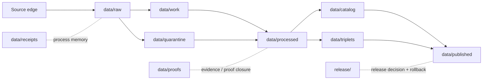
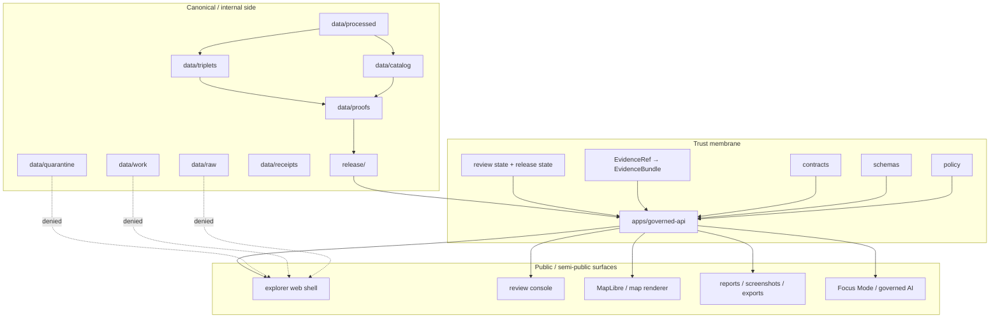
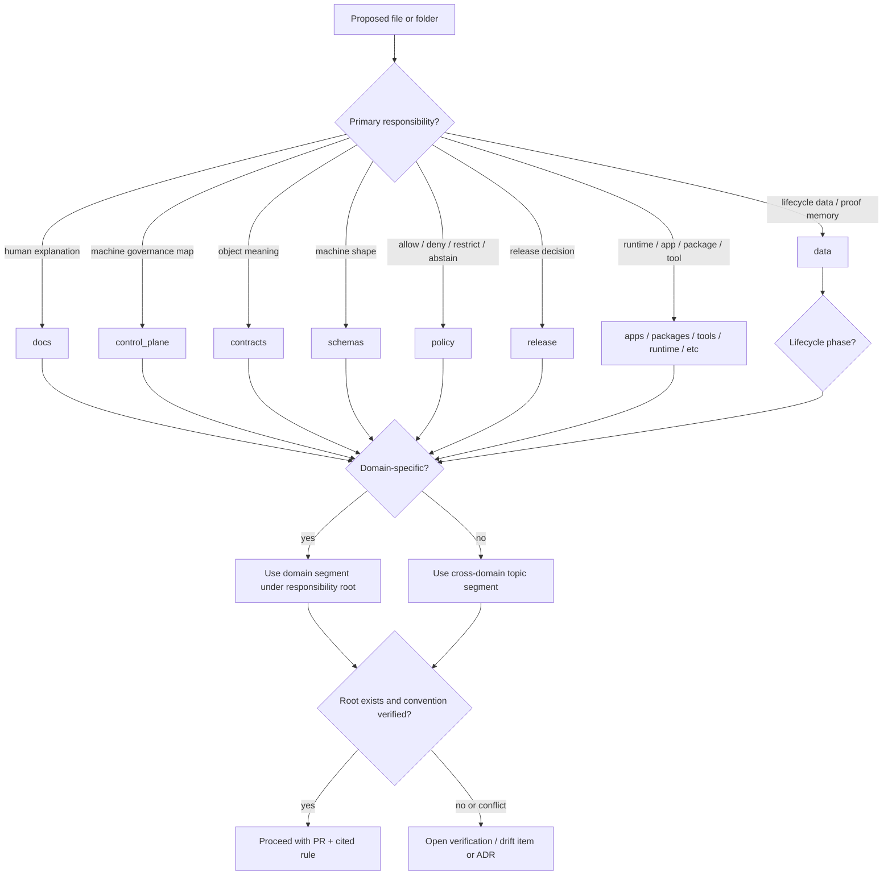

<!-- [KFM_META_BLOCK_V2]
doc_id: kfm://doc/NEEDS-VERIFICATION/skeleton-map
title: Skeleton Map
type: standard
version: v2
status: draft
owners: OWNER_TBD
created: TODO(repo-commit-date)
updated: TODO(repo-commit-date)
policy_label: NEEDS VERIFICATION
related:
  - docs/doctrine/directory-rules.md
  - docs/doctrine/trust-membrane.md
  - docs/doctrine/lifecycle-law.md
  - docs/doctrine/authority-ladder.md
  - docs/doctrine/truth-posture.md
  - docs/architecture/contract-schema-policy-split.md
  - docs/adr/ADR-0001-schema-home.md
  - docs/registers/DRIFT_REGISTER.md
  - docs/registers/VERIFICATION_BACKLOG.md
tags:
  - kfm
  - architecture
  - skeleton-map
  - directory-rules
  - trust-membrane
  - lifecycle
notes:
  - Doctrine scope; sub-type orientation-map. Placement under docs/architecture/ is CONFIRMED by Directory Rules §6.1; mounted-repo presence is NEEDS VERIFICATION.
  - Truth posture - CONFIRMED doctrine; LINEAGE prior greenfield scaffold; PROPOSED specific paths; UNKNOWN current implementation depth.
  - Source lineage - v1 draft of SKELETON_MAP.md plus prior greenfield scaffold source plus Directory Rules; no mounted repo, tests, workflows, manifests, dashboards, logs, or emitted artifacts inspected this session.
[/KFM_META_BLOCK_V2] -->

# 🧭 Kansas Frontier Matrix — Skeleton Map

> A lineage-aware, doctrine-grounded orientation map for the KFM repository skeleton: responsibility roots, lifecycle spine, trust membrane, domain lanes, object families, and the prior scaffold's preserved intent.

[](#status--ownership)
[](#evidence-boundary)
[](#evidence-boundary)
[](#placement-basis)
[](#related-docs)
[](#related-docs)

> [!IMPORTANT]
> **Status:** PROPOSED / NEEDS VERIFICATION &nbsp;•&nbsp; **Owner:** OWNER_TBD  &nbsp;•&nbsp; **Proposed path:** `docs/architecture/SKELETON_MAP.md` &nbsp;•&nbsp; **Truth posture:** CONFIRMED doctrine · LINEAGE prior scaffold · PROPOSED specific paths · UNKNOWN current implementation depth

> [!NOTE]
> This document is a **human-facing orientation map**. It is not a schema registry, source registry, policy engine, release manifest, proof pack, control-plane register, or workflow inventory of record. Current repository behavior remains **UNKNOWN** until a mounted checkout, tests, workflows, manifests, logs, dashboards, runtime traces, and emitted artifacts are inspected.

---

## 🧭 Quick jumps

- [Status & ownership](#status--ownership)
- [What this map is](#what-this-map-is)
- [Evidence boundary](#evidence-boundary)
- [No-loss preservation from the old map](#no-loss-preservation-from-the-old-map)
- [Placement basis](#placement-basis)
- [The seven planes](#the-seven-planes)
- [One-screen skeleton](#one-screen-skeleton)
- [Lifecycle invariant](#lifecycle-invariant)
- [Trust membrane](#trust-membrane)
- [Responsibility roots](#responsibility-roots)
- [Domain lane rule](#domain-lane-rule)
- [Domain coverage intent](#domain-coverage-intent)
- [Cross-cutting planes](#cross-cutting-planes)
- [Connector source families](#connector-source-families)
- [Workflow inventory intent](#workflow-inventory-intent)
- [Reading order for a new contributor](#reading-order-for-a-new-contributor)
- [Compatibility roots](#compatibility-roots)
- [Object-family anchors](#object-family-anchors)
- [Tree inventory at a glance](#tree-inventory-at-a-glance)
- [Anti-patterns: do not do this](#anti-patterns-do-not-do-this)
- [Minimal review flow](#minimal-review-flow)
- [Implementation sequence](#implementation-sequence)
- [Evidence basis](#evidence-basis)
- [Verification checklist](#verification-checklist)
- [Rollback](#rollback)
- [Open questions](#open-questions)
- [Related docs](#related-docs)
- [Appendices](#appendices)

---

## Status & ownership

| Field | Value |
|---|---|
| **Document type** | Architecture orientation map |
| **Authority of this map** | Reflective; doctrine is owned by Directory Rules, Trust Membrane, and Lifecycle Law |
| **Authority of specific paths quoted here** | **PROPOSED** until verified against mounted-repo evidence |
| **Proposed canonical home** | `docs/architecture/SKELETON_MAP.md` |
| **Owner** | `OWNER_TBD` (Docs steward suggested) |
| **Reviewers required for change** | Docs steward + at least one architecture owner |
| **Supersedes** | `SKELETON_MAP.md` v1-draft and prior greenfield scaffold map |
| **Truth posture** | CONFIRMED doctrine · LINEAGE prior scaffold · PROPOSED placement · UNKNOWN current implementation depth |
| **Lifecycle invariant** | `RAW → WORK / QUARANTINE → PROCESSED → CATALOG / TRIPLET → PUBLISHED`. Promotion is a **governed state transition, not a file move.** |

[Back to top](#-kansas-frontier-matrix--skeleton-map)

---

## What this map is

`SKELETON_MAP.md` gives maintainers a fast, reviewable view of KFM's intended repository skeleton. It answers five practical questions:

1. **Where does a file belong?** Responsibility root first, topic second.
2. **What lifecycle is a file part of?** RAW, WORK, QUARANTINE, PROCESSED, CATALOG, TRIPLET, PUBLISHED, or an adjacent receipt/proof/release family.
3. **Where is the public trust boundary?** Public clients use governed APIs and released artifacts, not canonical/internal stores.
4. **What must remain separate?** Contracts, schemas, policy, data lifecycle, receipts, proofs, catalogs, manifests, reviews, corrections, release decisions, and rollback targets.
5. **What did the old scaffold intend?** Prior greenfield scaffold material is preserved as **LINEAGE** and converted into safer implementation intent rather than current-repo claims.

It is **not** a machine-readable control-plane map. A future machine index of roots, owners, gates, source families, or document authority belongs under `control_plane/` after repo inspection and ADR review.

> [!TIP]
> Treat this file as a *placement* map, not a *progress* map. The fact that a path appears here is doctrine about where the thing belongs if and when it exists. It is not evidence that the thing exists.

[Back to top](#-kansas-frontier-matrix--skeleton-map)

---

## Evidence boundary

| Evidence item | Status | What it supports | What it does not prove |
|---|---|---|---|
| Directory Rules (`docs/doctrine/directory-rules.md`) | **CONFIRMED doctrine** | Responsibility-root placement, domain-lane rule, canonical-vs-compatibility root discipline, lifecycle invariant, ADR/drift requirements | Current repo files or implementation behavior |
| Unified Implementation Architecture Build Manual | **CONFIRMED doctrine / PROPOSED implementation plan** | Object-family spine, lifecycle semantics, schema-home convention, first-six-PR sequence, anti-collapse rule | That any specific path or workflow exists in the current repo |
| Domains Culmination Atlas v1.1 | **CONFIRMED doctrine** | Domain dossiers, anti-pattern register, lifecycle gates, atlas-↔-responsibility-root crosswalk | Implementation maturity per domain |
| Old greenfield skeleton map | **LINEAGE** | Seven-plane orientation, trust-membrane diagram intent, lifecycle table, domain coverage intent, connector/workflow candidates, contributor reading order | That a 2,442-file / 789-directory tree exists in the current repo |
| Current v1 draft | **PROPOSED draft** | Truth labels, KFM Meta Block pattern, verification/rollback posture, responsibility-root explanation | Current repo maturity |
| This session's workspace | **LIMITED evidence** | Uploaded corpus and `directory-rules.md` are readable | A mounted KFM checkout, tests, workflows, manifests, dashboards, logs, or runtime traces |

### Reading posture

| Label | Meaning |
|---|---|
| **CONFIRMED doctrine** | Supported by KFM governing documents or supplied project doctrine. |
| **LINEAGE** | Prior scaffold or report material preserved for continuity; not implementation proof. |
| **PROPOSED** | Target design or placement not yet verified in a mounted repo. |
| **UNKNOWN** | Current implementation depth has not been verified. |
| **NEEDS VERIFICATION** | Checkable before commit, release, or publication. |

> [!NOTE]
> Memory is not evidence. Throughout this file, recollection, guessed paths, likely behavior, and generic best practice are **not** treated as facts.

[Back to top](#-kansas-frontier-matrix--skeleton-map)

---

## No-loss preservation from the old map

The old skeleton map was stronger than a simple directory tree. It carried an orientation model for how KFM is meant to *feel* to a maintainer. This revision keeps that value while removing unsafe implementation overclaims.

| Old-map element | Preservation decision | Adjustment made |
|---|---|---|
| Generated greenfield scaffold stats: **2,442 files / 789 directories** | **RETAINED as LINEAGE** | No longer stated as current-repo fact |
| Seven planes | **RETAINED** | Reframed as doctrine/placement map |
| Trust-membrane ASCII diagram | **RETAINED conceptually** | Recast as Mermaid trust-flow and public-surface rule |
| Lifecycle transition table | **RETAINED** | Kept as governed-state-change table |
| Domain coverage matrix | **RETAINED** | Reframed as **coverage intent**, not proof every file exists |
| Cross-cutting planes | **RETAINED** | Marked as PROPOSED homes pending repo inspection |
| Connector inventory | **RETAINED** | Marked as source-family candidates; connectors do not publish |
| Workflow inventory | **RETAINED** | Marked as **intended CI gate families**, not confirmed workflows |
| Contributor reading order | **RETAINED** | Kept as proposed onboarding order |
| Compatibility roots | **RETAINED / UPDATED** | Aligned with Directory Rules §8 and compatibility-root posture |
| Depth-limited tree | **PARTIALLY RETAINED** | Reduced to root-level orientation here; full old tree remains a lineage source |
| "What to do next" | **RETAINED** | Rewritten as implementation sequence with verification gates |

### Main safety correction

The old map used implementation-sounding language such as *"ships,"* *"has,"* and *"freshly generated repository skeleton."* This revision uses **LINEAGE**, **PROPOSED**, and **NEEDS VERIFICATION** so maintainers do not confuse prior scaffold intent with current repository evidence.

[Back to top](#-kansas-frontier-matrix--skeleton-map)

---

## Placement basis

**Proposed path:** `docs/architecture/SKELETON_MAP.md`

| Question | Answer | Status |
|---|---|---|
| Primary responsibility | Explains architecture and placement rules to humans | **CONFIRMED doctrine basis** (Directory Rules §4 Step 1; human explanation belongs under `docs/`) |
| Owning root | `docs/` | **CONFIRMED doctrine** / **NEEDS VERIFICATION** in mounted repo |
| Cross-domain or domain-specific? | Cross-domain / system-wide | **CONFIRMED** from document purpose |
| Likely subfolder | `docs/architecture/` | **CONFIRMED doctrine slug** (Directory Rules §6.1) |
| Requires ADR? | No, unless the repo lacks the subfolder or uses a conflicting doc convention | **NEEDS VERIFICATION** |

### Related paths to verify before commit

| Path | Relationship | Status |
|---|---|---|
| `docs/doctrine/directory-rules.md` | Governs placement doctrine | **PROPOSED canonical home** in Directory Rules §0 / NEEDS VERIFICATION in mounted repo |
| `docs/doctrine/trust-membrane.md` | Governs public/internal boundary | **PROPOSED** per Directory Rules §0 "Related doctrine" |
| `docs/doctrine/lifecycle-law.md` | Governs lifecycle spine | **PROPOSED** per Directory Rules §0 "Related doctrine" |
| `docs/architecture/contract-schema-policy-split.md` | Explains contract/schema/policy separation | **PROPOSED** per Directory Rules §0 "Related doctrine" |
| `docs/adr/ADR-0001-schema-home.md` | Establishes `schemas/contracts/v1/...` as default | **CONFIRMED doctrine reference** (Directory Rules §7.4) / NEEDS VERIFICATION as a file |
| `docs/registers/DRIFT_REGISTER.md` | Records repo structure drift | **PROPOSED** per Directory Rules §§2.1, 2.5 |
| `docs/registers/VERIFICATION_BACKLOG.md` | Records unresolved placement and implementation checks | **PROPOSED** per Directory Rules §4 Step 5 |

[Back to top](#-kansas-frontier-matrix--skeleton-map)

---

## The seven planes

KFM is easier to maintain when the **planes** are visible before the **topics**. The planes overlap in subject matter but never in authority.

| Plane | What it owns | Proposed homes | Status |
|---|---|---|---|
| **1. Doctrine & architecture** | Why KFM exists; evidence-first, map-first, time-aware, policy-aware, cite-or-abstain doctrine; ADRs | `docs/doctrine/`, `docs/architecture/`, `docs/adr/` | PROPOSED homes / CONFIRMED doctrine role |
| **2. Trust contracts & shape** | Object-family meaning and machine-checkable shape | `contracts/`, `schemas/contracts/v1/` | PROPOSED paths / CONFIRMED schema-home default |
| **3. Policy & admissibility** | Allow, deny, restrict, abstain, redaction, sensitivity floors, rights compatibility, promotion gates | `policy/` | PROPOSED / CONFIRMED root role |
| **4. Lifecycle data** | RAW → WORK / QUARANTINE → PROCESSED → CATALOG / TRIPLET → PUBLISHED; receipts, proofs, registries, manifests | `data/` | CONFIRMED doctrine / PROPOSED substructure |
| **5. Implementation** | Apps, packages, connectors, pipelines, pipeline specs, tools, scripts | `apps/`, `packages/`, `connectors/`, `pipelines/`, `pipeline_specs/`, `tools/`, `scripts/` | PROPOSED roots / CONFIRMED root roles |
| **6. Release & correction** | Release decisions, manifests, signatures, rollback cards, correction notices, withdrawal notices | `release/` | CONFIRMED doctrine / PROPOSED substructure |
| **7. Runtime & exposure** | Local runtime, model adapters, deployment, network, hardening, deny-by-default exposure | `runtime/`, `infra/`, `configs/` | PROPOSED paths / CONFIRMED root roles |

### Adjacent support roots

| Root | Role | Status |
|---|---|---|
| `control_plane/` | Machine-readable governance maps and authority registers | PROPOSED |
| `tests/` | Proof that doctrine is enforceable | PROPOSED |
| `fixtures/` | Golden, valid, invalid, and regression examples | PROPOSED |
| `migrations/` | Governed schema, database, graph, and data migrations | PROPOSED |
| `examples/` | Walkthroughs and runnable examples | PROPOSED |
| `artifacts/` | Build / docs / qa / temporary outputs only | **COMPATIBILITY** (Directory Rules §8.2) |

[Back to top](#-kansas-frontier-matrix--skeleton-map)

---

## One-screen skeleton

This is the responsibility-root baseline. It is a **placement map**, not proof that every root exists in the current repository.

```text
Kansas-Frontier-Matrix/
├── README.md
├── CHANGELOG.md
├── CONTRIBUTING.md
├── SECURITY.md
├── LICENSE
├── .github/                    # workflows, issue/PR templates, governance hooks
├── docs/                       # human-facing doctrine, architecture, runbooks, registers
├── control_plane/              # machine-readable governance maps and authority registers
├── contracts/                  # object-family meaning and semantic contracts
├── schemas/                    # machine-checkable shapes (default: schemas/contracts/v1/...)
├── policy/                     # allow / deny / restrict / abstain rules
├── tests/                      # enforceability proof
├── fixtures/                   # golden, valid, invalid, and regression samples
├── tools/                      # validators, generators, builders, checkers
├── scripts/                    # small operational helpers
├── apps/                       # deployable applications
├── packages/                   # shared implementation libraries
├── connectors/                 # source-specific fetchers and admitters
├── pipelines/                  # executable pipeline logic
├── pipeline_specs/             # declarative pipeline configuration
├── data/                       # lifecycle data and emitted proof memory
├── release/                    # release decisions, manifests, rollback, correction
├── runtime/                    # local runtime adapters and harnesses
├── infra/                      # deployment, host, network, exposure posture
├── configs/                    # non-secret defaults and templates
├── migrations/                 # database, schema, and graph migrations
├── examples/                   # worked, runnable examples
└── artifacts/                  # compatibility / temporary output only; not trust-object authority
```

> [!CAUTION]
> Do not create new root folders because a topic feels large. Root folders carry repo-wide responsibility. Domain depth lives **inside lanes** under the correct responsibility root.

[Back to top](#-kansas-frontier-matrix--skeleton-map)

---

## Lifecycle invariant

KFM's durable lifecycle law is:

```text
RAW → WORK / QUARANTINE → PROCESSED → CATALOG / TRIPLET → PUBLISHED
```

Every transition is a **governed state change**, not a file move.



### Gates and authority artifacts (illustrative)

| Stage | Authority artifact (PROPOSED) | Validator / gate family (PROPOSED) |
|---|---|---|
| Source admission | `data/registry/sources/<source>.yaml` + `data/receipts/ingest/` | `tools/validators/source_descriptor/` |
| RAW → WORK | `data/receipts/pipeline/` | `tools/validators/connector_gate/` |
| WORK → QUARANTINE | Quarantine case record under `data/quarantine/<domain>/<reason>/<run_id>/` | Per-domain validator |
| WORK → PROCESSED | `data/receipts/validation/` | `tools/validators/evidence_bundle/` |
| PROCESSED → CATALOG | `data/catalog/{stac,dcat,prov}/` | `tools/validators/promotion_gate/` |
| CATALOG → PROOF | `data/proofs/evidence_bundle/`, `data/proofs/proof_pack/` | `tools/proof_pack/` |
| PROOF → REVIEW | `release/promotion_decisions/` | `tools/validators/promotion_gate/` |
| REVIEW → PUBLISHED | `release/manifests/` + `data/published/` | `tools/release/` (release dry-run) |
| Rollback | `release/rollback_cards/` | `tools/release/` (rollback drill) |
| Correction | `release/correction_notices/` + `release/withdrawal_notices/` | Governed review console / correction workflow |

> [!WARNING]
> A path-level move that bypasses validators, policy gates, EvidenceBundle creation, catalog closure, or release-decision recording is a **lifecycle violation regardless of which directory the bytes ended up in.**

### Lifecycle rule of thumb

| Lifecycle family | What belongs there | What does **not** belong there |
|---|---|---|
| `data/raw/` | Admitted source material before transformation | Public map layers, release manifests, UI payloads |
| `data/work/` | Intermediate work products | Published artifacts or public truth claims |
| `data/quarantine/` | Unclear, conflicted, sensitive, rights-uncertain, or invalid material | Material silently promoted as if safe |
| `data/processed/` | Validated normalized derivatives | Public release decision records |
| `data/catalog/` | Catalog records and discovery metadata | Proof bundles without catalog closure |
| `data/triplets/` | Graph / triplet projections | Canonical truth replacements |
| `data/published/` | Released public-safe artifacts | RAW, WORK, QUARANTINE, or candidate artifacts |
| `data/receipts/` | Process memory and run receipts | Release decisions |
| `data/proofs/` | Proof packs and EvidenceBundle-related support | Temporary build artifacts |
| `release/` | Release decisions, manifests, correction, rollback | Data lifecycle phases |

[Back to top](#-kansas-frontier-matrix--skeleton-map)

---

## Trust membrane

The trust membrane keeps RAW, unreviewed, sensitive, model-generated, or internal state from becoming public truth.



### Public-surface rule

Public clients and normal UI surfaces use governed APIs, released artifacts, catalog records, public-safe tile services, policy decisions, review state, and EvidenceBundle resolution.

They do **not** read canonical stores, RAW, WORK, QUARANTINE, unpublished candidates, direct model runtimes, or internal graph projections as normal public paths.

### Renderer rule

The map shell, Evidence Drawer, Focus Mode, story player, screenshots, dashboards, vector indexes, graph projections, tiles, and summaries are **carriers of evidence**, not sovereign truth.

MapLibre is a disciplined 2D renderer and interaction runtime downstream of trust. It must not become the canonical store, source registry, policy engine, citation authority, review authority, publication authority, or AI authority.

### Finite outcomes

Governed AI and runtime responses are bounded to four finite outcomes:

| Outcome | Meaning |
|---|---|
| **ANSWER** | Evidence exists, policy allows, citations validate. |
| **ABSTAIN** | Evidence insufficient or unresolved. |
| **DENY** | Policy or sensitivity blocks the response. |
| **ERROR** | System failure, malformed request, or service problem. |

[Back to top](#-kansas-frontier-matrix--skeleton-map)

---

## Responsibility roots

KFM uses responsibility roots so a path makes ownership and governance visible at a glance.

| Root | Primary responsibility | Common contents | Common mistake |
|---|---|---|---|
| `docs/` | Human-facing doctrine, architecture, runbooks, status, registers | Doctrine docs, architecture maps, runbooks, registers, ADRs | Treating prose as a release decision |
| `control_plane/` | Machine-readable governance maps | Authority maps, document registries, source-to-gate maps | Duplicating prose docs as machine truth without schema |
| `contracts/` | Object-family meaning | Semantic Markdown, interface meaning | Storing divergent JSON Schema here |
| `schemas/` | Machine-checkable shape | JSON Schema, schema indexes, versioned shapes (default home `schemas/contracts/v1/`) | Creating parallel schema homes |
| `policy/` | Allow, deny, restrict, abstain | Rego / OPA bundles, sensitivity rules, gates | Hiding policy in code or docs only |
| `tests/` | Proof that rules are enforceable | Unit / integration / regression tests | Letting test-only validators become the only validator |
| `fixtures/` | Golden, valid, and invalid examples | Positive / negative examples | Fixture sprawl across competing homes |
| `tools/` | Repo-wide validators, generators, builders | Validation tools, manifest checkers, catalog emitters | App-specific code here |
| `scripts/` | Small operational helpers | Repo helpers, local setup scripts | Governance-bearing validators hidden as helpers |
| `apps/` | Deployable systems | Governed API, web shell, review console, workers | Public app bypassing governed API |
| `packages/` | Shared libraries | Evidence resolver, map wrapper, domain helpers | One-off scripts masquerading as packages |
| `connectors/` | Source-specific fetchers / admitters | Source connectors, admission probes | Connector publishing directly |
| `pipelines/` | Executable processing logic | Transform jobs, promotion dry-runs | Pipeline skipping lifecycle phases |
| `pipeline_specs/` | Declarative pipeline config | Watcher specs, ingest specs | Runtime code instead of declarative config |
| `data/` | Lifecycle data and emitted proof memory | raw / work / quarantine / processed / catalog / triplets / published / receipts / proofs / registry / rollback | Mixing release decisions with data artifacts |
| `release/` | Release decision, rollback, correction | Release manifests, rollback cards, correction records, signatures | Storing release decisions in `artifacts/` |
| `runtime/` | Local runtime adapters / harnesses | Model adapters, local harnesses, finite-outcome envelopes | Exposing runtime directly to public clients |
| `infra/` | Deployment and exposure posture | Host / network / deployment templates | Secret or policy-bearing content without gates |
| `configs/` | Non-secret defaults / templates | Config examples, defaults | Secrets or environment-specific private data |
| `migrations/` | Database / schema / graph migrations | SQL, graph, schema migration files | Domain docs or pipeline logic |
| `examples/` | Worked runnable examples | Small demos and tutorials | Canonical fixtures or production workflows |
| `artifacts/` | Compatibility / build / QA / temporary outputs | Build products, doc QA outputs, scratch artifacts | Receipts, proofs, release manifests, published data |

[Back to top](#-kansas-frontier-matrix--skeleton-map)

---

## Domain lane rule

Domain names are **lane segments, not root folders.** Use this pattern:

```text
<responsibility-root>/<domain-or-topic-segment>/...
```

Examples:

```text
docs/domains/hydrology/
contracts/domains/hydrology/
schemas/contracts/v1/domains/hydrology/
policy/domains/hydrology/
tests/domains/hydrology/
fixtures/domains/hydrology/
packages/domains/hydrology/
pipelines/domains/hydrology/
pipeline_specs/hydrology/
data/raw/hydrology/
data/work/hydrology/
data/quarantine/hydrology/
data/processed/hydrology/
data/catalog/domain/hydrology/
data/published/layers/hydrology/
data/registry/sources/hydrology/
release/candidates/hydrology/
```

> [!WARNING]
> If the mounted repo uses a different convention, **do not** silently treat that as canon. Record the conflict in `docs/registers/DRIFT_REGISTER.md` or `docs/registers/VERIFICATION_BACKLOG.md` and resolve by ADR or migration plan.

[Back to top](#-kansas-frontier-matrix--skeleton-map)

---

## Domain coverage intent

The old skeleton intended every domain to have visible homes across responsibility roots. Treat the checkmarks below as **coverage intent**, not proof that files exist.

| Domain (CONFIRMED slug) | docs | contracts | schemas | policy | tests | fixtures | packages | pipelines | pipeline_specs | data | release |
|---|:-:|:-:|:-:|:-:|:-:|:-:|:-:|:-:|:-:|:-:|:-:|
| hydrology | ◯ | ◯ | ◯ | ◯ | ◯ | ◯ | ◯ | ◯ | ◯ | ◯ | ◯ |
| soil | ◯ | ◯ | ◯ | ◯ | ◯ | ◯ | ◯ | ◯ | ◯ | ◯ | ◯ |
| atmosphere | ◯ | ◯ | ◯ | ◯ | ◯ | ◯ | ◯ | ◯ | ◯ | ◯ | ◯ |
| geology | ◯ | ◯ | ◯ | ◯ | ◯ | ◯ | ◯ | ◯ | ◯ | ◯ | ◯ |
| fauna | ◯ | ◯ | ◯ | ◯ | ◯ | ◯ | ◯ | ◯ | ◯ | ◯ | ◯ |
| flora | ◯ | ◯ | ◯ | ◯ | ◯ | ◯ | ◯ | ◯ | ◯ | ◯ | ◯ |
| habitat | ◯ | ◯ | ◯ | ◯ | ◯ | ◯ | ◯ | ◯ | ◯ | ◯ | ◯ |
| archaeology | ◯ | ◯ | ◯ | ◯ | ◯ | ◯ | ◯ | ◯ | ◯ | ◯ | ◯ |
| settlements-infrastructure | ◯ | ◯ | ◯ | ◯ | ◯ | ◯ | ◯ | ◯ | ◯ | ◯ | ◯ |
| hazards | ◯ | ◯ | ◯ | ◯ | ◯ | ◯ | ◯ | ◯ | ◯ | ◯ | ◯ |
| roads-rail-trade | ◯ | ◯ | ◯ | ◯ | ◯ | ◯ | ◯ | ◯ | ◯ | ◯ | ◯ |
| agriculture | ◯ | ◯ | ◯ | ◯ | ◯ | ◯ | ◯ | ◯ | ◯ | ◯ | ◯ |
| people-dna-land | ◯ | ◯ | ◯ | ◯ | ◯ | ◯ | ◯ | ◯ | ◯ | ◯ | ◯ |

> Legend — **◯ = intended coverage; not verified in a mounted repo.** Domain slugs above appear in Directory Rules §6.1 (`docs/domains/`) and are therefore the accepted slug forms; the **existence** of lane content under those slugs remains **NEEDS VERIFICATION**.

### Domain-name normalization notes

| Domain term | Review note |
|---|---|
| `geology` (bedrock, surficial, natural_resources) | Verify whether subdomains live under one geology lane or separate lane segments. |
| `habitat` (ecoregions, biotopes, land_cover) | Verify whether the habitat / land-cover split requires shared schemas or domain-specific schemas. |
| `people-dna-land` | **Deny / restrict by default** for living-person, DNA, genealogy, and ownership-sensitive claims. |
| `roads-rail-trade` | Verify whether this is the accepted domain slug or transport-subdomain naming differs. |
| `settlements-infrastructure` | Verify handling of critical infrastructure and exact-location exposure. |

[Back to top](#-kansas-frontier-matrix--skeleton-map)

---

## Cross-cutting planes

The old skeleton identified these cross-cutting planes. Paths remain **PROPOSED** until mounted-repo evidence confirms them.

| Cross-cutting plane | Proposed homes / surfaces | Review note |
|---|---|---|
| **Governed AI** | `docs/architecture/governed-ai/`, `runtime/model_adapters/`, `runtime/mock/`, `runtime/ollama/`, `schemas/contracts/v1/runtime/`, `schemas/contracts/v1/ui/focus_*`, `policy/focus/`, `policy/runtime/`, governed-API focus route, explorer focus panel | AI is interpretive and subordinate to evidence, policy, review, and release state. |
| **Whole UI** | `docs/architecture/ui/`, explorer web shell, review console, `packages/ui`, map-wrapper packages, `schemas/contracts/v1/ui/`, `policy/ui/` | Public UI must consume governed envelopes and released artifacts. |
| **Evidence / provenance** | `contracts/evidence/`, `schemas/contracts/v1/evidence/`, `packages/evidence-resolver/`, `data/proofs/evidence_bundle/`, PROV catalog output, evidence validators | EvidenceBundle outranks generated language and map rendering. |
| **Registries** | `control_plane/`, `data/registry/`, `docs/registers/` | Separate human registers, machine governance maps, and data source registries. |
| **Ops & observability** | `infra/`, `docs/security/`, `docs/runbooks/`, admin / workers surfaces, telemetry receipts | Telemetry must redact prompts, raw evidence, and restricted coordinates. |
| **Publication membrane** | governed API, `release/`, `data/published/`, `docs/architecture/publication/` | Publication requires proof, review, correction path, rollback target. |

[Back to top](#-kansas-frontier-matrix--skeleton-map)

---

## Connector source families

Connector source families are **candidate source-admission lanes**, not publication authority. Connectors emit to RAW or QUARANTINE. They do **not** publish.

### Old-scaffold source-family set (LINEAGE)

```text
usgs · fema · noaa · nrcs · epa · blm · ahgp · khri · ksgs · kdwp ·
ksu_research_extension · kansas_state_archives · kansas_memory · loc ·
census · gbif · inaturalist · ebird · openstreetmap · newspapers ·
familysearch · ftDNA · local_upload · manual_curation
```

### Proposed source-descriptor patterns

```text
data/registry/sources/<source>.yaml
# or, if repo convention confirms it:
data/registry/<domain>/sources/<source>.yaml
```

Illustrative descriptor names from the old scaffold — **PROPOSED / NEEDS VERIFICATION:**

```text
wbd_huc12.yaml
nhdplus_hr.yaml
usgs_water_data.yaml
fema_nfhl.yaml
nrcs_ssurgo.yaml
gbif.yaml
inaturalist.yaml
blm_land_patents.yaml
```

### Connector behavior contract

| Connector action | Allowed? | Reason |
|---|:-:|---|
| Fetch source material into RAW | ✅ | After SourceDescriptor and rights checks; admission starts lifecycle. |
| Quarantine source material | ✅ | Fail-closed handling for rights, sensitivity, integrity, or source-role uncertainty. |
| Write directly to PROCESSED | ❌ | Skips validation and normalization gates. |
| Write directly to CATALOG / TRIPLET | ❌ | Skips proof and catalog closure discipline. |
| Write directly to PUBLISHED | ❌ | Publication is a governed state transition, not a connector action. |

[Back to top](#-kansas-frontier-matrix--skeleton-map)

---

## Workflow inventory intent

The old scaffold listed workflow families that would enforce the trust membrane. Treat these as **intended CI gate families**, not confirmed `.github/workflows/` files.

```text
schema-validation        contract-drift        policy-test
validator-suite          e2e-smoke             hydrology-proof-slice
release-dry-run          deny-test             citation-validation
accessibility            link-check            codeql
dependency-scan          docs-build            ui-build
api-test                 source-descriptor-validate              connector-gate
promotion-gate           rollback-drill        evidence-resolver
focus-mock-test          telemetry-policy      docs-control-plane
```

**Expected domain workflow pattern:**

```text
.github/workflows/domain-<domain>.yml
```

> [!IMPORTANT]
> The **deny suite** is the first proof of the trust membrane: no RAW leak via API, no direct model-runtime exposure, no telemetry leak of raw evidence, no prompt leakage, no restricted-coordinate leakage, and no public exact sensitive geometry by default.

[Back to top](#-kansas-frontier-matrix--skeleton-map)

---

## Reading order for a new contributor

This is a **proposed** onboarding order. Verify file names and paths in a mounted repo before turning it into a README link list.

1. `README.md` and `docs/doctrine/` — what KFM is.
2. `docs/doctrine/directory-rules.md` and this `docs/architecture/SKELETON_MAP.md` — how the repo is laid out.
3. `docs/adr/` — what has been decided.
4. `contracts/OBJECT_MAP.md` — object → contract → schema → policy → fixture → validator → emit-home crosswalk (if present).
5. `control_plane/` — machine-readable registers.
6. `docs/domains/hydrology/` — first proof-bearing lane (if accepted as the first slice).
7. `apps/governed-api/` — trust membrane in executable form (if present).
8. `apps/explorer-web/` — map-first shell (if present).
9. `pipelines/hydrology/` and `pipeline_specs/hydrology/` — executable logic and declarative specs (if present).
10. `release/` and `data/published/hydrology/` — what published actually looks like (if present).

[Back to top](#-kansas-frontier-matrix--skeleton-map)

---

## Compatibility roots

Compatibility roots are not equal to canonical roots. They require an explicit per-root `README.md` declaring a class (`legacy`, `mirror`, `deprecated`, `external-export`, `transitional`) and may need ADR treatment depending on scope. See Directory Rules §8.

| Compatibility root | Canonical home | Class default | Allowed use | Not allowed |
|---|---|---|---|---|
| `artifacts/` | `data/receipts/`, `data/proofs/`, `release/`, `data/published/` | `transitional` | Build, docs, QA, temporary outputs | Receipts, proofs, release manifests, published data |
| `jsonschema/` | `schemas/contracts/v1/...` | `mirror` or `deprecated` | Frozen / generated mirror if ADR allows | Parallel schema authority |
| `policies/` | `policy/` | `mirror` or `legacy` | Frozen / generated mirror if ADR allows | Parallel policy authority |
| `ui/` | `apps/explorer-web/`, `packages/ui/` | `legacy` or `transitional` | Legacy shell or packaging root if documented | Competing public shell without ADR |
| `web/` | `apps/explorer-web/` | `legacy` or `transitional` | Legacy web root if documented | Competing public shell without ADR |
| `styles/` | `packages/ui/`, `apps/explorer-web/`, or `docs/brand/` | `legacy` | Map / style assets if ADR or README governs | Unreleased style authority |
| `viewer_templates/` | `apps/explorer-web/`, `examples/`, or `packages/maplibre/` | `legacy` | Legacy viewer templates if documented | Public viewer authority outside governed release |

> [!NOTE]
> Two homes for the same authority is the most common KFM drift pattern. If both exist, the compatibility root **must not** evolve independently — new rules, fields, and policy updates land in canonical first; mirrors regenerate or migrate.

[Back to top](#-kansas-frontier-matrix--skeleton-map)

---

## Object-family anchors

The skeleton is not only folders. It is also the separation of trust-bearing object families. Each family carries a different governance question.

| Object family | Purpose | Likely responsibility root | Status |
|---|---|---|---|
| `SourceDescriptor` | Source identity, role, rights, cadence, sensitivity, authority limits | `schemas/` + `data/registry/` | CONFIRMED doctrine / PROPOSED implementation |
| `EvidenceBundle` | Resolved support package for claims | `schemas/` + `data/proofs/` + `packages/evidence-resolver/` | CONFIRMED doctrine / PROPOSED implementation |
| `EvidenceRef` | Reference that resolves to an EvidenceBundle | `schemas/` / `contracts/` | CONFIRMED doctrine / PROPOSED implementation |
| `PolicyDecision` / `DecisionEnvelope` | Finite policy / runtime outcome carrier | `schemas/` / `policy/` | CONFIRMED doctrine / PROPOSED implementation |
| `RuntimeResponseEnvelope` | ANSWER / ABSTAIN / DENY / ERROR response wrapper | `schemas/contracts/v1/runtime/` + governed API | CONFIRMED doctrine / PROPOSED implementation |
| `RunReceipt` | Auditable process memory for intake / transform / release actions | `schemas/` + `data/receipts/` | CONFIRMED doctrine / PROPOSED implementation |
| `PromotionDecision` / `PromotionReceipt` | Promotion-gate record (Gates A–G) | `schemas/` + `release/promotion_decisions/` | CONFIRMED doctrine / PROPOSED implementation |
| `ReleaseManifest` | Published release identity, contents, supersession, rollback target | `schemas/` + `release/manifests/` | CONFIRMED doctrine / PROPOSED implementation |
| `CatalogMatrix` | Catalog closure / coverage / relation surface | `schemas/` + `data/catalog/` | CONFIRMED doctrine / PROPOSED implementation |
| `CorrectionNotice` | Published correction or withdrawal record | `release/correction_notices/` | CONFIRMED doctrine / PROPOSED implementation |
| `RollbackCard` | Reversal target and rollback procedure | `release/rollback_cards/` | CONFIRMED doctrine / PROPOSED implementation |
| `LayerManifest` | Map / UI layer identity, source / evidence binding, release state | `schemas/` + `data/published/` | CONFIRMED doctrine / PROPOSED implementation |
| `MapReleaseManifest` | Cohesive map release bundle | `schemas/` + `release/` | CONFIRMED doctrine / PROPOSED implementation |
| `AIReceipt` | Records governed AI invocation metadata without preserving private chain-of-thought | `schemas/` + `data/receipts/ai/` | CONFIRMED doctrine / PROPOSED implementation |
| `spec_hash` | Deterministic content identity for receipts and bundles | Cross-cutting; embedded in receipts / bundles | CONFIRMED doctrine / PROPOSED implementation |

> [!WARNING]
> **Do not collapse object families because they share a topic.** Receipts, proofs, catalog records, release decisions, reviews, correction notices, and rollback targets answer different governance questions.

[Back to top](#-kansas-frontier-matrix--skeleton-map)

---

## Tree inventory at a glance

The old scaffold described a depth-limited tree with **2,442 files** and **789 directories** (LINEAGE). This revision does not repeat the full tree in the main body because doing so can make unverified paths look implemented. The old tree remains a **LINEAGE artifact** until a mounted-repo inspection confirms or supersedes it.

### Root-level families recorded by the old scaffold (LINEAGE)

```text
.github/          apps/             artifacts/        configs/
connectors/       contracts/        control_plane/    data/
docs/             examples/         fixtures/         infra/
migrations/       packages/         pipeline_specs/   pipelines/
policy/           release/          runtime/          schemas/
scripts/          tests/            tools/

.editorconfig     .env.example      .gitignore        .pre-commit-config.yaml
AUTHORS.md        CHANGELOG.md      CITATION.cff      ... (additional root files)
```

### Legacy tree handling rule

| Situation | Handling |
|---|---|
| Old-tree path matches Directory Rules **and** is present in the mounted repo | Keep or promote after verification. |
| Old-tree path matches Directory Rules but is **absent** from the repo | Treat as PROPOSED; create only through normal PR and review. |
| Old-tree path **conflicts** with Directory Rules | Mark CONFLICTED; open a drift entry or ADR. |
| Old-tree path would create **parallel authority** | Do not create until ADR resolves authority. |
| Old-tree path is a **domain root** | Reject or migrate into a responsibility-root lane. |

[Back to top](#-kansas-frontier-matrix--skeleton-map)

---

## Anti-patterns: do not do this

| Anti-pattern | Why it breaks KFM | Safer handling |
|---|---|---|
| `hydrology/` at repo root | Domain folder fragments lifecycle and ownership | Use `docs/domains/hydrology/`, `data/<phase>/hydrology/`, etc. |
| `policies/` **and** `policy/` both active | Creates parallel policy authority | Verify canonical root; freeze / migrate mirror through ADR |
| `contracts/` **and** `schemas/` both defining JSON Schema | Creates divergent machine authority | Keep `schemas/contracts/v1/...` as default per ADR-0001 |
| Public UI reads `data/processed/` directly | Bypasses trust membrane | Route through governed API and released artifacts |
| Connector writes to `data/published/` | Skips admission and promotion gates | Connector emits RAW or QUARANTINE candidates only |
| Watcher publishes | Turns observation into release | Watcher emits receipts and candidate decisions only |
| `artifacts/` stores trust objects | Blurs temporary output with receipts / proofs / release decisions | Keep trust objects in `data/receipts/`, `data/proofs/`, and `release/` |
| AI answer becomes source of truth | Generated language is interpretive | Resolve EvidenceBundle, validate citations, then answer or abstain |
| Map tile becomes truth | Tiles are delivery artifacts | Bind tiles to manifests, catalog, evidence, policy, release, rollback |
| Sensitive geometry published exactly by default | Creates ecological, archaeological, cultural, privacy, or security risk | Redact, generalize, quarantine, staged access, or deny |
| Documentation page acts as canonical release decision | Docs explain; they do not decide alone | Promote decision to ADR, ReleaseManifest, or control-plane register as appropriate |
| Test-only validator becomes the validator | Tests prove enforcement; they do not replace the tool | Extract validator to `tools/validators/`; tests call it |
| Schema authored alongside the data file | Shape and instance drift | Shape under `schemas/`, meaning under `contracts/`, instance under `data/` |

[Back to top](#-kansas-frontier-matrix--skeleton-map)

---

## Minimal review flow

Use this flow before adding, moving, or renaming any path referenced by this map.



[Back to top](#-kansas-frontier-matrix--skeleton-map)

---

## Implementation sequence

This sequence preserves the old map's *trim / promote* intent while adding current truth labels and verification gates. It is consistent with the Unified Build Manual's recommended first-six-PR sequence (path baseline → core object semantics → schema / fixture wave → policy negative suite → evidence closure dry-run → release dry-run).

1. **Seal the doctrine layer.** Read `docs/doctrine/`, accept or rewrite, then promote through ADRs or doctrine-register process. **Status:** PROPOSED / NEEDS VERIFICATION.
2. **Seal canonical homes.** Confirm `schemas/contracts/v1/` as schema home, `contracts/` as semantic / object-meaning home, and `policy/` as canonical policy home. **Status:** CONFIRMED doctrine default / NEEDS VERIFICATION in mounted repo.
3. **Pick the first proof slice.** Hydrology is the recommended first proof-bearing lane (Unified Build Manual §18). Keep other domain stubs as deferred coverage intent. **Status:** PROPOSED.
4. **Build trust-membrane stubs first.** Governed-API fixtures can return finite outcomes such as ABSTAIN before live source activation. **Status:** PROPOSED.
5. **Land the deny suite early.** Deny tests should pass before any real public surface or live connector. **Status:** PROPOSED.
6. **Wire receipts, proofs, catalog, and release dry-run.** The first slice should emit process memory, proof closure, catalog closure, and a rollback target. **Status:** PROPOSED.
7. **Trim what you do not need.** The old scaffold was intentionally over-rich. Delete or defer unverified stubs rather than letting them harden into false authority. **Status:** PROPOSED.

[Back to top](#-kansas-frontier-matrix--skeleton-map)

---

## Evidence basis

| Source | Status | Supports | Limits |
|---|---|---|---|
| Directory Rules (`directory-rules.md`) | **CONFIRMED doctrine** | Responsibility-root placement, lifecycle invariant, domain-lane rule, ADR / drift requirements, compatibility-root risks | Does not prove current repo contents |
| Unified Implementation Architecture Build Manual | **CONFIRMED doctrine / PROPOSED implementation plan** | Object-family spine, lifecycle semantics, schema-home convention, first-six-PR sequence, anti-collapse rule | Greenfield / proposed material is not current-repo proof |
| Domains Culmination Atlas v1.1 | **CONFIRMED doctrine** | Domain dossiers, lifecycle gates, anti-pattern register, atlas-↔-responsibility-root crosswalk | Implementation maturity per domain |
| KFM Encyclopedia | **CONFIRMED doctrine** | Knowledge-system object families, cross-domain systems chapters, source family ledger | Does not prove implementation |
| Master MapLibre Components | **CONFIRMED doctrine** | Map-shell governance, Evidence Drawer / Focus Mode rules, public-surface rule | Does not prove tile / style files exist |
| Old SKELETON_MAP source | **LINEAGE** | Seven planes, trust-membrane diagram intent, lifecycle table, domain-coverage intent, connector / workflow inventory, reading order, compatibility roots, tree inventory, next-step sequence | Does not prove the current repo has those files or workflows |
| KFM Markdown authoring guidance | **CONFIRMED operating guidance** | Truth labels, repo-unavailable fallback, GitHub Markdown expectations, no overclaiming, preservation of strong existing material | Does not prove repository implementation |
| Current drafting environment | **LIMITED evidence** | Uploaded source corpus, generated Markdown, and `directory-rules.md` readable | Mounted repo, tests, workflows, manifests, logs, dashboards, and emitted artifacts not inspected |

[Back to top](#-kansas-frontier-matrix--skeleton-map)

---

## Verification checklist

Before committing this file, verify:

- [ ] Target path is confirmed or intentionally accepted: `docs/architecture/SKELETON_MAP.md`.
- [ ] Adjacent docs exist or placeholders are updated: `docs/doctrine/directory-rules.md`, `docs/doctrine/trust-membrane.md`, `docs/doctrine/lifecycle-law.md`, `docs/architecture/contract-schema-policy-split.md`.
- [ ] Owner is assigned in the meta block and PR.
- [ ] `policy_label` is confirmed with the docs steward.
- [ ] Links are converted from placeholder text to valid relative links only after repo inspection.
- [ ] Root names match accepted Directory Rules and ADRs.
- [ ] Schema-home convention `schemas/contracts/v1/...` is confirmed by ADR-0001 and repo evidence.
- [ ] `policy/` vs `policies/` convention is confirmed (canonical singular).
- [ ] `data/triplets/` spelling and role are confirmed.
- [ ] `artifacts/` compatibility posture is confirmed.
- [ ] `apps/governed-api/`, `apps/explorer-web/`, `ui/`, and `web/` boundaries are verified before any app path appears as fact.
- [ ] Old-scaffold tree entries are either verified, migrated, deferred, or marked superseded.
- [ ] No sentence claims current implementation depth without source, test, workflow, manifest, log, dashboard, runtime, or emitted-artifact evidence.
- [ ] Mermaid diagrams render in GitHub.
- [ ] No public path bypasses governed APIs or released artifacts.
- [ ] Rollback path is documented in the PR.

[Back to top](#-kansas-frontier-matrix--skeleton-map)

---

## Rollback

Rollback is required if this file:

- points maintainers to an unverified or wrong canonical root;
- creates a parallel schema, contract, policy, source, registry, release, receipt, proof, or lifecycle home;
- implies implementation maturity that has not been verified;
- weakens the `RAW → WORK / QUARANTINE → PROCESSED → CATALOG / TRIPLET → PUBLISHED` lifecycle;
- normalizes public access to canonical / internal stores;
- omits sensitivity, rights, policy, review, correction, or rollback boundaries;
- upgrades old-scaffold paths from LINEAGE to current implementation without evidence.

**Rollback target:** `ROLLBACK_TARGET_TBD_AFTER_REPO_INSPECTION`

**Suggested rollback action:**

1. Revert this file with `git revert` or `git restore` according to repository policy.
2. Open or update `docs/registers/DRIFT_REGISTER.md` if the problem is a path / authority conflict.
3. Open or update `docs/registers/VERIFICATION_BACKLOG.md` if the problem is missing evidence.
4. If a root or schema-home convention was affected, require ADR review before reintroducing the change.

[Back to top](#-kansas-frontier-matrix--skeleton-map)

---

## Open questions

| Question | Why it matters | Status |
|---|---|---|
| Is `docs/architecture/SKELETON_MAP.md` the accepted path? | Determines link targets and ownership | NEEDS VERIFICATION |
| Is `schemas/contracts/v1/` accepted as canonical schema home? | Prevents contract / schema drift | CONFIRMED doctrine default (ADR-0001) / NEEDS VERIFICATION in mounted repo |
| Are `policy/` and `policies/` both present? | Prevents parallel policy authority | NEEDS VERIFICATION |
| Is `data/triplets/` (plural) the accepted spelling? | Prevents lifecycle-sibling drift | NEEDS VERIFICATION (open per Directory Rules §18) |
| Is `artifacts/` retained as compatibility or retired? | Prevents trust-object mixing | NEEDS VERIFICATION (open per Directory Rules §18) |
| Which app path is the public shell? | Prevents UI-root drift | UNKNOWN |
| Which app path is the governed API? | Defines trust-membrane implementation | UNKNOWN |
| Which package owns EvidenceBundle resolution? | Needed before claims about runtime behavior | UNKNOWN |
| Should the full old 2,442-file tree be kept as appendix, separate lineage document, or retired? | Balances no-loss continuity against overclaiming risk | NEEDS VERIFICATION |
| Co-existence of `apps/api/` and `apps/governed-api/`? | Defines public trust path | UNKNOWN (open per Directory Rules §18) |

[Back to top](#-kansas-frontier-matrix--skeleton-map)

---

## Related docs

- `docs/doctrine/directory-rules.md` — canonical placement rules
- `docs/doctrine/trust-membrane.md` — public / internal boundary
- `docs/doctrine/lifecycle-law.md` — lifecycle invariant
- `docs/doctrine/authority-ladder.md` — source-and-authority hierarchy
- `docs/doctrine/truth-posture.md` — cite-or-abstain doctrine
- `docs/architecture/contract-schema-policy-split.md` — separation of meaning, shape, and policy
- `docs/adr/ADR-0001-schema-home.md` — schema-home decision
- `docs/registers/DRIFT_REGISTER.md` — structural drift log
- `docs/registers/VERIFICATION_BACKLOG.md` — open verification items

> All targets above are **PROPOSED paths** under Directory Rules §6.1 and §0. Replace with verified relative links once the mounted repo is inspected.

[Back to top](#-kansas-frontier-matrix--skeleton-map)

---

## Appendices

<details>
<summary><strong>Appendix A — Copy / paste placement test</strong></summary>

```text
Placement test for SKELETON_MAP.md

Primary responsibility:
- Human-facing architecture and repository-skeleton explanation.

Proposed path:
- docs/architecture/SKELETON_MAP.md

Directory Rules basis:
- Human explanation belongs under docs/. (§4 Step 1)
- Cross-domain architecture belongs under docs/architecture/, not a domain lane. (§6.1)
- Domain names are not root folders. (§3)
- Old-scaffold tree is lineage / proposed unless mounted-repo evidence verifies it. (§§0, 2.5)

Evidence boundary:
- CONFIRMED doctrine.
- LINEAGE old scaffold.
- PROPOSED specific paths.
- UNKNOWN repo implementation depth.

Required checks:
- Confirm docs/architecture/ convention in mounted repo.
- Confirm adjacent doctrine docs and registers.
- Confirm no root / schema / policy / lifecycle conflict.
- Confirm whether old-scaffold paths are retained, migrated, deferred, or superseded.
```

</details>

<details>
<summary><strong>Appendix B — One-line maintainer summary</strong></summary>

`SKELETON_MAP.md` is the human-facing map of KFM responsibility roots, lifecycle phases, trust membrane, domain lanes, object-family separation, and prior greenfield-scaffold intent. It is **not** proof of current implementation and must remain synchronized with Directory Rules, ADRs, mounted-repo evidence, and the drift / verification registers.

</details>

<details>
<summary><strong>Appendix C — Truth-label cheat sheet</strong></summary>

| Label | When to use it |
|---|---|
| **CONFIRMED doctrine** | Statement is supported by KFM governing documents. |
| **LINEAGE** | Material preserved from a prior scaffold or report; not implementation proof. |
| **PROPOSED** | Target design, path, or placement; not yet verified in implementation. |
| **UNKNOWN** | Current implementation depth has not been verified this session. |
| **NEEDS VERIFICATION** | Checkable before commit, release, or publication. |
| **CONFLICTED** | Two sources or two repo locations disagree; requires drift entry or ADR. |

</details>

---

**Related:** [Directory Rules](#related-docs) · [Trust membrane](#trust-membrane) · [Lifecycle invariant](#lifecycle-invariant) · [Object-family anchors](#object-family-anchors)

**Last updated:** `TODO(repo-commit-date)` · **Maintainer:** `OWNER_TBD` · [⬆ Back to top](#-kansas-frontier-matrix--skeleton-map)
