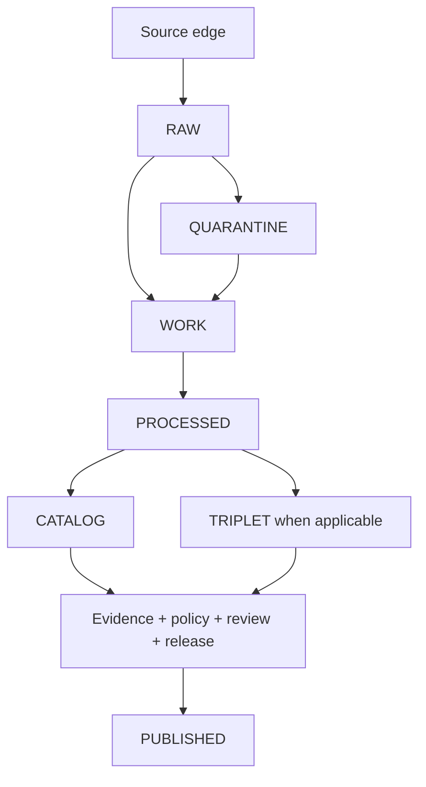
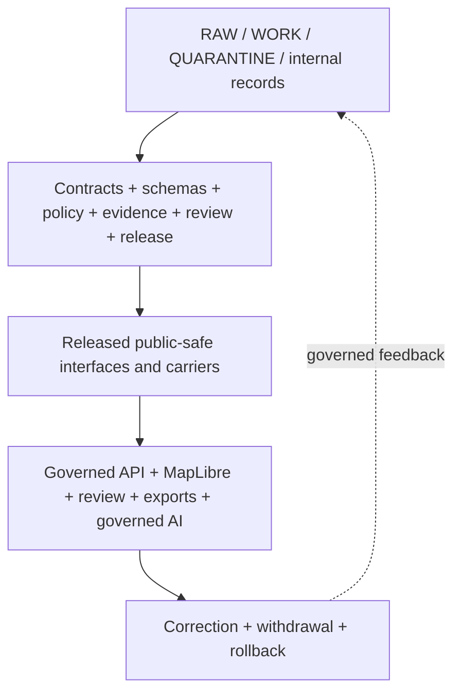
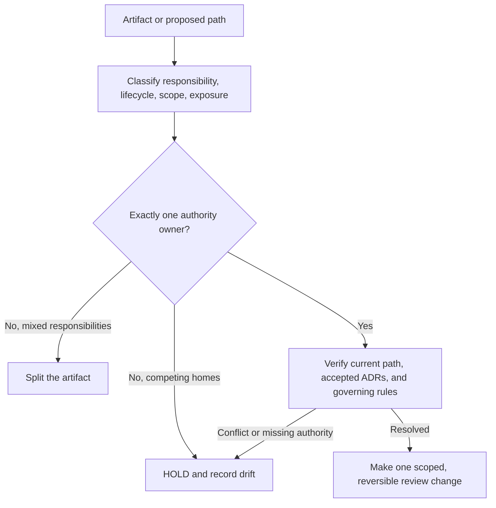

<!-- [KFM_META_BLOCK_V2]
doc_id: kfm://doc/NEEDS-VERIFICATION/skeleton-map
title: Skeleton Map
type: standard
version: v2
status: draft
owners: OWNER_TBD
created: TODO(repo-commit-date)
updated: 2026-07-26
policy_label: NEEDS VERIFICATION
related:
  - docs/doctrine/directory-rules.md
  - docs/doctrine/trust-membrane.md
  - docs/doctrine/lifecycle-law.md
  - docs/doctrine/authority-ladder.md
  - docs/doctrine/truth-posture.md
  - docs/architecture/contract-schema-policy-split.md
  - docs/adr/ADR-0001-schema-home--schemas-contracts-v1-is-canonical.md
  - docs/adr/ADR-0029-adopt-directory-governance-standard-v2.md
  - docs/registers/DRIFT_REGISTER.md
  - docs/registers/VERIFICATION_BACKLOG.md
tags:
  - kfm
  - architecture
  - skeleton-map
  - directory-rules
  - trust-membrane
  - lifecycle
notes:
  - Human-facing architecture orientation; not placement, policy, review, release, or publication authority.
  - Repository evidence for this revision was pinned to main@ba138f4de38fbaae6529d218d083e5a7e90723b3.
  - Directory Rules v2 and ADR-0029 are proposed, so their future-state classifications are labeled PROPOSED rather than adopted.
[/KFM_META_BLOCK_V2] -->

<a id="top"></a>

# 🧭 Kansas Frontier Matrix — Skeleton Map

[](#status--ownership)
[](#placement-basis)
[](../doctrine/directory-rules.md)
[](#status--ownership)

**Purpose:** orient contributors to KFM's current repository roots, governed lifecycle, trust membrane, domain lanes, and authority boundaries without turning a directory listing into architecture or publication authority.

> [!IMPORTANT]
> **This map is explanatory, not governing.** The target exists at `docs/architecture/SKELETON_MAP.md`, but current placement authority is unresolved: Directory Rules `2.0.0-draft.1` and ADR-0029 both remain proposed, while the legacy root-level map and legacy architecture rules copy are absent from the pinned `main` snapshot. Structural changes must preserve higher KFM invariants and remain on hold when no accepted rule or ADR resolves the path.

Repository presence proves that bytes exist at a pinned commit. It does not prove implementation completeness, runtime behavior, security, rights clearance, review, release, public safety, or KFM publication.

## 🧭 Quick jumps

- [Status & ownership](#status--ownership)
- [What this map is](#what-this-map-is)
- [Evidence boundary](#evidence-boundary)
- [Placement basis](#placement-basis)
- [The seven planes](#the-seven-planes)
- [One-screen skeleton](#one-screen-skeleton)
- [Lifecycle invariant](#lifecycle-invariant)
- [Trust membrane](#trust-membrane)
- [Responsibility roots](#responsibility-roots)
- [Domain lane rule](#domain-lane-rule)
- [Domain coverage intent](#domain-coverage-intent)
- [Connector source families](#connector-source-families)
- [Workflow inventory intent](#workflow-inventory-intent)
- [Compatibility roots](#compatibility-roots)
- [Object-family anchors](#object-family-anchors)
- [Minimal review flow](#minimal-review-flow)
- [Verification checklist](#verification-checklist)
- [Rollback](#rollback)
- [Open questions](#open-questions)
- [Related docs](#related-docs)

---

## Status & ownership

| Field | Current state |
|---|---|
| Document role | Human-facing repository and architecture orientation |
| Repository location | **CONFIRMED:** `docs/architecture/SKELETON_MAP.md` |
| Document status | `draft` |
| Document identity | Preserved as `kfm://doc/NEEDS-VERIFICATION/skeleton-map` |
| Owner | `OWNER_TBD` — **NEEDS VERIFICATION** |
| Placement authority | **CONFLICTED / NEEDS VERIFICATION:** proposed v2 is present; ADR-0029 is proposed; an adopted controlling Directory Rules edition was not identified in the pinned snapshot |
| Current-state evidence | Repository contents and selected workflows at `main@ba138f4de38fbaae6529d218d083e5a7e90723b3` |
| Runtime evidence | **UNKNOWN:** no runtime, deployment, dashboard, or production-log evidence was inspected |
| Publication authority | None |
| Historical lineage | Root `SKELETON_MAP.md` and the earlier 2,442-file / 789-directory scaffold remain recoverable through Git history |

[Back to top](#top)

---

## What this map is

This file answers five practical questions:

1. **Where should a reader begin?** Start with the responsibility that owns the artifact.
2. **Which lifecycle state is involved?** Distinguish source edge, RAW, WORK, QUARANTINE, PROCESSED, CATALOG, TRIPLET, PUBLISHED, receipts, proofs, and release decisions.
3. **Where is the trust membrane?** Public clients consume governed interfaces and released public-safe carriers, not internal stores.
4. **What must stay separate?** Meaning, shape, policy, evidence, process memory, validation, catalog projections, release decisions, corrections, and rollback targets.
5. **What does a path prove?** Only repository presence at a pinned ref unless stronger evidence supports a broader claim.

It is not a root registry, schema registry, source registry, policy bundle, release manifest, proof pack, workflow inventory of record, or progress dashboard. Machine projections of adopted governance belong in [`control_plane/`](../../control_plane/); current behavior must be verified from implementation and observed evidence.

> [!TIP]
> Use this map to find the governing surface. Do not use it to bypass that surface.

[Back to top](#top)

---

## Evidence boundary

### Pinned repository evidence

The following statements are **CONFIRMED** at `main@ba138f4de38fbaae6529d218d083e5a7e90723b3`:

- this file exists at the current path;
- all responsibility-root entry points listed in [Responsibility roots](#responsibility-roots) have a tracked `README.md`;
- the principal data lanes `raw`, `work`, `quarantine`, `processed`, `catalog`, `triplets`, `receipts`, `proofs`, and `published` have tracked entry points;
- `apps/governed-api/`, `apps/explorer-web/`, `packages/evidence-resolver/`, and `schemas/contracts/v1/` have tracked entry points;
- thirteen domain entry points listed in [Domain coverage intent](#domain-coverage-intent) exist under `docs/domains/`;
- the documentation workflows described in [Workflow inventory intent](#workflow-inventory-intent) exist and use GitHub-hosted runners;
- the root-level `SKELETON_MAP.md` is absent.

### Authority and integrity conflicts

| Evidence | State | Consequence |
|---|---|---|
| [`docs/doctrine/directory-rules.md`](../doctrine/directory-rules.md) | `2.0.0-draft.1`, `PROPOSED_FOR_ADOPTION` | Use as a proposed successor and current design reference, not adopted authority |
| [ADR-0029](../adr/ADR-0029-adopt-directory-governance-standard-v2.md) | `proposed` | No v2 adoption or supersession effect |
| `docs/architecture/directory-rules.md` | Absent at the pinned snapshot | The proposed migration sequence and current repository state require reconciliation outside this file |
| Root `SKELETON_MAP.md` | Deleted in commit `ee5289d5ff2649a660d665f9601431c3f5839a98` | This same-path architecture file is the remaining tracked skeleton map; Git history preserves the root lineage |
| [`docs/doctrine/truth-posture.md`](../doctrine/truth-posture.md) | Same blob as `trust-membrane.md` at the pinned snapshot | Treat the standalone truth-posture document as **CONFLICTED / NEEDS VERIFICATION** |
| ADR-0001 | Actual file is [`ADR-0001-schema-home--schemas-contracts-v1-is-canonical.md`](../adr/ADR-0001-schema-home--schemas-contracts-v1-is-canonical.md) and status is `proposed` | Repository use of `schemas/contracts/v1/` is confirmed; decision authority is not accepted |

### What was not proved

No claim in this file should be read as proof that:

- a documented route, package, validator, or workflow behaves as intended;
- any CI check passed for this revision;
- rights, sensitivity, sovereignty, privacy, or geoprivacy gates closed;
- any artifact was reviewed, promoted, released, deployed, public-safe, or KFM `PUBLISHED`.

[Back to top](#top)

---

## No-loss preservation from the old map

| Existing element | Disposition | Result |
|---|---|---|
| Seven-plane orientation | **KEEP / CLARIFY** | Retained as a responsibility model |
| Lifecycle and trust-membrane diagrams | **KEEP / REPAIR** | Kept with current confirmed lane links and bounded claims |
| Responsibility-root map | **KEEP / ENRICH** | Root entry points verified at the pinned commit |
| Domain coverage matrix | **CONSOLIDATE** | Replaced by a readable verified docs-lane inventory |
| Connector and workflow lists | **CLARIFY** | Connector list remains lineage; relevant workflow files are now current evidence |
| Compatibility-root guidance | **KEEP / REPAIR** | Current `artifacts/`, `catalog/`, and `src/` states separated from proposed v2 classifications |
| Object-family separation | **KEEP** | Retained without treating likely paths as implementation proof |
| 2,442-file / 789-directory figures | **KEEP AS LINEAGE** | Preserved as a historical claim, not a current count |
| Placeholder owner, dates, license, and path badges | **REMOVE / REPAIR** | Unverified metadata remains explicit; misleading placeholder badges removed |
| “No mounted repo inspected” statements | **REMOVE WITH EVIDENCE** | Replaced by the pinned repository evidence boundary above |

[Back to top](#top)

---

## Placement basis

`docs/architecture/SKELETON_MAP.md` is a cross-cutting human explanation. Its responsibility signature is:

| Axis | Value |
|---|---|
| Artifact kind | Human architecture document |
| Authority owner | Human explanation under `docs/` |
| Scope | Global, cross-domain |
| Lifecycle stage | Not applicable |
| Exposure | Public repository documentation |
| Mutability | Versioned replacement through review |
| Repository state | Path and parent folder **CONFIRMED** |
| Placement decision | Existing same-path document retained; no new authority surface created |

The proposed v2 rules place human architecture explanations under `docs/architecture/`, but v2 is not adopted. This update therefore relies on the existing path, the absence of a competing tracked skeleton map, higher KFM responsibility-root invariants, and same-path preservation. It does not use proposed v2 text to authorize a move, deletion, or new root.

[Back to top](#top)

---

## The seven planes

The planes explain how responsibilities compose; they do not create authority.

| Plane | Owns or explains | Primary surfaces |
|---|---|---|
| Doctrine and decisions | Invariants, architecture explanations, ADR history | [`docs/`](../../docs/) |
| Meaning and shape | Semantic contracts and machine-checkable schemas | [`contracts/`](../../contracts/), [`schemas/`](../../schemas/) |
| Admissibility | Allow, deny, hold, restrict, generalize, or abstain rules | [`policy/`](../../policy/) |
| Lifecycle and accountability | Data phases, registries, receipts, proofs, catalogs, triplets, published carriers | [`data/`](../../data/) |
| Implementation | Apps, packages, connectors, pipelines, tools, and scripts | [`apps/`](../../apps/), [`packages/`](../../packages/), [`connectors/`](../../connectors/), [`pipelines/`](../../pipelines/), [`tools/`](../../tools/) |
| Release and correction | Promotion, release, withdrawal, correction, and rollback decisions | [`release/`](../../release/) |
| Runtime and exposure | Runtime composition, configuration, deployment, network, and hardening | [`runtime/`](../../runtime/), [`configs/`](../../configs/), [`infra/`](../../infra/) |

[Back to top](#top)

---

## One-screen skeleton

The following root entry points are present at the pinned snapshot. Their presence does not establish maturity.

```text
Kansas-Frontier-Matrix/
├── .github/               # repository automation and review routing
├── apps/                  # deployable applications
├── configs/               # non-secret profiles and templates
├── connectors/            # source acquisition and admission edges
├── contracts/             # semantic and interface meaning
├── control_plane/         # machine governance projections
├── data/                  # lifecycle, accountability, and delivery instances
├── docs/                  # human doctrine, decisions, architecture, and guidance
├── examples/              # public-safe demonstrations
├── fixtures/              # reusable deterministic test inputs
├── infra/                 # deployment and exposure configuration
├── migrations/            # forward and rollback migration definitions
├── packages/              # reusable implementation
├── pipeline_specs/        # declarative pipeline definitions
├── pipelines/             # executable lifecycle transformations
├── policy/                # normative decision rules
├── release/               # release, correction, withdrawal, and rollback decisions
├── runtime/               # bounded runtime composition and local adapters
├── schemas/               # machine-checkable shapes
├── scripts/               # thin operational wrappers
├── tests/                 # executable conformance evidence
├── tools/                 # repository-wide validators and operators
├── artifacts/             # present; proposed v2 compatibility classification
├── catalog/               # present; proposed v2 deprecated-containment classification
└── src/                   # present; proposed v2 conditional/HOLD classification
```

> [!CAUTION]
> Do not create a root because a topic is large. A new root is an authority claim and requires an accepted decision when it changes the repository's responsibility model.

[Back to top](#top)

---

## Lifecycle invariant

```text
RAW -> WORK / QUARANTINE -> PROCESSED -> CATALOG / TRIPLET -> PUBLISHED
```

Promotion is a governed state transition, not a file move, commit, pull request, merge, badge, workflow result, deployment, or GitHub release.


```mermaid
flowchart TD
  source["Source edge"] --> raw["RAW"]
  raw --> work["WORK"]
  raw --> quarantine["QUARANTINE"]
  quarantine --> work
  work --> processed["PROCESSED"]
  processed --> catalog["CATALOG"]
  processed --> triplet["TRIPLET when applicable"]
  catalog --> gate["Evidence + policy + review + release"]
  triplet --> gate
  gate --> published["PUBLISHED"]
```

| Family | Confirmed entry point | Boundary |
|---|---|---|
| RAW | [`data/raw/`](../../data/raw/) | Admitted source-edge material; not public output |
| WORK | [`data/work/`](../../data/work/) | Candidate transformation state |
| QUARANTINE | [`data/quarantine/`](../../data/quarantine/) | Fail-closed held material with reasons and obligations |
| PROCESSED | [`data/processed/`](../../data/processed/) | Validated internal records; not automatically public |
| CATALOG | [`data/catalog/`](../../data/catalog/) | Discovery and provenance projections; not release authority |
| TRIPLET | [`data/triplets/`](../../data/triplets/) | Optional graph projections; not canonical truth replacements |
| RECEIPTS | [`data/receipts/`](../../data/receipts/) | Process memory; not release decisions |
| PROOFS | [`data/proofs/`](../../data/proofs/) | Evidence and validation support; not publication by themselves |
| PUBLISHED carriers | [`data/published/`](../../data/published/) | Requires governed release closure appropriate to the artifact |
| Release decisions | [`release/`](../../release/) | Separate decision plane for promotion, correction, withdrawal, and rollback |

[Back to top](#top)

---

## Trust membrane

The trust membrane prevents raw, internal, unreviewed, sensitive, rights-uncertain, or model-generated state from becoming public truth.


```mermaid
flowchart TD
  internal["RAW / WORK / QUARANTINE / internal records"] --> gates["Contracts + schemas + policy + evidence + review + release"]
  gates --> released["Released public-safe interfaces and carriers"]
  released --> public["Governed API + MapLibre + review + exports + governed AI"]
  public --> correction["Correction + withdrawal + rollback"]
  correction -. governed feedback .-> internal
```

| Surface | May do | Must not become |
|---|---|---|
| [`apps/governed-api/`](../../apps/governed-api/) | Resolve governed, released evidence and return bounded outcomes | A bypass to RAW, WORK, QUARANTINE, restricted, or unreleased stores |
| [`apps/explorer-web/`](../../apps/explorer-web/) | Present released map and evidence interactions | Truth, policy, review, or publication authority |
| MapLibre and derived layers | Render governed carriers | Canonical evidence or a release decision |
| [`packages/evidence-resolver/`](../../packages/evidence-resolver/) | Provide a repository surface for EvidenceRef/EvidenceBundle resolution | Proof that every runtime path resolves evidence correctly |
| Governed AI / Focus Mode | Interpret admitted evidence with citations and finite outcomes | Source authority or uncited fluent truth |
| Watchers and connectors | Detect or admit candidate work and emit receipts | Publishers |

When evidence is absent or policy blocks exposure, the relevant contract controls the finite outcome. Do not mix truth labels, validator results, review holds, and runtime response enums.

[Back to top](#top)

---

## Responsibility roots

| Root | Primary responsibility | Key boundary |
|---|---|---|
| [`.github/`](../../.github/) | Platform workflows, templates, and review routing | Workflow or CODEOWNERS presence is not review or release evidence |
| [`docs/`](../../docs/) | Human doctrine, decisions, architecture, runbooks, and registers | Explains; does not replace machine authority |
| [`control_plane/`](../../control_plane/) | Machine projections and indexes of governance | Cannot self-authorize a rule |
| [`contracts/`](../../contracts/) | Semantic meaning and interface promises | Meaning, not machine shape or policy |
| [`schemas/`](../../schemas/) | Machine-checkable shapes | Shape, not meaning or admissibility |
| [`policy/`](../../policy/) | Normative decision rules | Rules, not evidence or published data |
| [`tests/`](../../tests/) | Executable conformance evidence | Passing tests do not prove release or public safety |
| [`fixtures/`](../../fixtures/) | Reusable deterministic test inputs and expected outputs | Not production truth or sensitive payload storage |
| [`tools/`](../../tools/) | Repository-wide validators, generators, inspectors, and operators | Not deployable services |
| [`scripts/`](../../scripts/) | Thin wrappers and routine helpers | No unique long-lived trust logic |
| [`apps/`](../../apps/) | Deployable processes and user-facing boundaries | Reusable logic belongs in packages |
| [`packages/`](../../packages/) | Reusable non-deployable implementation | Not source intake or release approval |
| [`connectors/`](../../connectors/) | Source-specific capture and admission | No normalization, promotion, or publication authority |
| [`pipelines/`](../../pipelines/) | Executable transformations and lifecycle orchestration | Execution is not publication authority |
| [`pipeline_specs/`](../../pipeline_specs/) | Declarative run graphs and resource envelopes | No executable transformation logic |
| [`data/`](../../data/) | Governed instances, projections, accountability, and public carriers | No normative contract, schema, policy, or release approval |
| [`release/`](../../release/) | Promotion, release, correction, withdrawal, and rollback decisions | Distinct from carrier bytes and proofs |
| [`runtime/`](../../runtime/) | Bounded runtime composition and local adapters | No public ingress or canonical store |
| [`infra/`](../../infra/) | Deployment, network, host, access, and exposure configuration | No application business logic or committed secrets |
| [`configs/`](../../configs/) | Shared non-secret defaults and templates | No secrets or executable policy |
| [`migrations/`](../../migrations/) | Versioned forward and rollback migration definitions | No authority-changing decision by implementation alone |
| [`examples/`](../../examples/) | Runnable public-safe demonstrations | Not tests, fixtures, or canonical data |

[Back to top](#top)

---

## Domain lane rule

Domains are lane segments inside responsibility roots. They are not repository roots.

```text
<responsibility-root>/<scope-or-stage>/<domain>/...
```

The exact order is root-specific. For example:

- human domain guidance uses `docs/domains/<domain>/`;
- machine schemas currently use `schemas/contracts/v1/domains/<domain>/`;
- data uses `data/<phase>/<domain>/`;
- executable pipelines must follow the current pipeline-stage convention rather than assuming one universal domain-first pattern.

> [!WARNING]
> Do not create every possible lane mechanically. Add a lane only when an admitted artifact, bounded responsibility, validation plan, review burden, and rollback path exist.

[Back to top](#top)

---

## Domain coverage intent

These human domain entry points are **CONFIRMED** under `docs/domains/` at the pinned snapshot. Their presence does not prove complete contracts, schemas, policy, tests, pipelines, evidence, or release closure.

| Domain lane | Entry point | Boundary to keep visible |
|---|---|---|
| Hydrology | [`docs/domains/hydrology/`](../domains/hydrology/) | Temporal hydrology evidence and public-safe spatial scope |
| Soil | [`docs/domains/soil/`](../domains/soil/) | Observation, survey, modeled, and derived roles |
| Atmosphere | [`docs/domains/atmosphere/`](../domains/atmosphere/) | Freshness, advisories, uncertainty, and time windows |
| Geology | [`docs/domains/geology/`](../domains/geology/) | Bedrock, surficial, resource, and interpretation roles |
| Fauna | [`docs/domains/fauna/`](../domains/fauna/) | Rare-species geoprivacy and exact-location denial |
| Flora | [`docs/domains/flora/`](../domains/flora/) | Taxonomy, provenance, and sensitive-location controls |
| Habitat | [`docs/domains/habitat/`](../domains/habitat/) | Ecoregion, land-cover, habitat, and modeled-suitability roles |
| Archaeology | [`docs/domains/archaeology/`](../domains/archaeology/) | Cultural sensitivity, sovereignty, and harmful precision |
| Settlements and infrastructure | [`docs/domains/settlements-infrastructure/`](../domains/settlements-infrastructure/) | Critical-infrastructure and exact-location exposure |
| Hazards | [`docs/domains/hazards/`](../domains/hazards/) | Event time, severity, source role, and advisory boundaries |
| Roads, rail, and trade | [`docs/domains/roads-rail-trade/`](../domains/roads-rail-trade/) | Network, historic, operational, and generalized views |
| Agriculture | [`docs/domains/agriculture/`](../domains/agriculture/) | County-year, source, temporal, and rights boundaries |
| People, DNA, and land | [`docs/domains/people-dna-land/`](../domains/people-dna-land/) | Living-person, genomic, genealogy, title, and ownership restrictions |

[Back to top](#top)

---

## Cross-cutting planes

Cross-cutting concerns span roots but do not own them.

| Concern | Responsibility surfaces | Boundary |
|---|---|---|
| Governed AI | Architecture, runtime, policy, schemas, evidence resolver, governed API | EvidenceBundle outranks generated language |
| Map and UI | Explorer app, MapLibre packages, released layers, policy decisions | Renderer and tiles are downstream carriers |
| Evidence and provenance | Contracts, schemas, proofs, catalogs, resolver, validators | Evidence, receipts, proofs, and catalogs remain distinct |
| Registries | Human registers, machine control-plane projections, data registries | One concern does not create one shared authority file |
| Operations and observability | Runtime, infrastructure, runbooks, security, bounded telemetry | Do not log prompts, raw evidence, or restricted coordinates by default |
| Publication membrane | Policy, evidence, review, release decisions, published carriers | Commit and deployment state do not equal KFM publication |

[Back to top](#top)

---

## Connector source families

[`connectors/`](../../connectors/) is a confirmed source-admission root. A connector may capture source material, preserve source identity, quarantine uncertainty, and emit receipts. It may not normalize itself into canonical truth, approve promotion, or publish.

The prior scaffold listed the following source families. They remain **LINEAGE**, not a current complete connector inventory:

<details>
<summary>Historical source-family set</summary>

```text
usgs · fema · noaa · nrcs · epa · blm · ahgp · khri · ksgs · kdwp ·
ksu_research_extension · kansas_state_archives · kansas_memory · loc ·
census · gbif · inaturalist · ebird · openstreetmap · newspapers ·
familysearch · ftDNA · local_upload · manual_curation
```

</details>

| Connector action | Posture |
|---|---|
| Capture admitted source material into RAW | Allowed only through the applicable source, rights, identity, and receipt contract |
| Quarantine malformed, ambiguous, restricted, or unsupported material | Required fail-closed option |
| Write directly to PROCESSED, CATALOG, TRIPLET, or PUBLISHED | Denied |
| Decide policy, review, release, correction, or rollback | Denied |

[Back to top](#top)

---

## Workflow inventory intent

The old map listed intended workflow families. Current repository inspection confirms the following documentation-relevant workflows, but no run result was inspected:

| Workflow | Confirmed trigger | Confirmed boundary |
|---|---|---|
| [`docs-control-plane.yml`](../../.github/workflows/docs-control-plane.yml) | Pull requests, pushes to `main`, manual dispatch | Validates control-plane YAML, register meta-contract tests, and ADR-index coherence; does not validate this Markdown's rendering or adopt an ADR |
| [`docs-build.yml`](../../.github/workflows/docs-build.yml) | Pull requests, pushes to `main`, manual dispatch | Explicit readiness hold; does not build, upload, deploy, or publish documentation |
| [`link-check.yml`](../../.github/workflows/link-check.yml) | Pull requests, pushes to `main`, manual dispatch | Explicit hold; confirms no accepted link checker exists and checks no links |
| [`codeql.yml`](../../.github/workflows/codeql.yml) | Pull requests, pushes to `main`, weekly schedule, manual dispatch | GitHub-hosted analysis with bounded security-events write; not release or publication evidence |

The docs change preflight found GitHub-hosted runners, read-only repository contents for docs workflows, no `pull_request_target`, no secret use, and no documentation deploy/publish step in these relevant paths.

[Back to top](#top)

---

## Reading order for a new contributor

1. Read [`CONTRIBUTING.md`](../../CONTRIBUTING.md) for the current contribution contract.
2. Read the [Directory Rules v2 proposal](../doctrine/directory-rules.md) and [ADR-0029](../adr/ADR-0029-adopt-directory-governance-standard-v2.md) together; do not treat either as accepted.
3. Read the applicable doctrine and architecture under [`docs/doctrine/`](../doctrine/) and [`docs/architecture/`](./).
4. Check the ADR index and source ADR status before relying on a decision.
5. Follow the artifact from meaning (`contracts/`) to shape (`schemas/`), admissibility (`policy/`), fixtures, validators, and tests.
6. Trace instances through `pipelines/`, `data/`, proofs, catalogs, and `release/`.
7. Verify that public surfaces consume governed interfaces and released carriers.
8. Check correction, withdrawal, supersession, and rollback before calling work complete.

> [!NOTE]
> The root [`README.md`](../../README.md) exists but did not present a normal KFM project front door at the pinned snapshot. Treat it as **CONFLICTED / NEEDS VERIFICATION** and do not rely on it alone for orientation.

[Back to top](#top)

---

## Compatibility roots

Current repository presence and proposed future classification are separate facts:

| Root | Present now | Proposed v2 class | Safe current posture |
|---|---:|---|---|
| [`artifacts/`](../../artifacts/) | Yes | Compatibility / generated-output transition | Keep non-authoritative build, docs, QA, and temporary output separate from receipts, proofs, release decisions, and published carriers |
| [`catalog/`](../../catalog/) | Yes | Deprecated containment root | Freeze authority expansion; route future structural decisions through accepted governance and migration review |
| [`src/`](../../src/) | Yes | Conditional / `HOLD` | Do not add a competing package authority until an accepted root-distribution decision resolves it |
| `jsonschema/`, `policies/`, `ui/`, `web/`, `styles/`, `viewer_templates/` | Not established by this inspection | Potential compatibility roots | Do not create as writable parallel authorities |

The v2 classifications above are proposals. This map does not adopt, migrate, freeze, or retire any root.

[Back to top](#top)

---

## Object-family anchors

The skeleton must preserve object-family separation even when several families share a topic.

| Family | Governance question | Primary responsibility |
|---|---|---|
| `SourceDescriptor` | Which source, role, rights, cadence, and sensitivity limits apply? | Meaning and shape under contracts/schemas; instances in the source registry |
| `EvidenceRef` / `EvidenceBundle` | What admissible evidence supports the claim, and can the reference resolve? | Contracts/schemas, proofs, and evidence resolution |
| `PolicyDecision` / `DecisionEnvelope` | What decision was made under which policy and context? | Policy rules plus decision instances in the owning process |
| `RunReceipt` / `AIReceipt` | What process ran, with what bounded inputs and outcome? | Receipt schemas and `data/receipts/` |
| `ValidationReport` / `CitationValidationReport` | What bounded validation or citation check ran? | Proof and validation surfaces |
| Catalog and triplet projections | How is admitted material discoverable or related? | `data/catalog/` and `data/triplets/` |
| `PromotionDecision` / `ReleaseManifest` | What was approved for release, under which evidence and rollback target? | `release/` |
| `CorrectionNotice` / `RollbackCard` | How is relied-on output corrected, withdrawn, or reversed? | `release/` |
| `LayerManifest` / `MapReleaseManifest` | Which released map carriers, evidence, policy, and versions compose the view? | Schema, published carrier, and release surfaces without collapsing them |

> [!WARNING]
> Receipts, proofs, catalogs, triplets, review records, release decisions, correction notices, rollback targets, maps, and generated language answer different questions. Do not merge them into one generic “artifact” authority.

[Back to top](#top)

---

## Tree inventory at a glance

The current root inventory is the pinned evidence in [One-screen skeleton](#one-screen-skeleton), not a recursive completeness claim.

The original greenfield scaffold described **2,442 files** and **789 directories**. Those figures are retained only as **LINEAGE**. The earlier large tree and the deleted root-level orientation remain recoverable through Git history; copying either into a new tracked file would create a stale parallel surface.

[Back to top](#top)

---

## Anti-patterns: do not do this

| Anti-pattern | Why it breaks KFM | Safer handling |
|---|---|---|
| Domain at repository root | Fragments responsibility and lifecycle | Place the admitted artifact in a domain lane under its owning root |
| Two writable schema, policy, catalog, receipt, proof, or release homes | Creates parallel authority | Hold, classify, and resolve through accepted governance and migration |
| Public UI reads internal lifecycle stores | Bypasses the trust membrane | Use governed APIs and released public-safe carriers |
| Connector or watcher publishes | Collapses observation, intake, review, and release | Emit candidates and receipts only |
| `artifacts/` stores trust-bearing objects | Blurs temporary output with durable authority | Use the correct `data/` or `release/` family |
| AI output or map pixels become truth | Replaces evidence with presentation | Resolve evidence, apply policy, then answer, abstain, deny, hold, or error as the applicable contract defines |
| Exact sensitive geometry is public by default | Creates ecological, cultural, privacy, or security harm | Generalize, redact, quarantine, stage access, or deny |
| Documentation decides implementation or release | Turns prose into machine or decision authority | Cite the owning contract, schema, policy, ADR, review, or release object |
| Green workflow badge implies compliance | Elevates bounded CI into proof | State the workflow's exact scope and limits in text |

[Back to top](#top)

---

## Minimal review flow

When placement authority is unresolved, fail closed:


```mermaid
flowchart TD
  artifact["Artifact or proposed path"] --> classify["Classify responsibility, lifecycle, scope, exposure"]
  classify --> owner{"Exactly one authority owner?"}
  owner -->|No, mixed responsibilities| split["Split the artifact"]
  owner -->|No, competing homes| hold["HOLD and record drift"]
  owner -->|Yes| verify["Verify current path, accepted ADRs, and governing rules"]
  verify -->|Conflict or missing authority| hold
  verify -->|Resolved| change["Make one scoped, reversible review change"]
```

For structural work, the pull request should record the artifact, proposed path, authority owner, lifecycle stage, scope, exposure, evidence, governing rule or ADR, validation, and rollback.

[Back to top](#top)

---

## Implementation sequence

This file no longer presents the historical greenfield build order as current project status. For a new structural change:

1. Pin repository and authority evidence.
2. Classify the artifact and unique owner.
3. Resolve accepted versus proposed rules and ADRs.
4. Check for parallel homes, generators, mirrors, consumers, and open work.
5. Make the smallest same-authority change.
6. Validate paths, anchors, semantics, workflows, and affected consumers.
7. Preserve correction and rollback.

<details>
<summary>Historical build sequence retained as lineage</summary>

The prior map proposed sealing doctrine, confirming canonical homes, choosing a first proof slice, building trust-membrane stubs, landing denial tests, wiring receipts/proofs/catalog/release dry-runs, and trimming speculative scaffolding. That sequence remains useful design lineage, but the current repository has advanced beyond a greenfield skeleton and requires fresh dependency evidence before any step is treated as next.

</details>

[Back to top](#top)

---

## Evidence basis

| Source | Role in this map | Limit |
|---|---|---|
| Pinned GitHub repository snapshot | Current file/path/root/workflow presence | Presence is not behavior, maturity, or publication |
| Directory Rules v2 draft | Proposed deterministic placement and convergence model | Not adopted |
| ADR-0029 | Proposed adoption and migration gates | Not accepted; no supersession effect |
| Current KFM doctrine and operating contract | Lifecycle, trust, evidence, public-boundary, correction, and rollback invariants | Does not prove current implementation |
| Unified Implementation Architecture Build Manual | Cross-root design, lifecycle, object-family, and validation lineage | Planned structure is not current repo proof |
| Repository Structure Guiding Document | Earlier pinned root inventory and drift analysis | Earlier snapshot; lower than current repository evidence and accepted authority |
| Deleted root `SKELETON_MAP.md` and earlier scaffold | Historical orientation and no-loss lineage | Not a current tracked authority surface |

[Back to top](#top)

---

## Verification checklist

| Check | Result for this revision |
|---|---|
| Target exists at pinned base | **PASS** |
| Same canonical path preserved | **PASS** |
| Current target read in full | **PASS** |
| Open pull request overlap | **PASS** — no open PR was returned for the repository or target |
| Root and principal lifecycle entry points | **PASS** — pinned contents reads |
| Directory Rules and ADR status | **PASS** — both v2 and ADR-0029 remain proposed |
| Placeholder badge removal | **PASS** |
| Repository-relative links introduced here | **PASS** — 69 targets resolved at the pinned base; branch-head read-back remains required |
| Heading, table, alert, fence, HTML, and Mermaid syntax | **PASS** — parsed locally, including all three Mermaid diagrams; GitHub visual rendering was not separately observed |
| Badge endpoints and destinations | **PASS** — all four endpoints returned SVG responses and all destinations resolved |
| Workflow-trigger safety | **PASS** for relevant docs workflows; no docs deploy/publish path found |
| Owner, created date, and policy label | **NEEDS VERIFICATION** — preserved rather than invented |
| Runtime, CI-run, deployment, and publication claims | **NOT APPLICABLE** — no such claims are made |

[Back to top](#top)

---

## Rollback

Before merge, rollback is to leave or close the draft pull request and retain the base branch unchanged. After merge, use a transparent revert of the documentation commit.

Rollback is appropriate if this file:

- promotes proposed Directory Rules or an ADR to accepted authority;
- points readers to a nonexistent or wrong canonical home;
- creates or normalizes parallel authority;
- weakens the lifecycle, trust membrane, evidence, rights, sensitivity, review, correction, or rollback boundaries;
- turns repository presence, CI, rendering, or deployment into release/publication proof;
- loses material lineage or stable document identity.

The base commit and implementation commit belong in the pull-request record so the reversal target remains exact.

[Back to top](#top)

---

## Open questions

| Question | State | Required evidence or decision |
|---|---|---|
| Which Directory Rules edition is currently controlling? | **CONFLICTED / NEEDS VERIFICATION** | Explicit governance record identifying the effective adopted edition |
| Will ADR-0029 be accepted, revised, rejected, or superseded? | **PROPOSED** | Required independent review, reverified bytes, and synchronized ADR indexes |
| Was deletion of `docs/architecture/directory-rules.md` compatible with the proposed migration gates? | **NEEDS VERIFICATION** | Reconcile Git history, ADR-0029, consumers, and redirect requirements |
| Who owns and reviews this document? | **NEEDS VERIFICATION** | Stewardship assignment; CODEOWNERS routing alone is insufficient |
| Should this document receive a stable non-placeholder `doc_id`? | **NEEDS VERIFICATION** | Verified document registry or deterministic allocation rule |
| Why do `truth-posture.md` and `trust-membrane.md` share one blob? | **CONFLICTED** | Correct identity/content mapping and link-consumer review |
| What is the accepted schema-home decision state? | **NEEDS VERIFICATION** | Resolve proposed ADR-0001 against current repository usage |
| What are the accepted futures of `artifacts/`, `catalog/`, and `src/`? | **PROPOSED / HOLD** | Accepted authority decisions plus migration, consumer, and rollback evidence |
| Is the root README the intended KFM project front door? | **CONFLICTED / NEEDS VERIFICATION** | Reconcile its current content and document identity in a separate bounded change |

[Back to top](#top)

---

## Related docs

- [Architecture folder guide](README.md)
- [Directory Rules v2 proposal](../doctrine/directory-rules.md)
- [ADR-0029: proposed adoption of Directory Rules v2](../adr/ADR-0029-adopt-directory-governance-standard-v2.md)
- [Lifecycle law](../doctrine/lifecycle-law.md)
- [Trust membrane](../doctrine/trust-membrane.md)
- [Authority ladder](../doctrine/authority-ladder.md)
- [Truth posture — currently conflicted with Trust Membrane](../doctrine/truth-posture.md)
- [Contract / schema / policy / test split](contract-schema-policy-split.md)
- [ADR-0001 schema-home proposal](../adr/ADR-0001-schema-home--schemas-contracts-v1-is-canonical.md)
- [Drift register](../registers/DRIFT_REGISTER.md)
- [Verification backlog](../registers/VERIFICATION_BACKLOG.md)
- [Contribution guide](../../CONTRIBUTING.md)
- [Workflow governance guide](../../.github/workflows/README.md)

---

## Appendices

<details>
<summary><strong>Truth-label cheat sheet</strong></summary>

| Label | Meaning |
|---|---|
| **CONFIRMED** | Verified from current-session repository evidence, supplied doctrine, tests, logs, or generated artifacts |
| **PROPOSED** | Designed or requested but not accepted or verified as current behavior |
| **UNKNOWN** | Evidence is insufficient |
| **NEEDS VERIFICATION** | A concrete check or decision can resolve the question |
| **CONFLICTED** | Admissible evidence or authority disagrees |
| **LINEAGE** | Preserved history or prior design, not current authority by itself |

</details>

<details>
<summary><strong>One-line maintainer summary</strong></summary>

Use `SKELETON_MAP.md` to find KFM's responsibility, lifecycle, evidence, policy, release, correction, and rollback surfaces; verify every consequential current-state claim at a pinned repository ref and against accepted authority before acting.

</details>

---

**Related:** [Directory Rules proposal](../doctrine/directory-rules.md) · [Lifecycle](#lifecycle-invariant) · [Trust membrane](#trust-membrane) · [Responsibility roots](#responsibility-roots) · [Object families](#object-family-anchors)

**Updated:** 2026-07-26 · **Maintainer:** `OWNER_TBD` · [Back to top](#top)
