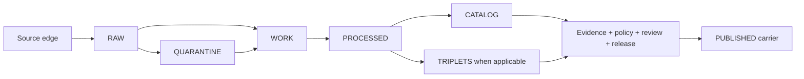

<!-- [KFM_META_BLOCK_V2]
doc_id: kfm://doc/NEEDS-VERIFICATION/skeleton-map
title: KFM Skeleton Map — Repository Topology and Responsibility Routing
type: architecture-orientation
version: v3.0-draft
status: repository-grounded; same-path; non-authoritative; source-maintained
owners:
  - "@bartytime4life — verified CODEOWNERS review route"
  - "NEEDS VERIFICATION — architecture and documentation stewardship"
created: 2026-05-14
updated: 2026-08-19
policy_label: public
current_path: docs/architecture/SKELETON_MAP.md
owning_root: docs/
responsibility: Human-readable map of the current top-level repository skeleton, adopted root classes, lifecycle lanes, authority boundaries, contributor routing, drift, and validation obligations.
truth_posture: >-
  CONFIRMED commit-pinned repository paths, adopted ADR-0029, active root-registry
  projection, current data-lane inventory, and retirement of the temporary one-shot
  writer / PROPOSED explanatory groupings and future convergence work / UNKNOWN
  runtime, deployment, source activation, release, and production behavior unless
  separately proved / NEEDS VERIFICATION specialist stewardship, external consumers,
  and legacy document-identity migration.
evidence_snapshot:
  repository: bartytime4life/Kansas-Frontier-Matrix
  base_ref: main
  base_commit: 68603b748d859884f5e140467285b5ae71d093a9
  base_tree: 18c76628f94191af038f6ae6364fb3de70a0cf52
  architecture_tree: da989bb53837c5382d2a6e6a52eb48c750951a53
  target_prior_blob: 09440bbe7ac10e0e7b70eee10f4d50f9022f6c4f
  directory_rules_decision: ADR-0029 accepted
  root_registry_blob: 024f668b5f0a9239bafa4f8b09e2afd86300ff8c
  data_tree: aebfecc131ed65594118b579db5f823cf384f548
  workflows_tree: cbab018263da35cff2670220da3a7903b0e62aaa
  codeowners_blob: dd2a84aa514d8ecd9208bc347f90f9a2ed37dd61
prepared_under_prompt: KFM Repository Build-Out & Markdown Modernization Implementation Agent v6.0.0
related:
  - README.md
  - SYSTEM_MAP.md
  - document-convergence-plan.md
  - ../doctrine/directory-rules.md
  - ../doctrine/lifecycle-law.md
  - ../doctrine/trust-membrane.md
  - ../doctrine/authority-ladder.md
  - ../doctrine/truth-posture.md
  - ../adr/ADR-0029-adopt-directory-governance-standard-v2.md
  - ../adr/INDEX.md
  - ../registers/DRIFT_REGISTER.md
  - ../registers/VERIFICATION_BACKLOG.md
  - ../../control_plane/root_registry.yaml
  - ../../tools/validators/directory_governance/README.md
tags:
  - kfm
  - architecture
  - repository-topology
  - skeleton-map
  - directory-governance
  - lifecycle
  - trust-membrane
  - contributor-routing
notes:
  - "The legacy placeholder document ID is preserved because current repository search found no accepted identity migration; a cleaner successor ID remains NEEDS VERIFICATION."
  - "The temporary one-shot reconstruction workflow used by PRs #2999 and #3001 is absent from current main and recorded as retired; this document is not generated by an active current-main writer."
  - "This update changes explanatory documentation only. It creates no root, contract, schema, policy, source, registry, release, proof, runtime, deployment, or publication authority."
[/KFM_META_BLOCK_V2] -->

<a id="top"></a>

# KFM Skeleton Map

> **Purpose.** Give contributors a compact, repository-grounded map of the Kansas Frontier Matrix responsibility roots, lifecycle lanes, trust boundaries, drift surfaces, and verification routes without turning a directory listing into architecture, policy, release, or publication authority.

[](#status-and-evidence-boundary)
[](#status-and-evidence-boundary)
[](../adr/ADR-0029-adopt-directory-governance-standard-v2.md)
[](#status-and-evidence-boundary)

> [!IMPORTANT]
> **This map is explanatory.** Accepted doctrine and ADRs decide operating law and placement. `contracts/` owns meaning, `schemas/` owns machine shape, `policy/` owns admissibility, implementation and tests own behavior, `data/` owns lifecycle and accountability instances, and `release/` owns release and correction decisions. A path, diagram, test, receipt, pull request, merge, or badge does not by itself prove truth, safety, review, release, deployment, or KFM publication.

**Quick navigation:** [Status](#status-and-evidence-boundary) · [Role](#1-role-and-non-goals) · [Evidence](#2-evidence-method-and-limits) · [Reading order](#3-reading-order-and-document-boundaries) · [Physical root](#4-current-physical-root) · [Root classes](#5-adopted-root-classes) · [Routing](#6-route-by-responsibility) · [Lifecycle](#7-lifecycle-and-accountability-skeleton) · [Trust membrane](#8-governed-public-path) · [Domains](#9-domains-are-lanes) · [Change closure](#10-cross-root-change-closure) · [Drift](#11-current-drift-and-holds) · [Validation](#12-validation-and-proof-limits) · [Maintenance](#13-maintenance-correction-and-rollback) · [Open verification](#14-open-verification) · [Related](#15-related-documents)

---

<a id="status--ownership"></a>

## Status and evidence boundary

| Field | Current bounded result |
|---|---|
| Document role | Human-readable **physical repository topology and responsibility-routing companion** |
| Repository location | **CONFIRMED:** `docs/architecture/SKELETON_MAP.md` |
| Owning responsibility root | **CONFIRMED:** `docs/` — human explanation |
| Evidence base | **CONFIRMED:** `main@68603b748d859884f5e140467285b5ae71d093a9` |
| Placement authority | **CONFIRMED:** ADR-0029 accepts the exact Directory Rules v2 bytes |
| Machine projection | **CONFIRMED present:** `control_plane/root_registry.yaml`; projection only, not independent authority |
| Review route | **CONFIRMED:** `@bartytime4life` through `.github/CODEOWNERS`; routing is not approval |
| Document identity | Legacy placeholder `kfm://doc/NEEDS-VERIFICATION/skeleton-map` preserved; migration remains **NEEDS VERIFICATION** |
| Writer state | No active current-main workflow targets this file; the temporary reconstruction writer is recorded as retired |
| Runtime and deployment | **UNKNOWN** unless separate code, test, workflow, artifact, log, deployment, or public-probe evidence proves a claim |
| Release or publication effect | None |
| Scope of this revision | Same-path architecture-document modernization; no structural migration |

### Truth split

- **CONFIRMED** — exact repository bytes, paths, tree identities, accepted ADR-0029, or bounded executable evidence inspected at the pinned base.
- **PROPOSED** — explanatory grouping, target-state integration, or future convergence work not yet implemented or accepted.
- **UNKNOWN** — implementation, runtime, deployment, public availability, source activation, or operational release not established by the evidence.
- **NEEDS VERIFICATION** — a concrete ownership, identity, consumer, CI, runtime, or release check remains before relying on the claim.
- **HOLD** — a change is deliberately blocked until its required evidence and authority close.

[Back to top](#top)

---

<a id="what-this-map-is"></a>

## 1. Role and non-goals

This file answers six practical questions:

1. Which top-level responsibility root owns an artifact?
2. Which lifecycle or accountability lane owns an instance?
3. Which authority must be consulted before a path or behavior changes?
4. Which roots are canonical, platform, compatibility, deprecated, conditional, or absent?
5. Which internal state may cross the public trust membrane?
6. Which validation and rollback evidence is required for a coherent change?

It complements, rather than competes with, [`SYSTEM_MAP.md`](./SYSTEM_MAP.md):

| Document | Primary responsibility | What it should not become |
|---|---|---|
| `SYSTEM_MAP.md` | Conceptual whole-system flow: trust spine, lifecycle, evidence, release, governed delivery, correction | A recursive repository inventory or path registry |
| `SKELETON_MAP.md` | Commit-pinned physical top-level map, adopted root classes, contributor routing, lifecycle lanes, and current drift | Doctrine, machine authority, implementation proof, or a second root registry |
| `docs/architecture/README.md` | Architecture-lane entry point, folder contract, navigation, and convergence status | Whole-system implementation proof |
| `control_plane/root_registry.yaml` | Machine-readable projection of adopted root classes and current classified roots | Human doctrine, source activation, migration authority, or publication authority |

### Non-goals

This map does not:

- create, activate, rename, move, mirror, retire, or delete a root;
- accept or amend an ADR;
- define object semantics, schema fields, policy rules, source roles, or release gates;
- promote a lifecycle object or authorize public exposure;
- claim that every present root or lane is complete, deployed, or clean;
- replace root READMEs, the drift register, validation logs, receipts, proofs, or release records;
- treat historical tree counts or old generated scaffolds as current evidence.

[Back to top](#top)

---

<a id="evidence-boundary"></a>

## 2. Evidence method and limits

### 2.1 Pinned evidence used

| Evidence | Pinned identity | What it supports |
|---|---|---|
| Default branch | `main@68603b748d859884f5e140467285b5ae71d093a9` | Immutable review base |
| Repository root tree | `18c76628f94191af038f6ae6364fb3de70a0cf52` | Exact direct root files and directories |
| Architecture tree | `da989bb53837c5382d2a6e6a52eb48c750951a53` | Current target, companions, and folder topology |
| Target prior blob | `09440bbe7ac10e0e7b70eee10f4d50f9022f6c4f` | Exact source replaced in place |
| Directory decision | ADR-0029, `accepted` | Placement and root-class authority |
| Root registry | `024f668b5f0a9239bafa4f8b09e2afd86300ff8c` | Current machine projection of 25 root profiles |
| Data tree | `aebfecc131ed65594118b579db5f823cf384f548` | Exact direct `data/` children |
| Workflow tree | `cbab018263da35cff2670220da3a7903b0e62aaa` | Current workflow inventory; no one-shot Skeleton writer |
| CODEOWNERS | `dd2a84aa514d8ecd9208bc347f90f9a2ed37dd61` | Executable GitHub review routing only |

### 2.2 Writer-lineage closure

The historical `agent/update-skeleton-map` branch and PRs #2999 and #3001 used a temporary, hash-pinned reconstruction wrapper. Current `main` does not contain `.github/workflows/one-shot-skeleton-map-refresh.yml`. The generated workflow-security debt-repair receipt records that the temporary mutator and payload chunks were removed and that no active pull request uses that writer.

**Bounded conclusion:** this file is not writer-bound on current `main`. The old branch remains historical remote state and is not authority over the current path.

### 2.3 Evidence not inspected

This revision did not prove:

- external or cached consumers of this document or its legacy `doc_id`;
- deployed services, production logs, dashboards, or public probes;
- current source admission, rights, sensitivity, or licensing decisions;
- operational release, correction propagation, cache invalidation, or rollback;
- complete recursive conformance of every path below every root;
- independent architecture, documentation, policy, security, or release stewardship.

### 2.4 Historical lineage

The earlier Skeleton Map and its generated scaffold counts remain recoverable through Git history. They are lineage, not current topology. Current claims in this document are tied to the pinned base and must be refreshed when the root tree, accepted Directory Rules, or root registry changes.

[Back to top](#top)

---

<a id="placement-basis"></a>
<a id="the-seven-planes"></a>

## 3. Reading order and document boundaries

Use the narrowest authority that owns the question:

1. [`authority-ladder.md`](../doctrine/authority-ladder.md) and [`truth-posture.md`](../doctrine/truth-posture.md) for claim authority.
2. Accepted ADRs and [`directory-rules.md`](../doctrine/directory-rules.md) for decisions and placement.
3. This page and [`SYSTEM_MAP.md`](./SYSTEM_MAP.md) for orientation.
4. Root READMEs for local responsibility, exposure, mutation, and validation boundaries.
5. `contracts/`, `schemas/`, and `policy/` for meaning, shape, and admissibility.
6. Code, configuration, fixtures, tests, workflows, and emitted artifacts for current behavior.
7. `release/`, correction records, and rollback evidence for release-state claims.
8. Runtime logs, deployment evidence, and public probes for operational claims.

```text
DOCTRINE / ACCEPTED DECISIONS
        |
        v
HUMAN ORIENTATION + MACHINE GOVERNANCE PROJECTIONS
        |
        v
MEANING + SHAPE + ADMISSIBILITY
        |
        v
LIFECYCLE / ACCOUNTABILITY + IMPLEMENTATION
        |
        v
RELEASE / CORRECTION / ROLLBACK
        |
        v
GOVERNED RUNTIME AND PUBLIC-SAFE DELIVERY
```

A lower layer can implement or evidence a higher-layer rule. It cannot silently replace the authority that owns the rule.

[Back to top](#top)

---

<a id="one-screen-skeleton"></a>
<a id="responsibility-roots"></a>

## 4. Current physical root

At the pinned base, the repository has **24 direct directories** and **17 tracked root files**.

### 4.1 Direct directory tree

```text
Kansas-Frontier-Matrix/
├── .github/               # platform integration and repository automation
├── apps/                  # deployable applications
├── artifacts/             # compatibility output transition; no trust authority
├── catalog/               # deprecated containment; frozen to new canonical writes
├── configs/               # non-secret configuration profiles and defaults
├── connectors/            # source-specific acquisition and admission edges
├── contracts/             # semantic meaning and interface promises
├── control_plane/         # machine projections of adopted governance
├── data/                  # lifecycle, accountability, registry, catalog, and carrier instances
├── docs/                  # human doctrine, decisions, architecture, and guidance
├── examples/              # runnable public-safe demonstrations
├── fixtures/              # reusable synthetic, valid, invalid, and golden inputs
├── infra/                 # deployment, exposure, hardening, and provisioning implementation
├── migrations/            # versioned migrations and rollback definitions
├── packages/              # reusable non-deployable implementation
├── pipeline_specs/        # declarative run graphs and resource envelopes
├── pipelines/             # executable lifecycle transformations
├── policy/                # normative allow, deny, hold, restrict, and abstain rules
├── release/               # release, correction, withdrawal, rollback, and signature decisions
├── runtime/               # bounded runtime composition and provider adapters
├── schemas/               # machine-checkable shapes and contexts
├── scripts/               # thin non-authoritative wrappers
├── tests/                 # executable conformance and boundary evidence
└── tools/                 # repository-wide validators, generators, inspectors, and operators
```

### 4.2 Root files

| Group | Current files |
|---|---|
| Repository identity and governance | `README.md`, `CONTRIBUTING.md`, `SECURITY.md`, `CODE_OF_CONDUCT.md`, `AUTHORS.md`, `CHANGELOG.md`, `CITATION.cff`, `LICENSE` |
| Build and package coordination | `Makefile`, `pyproject.toml`, `package.json`, `pnpm-lock.yaml`, `pnpm-workspace.yaml` |
| Repository configuration | `.editorconfig`, `.env.example`, `.gitignore`, `.pre-commit-config.yaml` |

Root files coordinate the project. Domain documentation, data, schemas, policy modules, release records, and one-off operational code do not become root files merely because they are important.

### 4.3 What physical presence proves

A present path proves tracked bytes at the pinned tree. It does **not** prove:

- canonicality beyond the applicable accepted classification;
- complete or production-ready implementation;
- correct ownership, rights, sensitivity, or review;
- a passing workflow;
- a release, deployment, public service, or published claim.

[Back to top](#top)

---

<a id="compatibility-roots"></a>

## 5. Adopted root classes

ADR-0029 adopts Directory Rules v2. The active root registry projects **25 root profiles**: 24 are physically present and one conditional profile, `src/`, is absent.

| Class | Profiles | Physical state | Operating consequence |
|---|---|---|---|
| Platform | `.github/` | Present | Platform integration; cannot become KFM truth, semantic, policy, or release authority |
| Canonical | `apps/`, `configs/`, `connectors/`, `contracts/`, `control_plane/`, `data/`, `docs/`, `examples/`, `fixtures/`, `infra/`, `migrations/`, `packages/`, `pipeline_specs/`, `pipelines/`, `policy/`, `release/`, `runtime/`, `schemas/`, `scripts/`, `tests/`, `tools/` | All 21 present | New governed work routes by the one responsibility each root owns |
| Compatibility | `artifacts/` | Present | Generated build, documentation, QA, and temporary output transition only; no trust-bearing payload authority |
| Deprecated | `catalog/` | Present | Frozen containment pending verified producer and consumer convergence to `data/catalog/` |
| Conditional | `src/` | Absent | Do not create or activate without the accepted condition or successor decision |

> [!CAUTION]
> The machine registry is a projection of adopted governance. It cannot create a root, authorize a compatibility write, migrate a path, activate `src/`, admit a source, approve policy, or publish.

### 5.1 Root admission rule

Before proposing a new root or reviving an absent/retired one, require:

1. one unique project-wide responsibility;
2. proof that no existing canonical root owns that responsibility;
3. an accepted decision when the responsibility model changes;
4. owner, review, exposure, mutability, and retention boundaries;
5. migration, compatibility, validation, and rollback treatment;
6. machine-projection updates only after human authority is established.

A topic name, implementation language, vendor, domain, or large file count is not sufficient root authority.

[Back to top](#top)

---

<a id="object-family-anchors"></a>

## 6. Route by responsibility

| Artifact or concern | Primary owner | Boundary |
|---|---|---|
| Human doctrine, ADRs, architecture, standards profiles, runbooks | `docs/` | Explains or records; does not execute or publish |
| Machine governance projection | `control_plane/` | Projects adopted governance; cannot self-authorize |
| Semantic object meaning and interface promises | `contracts/` | Meaning only; not machine shape or policy |
| JSON Schema, contexts, and generated type authority | `schemas/` | Shape only; not meaning or permission |
| Allow, deny, hold, restrict, redact, or abstain rules | `policy/` | Admissibility only; not data or release state |
| Deployable public/internal service boundary | `apps/` | Application behavior; not root truth |
| Reusable non-deployable implementation | `packages/` | Shared code with explicit boundary |
| Source-specific capture and admission implementation | `connectors/` | Source edge only; watchers do not publish |
| Declarative pipeline definition | `pipeline_specs/` | Run intent, inputs, outputs, resources |
| Executable transformation and orchestration | `pipelines/` | Lifecycle movement under governed controls |
| Non-secret configuration | `configs/` | Defaults and profiles; no credentials |
| Runtime composition or provider adapter | `runtime/` | Bounded execution; not public authority |
| Deployment, network, exposure, and hardening implementation | `infra/` | Operational infrastructure; no secrets |
| Repository validator, generator, builder, inspector, operator | `tools/` | Reusable repository tooling |
| Thin operator wrapper | `scripts/` | Delegates to governed implementation |
| Reusable synthetic input or expected output | `fixtures/` | Deterministic test material; not production data |
| Executable proof of conformance or boundary behavior | `tests/` | Bounded test evidence; not release approval |
| Data, registry, catalog, receipt, proof-support, or carrier instance | `data/` | Instance and lifecycle responsibility |
| Release, correction, withdrawal, rollback, promotion, signature decision | `release/` | Append-only decision responsibility |
| Versioned forward/rollback change definition | `migrations/` | Reversible change mechanics |
| Runnable public-safe demonstration | `examples/` | Demonstration only; not canonical runtime |

When one requested behavior crosses several rows, the smallest coherent change closes every **directly required** dependency. It does not create duplicate authority in the most convenient folder.

[Back to top](#top)

---

<a id="lifecycle-invariant"></a>

## 7. Lifecycle and accountability skeleton

The lifecycle shorthand remains:

```text
RAW -> WORK / QUARANTINE -> PROCESSED -> CATALOG / TRIPLETS -> PUBLISHED
```

Promotion is a governed state transition, not a file move, commit, pull request, merge, workflow result, artifact upload, deployment, or GitHub release.


```mermaid
flowchart LR
  source["Source edge"] --> raw["RAW"]
  raw --> work["WORK"]
  raw --> quarantine["QUARANTINE"]
  quarantine --> work
  work --> processed["PROCESSED"]
  processed --> catalog["CATALOG"]
  processed --> triplets["TRIPLETS when applicable"]
  catalog --> gate["Evidence + policy + review + release"]
  triplets --> gate
  gate --> published["PUBLISHED carrier"]
```

### 7.1 Present canonical data lanes

| Lane | Responsibility | Public posture |
|---|---|---|
| `data/raw/` | Admitted source capture or immutable source reference | Internal |
| `data/work/` | Candidate transformation and review work | Internal |
| `data/quarantine/` | Fail-closed held material, reasons, and obligations | Restricted/internal |
| `data/processed/` | Validated internal domain products | Internal until separate release |
| `data/catalog/` | Discovery and provenance projections | Governed; not release authority |
| `data/triplets/` | Optional graph projections | Derived; not sovereign truth |
| `data/receipts/` | Auditable process memory | Internal unless explicitly released |
| `data/proofs/` | Proof-support and validation closure records | Internal unless explicitly released |
| `data/registry/` | Governed registry instances | Mixed exposure by contract and policy |
| `data/published/` | Release-approved public-safe carriers | Governed public path only |

`release/` remains separate from `data/published/`: one stores release and correction **decisions**; the other stores or points to approved carrier **instances**.

### 7.2 Current noncanonical direct data children

The current data tree also contains:

```text
data/document/
data/manifests/
data/maps/
data/prov/
data/reports/
data/rollback/
data/trade-routes/
data/triplet/
data/triplet(s)/
```

These paths are current repository evidence, not new-write authority. Current `data/README.md` classifies them as compatibility, migration, deprecation, or decision candidates that require per-object inventory, producer/consumer cutover, identity preservation, validation, and rollback before movement or retirement.

> [!WARNING]
> Do not “clean up” these lanes by bulk movement. Classify the object family first, then move through a reviewed migration with one canonical writer and proved consumers.

[Back to top](#top)

---

<a id="trust-membrane"></a>

## 8. Governed public path

Ordinary public clients use governed interfaces or released public-safe artifacts. They do not read RAW, WORK, QUARANTINE, candidate stores, canonical internal databases, internal proof stores, or model runtimes as their normal path.

```text
SourceDescriptor / source identity
        |
        v
EvidenceRef -> EvidenceBundle resolution
        |
        v
policy + sensitivity + review + validation
        |
        v
release decision + correction / rollback target
        |
        +-----------------------------+
        |                             |
        v                             v
governed API                     released static carrier
        |                             |
        +--------------+--------------+
                       v
Explorer / map / Evidence Drawer / Focus Mode / export
```

### 8.1 Dynamic crossing

A dynamic response must be bounded by the applicable semantic contract, machine schema, policy outcome, evidence resolution, review/release state, and public response envelope. Runtime outcomes belong to their governing contract; current public response vocabulary is `ANSWER`, `ABSTAIN`, `DENY`, and `ERROR`.

### 8.2 Static crossing

A static PMTiles, COG, GeoParquet, JSON, image, or other carrier requires the applicable manifest, digest/integrity binding, rights and sensitivity posture, release decision, correction state, and rollback or withdrawal route. Static hosting does not bypass the trust membrane.

### 8.3 AI and map boundary

Maps, tiles, graphs, indexes, scenes, dashboards, summaries, and AI answers are downstream carriers or interpretations. `EvidenceBundle` outranks generated language. A renderer or model may help a user inspect released evidence; it cannot establish source authority, policy permission, review, release, or truth.

[Back to top](#top)

---

<a id="domain-lane-rule"></a>
<a id="domain-coverage-intent"></a>
<a id="connector-source-families"></a>

## 9. Domains are lanes

A domain is normally a bounded lane inside responsibility roots, not a top-level folder.

```text
docs/domains/<domain>/                  human domain architecture and guidance
contracts/domains/<domain>/             semantic domain contracts
schemas/contracts/v1/<family>/          machine shape under the adopted schema route
policy/<domain-or-profile>/              admissibility rules
fixtures/domains/<domain>/               synthetic test inputs
tests/<owned-test-lane>/                  executable conformance
connectors/<source-family>/               source-specific admission implementation
pipelines/<owned-lane>/                   transformations
data/<lifecycle-or-accountability-lane>/  governed instances
release/<decision-family>/                release and correction decisions
```

The exact child path is **NEEDS VERIFICATION** against the root README, existing conventions, accepted ADRs, current consumers, and machine validators before creation. The pattern above is a responsibility crosswalk, not a license to create every listed path.

### 9.1 Cross-domain seams

A cross-domain join or relation does not erase domain ownership. It should identify:

- the owning domain for each object;
- the relation owner or seam contract;
- source-role and scale compatibility;
- temporal and spatial support;
- policy and sensitivity effects;
- evidence resolution;
- review and release obligations;
- correction and rollback propagation.

Derived layers, graph edges, search indexes, and stories do not replace canonical domain evidence.

### 9.2 Sensitive domains

Living-person, genomic, rare-species, archaeology, cultural/tribal, infrastructure, private-land, title, and harmful-precision material fails closed. Use quarantine, redaction, generalization, staged access, delay, abstention, or denial until qualified evidence and authority support a safer posture.

[Back to top](#top)

---

<a id="minimal-review-flow"></a>

## 10. Cross-root change closure

Use this matrix to identify the directly affected closure set.

| Requested change | Typical direct dependencies | Minimum evidence |
|---|---|---|
| Add or change an object field | Contract, schema, fixture polarity, validator/test, compatibility note, docs | Meaning/shape parity and negative tests |
| Change admissibility or exposure | Policy, fixtures/tests, API/static delivery behavior, docs, review evidence | Fail-closed allow/deny/abstain cases |
| Add a source | Source documentation/descriptor, connector, registry instance, rights/sensitivity review, fixtures, tests, receipts | No-network fixture proof before activation |
| Change a transformation | Pipeline spec, executable pipeline/package, fixtures/tests, receipt binding, rollback | Deterministic replay and negative cases |
| Add a public API capability | Contract, schema, policy, evidence resolution, app implementation, tests, release binding, docs | No internal-store bypass and all finite outcomes |
| Add a map or export carrier | Layer/artifact manifest, evidence/release binding, sensitivity transform, integrity test, correction behavior | Released public-safe artifact proof |
| Change a release object | Release contract/schema/policy, candidate fixtures, validators, proof/catalog closure, correction/rollback | Fail-closed dry run and reversible transition |
| Move or rename a path | Directory authority, identity, inbound links/fragments, writers, consumers, migration record, validation, rollback | No-loss comparison and one canonical writer |

A documentation-only update may explain the closure set. It must not imply that the listed implementation or release work occurred.

[Back to top](#top)

---

<a id="workflow-inventory-intent"></a>

## 11. Current drift and holds

| Surface | Current state | Safe next posture |
|---|---|---|
| `artifacts/` | Compatibility root present | Keep generated/temporary only; deny trust-bearing authority |
| Root `catalog/` | Deprecated containment present | Freeze new canonical writes; inventory producers/consumers before convergence |
| `src/` | Conditional profile registered, physically absent | Do not recreate without accepted activation authority |
| Nine additional `data/` children | Present noncanonical/compatibility surface | Classify by object family before move, merge, or deletion |
| Repository topology baseline | 138 exact inherited finding groups recorded by the validator documentation | New or changed drift fails; baseline may shrink only with reviewed closure |
| `TRUST_MEMBRANE.md` / `trust-membrane.md` | Case-insensitive collision with distinct identities and consumers | Structural migration remains explicit **HOLD** |
| `SYSTEM_MAP.md` / `SKELETON_MAP.md` | Two orientation documents | Roles are now narrowed: conceptual system flow versus physical topology; future consolidation requires consumer and identity review |
| Skeleton document ID | Legacy placeholder retained | **HOLD** identity migration until registry and external-consumer treatment is decided |
| Specialist ownership | Only `@bartytime4life` is a verified GitHub review route | Assign and verify specialist stewardship separately |
| Runtime, deployment, operational release | Not established by this map | Require implementation, hosted checks, artifacts/logs, and public probes |
| Root README physical map | Older text still represents conditional `src/` as physically present | Treat current Git tree as source of truth; repair the README in a bounded follow-up |

### 11.1 Topology validator posture

The directory-governance validator is a deterministic, no-network ratchet. Its baseline records inherited debt; it is not a conformance certificate. New findings, changed fingerprints, invariant violations, invalid baseline mutation, and stale entries fail according to the validator's finite outcomes.

Do not regenerate, expand, or weaken the baseline to make an unrelated change green. Classify a failure as introduced, inherited, stale-baseline, or tool/external before remediation.

[Back to top](#top)

---

<a id="verification-checklist"></a>

## 12. Validation and proof limits

### 12.1 Focused commands

Run from the repository root:

```bash
git diff --check

python tools/validators/docs/link-check/check_links.py \
  --repo-root . \
  --format text \
  docs/architecture/SKELETON_MAP.md

python tools/validators/directory_governance/validate_root_registry.py --fixtures
python tools/validators/directory_governance/validate_root_registry.py
python tools/validators/directory_governance/validate_repository_topology.py --format text

python -m unittest discover \
  --start-directory tests/validators/directory_governance \
  --pattern 'test_validate_*topology.py' \
  --verbose
```

Use repository-native aggregate documentation and validator workflows in addition to these focused checks when the branch is pushed.

### 12.2 What a passing result proves

| Check | Bounded proof | Does not prove |
|---|---|---|
| `git diff --check` | Patch whitespace integrity | Markdown semantics or links |
| Local link check | Supplied repository-local targets and fragments resolve under the bounded parser | External availability, citation validity, or authority |
| Root-registry validator | Projection shape, binding, ordering, and classified-root invariants | Human adoption beyond ADR-0029 or runtime behavior |
| Topology ratchet | No unwaived new topology drift under its implemented rules | Complete architecture conformance |
| Focused unit tests | Tested validator behavior | Whole-system correctness |
| Hosted CI | Exact workflow scope passed for a commit | Release, deployment, public safety, or publication |

### 12.3 Review checklist

- [ ] Base commit and prior target blob are pinned.
- [ ] Exactly the intended paths changed.
- [ ] One H1, valid metadata, unique explicit anchors, balanced fences, and final newline are present.
- [ ] Repository-relative links resolve at the branch head.
- [ ] Current-root counts and classifications match the exact tree and root registry.
- [ ] No absent conditional root is presented as physically present.
- [ ] Lifecycle, receipt, proof, catalog, and release responsibilities remain distinct.
- [ ] Public clients do not gain a direct internal-store path.
- [ ] Unknown rights, sensitivity, or harmful precision remains fail-closed.
- [ ] Introduced failures are repaired without weakening a validator or baseline.
- [ ] Human review remains pending until an authorized reviewer acts.
- [ ] Rollback restores the prior document bytes without data or runtime effects.

[Back to top](#top)

---

<a id="rollback"></a>

## 13. Maintenance, correction, and rollback

### 13.1 Refresh triggers

Recheck this map when any of the following changes:

- an accepted ADR amends Directory Rules or root classes;
- a top-level directory is created, activated, deprecated, retired, or removed;
- `control_plane/root_registry.yaml` changes;
- a lifecycle/accountability lane is introduced or converged;
- the topology baseline changes materially;
- the governed public path or release/correction boundary changes;
- `SYSTEM_MAP.md` or the architecture-lane contract changes this document's role;
- an accepted document-identity or generator decision is recorded.

### 13.2 Update method

1. Freeze current `main`, root tree, target blob, root registry, data tree, and applicable authority.
2. Compare the real tree with this map.
3. Update only evidence-backed rows and diagrams.
4. Keep current state separate from target state.
5. Repair connected navigation when it becomes false.
6. Run focused and aggregate documentation/topology validation.
7. Open a reviewable pull request; do not merge, release, deploy, or publish by implication.

### 13.3 Correction

When a claim becomes stale, correct the document in place and preserve the evidence checkpoint. Do not overwrite a historical claim with an unlabelled present-tense statement.

### 13.4 Rollback

- **Before merge:** close the draft pull request and abandon the feature branch.
- **After merge:** revert the focused documentation commit or restore prior blob `09440bbe7ac10e0e7b70eee10f4d50f9022f6c4f` through a reviewable pull request.
- No data migration, source deactivation, cache invalidation, release rollback, deployment rollback, or public withdrawal is required for this documentation-only change.

[Back to top](#top)

---

<a id="open-questions"></a>

## 14. Open verification

| ID | Question | Current status | Closure evidence |
|---|---|---|---|
| SKEL-01 | Should the legacy placeholder `doc_id` be replaced by `kfm://doc/architecture/skeleton-map` or another accepted identity? | **HOLD** | Document-registry decision, consumer inventory, alias/supersession treatment |
| SKEL-02 | Which verified people or teams own architecture, documentation, topology, and release review beyond the current CODEOWNERS route? | **NEEDS VERIFICATION** | Accepted assignments and executable review routing |
| SKEL-03 | Should this document remain source-maintained, become generated from root/data registries, or become a compatibility summary of `SYSTEM_MAP.md`? | **PROPOSED decision** | Writer contract, canonical source, generated markers, receipt and rollback design |
| SKEL-04 | Which of the nine noncanonical direct `data/` children have active producers and consumers? | **UNKNOWN** | Recursive inventory and migration packets |
| SKEL-05 | When can the deprecated root `catalog/` be retired? | **HOLD** | Zero-writer, zero-consumer, identity/link closure, migration and rollback evidence |
| SKEL-06 | What current runtime, deployment, release, and public surfaces are operational? | **UNKNOWN** | Exact-head workflows, manifests, logs, deployment evidence, and public probes |
| SKEL-07 | Which external consumers depend on current headings, fragments, or the legacy document identity? | **UNKNOWN** | External-consumer inventory or explicit compatibility decision |
| SKEL-08 | When should inherited topology baseline groups be eliminated or reclassified? | **NEEDS VERIFICATION** | Dependency-ordered reviewed convergence changes |

[Back to top](#top)

---

<a id="related-docs"></a>

## 15. Related documents

### Governing authority

- [Directory Rules](../doctrine/directory-rules.md)
- [ADR-0029 — Adopt Directory Governance Standard v2](../adr/ADR-0029-adopt-directory-governance-standard-v2.md)
- [ADR index](../adr/INDEX.md)
- [Authority Ladder](../doctrine/authority-ladder.md)
- [Truth Posture](../doctrine/truth-posture.md)
- [Lifecycle Law](../doctrine/lifecycle-law.md)
- [Trust Membrane doctrine](../doctrine/trust-membrane.md)

### Architecture orientation and convergence

- [Architecture folder README](./README.md)
- [System Map](./SYSTEM_MAP.md)
- [Contract / Schema / Policy Split](./contract-schema-policy-split.md)
- [Domain Placement Law](./domain-placement-law.md)
- [Architecture Documentation Convergence Plan](./document-convergence-plan.md)

### Machine projections and validation

- [Root Registry](../../control_plane/root_registry.yaml)
- [Directory Governance Validators](../../tools/validators/directory_governance/README.md)
- [Local Markdown Link Check](../../tools/validators/docs/link-check/README.md)
- [Data root README](../../data/README.md)
- [Repository root README](../../README.md)
- [Drift Register](../registers/DRIFT_REGISTER.md)
- [Verification Backlog](../registers/VERIFICATION_BACKLOG.md)

### Temporary writer retirement evidence

- [Generated workflow-security debt-repair receipt](../../data/receipts/generated/genrec-workflow-security-debt-repair-20260819.json)
- [Temporary reconstruction PR #2999](https://github.com/bartytime4life/Kansas-Frontier-Matrix/pull/2999)
- [Temporary reconstruction PR #3001](https://github.com/bartytime4life/Kansas-Frontier-Matrix/pull/3001)

[Back to top](#top)
