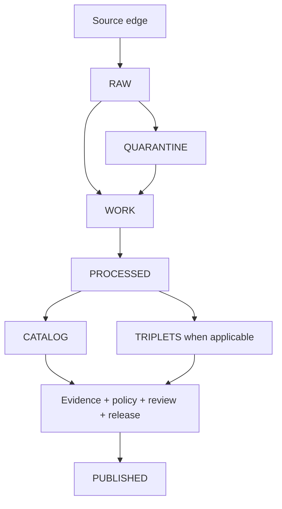
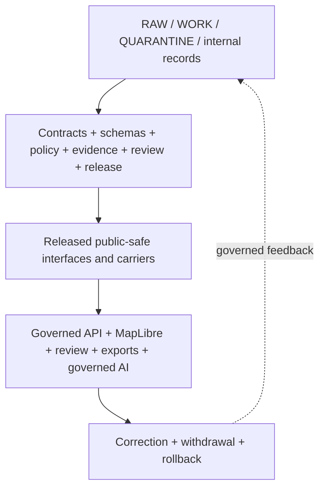
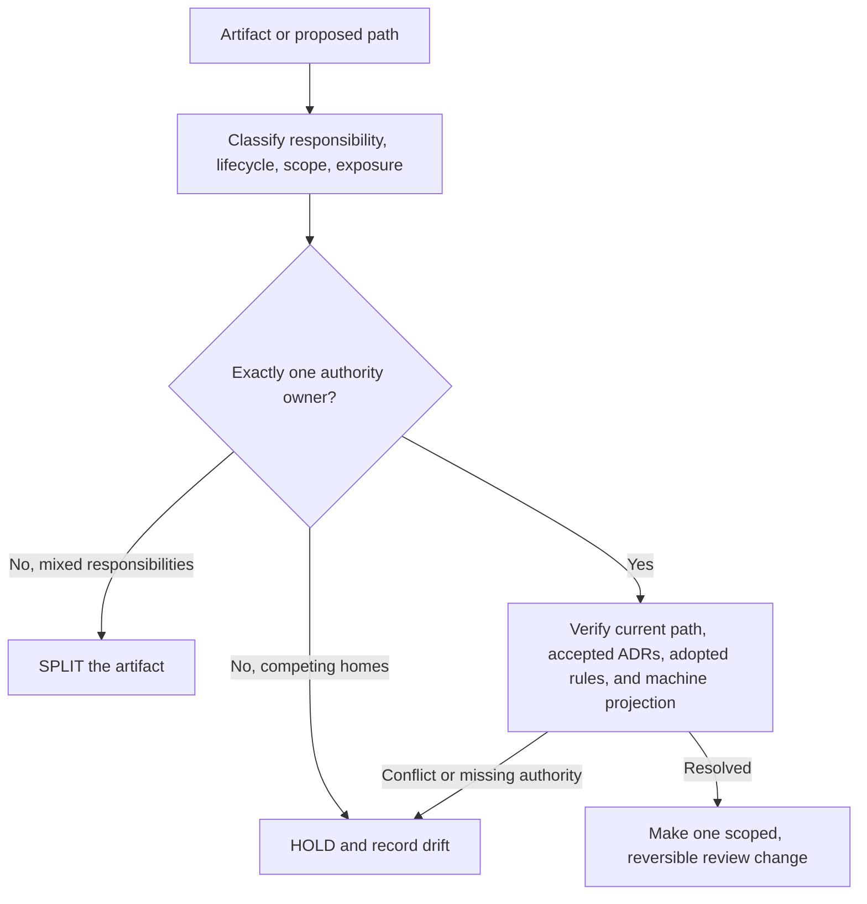

<!-- [KFM_META_BLOCK_V2]
doc_id: kfm://doc/NEEDS-VERIFICATION/skeleton-map
title: Kansas Frontier Matrix — Skeleton Map
type: architecture-orientation
version: v3.0.0
status: repository-grounded draft
owners:
  - "@bartytime4life"
created: 2026-05-14
updated: 2026-08-17
policy_label: public
current_path: docs/architecture/SKELETON_MAP.md
owning_root: docs/
responsibility: Human-facing orientation to KFM responsibility roots, lifecycle, trust boundaries, and governing surfaces.
truth_posture: cite-or-abstain; current-state claims are pinned to repository evidence
related:
  - docs/architecture/README.md
  - docs/doctrine/directory-rules.md
  - docs/architecture/directory-rules.md
  - docs/adr/ADR-0029-adopt-directory-governance-standard-v2.md
  - docs/adr/INDEX.md
  - docs/doctrine/lifecycle-law.md
  - docs/doctrine/trust-membrane.md
  - docs/doctrine/truth-posture.md
  - docs/doctrine/authority-ladder.md
  - docs/architecture/contract-schema-policy-split.md
  - docs/adr/ADR-0001-schema-home--schemas-contracts-v1-is-canonical.md
  - control_plane/root_registry.yaml
  - tools/validators/directory_governance/validate_repository_topology.py
  - tools/validators/directory_governance/repository_topology_baseline.json
  - docs/registers/DRIFT_REGISTER.md
  - docs/registers/VERIFICATION_BACKLOG.md
evidence_snapshot:
  repository: bartytime4life/Kansas-Frontier-Matrix
  branch: main
  commit: 70d2f1da3a480e14a19573ebec55258fc64e5f8e
  tree: bf96fd5d47e0089a2bd17ba5599d07fbe7c82624
  target_prior_blob: 09440bbe7ac10e0e7b70eee10f4d50f9022f6c4f
  directory_rules_blob: fd49a0b83e55cef52c1124281f093e263526898d
  adr_0029_blob: a4de0d7a96b78da59cfc499d1025e1508afd8dd9
  root_registry_blob: 024f668b5f0a9239bafa4f8b09e2afd86300ff8c
  root_readme_blob: 5ff6d65858cae6db5e69ba2c11ae0c602d93e20f
  codeowners_blob: dd2a84aa514d8ecd9208bc347f90f9a2ed37dd61
notes:
  - Explanatory architecture orientation; not placement, evidence, policy, review, release, or publication authority.
  - ADR-0029 is accepted and adopts the exact Directory Rules v2 bytes even though the pinned doctrine body retains its historical PROPOSED_FOR_ADOPTION label.
  - The legacy docs/architecture/directory-rules.md body remains a read-only compatibility dependency pending the separately governed tombstone and consumer-closure sequence.
  - Repository presence proves bytes at the pinned commit, not implementation maturity, runtime behavior, public safety, release, deployment, or publication.
[/KFM_META_BLOCK_V2] -->

<a id="top"></a>

# Kansas Frontier Matrix — Skeleton Map

[](#status--ownership)
[](#evidence-boundary)
[](../adr/ADR-0029-adopt-directory-governance-standard-v2.md)
[](../../control_plane/root_registry.yaml)
[](#status--ownership)

**Purpose:** orient contributors to KFM's current responsibility roots, governed lifecycle, trust membrane, domain lanes, compatibility boundaries, and authority surfaces without turning a directory listing into architecture, evidence, policy, release, or publication authority.

> [!IMPORTANT]
> **This map is explanatory, not governing.** [ADR-0029](../adr/ADR-0029-adopt-directory-governance-standard-v2.md) is accepted and adopts the exact bytes at [`docs/doctrine/directory-rules.md`](../doctrine/directory-rules.md). The doctrine file still contains its historical `PROPOSED_FOR_ADOPTION` label because ADR-0029 pins those bytes; that embedded label does **not** describe the current decision state. The accepted ADR, not a documentation badge or this map, establishes adoption.

Repository presence proves that bytes exist at a pinned commit. It does not prove implementation completeness, runtime behavior, security, rights clearance, review, release, public safety, deployment, or KFM publication.

## Quick jumps

- [Status & ownership](#status--ownership)
- [What this map is](#what-this-map-is)
- [Evidence boundary](#evidence-boundary)
- [Placement basis](#placement-basis)
- [The seven planes](#the-seven-planes)
- [One-screen skeleton](#one-screen-skeleton)
- [Lifecycle invariant](#lifecycle-invariant)
- [Trust membrane](#trust-membrane)
- [Responsibility roots](#responsibility-roots)
- [Domain lane rule](#domain-lane-rule)
- [Domain coverage intent](#domain-coverage-intent)
- [Connector source families](#connector-source-families)
- [Workflow inventory intent](#workflow-inventory-intent)
- [Compatibility roots](#compatibility-roots)
- [Object-family anchors](#object-family-anchors)
- [Minimal review flow](#minimal-review-flow)
- [Verification checklist](#verification-checklist)
- [Rollback](#rollback)
- [Open questions](#open-questions)
- [Related docs](#related-docs)

---

<a id="status--ownership"></a>

## Status & ownership

| Field | Current state |
|---|---|
| Document role | Human-facing repository and architecture orientation |
| Repository location | **CONFIRMED:** `docs/architecture/SKELETON_MAP.md` |
| Document status | `repository-grounded draft` |
| Document identity | Preserved as `kfm://doc/NEEDS-VERIFICATION/skeleton-map` pending a verified allocation rule |
| Review route | **CONFIRMED:** `@bartytime4life` through the repository-wide [`CODEOWNERS`](../../.github/CODEOWNERS) rule; routing is not approval evidence |
| Placement authority | **CONFIRMED:** accepted ADR-0029 plus adopted Directory Rules v2 place cross-cutting human architecture explanations under `docs/architecture/` |
| Current-state evidence | Repository contents and selected governance, validator, and workflow surfaces at `main@70d2f1da3a480e14a19573ebec55258fc64e5f8e` |
| Runtime evidence | **UNKNOWN:** no deployment, dashboard, production-log, or hosted-service behavior was inspected for this change |
| Publication authority | None |
| Historical lineage | The deleted root `SKELETON_MAP.md` and earlier 2,442-file / 789-directory scaffold remain recoverable through Git history; neither is current authority |

[Back to top](#top)

---

## What this map is

This file answers six practical questions:

1. **Where should a reader begin?** Start with the responsibility that owns the artifact.
2. **Which lifecycle state is involved?** Distinguish source edge, RAW, WORK, QUARANTINE, PROCESSED, CATALOG, TRIPLETS, PUBLISHED, receipts, proofs, and release decisions.
3. **Where is the trust membrane?** Public clients consume governed interfaces and released public-safe carriers, not internal stores.
4. **What must stay separate?** Meaning, shape, policy, evidence, process memory, validation, catalog projections, release decisions, corrections, and rollback targets.
5. **Which roots are ordinary, transitional, or frozen?** Read the adopted root classes and the machine projection without treating the projection as self-authorizing.
6. **What does a path prove?** Only repository presence at a pinned ref unless stronger evidence supports a broader claim.

It is not a root registry, schema registry, source registry, policy bundle, release manifest, proof pack, workflow result, or progress dashboard. Machine projections of adopted governance live in [`control_plane/`](../../control_plane/); current behavior must be verified from implementation and observed evidence.

> [!TIP]
> Use this map to find the governing surface. Do not use it to bypass that surface.

[Back to top](#top)

---

## Evidence boundary

### Pinned repository evidence

The following statements are **CONFIRMED** at `main@70d2f1da3a480e14a19573ebec55258fc64e5f8e`:

- this file exists at its current path with prior blob `09440bbe7ac10e0e7b70eee10f4d50f9022f6c4f`;
- [`README.md`](../../README.md) is the repository identity and orientation entry point;
- [ADR-0029](../adr/ADR-0029-adopt-directory-governance-standard-v2.md) is `accepted` and adopts the exact Directory Rules v2 bytes;
- [`docs/doctrine/directory-rules.md`](../doctrine/directory-rules.md) is the sole writable human Directory Rules authority;
- [`docs/architecture/directory-rules.md`](directory-rules.md) exists as the restored read-only compatibility body pending a separately governed tombstone sequence;
- [`control_plane/root_registry.yaml`](../../control_plane/root_registry.yaml) is an active machine projection of adopted root classes and observed top-level roots;
- the root registry classifies 22 canonical or platform roots plus `artifacts/`, `catalog/`, and `src/` with bounded noncanonical postures;
- the principal lifecycle entry points `raw`, `work`, `quarantine`, `processed`, `catalog`, `triplets`, `receipts`, `proofs`, and `published` are tracked under [`data/`](../../data/);
- [`apps/governed-api/`](../../apps/governed-api/), [`apps/explorer-web/`](../../apps/explorer-web/), [`packages/evidence-resolver/`](../../packages/evidence-resolver/), and [`schemas/contracts/v1/`](../../schemas/contracts/v1/) have tracked entry points;
- the 13 human domain entry points listed in [Domain coverage intent](#domain-coverage-intent) exist under `docs/domains/`;
- the root-level `SKELETON_MAP.md` remains absent;
- no open pull request was returned for the repository immediately before this update; three skeleton-named branches were fully behind current `main` and contained no unmerged commits.

### Adopted authority and remaining conflicts

| Evidence | Current state | Consequence |
|---|---|---|
| [`docs/doctrine/directory-rules.md`](../doctrine/directory-rules.md) | Exact v2 bytes adopted by ADR-0029; embedded artifact label remains `PROPOSED_FOR_ADOPTION` | Treat the bytes as adopted doctrine through ADR-0029; do not rewrite the pinned source merely to change its historical label |
| [ADR-0029](../adr/ADR-0029-adopt-directory-governance-standard-v2.md) | `accepted`, record edition v1.3 | Controls Directory Rules adoption and the staged compatibility migration |
| [`docs/architecture/directory-rules.md`](directory-rules.md) | Full v1.3.1 compatibility body remains tracked | Preserve read-only compatibility until the ADR's tombstone, reference, consumer, and deletion gates close |
| [`control_plane/root_registry.yaml`](../../control_plane/root_registry.yaml) | `ACTIVE`, `machine_projection_only` | Use for machine-readable navigation and validation; it cannot create, migrate, retire, or authorize a root |
| [`docs/adr/INDEX.md`](../adr/INDEX.md) | 36 numbered ADRs: ADR-0029 accepted, 35 proposed | Indexing does not accept any other ADR |
| [ADR-0001](../adr/ADR-0001-schema-home--schemas-contracts-v1-is-canonical.md) | Dedicated ADR remains `proposed`; adopted Directory Rules already establish the default `schemas/contracts/v1/<family>/` route | Separate adopted placement from the still-proposed routing, migration, and enforcement decision package |
| [`truth-posture.md`](../doctrine/truth-posture.md) and [`trust-membrane.md`](../doctrine/trust-membrane.md) | Same Git blob and both identify themselves as Trust Membrane | Treat standalone truth-posture identity as **CONFLICTED / NEEDS VERIFICATION** |
| Repository topology baseline | Implementation-waiver ratchet only | It may bound inherited findings; it cannot waive Directory Rules or authorize new drift |

### What was not proved

No claim in this file should be read as proof that:

- every documented route, package, validator, or workflow behaves as intended;
- every current workflow or required check passed for this revision;
- the repository topology baseline is debt-free or coupled to every protected-branch requirement;
- rights, sensitivity, sovereignty, privacy, or geoprivacy gates closed;
- any artifact was reviewed, promoted, released, deployed, public-safe, or KFM `PUBLISHED`.

[Back to top](#top)

---

## No-loss preservation from the old map

| Existing element | Disposition | Result |
|---|---|---|
| Seven-plane orientation | **KEEP / CLARIFY** | Retained as an explanatory composition model |
| Lifecycle and trust-membrane diagrams | **KEEP / REPAIR** | Updated to current lane names and adopted authority posture |
| Responsibility-root map | **KEEP / REFRESH** | Reconciled with the active root-registry projection and current root README |
| Domain coverage matrix | **KEEP / BOUND** | Retained as a verified human-doc lane inventory, not domain implementation proof |
| Connector and workflow lists | **CLARIFY** | Connector list remains lineage; current validator/workflow files are separated from run results |
| Compatibility-root guidance | **KEEP / REPAIR** | `artifacts/`, `catalog/`, and `src/` now use adopted classes and machine-projection boundaries |
| Object-family separation | **KEEP** | Retained without treating paths, receipts, or generated text as authority |
| 2,442-file / 789-directory figures | **KEEP AS LINEAGE** | Preserved only as a historical scaffold claim |
| Placeholder owner and stale evidence date | **REPAIR** | Replaced with the verified CODEOWNERS route and current pinned evidence |
| “Directory Rules and ADR-0029 are proposed” | **REMOVE WITH EVIDENCE** | Replaced by accepted ADR-0029 and adopted-byte semantics |
| “Legacy architecture copy is absent” | **REMOVE WITH EVIDENCE** | Replaced by the current restored compatibility-body state |
| “Root README is conflicted” | **REMOVE WITH EVIDENCE** | Replaced by the current repository-grounded root entry point |

[Back to top](#top)

---

## Placement basis

`docs/architecture/SKELETON_MAP.md` is a cross-cutting human explanation. Its responsibility signature is:

| Axis | Value |
|---|---|
| Artifact kind | Human architecture orientation |
| Authority owner | Human explanation under `docs/` |
| Scope | Global and cross-domain |
| Lifecycle stage | Not applicable |
| Exposure | Public repository documentation |
| Mutability | Versioned replacement through review |
| Repository state | Path and parent folder **CONFIRMED** |
| Placement outcome | `PLACE` at the existing path; no move, alias, mirror, or new authority surface |

Adopted Directory Rules assign human-readable architecture explanations to `docs/architecture/`. This revision preserves the existing same path, changes no root or lane, and creates no parallel schema, contract, policy, registry, catalog, proof, release, or publication home.

[Back to top](#top)

---

## The seven planes

The planes explain how responsibilities compose; they do not create authority.

| Plane | Owns or explains | Primary surfaces |
|---|---|---|
| Doctrine and decisions | Invariants, human architecture explanations, and ADR history | [`docs/`](../../docs/) |
| Meaning and shape | Semantic contracts and machine-checkable schemas | [`contracts/`](../../contracts/), [`schemas/`](../../schemas/) |
| Admissibility | Allow, deny, hold, restrict, generalize, or abstain rules | [`policy/`](../../policy/) |
| Lifecycle and accountability | Data phases, registries, receipts, proofs, catalogs, triplets, and published carriers | [`data/`](../../data/) |
| Implementation | Apps, packages, connectors, pipelines, tools, and scripts | [`apps/`](../../apps/), [`packages/`](../../packages/), [`connectors/`](../../connectors/), [`pipelines/`](../../pipelines/), [`tools/`](../../tools/) |
| Release and correction | Promotion, release, withdrawal, correction, and rollback decisions | [`release/`](../../release/) |
| Runtime and exposure | Runtime composition, configuration, deployment, network, and hardening | [`runtime/`](../../runtime/), [`configs/`](../../configs/), [`infra/`](../../infra/) |

The planes are a reading aid. An object still has one primary authority owner even when several planes reference it.

[Back to top](#top)

---

## One-screen skeleton

The root entry points below are present at the pinned snapshot. Presence does not establish maturity.

```text
Kansas-Frontier-Matrix/
├── .github/               # platform automation and review routing
├── apps/                  # deployable applications
├── configs/               # non-secret profiles and templates
├── connectors/            # source acquisition and admission edges
├── contracts/             # semantic and interface meaning
├── control_plane/         # machine governance projections
├── data/                  # lifecycle, accountability, and delivery instances
├── docs/                  # human doctrine, decisions, architecture, and guidance
├── examples/              # public-safe demonstrations
├── fixtures/              # reusable deterministic test inputs
├── infra/                 # deployment and exposure configuration
├── migrations/            # forward and rollback migration definitions
├── packages/              # reusable implementation
├── pipeline_specs/        # declarative pipeline definitions
├── pipelines/             # executable lifecycle transformations
├── policy/                # normative decision rules
├── release/               # release, correction, withdrawal, and rollback decisions
├── runtime/               # bounded runtime composition and local adapters
├── schemas/               # machine-checkable shapes
├── scripts/               # thin operational wrappers
├── tests/                 # executable conformance evidence
├── tools/                 # repository-wide validators and operators
├── artifacts/             # compatibility / generated-output transition
├── catalog/               # deprecated, frozen legacy containment
└── src/                   # conditional distribution-facade candidate; HOLD
```

| Class | Roots | Current boundary |
|---|---|---|
| Platform | `.github/` | Required host integration without KFM truth, policy, or release authority |
| Canonical | `apps/`, `configs/`, `connectors/`, `contracts/`, `control_plane/`, `data/`, `docs/`, `examples/`, `fixtures/`, `infra/`, `migrations/`, `packages/`, `pipeline_specs/`, `pipelines/`, `policy/`, `release/`, `runtime/`, `schemas/`, `scripts/`, `tests/`, `tools/` | One responsibility owner per root under adopted Directory Rules |
| Compatibility | `artifacts/` | Generated-output transition only; no trust-bearing payloads or independent writes |
| Deprecated | `catalog/` | Frozen legacy containment targeting `data/catalog/`; no new writes |
| Conditional | `src/` | No independent domain or package authority; remain on HOLD pending an accepted distribution-facade decision |

> [!CAUTION]
> Do not create a root because a topic is large. A new canonical, conditional, or compatibility root is an authority change and requires the adopted decision sequence.

[Back to top](#top)

---

## Lifecycle invariant

```text
RAW -> WORK / QUARANTINE -> PROCESSED -> CATALOG / TRIPLETS -> PUBLISHED
```

Promotion is a governed state transition, not a file move, commit, pull request, merge, badge, workflow result, deployment, or GitHub release.


```mermaid
flowchart TD
  source["Source edge"] --> raw["RAW"]
  raw --> work["WORK"]
  raw --> quarantine["QUARANTINE"]
  quarantine --> work
  work --> processed["PROCESSED"]
  processed --> catalog["CATALOG"]
  processed --> triplets["TRIPLETS when applicable"]
  catalog --> gate["Evidence + policy + review + release"]
  triplets --> gate
  gate --> published["PUBLISHED"]
```

| Family | Confirmed entry point | Boundary |
|---|---|---|
| RAW | [`data/raw/`](../../data/raw/) | Admitted source-edge material; not public output |
| WORK | [`data/work/`](../../data/work/) | Candidate transformation state |
| QUARANTINE | [`data/quarantine/`](../../data/quarantine/) | Fail-closed held material with reasons and obligations |
| PROCESSED | [`data/processed/`](../../data/processed/) | Validated internal records; not automatically public |
| CATALOG | [`data/catalog/`](../../data/catalog/) | Discovery and provenance projections; not release authority |
| TRIPLETS | [`data/triplets/`](../../data/triplets/) | Optional graph projections; not canonical truth replacements |
| RECEIPTS | [`data/receipts/`](../../data/receipts/) | Process memory; not proofs or release decisions |
| PROOFS | [`data/proofs/`](../../data/proofs/) | Evidence and validation support; not publication by themselves |
| PUBLISHED carriers | [`data/published/`](../../data/published/) | Requires governed release closure appropriate to the artifact |
| Release decisions | [`release/`](../../release/) | Separate decision plane for promotion, correction, withdrawal, and rollback |

[Back to top](#top)

---

## Trust membrane

The trust membrane prevents raw, internal, unreviewed, sensitive, rights-uncertain, or model-generated state from becoming public truth.


```mermaid
flowchart TD
  internal["RAW / WORK / QUARANTINE / internal records"] --> gates["Contracts + schemas + policy + evidence + review + release"]
  gates --> released["Released public-safe interfaces and carriers"]
  released --> public["Governed API + MapLibre + review + exports + governed AI"]
  public --> correction["Correction + withdrawal + rollback"]
  correction -. governed feedback .-> internal
```

| Surface | May do | Must not become |
|---|---|---|
| [`apps/governed-api/`](../../apps/governed-api/) | Resolve governed, released evidence and return bounded outcomes | A bypass to RAW, WORK, QUARANTINE, restricted, or unreleased stores |
| [`apps/explorer-web/`](../../apps/explorer-web/) | Present released map and evidence interactions | Truth, policy, review, or publication authority |
| MapLibre and derived layers | Render governed carriers | Canonical evidence or a release decision |
| [`packages/evidence-resolver/`](../../packages/evidence-resolver/) | Provide repository-local EvidenceRef-to-EvidenceBundle implementation surfaces | Proof that every runtime path resolves evidence correctly |
| Governed AI / Focus Mode | Interpret admitted evidence with citations and finite outcomes | Source authority or uncited fluent truth |
| Watchers and connectors | Detect or admit candidate work and emit bounded records | Publishers |

When evidence is absent or policy blocks exposure, the applicable contract controls the finite outcome. Do not collapse truth labels, validator outcomes, review states, and runtime response enums into one vocabulary.

[Back to top](#top)

---

## Responsibility roots

The active root registry is a machine projection of adopted Directory Rules, not independent authority.

| Root | Primary responsibility | Key boundary |
|---|---|---|
| [`.github/`](../../.github/) | Platform workflows, templates, and review routing | Workflow or CODEOWNERS presence is not review or release evidence |
| [`docs/`](../../docs/) | Human doctrine, decisions, architecture, runbooks, and registers | Explains; does not replace machine authority |
| [`control_plane/`](../../control_plane/) | Machine projections and indexes of governance | Cannot self-authorize a rule |
| [`contracts/`](../../contracts/) | Semantic meaning and interface promises | Meaning, not machine shape or policy |
| [`schemas/`](../../schemas/) | Machine-checkable shapes | Shape, not meaning or admissibility |
| [`policy/`](../../policy/) | Normative decision rules | Rules, not evidence or published data |
| [`tests/`](../../tests/) | Executable conformance evidence | Passing tests do not prove release or public safety |
| [`fixtures/`](../../fixtures/) | Reusable deterministic test inputs and expected outputs | Not production truth or sensitive payload storage |
| [`tools/`](../../tools/) | Repository-wide validators, generators, inspectors, and operators | Not deployable services |
| [`scripts/`](../../scripts/) | Thin wrappers and routine helpers | No unique long-lived trust logic |
| [`apps/`](../../apps/) | Deployable processes and user-facing boundaries | Reusable logic belongs in packages |
| [`packages/`](../../packages/) | Reusable non-deployable implementation | Not source intake or release approval |
| [`connectors/`](../../connectors/) | Source-specific capture and admission | No normalization, promotion, or publication authority |
| [`pipelines/`](../../pipelines/) | Executable transformations and lifecycle orchestration | Execution is not publication authority |
| [`pipeline_specs/`](../../pipeline_specs/) | Declarative run graphs and resource envelopes | No executable transformation logic |
| [`data/`](../../data/) | Governed instances, projections, accountability, and public carriers | No normative contract, schema, policy, or release approval |
| [`release/`](../../release/) | Promotion, release, correction, withdrawal, and rollback decisions | Distinct from carrier bytes and proofs |
| [`runtime/`](../../runtime/) | Bounded runtime composition and local adapters | No public ingress or canonical store |
| [`infra/`](../../infra/) | Deployment, network, host, access, and exposure configuration | No application business logic or committed secrets |
| [`configs/`](../../configs/) | Shared non-secret defaults and templates | No secrets or executable policy |
| [`migrations/`](../../migrations/) | Versioned forward and rollback migration definitions | No authority-changing decision by implementation alone |
| [`examples/`](../../examples/) | Runnable public-safe demonstrations | Not tests, fixtures, or canonical data |

[Back to top](#top)

---

## Domain lane rule

Domains are lane segments inside responsibility roots. They are not repository roots.

```text
<responsibility-root>/<scope-or-stage>/<domain>/...
```

The exact order is root-specific:

- human domain guidance uses `docs/domains/<domain>/`;
- contract-backed machine schemas default to `schemas/contracts/v1/domains/<domain>/` when that family structure is appropriate;
- data uses `data/<phase>/<domain>/`;
- executable pipelines follow the current stage and package conventions rather than assuming one universal domain-first pattern.

> [!WARNING]
> Do not create every possible lane mechanically. Add a lane only when an admitted artifact, bounded responsibility, validation plan, review burden, and rollback path exist.

[Back to top](#top)

---

## Domain coverage intent

These human domain entry points are **CONFIRMED** under `docs/domains/` at the pinned snapshot. Their presence does not prove complete contracts, schemas, policy, tests, pipelines, evidence, or release closure.

| Domain lane | Entry point | Boundary to keep visible |
|---|---|---|
| Hydrology | [`docs/domains/hydrology/`](../domains/hydrology/) | Temporal hydrology evidence and public-safe spatial scope |
| Soil | [`docs/domains/soil/`](../domains/soil/) | Observation, survey, modeled, and derived roles |
| Atmosphere | [`docs/domains/atmosphere/`](../domains/atmosphere/) | Freshness, advisories, uncertainty, and time windows |
| Geology | [`docs/domains/geology/`](../domains/geology/) | Bedrock, surficial, resource, and interpretation roles |
| Fauna | [`docs/domains/fauna/`](../domains/fauna/) | Rare-species geoprivacy and exact-location denial |
| Flora | [`docs/domains/flora/`](../domains/flora/) | Taxonomy, provenance, and sensitive-location controls |
| Habitat | [`docs/domains/habitat/`](../domains/habitat/) | Ecoregion, land-cover, habitat, and modeled-suitability roles |
| Archaeology | [`docs/domains/archaeology/`](../domains/archaeology/) | Cultural sensitivity, sovereignty, and harmful precision |
| Settlements and infrastructure | [`docs/domains/settlements-infrastructure/`](../domains/settlements-infrastructure/) | Critical-infrastructure and exact-location exposure |
| Hazards | [`docs/domains/hazards/`](../domains/hazards/) | Event time, severity, source role, and advisory boundaries |
| Roads, rail, and trade | [`docs/domains/roads-rail-trade/`](../domains/roads-rail-trade/) | Network, historic, operational, and generalized views |
| Agriculture | [`docs/domains/agriculture/`](../domains/agriculture/) | County-year, source, temporal, and rights boundaries |
| People, DNA, and land | [`docs/domains/people-dna-land/`](../domains/people-dna-land/) | Living-person, genomic, genealogy, title, and ownership restrictions |

[Back to top](#top)

---

## Cross-cutting planes

Cross-cutting concerns span roots but do not own them.

| Concern | Responsibility surfaces | Boundary |
|---|---|---|
| Governed AI | Architecture, runtime, policy, schemas, evidence resolver, governed API | EvidenceBundle outranks generated language |
| Map and UI | Explorer app, MapLibre packages, released layers, policy decisions | Renderer and tiles are downstream carriers |
| Evidence and provenance | Contracts, schemas, proofs, catalogs, resolver, validators | Evidence, receipts, proofs, and catalogs remain distinct |
| Registries | Human registers, machine control-plane projections, data registries | One concern does not create one shared authority file |
| Operations and observability | Runtime, infrastructure, runbooks, security, bounded telemetry | Do not log prompts, raw evidence, or restricted coordinates by default |
| Publication membrane | Policy, evidence, review, release decisions, published carriers | Commit and deployment state do not equal KFM publication |

[Back to top](#top)

---

## Connector source families

[`connectors/`](../../connectors/) is the source-specific capture and admission implementation root. A connector may capture admitted source material, preserve source identity, quarantine uncertainty, and emit receipts. It may not normalize itself into canonical truth, approve promotion, or publish.

The prior scaffold listed the source families below. They remain **LINEAGE**, not a current complete connector inventory or source-activation ledger.

<details>
<summary>Historical source-family set</summary>

```text
usgs · fema · noaa · nrcs · epa · blm · ahgp · khri · ksgs · kdwp ·
ksu_research_extension · kansas_state_archives · kansas_memory · loc ·
census · gbif · inaturalist · ebird · openstreetmap · newspapers ·
familysearch · ftDNA · local_upload · manual_curation
```

</details>

| Connector action | Posture |
|---|---|
| Capture admitted source material into RAW | Allowed only through the applicable source, rights, identity, and receipt contract |
| Quarantine malformed, ambiguous, restricted, or unsupported material | Required fail-closed option |
| Write directly to PROCESSED, CATALOG, TRIPLETS, or PUBLISHED | Denied |
| Decide policy, review, release, correction, or rollback | Denied |

[Back to top](#top)

---

## Workflow inventory intent

Workflow files coordinate bounded checks; they do not create truth, policy, review, release, or publication authority. The following files are **CONFIRMED present** at the pinned snapshot. No run conclusion is asserted here.

| Surface | Confirmed responsibility | Boundary |
|---|---|---|
| [`validator-suite.yml`](../../.github/workflows/validator-suite.yml) | Aggregate repository validators, workflow-security and topology ratchets, generated-receipt checks, and bounded fail-closed canaries | Read-only workflow output and logs; no proof, policy, release, or publication object |
| [`docs-control-plane.yml`](../../.github/workflows/docs-control-plane.yml) | Control-plane YAML parsing, register meta-contract checks, and ADR-index coherence | Does not make a register authoritative or accept an ADR |
| [`schema-validation.yml`](../../.github/workflows/schema-validation.yml) | Schema JSON, canonical v1 identity, fixture families, and schema/contract test coordination | Shape validity is not truth or release authority |
| [`validate_repository_topology.py`](../../tools/validators/directory_governance/validate_repository_topology.py) | Deterministic repository-topology findings against the adopted projection and reviewed baseline | A baseline entry is an implementation waiver, not a doctrine waiver |
| [`validate_adr_index.py`](../../tools/validators/validate_adr_index.py) | ADR inventory and effective-status coherence | Cannot accept an ADR |
| [`validate_generated_receipt.py`](../../tools/validators/validate_generated_receipt.py) | Generated-receipt shape, path, and supported SHA-256 integrity checks | Cannot authenticate review or authorize merge |

PR #2998 repaired the exact current topology transition before this snapshot and merged as the pinned base. That history does not make future topology findings acceptable; new drift must still fail the monotonic ratchet or receive a separately reviewed disposition.

[Back to top](#top)

---

## Reading order for a new contributor

1. Start at the current root [`README.md`](../../README.md).
2. Read [`CONTRIBUTING.md`](../../CONTRIBUTING.md) and the applicable path-scoped guidance.
3. Read adopted [Directory Rules v2](../doctrine/directory-rules.md) together with its acceptance record, [ADR-0029](../adr/ADR-0029-adopt-directory-governance-standard-v2.md).
4. Use the [`docs/architecture/` guide](README.md) and applicable doctrine to understand the cross-cutting system.
5. Check the canonical [ADR index](../adr/INDEX.md) and source ADR status before relying on a decision.
6. Follow an object from meaning (`contracts/`) to shape (`schemas/`), admissibility (`policy/`), fixtures, validators, and tests.
7. Trace instances through `pipelines/`, `data/`, proofs, catalogs, and `release/`.
8. Verify that public surfaces consume governed interfaces and released carriers.
9. Check correction, withdrawal, supersession, and rollback before calling work complete.

[Back to top](#top)

---

## Compatibility roots

Current repository presence and adopted classification are separate from migration completion.

| Root | Class | Canonical target or disposition | Safe current posture |
|---|---|---|---|
| [`artifacts/`](../../artifacts/) | Compatibility | External or CI-generated output storage | Keep build, docs, QA, and temporary output separate from receipts, proofs, release decisions, and published carriers |
| [`catalog/`](../../catalog/) | Deprecated | [`data/catalog/`](../../data/catalog/) | Freeze new writes; preserve until zero-producer, zero-consumer migration evidence closes |
| [`src/`](../../src/) | Conditional | [`packages/`](../../packages/) if the distribution-facade decision does not admit `src/` | Do not add independent package or domain authority while the activation condition remains unmet |

Potential legacy names such as `jsonschema/`, `policies/`, `ui/`, `web/`, `styles/`, and `viewer_templates/` must not be created as writable parallel authorities without an accepted decision and migration plan.

[Back to top](#top)

---

## Object-family anchors

The skeleton preserves object-family separation even when several families share a topic.

| Family | Governance question | Primary responsibility |
|---|---|---|
| `SourceDescriptor` | Which source, role, rights, cadence, and sensitivity limits apply? | Meaning and shape under contracts/schemas; instances in the source registry |
| `EvidenceRef` / `EvidenceBundle` | What admissible evidence supports the claim, and can the reference resolve? | Contracts/schemas, proofs, and evidence resolution |
| `PolicyDecision` / `DecisionEnvelope` | What decision was made under which policy and context? | Policy rules plus decision instances in the owning process |
| `RunReceipt` / `AIReceipt` / `GENERATED_RECEIPT` | What process ran, with what bounded inputs and outcome? | Receipt schemas and `data/receipts/` |
| `ValidationReport` / `CitationValidationReport` | What bounded validation or citation check ran? | Proof and validation surfaces |
| Catalog and triplet projections | How is admitted material discoverable or related? | `data/catalog/` and `data/triplets/` |
| `PromotionDecision` / `ReleaseManifest` | What was approved for release, under which evidence and rollback target? | `release/` |
| `CorrectionNotice` / `RollbackCard` | How is relied-on output corrected, withdrawn, or reversed? | `release/` |
| `LayerManifest` / `MapReleaseManifest` | Which released map carriers, evidence, policy, and versions compose the view? | Schema, published carrier, and release surfaces without collapsing them |

> [!WARNING]
> Receipts, proofs, catalogs, triplets, review records, release decisions, correction notices, rollback targets, maps, and generated language answer different questions. Do not merge them into one generic “artifact” authority.

[Back to top](#top)

---

## Tree inventory at a glance

The current root inventory is the pinned evidence in [One-screen skeleton](#one-screen-skeleton), not a recursive completeness claim.

The original greenfield scaffold described **2,442 files** and **789 directories**. Those figures are retained only as **LINEAGE**. The earlier large tree and deleted root-level orientation remain recoverable through Git history; copying either into a new tracked file would create a stale parallel surface.

[Back to top](#top)

---

## Anti-patterns: do not do this

| Anti-pattern | Why it breaks KFM | Safer handling |
|---|---|---|
| Domain at repository root | Fragments responsibility and lifecycle | Place the admitted artifact in a domain lane under its owning root |
| Two writable schema, policy, catalog, receipt, proof, or release homes | Creates parallel authority | Hold, classify, and resolve through accepted governance and migration |
| Public UI reads internal lifecycle stores | Bypasses the trust membrane | Use governed APIs and released public-safe carriers |
| Connector or watcher publishes | Collapses observation, intake, review, and release | Emit candidates and receipts only |
| `artifacts/` stores trust-bearing objects | Blurs temporary output with durable authority | Use the correct `data/` or `release/` family |
| AI output or map pixels become truth | Replaces evidence with presentation | Resolve evidence, apply policy, then answer, abstain, deny, hold, or error as the applicable contract defines |
| Exact sensitive geometry is public by default | Creates ecological, cultural, privacy, or security harm | Generalize, redact, quarantine, stage access, or deny |
| Documentation decides implementation or release | Turns prose into machine or decision authority | Cite the owning contract, schema, policy, ADR, review, or release object |
| Green workflow badge implies compliance | Elevates bounded CI into proof | State the workflow's exact scope and limits in text |
| Baseline entry becomes permanent permission | Converts inherited debt into authority | Ratchet findings down and require reviewed evidence for every change |

[Back to top](#top)

---

## Minimal review flow


```mermaid
flowchart TD
  artifact["Artifact or proposed path"] --> classify["Classify responsibility, lifecycle, scope, exposure"]
  classify --> owner{"Exactly one authority owner?"}
  owner -->|No, mixed responsibilities| split["SPLIT the artifact"]
  owner -->|No, competing homes| hold["HOLD and record drift"]
  owner -->|Yes| verify["Verify current path, accepted ADRs, adopted rules, and machine projection"]
  verify -->|Conflict or missing authority| hold
  verify -->|Resolved| change["Make one scoped, reversible review change"]
```

For structural work, the pull request should record the artifact, path, authority owner, lifecycle stage, scope, exposure, evidence, governing rule or ADR, validation, compatibility impact, and rollback. A documentation-only same-path update still records its base SHA, prior blob, direct dependencies, generated receipt, and hosted-check status.

[Back to top](#top)

---

## Implementation sequence

This file does not present historical greenfield order as current project status. For a new structural change:

1. Pin current repository and authority evidence.
2. Classify the artifact and unique authority owner.
3. Reconcile accepted decisions, adopted rules, root READMEs, and machine projections.
4. Check for parallel homes, generators, mirrors, consumers, stale branches, and open work.
5. Make the smallest same-authority, dependency-closed change.
6. Validate paths, anchors, semantics, workflows, generated provenance, and affected consumers.
7. Preserve correction and rollback.
8. Stop at reviewable repository state; do not confuse a pull request or merge with release or publication.

<details>
<summary>Historical build sequence retained as lineage</summary>

The prior map proposed sealing doctrine, confirming canonical homes, choosing a first proof slice, building trust-membrane stubs, landing denial tests, wiring receipts/proofs/catalog/release dry-runs, and trimming speculative scaffolding. That remains useful design lineage, but current next actions require fresh dependency and issue/PR evidence.

</details>

[Back to top](#top)

---

## Evidence basis

| Source | Role in this map | Limit |
|---|---|---|
| Pinned GitHub repository snapshot | Current file, path, root, registry, validator, and workflow presence | Presence is not behavior, maturity, or publication |
| Accepted ADR-0029 | Directory Rules adoption and staged compatibility migration | Does not accept unrelated ADRs or complete every migration |
| Directory Rules v2 exact bytes | Responsibility, lifecycle, root classes, naming, dependency, README, migration, and enforcement doctrine | The embedded historical label does not override the accepted ADR |
| Active root registry | Machine-readable root-class projection | Projection is not authority and cannot migrate paths |
| Current KFM doctrine and operating contract | Lifecycle, trust, evidence, public-boundary, correction, and rollback invariants | Does not prove current implementation |
| Repository topology validator and baseline | Deterministic implementation-conformance ratchet | Baseline is not a waiver of doctrine or permanent debt acceptance |
| Deleted root map and earlier scaffold | Historical orientation and no-loss lineage | Not a current tracked authority surface |

[Back to top](#top)

---

## Verification checklist

| Check | Result for this revision |
|---|---|
| Target exists at pinned base | **PASS** — path and prior blob captured |
| Same path preserved | **PASS** — no move, rename, alias, or mirror |
| Current target read in full | **PASS** |
| Current main and overlap | **PASS** at pre-edit inspection — no open PR; stale skeleton branches were fully behind current main |
| Directory Rules adoption state | **PASS** — accepted ADR-0029 reconciled with exact pinned doctrine bytes |
| Legacy compatibility path state | **PASS** — current full body is acknowledged and not modified |
| Root and principal lifecycle entry points | **PASS** — pinned repository reads and active root projection |
| Root README and CODEOWNERS route | **PASS** — current repository-grounded entry point and verified account route used |
| ADR inventory and schema-home nuance | **PASS** — ADR-0029 accepted; ADR-0001 remains proposed while the default schema route is adopted |
| Placeholder owner and stale authority claims | **PASS** — corrected without inventing independent stewardship |
| Markdown structure | **PASS** — one H1, ordered headings, balanced fences/details, unique explicit anchor, final newline, and no trailing whitespace in local source validation |
| Internal heading fragments | **PASS** — bounded deterministic local check |
| Repository-relative links | **PASS** for the governing and directly affected targets inspected at the pinned base; hosted link checks remain separate evidence |
| Mermaid diagrams | **NEEDS VERIFICATION** — source structure checked; GitHub visual rendering not observed before delivery |
| Generated receipt | **PASS** for local schema-shape and SHA-256 artifact binding; human review remains pending |
| Repository-native aggregate validation | **NEEDS VERIFICATION** — no mounted checkout was available; hosted checks are reported after draft-PR delivery |
| Runtime, release, deployment, and publication claims | **NOT APPLICABLE** — no such transition is performed or claimed |

[Back to top](#top)

---

## Rollback

Before merge, rollback is to close the draft pull request or delete the feature branch and leave `main` unchanged. After merge, use a transparent revert of the documentation-and-receipt commit.

Rollback is appropriate if this file:

- misstates ADR-0029 or the exact adopted Directory Rules bytes;
- points readers to a nonexistent or wrong authority home;
- creates or normalizes parallel authority;
- weakens lifecycle, trust membrane, evidence, rights, sensitivity, review, correction, or rollback boundaries;
- turns repository presence, CI, rendering, deployment, or a generated receipt into release/publication proof;
- loses material lineage or stable document identity.

The base commit, prior target blob, implementation commit, and generated receipt remain in the pull-request record so the reversal target is exact.

[Back to top](#top)

---

## Open questions

| Question | State | Required evidence or decision |
|---|---|---|
| When may `docs/architecture/directory-rules.md` become a tombstone or be deleted? | **HOLD / NEEDS VERIFICATION** | ADR-0029 migration phase, reference and fragment closure, zero-writer/consumer evidence, rollback plan, and reviewed retirement record |
| Who provides independent stewardship or review beyond the verified repository-owner route? | **NEEDS VERIFICATION** | Approved stewardship assignment and enforceable review configuration |
| Should this document receive a stable non-placeholder `doc_id`? | **NEEDS VERIFICATION** | Verified document registry or deterministic allocation rule |
| Why do `truth-posture.md` and `trust-membrane.md` share one blob? | **CONFLICTED** | Correct identity/content mapping and inbound-consumer review |
| Will ADR-0001 be accepted, revised, rejected, or superseded? | **PROPOSED** | Dedicated schema routing, compatibility, migration, and enforcement review without undoing the adopted default path |
| What are the final convergence milestones for `artifacts/`, `catalog/`, and `src/`? | **NEEDS VERIFICATION / HOLD** | Current producer/consumer inventory, accepted decisions where required, migration receipts, and rollback evidence |
| How will inherited topology-baseline findings reach zero before expiry? | **NEEDS VERIFICATION** | Owned monotonic shrink plan, exact-head validation, and required-check evidence |
| Which hosted checks are required for this documentation path on current branch protection or rulesets? | **NEEDS VERIFICATION** | Current GitHub ruleset and exact-head workflow evidence |

[Back to top](#top)

---

## Related docs

- [Repository entry point](../../README.md)
- [Architecture folder guide](README.md)
- [Adopted Directory Rules v2 bytes](../doctrine/directory-rules.md)
- [ADR-0029: adopted Directory Governance Standard v2](../adr/ADR-0029-adopt-directory-governance-standard-v2.md)
- [Legacy Directory Rules compatibility body](directory-rules.md)
- [Active root-registry projection](../../control_plane/root_registry.yaml)
- [Canonical ADR index](../adr/INDEX.md)
- [Lifecycle law](../doctrine/lifecycle-law.md)
- [Trust membrane](../doctrine/trust-membrane.md)
- [Truth posture — identity currently conflicted](../doctrine/truth-posture.md)
- [Authority ladder](../doctrine/authority-ladder.md)
- [Contract / schema / policy / test split](contract-schema-policy-split.md)
- [ADR-0001 schema-home proposal](../adr/ADR-0001-schema-home--schemas-contracts-v1-is-canonical.md)
- [Drift register](../registers/DRIFT_REGISTER.md)
- [Verification backlog](../registers/VERIFICATION_BACKLOG.md)
- [Contribution guide](../../CONTRIBUTING.md)
- [Workflow governance guide](../../.github/workflows/README.md)

---

## Appendices

<details>
<summary><strong>Truth-label cheat sheet</strong></summary>

| Label | Meaning |
|---|---|
| **CONFIRMED** | Verified from current-session repository evidence, supplied doctrine, tests, logs, or generated artifacts |
| **PROPOSED** | Designed or requested but not accepted or verified as current behavior |
| **UNKNOWN** | Evidence is insufficient |
| **NEEDS VERIFICATION** | A concrete check or decision can resolve the question |
| **CONFLICTED** | Admissible evidence or authority disagrees |
| **LINEAGE** | Preserved history or prior design, not current authority by itself |

</details>

<details>
<summary><strong>One-line maintainer summary</strong></summary>

Use `SKELETON_MAP.md` to find KFM's responsibility, lifecycle, evidence, policy, release, correction, and rollback surfaces; verify every consequential current-state claim at a pinned repository ref and against accepted authority before acting.

</details>

---

**Related:** [Directory Rules](../doctrine/directory-rules.md) · [Lifecycle](#lifecycle-invariant) · [Trust membrane](#trust-membrane) · [Responsibility roots](#responsibility-roots) · [Object families](#object-family-anchors)

**Updated:** 2026-08-17 · **Review route:** `@bartytime4life` · [Back to top](#top)
