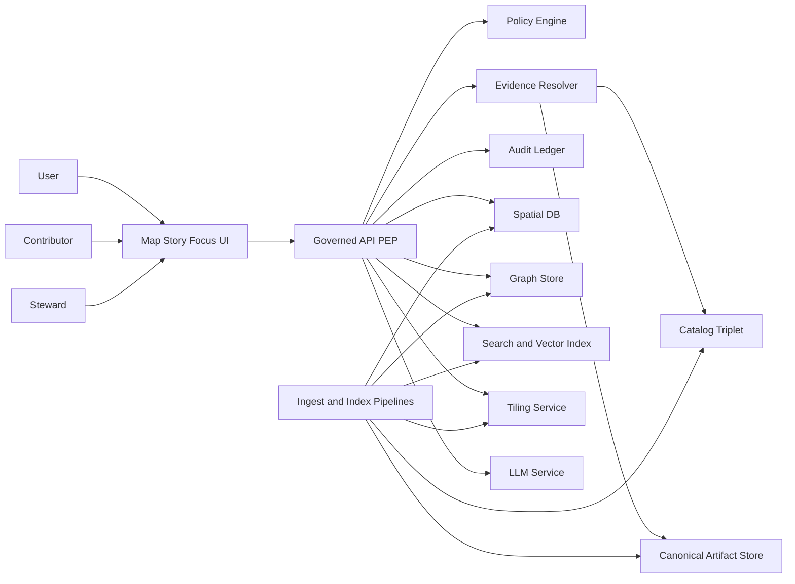

<!-- [KFM_META_BLOCK_V2]
doc_id: kfm://doc/a2914d99-f004-4e66-a507-4a329b615ec3
title: System Context
type: standard
version: v1
status: draft
owners: ["@kfm-architecture", "@kfm-governance"]
created: 2026-03-04
updated: 2026-03-04
policy_label: public
related: ["docs/architecture/", "policy/", "contracts/", "data/", "tools/validators/"]
tags: ["kfm", "architecture", "system-context"]
notes: ["Defines the KFM system boundary, actors, and non-negotiable invariants (truth path + trust membrane)."]
[/KFM_META_BLOCK_V2] -->

# System Context
KFM system boundary, actors, and top-level interactions (UI ↔ governed API ↔ evidence/policy ↔ canonical stores and rebuildable projections).

> **Status:** draft (GOVERNED)  
> **Owners:** @kfm-architecture, @kfm-governance  
> **Last updated:** 2026-03-04  
> **Badges (TODO):**    
> **Quick nav:** [Scope](#scope) · [Invariants](#non-negotiable-invariants) · [Context diagram](#system-context-diagram) · [Truth path](#truth-path-and-data-lifecycle) · [Unknowns](#unknowns-and-verification-steps)

## Scope
- **CONFIRMED:** KFM is a governed, evidence-first, map-first, time-aware system where user-visible claims must be traceable to inspectable evidence and policy decisions.
- **CONFIRMED:** This document defines *context*, not implementation: boundaries, actors, external dependencies, and the primary data/control flows.
- **PROPOSED:** This file is the “source of truth” for what is *inside* the KFM system boundary vs *outside*, and is referenced by downstream architecture docs, ADRs, and threat models.

## Where it fits
- **Path:** `docs/architecture/SYSTEM_CONTEXT.md`
- **Upstream:** governance rules, promotion gates, policy pack, evidence resolver contract.
- **Downstream:** system overview, service diagrams, API contracts, threat model, runbooks.

## Acceptable inputs
- **CONFIRMED:** Architecture invariants, lifecycle zones, promotion gates, and policy boundary statements.
- **PROPOSED:** Mermaid diagrams, interface inventories, and “unknowns” checklists that turn ambiguity into concrete verification steps.
- **UNKNOWN:** Concrete hostnames, cloud account IDs, secrets, or any environment-specific credentials (must live in secrets managers / ops tooling, not docs).

## Exclusions
- **CONFIRMED:** Detailed API schemas and DTOs (belong in `contracts/` and API docs).
- **CONFIRMED:** Dataset-specific schemas and transforms (belong in `data/registry/`, pipeline specs, and catalogs).
- **CONFIRMED:** Operator runbooks (belong in `docs/runbooks/`).
- **PROPOSED:** Deep performance tuning guidance (belongs in `docs/ops/` or ADRs).

## Status tags used in this repo
- **CONFIRMED** — stated as a required invariant / contract in KFM governance docs.
- **PROPOSED** — recommended implementation guidance; safe default but not yet enforced everywhere.
- **UNKNOWN** — not verified in the current repo/deployment; includes the smallest steps to verify.

## System in one paragraph
- **CONFIRMED:** KFM is composed of: (1) ingestion pipelines that snapshot upstream data into immutable lifecycle zones; (2) a catalog/provenance “triplet” (DCAT + STAC + PROV) plus run receipts that act as the evidence surface; (3) rebuildable projections (databases, indexes, tiles) derived from canonical artifacts; and (4) governed runtime surfaces (API + UI) where all access is policy-evaluated and audited.  
- **CONFIRMED:** The UI is a governed client: it calls the governed API only, never databases/object storage directly, and it makes governance visible (version, license, policy badges, evidence drawer).  

---

## Non-negotiable invariants
These invariants are *architecture tests*: if any is violated, governance is unenforceable.

| Invariant | Status | Meaning in practice | Enforced by (examples) |
|---|---|---|---|
| Truth path lifecycle | **CONFIRMED** | Upstream → RAW → WORK/QUARANTINE → PROCESSED → CATALOG (DCAT+STAC+PROV+receipts) → PUBLISHED (governed surfaces). | Promotion gates in CI; validators; release manifests. |
| Trust membrane | **CONFIRMED** | Clients never access DB/storage directly; all reads/writes cross the governed API (Policy Enforcement Point) and evidence resolver. | Network rules; code review; contract tests; OPA tests. |
| Evidence-first UX | **CONFIRMED** | Every map layer, story claim, and AI answer can open into evidence (dataset version, license, policy label, provenance, checksums). | UI “evidence drawer”; mandatory citation objects. |
| Cite-or-abstain | **CONFIRMED** | If citations cannot be verified and resolved under policy, the system abstains or narrows scope. | Hard citation verification gate; Focus eval harness. |
| Canonical vs rebuildable stores | **CONFIRMED** | Canonical: object store + catalogs + provenance + receipts. Rebuildable: DB/search/graph/tiles. | Re-index/rebuild playbooks; no “source of truth” in projections. |
| Deterministic identity and hashing | **CONFIRMED** | Stable dataset/version IDs and spec hashes (canonical JSON hashing) + content digests for artifacts. | Golden hash tests; digest verification in promotion gates. |

---

## Actors and external systems

### Primary actors
| Actor | Status | Goals | Typical surfaces |
|---|---|---|---|
| Public user | **PROPOSED** | Browse maps/stories; ask questions on public evidence only. | Map Explorer, Stories, limited Focus Mode. |
| Analyst / contributor | **PROPOSED** | Add sources, draft stories, run analyses in WORK. | Pipelines (dev), Story drafting, dataset QA reports. |
| Steward / reviewer | **PROPOSED** | Approve promotions; manage policy labels/obligations. | Review workflow; policy pack; audit views. |
| Operator / SRE | **PROPOSED** | Run services, monitor, backup/restore. | Deployment manifests; dashboards; runbooks. |

### External systems (outside the KFM boundary)
| External system | Status | Why it exists | Notes |
|---|---|---|---|
| Upstream data providers | **CONFIRMED** | Source-of-record data for KFM ingestion. | Snapshotted into RAW with license/terms snapshot. |
| Identity provider | **UNKNOWN** | AuthN/AuthZ for governed API. | Verify chosen IdP and RBAC model. |
| CI/CD system | **PROPOSED** | Runs validators, policy tests, promotion gates. | Typically GitHub Actions or equivalent. |
| Artifact registry / object store | **UNKNOWN** | Stores canonical artifacts and possibly OCI evidence bundles. | Verify whether local FS, S3/MinIO, or OCI registry is canonical. |

---

## System context diagram

**Notes**
- **CONFIRMED:** All client access flows through the governed API, which enforces policy and evidence resolution.
- **PROPOSED:** “LLM Service” is implemented via a local model runtime (e.g., Ollama) and is *not* allowed to query stores directly; it only receives curated context from the API.

---

## Interfaces and boundaries

### Core boundary rule
- **CONFIRMED:** The governed API is the enforcement boundary. If a client can reach storage/DB directly, policy and provenance cannot be enforced.

### Interface inventory (v1, conceptual)
| Interface | Initiator | Direction | What crosses the boundary | Policy posture |
|---|---|---|---|---|
| `UI → API` | UI client | request/response | map queries, story fetches, focus asks | deny-by-default; audit every governed call |
| `API → Policy Engine` | API | query | authZ decision, obligations | fail-closed; stable reason codes |
| `API → Evidence Resolver` | API | query | EvidenceRefs → EvidenceBundles | fail-closed if unresolvable/unauthorized |
| `Evidence Resolver → Catalog` | resolver | read | DCAT/STAC/PROV + receipts | must cross-link IDs; validated artifacts only |
| `Evidence Resolver → Canonical store` | resolver | read | artifact bytes by digest | never return restricted bytes without obligations |
| `Pipelines → RAW/WORK/PROCESSED` | pipelines | write | immutable raw, intermediate work, publishable artifacts | append-only in RAW; quarantine on failures |
| `Indexers → Projections` | index builders | write | derived indexes/tiles/DB tables | rebuildable; can be re-derived from canonical |

---

## Truth path and data lifecycle
KFM lifecycle zones are *storage contracts* + *validation gates*.

| Zone | Status | Purpose | Typical contents |
|---|---|---|---|
| Upstream | **CONFIRMED** | External sources (not controlled by KFM). | APIs, files, feeds. |
| RAW | **CONFIRMED** | Immutable acquisition copy + checksums + terms snapshot. | raw files, API snapshots, acquisition manifest. |
| WORK / QUARANTINE | **CONFIRMED** | Intermediate transforms + QA; isolate failures. | normalized outputs, QA reports, candidate redactions. |
| PROCESSED | **CONFIRMED** | Publishable artifacts in approved formats + digests. | GeoParquet, PMTiles, COG, text corpora. |
| CATALOG (Triplet) | **CONFIRMED** | Evidence surface: DCAT + STAC + PROV + run receipts. | cross-linked JSON artifacts + receipts. |
| PUBLISHED | **CONFIRMED** | Governed runtime surfaces (API + UI). | policy-filtered responses, tiles, story renders, focus answers. |

### Promotion Contract (minimum gates)
- **CONFIRMED:** Promotion is blocked unless minimum gates are satisfied (automatable in CI).
- **CONFIRMED:** At minimum, gates cover identity/versioning, licensing, sensitivity classification + redaction obligations, catalog triplet validation, QA thresholds, and run receipts/audit records.

---

## Primary runtime flows

### Map Explorer
- **CONFIRMED:** UI requests a policy-filtered dataset/layer view from the API (often bbox/time constrained).
- **CONFIRMED:** UI surfaces dataset version, license, and policy badges; “evidence drawer” opens the EvidenceBundle for inspected features.

### Story Nodes
- **CONFIRMED:** Stories are narrative artifacts that must include resolvable citations.
- **PROPOSED:** A Story Node stores map state (bbox/time/layers) so the story is reproducible; publishing is a governed event with citation gates.

### Focus Mode
- **CONFIRMED:** A Focus Mode request is treated as a governed run that emits a receipt.
- **CONFIRMED:** Control loop: policy pre-check → retrieval plan → retrieve admissible evidence → build evidence bundles → synthesize answer → **hard** citation verification → audit receipt. If verification fails, abstain or reduce scope.
- **PROPOSED:** LLM generation is provided by a local runtime (Ollama), called only by the API after retrieval and bundling.

---

## Canonical vs rebuildable stores
- **CONFIRMED:** Canonical: object store + catalogs + provenance/receipts.
- **CONFIRMED:** Rebuildable projections: PostGIS tables, graph store, search/vector index, tile caches. Treat them as *derived*.

---

## Unknowns and verification steps
These items are intentionally not guessed. Close them with the smallest check.

1) **UNKNOWN:** Exact monorepo layout and module names in the current branch  
   - Verify: `git ls-tree -d HEAD` and record commit SHA in this doc.

2) **UNKNOWN:** Canonical storage backend(s) (local filesystem vs S3/MinIO vs OCI registry)  
   - Verify: check `infra/` and `configs/` for storage configuration; identify the canonical “address” used in catalogs (file, s3, oci).

3) **UNKNOWN:** AuthN/AuthZ mechanism (IdP choice, roles, token format)  
   - Verify: inspect `policy/` rules and API middleware; document principal → role mapping.

4) **UNKNOWN:** Exact API endpoint surface (final paths)  
   - Verify: inspect `contracts/openapi*` and/or `apps/api` routes; update the interface inventory table with canonical paths.

5) **UNKNOWN:** Which projections are currently implemented (PostGIS/Neo4j/search/tiles)  
   - Verify: inspect deployment manifests and running services list; add a “Projections inventory” appendix.

---

## Change discipline for this doc
- **CONFIRMED:** Prefer additive changes (new sections/diagrams) over rewrites; keep a short changelog in PR description.
- **PROPOSED:** Any change that affects the trust membrane or truth path requires an ADR + test plan link.

---

## Appendix

Glossary (click to expand)

- **EvidenceRef:** A resolvable reference that points to inspectable evidence (not a free-form citation string).
- **EvidenceBundle:** A policy-filtered “evidence card” that includes metadata, license, provenance, digests, and audit references.
- **PEP (Policy Enforcement Point):** The component boundary where policy decisions are applied (typically the API layer).
- **Promotion Contract:** The set of validation gates required before a dataset version can be served in PUBLISHED surfaces.
- **Truth path:** The lifecycle path from upstream acquisition through immutable zones, catalogs, and governed runtime surfaces.

---

[Back to top](#system-context)
