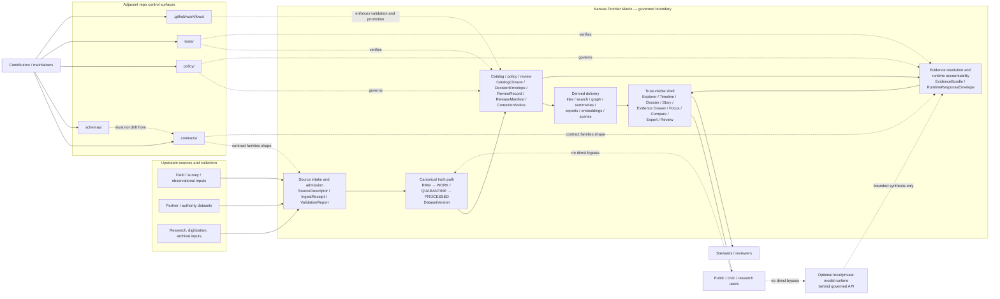

<!-- [KFM_META_BLOCK_V2]
doc_id: kfm://doc/NEEDS_VERIFICATION__uuid
title: System Context
type: standard
version: v1
status: review
owners: @bartytime4life
created: NEEDS_VERIFICATION__git_history_date
updated: NEEDS_VERIFICATION__commit_or_merge_date
policy_label: NEEDS_VERIFICATION__public_or_restricted
related: [./README.md, ./TRUST_MEMBRANE.md, ./TRUTH_PATH_LIFECYCLE.md, ./DEPLOYMENT_TOPOLOGY.md, ./system_overview.md, ./canonical_vs_rebuildable.md, ../../README.md, ../../contracts/README.md, ../../policy/README.md, ../../schemas/README.md, ../../tests/README.md, ../../.github/workflows/README.md]
tags: [kfm, architecture, system-context]
notes: [Owner confirmed from current public CODEOWNERS; doc_id, dates, and policy_label still require direct repo or file-history verification before publish.]
[/KFM_META_BLOCK_V2] -->

# System Context

KFM's logical boundary, surrounding actors, and non-bypass rules for crossing the trust membrane.

> **Status:** review  
> **Owners:** `@bartytime4life`  
> **Repo fit:** `docs/architecture/SYSTEM_CONTEXT.md` · logical boundary and actor/context anchor inside `docs/architecture/`  
>      
> **Quick jumps:** [Scope](#scope) · [Repo fit](#repo-fit) · [Context model](#logical-context-model) · [Boundary rules](#boundary-rules-that-cannot-be-bypassed) · [Context diagram](#context-diagram) · [Open verification backlog](#open-verification-backlog)

> [!IMPORTANT]
> This document explains **logical system context and boundary law**. It must not be treated as proof of live runtime topology, route inventory, manifests, workflow enforcement, or mounted service composition unless those details are directly reverified in the current workspace.

---

## Scope

This file answers four architecture questions:

1. What system KFM is actually trying to be.
2. Which actors and adjacent systems cross its boundary.
3. Which boundary rules may not be bypassed for convenience.
4. Which neighboring repo surfaces must move when context changes.

This is intentionally a **boundary and context** document, not a full deployment manual and not a substitute for contracts, policy bundles, schemas, workflows, or runtime code.

## Repo fit

| Field | Value |
|---|---|
| **Path** | `docs/architecture/SYSTEM_CONTEXT.md` |
| **Primary role** | Context anchor for KFM system boundary, actor map, trust-critical crossings, and adjacent architecture surfaces |
| **Upstream doctrine** | `../../README.md`, `../README.md`, `./README.md`, and the March 2026 replacement-grade KFM manuals |
| **Downstream architecture docs** | `./TRUST_MEMBRANE.md`, `./TRUTH_PATH_LIFECYCLE.md`, `./DEPLOYMENT_TOPOLOGY.md`, plus companion architecture notes once those paths are verified and promoted |
| **Adjacent machine surfaces** | `../../contracts/README.md`, `../../policy/README.md`, `../../schemas/README.md`, `../../tests/README.md`, `../../.github/workflows/README.md` |
| **Main audience** | Maintainers, architecture reviewers, contributors, stewards, and any implementer who needs to know what must never bypass KFM governance |

## Accepted inputs

This document should accept material such as:

- KFM boundary statements and system-identity clarifications
- actor and neighboring-system descriptions
- truth-path and promotion-transition summaries
- public-vs-steward surface boundaries
- trust-critical artifact and accountability object references
- source-bounded context diagrams
- architecture review notes that reduce ambiguity without overstating implementation

## Exclusions

This document should **not** become the home for:

- detailed policy rule bodies or decision logic — put that in `../../policy/`
- canonical machine-readable schemas, fixtures, and contract examples — put those in `../../contracts/` and `../../schemas/`
- merge-blocking workflow logic or CI implementation — put that in `../../.github/workflows/`
- runtime code, API handlers, workers, or storage adapters — put those in `../../apps/`, `../../packages/`, or `../../infra/`
- domain-lane specifics, source inventories, or Kansas publication burdens — keep those in atlas/domain documentation
- exact deployment shape beyond what is directly verified — split that into `./DEPLOYMENT_TOPOLOGY.md` once confirmed

## Baseline and evidence basis

### Baseline used for this revision

| Baseline type | Used here for | Notes |
|---|---|---|
| **Repo-local baseline** | current public `./SYSTEM_CONTEXT.md` review draft plus `./README.md` | Supplies the current structure, local path role, and directory-native documentation conventions |
| **Doctrinal baseline** | March 2026 KFM replacement-grade master manuals | Supplies system identity, trust membrane, truth path, shell/surface family, and contract/accountability doctrine |
| **Current workspace signal** | Publicly visible repository surfaces, readmes, and sibling architecture files | Used only for what appears to exist now; not treated as proof of unmounted runtime reality |

### Evidence basis used in this file

| Evidence class | What it supports | Status used here |
|---|---|---|
| Current public repository readmes and sibling architecture files | Paths, owner signal, visible readmes, sibling maturity cues, and current public-`main` drift signals | **CONFIRMED** for public `main` only |
| Attached March 2026 KFM manuals | Durable architecture doctrine and governing direction | **CONFIRMED** doctrine |
| Logical joins required to make doctrine coherent | Layering, actor grouping, context packaging | **INFERRED** |
| Recommended next clarifications | Review checklist, verification backlog, context split guidance | **PROPOSED** |
| Mounted runtime/service details not directly inspected here | Live topology, route inventory, manifest reality, exact enforcement | **UNKNOWN** |

> [!NOTE]
> Current public-`main` architecture signals are slightly inconsistent. `docs/architecture/README.md` still classifies `SYSTEM_CONTEXT.md`, `DEPLOYMENT_TOPOLOGY.md`, and `canonical_vs_rebuildable.md` as scaffold placeholders, while those file paths now resolve to substantive review-stage content on public `main`. Treat that as **directory-index drift** to reconcile, not as proof of mounted runtime reality.

## Current evidence boundary

> [!WARNING]
> At the time of this revision, doctrine is stronger than mounted implementation evidence. Use this file to keep the boundary clear, not to smuggle unverified runtime claims into architectural prose.

### Truth labels used in this file

| Label | Meaning here |
|---|---|
| **CONFIRMED** | Directly supported by visible repo/public evidence or attached KFM doctrine |
| **INFERRED** | Conservative structural completion strongly implied by repeated doctrine and repo logic |
| **PROPOSED** | Recommended documentation or implementation direction that fits the project but is not proven as current reality |
| **UNKNOWN** | Not verified strongly enough in this review to present as current project fact |
| **NEEDS VERIFICATION** | A concrete field, path, owner, or implementation seam that should be checked before publish or merge |

### What is intentionally kept unresolved

- exact mounted runtime topology
- actual API route inventory
- actual workflow YAML and required checks
- authoritative schema home resolution between `contracts/` and `schemas/`
- real emitters for `EvidenceBundle` and `RuntimeResponseEnvelope`
- exact proof-pack, correction, and rollback artifact locations
- `doc_id`, `created`, `updated`, and `policy_label` for this file

## System context at a glance

KFM is best understood as a **governed spatial evidence system** whose unit of value is the **inspectable claim**, not the tile, dashboard, graph, summary, or fluent answer that happens to present that claim.

| Context statement | Practical consequence |
|---|---|
| KFM is a governed spatial evidence system | Every outward-facing value is a publication or explanation event, not merely a successful query |
| Truth changes state through governed transitions | `RAW`, `WORK`, `QUARANTINE`, `PROCESSED`, `CATALOG`, and `PUBLISHED` stay distinct |
| Public experience is trust-visible | Users should be able to see freshness, review state, provenance route, and correction context at point of use |
| Derived layers are useful but subordinate | Tiles, search views, graph expansions, summaries, embeddings, and scenes remain rebuildable unless explicitly promoted |
| Assistance is bounded | Focus-style synthesis must resolve evidence, apply policy, and emit finite outcomes |
| Correction is first-class | Supersession, withdrawal, narrowing, and replacement remain visible instead of silently rewriting history |

## Logical context model

KFM's context is easiest to read as a small set of interacting layers.

| Layer | Primary job | Typical artifacts or surfaces | Truth posture |
|---|---|---|---|
| **Source edge and intake** | Admit, fetch, inspect, validate, and route incoming material | `SourceDescriptor`, `IngestReceipt`, `ValidationReport` | **CONFIRMED** doctrine |
| **Canonical truth path** | Preserve governed candidate and promoted truth | `RAW` -> `WORK / QUARANTINE` -> `PROCESSED` -> `DatasetVersion` | **CONFIRMED** doctrine |
| **Catalog / policy / review** | Decide what is publishable, to whom, and under what obligations | `CatalogClosure`, `DecisionEnvelope`, `ReviewRecord`, `ReleaseManifest`, `CorrectionNotice` | **CONFIRMED** doctrine |
| **Derived delivery** | Build fast, useful, release-linked delivery products | tiles, search, graph views, summaries, exports, embeddings, scenes | **CONFIRMED** doctrine |
| **Trust-visible shell** | Let users explore place, time, evidence, and release-backed context | Explorer, Timeline, Dossier, Story, Evidence Drawer, Compare, Export, Review | **CONFIRMED** doctrine / **PROPOSED** exact mounted realization |
| **Runtime explanation and bounded assistance** | Resolve support for claims and keep runtime outcomes accountable | `EvidenceBundle`, `RuntimeResponseEnvelope`, Focus-style bounded synthesis | **CONFIRMED** doctrine / **UNKNOWN** implementation depth |

## Actors

### Primary actors

| Actor | What they need from KFM | Normal touchpoint | Must not bypass |
|---|---|---|---|
| **Public / civic / research user** | truthful exploration, visible caveats, inspectable evidence, policy-safe exports | governed shell surfaces | trust membrane, policy evaluation, evidence resolution |
| **Steward / reviewer** | moderation, quarantine inspection, rights/sensitivity handling, promotion, rollback, correction | review/stewardship surfaces and governed review artifacts | release discipline, separation of duty, correction lineage |
| **Contributor / maintainer** | stable doctrine, explicit contracts, tests, workflows, review expectations | repo control surfaces and adjacent architecture docs | placeholder honesty, contract drift controls, policy bypass |
| **Source provider / field collector** | clear admission expectations and metadata burden | intake and source-onboarding pathways | silent publication, undocumented transformations |
| **Optional bounded model operator** | replaceable inference seam behind governed API | local/private runtime lane when justified | direct client-to-model path or uncited outward claims |

### Adjacent systems and control surfaces

| Adjacent system or surface | Relationship to system context | Current posture |
|---|---|---|
| `../../README.md` | states project identity and top-level trust posture | visible and substantive |
| `../README.md` | frames `docs/` as governed documentation rather than decoration | visible and substantive |
| `./README.md` | defines local architecture-doc role, inputs, exclusions, and current directory snapshot | visible and substantive |
| `./system_overview.md` | provides a shorter whole-system bridge between doctrine and deeper architecture surfaces | visible and substantive |
| `./canonical_vs_rebuildable.md` | sharpens the authoritative-versus-derived split that this file depends on | visible and substantive |
| `../../contracts/README.md` | contract publication and machine-readable trust-object reference surface | visible; executable schema authority still not fully resolved here |
| `../../schemas/README.md` | schema-namespace documentation surface | visible; warns against parallel authoritative schema universes |
| `../../policy/README.md` | policy doctrine, finite runtime outcomes, deny-by-default posture | visible and substantive |
| `../../tests/README.md` | verification families and public test-surface shape | visible; test execution depth still needs direct verification |
| `../../.github/workflows/README.md` | workflow-scope documentation | visible; active merge-blocking YAML is not proven here |
| Canonical stores and artifact trees | logical truth-bearing substrate for KFM | **CONFIRMED** as doctrine / **UNKNOWN** as mounted topology |
| Local/private model runtime | optional bounded assistance seam behind membrane | **CONFIRMED** as doctrine / **UNKNOWN** as mounted topology |

## Boundary rules that cannot be bypassed

| Rule | Practical meaning | Review question this doc should force |
|---|---|---|
| **Trust membrane** | No direct client or UI bypass of governed APIs, policy evaluation, or evidence resolution | Does this new surface create a shortcut around governance? |
| **Canonical truth path** | Truth moves through explicit zones and governed promotion, not silent file movement | Where does this object enter, change state, and become releasable? |
| **Authoritative vs. derived** | Delivery products stay rebuildable unless explicitly promoted | Is this object authoritative truth or a convenience projection? |
| **Evidence one-hop rule** | Consequential actions should remain one hop from inspectable evidence | Where does the user drill through to evidence? |
| **Finite runtime outcomes** | Runtime explanation surfaces emit bounded outcomes instead of confident bluffing | What happens when evidence is missing, partial, denied, or stale? |
| **Correction visibility** | Withdrawal, supersession, narrowing, and replacement preserve lineage | How will users learn that a prior release or answer changed? |
| **2D-by-default / burden-bearing 3D** | 3D is allowed only when it carries a real explanatory burden | Why is 2D insufficient here? |
| **Cite-or-abstain posture** | Unsupported confidence is a failure, not a feature | What is the system supposed to do when support is incomplete? |

## Surface family in context

KFM's surface family matters because context is not only backend topology; it is also how the boundary becomes visible to users.

| Surface | Primary job | Trust-critical context it must carry |
|---|---|---|
| **Map Explorer** | spatial discovery and navigation | time scope, layer state, freshness, evidence route |
| **Timeline** | as-of inspection, chronology, comparison anchors | valid-time labels, event grain, stale-state cues |
| **Dossier** | durable place or feature decision object | identity, dependencies, gap notes, evidence links |
| **Story** | human-authored narrative publication in the same shell | dated excerpts, perspective labels, review/correction state |
| **Evidence Drawer** | immediate provenance inspection | bundle members, quote context, transforms, release state |
| **Focus** | bounded question answering inside the shell | scoped retrieval, citation verification, audit reference, finite outcome |
| **Compare** | anchored comparison across place, time, or release | explicit comparison basis and uncertainty cues |
| **Export** | policy-safe outward artifact generation | release scope, evidence linkage, preview policy, correction linkage |
| **Review / Stewardship** | moderation, promotion, denial, rollback, sensitivity operations | receipts, gate results, policy labels, review notes |

> [!NOTE]
> The **surface family is doctrinally strong**. The exact mounted route set, payload shapes, and component boundaries remain separate verification work.

## Context diagram

> [!IMPORTANT]
> This is a **logical context diagram**, not a confirmed deployment topology.

## Reference table

| If you need to answer... | Start here | Then check |
|---|---|---|
| What is KFM inside the boundary? | this file | `../../README.md`, `../README.md` |
| What must never bypass governance? | `./TRUST_MEMBRANE.md` | `../../policy/README.md` |
| How does truth move through state? | `./TRUTH_PATH_LIFECYCLE.md` | `../../contracts/README.md`, `../../tests/README.md` |
| How do I decide whether a layer or artifact is authoritative or derived? | `./canonical_vs_rebuildable.md` | `../../contracts/README.md`, `../../schemas/README.md` |
| Where do context claims become machine-checkable? | `../../contracts/README.md` | `../../schemas/README.md`, `../../tests/README.md` |
| Where do enforcement and merge gates live? | `../../.github/workflows/README.md` | `../../tests/README.md`, `../../policy/README.md` |
| Where is the short whole-system bridge? | `./system_overview.md` | `../../README.md`, `./README.md` |
| Where should verified runtime/deployment specifics land? | `./DEPLOYMENT_TOPOLOGY.md` | `../../infra/`, `../../apps/`, `../../packages/` once directly confirmed |
| How should public surfaces stay honest? | this file and `../../policy/README.md` | evidence/resolver contracts and surface-specific payload docs |

## Review checklist

Before treating this file as publish-ready, confirm the following:

- [ ] KFM meta block fields have real `doc_id`, `created`, `updated`, and `policy_label`
- [ ] owner remains aligned with `../../.github/CODEOWNERS`
- [ ] all relative links resolve in the checked-out branch, not only in public `main`
- [ ] no section silently upgrades doctrine into mounted implementation fact
- [ ] shell/surface names still match current architecture vocabulary
- [ ] context diagram still matches verified boundary logic
- [ ] `docs/architecture/README.md` no longer mislabels this file or sibling promoted companions as scaffold-only, or the mismatch is explicitly documented
- [ ] any newly verified deployment specifics are moved into `./DEPLOYMENT_TOPOLOGY.md`
- [ ] any changes to trust rules are reflected across `../../policy/`, `../../contracts/`, `../../tests/`, and workflow enforcement
- [ ] placeholder or duplicate sibling files in `docs/architecture/` have been reconciled or explicitly left visible as placeholders

## Open verification backlog

| Unknown | Why it matters | Direct verification needed |
|---|---|---|
| Exact `doc_id`, `created`, `updated`, and `policy_label` for this file | standard-doc metadata should not be guessed or backfilled loosely | inspect file history, repo metadata rules, and any document registry or publication-label conventions |
| Checked-out branch vs. public `main` | public GitHub view may lag, differ, or omit local changes | inspect current branch tree directly |
| Exact runtime/service topology | system context must stay logical until real service boundaries are known | inspect `../../apps/`, `../../packages/`, `../../infra/`, manifests, and running services |
| Active workflow gates | context and enforcement claims should line up | inspect actual workflow YAML and required-check settings |
| Authoritative schema home | dual authority between `contracts/` and `schemas/` creates drift risk | inspect current schema inventory and decide one authoritative landing zone |
| Real emitters for `EvidenceBundle` / `RuntimeResponseEnvelope` | these objects are central to runtime accountability | surface routes, contracts, examples, and tests proving they are emitted |
| Release proof packs and correction drills | context should align to real rollback/correction behavior | surface one release proof artifact and one correction path sample |
| Architecture index snapshot drift | `docs/architecture/README.md` currently lags some sibling maturity states on public `main` | reconcile current snapshot tables against actual sibling file contents and intended authoritative status |

[Back to top](#system-context)

Appendix — scaffold promotion notes

This file is intended to replace a minimal scaffold with a real, reviewable architecture document.

Promotion rules for later revisions:

- Keep this file **logical and stable**.
- Move confirmed runtime shape into `./DEPLOYMENT_TOPOLOGY.md` instead of overloading context.
- Move machine-readable detail into `../../contracts/`, `../../schemas/`, `../../policy/`, and `../../tests/`.
- Prefer explicit `UNKNOWN` and `NEEDS VERIFICATION` markers over persuasive smoothing.
- Reconcile `docs/architecture/README.md` snapshot tables when this file or sibling maturity changes.
- Treat any duplicate casing, placeholder sibling files, or unresolved path drift in `docs/architecture/` as cleanup work, not as hidden noise.

A strong `SYSTEM_CONTEXT.md` should help a reviewer answer:  
**What is inside KFM? What is outside it? Who crosses the boundary? What must never bypass it? What evidence proves the answer?**

