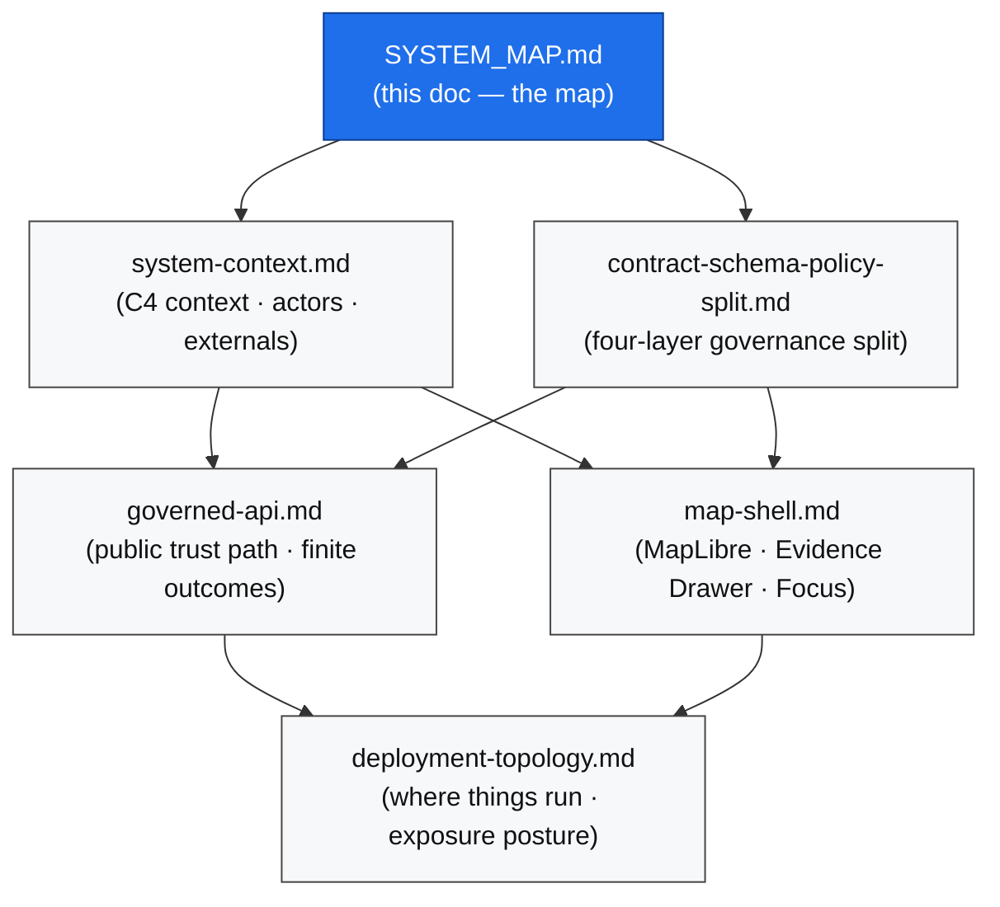
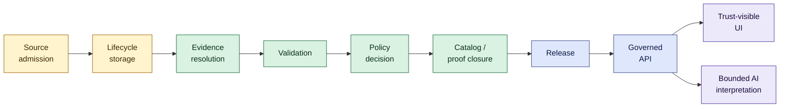
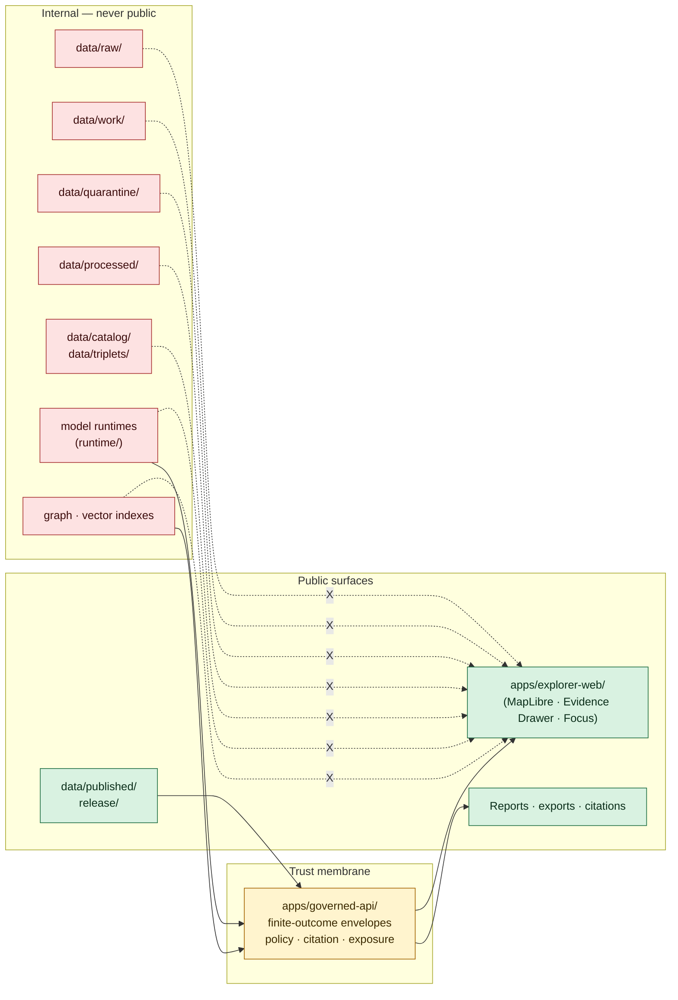

<!-- [KFM_META_BLOCK_V2]
doc_id: kfm://doc/architecture/system-map
title: KFM System Map
type: standard
version: v1
status: draft
owners: Docs steward + Architecture steward
created: 2026-05-14
updated: 2026-05-14
policy_label: public
related:
  - docs/architecture/README.md
  - docs/architecture/system-context.md
  - docs/architecture/governed-api.md
  - docs/architecture/map-shell.md
  - docs/architecture/contract-schema-policy-split.md
  - docs/architecture/deployment-topology.md
  - docs/doctrine/directory-rules.md
  - docs/doctrine/lifecycle-law.md
  - docs/doctrine/trust-membrane.md
  - docs/doctrine/authority-ladder.md
  - docs/doctrine/truth-posture.md
tags: [kfm, architecture, system-map, doctrine, governance]
notes:
  - Repo not mounted at draft time; path claims are PROPOSED per Directory Rules §0
  - Synthesizes the five-plane architectural cut and trust spine
[/KFM_META_BLOCK_V2] -->

<a id="top"></a>

# KFM System Map

> The canonical orientation document for the Kansas Frontier Matrix architecture — what governs what, what flows where, and which surfaces are downstream carriers rather than root truth.

<p align="center">
  <b>Governed · Evidence-First · Map-First · Time-Aware · Reversible</b>
</p>


| Field | Value |
|---|---|
| **Status** | `draft` (PROPOSED architecture map; CONFIRMED doctrine basis) |
| **Owners** | Docs steward · Architecture steward |
| **Authority class** | Canonical (under `docs/architecture/`) |
| **Last reviewed** | `2026-05-14` |
| **Supersedes** | None |

---

## Quick jump

- [1. Purpose](#1-purpose)
- [2. At-a-glance](#2-at-a-glance)
- [3. Reading order for architecture docs](#3-reading-order-for-architecture-docs)
- [4. Architectural cut — the five planes](#4-architectural-cut--the-five-planes)
- [5. The trust spine](#5-the-trust-spine)
- [6. Canonical data lifecycle](#6-canonical-data-lifecycle)
- [7. Canonical object families](#7-canonical-object-families)
- [8. Responsibility-root map (where things live)](#8-responsibility-root-map-where-things-live)
- [9. Public path and the trust membrane](#9-public-path-and-the-trust-membrane)
- [10. Downstream carriers (not root truth)](#10-downstream-carriers-not-root-truth)
- [11. Cross-plane invariants](#11-cross-plane-invariants)
- [12. Acceptance — what makes the map real](#12-acceptance--what-makes-the-map-real)
- [13. Open questions and `NEEDS VERIFICATION`](#13-open-questions-and-needs-verification)
- [14. Glossary](#14-glossary)
- [15. Related docs](#15-related-docs)

---

## 1. Purpose

This document is the **single architectural map** for Kansas Frontier Matrix (KFM). It does three things:

1. **Names the planes.** Cuts the system into the smallest sound set of cooperating responsibility planes so that any change can be located inside exactly one of them.
2. **Traces the trust spine.** Shows the linear path that admitted material must traverse before any released claim, layer, tile, scene, or AI answer can be presented publicly.
3. **Navigates the rest of `docs/architecture/`.** Every other architecture document refines a slice of this map. Read this first; read the others after.

This map is not the API reference, the deployment guide, the policy catalog, or the schema registry. It does not decide *what should exist*; existence is decided by `contracts/`, `schemas/`, `policy/`, source descriptors, ADRs, and reviews. It decides *how the system is shaped* so reviewers, contributors, and AI agents can place any artifact on the diagram without guessing.

> [!NOTE]
> **Status posture.** The architectural cut, lifecycle law, trust membrane, object families, and responsibility-root discipline are **CONFIRMED doctrine** drawn from the attached KFM corpus. The current-repo realization of those things is **PROPOSED / UNKNOWN** until the live monorepo is inspected; see §13.

[Back to top ↑](#top)

---

## 2. At-a-glance

The smallest sound KFM system is shaped by five facts. All other architecture docs are refinements of one of them.

| # | Fact | Status | Where refined |
|---|---|---|---|
| 1 | KFM is structured as a **governed spatial-evidence system**, not a map app with optional citations. | CONFIRMED doctrine | This doc · `system-context.md` |
| 2 | The architecture has **five cooperating planes**: governance/control, lifecycle/data, evidence/catalog/proof, governed service/API, user interaction. | PROPOSED architectural cut | §4 · `governed-api.md` · `map-shell.md` |
| 3 | The **canonical data lifecycle** is `RAW → WORK / QUARANTINE → PROCESSED → CATALOG / TRIPLETS → PUBLISHED`. Promotion is a governed state transition, not a file move. | CONFIRMED doctrine | §6 · `lifecycle-law.md` |
| 4 | The **trust membrane** sits between internal stores and public surfaces. `apps/governed-api/` is the operational form. Public clients never read RAW / WORK / QUARANTINE / canonical-internal stores or direct model output. | CONFIRMED doctrine | §9 · `governed-api.md` · `trust-membrane.md` |
| 5 | **Maps, tiles, graphs, vector indexes, scenes, summaries, and AI text are downstream carriers.** None replaces source authority, `EvidenceBundle` resolution, `PolicyDecision`, `PromotionDecision`, `ReleaseManifest`, or rollback target. | CONFIRMED doctrine | §10 · `map-shell.md` |

> [!IMPORTANT]
> If a proposed feature, refactor, route, or component cannot be placed inside exactly one plane and one responsibility root, **the proposal is the problem, not the map.** Re-scope, split, or open an ADR before merging.

[Back to top ↑](#top)

---

## 3. Reading order for architecture docs

`docs/architecture/` is read top-down. This map is the entry point.



> [!NOTE]
> Filenames in `docs/architecture/` follow the canonical-root layout in `docs/doctrine/directory-rules.md` §6.1. Whether this file lives at `docs/architecture/SYSTEM_MAP.md` (snake-uppercase, matching `docs/registers/` convention) or `docs/architecture/system-map.md` (lowercase-hyphenated, matching the sibling docs in §6.1) is **NEEDS VERIFICATION**; resolve via per-root README and `docs/registers/DRIFT_REGISTER.md`.

[Back to top ↑](#top)

---

## 4. Architectural cut — the five planes

**Status: PROPOSED architectural cut over CONFIRMED doctrine.** The smallest sound KFM system has five cooperating planes. Each plane has a single governance burden; each repo root maps cleanly into one plane.

```mermaid
flowchart LR
    subgraph GOV["1. Governance / Control Plane"]
        direction TB
        DOCS["docs/"]
        CP["control_plane/"]
        ADR["docs/adr/"]
        REG["docs/registers/"]
    end

    subgraph LIFE["2. Lifecycle / Data Plane"]
        direction TB
        RAW["data/raw/"]
        WORK["data/work/"]
        QUAR["data/quarantine/"]
        PROC["data/processed/"]
        CAT["data/catalog/"]
        TRI["data/triplets/"]
        PUB["data/published/"]
    end

    subgraph EVD["3. Evidence / Catalog / Proof Plane"]
        direction TB
        EVB["data/proofs/<br/>(EvidenceBundle)"]
        RCP["data/receipts/<br/>(RunReceipt · PromotionReceipt · AIReceipt)"]
        REL["release/<br/>(ReleaseManifest · RollbackCard · CorrectionNotice)"]
    end

    subgraph API["4. Governed Service / API Plane"]
        direction TB
        GAPI["apps/governed-api/"]
        RT["runtime/<br/>(adapters · harnesses)"]
        PKG["packages/<br/>(shared libraries)"]
    end

    subgraph UI["5. User Interaction Plane"]
        direction TB
        EXP["apps/explorer-web/"]
        ML["packages/maplibre/"]
        UIP["packages/ui/"]
    end

    GOV -.governs.-> LIFE
    GOV -.governs.-> EVD
    GOV -.governs.-> API
    GOV -.governs.-> UI
    LIFE --> EVD
    EVD --> API
    API --> UI

    classDef gov fill:#fff4ce,stroke:#a36400,color:#3b2a00;
    classDef life fill:#dfe7fd,stroke:#3a4a8a,color:#0b1a44;
    classDef evd fill:#d9f2e1,stroke:#1f6f43,color:#0b2e1a;
    classDef api fill:#fde2e2,stroke:#a83232,color:#3b0b0b;
    classDef ui fill:#ece9fb,stroke:#5a3aa8,color:#1a0b3b;
    class DOCS,CP,ADR,REG gov
    class RAW,WORK,QUAR,PROC,CAT,TRI,PUB life
    class EVB,RCP,REL evd
    class GAPI,RT,PKG api
    class EXP,ML,UIP ui
```



### 4.1 What each plane owns

| Plane | Primary responsibility | Primary repo roots | Cannot decide |
|---|---|---|---|
| **1. Governance / Control** | Doctrine, ADRs, registers, authority ladder, drift detection, verification backlog. | `docs/`, `control_plane/`, `docs/adr/`, `docs/registers/` | Object meaning · field shape · runtime allow/deny |
| **2. Lifecycle / Data** | Source-identified material moving through phases under governed promotion. | `data/` | What an object means · whether something is released |
| **3. Evidence / Catalog / Proof** | Closure objects: `EvidenceBundle`, receipts, release manifests, rollback cards, correction notices. | `data/proofs/`, `data/receipts/`, `data/catalog/`, `release/` | The lifecycle phase of underlying data · runtime exposure |
| **4. Governed Service / API** | The public trust path. Resolves released artifacts through finite-outcome envelopes; enforces policy, citation, and exposure controls. | `apps/governed-api/`, `runtime/`, `packages/` | Source identity · what counts as evidence · what gets published |
| **5. User Interaction** | Trust-visible shell. MapLibre as disciplined 2D renderer; Evidence Drawer; Focus Mode; Story Nodes; review surfaces. | `apps/explorer-web/`, `packages/ui/`, `packages/maplibre/`, optional `packages/cesium/` | Anything in planes 1–4 |

> [!WARNING]
> A change that touches two planes is two changes. Split it or open an ADR before merging. The most common silent collapse is plane 4 reading directly from plane 2 — see §9 anti-patterns.

[Back to top ↑](#top)

---

## 5. The trust spine

**Status: CONFIRMED doctrine.** The architectural center of KFM is a linear spine that admitted material must traverse before any released claim is exposed publicly. The spine is the same shape for hydrology rasters, archaeology features, taxonomic occurrences, settlement geometries, AI-drafted explanations, and tile sets.



### 5.1 Stages

| # | Stage | What it does | Emitted object(s) |
|---|---|---|---|
| 1 | **Source admission** | A `SourceDescriptor` is registered; `SourceActivationDecision` gates use, restriction, quarantine, or denial. | `SourceDescriptor`, `SourceActivationDecision`, pre-RAW `event_envelope` / `prefilter_output` / `event_run_receipt` |
| 2 | **Lifecycle storage** | Admitted material lives under its source identity in the lifecycle plane (§6). | Phase-stamped data objects |
| 3 | **Evidence resolution** | An `EvidenceRef` is resolved to an `EvidenceBundle` carrying source, provenance, scope, citation, and review context. | `EvidenceBundle` |
| 4 | **Validation** | Schema, contract, rights, sensitivity, source-role, temporal, evidence, and integrity checks run. | `ValidationReport`, `RunReceipt` |
| 5 | **Policy decision** | A `PolicyDecision` is recorded — finite `ALLOW` / `DENY` / `RESTRICT` / `ABSTAIN` / `ERROR`. | `PolicyDecision`, `DecisionEnvelope` |
| 6 | **Catalog / proof closure** | Catalog records, layer manifests, graph projections, and proof bundles are closed against the validated evidence. | `CatalogRecord`, `LayerManifest`, `EvidenceBundle` (sealed) |
| 7 | **Release** | A `ReleaseManifest` binds artifacts, digests, policy posture, review state, and rollback target. Promotion is a governed state transition. | `ReleaseManifest`, `PromotionDecision`, `PromotionReceipt`, `RollbackCard` |
| 8 | **Governed API** | Finite-outcome envelopes serve released, evidence-backed payloads only. | `RuntimeResponseEnvelope` |
| 9 | **Trust-visible UI** | MapLibre shell, Evidence Drawer, Focus Mode, Story Nodes, review surfaces. | UI state · `EvidenceDrawerPayload` |
| 10 | **Bounded AI interpretation** | Evidence-bounded summarization, citation-validated. Finite `ANSWER` / `ABSTAIN` / `DENY` / `ERROR`. | `AIReceipt` |

> [!IMPORTANT]
> **Cite-or-abstain is the default truth posture.** Any consequential public claim that cannot resolve through this spine must `ABSTAIN`, `DENY`, or be withdrawn — not be downgraded into uncited prose.

[Back to top ↑](#top)

---

## 6. Canonical data lifecycle

**Status: CONFIRMED doctrine** (lifecycle invariant). **PROPOSED implementation** (per-phase directory layout pending mounted-repo verification).

```mermaid
flowchart LR
    PRE(["pre-RAW<br/>admission edge"]) --> RAW["RAW<br/>admitted source material"]
    RAW --> WORK["WORK<br/>transformations · candidates"]
    RAW --> QUAR["QUARANTINE<br/>rights · sensitivity · validity defects"]
    WORK --> PROC["PROCESSED<br/>normalized · check-passing"]
    QUAR -. resolved .-> WORK
    PROC --> CAT["CATALOG / TRIPLETS<br/>claims · layers · graph · discovery"]
    CAT --> PUB["PUBLISHED<br/>released · policy-allowed · rollback-capable"]

    classDef pre fill:#fff4ce,stroke:#a36400,color:#3b2a00;
    classDef raw fill:#fde2e2,stroke:#a83232,color:#3b0b0b;
    classDef mid fill:#dfe7fd,stroke:#3a4a8a,color:#0b1a44;
    classDef pub fill:#d9f2e1,stroke:#1f6f43,color:#0b2e1a;
    class PRE pre
    class RAW,QUAR raw
    class WORK,PROC,CAT mid
    class PUB pub
```



### 6.1 Phase semantics

| Phase | Holds | Public-readable? | Promotion rule |
|---|---|---|---|
| **pre-RAW** | `event_envelope`, `prefilter_output`, `event_run_receipt` for attempted intake. | No | Admission gate decides whether material enters RAW. |
| **RAW** | Admitted source material under source identity. | **Never** through public clients. | Move to WORK only via a recorded transform. |
| **WORK** | Transformations and unresolved candidates. | **Never** through public clients. | Move to PROCESSED only if transformation checks pass. |
| **QUARANTINE** | Rights, sensitivity, validation, source-role, temporal, or evidence defects. | **Never**. | Move back to WORK once defect is resolved; or deny. |
| **PROCESSED** | Normalized outputs that have passed transformation checks. | **Never** directly. | Promotion to CATALOG requires evidence closure + policy decision. |
| **CATALOG / TRIPLETS** | Claim, layer, graph, provenance, discovery surfaces. | **Never** directly. | Release decision binds catalog artifacts to a `ReleaseManifest`. |
| **PUBLISHED** | Released, policy-allowed, reviewable, rollback-capable artifacts. | **Yes**, via governed API (§9). | Withdrawal / rollback uses `RollbackCard`. |

> [!CAUTION]
> **Lifecycle skips are anti-patterns.** A pipeline that writes from `data/raw/` directly to `data/published/` is a bug, not a shortcut. All phases run; promotion is a governed state transition, not a file move.

[Back to top ↑](#top)

---

## 7. Canonical object families

**Status: CONFIRMED doctrine** for the vocabulary; **PROPOSED implementation** for schema and instance paths until verified in a mounted repo. The full semantic definitions live in `contracts/`; the machine shapes live in `schemas/contracts/v1/` per ADR-0001.

| Object family | Governance burden | Plane | Status |
|---|---|---|---|
| `SourceDescriptor` | Source identity, role, rights, cadence, access, sensitivity, release posture. | Governance + Data | CONFIRMED doctrine / PROPOSED implementation |
| `SourceActivationDecision` | Gate deciding source use, restriction, quarantine, or denial. | Governance + Data | PROPOSED implementation |
| `EvidenceRef` | Pointer from a claim / feature / answer / layer / proof item to evidence support. | Evidence | CONFIRMED doctrine |
| `EvidenceBundle` | Resolved evidence package: source, provenance, scope, citation, review context. | Evidence | CONFIRMED doctrine |
| `ValidationReport` | Outcome of schema / contract / rights / sensitivity / temporal validation. | Evidence | CONFIRMED doctrine / PROPOSED implementation |
| `PolicyDecision` / `DecisionEnvelope` | Finite `ALLOW` / `DENY` / `RESTRICT` / `ABSTAIN` / `ERROR`. | Governance + API | CONFIRMED doctrine / PROPOSED implementation |
| `RunReceipt` | Auditable record of intake, transform, validation, catalog, release, or rebuild. Carries `spec_hash`. | Evidence | CONFIRMED doctrine / PROPOSED implementation |
| `PromotionReceipt` / `PromotionDecision` | Auditable representation of Promotion Gates A–G. | Evidence + Release | CONFIRMED doctrine / PROPOSED implementation |
| `ReleaseManifest` / `MapReleaseManifest` | Published artifact set, digests, policy posture, rollback target. | Release | CONFIRMED doctrine / PROPOSED implementation |
| `LayerManifest` | Binds a UI layer to governed source / evidence semantics. | Release + UI | CONFIRMED doctrine / PROPOSED implementation |
| `CorrectionNotice` | Public notice of a corrected, withdrawn, or superseded claim. | Release | CONFIRMED doctrine / PROPOSED implementation |
| `RollbackCard` | Reversible release rollback target and drill. | Release | CONFIRMED doctrine / PROPOSED implementation |
| `ReviewRecord` | Reviewer action with separation-of-duties context. | Governance | CONFIRMED doctrine / PROPOSED implementation |
| `RuntimeResponseEnvelope` | Finite-outcome wrapper returned by the governed API. | API | CONFIRMED doctrine / PROPOSED implementation |
| `AIReceipt` | Bounded AI request / response accountability: evidence, citations, outcome. | API + Evidence | PROPOSED implementation |
| `EvidenceDrawerPayload` | Click-to-evidence payload bound to released layers / features. | UI | PROPOSED implementation |
| `MapContextEnvelope` | Bounded map context for Focus Mode requests. | API + UI | PROPOSED implementation |
| `StoryManifest` | Story Node definition; 2D-first; 3D handoff conditional. | UI | PROPOSED implementation |

<details>
<summary><b>Anti-collapse rule</b> — derivative surfaces never become root truth (click to expand)</summary>

Catalogs, triplets, graph projections, PMTiles, layer manifests, model outputs, summaries, AI answers, search indexes, vector indexes, scenes, screenshots, and Story Nodes are **derivative or publication surfaces**. They do not become root truth. Their claims must remain traceable back through:

- `EvidenceRef` → `EvidenceBundle`
- `RunReceipt` (with stable `spec_hash`)
- `PolicyDecision`
- `ReleaseManifest`

The anti-pattern this rule blocks is treating a generated artifact (a tile, a graph projection, an AI explanation, a scene) as the thing being cited *for itself*. If you cannot trace the artifact back to admitted source material through the spine in §5, the artifact is process memory, not evidence.

</details>

[Back to top ↑](#top)

---

## 8. Responsibility-root map (where things live)

**Status: rules CONFIRMED · per-root presence PROPOSED until verified.** Directory Rules §3–5 require that root folders carry repo-wide responsibility for truth / evidence / release / policy, deployable systems or shared packages, lifecycle data or proof objects, validation, infrastructure, or genuinely cross-domain operation. **A domain name is never a root folder.**

```text
Kansas-Frontier-Matrix/
├── docs/                     # Governance/Control plane — human-facing
├── control_plane/            # Governance/Control plane — machine-readable
├── contracts/                # Object meaning (Markdown)
├── schemas/                  # Object shape (JSON Schema; canonical: schemas/contracts/v1/...)
├── policy/                   # Admissibility (ALLOW/DENY/RESTRICT/ABSTAIN)
├── tests/                    # Proof rules are enforceable
├── fixtures/                 # Golden / valid / invalid inputs
├── tools/                    # Repo-wide validators, generators, builders
├── scripts/                  # Small operational helpers
├── apps/                     # Deployable applications (including apps/governed-api/)
├── packages/                 # Shared libraries
├── connectors/               # Source-specific fetchers (emit to data/raw|quarantine/)
├── pipelines/                # Executable pipeline logic
├── pipeline_specs/           # Declarative pipeline configuration
├── data/                     # Lifecycle data and emitted proof
├── release/                  # Release decisions, manifests, rollback, correction
├── runtime/                  # Local runtime adapters/harnesses (never public)
├── infra/                    # Deployment, host, network, exposure
├── configs/                  # Non-secret config defaults / templates
├── migrations/               # Schema/graph migrations (+ rollback/)
├── examples/                 # Runnable, current examples
└── artifacts/                # Compatibility; build/docs/qa scratch only
```

### 8.1 Plane ↔ root crosswalk

| Plane | Canonical roots | Compatibility / migration targets |
|---|---|---|
| 1. Governance / Control | `docs/`, `control_plane/` | — |
| 2. Lifecycle / Data | `data/`, `connectors/`, `pipelines/`, `pipeline_specs/`, `migrations/` | — |
| 3. Evidence / Catalog / Proof | `data/proofs/`, `data/receipts/`, `data/catalog/`, `release/` | `artifacts/` is **not** a home for trust-bearing receipts/proofs/manifests |
| 4. Governed Service / API | `apps/governed-api/`, `runtime/`, `packages/`, `tools/`, `scripts/`, `infra/`, `configs/` | — |
| 5. User Interaction | `apps/explorer-web/`, `packages/ui/`, `packages/maplibre/`, optional `packages/cesium/` | `ui/`, `web/`, `styles/`, `viewer_templates/` are compatibility roots per Directory Rules §8 |

> [!NOTE]
> **Domain placement law.** Domains (hydrology, soil, fauna, flora, archaeology, roads-rail-trade, settlements-infrastructure, hazards, atmosphere, agriculture, geology, habitat, people-dna-land, etc.) appear as **segments inside responsibility roots**, never as root folders. Examples: `data/processed/hydrology/`, `policy/domains/archaeology/`, `schemas/contracts/v1/domains/people-dna-land/`.

[Back to top ↑](#top)

---

## 9. Public path and the trust membrane

**Status: CONFIRMED doctrine.** The trust membrane is the boundary between internal stores (RAW, WORK, QUARANTINE, PROCESSED, CATALOG, TRIPLETS, model runtimes, vector indexes, graph stores) and public surfaces (released layers, tiles, scenes, drawer payloads, AI answers, exports). Its operational form is `apps/governed-api/`.



### 9.1 Public-path rules (CONFIRMED)

| Rule | What it means |
|---|---|
| **No public RAW path** | Public clients and ordinary UI surfaces never read RAW, WORK, QUARANTINE, canonical / internal stores, unpublished candidates, or direct model output. |
| **No direct model client** | Focus Mode uses the governed API with bounded context — never a browser-to-model-runtime connection. |
| **No canonical / internal client fetch** | MapLibre consumes released artifacts and governed APIs, not source systems or internal stores. |
| **No unreleased tile load** | PMTiles, MVT, MLT, COG, 3D Tiles, style JSON, sprites, and glyphs must be released and manifest-bound. |
| **No sensitive geometry hidden only by style** | CARE / locality / archaeology / DNA / rare-species restrictions require masking, generalization, restricted tier, or denial **before** public tile generation. |
| **No popup as Evidence Drawer substitute** | Popups may preview; material claims need `EvidenceDrawerPayload` and `EvidenceBundle` resolution. |
| **No uncited export** | Screenshots, reports, Story Nodes, and Focus answers retain citations and manifest / version references. |
| **Verification before render** | Digest, signature, and `spec_hash` checks must pass — or fail closed to fallback / deny. |

### 9.2 Trust-membrane anti-patterns

| Anti-pattern | Counter-rule |
|---|---|
| Public client reads RAW / WORK / QUARANTINE. | Reads route through `apps/governed-api/`. |
| Map shell consumes canonical / internal store directly. | Renderer is downstream of release; shell wires only to governed API. |
| AI returns uncited language. | Cite-or-abstain default; `AIReceipt` records outcome. |
| AI answers from RAW / WORK rather than `EvidenceBundle`. | Bounded context only; finite outcomes only. |
| Sensitive content released without redaction. | `RedactionReceipt` and sensitivity gate fail-closed before release. |
| Aggregate cited as per-place observation. | Source-role anti-collapse; validators enforce matrix-cell semantics. |
| Synthetic surface presented without Reality Boundary Note. | Scene admission gate; representation receipt validator. |
| KFM used as alert / instruction authority. | Out-of-scope; Hazards / Air / Hydrology surfaces deny life-safety guidance. |
| Release without `ReleaseManifest` or rollback target. | Release authority denies; manifest + `RollbackCard` mandatory. |
| AI generation routed through admin shortcut. | Admin paths are out-of-band, constrained, audited, and not the public route. |

[Back to top ↑](#top)

---

## 10. Downstream carriers (not root truth)

The following surfaces are **carriers** — useful, sometimes essential — but **none of them is root truth**.

| Surface | What it is | What it is **not** |
|---|---|---|
| **MapLibre shell** | Disciplined 2D renderer of released, manifest-bound layers, styles, sprites, glyphs. | The source of layer truth · the policy engine · the citation. |
| **PMTiles / MVT / MLT / COG / 3D Tiles** | Released tile artifacts with `LayerManifest` and digests. | Authoritative geometry — that lives in PROCESSED / CATALOG with source identity. |
| **Cesium / 3D scenes** | Conditional 3D representation with `RepresentationReceipt` and `RealityBoundaryNote`. | Reality. Scene state is never authoritative state. |
| **Graph projection · vector index · search index** | Derivative indexes built from released or review-authorized evidence. | The graph itself — graphs are projections of object families, not the families. |
| **Focus Mode / Governed AI** | Evidence-bounded interpretation with finite `ANSWER` / `ABSTAIN` / `DENY` / `ERROR`. | A truth source. Generated text is never evidence. |
| **Story Nodes** | Curated narrative bound to released evidence. | A bypass of release gates. |
| **Reports · screenshots · exports** | Citation-bearing public surfaces with manifest / version references. | A way to detach a claim from its evidence. |
| **Dashboards · summaries** | Trust-visible operational views. | A release decision. |

> [!TIP]
> If a contributor argues "but the tile is the data," gently redirect: the tile is a *carrier* of released, evidence-backed, manifest-bound data. The data has identity in PROCESSED / CATALOG. The tile is a delivery format that any release can rebuild from the same source identity.

[Back to top ↑](#top)

---

## 11. Cross-plane invariants

These hold across all five planes. Bending any of them requires an ADR per Directory Rules §2.4.

| # | Invariant | Source |
|---|---|---|
| 1 | `RAW → WORK / QUARANTINE → PROCESSED → CATALOG / TRIPLETS → PUBLISHED`. Promotion is a governed state transition. | Lifecycle law |
| 2 | Public clients use governed interfaces, not canonical / internal stores. | Trust membrane |
| 3 | **Cite-or-abstain** is the default truth posture. | Truth posture |
| 4 | **Policy-aware** or fail-safe defaults apply where risk matters. | Policy doctrine |
| 5 | **Deterministic identity** where practical (`spec_hash`, content addressing). | Evidence primitives |
| 6 | `EvidenceRef` resolves to `EvidenceBundle` for any claim that depends on evidence. | Evidence primitives |
| 7 | Provenance, receipts, reviews, corrections, and rollback targets are auditable. | Governance |
| 8 | Separation of policy-significant release duties when maturity justifies. | Governance |
| 9 | Schema home is `schemas/contracts/v1/...` (ADR-0001). | Directory Rules §6.4 |
| 10 | A domain is never a root folder; it is a lane inside a responsibility root. | Directory Rules §3, §12 |
| 11 | Schemas and contracts have different jobs (shape vs meaning) and do not collapse. | Directory Rules §6.3–6.4 |
| 12 | `policy/` is canonical singular; `policies/` is compatibility only. | Directory Rules §6.5, §8 |
| 13 | `artifacts/` never holds trust-bearing receipts, proofs, or release manifests. | Directory Rules §8.2 |
| 14 | Watcher-as-non-publisher: workers emit receipts and candidates only. | Authority ladder |
| 15 | Docs are part of the working system but never substitute for validators, fixtures, or schema. | Documentation rule |

[Back to top ↑](#top)

---

## 12. Acceptance — what makes the map real

**Status: PROPOSED acceptance shape; CONFIRMED doctrine basis.** KFM does not work because a folder tree, a map layer, a route, or a model response exists. It works when the trust spine in §5 can show — for at least one public-safe proof slice — source admission, evidence resolution, policy decision, validation, release state, UI trust payload, correction path, and rollback target.

| Acceptance area | Good-enough criterion | Status |
|---|---|---|
| Pre-RAW event family | Event schemas + valid / invalid fixtures exist; no-silent-RAW-admission test passes. | PROPOSED |
| `RunReceipt` and signing | `RunReceipt` schema, DSSE wrapper, verify script, stable `spec_hash`, offline fixture sign / verify. | PROPOSED |
| `PromotionReceipt` | Promotion Gates A–G produce joined decision records; `PromotionReceipt` is an auditable record. | PROPOSED |
| Evidence resolution | `EvidenceRef` → `EvidenceBundle` round-trip; positive and negative resolution tests. | PROPOSED |
| Policy decision | `PolicyDecision` with finite outcomes; fail-closed negative-state tests. | PROPOSED |
| `ReleaseManifest` + rollback | Manifest binds artifacts + digests + rollback target; rollback drill replays. | PROPOSED |
| Governed API envelope | Finite-outcome envelope tested for `ANSWER` / `ABSTAIN` / `DENY` / `ERROR`. | PROPOSED |
| Trust-visible UI | Click → governed API → `EvidenceBundle` → Evidence Drawer; stale / denied / error states render. | PROPOSED |
| `AIReceipt` | Focus Mode emits `AIReceipt`; uncited language ABSTAINs. | PROPOSED |
| Domain sensitivity gates | Rare-species, archaeology, infrastructure, living-person, DNA, cultural, sovereignty risks fail closed. | CONFIRMED doctrine / PROPOSED execution |
| Correction and rollback | Reviewers identify prior safe release, affected artifacts, correction notice, and rollback path. | PROPOSED execution |

> [!NOTE]
> The PROPOSED first acceptance target is a **no-network proof slice**, preferably hydrology or a habitat / fauna synthetic fixture, because those lanes are safer early proof lanes than living-person, DNA, exact archaeology, rare-species, or sensitive-infrastructure lanes.

[Back to top ↑](#top)

---

## 13. Open questions and `NEEDS VERIFICATION`

These items are explicitly **not resolved** here. Each SHOULD be tracked in `docs/registers/VERIFICATION_BACKLOG.md` and resolved via ADR, per-root README, or mounted-repo inspection.

| # | Question | Disposition |
|---|---|---|
| Q1 | Does this file live at `docs/architecture/SYSTEM_MAP.md` (snake-uppercase) or `docs/architecture/system-map.md` (kebab-lowercase, matching the §6.1 sibling list in `directory-rules.md`)? | NEEDS VERIFICATION |
| Q2 | Is the canonical machine-schema home `schemas/contracts/v1/...` (ADR-0001 default) confirmed in the live repo? | NEEDS VERIFICATION |
| Q3 | Is `policy/` (singular) the live canonical, with `policies/` as compatibility? | NEEDS VERIFICATION |
| Q4 | Do `ui/`, `web/`, `styles/`, `viewer_templates/` exist in the live repo, and at what entrenchment level? Affects migration scope into `apps/explorer-web/`, `packages/ui/`, `packages/maplibre/`. | NEEDS VERIFICATION |
| Q5 | Is `triplets/` (plural) or `triplet/` (singular) the chosen form in `data/`? This doc uses **`triplets/`** to match `directory-rules.md`. | OPEN — one-line ADR recommended |
| Q6 | Does `data/rollback/` sit as a sibling of lifecycle phases, or live entirely under `release/rollback_cards/`? | OPEN |
| Q7 | Are `apps/api/` and `apps/governed-api/` both present in the live repo, and what is the boundary? | OPEN |
| Q8 | Is `artifacts/` retained as compatibility, or fully retired in favor of `data/receipts/`, `data/proofs/`, `release/`, and `data/published/`? | OPEN |
| Q9 | Whether the five-plane cut should add a sixth plane for **infrastructure / exposure** distinct from the API plane, or keep `infra/` inside the governed-service plane. | OPEN |
| Q10 | Whether the current public-facing repo surface matches the canonical tree in §8 above. | NEEDS VERIFICATION (live repo not mounted at draft time) |

[Back to top ↑](#top)

---

## 14. Glossary

<details>
<summary><b>Click to expand glossary</b> (placement-relevant terms only)</summary>

| Term | Short definition relevant to this map |
|---|---|
| **Authority root** | A repo-root folder that carries one of the Directory Rules §3 responsibilities. |
| **Compatibility root** | A root that exists for legacy, mirror, deprecated, external-export, or transitional reasons. |
| **Lane** | A domain or topic segment inside a responsibility root (e.g., `data/processed/hydrology/`). |
| **Trust membrane** | The boundary preventing raw / unreviewed / model-generated / internal state from becoming public truth. Operational form: `apps/governed-api/`. |
| **Trust spine** | The linear sequence of stages in §5 that admitted material must traverse before release. |
| **Lifecycle invariant** | `RAW → WORK / QUARANTINE → PROCESSED → CATALOG / TRIPLETS → PUBLISHED`. |
| **Promotion** | A governed state transition between lifecycle phases. Not a file move. |
| **Plane** | One of the five cooperating responsibility regions in §4. |
| **`EvidenceRef` / `EvidenceBundle`** | Pointer to support / resolved support package; `EvidenceBundle` lives in `data/proofs/`. |
| **`SourceDescriptor`** | Machine-readable source identity, role, rights, cadence, access, sensitivity, release posture. |
| **`RunReceipt`** | Auditable record of intake / transform / validation / catalog / release / rebuild action; carries `spec_hash`. |
| **`PromotionDecision` / `PromotionReceipt`** | Finite decision and auditable record for Promotion Gates A–G. |
| **`ReleaseManifest`** | Release decision artifact in `release/manifests/`. |
| **`CorrectionNotice`** | Public notice of a corrected, withdrawn, or superseded claim in `release/correction_notices/`. |
| **`RollbackCard`** | Rollback decision artifact in `release/rollback_cards/`. |
| **`PolicyDecision` / `DecisionEnvelope`** | Finite `ALLOW` / `DENY` / `RESTRICT` / `ABSTAIN` / `ERROR` decision. |
| **`RuntimeResponseEnvelope`** | Finite-outcome wrapper returned by the governed API; schema in `schemas/contracts/v1/runtime/`. |
| **`AIReceipt`** | Bounded AI request / response accountability with evidence, citations, outcome. |
| **`LayerManifest`** | Binds a UI layer to governed source / evidence semantics. |
| **`EvidenceDrawerPayload`** | Click-to-evidence payload bound to released layers / features. |
| **`spec_hash`** | Deterministic identity for a spec / contract / artifact (e.g., `jcs:sha256:...`). |
| **Finite outcomes** | The closed set `ANSWER` / `ABSTAIN` / `DENY` / `ERROR` returned by governed API and AI surfaces. |

Full definitions live in `docs/doctrine/` and `contracts/`.

</details>

[Back to top ↑](#top)

---

## 15. Related docs

> Some links are placeholders pending verification of the live repository layout (see §13).

- [`docs/architecture/README.md`](./README.md) — Architecture index (TODO if absent)
- [`docs/architecture/system-context.md`](./system-context.md) — C4 context: actors, externals, system boundary
- [`docs/architecture/contract-schema-policy-split.md`](./contract-schema-policy-split.md) — The four-layer governance split
- [`docs/architecture/governed-api.md`](./governed-api.md) — Public trust path · finite outcomes
- [`docs/architecture/map-shell.md`](./map-shell.md) — MapLibre · Evidence Drawer · Focus Mode
- [`docs/architecture/deployment-topology.md`](./deployment-topology.md) — Deployment posture · exposure
- [`docs/doctrine/directory-rules.md`](../doctrine/directory-rules.md) — Placement law
- [`docs/doctrine/lifecycle-law.md`](../doctrine/lifecycle-law.md) — Lifecycle invariant
- [`docs/doctrine/trust-membrane.md`](../doctrine/trust-membrane.md) — Trust-membrane doctrine
- [`docs/doctrine/authority-ladder.md`](../doctrine/authority-ladder.md) — Authority order
- [`docs/doctrine/truth-posture.md`](../doctrine/truth-posture.md) — Cite-or-abstain
- [`docs/registers/DRIFT_REGISTER.md`](../registers/DRIFT_REGISTER.md) — Drift entries
- [`docs/registers/VERIFICATION_BACKLOG.md`](../registers/VERIFICATION_BACKLOG.md) — Unresolved checks
- [`docs/adr/`](../adr/) — Architectural Decision Records

---

<sub>**Last reviewed:** `2026-05-14` · **Document version:** `v1` · **Authority class:** Canonical · **Truth label:** CONFIRMED doctrine / PROPOSED current-repo realization</sub>

[Back to top ↑](#top)
