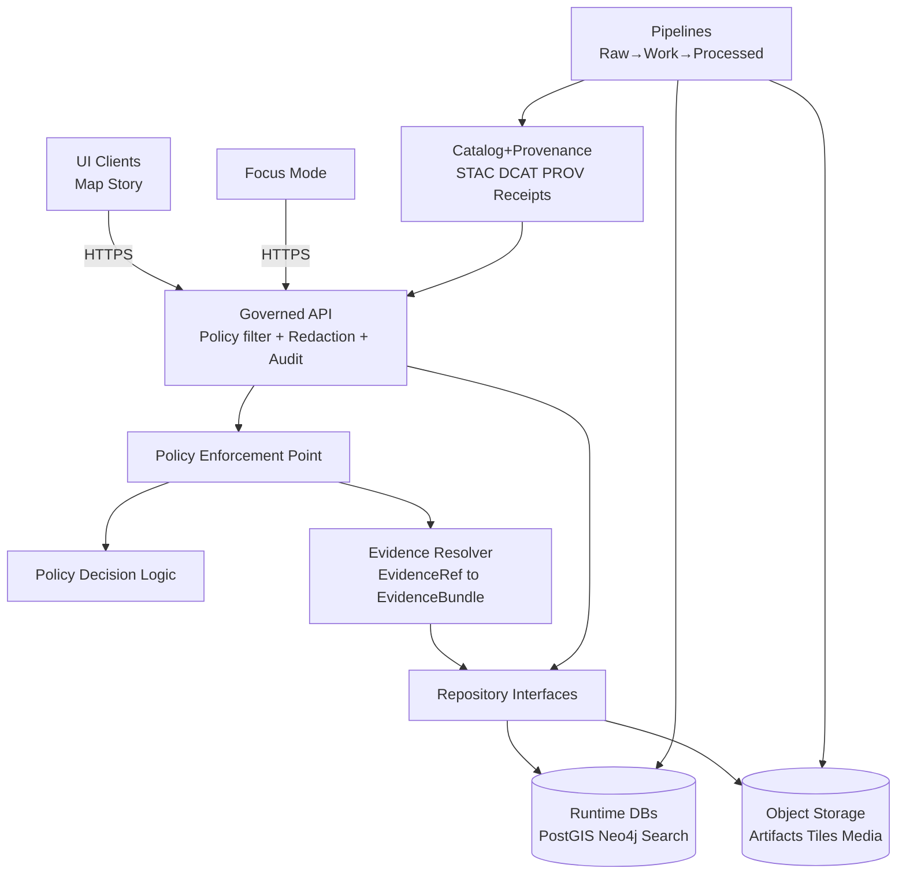

<!-- [KFM_META_BLOCK_V2]
doc_id: kfm://doc/791cd624-436f-470a-b07f-848727d6e669
title: Trust membrane
type: standard
version: v1
status: draft
owners: ["TBD: Architecture + Governance"]
created: 2026-03-04
updated: 2026-03-04
policy_label: public
related:
  - docs/architecture/
  - docs/governance/
  - docs/specs/api/
tags: [kfm, architecture, governance, security, policy, trust]
notes:
  - "Defines the KFM trust membrane invariant and the minimum enforcement expectations."
[/KFM_META_BLOCK_V2] -->

# Trust membrane

One-line purpose: **Define and enforce the “trust membrane” boundary so policy, provenance, and evidence guarantees remain valid end-to-end.**

---

## Impact

**Status:** draft  
**Owners:** TBD (Architecture + Governance)  
**Last updated:** 2026-03-04  

 <!-- TODO: replace -->
 <!-- TODO: replace -->
 <!-- TODO: replace -->

**Quick links**
- [Definition](#definition)
- [Non-negotiable invariants](#non-negotiable-invariants)
- [Architecture](#architecture)
- [Allowed and disallowed flows](#allowed-and-disallowed-flows)
- [Enforcement](#enforcement)
- [Verification](#verification)
- [Definition of done](#definition-of-done)

---

## Scope

### In scope
- The trust membrane invariant (what it means and why it exists)
- Minimum enforcement expectations (runtime, CI, and operational)
- How the governed API + evidence resolver uphold the membrane
- How UI/Focus Mode behavior must “fail closed” without leaking restricted information

### Out of scope
- Full policy authoring (belongs in `docs/governance/`)
- Detailed network topology per environment (document in infra repo / runbook)
- Full endpoint specifications (belongs in `docs/specs/api/`)

---

## Evidence discipline used in this doc

Every meaningful claim is labeled:

- **CONFIRMED** — asserted as an invariant in the KFM vNext guide.
- **PROPOSED** — recommended implementation pattern; adopt via governed decision (ADR/PR).
- **UNKNOWN** — requires verification against repo/runtime; includes smallest verification steps.

---

## Definition

**CONFIRMED:** The **trust membrane** is the **security and governance boundary** that prevents bypassing policy enforcement and preserves trustworthy provenance.

Practically, it means:

- Clients can’t talk to storage directly.
- Backend “core logic” can’t quietly bypass the repository/adapter layer.
- **All reads/writes that could affect user-visible outputs must cross a governed API boundary** that applies policy decisions, redactions, and logging consistently.

If the membrane is broken, **policy cannot be enforced** and **provenance cannot be trusted**.

---

## Where it fits

KFM’s “truth path” lifecycle culminates in **Published** surfaces (API + UI). The trust membrane sits at the boundary between “Published surfaces” and the underlying data/index stores.

**CONFIRMED:** KFM expects governed APIs to be the enforcement boundary and expects runtime stores (DB/search) to be treated as projections rebuildable from promoted artifacts.

---

## Non-negotiable invariants

### Invariant TM-1: No direct client-to-storage access
**CONFIRMED:** *Frontend and external clients never access databases or object storage directly.*

**Implication:** any UI feature that needs data must call the governed API (including tiles, evidence bundles, story content, and Focus Mode interactions).

### Invariant TM-2: No backend storage bypass
**CONFIRMED:** *Core backend logic never bypasses repository interfaces to talk directly to storage.*

**Implication:** enforce a repository/adapter layer, and block “shortcut” data access in code review + CI.

### Invariant TM-3: All access flows through governed APIs
**CONFIRMED:** *All access flows through governed APIs that apply policy decisions, redactions, and logging consistently.*

**Implication:** policy filtering must happen server-side **before** returning assets/results; audit output is required for governed operations.

---

## Architecture

### Minimal conceptual components

- **UI clients** (Map Explorer, Story viewer, admin tools)
- **Focus Mode** (governed Q&A; must behave like an evidence workflow, not a general chatbot)
- **Governed API** (contract-first enforcement boundary)
- **Policy decision + enforcement** (PDP/PEP model; implementation may vary)
- **Evidence resolver** (`/evidence/resolve`) that converts `EvidenceRef` → `EvidenceBundle` (policy-scoped, reproducible)
- **Repositories/adapters** (data access layer)
- **Runtime stores** (PostGIS, Neo4j, search index) and **object storage**
- **Catalog + provenance surfaces** (STAC/DCAT/PROV + receipts) as the canonical trust surface

### Data flow diagram

---

## Allowed and disallowed flows

> This table is normative for architecture reviews.

| Flow | Allowed | Label | Why |
|---|---:|---|---|
| UI → Governed API → Repos → Stores | ✅ | **CONFIRMED** | Policy + redaction + logging applied consistently |
| Focus Mode → Governed API → Evidence resolver → Stores | ✅ | **CONFIRMED** | Same policy boundary as UI; citations/abstention enforced |
| UI → Object storage direct (public-only static assets) | ⚠️ | **PROPOSED** | Allowed only if policy-safe by construction (e.g., truly public, immutable, no secret-bearing URLs) |
| UI → DB/Search direct | ❌ | **CONFIRMED** | Breaks membrane; bypasses policy and audit |
| API handler → DB client directly (skipping repository) | ❌ | **CONFIRMED** | Violates TM-2; enables bypass paths |
| Browser receives unverified/unsanitized evidence links | ❌ | **PROPOSED** | Prevents leakage; browser should see policy-safe, verified outputs |

---

## Governed API responsibilities

**CONFIRMED:** The governed API is the enforcement boundary. It must apply:

- policy decisions (allow/deny, obligations)
- redactions and generalization
- versioning semantics
- evidence resolution consistency
- audit and observability (who/what/when/why + digests + decision reasons)

### Error behavior

**CONFIRMED:** Avoid leaking sensitive existence through error differences. Align 403/404 behavior with policy.  
**PROPOSED:** Use a stable error model with:
- `error_code`
- policy-safe `message`
- `audit_ref`
- optional remediation hints (policy-safe)

---

## Evidence resolver responsibilities

**CONFIRMED:** A “citation” in KFM is not a pasted URL; it is an `EvidenceRef` that resolves into an `EvidenceBundle` containing metadata, artifacts, and provenance needed to inspect/reproduce a claim.

**CONFIRMED:** Focus Mode and Story publishing must have a **hard gate**:
- every citation must resolve, and
- be policy-allowed,
- otherwise the system narrows scope or abstains.

---

## UI and UX obligations at the membrane

### Abstention is a feature

**CONFIRMED:** The UI must make abstention understandable **without leaking restricted info**:

- show “why” in policy-safe terms (e.g., “restricted evidence not available to your role”)
- suggest safe alternatives (broader time range, public datasets)
- provide `audit_ref` so stewards can review

**CONFIRMED:** Never show “ghost metadata” that reveals restricted existence unless policy allows.

### Evidence drawer is a primary trust surface

**CONFIRMED:** The evidence view should surface (at minimum):

- dataset version (immutable ID)
- license/rights holder
- policy label + redactions/generalizations applied
- provenance chain (receipt/activity)
- artifact links + checksums

---

## Enforcement

The trust membrane is only real if it is enforced at multiple layers.

### Enforcement layers

| Layer | What we enforce | Minimum mechanism |
|---|---|---|
| Runtime (network) | Clients cannot reach DB/object storage directly | **PROPOSED:** private subnets, firewall rules, service-to-service auth |
| Runtime (API) | All access policy-filtered server-side | **CONFIRMED** concept; **PROPOSED** implementation details |
| Code architecture | No storage bypass (TM-2) | **PROPOSED:** repository interfaces, lint rules, banned imports, codeowners |
| CI (merge gates) | Policy + schema + resolver contract must pass | **CONFIRMED**: contract tests & CI validation expectations exist |
| Ops (auditability) | Every governed op emits an auditable record | **CONFIRMED**: audit requirements exist |
| UX (no leaks) | No existence/metadata leaks via UI behaviors | **CONFIRMED**: abstention + anti-ghost-metadata guidance |

### Merge-blocking gates that protect the membrane

**CONFIRMED (minimum checks exist):**
- catalog/provenance validation (STAC/DCAT/PROV)
- cross-link validation (links exist and resolve in repo context)
- evidence resolver contract tests (public resolves; restricted returns policy-safe denial)
- deterministic/spec hash stability checks (“golden tests”)

**PROPOSED:**
- static analysis to forbid DB drivers in UI packages
- dependency rules to forbid UI importing repository/store modules
- integration test to assert DB/storage are unreachable from browser container/network

---

## Verification

### CI contract tests

**CONFIRMED:** Evidence resolver contract tests must include:
- “public” evidence resolves to bundle with allowed artifacts
- “restricted” evidence returns 403 with no sensitive metadata leakage
- spec-hash stability and deterministic outputs (“golden tests”)

### Minimal verification steps for UNKNOWNs

If you need to move “UNKNOWN repo state” → “CONFIRMED implementation,” perform the smallest checks:

1. **Check network boundary**
   - Attempt direct DB/object store access from the UI runtime environment (should fail).
2. **Check code boundary**
   - Search for direct DB clients in API handlers (should route through repositories).
3. **Check policy gates**
   - Ensure policy tests are merge-blocking on the default branch.
4. **Check end-to-end evidence resolution**
   - Click feature → resolve evidence → open bundle (public)
   - Attempt restricted evidence → must return policy-safe abstention + `audit_ref`

---

## Common failure modes

- **Policy bypass via direct DB/storage access**  
  **CONFIRMED risk:** treat as high impact; mitigate with network policies, reviews, and tests.

- **Sensitive leakage via receipts/logs/UI differences**  
  **PROPOSED mitigation:** classify/redact logs and receipts; keep UI errors policy-safe and consistent.

- **“Green badge” trust confusion**  
  **PROPOSED mitigation:** “trust indicators” must link to evidence bundle and show scope/limits.

---

## Definition of done

> Use this checklist before calling the trust membrane “implemented.”

- [ ] **TM-1 enforced:** UI/external clients cannot access DB/object storage directly (verified).
- [ ] **TM-2 enforced:** API core logic does not bypass repository interfaces (lint/tests).
- [ ] **TM-3 enforced:** All relevant reads/writes go through governed APIs with policy + redaction + audit.
- [ ] Evidence resolver exists and passes contract tests (public resolves; restricted denies safely).
- [ ] Merge-blocking CI gates exist for policy + schema + link + resolver contract checks.
- [ ] UI demonstrates abstention behavior without leaking restricted existence and includes `audit_ref`.
- [ ] Audit logs emitted for governed operations; log sensitivity + retention documented.
- [ ] One end-to-end vertical slice demonstrates: dataset discovery → evidence resolve → Focus ask → citations or abstain.

---

## Appendix

Suggested ADR topics for adopting PROPOSED items

- PDP/PEP implementation choice (OPA/Rego vs alternative) and where it runs
- Network boundary patterns per environment (local dev vs production)
- Static hosting policy model for truly public PMTiles/assets
- “Trust badge” semantics and UX copy standards for abstention and restricted layers
- Receipt/log classification strategy and redaction obligations

---

Back to top: [Trust membrane](#trust-membrane)
