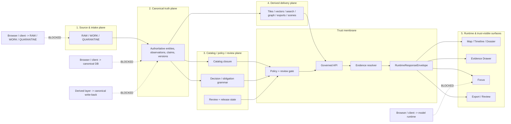

<!-- [KFM_META_BLOCK_V2]
doc_id: <TBD: assign kfm://doc/uuid>
title: Trust Membrane
type: standard
version: v1
status: draft
owners: <TBD: architecture / platform / governance owners>
created: <TBD: YYYY-MM-DD>
updated: <TBD: YYYY-MM-DD>
policy_label: <TBD: public|restricted|...>
related: [<TBD: docs/architecture/system_overview.md>, <TBD: docs/policy/...>, <TBD: docs/runbooks/...>]
tags: [kfm, architecture, governance, trust-membrane, evidence]
notes: [Current-session workspace evidence was PDF-only; owner, related-path, and date fields remain review placeholders until mounted repo verification.]
[/KFM_META_BLOCK_V2] -->

# Trust Membrane

Architectural law for keeping public and role-limited KFM surfaces downstream of governed evidence, policy, release, and correction state.

> [!IMPORTANT]
> **CONFIRMED doctrine:** the trust membrane is a core KFM invariant. Public and role-limited trust-visible surfaces do **not** bypass governed APIs, policy evaluation, or evidence resolution.
>
> **NEEDS VERIFICATION:** current-session direct workspace evidence was PDF-only. Exact repo-local owners, route trees, schema files, workflow YAMLs, manifests, and runtime traces remain **UNKNOWN** unless directly reverified in mounted repository code.

**Quick jump:** [Definition](#definition) · [Five-plane boundary model](#five-plane-boundary-model) · [Dependency laws](#dependency-laws) · [Allowed vs blocked flows](#allowed-vs-blocked-flows) · [Trust objects](#trust-objects-that-cross-the-membrane) · [Surface consequences](#surface-consequences) · [Verification checklist](#verification-checklist) · [Open verification items](#open-verification-items)

---

## Status snapshot

| Item | Status | Meaning here |
| --- | --- | --- |
| Doctrinal status | **CONFIRMED** | The membrane is a load-bearing KFM law, not an optional hardening layer. |
| Recent corpus reinforcement | **CONFIRMED** | Recent March 2026 overlays intensify artifactization, Evidence Drawer centrality, bounded Focus behavior, and hydrology-first proof sequencing. |
| Repo-fit precision | **PARTIALLY CONFIRMED** | Attached repo-grounded evidence confirms several documentation surfaces, but not executable schema or CI proof. |
| Live implementation depth | **UNKNOWN** | No mounted repo checkout, runtime logs, deployment manifests, or emitted proof objects were directly inspected in this session. |
| Immediate proving move | **PROPOSED** | Contract core + policy registries + valid/invalid fixtures + one hydrology thin slice. |

## Truth posture used in this document

| Label | How it is used here |
| --- | --- |
| **CONFIRMED** | Directly supported by the attached KFM corpus or the attached repo-grounded summary artifact. |
| **INFERRED** | Conservative structural completion strongly implied by repeated KFM doctrine, but not directly verified as mounted implementation. |
| **PROPOSED** | Recommended realization, starter artifact family, or sequencing move. |
| **UNKNOWN** | Not verified strongly enough in the current session to claim as current repo or runtime fact. |
| **NEEDS VERIFICATION** | Important enough to name now, but still waiting on mounted code, tests, manifests, or live proof objects. |

---

## Definition

The **trust membrane** is the governed boundary between KFM internals and every outward-facing value the system emits: map portrayals, dossier fields, story excerpts, exports, and bounded runtime answers.

It is not only a network rule and not only an API style. It is the combined law that says outward behavior must remain downstream of:

1. **promoted scope**
2. **policy evaluation**
3. **evidence resolution**
4. **release and freshness state**
5. **surface-state visibility**
6. **correction lineage**

If any of those are missing, stale, unresolved, or policy-unsafe, the system fails closed instead of improvising.

## Why the membrane exists

KFM treats the **inspectable claim** as the unit of value, not the tile, chart, card, graph edge, summary, or answer. The membrane exists so convenience layers never quietly become sovereign truth.

Without it:

- a UI can bypass policy because it is “just reading”
- a derived cache can be mistaken for authority because it is fast
- a model runtime can emit plausible prose without inspectable support
- a correction can remain invisible while stale claims stay live
- publication can look successful even when review, rights, sensitivity, or documentation gates are unresolved

With it, outward confidence stays subordinate to evidence, policy, release state, and correction state.

---

## Five-plane boundary model

## Plane responsibilities and write rights

| Plane | Primary responsibility | Who may write | Must not bypass or mutate |
| --- | --- | --- | --- |
| **1. Source & intake** | Source descriptors, raw captures, ingest receipts, validation, quarantine routing | Connectors and ingestion workers only | No public reads. No direct browser path. No canonical write from UI. |
| **2. Canonical truth** | Canonical entities, observations, features, claims, immutable dataset versions | Canonical pipelines and approved repair lanes only | No direct client reads. No derived write-back into authority. |
| **3. Catalog / policy / review** | Catalog closure, rights and sensitivity decisions, review records, release manifests, correction governance | Catalog compiler, policy lane, and approver roles only | No public publication without gate closure. No self-approval on policy-significant actions. |
| **4. Derived delivery** | Maps, tiles, search, graph, vector, scene, export, projection receipts | Projection and packaging workers only | Derived materializations may not silently become authoritative truth. |
| **5. Runtime and trust-surfaces** | Governed API, `EvidenceBundle` resolution, Focus coordination, web shell, review console, ops endpoints | Runtime services may emit response and audit objects; no canonical writes | No store bypass. No uncited answer path. No hidden correction state. |

---

## Dependency laws

The membrane stays real only when these laws remain intact:

- Public or external surfaces may read **only** through the governed API and **only** within promoted scope.
- Derived delivery depends on authoritative versions and release state; authoritative truth never depends on derived caches for its own validity.
- Policy and review outputs must exist **before** public-safe publication, not as retroactive annotations.
- Runtime answering depends on resolved evidence, citation checks, and policy checks **before** synthesis or abstention.
- Correction travels forward through the same object graph and remains visible at trust surfaces.

## Non-negotiable rules

| Rule | Operational consequence |
| --- | --- |
| **Governed API only** | Public and role-limited surfaces do not read canonical stores, raw zones, or unpublished candidates directly. |
| **Evidence is operational** | Every consequential outward value remains one hop away from inspectable evidence. |
| **Derived layers stay derived** | Graph, search, vector, tile, scene, cache, and summary layers remain rebuildable unless explicitly promoted. |
| **Focus remains bounded** | Focus is retrieval-bounded, citation-checked, policy-checked, and limited to finite outcomes. |
| **Promotion gates publication** | A successful query is not enough; release, review, rights, sensitivity, freshness, and documentation gates still apply. |
| **Correction remains visible** | Supersession, withdrawal, narrowing, replacement, and stale-visible states must propagate to trust-visible surfaces. |
| **3D inherits the same burden** | Controlled 3D never becomes a second, looser truth regime; it carries the same evidence, audit, release, and correction requirements as 2D. |

---

## Allowed vs blocked flows

### Allowed

| Flow | Why it is allowed |
| --- | --- |
| Public shell → governed API → evidence-backed response | Keeps outward claims downstream of promoted scope and evidence resolution. |
| Review shell → governed API → catalog/policy/review plane | Allows moderation, denial, promotion, rollback, and rights handling without membrane bypass. |
| Projection worker → promoted release scope → tile/search/vector/scene outputs | Derived delivery is allowed when it is provably downstream of promoted scope. |
| Focus request → resolver + policy checks + citation verification → runtime envelope | Bounded synthesis is allowed when the membrane stays intact. |
| Export request → release scope + preview policy + correction linkage | Artifact generation is allowed only as public-safe outward publication. |

### Blocked

| Flow | Why it is blocked |
| --- | --- |
| Browser/UI → canonical PostgreSQL/PostGIS or equivalent truth store | Bypasses governed API, policy, and evidence resolution. |
| Browser/UI → RAW / WORK / QUARANTINE files or object store | Exposes source-native or candidate material outside governed publication state. |
| Browser/UI → model runtime directly | Allows uncited or policy-unchecked answers to appear authoritative. |
| Derived delivery layer → canonical write-back | Collapses authority and derivative convenience into one layer. |
| Story / Focus / export surface → uncited best-effort claim | Violates cite-or-abstain and fail-closed posture. |
| Hidden correction that leaves stale public surfaces unchanged | Breaks visible lineage and operational trust. |

---

## Trust objects that cross the membrane

The membrane is easiest to govern when it is crossed by typed, inspectable objects rather than ad hoc payloads.

| Trust object | Minimum job | Why it matters at the membrane |
| --- | --- | --- |
| `SourceDescriptor` | Declares source identity, access mode, rights posture, support, cadence, validation plan, publication intent | Prevents unknown intake assumptions from leaking downstream. |
| `IngestReceipt` | Proves fetch and landing occurred | Gives the membrane a reconstructible intake trail. |
| `ValidationReport` | Records checks passed, failed, or quarantined | Supports fail-closed publication and review. |
| `DatasetVersion` | Carries authoritative candidate or promoted subject set | Keeps outward claims tied to versioned authority. |
| `CatalogClosure` | Publishes STAC / DCAT / PROV closure and outward linkage | Makes discovery and lineage resolvable instead of rhetorical. |
| `DecisionEnvelope` | Records machine-readable policy result, reason codes, obligation codes, audit linkage | Makes “why this was allowed / denied / generalized” explicit. |
| `ReviewRecord` | Captures human approval, denial, escalation, or note | Preserves separation of duty and visible governance. |
| `ReleaseManifest` / `ReleaseProofPack` | Assembles public-safe release and proof | Prevents publication from collapsing into “query succeeded.” |
| `ProjectionBuildReceipt` | Proves a derived layer was built from known release scope | Keeps maps, search, graph, vectors, exports, and scenes subordinate to release state. |
| `EvidenceBundle` | Packages support for a claim, feature, story, export preview, or answer | This is the membrane’s central explainability object. |
| `RuntimeResponseEnvelope` | Makes runtime outcome accountable | Carries result, surface class, surface state, citation check, decision ref, and audit ref. |
| `CorrectionNotice` | Preserves visible lineage under change | Forces correction to travel forward across trust surfaces. |

---

## Runtime outcomes and visible surface states

### Primary outward outcomes

| Outcome | Meaning |
| --- | --- |
| `ANSWER` | Evidence-backed, policy-safe, citation-checked response |
| `ABSTAIN` | Scope is too weak, partial, unresolved, or unsupported for a valid answer |
| `DENY` | Policy blocks the requested action or surface |
| `ERROR` | The system could not complete the request within governed constraints |

### Surface states that must remain visible

`promoted`, `generalized`, `partial`, `stale-visible`, `source-dependent`, `conflicted`, `withdrawn`, `denied`, `abstained`

> [!WARNING]
> Missing or non-resolvable evidence, unknown rights, unresolved sensitivity, schema/support failure, missing review or documentation gate, or runtime citation-verification failure must stop outward confidence rather than merely soften the wording.

---

## Surface consequences

> [!TIP]
> In product terms, the **Evidence Drawer** is the trust membrane made inspectable.

| Surface | Membrane consequence |
| --- | --- |
| **Map Explorer** | Must show time scope, layer state, freshness, and a route to evidence. |
| **Timeline** | Must expose valid-time labels, event grain, compare anchors, and stale-state cues. |
| **Dossier** | Must stay tied to identity, dependencies, service areas, hazard/water context, gap notes, and evidence links. |
| **Story surface** | Must remain evidence-linked, dated, review-aware, and correction-aware. |
| **Evidence Drawer** | Must expose `EvidenceBundle` members, quote context, transforms, release state, and preview limits. |
| **Focus Mode** | Must remain scoped, citation-checked, audit-linked, and limited to finite outcomes. |
| **Review / Stewardship** | Must expose policy labels, review notes, diffs, receipts, and no hidden approvals. |
| **Compare** | Must preserve explicit geography/time anchor and explicit comparison basis. |
| **Export** | Must inherit release scope, evidence linkage, preview policy, and correction linkage. |
| **Classroom / Civic variant** | Must follow the same truth rules on a simplified but not epistemically separate substrate. |
| **Controlled 3D** | Must inherit the same evidence, audit, policy, release, and correction semantics as 2D. |

---

## Operational consequences

### Network and service posture

The membrane implies that public surfaces, governed public APIs, and model-enabled runtime features may be externally reachable **only** through governed interfaces. Canonical databases, source-native stores, raw zones, and local model runtimes stay private, loopback-bound, or otherwise restricted behind the membrane.

### Local-first phase-one posture

A smallest credible first runtime keeps:

- canonical truth in PostgreSQL/PostGIS or another governed canonical store
- artifact zones separated across `RAW -> WORK/QUARANTINE -> PROCESSED -> CATALOG -> PUBLISHED`
- one governed API on loopback or private network
- ingest/build/publish/projection work in explicit jobs
- local-only model runtime behind a replaceable adapter
- **no direct client path** to canonical storage, artifact tree, or model runtime

### Blast-radius control

As maturity grows, the membrane should make it easier to separate:

- public edge
- governed API
- policy decision point
- evidence resolver
- workers
- canonical stores
- derived delivery
- model serving

without weakening doctrine or blurring accountability.

---

## Repo attachment notes (verification required)

> [!NOTE]
> The table below mixes **CONFIRMED repo documentation surfaces** from the attached repo-grounded summary with **PROPOSED first executable artifacts** from the doctrine corpus. It is a placement aid, not a claim that every listed file already exists.

| Confidence | Candidate path or surface | Why it belongs near the membrane |
| --- | --- | --- |
| **CONFIRMED repo doc surface** | `contracts/` | Existing documentation surface; likely one candidate home for the contract lattice. |
| **CONFIRMED repo doc surface** | `schemas/` | Existing documentation surface; authority vs `contracts/` remains unresolved. |
| **CONFIRMED repo doc surface** | `policy/` | Existing documentation surface for deny-by-default posture and decision grammar. |
| **CONFIRMED repo doc surface** | `tests/` | Existing intent surface for fixtures, negative-path proofs, and runtime proof families. |
| **CONFIRMED repo doc surface** | `.github/workflows/` | Existing workflow intent surface; merge-blocking YAML gate remains unverified. |
| **PROPOSED first executable file** | `contracts/runtime/evidence_bundle.schema.json` | Makes evidence drill-through machine-checkable. |
| **PROPOSED first executable file** | `contracts/runtime/runtime_response_envelope.schema.json` | Makes outward runtime outcomes testable. |
| **PROPOSED first executable file** | `contracts/policy/decision_envelope.schema.json` | Makes allow / deny / generalize decisions explicit. |
| **PROPOSED first executable file** | `contracts/correction/correction_notice.schema.json` | Makes visible lineage under change enforceable. |
| **PROPOSED first executable file** | `policy/reason_codes.json` | Stabilizes why something was denied, generalized, or held. |
| **PROPOSED first executable file** | `policy/obligation_codes.json` | Stabilizes what the system must do next: `generalize`, `withhold`, `cite`, `review_required`, and related obligations. |
| **PROPOSED first executable file** | `ui/trust_states.md` | Keeps the shell from bluffing when trust is partial. |
| **PROPOSED first executable file** | `ui/evidence_drawer_payloads.json` | Forces the Evidence Drawer to stay contract-backed rather than ad hoc. |

---

## Verification checklist

Use this as the minimum review gate for membrane-related work.

- [ ] Public or role-limited surfaces read only through a governed API.
- [ ] No client path exists to canonical truth stores, RAW/WORK/QUARANTINE areas, or local model runtime.
- [ ] `EvidenceRef` resolves to a policy-safe `EvidenceBundle`.
- [ ] Every outward runtime path emits a `RuntimeResponseEnvelope` or equivalent contract-checked object.
- [ ] `ANSWER`, `ABSTAIN`, `DENY`, and `ERROR` are all exercised and inspectable.
- [ ] Surface states such as `generalized`, `partial`, `stale-visible`, `denied`, and `withdrawn` are visible in-place.
- [ ] Derived layers prove release linkage and do not back-write authority.
- [ ] Correction propagates across map, dossier, story, export, compare, and Focus surfaces.
- [ ] Rights, sensitivity, and precision controls are tested on public-safe and generalized cases.
- [ ] Documentation, accessibility, and release gates block publication when required proof objects are missing.

---

## Open verification items

These remain explicit because current-session direct workspace evidence did **not** include a mounted repo checkout.

| Item | Why it matters | Direct verification needed |
| --- | --- | --- |
| Current repo tree and module inventory | Path-level statements remain speculative until code is visible. | Surface the current repository tree and module list. |
| Current schema and contract inventory | Executable contract claims remain target state until real files are visible. | Surface schema directories, valid examples, invalid fixtures, and validation tests. |
| Workflow / CI inventory | Merge-blocking trust checks remain unknown. | Export CI configs, workflow catalog, and recent run evidence. |
| Deployment manifests / overlays | Ingress, rollout, and secrets posture are unverified. | Surface Compose, systemd, Helm, or Kubernetes manifests and overlays. |
| `EvidenceBundle` / `EvidenceRef` resolver | Central to runtime explainability and abstention/denial behavior. | Publish resolver contracts, schemas, and one positive + one negative trace. |
| Release proof-pack implementation | Promotion and rollback remain conceptual without one real proof artifact. | Surface one real release receipt or proof pack. |
| Runtime response envelope samples | Cite-or-abstain / deny / error semantics need direct proof. | Surface one evaluated sample for each primary outcome. |
| Rights / sensitivity workflows | Public-safe release depends on them, especially for archaeology, biodiversity, oral history, and exact-location cases. | Surface publication classes, steward drawer payloads, and generalized-vs-precise comparison flow. |

---

## Anti-patterns to reject

| Anti-pattern | Why it violates the membrane |
| --- | --- |
| “Read-only” UI access straight to canonical DB | Read-only can still publish unsafe, stale, or policy-unchecked values. |
| Derived cache treated as de facto truth | Collapses authoritative-versus-derived separation. |
| Public Focus hitting model runtime directly | Produces uncited, unreviewed, policy-unsafe answers. |
| Story/export built from unpublished candidates | Breaks promotion law and release proof. |
| Hidden correction handled only in backend logs | Leaves public trust surfaces stale while appearing current. |
| 3D surface with weaker evidence/policy semantics than 2D | Creates a second, less-governed epistemic system. |
| “We’ll attach provenance later” | Treats evidence as annotation instead of an operational endpoint. |

---

<strong>Appendix A — concise glossary</strong>

| Term | Working meaning |
| --- | --- |
| **Authoritative truth** | Governed, versioned canonical record of fact, geometry, time semantics, rights posture, and publication state |
| **Derived projection** | Rebuildable delivery or retrieval layer such as graph, search, vector, tile, dashboard, cache, scene, or summary |
| **Public-safe** | Release state that has passed rights, sensitivity, precision, and visibility checks for the relevant audience |
| **EvidenceBundle** | Request-time package of supporting records, release references, lineage hints, rights/sensitivity state, transform receipts, and preview policy |
| **DecisionEnvelope** | Machine-readable policy result with subject, action, lane, result, reason codes, obligation codes, policy basis, and audit linkage |
| **Surface state** | User-visible trust state such as promoted, generalized, partial, stale-visible, denied, abstained, or withdrawn |
| **Thin slice** | Smallest end-to-end governed implementation that proves the architecture on real evidence rather than prose alone |

<strong>Appendix B — example membrane walkthroughs</strong>

### Example: map click to Evidence Drawer

1. A user clicks a map feature.
2. The shell calls the governed API, not the canonical store.
3. The API resolves promoted scope and policy state.
4. The evidence resolver reconstructs an `EvidenceBundle`.
5. The shell opens the Evidence Drawer with evidence members, transform context, release state, and preview limits.
6. If resolution fails, the surface emits a visible negative state instead of a confident bluff.

### Example: Focus request

1. A scoped request arrives with place, time, role, and release window.
2. Retrieval resolves admissible evidence.
3. Citation verification and policy checks run before synthesis.
4. The runtime emits `ANSWER`, `ABSTAIN`, `DENY`, or `ERROR`.
5. The response is wrapped in a `RuntimeResponseEnvelope` with audit linkage and visible surface state.

[Back to top](#trust-membrane)
