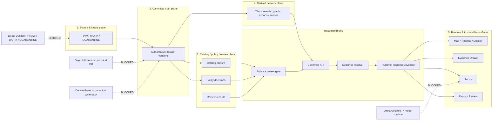

<!-- [KFM_META_BLOCK_V2]
doc_id: <TBD: assign kfm://doc/uuid>
title: Trust Membrane
type: standard
version: v1
status: draft
owners: <TBD: architecture / platform / governance owners>
created: <TBD: YYYY-MM-DD>
updated: <TBD: YYYY-MM-DD>
policy_label: <TBD: public|restricted|...>
related: [<TBD: docs/architecture/system_overview.md>, <TBD: docs/policy/...>, <TBD: docs/runbooks/...>]
tags: [kfm, architecture, governance, trust-membrane, evidence]
notes: [Current-session workspace evidence was PDF-only; owner, related-path, and date fields remain review placeholders until mounted repo verification.]
[/KFM_META_BLOCK_V2] -->

# Trust Membrane

Architectural law for keeping public and role-limited KFM surfaces downstream of governed evidence, policy, release, and correction state.

> [!IMPORTANT]
> **CONFIRMED doctrine:** the trust membrane blocks direct client or UI bypass of governed APIs, policy evaluation, and evidence resolution.
>
> **NEEDS VERIFICATION:** current-session workspace evidence was PDF-only. Exact repo-local bindings, filenames, owners, route trees, schemas, workflows, and manifests remain **UNKNOWN** unless directly verified in mounted code.

**Quick jump:** [Definition](#definition) · [Boundary model](#boundary-model) · [Non-negotiable rules](#non-negotiable-rules) · [Allowed vs blocked flows](#allowed-vs-blocked-flows) · [Trust objects](#trust-objects-that-cross-the-membrane) · [Verification](#verification-checklist) · [Open verification items](#open-verification-items)

---

## Status snapshot

| Item | Status | Meaning here |
| --- | --- | --- |
| Doctrinal status | **CONFIRMED** | The membrane is a core KFM invariant, not an optional hardening layer. |
| Repo-local attachment | **PROPOSED / NEEDS VERIFICATION** | Suggested paths and follow-on artifacts are starter placements, not mounted facts. |
| Implementation depth | **UNKNOWN** | No repo checkout, schema inventory, workflow YAML, or runtime logs were directly inspected in this session. |
| Primary outward outcomes | **CONFIRMED** | Runtime trust surfaces emit only `ANSWER`, `ABSTAIN`, `DENY`, or `ERROR`. |
| Product consequence | **CONFIRMED** | Map, timeline, dossier, Evidence Drawer, Focus, export, and review surfaces inherit the membrane. |
| Immediate next proving move | **PROPOSED** | Contract core + policy registries + fixtures + one hydrology thin slice. |

---

## Definition

The **trust membrane** is the governed boundary between KFM internals and every outward-facing value the system emits: map portrayals, dossier fields, story excerpts, export previews, and bounded runtime answers.

It is not only a network rule, and not only an API design style. It is the combined law that says outward behavior must pass through:

1. **promoted scope**
2. **policy evaluation**
3. **evidence resolution**
4. **release and freshness state**
5. **surface-state visibility**
6. **correction lineage**

If any of those are missing, stale, unresolved, or policy-unsafe, the system fails closed instead of improvising.

---

## Why the membrane exists

KFM treats the inspectable claim as the unit of value, not the dashboard card, tile, search hit, graph edge, model answer, or 3D scene. The trust membrane exists so that convenience layers never quietly become sovereign truth.

Without it:

- a UI can bypass policy because it is “just reading”
- a derived cache can be mistaken for authority because it is fast
- a model runtime can emit plausible prose without inspectable support
- a correction can remain invisible while stale claims stay live
- publication can look successful even when review, rights, or evidence state are unresolved

With it, outward confidence stays subordinate to evidence, policy, and release state.

---

## Boundary model

---

## Five-plane interaction table

| Plane | Primary responsibility | Who may write | Membrane consequence |
| --- | --- | --- | --- |
| **1. Source & intake** | Source descriptors, raw captures, ingest receipts, validation, quarantine routing | Connectors and ingestion workers only | No public reads. No direct browser path. No canonical write from UI. |
| **2. Canonical truth** | Authoritative entities, observations, features, claims, immutable dataset versions | Canonical pipelines and approved repair lanes only | No direct client reads. No derived write-back into authority. |
| **3. Catalog / policy / review** | Catalog closure, rights/sensitivity decisions, review records, release manifests, correction governance | Catalog compiler, policy lane, approver roles only | No publication without gate closure. No self-approval on policy-significant actions. |
| **4. Derived delivery** | Maps, tiles, search, graph, vectors, scenes, exports, projection receipts | Projection and packaging workers only | Derived materializations must never silently become authoritative truth. |
| **5. Runtime & trust-visible surfaces** | Governed API, EvidenceBundle resolution, Focus coordination, shell, review console, ops endpoints | Runtime services may emit response and audit objects; no canonical writes | No store bypass. No uncited answer path. No hidden correction state. |

---

## Non-negotiable rules

### 1. Public and role-limited surfaces read through governed APIs only

No browser, public client, classroom surface, story surface, or Focus pane should speak directly to canonical stores, RAW buckets, WORK areas, or unpublished candidates.

### 2. Evidence is operational, not decorative

The membrane is not satisfied by attaching provenance “later.” Every consequential outward value must remain one hop away from inspectable evidence.

### 3. Policy gates publication, not just writes

A successful query does **not** equal a publishable claim. Rights, sensitivity, freshness, review state, and public-safe transformation still apply.

### 4. Derived layers stay derived

Tiles, vectors, search indexes, graph projections, scenes, caches, embeddings, and summaries are rebuildable convenience layers unless explicitly promoted through governed state change.

### 5. Focus remains evidence-bounded

Focus is not a free-form assistant tab. It is a scoped runtime surface behind the membrane, constrained by evidence resolution, citation verification, policy checks, and finite outcomes.

### 6. Correction remains visible

Supersession, narrowing, withdrawal, replacement, and generalization must propagate forward to trust-visible surfaces rather than disappearing behind a silent data fix.

### 7. 3D does not weaken the membrane

Controlled 3D inherits the same Evidence Drawer, audit linkage, policy chips, release state, and correction state as 2D. It never creates a special truth regime.

---

## Allowed vs blocked flows

### Allowed

| Flow | Why it is allowed |
| --- | --- |
| Public shell → governed API → EvidenceBundle-backed response | Keeps outward claims downstream of promoted scope and evidence resolution. |
| Review shell → governed API → policy/review plane | Allows authorized moderation, denial, promotion, and rollback without bypassing governance. |
| Projection worker → promoted release scope → tile/search/vector/scene outputs | Derived delivery is allowed when it depends only on promoted scope. |
| Focus request → resolver + policy checks + citation verification → runtime envelope | Bounded synthesis is allowed when the membrane stays intact. |
| Export request → release scope + preview policy + correction linkage | Outward artifact generation is allowed only as public-safe publication. |

### Blocked

| Flow | Why it is blocked |
| --- | --- |
| Browser/UI → PostgreSQL/PostGIS canonical truth plane | Bypasses governed API, policy, and evidence resolution. |
| Browser/UI → RAW / WORK / QUARANTINE files or object store | Exposes source-native or candidate material outside governed publication state. |
| Browser/UI → model runtime directly | Allows uncited or policy-unchecked answers to appear authoritative. |
| Derived delivery layer → canonical write-back | Collapses authoritative and derived layers. |
| Story/Focus/export surface → uncited best-effort claim | Violates cite-or-abstain and fail-closed posture. |
| Hidden correction that leaves stale public surfaces unchanged | Breaks lineage and operational trust. |

---

## Trust objects that cross the membrane

The membrane is easiest to govern when it is crossed by typed, inspectable objects rather than ad hoc payloads.

| Trust object | Minimum job | Why it matters at the membrane |
| --- | --- | --- |
| `SourceDescriptor` | Declares source identity, cadence, rights, semantics, validation plan | Prevents unknown or ambiguous intake assumptions from leaking downstream. |
| `IngestReceipt` | Proves fetch and landing occurred | Gives the membrane a reconstructible intake trail. |
| `ValidationReport` | Records checks passed, failed, or quarantined | Supports fail-closed publication and review. |
| `DatasetVersion` | Carries authoritative candidate or promoted subject set | Keeps outward claims tied to versioned authority. |
| `CatalogClosure` | Publishes STAC / DCAT / PROV linkage | Makes discovery and lineage resolvable instead of rhetorical. |
| `DecisionEnvelope` | Records policy result, reason codes, obligation codes, audit linkage | Makes “why this was allowed / denied / generalized” machine-readable. |
| `ReviewRecord` | Captures human approval, denial, escalation, or note | Preserves separation of duty and visible governance. |
| `ReleaseManifest` / `ReleaseProofPack` | Assembles public-safe release and its proof | Prevents publication from becoming “query succeeded.” |
| `ProjectionBuildReceipt` | Proves a derived layer was built from known release scope | Keeps tiles/search/scene outputs subordinate to release state. |
| `EvidenceBundle` | Packages support for a claim, feature, story, export preview, or answer | This is the membrane’s central explainability object. |
| `RuntimeResponseEnvelope` | Makes runtime outcome accountable | Carries result, surface class, citations check, decision ref, and audit ref. |
| `CorrectionNotice` | Preserves visible lineage under change | Forces correction to travel forward across trust surfaces. |

---

## Runtime outcomes and fail-closed behavior

### Primary outward outcomes

| Outcome | Meaning |
| --- | --- |
| `ANSWER` | Evidence-backed, policy-safe, citation-checked response |
| `ABSTAIN` | Scope is too weak, partial, unresolved, or unsupported for a valid answer |
| `DENY` | Policy blocks the requested action or surface |
| `ERROR` | System could not complete the request within governed constraints |

### Surface states that must remain visible

`promoted`, `generalized`, `partial`, `stale-visible`, `source-dependent`, `conflicted`, `withdrawn`, `denied`, `abstained`

> [!WARNING]
> Missing or non-resolvable evidence, unknown rights, unresolved sensitivity, schema/support failure, missing review or documentation gate, or runtime citation-verification failure must stop outward confidence rather than merely soften the wording.

---

## UI consequences

The trust membrane is visible in the shell. It is not a backend-only concept.

| Surface | Membrane consequence |
| --- | --- |
| **Map Explorer** | Must show time scope, layer state, freshness, and route to evidence. |
| **Timeline** | Must expose valid-time labels, event grain, compare anchors, and stale-state cues. |
| **Dossier** | Must stay tied to identity, dependencies, service areas, hazard/water context, gap notes, and evidence links. |
| **Story surface** | Must remain evidence-linked, dated, review-aware, and correction-aware. |
| **Evidence Drawer** | Must expose EvidenceBundle members, quote context, transforms, release state, and preview limits. |
| **Focus** | Must remain scoped, citation-checked, audit-linked, and limited to finite outcomes. |
| **Review / Stewardship** | Must expose policy labels, review notes, receipts, and no hidden approvals. |
| **Export** | Must inherit release scope, evidence linkage, preview policy, and correction linkage. |
| **Controlled 3D** | Must inherit the same evidence, audit, policy, release, and correction semantics as 2D. |

---

## Operational consequences

### Network and service posture

The membrane implies that public surfaces, public APIs, and model-enabled runtime features may be externally reachable **only** through governed interfaces. Canonical databases, source-native stores, and local model runtimes stay private, loopback-bound, or otherwise restricted behind the membrane.

### Local-first phase-one posture

A smallest credible early runtime keeps:

- canonical truth in PostgreSQL/PostGIS
- artifact zones separated across `RAW -> WORK/QUARANTINE -> PROCESSED -> CATALOG -> PUBLISHED`
- one governed API on loopback
- ingest/build/publish/projection work in explicit jobs
- local-only model runtime behind a replaceable adapter
- **no direct client path** to canonical storage, artifact tree, or model runtime

### Blast-radius control

As maturity grows, the membrane should make it easier to separate:

- public edge
- governed API
- policy decision point
- evidence resolver
- workers
- canonical stores
- derived delivery
- model serving

without weakening doctrine.

---

## Verification checklist

Use this as the minimum review gate for membrane-related work.

- [ ] Public or role-limited surfaces read only through a governed API.
- [ ] No client path exists to canonical truth stores, RAW/WORK/QUARANTINE areas, or local model runtime.
- [ ] `EvidenceRef` resolves to a policy-safe `EvidenceBundle`.
- [ ] Every outward runtime path emits a `RuntimeResponseEnvelope` or equivalent contract-checked object.
- [ ] `ANSWER`, `ABSTAIN`, `DENY`, and `ERROR` are all exercised and inspectable.
- [ ] Surface states such as `generalized`, `partial`, `stale-visible`, `denied`, and `withdrawn` are visible in-place.
- [ ] Derived layers prove release linkage and do not back-write authority.
- [ ] Correction propagates across map, dossier, story, export, and Focus surfaces.
- [ ] Rights, sensitivity, and precision controls are tested on public-safe and generalized cases.
- [ ] Documentation, accessibility, and release gates block publication when required proof objects are missing.

---

## Open verification items

These remain explicit because current-session workspace evidence did **not** include a mounted repo checkout.

| Item | Why it matters | Direct verification needed |
| --- | --- | --- |
| Current repo tree and module inventory | Path-level statements remain speculative until code is visible. | Surface the current repository tree and module list. |
| Current schema and contract inventory | Executable contract claims remain target state until real files are visible. | Surface schema directories, valid examples, invalid fixtures, and validation tests. |
| Workflow / CI inventory | Merge-blocking trust checks remain unknown. | Export workflow catalog and recent run evidence. |
| Deployment manifests / overlays | Ingress, rollout, and secret posture are unverified. | Surface Compose, systemd, Helm, or Kubernetes manifests. |
| `EvidenceBundle` / `EvidenceRef` resolver | Central to runtime explainability. | Publish resolver contracts, schemas, and one positive + one negative trace. |
| Release proof-pack implementation | Promotion and rollback remain conceptual without one real proof artifact. | Surface one real release receipt or proof pack. |
| Runtime response envelope samples | Answer/abstain/deny/error behavior needs direct proof. | Surface one evaluated sample for each primary outcome. |
| Rights / sensitivity workflows | Public-safe release depends on them. | Surface publication classes, steward payloads, and generalized-vs-precise comparison flow. |

---

## Proposed repo-local attachment points (starter only)

> [!NOTE]
> The following are **starter attachment points**, not asserted mounted repo facts. Use them only after direct workspace verification.

| Proposed artifact | Purpose |
| --- | --- |
| `contracts/runtime/evidence_bundle.schema.json` | Typed evidence package for outward claims and surfaces |
| `contracts/runtime/runtime_response_envelope.schema.json` | Accountable outward runtime result |
| `contracts/policy/decision_envelope.schema.json` | Machine-readable policy outcome |
| `contracts/correction/correction_notice.schema.json` | Visible lineage under change |
| `policy/reason_codes.json` | Stable deny / abstain / stale / docs-gate / evidence reason vocabulary |
| `policy/obligation_codes.json` | Stable obligation vocabulary such as `generalize`, `withhold`, `cite`, `review_required` |
| `apis/public/openapi.yaml` | Public membrane contract publication |
| `tests/e2e/runtime_proof/*` | Negative-path and citation-proof tests |
| `tests/e2e/correction/*` | Correction visibility and lineage tests |
| `ui/trust_states.md` | Shell-visible state grammar |
| `ui/evidence_drawer_payloads.json` | Starter payload contract for drill-through evidence |

---

## Anti-patterns to reject

| Anti-pattern | Why it violates the membrane |
| --- | --- |
| “Read-only” UI access straight to canonical DB | Read-only can still publish unsafe, stale, or policy-unchecked values. |
| Derived cache treated as de facto truth | Collapses authoritative-versus-derived separation. |
| Public Focus hitting model runtime directly | Produces uncited, unreviewed, policy-unsafe answers. |
| Story/export built from unpublished candidates | Breaks promotion law and release proof. |
| Hidden correction handled only in backend logs | Leaves public trust surfaces stale while appearing current. |
| 3D surface with weaker evidence/policy semantics than 2D | Creates a second, less-governed epistemic system. |
| “We’ll attach provenance later” | Treats evidence as annotation instead of an operational endpoint. |

---

<strong>Appendix A — concise glossary</strong>

| Term | Working meaning |
| --- | --- |
| **Authoritative truth** | Governed, versioned canonical record of fact, geometry, time semantics, rights posture, and publication state |
| **Derived projection** | Rebuildable delivery or retrieval layer such as graph, search, vector, tile, dashboard, cache, scene, or summary |
| **Public-safe** | Release state that has passed rights, sensitivity, precision, and visibility checks for the relevant audience |
| **EvidenceBundle** | Request-time package of supporting records, release references, lineage hints, rights/sensitivity state, transform receipts, and preview policy |
| **DecisionEnvelope** | Machine-readable policy result with subject, action, lane, result, reason codes, obligation codes, policy basis, and audit linkage |
| **Surface state** | User-visible trust state such as promoted, generalized, partial, stale-visible, denied, abstained, or withdrawn |
| **Thin slice** | Smallest end-to-end governed implementation that proves the architecture on real evidence rather than prose alone |

<strong>Appendix B — example membrane walkthrough</strong>

### Example: map click to Evidence Drawer

1. A user clicks a map feature.
2. The shell calls the governed API, not the canonical store.
3. The API resolves promoted scope and policy state.
4. The evidence resolver reconstructs an `EvidenceBundle`.
5. The shell opens the Evidence Drawer with evidence members, transform context, release state, and preview limits.
6. If resolution fails, the surface emits a visible negative state instead of a confident bluff.

### Example: Focus request

1. A scoped request arrives with place, time, role, and release window.
2. Retrieval resolves admissible evidence.
3. Citation verification and policy checks run before synthesis.
4. The runtime emits `ANSWER`, `ABSTAIN`, `DENY`, or `ERROR`.
5. The response is wrapped in a `RuntimeResponseEnvelope` with audit linkage and visible surface state.

[Back to top](#trust-membrane)
