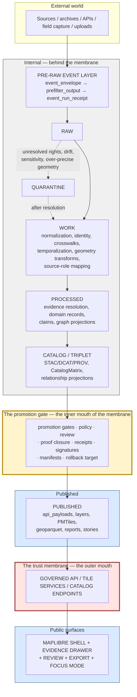

<!-- [KFM_META_BLOCK_V2]
doc_id: kfm://doc/architecture/trust-membrane
title: Trust Membrane — Architectural Construction
type: standard
version: v1
status: draft
owners: <TBD: docs steward + governance lead + map/UI lead>
created: 2026-05-24
updated: 2026-05-24
policy_label: public
related: [
  docs/doctrine/trust-membrane.md,
  docs/doctrine/lifecycle-law.md,
  docs/doctrine/authority-ladder.md,
  docs/doctrine/truth-posture.md,
  docs/doctrine/directory-rules.md,
  docs/architecture/system-context.md,
  docs/architecture/governed-api.md,
  docs/architecture/map-shell.md,
  docs/architecture/maplibre-3d.md,
  docs/architecture/contract-schema-policy-split.md,
  docs/architecture/ui/CONTINUITY_NOTES.md,
  docs/standards/MAP_TRUST_STATES.md,
  docs/standards/EVIDENCE_BUNDLE.md,
  docs/standards/RELEASE_MANIFEST.md,
  docs/standards/PROV/README.md,
  contracts/v1/,
  schemas/contracts/v1/,
  policy/,
  release/
]
tags: [kfm, architecture, trust-membrane, governance, governed-api, lifecycle, evidence-bundle, release-manifest, ai-boundary]
notes: [
  "Architectural explainer of HOW the trust membrane is constructed; complements (does not replace) docs/doctrine/trust-membrane.md which defines WHAT it is.",
  "Casing (UPPERCASE_WITH_UNDERSCORES) is unusual for docs/architecture/ siblings (lowercase-with-hyphens); see §2.3 and Appendix B for placement question.",
  "Anchors on KFM-P1-FEAT-0038 (Governed API as trust membrane), Atlas §24.9.2 (trust-membrane anti-patterns), and Unified Implementation Architecture Build Manual §3 (Foundations) and §4 (whole-system architecture)."
]
[/KFM_META_BLOCK_V2] -->

# Trust Membrane — Architectural Construction

> The components, composition, and boundary contracts that make the **trust membrane** real — how KFM mechanically prevents raw, unreviewed, restricted, or generated state from becoming public truth.

[](#)
[](#)
[](#)
[](#)
[](#)
[](#)
[](#)

| Status | Owners | Last reviewed |
|---|---|---|
| **draft** | _TBD — docs steward + governance lead + map/UI lead_ | 2026-05-24 |

---

> [!CAUTION]
> **This is an architecture explainer, not the doctrine.** The doctrine — *what* the trust membrane is, *why* it exists, what its invariants are — lives at [`docs/doctrine/trust-membrane.md`](../doctrine/trust-membrane.md). This document explains *how* the membrane is constructed: the components, where they sit, what they enforce, and how violations are mechanically prevented. If you find yourself writing about *what the membrane is*, stop and write at `docs/doctrine/trust-membrane.md`. See §2.2.

---

## Quick jump

- [1. Purpose — architecture vs doctrine](#1-purpose--architecture-vs-doctrine)
- [2. Scope, repo fit, and placement question](#2-scope-repo-fit-and-placement-question)
- [3. Authority and standing](#3-authority-and-standing)
- [4. The membrane in one diagram](#4-the-membrane-in-one-diagram)
- [5. The four boundaries the membrane enforces](#5-the-four-boundaries-the-membrane-enforces)
- [6. The five denial surfaces](#6-the-five-denial-surfaces)
- [7. What lives on each side](#7-what-lives-on-each-side)
- [8. The seven cross-cutting foundations](#8-the-seven-cross-cutting-foundations)
- [9. API audience classes as membrane facets](#9-api-audience-classes-as-membrane-facets)
- [10. Anti-patterns the membrane exists to prevent](#10-anti-patterns-the-membrane-exists-to-prevent)
- [11. The membrane in relation to adjacent doctrines](#11-the-membrane-in-relation-to-adjacent-doctrines)
- [12. Verification points — where the membrane is mechanically tested](#12-verification-points--where-the-membrane-is-mechanically-tested)
- [13. Tensions and known limits](#13-tensions-and-known-limits)
- [14. Open questions](#14-open-questions)
- [15. Related docs](#15-related-docs)
- [Appendix A — The membrane as code](#appendix-a--the-membrane-as-code)
- [Appendix B — Placement rationale (doctrine vs architecture)](#appendix-b--placement-rationale-doctrine-vs-architecture)

---

## 1. Purpose — architecture vs doctrine

CONFIRMED — Atlas Appendix A glossary:

> *"Trust membrane | CONFIRMED doctrine boundary that prevents raw, unreviewed, restricted, or generated state from becoming public truth."*

That sentence is the **doctrine** — the *what*. This document is the **architecture** — the *how*: which components compose to form the boundary, where the boundary sits in the system, how each crossing is gated, what fails closed, and where in the repository each enforcement lives.

The split mirrors the existing pattern in `docs/`:

| Doctrine doc | Architecture doc that follows from it |
|---|---|
| `docs/doctrine/directory-rules.md` — the rules | `docs/architecture/contract-schema-policy-split.md` — the architecture following from one rule |
| `docs/doctrine/lifecycle-law.md` — the lifecycle invariants | (governance) — `docs/architecture/system-context.md` shows the lifecycle in context |
| **`docs/doctrine/trust-membrane.md` — the invariants** | **This document — how those invariants are built** |

CONFIRMED anchors this document binds to:

- **KFM-P1-FEAT-0038** — *"Governed API as trust membrane … public clients and normal UI surfaces should use governed APIs and released artifacts rather than canonical/internal stores or raw model outputs."*
- **Unified Implementation Architecture Build Manual §3 Foundations** — the seven principles named in §8 of this doc.
- **Unified Implementation Architecture Build Manual §4** — the whole-system diagram reproduced in §4.
- **Atlas §24.9.2** — the trust-membrane anti-patterns table reproduced in §10.
- **KFM-P9-PROG-0069** — API audience class as contract and exposure field.

> [!NOTE]
> If you are reading this to understand *why* KFM has a trust membrane, you are reading the wrong document. Start at [`docs/doctrine/trust-membrane.md`](../doctrine/trust-membrane.md). If you are reading this to understand *which component refuses what request and where*, you are in the right place.

[Back to top](#quick-jump)

---

## 2. Scope, repo fit, and placement question

### 2.1 What this document is

| Aspect | Value | Label |
|---|---|---|
| Document class | KFM architecture explainer (cross-cutting governance architecture) | CONFIRMED per Directory Rules §6.1 (`docs/architecture/`) |
| Proposed path | `docs/architecture/TRUST_MEMBRANE.md` | **PROPOSED** — see §2.3 and Appendix B; casing diverges from sibling architecture docs |
| Sibling architecture docs | `system-context.md`, `deployment-topology.md`, `governed-api.md`, `map-shell.md`, `maplibre-3d.md`, `contract-schema-policy-split.md` | CONFIRMED per Directory Rules §6.1 (mounted-repo presence NEEDS VERIFICATION) |
| Doctrine counterpart | `docs/doctrine/trust-membrane.md` | CONFIRMED per Directory Rules §6.1 |
| Authority NOT held | Doctrine definition; object meaning; machine shape; admissibility code; deployment topology; renderer implementation | CONFIRMED |

### 2.2 What this document is NOT

| If the content is about… | …it lives at | …not here |
|---|---|---|
| **What the trust membrane IS** (invariants, why it exists) | `docs/doctrine/trust-membrane.md` | this doc |
| Object meaning for `EvidenceBundle`, `ReleaseManifest`, `PolicyDecision`, `MapContextEnvelope` | `contracts/v1/` | this doc |
| Machine shape (JSON Schema) | `schemas/contracts/v1/` | this doc |
| OPA rules that mechanically deny | `policy/` | this doc |
| Per-release decisions and artifacts | `release/` | this doc |
| Renderer / UI implementation | `packages/maplibre-runtime/`, `packages/ui/` | this doc |
| Deployment topology, infrastructure routing | `docs/architecture/deployment-topology.md` (PROPOSED home) | this doc |
| Per-component architecture (map shell, governed API, AI runtime) | `docs/architecture/map-shell.md`, `governed-api.md`, etc. | this doc |
| Trust-state vocabulary | `docs/standards/MAP_TRUST_STATES.md` | this doc |
| External-conformance dossiers for KFM objects | `docs/standards/EVIDENCE_BUNDLE.md`, `RELEASE_MANIFEST.md` | this doc |
| Pipeline runbooks | `docs/runbooks/` | this doc |

What this document **does** own:

- The cross-cutting view of the membrane (§4).
- The four boundary contracts (§5).
- The five denial surfaces (§6).
- What lives on each side (§7).
- The seven foundations the membrane composes from (§8).
- The API-audience facet (§9).
- The anti-pattern register (§10).
- The relationship to adjacent doctrines (§11).
- Verification points (§12).

### 2.3 Placement question — flagged for reconciliation

The requested path is `docs/architecture/TRUST_MEMBRANE.md`. Directory Rules §6.1 shows:

- `docs/doctrine/trust-membrane.md` (lowercase-with-hyphens) — the doctrine.
- `docs/architecture/` sibling files: `system-context.md`, `governed-api.md`, `map-shell.md`, `maplibre-3d.md`, `contract-schema-policy-split.md` — all lowercase-with-hyphens.

This file's `UPPERCASE_WITH_UNDERSCORES` casing therefore diverges from sibling architecture-folder convention. Two interpretations, both surfaced, neither silently adopted:

| Interpretation | Implication | Resolution path |
|---|---|---|
| **(a) Intentional emphasis** — UPPERCASE_WITH_UNDERSCORES signals that this is a topical / cross-cutting architecture document distinguishable at a glance from per-component architecture docs. | The pattern would establish a sub-convention within `docs/architecture/`: per-component docs lowercase-with-hyphens, cross-cutting topical docs UPPERCASE_WITH_UNDERSCORES. | Document the sub-convention in Directory Rules; this file is then conforming. |
| **(b) Casing drift** — should be `docs/architecture/trust-membrane.md` to match siblings, but that **clashes** with `docs/doctrine/trust-membrane.md` (same basename, different folder). | Resolution requires either accepting the basename collision (different folders, conceptually distinct) or differentiating the basename (e.g., `trust-membrane-architecture.md`). | ADR or Directory Rules update. |

Appendix B walks the alternatives in detail. The placement is **PROPOSED** until resolved.

> [!NOTE]
> Per the established Directory Rules discipline, divergences from convention are **surfaced rather than silently adopted**. The badge in the top row visually flags this for reviewers.

[Back to top](#quick-jump)

---

## 3. Authority and standing

| Aspect | Value | Label |
|---|---|---|
| Document class | KFM cross-cutting architecture explainer | CONFIRMED per Directory Rules §6.1 |
| Canonical path | `docs/architecture/TRUST_MEMBRANE.md` | PROPOSED (see §2.3, Appendix B) |
| Primary doctrine anchor | **KFM-P1-FEAT-0038** — "Governed API as trust membrane" | CONFIRMED |
| Doctrine companion | Atlas Appendix A glossary — *"Trust membrane | CONFIRMED doctrine boundary that prevents raw, unreviewed, restricted, or generated state from becoming public truth"* | CONFIRMED |
| Architecture corpus | `KFM_Unified_Implementation_Architecture_Build_Manual.md` §3 Foundations; §4 Whole-system architecture | CONFIRMED |
| Anti-pattern register source | Atlas §24.9.2 | CONFIRMED |
| API-audience anchor | **KFM-P9-PROG-0069** — API audience class as a contract and exposure field | CONFIRMED |
| Membrane pattern card | *Governed API Contract Membrane Pattern* (KFM-P{PASS}-IDEA seed) | CONFIRMED (atlas seed) |
| Renderer-boundary anchor | KFM-P1-FEAT-0039 — MapLibre as downstream renderer | CONFIRMED |
| AI-boundary anchor | `kfm_unified_doctrine_synthesis.md` §20 — Governed AI and local model runtimes | CONFIRMED |
| Authority NOT held | Doctrine definition, object meaning, schema, policy code, deployment topology, renderer implementation | CONFIRMED |

[Back to top](#quick-jump)

---

## 4. The membrane in one diagram

CONFIRMED — `KFM_Unified_Implementation_Architecture_Build_Manual.md` §4. The trust membrane is **the boundary the entire pipeline funnels through** before any byte becomes public. Everything to the left is *internal*; everything to the right of `GOVERNED API / TILE SERVICES / CATALOG ENDPOINTS` is *public*.



PROPOSED — diagram is a faithful redrawing of UIABM §4 *"Whole-system architecture at a glance."* Tooling and route names NEED VERIFICATION.

### 4.1 Two mouths, one membrane

The membrane has two enforcement points, both required:

| Mouth | Where | What it enforces |
|---|---|---|
| **Inner mouth — the promotion gate** | Between CATALOG/TRIPLET and PUBLISHED. | No artifact reaches PUBLISHED without `PolicyDecision`, `PromotionDecision`, `EvidenceBundle` closure, `ReleaseManifest` with `rollback_target`, and applicable signatures. |
| **Outer mouth — the governed API** | Between PUBLISHED and public clients. | No public client reads RAW, WORK, QUARANTINE, PROCESSED, or CATALOG **directly**. Reads pass through the governed API, which serves only released, evidence-bound, policy-checked, finite-outcome responses. |

A breach of either mouth is a trust-membrane violation. The two mouths are independent: the inner mouth gates publication, the outer mouth gates exposure. Both must hold for a release to be safely public.

[Back to top](#quick-jump)

---

## 5. The four boundaries the membrane enforces

PROPOSED structural decomposition — synthesizing UIABM §4 lifecycle phases with §3 foundations. The membrane is not a single line; it is a sequence of four boundary contracts, each of which fails closed independently.

### 5.1 Boundary 1 — Source admission (External → PRE-RAW)

| Property | Value |
|---|---|
| Crossing | External sources → PRE-RAW / RAW |
| Enforces | `SourceDescriptor` with rights, source-role, retrieval metadata, update cadence; quarantine on unresolved rights / drift / sensitivity / over-precise geometry |
| Carrier objects | `SourceDescriptor`, `event_envelope`, `prefilter_output`, `event_run_receipt` |
| Fails closed when | Source rights unresolved; source-role unset; retrieval drift detected; geometry over-precise for the source class |
| DENY surface | Source-watcher; quarantine queue |

### 5.2 Boundary 2 — Lifecycle progression (WORK → PROCESSED → CATALOG)

| Property | Value |
|---|---|
| Crossing | WORK → PROCESSED → CATALOG/TRIPLET |
| Enforces | Schema validation, contract validation, source-role preservation (source role is **fixed at admission, never upgraded by promotion** — Atlas §24.9.3), citation closure, catalog closure |
| Carrier objects | `TransformReceipt`, `RedactionReceipt`, `AggregationReceipt`, `ModelRunReceipt`, `ValidationReport`, `EvidenceBundle` |
| Fails closed when | Schema fails; source-role would be upgraded; citations do not close; catalog matrix incomplete |
| DENY surface | Validator; promotion gate (lifecycle side) |

### 5.3 Boundary 3 — Promotion (CATALOG → PUBLISHED) — the inner mouth

| Property | Value |
|---|---|
| Crossing | CATALOG/TRIPLET → PUBLISHED |
| Enforces | `PromotionDecision` with reviewer chain, `PolicyDecision` ALLOW, `EvidenceBundle` resolved, `ReleaseManifest` with `rollback_target`, signatures (Cosign + DSSE + SLSA), Merkle root computed |
| Carrier objects | `PromotionDecision`, `PolicyDecision`, `ReleaseManifest`, `RollbackCard`, `ReviewRecord` |
| Fails closed when | Any required object is missing; `rollback_target` is absent; signature does not verify; reviewer chain incomplete; rights/sensitivity/consent gate denies |
| DENY surface | Promotion gate; release authority |

CONFIRMED — KFM-P1-IDEA-0056: *"Promotion should be a reviewed, receipt-emitting state transition rather than a file move or UI action."* CONFIRMED — Atlas anti-pattern: *"Release without ReleaseManifest or rollback target."*

### 5.4 Boundary 4 — Public exposure (PUBLISHED → CLIENTS) — the outer mouth

| Property | Value |
|---|---|
| Crossing | PUBLISHED → governed API / tile services / catalog endpoints → public clients |
| Enforces | API audience-class match (KFM-P9-PROG-0069); released-state check; render-time policy / consent / sensitivity / freshness; trust-state computation; cache invalidation honoring withdrawals |
| Carrier objects | `DecisionEnvelope`, `MapContextEnvelope`, `EvidenceDrawerPayload`, `TrustVisibleState`, `AIReceipt`, `VerifyReceipt`, `ConsentSidecar`, `RuntimeProbeResult` |
| Fails closed when | Audience-class mismatch; release withdrawn; consent revoked; freshness exceeded; signature does not verify at runtime; finite outcome would be ANSWER without resolved evidence |
| DENY surface | Governed API; layer-manifest resolver; render-time verifier |

CONFIRMED — KFM-P1-FEAT-0038, KFM-P1-FEAT-0042 (viewer-side verification fails closed), ML-058-032 (public-runtime rule for `ReleaseManifest`).

[Back to top](#quick-jump)

---

## 6. The five denial surfaces

CONFIRMED — Atlas §24.9.2 *DENY surface* column. The membrane denies at five well-defined surfaces; each is a real component, with a real owner, and a real test fixture.

| # | Denial surface | What it refuses | Where it lives |
|---|---|---|---|
| 1 | **Governed API** | Reads to RAW/WORK/QUARANTINE/PROCESSED/CATALOG; reads with audience-class mismatch; reads of unreleased, withdrawn, or denied artifacts | `packages/governed-api/` (PROPOSED home); `policy/api/` (PROPOSED home) |
| 2 | **Promotion gate** | Promotions without `PromotionDecision`, `PolicyDecision`, `EvidenceBundle`, `ReleaseManifest`, `rollback_target` | `policy/release/` + `release/` (PROPOSED homes) |
| 3 | **Layer-manifest resolver** | Map-shell requests for layers that are not PUBLISHED, that are denied, withdrawn, or whose evidence does not resolve | `packages/maplibre-runtime/` (PROPOSED home); `policy/render/` |
| 4 | **Render-time verifier** | Tiles whose signatures, sidecars, hashes, or `ReleaseManifest` cannot be verified at fetch time (KFM-P1-FEAT-0042) | `packages/maplibre-runtime/src/verifier/` (PROPOSED home); `VerifyReceipt` emitter |
| 5 | **Governed AI runtime** | AI answers that would emit unclassified prose; AI answers from RAW/WORK rather than `EvidenceBundle`; AI answers without `AIReceipt`; AI answers ignoring cited-layer trust state | `packages/governed-ai/` (PROPOSED home); `policy/ai/` (PROPOSED home) |

PROPOSED — implementation paths NEED VERIFICATION.

> [!IMPORTANT]
> A denial surface that exists in doctrine but not in code is a trust-membrane vulnerability. Every row above is a deliverable: the surface must be present, owned, tested with positive and negative fixtures, and emit a record (`AIReceipt`, `VerifyReceipt`, `PolicyDecision`) when it denies. "We document it" is not "we enforce it" (Atlas §24.9.3: *"Documenting a change instead of validating it"* is itself an anti-pattern).

[Back to top](#quick-jump)

---

## 7. What lives on each side

CONFIRMED — UIABM §4 lifecycle phases + Master MapLibre object-index + KFM-P1-FEAT-0038.

### 7.1 Behind the membrane (internal — never directly read by public clients)

| Plane | Lives at | Owns |
|---|---|---|
| Source | `data/source/`, `source/` registries | `SourceDescriptor`, source terms, retrieval metadata, update cadence, authority role |
| Pre-raw event | `data/pre-raw/`, `event/` | `event_envelope`, `prefilter_output`, `event_run_receipt` |
| Raw | `data/raw/` | Verbatim source bytes; never publicly served |
| Work / Quarantine | `data/work/`, `data/quarantine/` | Normalization, identity, crosswalks, temporalization, geometry transforms |
| Processed | `data/processed/` | Domain records, temporal assertions, observation facts, crosswalks |
| Catalog / Triplet | `data/catalog/`, `data/triplet/` | `STAC` / `DCAT` / `PROV` records, `CatalogMatrix`, relationship projections |
| Evidence | `data/evidence/`, `evidence/` | `EvidenceBundle`, `EvidenceRef`, `RunReceipt`, citations |
| Policy | `policy/` | OPA rules, allow/deny/abstain decisions, audience-class checks |
| Validation | `tests/`, `fixtures/`, CI | Schema, contract, policy, citation, catalog-closure checks |

### 7.2 At the membrane

| Layer | Lives at | Owns |
|---|---|---|
| Promotion gate (inner mouth) | `policy/release/`, `release/decisions/` | `PromotionDecision`, `PolicyDecision`, `ReviewRecord` |
| Release artifacts | `release/manifests/`, `release/rollback/` | `ReleaseManifest`, `RollbackCard`, `CorrectionNotice` |
| Governed API (outer mouth) | `packages/governed-api/`, `policy/api/` | `DecisionEnvelope`, audience-class enforcement, finite-outcome responses |
| Render-time verifier | `packages/maplibre-runtime/src/verifier/` | `VerifyReceipt`, signature checks, content-address checks |

### 7.3 In front of the membrane (public — never reaches behind it without going through the mouths)

| Surface | Lives at | Owns |
|---|---|---|
| Map shell | `packages/ui/`, `packages/maplibre-runtime/` | Rendering, interaction, deep links, exports |
| Evidence Drawer | `packages/ui/src/evidence-drawer/` | `EvidenceDrawerPayload` rendering; click-to-bundle resolution |
| Focus Mode | `packages/ui/src/focus-mode/` | `FocusModeRequest` / `FocusModeResponse`; ABSTAIN / DENY / ERROR semantics |
| AI panel | `packages/ui/src/ai-panel/` | Bound to `AIReceipt`; cite-or-abstain |
| Exports | `packages/ui/src/export/` | `StorySnapshot` / `ExportReceipt` |

PROPOSED — implementation paths NEED VERIFICATION.

[Back to top](#quick-jump)

---

## 8. The seven cross-cutting foundations

CONFIRMED verbatim from `KFM_Unified_Implementation_Architecture_Build_Manual.md` §3 *Foundations*. The trust membrane is **not** a single principle; it is the composition of these seven. Each is enforced at one or more of the denial surfaces in §6.

| # | Foundation | Statement | Mechanical posture | Enforced at |
|---|---|---|---|---|
| 1 | **Trust membrane** | Public clients use governed APIs and released artifacts, not canonical/internal stores. | DENY public raw/canonical access. | Governed API; layer-manifest resolver |
| 2 | **Cite-or-abstain** | Consequential statements cite admissible evidence or abstain. | ABSTAIN on missing/invalid citations. | Focus Mode; AI runtime; export pipeline |
| 3 | **Policy-aware release** | Rights, source terms, sensitivity, review, and release state gate exposure. | DENY when uncertain in sensitive areas. | Promotion gate; render-time policy |
| 4 | **Map renderer boundary** | MapLibre and other renderers are downstream of trust. | DENY renderer-as-truth. | Layer-manifest resolver; map shell |
| 5 | **AI boundary** | AI is interpretive, provider-neutral, evidence-bounded, policy-checked, and citation-validated. | ABSTAIN/DENY/ERROR; never raw model fallback. | Governed AI runtime; `AIReceipt` evaluator |
| 6 | **Watcher boundary** | Watchers propose work; they do not publish. | DENY direct watcher-to-main or watcher-to-published. | Source-watcher; CI; promotion gate |
| 7 | **Reversibility** | Every material release has correction, withdrawal, rollback, and cache invalidation paths. | Hold release until rollback target exists. | Promotion gate; cache-invalidation contract |

> [!NOTE]
> Doctrine names the seven; this document maps them to the denial surfaces in §6. A KFM component that claims to implement "the trust membrane" without composing several of these is not implementing the membrane — it is implementing a subset and calling it whole.

[Back to top](#quick-jump)

---

## 9. API audience classes as membrane facets

CONFIRMED — **KFM-P9-PROG-0069**: *"KFM APIs should classify each endpoint or resource as public, partner, steward, internal, or denied, so API design aligns with exposure, documentation, and trust-membrane obligations."*

The outer mouth of the membrane is not a single line; it is a **graded surface** with five audience facets. Each facet sees a different projection of PUBLISHED content; the projection is enforced at the governed API layer, not in the client.

| Audience | Sees | Does not see |
|---|---|---|
| **public** | Released, policy-allowed, public-sensitivity content with full Evidence Drawer | Restricted-tier content; steward-only fields; raw / work / quarantine |
| **partner** | Public + partner-tier content per data-sharing agreements; possibly elevated freshness | Steward-only fields; internal lifecycle objects |
| **steward** | Public + partner + steward-tier content; review surfaces; redaction state; promotion gate console | RAW / WORK direct reads; consent-revoked content from prior consents |
| **internal** | All of the above + internal lifecycle objects (PROCESSED, CATALOG) for diagnostics | RAW (still gated); cross-tenant content |
| **denied** | Nothing — every request fails closed | Anything |

PROPOSED — audience-class projection rules live in `policy/api/audience-class.rego` (PROPOSED home).

> [!CAUTION]
> Audience class is a **contract**, not a feature flag. A surface that "checks audience class at the UI layer" without the governed API gating reads has not implemented the membrane; it has implemented a politeness convention.

[Back to top](#quick-jump)

---

## 10. Anti-patterns the membrane exists to prevent

CONFIRMED verbatim from **Atlas §24.9.2 Trust-membrane anti-patterns**. Each row names a real failure mode the membrane mechanically refuses; the *DENY surface* column maps each refusal to one of the five surfaces in §6.

| Anti-pattern | What goes wrong | DENY surface | Citation |
|---|---|---|---|
| Public client reads RAW / WORK / QUARANTINE. | Trust membrane bypassed; promotion gates skipped. | Governed API; layer-manifest resolver. | [ENCY] [GAI] [DIRRULES] |
| Map shell consumes canonical / internal store directly. | Renderer becomes the public surface and inherits no governance. | MapLibre shell wiring; layer registry. | [MAP-MASTER] [GAI] |
| AI returns uncited language. | Generated text substitutes for evidence; cite-or-abstain rule broken. | Focus Mode; AI surface steward. | [GAI] [ENCY] |
| AI answers from RAW / WORK rather than `EvidenceBundle`. | AI becomes its own truth source. | Governed AI runtime; `AIReceipt` evaluator. | [GAI] |
| Sensitive content released without redaction. | `RedactionReceipt` missing; rights / sovereignty violation. | Release queue; sensitivity reviewer. | [DOM-ARCH] [DOM-FAUNA] [DOM-PEOPLE] [ENCY] |
| Aggregate cited as per-place observation. | Source-role collapse; matrix-cell semantics violated. | Validator; Focus Mode citation evaluator. | [DOM-AG] [DOM-PEOPLE] |
| Synthetic surface presented without `RealityBoundaryNote`. | Reconstruction read as observation. | Scene admission gate; representation receipt validator. | [MAP-MASTER] [UIAI] |
| KFM used as alert / instruction authority. | Out-of-scope use of governed evidence as life-safety guidance. | Hazards / Air / Hydrology surfaces. | [DOM-HAZ] |
| Release without `ReleaseManifest` or rollback target. | Public surface cannot be rolled back; release not auditable. | Release queue; release authority. | [ENCY] [DIRRULES] |
| AI generation routed through admin shortcut. | Admin bypass becomes a normal-path public route. | Trust-membrane audit; infra. | [GAI] [DIRRULES] |

> [!IMPORTANT]
> The Atlas table is **authoritative**. This document does not extend the list; it preserves it verbatim and adds the cross-reference to the denial surface that mechanically refuses each one. If a new anti-pattern is observed in practice, it goes into the Atlas (or a successor doctrine doc), not into this file.

[Back to top](#quick-jump)

---

## 11. The membrane in relation to adjacent doctrines

The trust membrane is one of KFM's foundational doctrines; it is not the only one. This document does not redefine its neighbors — it shows where they meet.

| Adjacent doctrine | Lives at | Where it meets the membrane |
|---|---|---|
| **Lifecycle law** | `docs/doctrine/lifecycle-law.md` | The lifecycle (RAW → WORK / QUARANTINE → PROCESSED → CATALOG / TRIPLET → PUBLISHED) **is** the internal side of the membrane. Promotion is the inner mouth. |
| **Cite-or-abstain** | (doctrine — likely under `docs/doctrine/truth-posture.md`) | The membrane enforces ABSTAIN at the AI runtime and Focus Mode when citation closure fails. |
| **Truth posture** | `docs/doctrine/truth-posture.md` | The truth labels (CONFIRMED / PROPOSED / INFERRED / NEEDS VERIFICATION / UNKNOWN / EXTERNAL) describe documentation; the membrane describes runtime data exposure. They are independent axes. |
| **Authority ladder** | `docs/doctrine/authority-ladder.md` | The audience-class facet (§9) is one expression of the authority ladder at the API surface. |
| **Directory Rules** | `docs/doctrine/directory-rules.md` | Directory Rules §6.1.a names "trust membrane" explicitly as a KFM-canonical concept that `docs/standards/` does **not** own — which is why this file lives in `docs/architecture/` rather than `docs/standards/`. |
| **Sensitivity rubric** | (PROPOSED) `docs/standards/SENSITIVITY_RUBRIC.md` | The tier rule feeds Boundary 3 (promotion) and Boundary 4 (public exposure). |
| **DUO / consent doctrine** | `docs/standards/DUO_PROFILE.md` | Consent state is checked at Boundary 4 (render-time consent verification; ML-058-034). |
| **MAP_TRUST_STATES** | `docs/standards/MAP_TRUST_STATES.md` | The trust-state vocabulary is what the outer mouth *publishes* per layer; the membrane computes the state from the inputs in §6.1 of that document. |

[Back to top](#quick-jump)

---

## 12. Verification points — where the membrane is mechanically tested

PROPOSED — implementation NEEDS VERIFICATION. Each denial surface (§6) gets a test family; the membrane is only as strong as the negative tests that prove it denies.

| Denial surface | Positive fixtures | Negative fixtures (the load-bearing ones) |
|---|---|---|
| Governed API | Public read returns a `DecisionEnvelope` with a resolved `EvidenceBundle`. | A request for a RAW/WORK/QUARANTINE path returns DENY with reason; an audience-class-mismatch returns DENY; a withdrawn-release request returns DENY with `CorrectionNotice` link. |
| Promotion gate | A release with full `PromotionDecision` + `ReleaseManifest` + `rollback_target` + signatures promotes. | A release missing `rollback_target` is denied; a release with unverified signature is denied; a release with consent-revoked content is denied. |
| Layer-manifest resolver | Released, allowed, fresh layer returns `verified`. | Quarantined layer returns `quarantined`; withdrawn release returns `withdrawn`; consent-revoked returns `denied`. |
| Render-time verifier | Verified tile renders with `VerifyReceipt` digest_verified=true. | Tile with bad digest fails closed (KFM-P1-FEAT-0042); tile from unreleased manifest fails closed; tile with revoked consent fails closed (ML-058-034). |
| Governed AI runtime | A grounded question with full `EvidenceBundle` closure returns ANSWER with citations. | A question with no citation closure returns ABSTAIN; a question on RAW/WORK returns DENY; a question on consent-revoked data returns DENY; a question that would emit unclassified prose returns ABSTAIN with reason. |

PROPOSED test homes:

```
tests/membrane/api/
tests/membrane/promotion/
tests/membrane/layer-resolver/
tests/membrane/render-verifier/
tests/membrane/ai-runtime/

fixtures/membrane/
  raw-read-denial/
  audience-class-mismatch/
  withdrawn-release/
  missing-rollback-target/
  unverified-signature/
  consent-revoked/
  citation-failed/
  abstain-on-empty-evidence/
```

> [!WARNING]
> A test suite that only has positive fixtures has not tested the membrane. The membrane is the **denials**; positives prove the happy path, negatives prove the boundary. The Atlas §24.9.3 anti-pattern *"Documenting a change instead of validating it"* applies equally to membrane invariants — every invariant in §8 needs a negative fixture, not just a paragraph.

[Back to top](#quick-jump)

---

## 13. Tensions and known limits

| Tension | Source | KFM posture |
|---|---|---|
| The membrane increases latency vs direct canonical reads. | §4 outer mouth | Latency is the price of governance. Performance budgets (Master MapLibre Category T) bound it; bypass is not an option. |
| Audience-class enforcement at the API layer doubles the work of audience-class enforcement at the UI layer. | §9 | Both are required — UI checks fail fast; API checks fail closed. Defense in depth. |
| Render-time verification adds a per-fetch verifier cost. | §6 row 4 | The cost is bounded by the per-tile budget; raster fallback (ML-058-021) is the documented degraded path. |
| AI ABSTAIN feels like a regression vs a flowing answer. | §6 row 5 | ABSTAIN is the safe failure mode; doctrine §20 is explicit. User experience trains the user to trust the system *more*, not less. |
| The membrane is implemented across many packages. | §6 | Cross-cutting code needs cross-cutting tests; `tests/membrane/` is the consolidated harness (§12). |
| Internal diagnostics surfaces must not become public backdoors. | unified-doctrine §18.2 | Diagnostics has its own audience class (`internal`); it is not a backdoor (§9). |
| The doctrine is global; the implementation is per-component. | §2.1 | This document is the cross-component map; the per-component architecture docs hold the local detail. |
| Withdrawal must propagate to caches; propagation is not instantaneous. | C6-08, `RELEASE_MANIFEST.md` §10.2 | During propagation, `TrustVisibleState` for affected layers is `unknown` (per `MAP_TRUST_STATES.md` §4), not `verified`. |
| Air-gapped or partial-network deployments cannot reach Sigstore / Rekor in real time. | C1-03 | Keyed fallback documented; signature posture is dual-mode by design. |
| API audience-class proliferation (more than five). | §9 | Five is the corpus list (KFM-P9-PROG-0069); additions require ADR. |

[Back to top](#quick-jump)

---

## 14. Open questions

UNKNOWN / NEEDS VERIFICATION items, tracked here until resolved by ADR or mounted-repo evidence.

1. **This document's placement** — `docs/architecture/TRUST_MEMBRANE.md` (UPPERCASE_WITH_UNDERSCORES, diverges from sibling lowercase-with-hyphens) vs `docs/architecture/trust-membrane.md` (would clash with `docs/doctrine/trust-membrane.md`) vs `docs/architecture/trust-membrane-architecture.md` (disambiguates) vs sub-convention in Directory Rules. See §2.3 and Appendix B.
2. **Denial-surface implementation paths** — all PROPOSED in §6 NEEDS VERIFICATION against mounted repo.
3. **Audience-class projection rules** — `policy/api/audience-class.rego` is PROPOSED; the actual file or ADR governing audience class needs verification.
4. **Test-harness location** — `tests/membrane/` PROPOSED; alternatives include co-location with each denial surface.
5. **Inner-mouth vs outer-mouth observability** — what metrics each mouth emits (denial counts, ABSTAIN counts, audience-mismatch counts). NEEDS DECISION; affects `infra/` and SRE practices.
6. **Cross-tenant audience-class projection** — currently single-tenant assumption; multi-tenant deployments may require per-tenant audience-class extension.
7. **Diagnostics surface as a sixth audience class vs internal facet** — KFM-P9-PROG-0069 lists five; diagnostics could be a sixth or a facet of `internal`. NEEDS DECISION.
8. **Membrane-violation incident protocol** — when a denial surface fires unexpectedly, what is the response process? Anchors to `docs/runbooks/security/` (PROPOSED home).
9. **AI runtime sandboxing** — degree to which the AI runtime is isolated (separate process, separate container, separate network namespace). NEEDS DECISION; KFM-P10-PROG / KFM-P26-PROG-class question.
10. **Provider-neutral AI adapter contract** — what the contract looks like between the governed API and any AI provider (Ollama, hosted models, etc.). PROPOSED in `kfm_unified_doctrine_synthesis.md` §20; needs concretization.
11. **Air-gapped deployment posture** — full air-gap, partial air-gap, or default-network-allowed; affects every signing/verification call. NEEDS DECISION.
12. **Watcher boundary mechanical enforcement** — how the watcher-to-main / watcher-to-published path is mechanically blocked (CI checks, branch protection, OPA on PR labels). PROPOSED; NEEDS VERIFICATION.

[Back to top](#quick-jump)

---

## 15. Related docs

PROPOSED links — verify all paths against mounted repo before publishing.

### Doctrine (the *what*)

- [`docs/doctrine/trust-membrane.md`](../doctrine/trust-membrane.md) — **the doctrine this document is the architecture of**. The canonical home.
- [`docs/doctrine/lifecycle-law.md`](../doctrine/lifecycle-law.md) — the lifecycle the membrane sits across.
- [`docs/doctrine/authority-ladder.md`](../doctrine/authority-ladder.md) — anchors the audience-class facet (§9).
- [`docs/doctrine/truth-posture.md`](../doctrine/truth-posture.md) — anchors cite-or-abstain (§8 row 2).
- [`docs/doctrine/directory-rules.md`](../doctrine/directory-rules.md) — §6.1.a names trust membrane as KFM-canonical.

### Sibling architecture (per-component)

- [`docs/architecture/system-context.md`](./system-context.md) — _PROPOSED placement._ The system context this document compresses.
- [`docs/architecture/governed-api.md`](./governed-api.md) — _PROPOSED placement._ The outer-mouth architecture.
- [`docs/architecture/map-shell.md`](./map-shell.md) — _PROPOSED placement._ The downstream-of-trust renderer.
- [`docs/architecture/maplibre-3d.md`](./maplibre-3d.md) — prior-session authored; the 3D extension of the renderer-boundary doctrine.
- [`docs/architecture/contract-schema-policy-split.md`](./contract-schema-policy-split.md) — _PROPOSED placement._ The architecture that follows from a sibling rule.
- [`docs/architecture/ui/CONTINUITY_NOTES.md`](./ui/CONTINUITY_NOTES.md) — prior-session authored; the cross-surface UI continuity that depends on the membrane holding.
- [`docs/architecture/deployment-topology.md`](./deployment-topology.md) — _PROPOSED placement._ Where the membrane sits in deployment.

### Standards (external-conformance & vocabulary)

- [`docs/standards/EVIDENCE_BUNDLE.md`](../standards/EVIDENCE_BUNDLE.md) — the bundle the inner mouth requires.
- [`docs/standards/RELEASE_MANIFEST.md`](../standards/RELEASE_MANIFEST.md) — the manifest the inner mouth emits.
- [`docs/standards/MAP_TRUST_STATES.md`](../standards/MAP_TRUST_STATES.md) — the vocabulary the outer mouth publishes.
- [`docs/standards/PROV/README.md`](../standards/PROV/README.md) — provenance threaded through the membrane.
- [`docs/standards/DUO_PROFILE.md`](../standards/DUO_PROFILE.md) — consent gates at Boundary 4.

### Implementation homes (canonical)

- [`contracts/v1/`](../../contracts/v1/) — object meaning for every membrane-carrier object.
- [`schemas/contracts/v1/`](../../schemas/contracts/v1/) — machine shape.
- [`policy/`](../../policy/) — OPA rules that mechanically deny.
- [`release/`](../../release/) — release decisions and artifacts.
- [`packages/governed-api/`](../../packages/governed-api/) — _PROPOSED._ Outer mouth.
- [`packages/governed-ai/`](../../packages/governed-ai/) — _PROPOSED._ AI denial surface.
- [`packages/maplibre-runtime/`](../../packages/maplibre-runtime/) — render-time verifier.
- [`packages/ui/`](../../packages/ui/) — public-facing surfaces.

[Back to top](#quick-jump)

---

<details>
<summary><strong>Appendix A — The membrane as code</strong></summary>

PROPOSED component → code-home map. Every row needs verification against mounted repo before this table can be treated as authoritative.

| Membrane concept (this doc §) | Component / object | Proposed code home |
|---|---|---|
| Boundary 1 — Source admission (§5.1) | `SourceDescriptor`, source-watcher | `contracts/v1/source/`, `packages/source-watcher/` |
| Boundary 2 — Lifecycle progression (§5.2) | `TransformReceipt`, `ValidationReport`, `EvidenceBundle` | `contracts/v1/lifecycle/`, `contracts/v1/evidence/`, validators in `packages/lifecycle/` |
| Boundary 3 — Promotion (§5.3) | `PromotionDecision`, `PolicyDecision`, `ReleaseManifest`, `RollbackCard` | `contracts/v1/release/`, `policy/release/`, `release/decisions/`, `release/manifests/`, `release/rollback/` |
| Boundary 4 — Public exposure (§5.4) | `DecisionEnvelope`, `MapContextEnvelope`, `TrustVisibleState`, `EvidenceDrawerPayload`, `VerifyReceipt`, `AIReceipt`, `ConsentSidecar` | `contracts/v1/runtime/`, `policy/api/`, `policy/render/`, `packages/governed-api/`, `packages/maplibre-runtime/`, `packages/governed-ai/`, `packages/ui/` |
| Denial surface 1 — Governed API (§6) | `policy.api.audience_class`, `policy.api.released_only` | `policy/api/` |
| Denial surface 2 — Promotion gate (§6) | `policy.release.requires_manifest`, `policy.release.requires_rollback` | `policy/release/` |
| Denial surface 3 — Layer-manifest resolver (§6) | `policy.render.released`, `policy.render.consent` | `policy/render/` |
| Denial surface 4 — Render-time verifier (§6) | `verifier.digest`, `verifier.signature`, `verifier.bounds`, `verifier.schema` | `packages/maplibre-runtime/src/verifier/` |
| Denial surface 5 — Governed AI runtime (§6) | `policy.ai.cite_or_abstain`, `policy.ai.evidence_bundle_resolved`, `policy.ai.no_raw_read` | `policy/ai/`, `packages/governed-ai/` |
| Foundation 1 — Trust membrane (§8) | Everything above. | — |
| Foundation 2 — Cite-or-abstain (§8) | Focus Mode citation validator; AI runtime. | `policy/ai/`, `packages/ui/src/focus-mode/` |
| Foundation 3 — Policy-aware release (§8) | OPA bundle for release. | `policy/release/` |
| Foundation 4 — Map renderer boundary (§8) | Layer-manifest resolver; render-time verifier. | `packages/maplibre-runtime/` |
| Foundation 5 — AI boundary (§8) | Governed AI runtime; `AIReceipt` evaluator. | `packages/governed-ai/`, `policy/ai/` |
| Foundation 6 — Watcher boundary (§8) | CI workflow + branch protection + OPA on PR labels. | `.github/workflows/`, `policy/contrib/` |
| Foundation 7 — Reversibility (§8) | `ReleaseManifest.rollback_target`; cache-invalidation contract. | `release/manifests/`, `release/rollback/`, `infra/cache/` |
| Audience-class projection (§9) | `audience-class.rego` + projection function per endpoint. | `policy/api/` |
| Anti-patterns (§10) | Negative test fixtures per row of the table. | `tests/membrane/`, `fixtures/membrane/` |
| Verification harness (§12) | Cross-component test harness. | `tests/membrane/`, `fixtures/membrane/` |

</details>

<details>
<summary><strong>Appendix B — Placement rationale (doctrine vs architecture)</strong></summary>

This document lives at `docs/architecture/TRUST_MEMBRANE.md`. Two unresolved questions need explicit handling.

### B.1 Is the document in the right folder?

CONFIRMED — Directory Rules §6.1 distinguishes:

- `docs/doctrine/` — foundational invariants (authority ladder, truth posture, **trust membrane**, lifecycle law, directory rules).
- `docs/architecture/` — architecture explainers (system context, deployment topology, governed API, map shell, contract-schema-policy-split).

CONFIRMED — Directory Rules §6.1.a's text on what `docs/standards/` does **not** own names "the trust membrane" alongside `EvidenceBundle` and "release manifest patterns" as KFM-canonical concepts.

The doctrine — *what the trust membrane is* — therefore canonically lives at `docs/doctrine/trust-membrane.md`. This document is **not** that. It explains *how* the membrane is constructed: the components, the four boundary contracts, the five denial surfaces, the seven foundations the membrane composes from, the API audience-class facet, and the anti-pattern register cross-referenced to its enforcement points.

The split exactly parallels:

| Doctrine doc | Architecture doc that follows from it |
|---|---|
| `docs/doctrine/directory-rules.md` | `docs/architecture/contract-schema-policy-split.md` |
| `docs/doctrine/lifecycle-law.md` | (this document, partially — Boundaries 1–3) |
| `docs/doctrine/trust-membrane.md` | **this document** |

**Verdict:** `docs/architecture/` is the right folder for this document. The doctrine is *not duplicated* here; this document defers to it (§1 explicit framing; §11 cross-reference).

### B.2 Is the casing right?

`UPPERCASE_WITH_UNDERSCORES` diverges from sibling architecture docs (`system-context.md`, `governed-api.md`, `map-shell.md`, `maplibre-3d.md`, `contract-schema-policy-split.md` — all lowercase-with-hyphens).

**Why the divergence might be intentional.** UPPERCASE_WITH_UNDERSCORES is the casing convention used for:

- KFM-coined **topical standards documents** under `docs/standards/` (e.g., `EVIDENCE_BUNDLE.md`, `MAP_TRUST_STATES.md`, `RELEASE_MANIFEST.md`, `SENSITIVITY_RUBRIC.md`, `REDACTION_DETERMINISM.md`, `SMART_SYNC.md`).
- The sibling-session-authored `docs/architecture/ui/CONTINUITY_NOTES.md` — which establishes a precedent that cross-cutting architecture docs may use this casing to signal "topical / governance-bearing" status.

**Why the divergence might be drift.** All other `docs/architecture/` flat-file siblings use lowercase-with-hyphens. Mixing conventions within one folder reduces predictability.

**Alternatives considered:**

| Alternative | Verdict |
|---|---|
| Keep `docs/architecture/TRUST_MEMBRANE.md` and establish a sub-convention: "cross-cutting architecture docs use UPPERCASE_WITH_UNDERSCORES; per-component architecture docs use lowercase-with-hyphens." | Reasonable. Requires Directory Rules update. The user's prior session deliberately chose this casing for `ui/CONTINUITY_NOTES.md`, suggesting precedent is already accumulating. |
| Rename to `docs/architecture/trust-membrane.md` to match siblings. | **Wrong** — clashes with `docs/doctrine/trust-membrane.md` (same basename, different folder; readers grepping by basename get two hits with no in-name disambiguation). |
| Rename to `docs/architecture/trust-membrane-architecture.md` (disambiguates basename + matches sibling casing). | **Acceptable.** Verbose but self-documenting; no collision with doctrine. |
| Move under a new `docs/architecture/cross-cutting/` subfolder paralleling `docs/architecture/ui/`. | **Possible.** Keeps casing question open; trades it for a subfolder-existence question. |
| Move to `docs/doctrine/trust-membrane-architecture.md` (co-located with the doctrine it implements). | **Wrong** — `docs/doctrine/` is for invariants, not architecture. This document explains components and code homes; it does not belong with the doctrine. |
| Embed into `docs/doctrine/trust-membrane.md`. | **Wrong** — collapses doctrine and architecture into one file; reduces clarity; and per Directory Rules §6.1.a, the doctrine doc should not host implementation-architecture content. |

**Recommended resolution path:**

1. **Preferred:** Update Directory Rules §6.1 to document the sub-convention emerging in `docs/architecture/`: lowercase-with-hyphens for per-component docs, UPPERCASE_WITH_UNDERSCORES for cross-cutting topical docs. The sibling `ui/CONTINUITY_NOTES.md` is then conforming; this document is then conforming.
2. **Fallback:** Rename to `docs/architecture/trust-membrane-architecture.md` (and parallel-rename `ui/CONTINUITY_NOTES.md` to `ui/continuity-notes.md`). One redirect each; no content lost.

The placement is **PROPOSED** until §14 item 1 resolves.

</details>

---

### Footer

> **Document class:** Cross-cutting architecture explainer · **Scope:** How the trust membrane is constructed — components, boundaries, denial surfaces, foundations, verification points · **Authority NOT held:** doctrine definition, object meaning, machine shape, admissibility code, deployment topology, renderer implementation.

| | |
|---|---|
| **Doctrine counterpart** | [`docs/doctrine/trust-membrane.md`](../doctrine/trust-membrane.md) — the *what*; this doc is the *how*. |
| **Sibling architecture** | [system-context.md](./system-context.md) · [governed-api.md](./governed-api.md) · [map-shell.md](./map-shell.md) · [maplibre-3d.md](./maplibre-3d.md) · [contract-schema-policy-split.md](./contract-schema-policy-split.md) · [ui/CONTINUITY_NOTES.md](./ui/CONTINUITY_NOTES.md) |
| **Companion standards** | [EVIDENCE_BUNDLE.md](../standards/EVIDENCE_BUNDLE.md) · [RELEASE_MANIFEST.md](../standards/RELEASE_MANIFEST.md) · [MAP_TRUST_STATES.md](../standards/MAP_TRUST_STATES.md) · [PROV/](../standards/PROV/README.md) · [DUO_PROFILE.md](../standards/DUO_PROFILE.md) |
| **Canonical implementation homes** | Meaning → [`contracts/v1/`](../../contracts/v1/) · Shape → [`schemas/contracts/v1/`](../../schemas/contracts/v1/) · Rules → [`policy/`](../../policy/) · Decisions → [`release/`](../../release/) · Code → [`packages/`](../../packages/) |
| **Last updated** | 2026-05-24 |
| **Doc owner** | _TBD_ |

[Back to top](#quick-jump)
