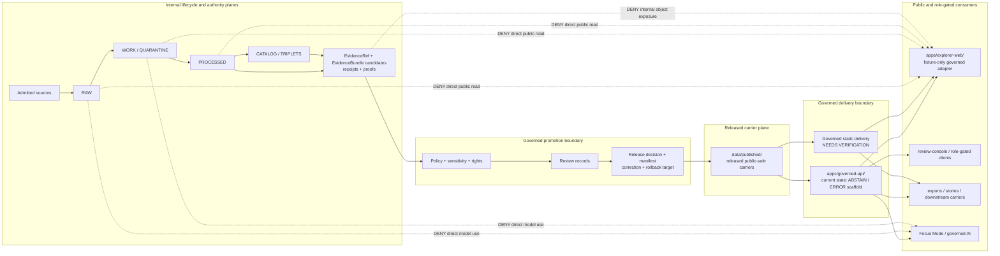

<!-- [KFM_META_BLOCK_V2]
doc_id: kfm://doc/architecture/trust-membrane
title: Trust Membrane — Current Architecture and Enforcement Map
type: architecture-reference
version: v2.0-draft
status: draft
owners:
  - NEEDS VERIFICATION — architecture and documentation stewardship
  - NEEDS VERIFICATION — governed API, evidence, policy, release, and public-client stewardship
created: 2026-05-24
updated: 2026-08-17
policy_label: public
owning_root: docs/
responsibility: Explain the cross-root architecture that keeps internal lifecycle state separate from governed release and public delivery without becoming doctrine, policy, release authority, or implementation proof.
truth_posture: cite-or-abstain
current_path: docs/architecture/TRUST_MEMBRANE.md
evidence_snapshot:
  repository: bartytime4life/Kansas-Frontier-Matrix
  base_ref: main
  base_commit: 70d2f1da3a480e14a19573ebec55258fc64e5f8e
  prior_blob: df78ad6501e332a15dab1eebbf3ed12ef2926979
  directory_rules_blob: fd49a0b83e55cef52c1124281f093e263526898d
  directory_rules_decision: ADR-0029 accepted
related:
  - README.md
  - SYSTEM_MAP.md
  - SKELETON_MAP.md
  - trust-membrane.md
  - governed-api/README.md
  - map-shell.md
  - contract-schema-policy-split.md
  - ../doctrine/trust-membrane.md
  - ../doctrine/lifecycle-law.md
  - ../doctrine/directory-rules.md
  - ../adr/ADR-0004-apps-governed-api-is-the-trust-membrane.md
  - ../adr/ADR-0025-public-client-never-reads-canonical-internal-stores.md
  - ../adr/ADR-0029-adopt-directory-governance-standard-v2.md
  - ../../apps/governed-api/README.md
  - ../../apps/explorer-web/src/adapters/GovernedClient.ts
  - ../../packages/evidence-resolver/README.md
  - ../../contracts/runtime/runtime_response_envelope.md
  - ../../schemas/contracts/v1/runtime/runtime_response_envelope.schema.json
  - ../../release/README.md
notes:
  - Same-path documentation modernization only; no route, policy, schema, release, deployment, publication, or repository-setting state changes.
  - Current repository evidence replaces the prior document's unverified greenfield path map.
  - The lowercase sibling docs/architecture/trust-membrane.md remains a separate unresolved overlap; this change does not select a canonical winner, create an alias, or retire either path.
[/KFM_META_BLOCK_V2] -->

<a id="top"></a>

# Trust Membrane — Current Architecture and Enforcement Map

> **Purpose.** Explain how KFM separates internal lifecycle state from released, public-safe delivery; show which current repository components participate in that boundary; and keep implementation maturity, decision status, and unresolved seams visible.

| Field | Current result |
|---|---|
| **Document role** | Cross-cutting architecture explanation under `docs/architecture/`; not doctrine, policy, schema, release authority, or runtime enforcement. |
| **Evidence snapshot** | `main@70d2f1da3a480e14a19573ebec55258fc64e5f8e`. |
| **Directory authority** | Directory Rules v2 is adopted through [`ADR-0029`](../adr/ADR-0029-adopt-directory-governance-standard-v2.md). |
| **Dynamic public-boundary candidate** | [`apps/governed-api/`](../../apps/governed-api/) is present and fail-closed, but [`ADR-0004`](../adr/ADR-0004-apps-governed-api-is-the-trust-membrane.md) remains effectively **PROPOSED**. |
| **Current dynamic behavior** | Three GET routes return deterministic `ABSTAIN / NOT_IMPLEMENTED`; unknown routes and unsupported methods return safe `ERROR` envelopes. No evidence-backed `ANSWER` path is proved. |
| **Evidence-resolution maturity** | [`packages/evidence-resolver/`](../../packages/evidence-resolver/) implements a bounded, internal, non-authoritative `v1alpha1` candidate check. Governed runtime integration remains held. |
| **Public-client maturity** | Explorer Web's [`GovernedClient.ts`](../../apps/explorer-web/src/adapters/GovernedClient.ts) is fixture-only and performs no network or lifecycle-store access. |
| **Release maturity** | The [`release/`](../../release/) root has substantial fixture-first governance surfaces, while authenticated operational release, correction propagation, rollback execution, and public parity remain held or unverified. |
| **Path result for this change** | `PLACE` at the existing requested path. Canonical document identity remains **CONFLICTED** because a lowercase overlapping sibling also exists. |
| **Publication effect** | None. A documentation change, commit, workflow, or pull request is not a governed release or publication transition. |

> [!IMPORTANT]
> **The repository contains parts of the membrane, not proof of a complete membrane.** Current code proves a bounded fail-closed scaffold, selected structural guards, a proposed runtime-envelope shape, an internal evidence-resolution candidate, and fixture-first release controls. It does **not** prove authenticated callers, accepted policy evaluation, authoritative evidence lookup, live release binding, deployed isolation, public static delivery, correction propagation, or production publication.

> [!CAUTION]
> **This page cannot create trust.** It may describe the boundary, but only contracts, schemas, policy, code, tests, evidence, review, release records, correction records, rollback records, and observed runtime behavior can prove a crossing for their declared scope.

**Quick navigation:** [Role](#1-role-authority-and-truth-posture) · [Current state](#2-current-repository-state) · [Architecture](#3-end-to-end-architecture) · [Transitions](#4-two-governed-transitions) · [Dynamic surface](#5-current-dynamic-boundary) · [Evidence](#6-evidence-resolution-seam) · [Outcomes](#7-runtime-envelope-and-finite-outcomes) · [Clients](#8-public-client-renderer-and-ai-boundaries) · [Release](#9-release-correction-and-rollback) · [Denials](#10-denial-surfaces) · [Validation](#11-validation-and-negative-proof) · [Maturity](#12-maturity-matrix) · [Change checklist](#13-change-checklist) · [Conflicts](#14-known-conflicts-holds-and-open-verification) · [Related](#15-related-repository-evidence)

---

## 1. Role, authority, and truth posture

### 1.1 What this document owns

This document owns one responsibility: the human-readable cross-root map of how KFM's trust boundary is expected to compose.

It explains:

- the internal and public sides of the boundary;
- the separate promotion and exposure transitions;
- the current Governed API scaffold and its bounded behavior;
- the evidence-resolution seam that must close before a claim-bearing `ANSWER`;
- the runtime finite-outcome contract;
- the public-client, renderer, and governed-AI restrictions;
- release, correction, withdrawal, and rollback dependencies;
- the negative tests that make a fail-closed boundary inspectable.

It does not own:

| Concern | Owning surface |
|---|---|
| Trust-membrane doctrine and lifecycle invariants | [`docs/doctrine/trust-membrane.md`](../doctrine/trust-membrane.md) and [`docs/doctrine/lifecycle-law.md`](../doctrine/lifecycle-law.md) |
| Binding architecture decisions | [`docs/adr/`](../adr/) |
| Object meaning | [`contracts/`](../../contracts/) |
| Machine-checkable shape | [`schemas/`](../../schemas/) |
| Admissibility, rights, sensitivity, and access rules | [`policy/`](../../policy/) |
| Process receipts and proof objects | [`data/receipts/`](../../data/receipts/) and [`data/proofs/`](../../data/proofs/) |
| Release, promotion, correction, withdrawal, and rollback decisions | [`release/`](../../release/) |
| Deployable behavior | [`apps/`](../../apps/), reusable code under [`packages/`](../../packages/), and runtime evidence |
| Proof of enforceability | [`tests/`](../../tests/), [`fixtures/`](../../fixtures/), validators, workflows, and observed runs |

### 1.2 Truth labels used here

| Label | Meaning in this page |
|---|---|
| `CONFIRMED` | Verified at the pinned repository snapshot from current files, tests, schemas, contracts, or accepted Directory Rules evidence. |
| `PROPOSED` | A decision, integration, field, route, or behavior that exists only as a draft contract, ADR, README intent, or design target. |
| `UNKNOWN` | The inspected evidence cannot support a stronger statement. |
| `NEEDS VERIFICATION` | A specific repository, workflow, deployment, or runtime check can settle the claim. |
| `CONFLICTED` | Two current surfaces claim overlapping or incompatible responsibility. |
| `HOLD` | The safe current result is to prevent graduation until named evidence exists. |

### 1.3 Placement result

The requested file already exists under the explanatory `docs/architecture/` responsibility root. This change therefore preserves its path and stable document identity.

That does **not** settle the separate canonicality conflict with [`docs/architecture/trust-membrane.md`](./trust-membrane.md). No accepted ADR, alias-register entry, or migration record currently selects one as canonical and the other as a redirect. Resolving that overlap is an authority-changing migration and is outside this same-path modernization.

[Back to top](#top)

---

## 2. Current repository state

### 2.1 Confirmed implementation surfaces

| Surface | Confirmed state at the evidence snapshot | Safe conclusion |
|---|---|---|
| [`apps/governed-api/src/governed_api/main.py`](../../apps/governed-api/src/governed_api/main.py) | Small WSGI dispatcher; registered GET routes return JSON; non-GET calls to registered routes return `405`; unknown paths return `404`. | A bounded executable scaffold exists. This is not authentication, authorization, evidence resolution, policy evaluation, or release binding. |
| [`routes/registry.py`](../../apps/governed-api/src/governed_api/routes/registry.py) | Registers exactly `/bootstrap`, `/layers`, and `/evidence`. | The current dynamic surface is intentionally small. No additional live route is implied. |
| [`stub.py`](../../apps/governed-api/src/governed_api/stub.py) | Registered routes emit `ABSTAIN / NOT_IMPLEMENTED`; safe faults emit `ERROR / SAFE_RUNTIME_ERROR`. | Current behavior is fail-closed and non-authoritative. There is no evidence-backed `ANSWER`. |
| [`test_abstain_routes.py`](../../apps/governed-api/tests/test_abstain_routes.py) | Validates every registered route against the required-field subset of the proposed runtime envelope and checks deterministic scaffold values. | The current negative route shape is tested. Full JSON Schema semantics and production behavior are not proved by this test alone. |
| [`test_boundary_guards.py`](../../apps/governed-api/tests/test_boundary_guards.py) | Checks route manifest, `404`/`405`, forbidden renderer/model imports, and selected internal-store path literals. | Selected structural bypasses are denied in source. Indirect dependencies, deployment routing, credentials, network policy, and data exfiltration remain unproved. |
| [`runtime_response_envelope.schema.json`](../../schemas/contracts/v1/runtime/runtime_response_envelope.schema.json) | Closed proposed schema with outcomes `ANSWER`, `ABSTAIN`, `DENY`, `ERROR`; `ANSWER` requires evidence and `precision_actually_used`. | A candidate client-facing shape exists. Its own metadata remains `PROPOSED`, and route integration is incomplete. |
| [`packages/evidence-resolver/`](../../packages/evidence-resolver/) | Internal non-authoritative candidate resolver with bounded deterministic checks, synthetic fixtures, standard-library tests, and no-network posture. | The package may assess a caller-supplied candidate. It does not perform authoritative lookup, policy, release, or publication. |
| [`GovernedClient.ts`](../../apps/explorer-web/src/adapters/GovernedClient.ts) | Fixture-only parser for a public-safe Evidence Drawer projection; no network or lifecycle-store access. | Public-client trust-state parsing has a bounded implementation. Live Governed API integration is not proved. |
| [`release/`](../../release/) | Canonical append-only release-decision root under adopted Directory Rules; multiple fixture-first profiles and checks exist; operational transitions remain held. | Release governance has meaningful bounded implementation, but no production release or public parity is inferred. |

### 2.2 Confirmed governance state

- [`ADR-0029`](../adr/ADR-0029-adopt-directory-governance-standard-v2.md) is accepted and adopts the exact Directory Rules v2 bytes at [`docs/doctrine/directory-rules.md`](../doctrine/directory-rules.md).
- [`ADR-0004`](../adr/ADR-0004-apps-governed-api-is-the-trust-membrane.md) is still a draft source with effective status `proposed`. Repository configuration does not silently accept it.
- [`ADR-0025`](../adr/ADR-0025-public-client-never-reads-canonical-internal-stores.md) is also effectively `proposed`. Its anti-bypass model is consistent with current scaffold tests, but acceptance and deployed enforcement remain separate gates.
- The current repository contains no `apps/api/` sibling at the pinned `apps/` tree; this narrows one parallel-app risk but does not accept ADR-0004.

### 2.3 What remains unknown

No current-session evidence proves:

- authenticated identities, authorization roles, or audience projections at the dynamic boundary;
- accepted policy bundle selection and evaluation inside the Governed API;
- authoritative `EvidenceRef -> EvidenceBundle` lookup for a live request;
- release-manifest, correction, withdrawal, and rollback binding on every response;
- an approved static-delivery edge, CDN/object-store policy, cache invalidation, or public origin;
- deployed network isolation from lifecycle, canonical, evidence-internal, release-internal, graph, search, or model-runtime stores;
- a production `ANSWER`, a governed release, or KFM publication.

[Back to top](#top)

---

## 3. End-to-end architecture

The trust membrane is not one file or service. It is the composition of lifecycle separation, evidence closure, policy, review, release decisions, governed delivery, and public-client refusal paths.


```mermaid
flowchart LR
  subgraph INTERNAL["Internal lifecycle and authority planes"]
    SRC["Admitted sources"]
    RAW["RAW"]
    WQ["WORK / QUARANTINE"]
    PROC["PROCESSED"]
    CAT["CATALOG / TRIPLETS"]
    EVD["EvidenceRef + EvidenceBundle candidates\nreceipts + proofs"]
    SRC --> RAW --> WQ --> PROC --> CAT
    PROC --> EVD
    CAT --> EVD
  end

  subgraph PROMOTION["Governed promotion boundary"]
    POL["Policy + sensitivity + rights"]
    REV["Review records"]
    REL["Release decision + manifest\ncorrection + rollback target"]
    EVD --> POL --> REV --> REL
  end

  subgraph RELEASED["Released carrier plane"]
    PUB["data/published/\nreleased public-safe carriers"]
    REL --> PUB
  end

  subgraph DELIVERY["Governed delivery boundary"]
    API["apps/governed-api/\ncurrent state: ABSTAIN / ERROR scaffold"]
    STATIC["Governed static delivery\nNEEDS VERIFICATION"]
    PUB --> API
    PUB --> STATIC
  end

  subgraph CLIENTS["Public and role-gated consumers"]
    WEB["apps/explorer-web/\nfixture-only governed adapter"]
    REVIEW["review-console / role-gated clients"]
    EXPORT["exports / stories / downstream carriers"]
    FOCUS["Focus Mode / governed AI"]
    API --> WEB
    API --> REVIEW
    API --> EXPORT
    API --> FOCUS
    STATIC --> WEB
    STATIC --> EXPORT
  end

  RAW -. "DENY direct public read" .-> WEB
  WQ -. "DENY direct public read" .-> WEB
  PROC -. "DENY direct public read" .-> WEB
  EVD -. "DENY internal object exposure" .-> WEB
  RAW -. "DENY direct model use" .-> FOCUS
  WQ -. "DENY direct model use" .-> FOCUS
```

### 3.1 Reading the diagram

- Lifecycle placement does not create public authority.
- Evidence closure does not create a release decision.
- A release decision does not by itself create a public endpoint.
- The dynamic boundary and any approved static-delivery edge must consume released public-safe carriers; neither may become a second truth store.
- Public clients and AI surfaces receive governed projections, not internal objects or filesystem paths.
- Correction, withdrawal, and rollback must propagate through both dynamic and static delivery paths before a prior response can remain trusted.

[Back to top](#top)

---

## 4. Two governed transitions

### 4.1 Transition A — promotion into released state

```text
CATALOG / TRIPLETS + evidence/proof support
    -> policy and sensitivity decision
    -> review state
    -> release decision and manifest
    -> rollback/correction/withdrawal targets
    -> PUBLISHED carrier
```

This transition answers: **May this candidate become a released KFM carrier for a declared audience and use?**

A passing schema, fixture, workflow, signature, pull request, merge, or file move is insufficient. Promotion must preserve the distinct roles of evidence, policy, review, release, correction, and rollback records.

### 4.2 Transition B — exposure through a governed delivery edge

```text
released public-safe carrier
    -> dynamic Governed API or approved static-delivery profile
    -> caller/audience and request validation
    -> evidence, policy, freshness, release, and correction checks
    -> finite runtime outcome
    -> public or role-gated client
```

This transition answers: **May this caller receive this projection now, and what bounded outcome is safe?**

The two transitions are related but not interchangeable. Promotion authorizes a release state. Exposure authorizes a request-specific projection. A release may be withheld from a caller, and a caller-facing response may abstain even when a related artifact is released.

[Back to top](#top)

---

## 5. Current dynamic boundary

### 5.1 What is configured now

The current [`apps/governed-api/`](../../apps/governed-api/) code path is a minimal WSGI application with three registered GET routes:

| Route | Current handler posture | Current authority |
|---|---|---|
| `/bootstrap` | `ABSTAIN / NOT_IMPLEMENTED` | None beyond proving the bounded scaffold shape. |
| `/layers` | `ABSTAIN / NOT_IMPLEMENTED` | Does not expose a live layer catalog or release projection. |
| `/evidence` | `ABSTAIN / NOT_IMPLEMENTED` | Does not resolve a live `EvidenceRef` or return an authoritative `EvidenceBundle`. |

Unsupported methods on registered routes return `405`; unknown paths return `404`; both use a safe `ERROR` envelope without internal diagnostic detail.

### 5.2 What is not configured now

Current code does not prove:

- caller authentication or authorization;
- request-specific policy evaluation;
- evidence-resolver invocation;
- repository, registry, database, object-store, or catalog lookup;
- release/correction/rollback resolution;
- live client transport from Explorer Web;
- an `ANSWER` response;
- deployment, reverse-proxy, CORS, CSP, TLS, rate-limit, or network-namespace enforcement.

### 5.3 Graduation rule

A route must not graduate from the scaffold to `ANSWER` until the smallest dependency-closed slice proves all of the following for that route:

1. an accepted or explicitly bounded runtime contract and schema;
2. deterministic request identity and a closed response shape;
3. authoritative or correctly bounded evidence resolution;
4. applicable policy, rights, sensitivity, review, release, freshness, and correction checks;
5. citation closure for claim-bearing output;
6. negative fixtures for missing, stale, denied, withdrawn, malformed, and operational-failure cases;
7. no direct public read of internal stores;
8. audit-safe diagnostics and rollback behavior;
9. repository-native tests and hosted exact-head evidence appropriate to risk.

Until then, `ABSTAIN / NOT_IMPLEMENTED` is the correct fail-closed behavior.

[Back to top](#top)

---

## 6. Evidence-resolution seam

### 6.1 Current bounded package

[`packages/evidence-resolver/`](../../packages/evidence-resolver/) currently implements one internal, non-authoritative profile:

```text
kfm/evidence-ref-bundle-candidate/v1alpha1
```

It evaluates caller-supplied `EvidenceRef`, `EvidenceBundle` candidate, lookup snapshot, and verification-state history inputs. Its core evaluation is pure, standard-library-only, and designed to make no network, DNS, filesystem, hidden-clock, environment, model, policy, review, release, or publication call.

Its package-local outcomes are:

- `RESOLVED`
- `UNRESOLVED`
- `DENIED`
- `ERROR`

Those are **internal candidate-evaluation results**, not public runtime outcomes and not evidence truth. The package explicitly returns `authoritative: false`.

### 6.2 Required integration boundary

A future Governed API integration must not simply translate `RESOLVED` to `ANSWER`.

A claim-bearing public `ANSWER` additionally requires:

- authoritative lookup scope and repository abstraction;
- canonical evidence identity and digest binding;
- current correction, supersession, withdrawal, and revocation state;
- source-role and claim-scope compatibility;
- policy, rights, sensitivity, caller, and audience decision;
- review and release state where required;
- citation closure;
- response precision bounded to actual support.

If any of those are absent, the governed runtime must return `ABSTAIN`, `DENY`, or `ERROR` according to the failure class. It must never infer authority from the package's internal `RESOLVED` label.

### 6.3 Current seam status

| Seam | Status | Why |
|---|---|---|
| Candidate shape checking | `CONFIRMED` bounded implementation | Package-local fixtures and tests exist. |
| Authoritative lookup | `HOLD` | No accepted repository-local authority and digest-binding path is established by this page. |
| Policy evaluation | `HOLD` | Caller-supplied policy context is not an accepted policy evaluation. |
| Governed API consumer | `NEEDS VERIFICATION` / currently absent from inspected route code | Current scaffold imports only route registry and stub response helpers. |
| Public outcome mapping | `PROPOSED` | Package README explicitly keeps the mapping unresolved. |
| Production evidence behavior | `UNKNOWN` | No live store, API, release, or deployed runtime proof was inspected. |

[Back to top](#top)

---

## 7. Runtime envelope and finite outcomes

### 7.1 Proposed client-facing envelope

The current proposed [`RuntimeResponseEnvelope`](../../schemas/contracts/v1/runtime/runtime_response_envelope.schema.json) is closed to additional properties and requires:

- `id`
- `spec_hash`
- `version`
- `issued_at`
- `outcome`
- `reason_code`
- `evidence_refs`
- `policy_state`
- `freshness`
- `correction_state`

It permits exactly four runtime outcomes:

| Outcome | Meaning | Required safe posture |
|---|---|---|
| `ANSWER` | The requested projection is supported for the declared scope. | At least one evidence reference plus `precision_actually_used`; policy, freshness, release, correction, and citation obligations must be satisfied. |
| `ABSTAIN` | The system cannot support a safe answer for the requested scope. | Explain the bounded reason without fabricating support or leaking restricted detail. |
| `DENY` | Policy, rights, sensitivity, role, audience, release, or exposure posture forbids the response. | Refuse without disclosing the protected material or sensitive denial rationale. |
| `ERROR` | A reliable governed decision cannot be produced because an operational component failed. | Fail closed with an audit-safe reason; never fall back to raw data or unclassified model output. |

`HOLD`, `PASS`, `FAIL`, `RESOLVED`, and `UNRESOLVED` may be valid review-, validator-, or package-local terms, but they are not additional outcomes in the current runtime-envelope schema.

### 7.2 `ANSWER` precision obligation

For `ANSWER`, the schema requires `precision_actually_used`, including spatial, temporal, and attribute support plus the evidence and transform-receipt references that justify the projection. This prevents a caller's requested precision from silently becoming the system's claimed precision.

### 7.3 Current integration gap

The scaffold now matches the required top-level field set for negative outcomes, but the integration is still incomplete:

- the schema metadata remains `PROPOSED`;
- routes do not emit `ANSWER`;
- routes do not use authoritative evidence lookup;
- routes do not evaluate accepted policy;
- routes do not bind a release or correction lineage;
- no deployed client/server conformance is proved.

[Back to top](#top)

---

## 8. Public client, renderer, and AI boundaries

### 8.1 Explorer Web

The inspected [`GovernedClient.ts`](../../apps/explorer-web/src/adapters/GovernedClient.ts) is a fixture-only public-safe projection parser. It deliberately performs no network or lifecycle-store access and validates:

- exact top-level fields;
- finite outcomes and reason codes;
- public-safe trust state;
- HTTPS citations;
- negative history such as held, denied, superseded, revoked, and withdrawn evidence;
- correction chains and cycle rejection;
- bounded text, arrays, identifiers, and timestamps.

This is useful boundary implementation, but it does not prove a live API client, deployed browser isolation, or a public route.

### 8.2 MapLibre and renderer code

Renderer code is downstream of trust. It may render released public-safe projections and trust-visible states. It must not:

- read RAW, WORK, QUARANTINE, PROCESSED, proof, receipt, or release-internal stores directly;
- infer release or policy state from style visibility;
- hide sensitive content only with a client-side filter;
- treat feature properties, tiles, screenshots, or visual emphasis as evidence authority;
- synthesize a public `ANSWER` when the governed boundary returned `ABSTAIN`, `DENY`, or `ERROR`.

The Governed API boundary tests currently reject direct MapLibre, Cesium, and Ollama imports inside the API package. That is a useful structural guard: the public API should project governed state, not embed renderer or model runtimes as hidden authorities.

### 8.3 Governed AI and Focus Mode

AI is interpretive. A model runtime must remain behind the governed boundary and receive only the evidence, policy, release, temporal, spatial, and precision context appropriate to the request.

A model must not:

- read lifecycle stores directly;
- treat an evidence-search hit as an authoritative bundle;
- convert an internal resolver result into public truth;
- override `ABSTAIN` or `DENY`;
- expose hidden reasoning, prompts, credentials, internal paths, or protected details as proof;
- publish or approve its own output.

An AI-assisted `ANSWER` is a new claim-bearing response. It therefore needs its own governed envelope, citations, bounded precision, and applicable receipt; evidence support for the input does not automatically warrant the generated prose.

[Back to top](#top)

---

## 9. Release, correction, and rollback

### 9.1 Release decision plane

Adopted Directory Rules place release, promotion, correction, withdrawal, rollback, and signature decisions under [`release/`](../../release/). Public-safe carrier bytes belong under [`data/published/`](../../data/published/). Receipts and proofs remain separate under [`data/receipts/`](../../data/receipts/) and [`data/proofs/`](../../data/proofs/).

This separation matters because none of the following is interchangeable:

| Artifact or event | What it proves | What it does not prove |
|---|---|---|
| Schema-valid candidate | Shape conformance | Evidence, policy, review, release, or publication |
| Process receipt | What a bounded process says it did | Truth or release authority |
| Proof object | Declared evidence/integrity closure for its profile | Policy approval or publication |
| Policy result | Admissibility under a named rule set | Human review, release, or delivery |
| Review record | A declared review act | Automatic promotion or runtime exposure |
| Release decision / manifest | A governed transition for a declared scope | Deployed public parity unless delivery is verified |
| Published carrier path | Logical lifecycle placement | Public hosting, CDN policy, caller authorization, or current correction state |
| Pull request or merge | Repository history | Release, deployment, promotion, or publication |

### 9.2 Correction and withdrawal propagation

A response or carrier that was valid at one time may later be corrected, superseded, withdrawn, or revoked. The trust membrane must therefore resolve current lineage at request time or through an equivalent governed cache-invalidation path.

Propagation must cover, as applicable:

- dynamic API responses;
- static public carriers and aliases;
- caches and CDNs;
- layer and evidence projections;
- search, graph, and index derivatives;
- Explorer trust states;
- exports and stories;
- Focus Mode and governed-AI context.

During unresolved propagation, the safe state is not a stale `ANSWER`. The system must narrow, abstain, deny, or fail closed according to the affected policy and evidence state.

### 9.3 Rollback

Rollback is a governed transition to a declared prior safe state, not deletion or a blind file copy. A credible rollback path identifies:

- the affected release and carrier identities;
- the prior target and its verified digest;
- correction/withdrawal reason and authority;
- cache and alias invalidation steps;
- consumer impact;
- replay or parity checks;
- an auditable rollback result.

The current release root contains meaningful fixture-first rollback surfaces, but operational mutation and public invalidation remain held or unverified. This page does not upgrade that maturity.

[Back to top](#top)

---

## 10. Denial surfaces

The architecture is only credible when each prohibited crossing has an owned refusal surface and a negative test.

| Denial surface | Must refuse | Current bounded evidence | Remaining gap |
|---|---|---|---|
| Lifecycle/public separation | Direct public reads of RAW, WORK, QUARANTINE, PROCESSED, proof, receipt, release-internal, graph, search, or model-runtime stores | Adopted Directory Rules placement; selected API source guards; data-root contracts | Deployed network and storage isolation |
| Governed API routing | Unknown routes, unsupported methods, unsafe untyped responses | `404`/`405` tests and safe `ERROR` envelope | Authentication, authorization, rate limits, network policy, full route inventory |
| Runtime outcome construction | `ANSWER` without evidence, precision, policy, freshness, release, or correction support | Proposed closed schema; scaffold emits only negative outcomes | Accepted contract and live envelope builder |
| Evidence resolution | Missing, inconsistent, stale, superseded, withdrawn, revoked, malformed, or scope-incompatible evidence | Internal resolver candidate fixtures and tests | Authoritative lookup, digest binding, policy/release integration |
| Promotion/release | Candidate promotion without evidence, policy, review, release, correction, rollback, or integrity closure | Fixture-first release validators and workflows | Authenticated operational transition and separation of duties |
| Public-client projection | Malformed payloads, unsupported states, unsafe citations, cyclic correction history, negative evidence reused as current support | Fixture-only `GovernedClient` parser | Live transport, browser build/deployment, static-delivery parity |
| Renderer | Direct store access, style-only protection, renderer-as-truth | Architecture and selected API import guards | End-to-end client dependency and data-flow proof |
| Governed AI | Raw/model-direct answers, uncited output, policy bypass, response escalation | Proposed architecture and finite-outcome contracts | Accepted adapter, sandbox, resolver/policy integration, runtime tests |
| Correction/withdrawal | Continued `ANSWER` after current support is withdrawn or superseded | Negative/correction projection types and release fixtures | End-to-end propagation and cache invalidation |

[Back to top](#top)

---

## 11. Validation and negative proof

### 11.1 Existing focused checks

Repository evidence confirms focused test or validation surfaces for:

- Governed API route outcomes and top-level response shape;
- unknown route and unsupported method behavior;
- forbidden renderer/model imports inside the API package;
- selected internal-store path literals inside API source;
- the proposed runtime response envelope;
- the internal evidence-resolver candidate profile and no-network posture;
- Explorer's fixture-only governed projection parser;
- fixture-first release, promotion, rollback, and related validation profiles.

These checks are bounded. Their existence does not prove hosted exact-head success, required-check enforcement, deployed behavior, or production publication.

### 11.2 Required negative matrix for a real route

A route that can ever return `ANSWER` should prove at least:

| Case | Expected outcome |
|---|---|
| Request schema malformed | `ERROR` or safe client error; no internal detail |
| Caller/audience not permitted | `DENY` |
| Evidence reference missing | `ABSTAIN` |
| Evidence candidate malformed | `ERROR` |
| Evidence unresolved or stale | `ABSTAIN` |
| Evidence withdrawn, revoked, or policy-blocked | `DENY` or `ABSTAIN` according to accepted policy, never `ANSWER` |
| Source role incompatible with claim | `ABSTAIN` |
| Requested precision exceeds support | Narrowed `ANSWER` with `precision_actually_used`, or `ABSTAIN` |
| Release missing or not current | `ABSTAIN` or `DENY` according to exposure policy |
| Correction lineage inconsistent | `ERROR` |
| Downstream resolver/policy/runtime unavailable | `ERROR`; no raw fallback |
| Internal store path requested | `DENY` or `404`, with no path disclosure |
| Unsupported method or route | Safe `405` or `404` |
| Citation closure fails | `ABSTAIN` |
| Model output lacks governed support | `ABSTAIN` or `ERROR` |

### 11.3 Proof standard

A complete trust-membrane claim needs more than unit tests. Evidence should be layered:

1. exact file and configuration presence;
2. contract/schema/policy alignment;
3. positive and negative fixtures;
4. focused deterministic tests;
5. aggregate boundary checks;
6. hosted exact-head results when available;
7. deployed routing, storage, network, and public-origin verification where claimed;
8. correction/withdrawal/rollback rehearsal;
9. observability proving denials and failures do not leak protected state.

[Back to top](#top)

---

## 12. Maturity matrix

| Capability | Current status | Evidence-backed statement |
|---|---|---|
| Directory placement law | `CONFIRMED / ADOPTED` | ADR-0029 adopts Directory Rules v2. |
| Architecture explanation at this path | `CONFIRMED tracked / updated in place` | This file exists and is being modernized without a move. |
| Unique canonical trust-membrane architecture page | `CONFLICTED` | Uppercase and lowercase overlapping pages both exist; no governed alias/supersession decision was found. |
| Governed API deployable lane | `CONFIRMED present` | `apps/governed-api/` contains executable scaffold code and tests. |
| ADR selecting Governed API as binding dynamic membrane | `PROPOSED` | ADR-0004 is not accepted. |
| Public-client no-direct-store ADR | `PROPOSED` | ADR-0025 is not accepted. |
| Governed API route handling | `CONFIRMED bounded scaffold` | Three GET routes; safe `404`/`405`; negative envelopes. |
| Evidence-backed Governed API `ANSWER` | `ABSENT in inspected scaffold` | Current registered routes abstain. |
| Runtime response envelope | `PROPOSED / fixture-tested` | Closed schema and validator surfaces exist; route integration is incomplete. |
| Evidence resolver | `CONFIRMED internal alpha` | Bounded non-authoritative candidate evaluation exists. |
| Authoritative evidence lookup and digest binding | `HOLD` | Not established by inspected integration. |
| Explorer governed projection parser | `CONFIRMED fixture-only` | No network or lifecycle-store access. |
| Live Explorer-to-Governed-API transport | `UNKNOWN / NEEDS VERIFICATION` | Not proved by inspected adapter. |
| Release governance | `CONFIRMED mixed, fixture-first` | Meaningful bounded profiles exist; operational release is held. |
| Static public delivery | `UNKNOWN / NEEDS VERIFICATION` | No approved delivery profile or public parity is claimed here. |
| Deployed trust membrane | `UNKNOWN` | No deployment, public origin, network, log, or runtime proof was inspected. |
| Governed publication | `UNKNOWN / not performed by this change` | Documentation and repository activity are not publication. |

[Back to top](#top)

---

## 13. Change checklist

Use this checklist for any change that touches a crossing described here.

### 13.1 Scope and authority

- [ ] Name the exact crossing: lifecycle progression, promotion, dynamic exposure, static exposure, client projection, or AI interpretation.
- [ ] Identify the owning responsibility root for every changed artifact.
- [ ] Check accepted ADRs and Directory Rules; do not use a draft ADR as binding authority.
- [ ] Reconcile overlapping branches, pull requests, files, schemas, policies, and package ownership before editing.
- [ ] Keep a route, schema, test, receipt, or merge from being described as release or publication authority.

### 13.2 Dependency closure

- [ ] Update semantic contracts and machine schemas together where meaning or shape changes.
- [ ] Add or update policy decisions for admissibility changes.
- [ ] Add valid, abstain, deny, and error fixtures appropriate to the route.
- [ ] Preserve deterministic identity, digest binding, freshness, correction, and release references.
- [ ] Prove no direct public read of internal stores.
- [ ] Prove no direct public model invocation.
- [ ] Update public-client adapters and trust-state rendering only after the governed payload is defined.

### 13.3 Validation and rollback

- [ ] Run focused tests for every changed denial surface.
- [ ] Run the relevant aggregate boundary, schema, policy, and repository-topology checks.
- [ ] Separate introduced failures from inherited failures.
- [ ] Record hosted checks as `PENDING`, `PASS`, `FAIL`, or `NOT RUN`; do not infer them.
- [ ] Define the feature-branch rollback: revert the dependency-closed change together.
- [ ] Define operational correction/withdrawal/rollback only when runtime or release behavior changes.

[Back to top](#top)

---

## 14. Known conflicts, holds, and open verification

### 14.1 Documentation identity conflict

`docs/architecture/TRUST_MEMBRANE.md` and [`docs/architecture/trust-membrane.md`](./trust-membrane.md) both contain full, overlapping architecture treatments. The current alias register does not govern this pair.

**Safe result:** `CONFLICTED / HOLD` for canonical selection. Preserve both paths until a reviewed migration packet:

1. chooses the canonical identity and path;
2. inventories internal and external consumers, anchors, and references;
3. defines redirect or tombstone behavior;
4. updates the alias register if needed;
5. validates link and semantic parity;
6. records rollback and retirement criteria.

### 14.2 Decision holds

- ADR-0004 remains proposed.
- ADR-0025 remains proposed.
- An accepted runtime-response contract and authoritative evidence-resolver integration are not established by this page.
- Named independent stewardship and separation of duties remain unverified across several trust-significant roots.

### 14.3 Implementation holds

- Evidence resolver ownership, authoritative lookup scope, canonical digest binding, and governed consumer integration.
- Governed API authentication, authorization, policy evaluation, evidence resolution, release binding, and response construction.
- Explorer live transport and complete browser dependency/data-flow verification.
- Static-delivery profile, hosting, integrity verification, cache invalidation, and correction parity.
- Governed-AI adapter, sandbox, network boundary, citation validator, and runtime receipt integration.
- Operational promotion, correction propagation, withdrawal, rollback execution, and public parity.

### 14.4 Verification questions

1. Which architecture page should be canonical after the uppercase/lowercase overlap is governed?
2. Which accepted decision, if any, will bind the dynamic public path and the static-delivery complement?
3. What repository-local abstraction owns authoritative EvidenceBundle lookup, and how is lookup identity bound to the authoritative digest?
4. Which policy bundle and decision contract govern each route and audience?
5. What exact release/correction/rollback references are required on dynamic and static projections?
6. Which negative suite is required before the first route can return `ANSWER`?
7. Which deployed checks prove public clients cannot address internal stores or model runtimes?
8. How are withdrawals and corrections propagated through caches, layers, exports, search, graph, and AI context?

[Back to top](#top)

---

## 15. Related repository evidence

### Governing placement and decisions

- [`docs/doctrine/directory-rules.md`](../doctrine/directory-rules.md)
- [`ADR-0029 — Adopt Directory Governance Standard v2`](../adr/ADR-0029-adopt-directory-governance-standard-v2.md)
- [`ADR-0004 — apps/governed-api is the Trust Membrane`](../adr/ADR-0004-apps-governed-api-is-the-trust-membrane.md) — effectively proposed
- [`ADR-0025 — Public Client Never Reads Canonical or Internal Stores`](../adr/ADR-0025-public-client-never-reads-canonical-internal-stores.md) — effectively proposed

### Architecture and doctrine companions

- [`docs/architecture/README.md`](./README.md)
- [`SYSTEM_MAP.md`](./SYSTEM_MAP.md)
- [`SKELETON_MAP.md`](./SKELETON_MAP.md)
- [`governed-api/README.md`](./governed-api/README.md)
- [`map-shell.md`](./map-shell.md)
- [`contract-schema-policy-split.md`](./contract-schema-policy-split.md)
- [`docs/doctrine/trust-membrane.md`](../doctrine/trust-membrane.md)
- [`docs/doctrine/lifecycle-law.md`](../doctrine/lifecycle-law.md)
- [`docs/architecture/trust-membrane.md`](./trust-membrane.md) — overlapping sibling; canonicality unresolved

### Current implementation and validation surfaces

- [`apps/governed-api/README.md`](../../apps/governed-api/README.md)
- [`apps/governed-api/src/governed_api/main.py`](../../apps/governed-api/src/governed_api/main.py)
- [`apps/governed-api/src/governed_api/routes/registry.py`](../../apps/governed-api/src/governed_api/routes/registry.py)
- [`apps/governed-api/src/governed_api/stub.py`](../../apps/governed-api/src/governed_api/stub.py)
- [`apps/governed-api/tests/test_abstain_routes.py`](../../apps/governed-api/tests/test_abstain_routes.py)
- [`apps/governed-api/tests/test_boundary_guards.py`](../../apps/governed-api/tests/test_boundary_guards.py)
- [`apps/explorer-web/src/adapters/GovernedClient.ts`](../../apps/explorer-web/src/adapters/GovernedClient.ts)
- [`packages/evidence-resolver/README.md`](../../packages/evidence-resolver/README.md)
- [`contracts/runtime/runtime_response_envelope.md`](../../contracts/runtime/runtime_response_envelope.md)
- [`schemas/contracts/v1/runtime/runtime_response_envelope.schema.json`](../../schemas/contracts/v1/runtime/runtime_response_envelope.schema.json)
- [`release/README.md`](../../release/README.md)
- [`data/README.md`](../../data/README.md)
- [`policy/README.md`](../../policy/README.md)

---

## Footer

| Field | Value |
|---|---|
| **Document class** | Cross-cutting architecture reference |
| **Evidence snapshot** | `main@70d2f1da3a480e14a19573ebec55258fc64e5f8e` |
| **Last updated** | 2026-08-17 |
| **Current result** | Repository-grounded same-path modernization; no runtime or publication effect |
| **Rollback** | Revert this documentation commit; no runtime, data, policy, release, or deployment state is changed |

[Back to top](#top)
