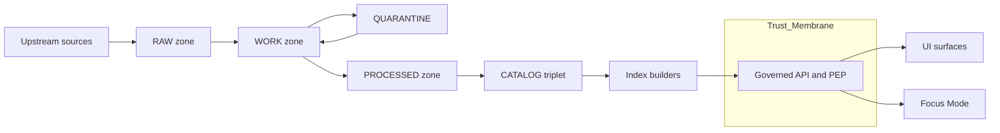

<!-- [KFM_META_BLOCK_V2]
doc_id: kfm://doc/7f4f4c5d-7b0a-4d5c-9e30-4f5c0b6d4f2a
title: TRUTH_PATH_LIFECYCLE
type: standard
version: v1
status: draft
owners: TBD
created: 2026-03-04
updated: 2026-03-04
policy_label: public
related: [
  "docs/architecture/README.md",
  "docs/governance/ROOT_GOVERNANCE.md",
  "docs/standards/KFM_DCAT_PROFILE.md",
  "docs/standards/KFM_STAC_PROFILE.md",
  "docs/standards/KFM_PROV_PROFILE.md"
]
tags: [kfm, architecture, governance, provenance, promotion-contract, truth-path]
notes: [
  "This is a normative contract doc: it defines required lifecycle semantics and gates.",
  "Concrete repo paths are illustrative unless explicitly verified elsewhere."
]
[/KFM_META_BLOCK_V2] -->

# TRUTH_PATH_LIFECYCLE
One-line purpose: Define KFM’s **truth path lifecycle** (Upstream → RAW → WORK/QUARANTINE → PROCESSED → CATALOG/TRIPLET → PUBLISHED) and the **Promotion Contract gates** that make data “servable” in governed runtime surfaces.

> **IMPACT**
> - **Status:** draft (normative contract)
> - **Owners:** **UNKNOWN** (needs assignment) — suggested: Architecture + Governance stewards
> - **Applies to:** ingestion pipelines, catalogs, policy, API, UI, Focus Mode
> - **Non-negotiables:** **fail-closed promotion**, **immutable RAW**, **catalog triplet cross-links**, **trust membrane**


**Badges (TODO)**
- 
- 
- 

Quick nav: [Scope](#scope) · [Where it fits](#where-it-fits) · [Definitions](#definitions) · [Lifecycle](#lifecycle-overview) · [Zones](#zones) · [Promotion Contract](#promotion-contract) · [Trust membrane](#trust-membrane-and-canonical-vs-projection-stores) · [Enforcement](#enforcement-ci--runtime) · [Checklist](#definition-of-done) · [Appendix](#appendix)

---

## Scope

This document specifies:

- The **zones** that form the truth path lifecycle (what is allowed in each zone, and what must exist).
- The **promotion transitions** between zones.
- The **minimum gates** that MUST pass before a dataset version is considered **PUBLISHED** (servable).
- The separation between **canonical evidence** and **rebuildable projections**.

### Out of scope

- Exact schema details for DCAT/STAC/PROV profiles (belongs in standards/profile docs).
- Exact directory structure or service names (belongs in repo inventory docs and ADRs).
- Business/domain-specific QA thresholds (belongs in per-dataset specs).

---

## Where it fits

- **Path:** `docs/architecture/TRUTH_PATH_LIFECYCLE.md`
- **Upstream:** dataset specs, connectors, ingestion runner contracts
- **Downstream:** catalog validators, policy rules (OPA), evidence resolver, API contracts, UI evidence drawer, Story publishing, Focus Mode cite-or-abstain

Key dependency direction:

- Pipelines and stores MUST conform to this lifecycle.
- UI/clients MUST assume only PUBLISHED dataset versions are admissible for runtime use.

---

## Definitions

### “Truth path”
A **verifiable chain** from upstream acquisition to governed runtime surfaces, where every step is:

- **auditable** (who/what/when/why),
- **reproducible** (deterministic transforms),
- **policy-controlled** (default-deny, fail-closed),
- and **evidence-addressable** (stable IDs + digests + resolvable links).

### Zone
A **storage and governance boundary** with explicit allowed operations and promotion requirements.

### Promotion
A governed act of moving a **dataset version** from earlier zones into **PROCESSED + CATALOG/TRIPLET**, enabling **PUBLISHED** runtime serving.

### Dataset version
A fixed, addressable release of a dataset defined by:

- identity (`dataset_id`, `dataset_version_id`),
- deterministic spec identity (`spec_hash`),
- immutable artifact digests,
- validated catalogs,
- policy label and obligations,
- run receipt + audit record.

### Catalog triplet
The required evidence surface composed of:

- **DCAT** (dataset-level metadata),
- **STAC** (asset-level spatiotemporal metadata),
- **PROV** (lineage: agents, activities, entities).

---

## Lifecycle overview



Interpretation rules:

- Anything not in **PUBLISHED** MUST be treated as **non-servable** by runtime surfaces.
- QUARANTINE is a loopback: you fix issues and re-attempt promotion; you do not “force publish.”

---

## Zones

> **IMPORTANT**
> This section is normative (requirements), not a claim about current implementation.  
> “CONFIRMED” labels in this doc indicate the requirement is explicitly described in KFM governance/architecture references; “UNKNOWN” indicates missing assignment/verification details.

### Zone table

| Zone | Purpose | Allowed operations | Forbidden operations | Required artifacts at rest |
|---|---|---|---|---|
| Upstream | External sources of truth | fetch/read | mutate upstream (obvious) | N/A |
| RAW | Immutable acquisition copy | append-only ingest; checksum | editing or rewriting blobs | acquisition manifest, raw artifacts, checksums, license/terms snapshot |
| WORK | Transform + QA staging | rewrite intermediate outputs; QA; redaction candidates | serving to runtime | normalized artifacts, QA reports, provisional entities |
| QUARANTINE | Isolation for unsafe/unknown | investigation; steward review; remediation | promotion | issue record, “why blocked,” required fixes, provenance intact |
| PROCESSED | Publishable canonical artifacts | write final standardized artifacts | ad-hoc mutation of “released” outputs | approved formats, stable paths, checksums, derived runtime metadata |
| CATALOG/TRIPLET | Evidence surface for discovery + citations | emit/validate cross-linked DCAT/STAC/PROV | publishing without validation | DCAT + STAC + PROV, link maps, resolvable EvidenceRefs, run receipts |
| PUBLISHED | Governed runtime surfaces | serve via governed API; policy enforcement | direct storage access by clients | only promoted versions, policy label, receipts, validated catalogs |

### RAW zone

**Requirements (CONFIRMED):**
- RAW MUST be **append-only**. If something changes, you create a new acquisition, you do not edit prior RAW blobs.
- RAW MUST include a manifest of acquisition context (what/where/when/terms).
- RAW MUST include checksums for every artifact stored.

### WORK zone

**Requirements (CONFIRMED):**
- WORK exists for transforms, QA, and candidate redactions/generalization steps.
- WORK artifacts MAY be rewritten, but MUST retain traceability to RAW inputs.

### QUARANTINE zone

**Requirements (CONFIRMED):**
- QUARANTINE MUST be used for any of:
  - failed validation,
  - unclear licensing,
  - sensitivity concerns,
  - upstream instability that prevents reproducible acquisition.
- QUARANTINE MUST block promotion.

### PROCESSED zone

**Requirements (CONFIRMED):**
- PROCESSED MUST contain publishable artifacts in KFM-approved formats.
- Each processed artifact MUST have a digest (checksum) and stable identity.
- PROCESSED SHOULD include derived runtime metadata (extents, counts, temporal ranges) to support indexing and UI.

### CATALOG/TRIPLET zone

**Requirements (CONFIRMED):**
- DCAT/STAC/PROV MUST be produced and MUST cross-link identifiers so that:
  - assets can be located by href,
  - lineage is traceable,
  - EvidenceRefs resolve deterministically (no guessing).

### PUBLISHED zone

**Requirements (CONFIRMED):**
- PUBLISHED surfaces (API + UI + Focus Mode) MUST only serve dataset versions that have:
  - processed artifacts,
  - validated catalogs,
  - run receipts,
  - policy label assignment (plus obligations, if any).
- Clients MUST NOT directly access storage/DB (trust membrane rule). All access is mediated by the PEP/governed API.

---

## Promotion Contract

### Principle
Promotion is a **hard gate** that turns governance intent into enforceable behavior. Promotion MUST be **fail-closed**: if a required artifact is missing or invalid, promotion is blocked.

### Minimum gates (Promotion Contract v1)

> Each gate MUST be automatable in CI and reviewable by stewards.

| Gate | Requirement | Fail-closed example check |
|---|---|---|
| A. Identity and versioning | `dataset_id`, `dataset_version_id`, deterministic `spec_hash`, artifact digests | recompute spec_hash; verify digests exist and match |
| B. Licensing and rights | rights metadata present + snapshot of upstream terms | fail if missing/unknown or disallowed SPDX/license |
| C. Sensitivity classification | `policy_label` assigned + obligations defined/applied | OPA tests: default-deny; verify redactions |
| D. Catalog triplet validation | DCAT/STAC/PROV validate + cross-links resolve | schema validators + link checks + EvidenceRef resolver |
| E. QA thresholds | dataset-specific QA checks and thresholds documented and met | fail if thresholds not met; quarantine |
| F. Run receipt and audit | run receipt emitted; append-only audit record references it | receipt schema validation; optional signature verification |
| G. Release manifest | promotion recorded as a manifest referencing artifacts + digests | manifest exists; references match storage |

### Promotion outcomes

- **Pass:** dataset version becomes eligible for **PUBLISHED** serving.
- **Fail:** dataset version remains non-servable; if failure indicates risk, it MUST be placed in QUARANTINE with an explicit reason.

---

## Trust membrane and canonical vs projection stores

### Trust membrane (CONFIRMED requirement)
- Clients (UI and external consumers) MUST NOT access storage or databases directly.
- All reads/writes MUST cross:
  1) a **Policy Enforcement Point (PEP)**, and
  2) an **evidence resolution layer** that can explain “why this is shown.”

### Canonical vs rebuildable (CONFIRMED requirement)
- **Canonical truth** MUST live in: object storage + catalogs + provenance (run receipts/lineage).
- Databases and indexes (PostGIS, graph store, search, tiles) MUST be treated as **rebuildable projections** derived from canonical artifacts and catalogs.

---

## Enforcement: CI + runtime

### CI enforcement (required)
- A promotion PR MUST be blocked unless all Promotion Contract gates pass.
- Validators MUST run for:
  - DCAT/STAC/PROV schema conformance,
  - link integrity (hrefs),
  - EvidenceRef resolvability,
  - policy tests (default-deny).

### Runtime enforcement (required)
- Governed API MUST:
  - enforce policy label + obligations,
  - expose evidence bundles / receipts for user-visible claims,
  - refuse serving non-promoted versions.

### Observability (required)
- Every promotion attempt MUST emit:
  - a structured run receipt,
  - policy decision reference(s),
  - artifact digests,
  - and an auditable outcome (pass/fail/quarantine).

---

## Claim registry

This table is included to comply with “cite-or-abstain” discipline.

| Statement | Status | Notes |
|---|---|---|
| The lifecycle is Upstream → RAW → WORK/QUARANTINE → PROCESSED → CATALOG/TRIPLET → PUBLISHED | CONFIRMED | Defined in KFM architecture/gov references |
| RAW is append-only and not edited | CONFIRMED | Replaced via superseding acquisition |
| Promotion is fail-closed with minimum gates A–G | CONFIRMED | Gate set intended to be CI-automatable |
| Exact repo directory names for zones | UNKNOWN | Must be verified against current repo tree |
| “Cosign required” in all environments | PROPOSED | May be optional by environment/policy |

---

## Definition of done

- [ ] Zones are implemented as explicit storage prefixes or repositories with write policies.
- [ ] Promotion Contract gates A–G are implemented as CI checks; CI is fail-closed.
- [ ] Catalog triplet is emitted for promoted dataset versions and passes validators.
- [ ] EvidenceRefs resolve end-to-end in API and UI (Evidence Drawer opens the proof).
- [ ] UI cannot bypass governed APIs (static analysis + network policy).
- [ ] Projections (DB/search/graph/tiles) are rebuildable from canonical artifacts + catalogs.

---

## Appendix

### Minimal run receipt (pseudocode)

```json
{
  "run_id": "kfm://run/2026-03-04T18:00:00Z.example",
  "dataset_version_id": "kfm://dataset_version/example/2026-03",
  "inputs": [{"uri": "raw/example/source.json", "digest": "sha256:..."}],
  "outputs": [{"uri": "processed/example/data.parquet", "digest": "sha256:..."}],
  "spec_hash": "jcs:sha256:...",
  "validation": {"status": "pass", "report_uri": "work/example/qa.json"},
  "policy": {"policy_label": "public", "decision_ref": "kfm://policy_decision/..."},
  "created_at": "2026-03-04T18:05:00Z"
}
```

### Minimal promotion manifest (pseudocode)

```json
{
  "promotion_manifest_version": "v1",
  "dataset_version_id": "kfm://dataset_version/example/2026-03",
  "spec_hash": "jcs:sha256:...",
  "released_at": "2026-03-04T18:10:00Z",
  "artifacts": [{"path": "processed/example/data.parquet", "digest": "sha256:...", "media_type": "application/x-parquet"}],
  "catalogs": [{"path": "catalog/dcat.jsonld", "digest": "sha256:..."}, {"path": "catalog/stac/collection.json", "digest": "sha256:..."}],
  "qa": {"status": "pass"},
  "approvals": [{"role": "steward", "principal": "TBD", "approved_at": "2026-03-04T18:09:30Z"}]
}
```

---

## Sources

- “Kansas Frontier Matrix (KFM) — Architecture, Governance, and Delivery Plan” (internal briefing, dated 2026-02-27).
- “KFM Source Snapshots Bundle” (governance snapshots generated 2026-02-20), including “Definitive Design & Governance Guide (vNext)” and “Ultimate Blueprint (Draft)”.

Back to top: [TRUTH_PATH_LIFECYCLE](#truth_path_lifecycle)
