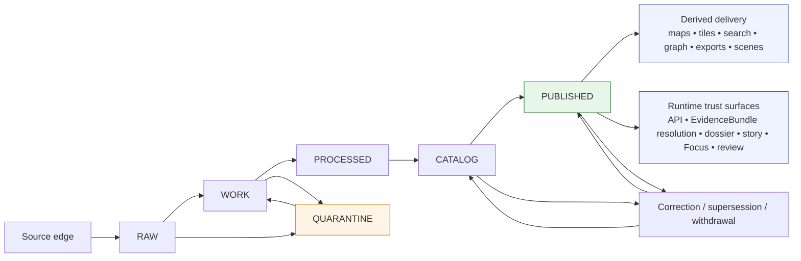

<!-- [KFM_META_BLOCK_V2]
doc_id: kfm://doc/<NEEDS_VERIFICATION-uuid>
title: Truth Path Lifecycle
type: standard
version: v1
status: draft
owners: <NEEDS_VERIFICATION>
created: <NEEDS_VERIFICATION>
updated: <NEEDS_VERIFICATION>
policy_label: <NEEDS_VERIFICATION>
related: [README.md, ../../README.md, ../../contracts/README.md, ../../schemas/README.md, ../../policy/README.md, ../../tests/README.md, ../../.github/workflows/README.md, ../reports/readme-structure-reconciliation.md]
tags: [kfm, architecture, truth-path, lifecycle]
notes: [Current public main confirms this file path and its substantive role inside docs/architecture; executable contract inventory, workflow enforcement depth, non-public GitHub controls, owners, dates, and policy label remain NEEDS_VERIFICATION.]
[/KFM_META_BLOCK_V2] -->

# Truth Path Lifecycle

The governed state model by which KFM material moves from source-edge capture to public-safe publication without crossing the trust membrane or erasing lineage.

**Quick jump:** [Truth posture](#truth-posture-used-here) · [Lifecycle at a glance](#lifecycle-at-a-glance) · [State ledger](#lifecycle-state-ledger) · [Planes and write-rights](#plane-ownership-and-write-rights) · [Artifact spine](#artifact-spine-across-the-lifecycle) · [Route families](#downstream-route-families-after-publication) · [Promotion gates](#promotion-gates-and-fail-closed-conditions) · [Correction](#correction-supersession-and-rollback) · [Repo fit](#repo-fit-and-adjacent-surfaces) · [Open verification](#open-verification-items)

> [!IMPORTANT]
> This file is now **repo-visible and doctrine-strong**. Current public `main` confirms that `docs/architecture/TRUTH_PATH_LIFECYCLE.md` exists and that `docs/architecture/README.md` treats it as a substantive lifecycle companion. The lifecycle law, trust membrane, and authoritative-versus-derived split remain **CONFIRMED doctrine**. Executable schema inventory, merge-blocking workflow depth, non-public GitHub rulesets, manifests, proof packs, and runtime traces remain **NEEDS VERIFICATION**.

## Truth posture used here

| Label | Meaning in this document |
|---|---|
| **CONFIRMED** | Directly supported by the attached KFM doctrinal corpus or by currently visible public-repo evidence. |
| **INFERRED** | Structural completion that the corpus strongly implies should exist for the lifecycle to remain coherent. |
| **PROPOSED** | Recommended starter shape, path, or artifact set that fits doctrine but is not proven as mounted implementation reality. |
| **UNKNOWN** | Not directly verified strongly enough in the current session to present as current repo, runtime, schema, workflow, or platform fact. |
| **NEEDS VERIFICATION** | A bounded repo or platform detail that has some visible signal, but still requires direct implementation or operational proof before it should be treated as settled. |

## Lifecycle at a glance

KFM’s canonical lifecycle is not “ingest and publish.” It is a governed chain of state transitions with different write rights, proof burdens, and public-safety checks at each step.

### Reading rule

The lifecycle ends, in strict authoritative terms, at **PUBLISHED**. Everything downstream of that state—tiles, search indexes, graphs, vector stores, summaries, exports, scenes, Focus responses, and other convenience-bearing projections—must remain visibly downstream of promoted scope rather than quietly becoming sovereign truth.

## Lifecycle state ledger

| State | Primary job | Typical contents | Who may write | Exit condition | Drift to prevent |
|---|---|---|---|---|---|
| **Source edge** | Define the admission boundary for incoming material. | Source descriptors, source-role rules, fetch plans, cadence and rights notes. | Source stewards, connector configuration, governed intake setup. | Material is admitted and landed with traceable capture context. | Treating discovery mirrors or opportunistic copies as origin authority. |
| **RAW** | Preserve source-native capture. | Raw payloads, fetch receipts, original files, source-native records. | Connectors and ingestion workers only. | Source-native material is safely landed and associated with receipts. | UI reads, analyst edits, or “helpful” normalization inside raw capture. |
| **WORK** | Hold active transforms and candidate assembly. | Repair attempts, joins, enrichment, intermediate candidate builds. | Canonical pipelines and approved repair lanes. | Candidate is ready for validation or must be diverted. | Quietly treating WORK as already publishable. |
| **QUARANTINE** | Hold blocked, failed, or review-needed material. | Validation failures, sensitivity holds, unresolved rights, broken provenance chains. | Intake and review lanes only. | Explicit release, rejection, repair, or re-entry into WORK. | Silent disappearance of blocked material. |
| **PROCESSED** | Materialize normalized and validated authoritative candidates. | Canonical entities, observations, features, claims, immutable dataset versions, processed artifacts. | Canonical pipelines and approved repair lanes only. | Candidate is ready for catalog closure and review-bearing outward metadata. | Back-writing derived layers into authority. |
| **CATALOG** | Close outward metadata, provenance, policy, and review obligations. | Catalog closure, STAC/DCAT/PROV references, policy decisions, review records, release manifests. | Catalog compiler, policy lane, reviewer/approver roles. | Release basis is complete, review-bearing, and public-safe for the intended audience. | Treating metadata as optional decoration rather than promotion law. |
| **PUBLISHED** | Expose promoted scope for public-safe or role-safe use. | Released data, release references, public-safe or steward-safe visibility state, correction linkage. | Release-bearing publication lanes only. | Downstream surfaces read only through governed APIs and release-scoped references. | Ad hoc publication from transient transforms or unreviewed candidates. |
| **Derived delivery** | Build convenience surfaces from promoted scope only. | Maps, tiles, exports, search indexes, graphs, vectors, scenes, projection receipts. | Projection and packaging workers only. | Delivery artifacts remain linked to the release that authorized them. | Letting derived outputs quietly become authoritative. |
| **Runtime trust surfaces** | Reconstruct published scope at point of use. | Governed API responses, EvidenceBundle resolution, dossier/story/focus payloads, runtime envelopes, audit linkage. | Governed API, resolver, review/runtime services. | Every claim-bearing response remains scoped, cited, policy-shaped, and auditable. | Store bypass, uncited answer path, hidden correction state. |

## Governing rules that must not drift

1. **Promotion is a governed state change, not a file move.**  
   A successful transform is not a valid outward-facing claim until catalog, policy, review, and release obligations are closed.

2. **The trust membrane is operational, not rhetorical.**  
   Public clients, ordinary UI surfaces, exports, and Focus requests consume promoted scope through governed APIs. They do not touch canonical or unpublished internals directly.

3. **Authoritative truth and rebuildable derivatives stay visibly distinct.**  
   Graphs, tiles, search, scenes, caches, and summaries may accelerate use, but their legitimacy comes from lineage to promoted releases.

4. **Evidence remains operational at the point of consumption.**  
   The lifecycle is not complete if evidence becomes a buried appendix. Claim-bearing surfaces must stay one hop away from inspectable support.

5. **Negative outcomes are first-class.**  
   Quarantine, deny, abstain, stale-visible, generalized, superseded, withdrawn, and error states are valid governed outcomes, not embarrassing edge cases.

6. **Correction preserves lineage.**  
   Supersession, narrowing, withdrawal, and replacement travel forward through the same object graph and remain visible across surfaces.

> [!WARNING]
> Naming an artifact family in doctrine does **not** prove a mounted implementation already exists. This document names artifact families because the corpus repeatedly treats them as the machine-readable edge of trust, but exact checked-in schemas, validators, proof packs, and workflow enforcement remain bounded to visible repo evidence.

## Plane ownership and write-rights

The lifecycle is reinforced by five explicit operational planes. They clarify who may write, which transitions are legal, and where public surfaces must stop.

| Plane | Primary responsibility | Who may write | Must not bypass or mutate |
|---|---|---|---|
| **1. Source and intake plane** | Source descriptors, raw captures, ingest receipts, validation reports, quarantine routing. | Connectors and ingestion workers only. | No public reads, no direct browser path, no canonical writes from UI. |
| **2. Canonical truth plane** | Canonical entities, observations, features, claims, immutable dataset versions, processed artifacts. | Canonical pipelines and approved repair lanes only. | No direct client reads; no derived write-back into authority. |
| **3. Catalog / policy / review plane** | Catalog closure, rights/sensitivity decisions, review records, release manifests, correction governance. | Catalog compiler, policy lane, reviewer/approver roles only. | No public publication without gate closure; no self-approval on policy-significant actions. |
| **4. Derived delivery plane** | Maps, tiles, search, graph, vector, scene, exports, projection receipts. | Projection and packaging workers only. | Derived materializations may not silently become authoritative truth. |
| **5. Runtime and trust-surfaces plane** | Governed API, EvidenceBundle resolution, Focus coordination, web shell, review console, ops endpoints. | Runtime services may emit response and audit objects; no canonical writes. | No store bypass, no uncited answer path, no hidden correction state. |

### Dependency laws

- Public or external surfaces may read **only** through the governed API and **only** within promoted scope.
- Derived delivery depends on authoritative versions and release state; authoritative truth never depends on derived caches for its own validity.
- Policy and review outputs must exist **before** public-safe publication, not as retroactive annotations.
- Runtime answering depends on resolved evidence, citation checks, and policy checks before synthesis or abstention.
- Correction travels forward through the same object graph and remains visible at trust surfaces.

## Artifact spine across the lifecycle

KFM repeatedly treats named, typed objects as the machine-readable edge of governance. The table below normalizes the lifecycle role of the most important ones.

| Artifact family | First meaningful stage | What it settles | Why it matters downstream |
|---|---|---|---|
| **SourceDescriptor** | Source edge | What the source is, why it is admissible, how it should be handled, and what source role it carries. | Prevents onboarding from collapsing into undocumented downloads. |
| **IngestReceipt** | RAW | That a specific capture happened, when, from where, and under what fetch conditions. | Gives later validation and publication a traceable intake boundary. |
| **ValidationReport** | RAW / WORK / QUARANTINE | What passed, what failed, and why a candidate moved forward or was blocked. | Turns quarantine and repair into auditable states instead of guesswork. |
| **DatasetVersion** | PROCESSED | The authoritative canonical version of a subject set or observational package. | Gives delivery, catalog, and correction logic a stable release-bearing identity. |
| **CatalogClosure** | CATALOG | That outward metadata, identifiers, provenance, and publication context resolve cleanly. | Prevents “published” from outrunning discoverability and provenance closure. |
| **DecisionEnvelope** | CATALOG / policy / review | Machine-readable policy decision with result, reason codes, obligation codes, and audit linkage. | Keeps rights, sensitivity, and review decisions inspectable and enforceable. |
| **ReviewRecord** | CATALOG / policy / review | Human or role-bearing review action, rationale, and outcome. | Preserves separation of duty and visible approval logic. |
| **ReleaseManifest / ReleaseProofPack** | CATALOG / PUBLISHED | What is in a release, what references it depends on, and what outward surfaces it authorizes. | Defines the scope that delivery and runtime may expose. |
| **ProjectionBuildReceipt** | Derived delivery | Which promoted scope produced a derived map/tile/export/index/scene. | Prevents delivery layers from drifting away from release truth. |
| **EvidenceBundle** | Runtime trust surfaces | Request-time package of supporting records, release references, rights/sensitivity state, transform receipts, and preview policy. | Keeps evidence operational at the point of use. |
| **RuntimeResponseEnvelope** | Runtime trust surfaces | Governed answer/result object with finite outcomes and audit linkage. | Prevents smooth but uncited runtime improvisation. |
| **CorrectionNotice** | Correction / PUBLISHED | Supersession, withdrawal, replacement, narrowing, or generalization action. | Preserves lineage across public and steward-facing surfaces. |

## Downstream route families after publication

Publication is not the end of responsibility. It is the point where route families become eligible to expose promoted scope under specific trust obligations.

| Route family | Primary objects | Boundary profile | Non-negotiable trust obligation |
|---|---|---|---|
| **Catalog and discovery** | Release metadata, dataset/distribution discovery, catalog closures, discovery lists. | DCAT, STAC, OGC API Records, OpenAPI. | Catalog closure and identifier consistency must resolve cleanly. |
| **Feature or subject read** | Released authoritative features, place dossiers, claims, detail views. | OGC API Features where fit; KFM-specific OpenAPI where needed. | Stable subject ID, support/time semantics, rights posture, and release scope are mandatory. |
| **Map / tile / portrayal** | Released maps, tiles, legends, styles, portrayals. | OGC API Maps / Tiles plus internal portrayal contracts. | Must inherit release linkage, policy posture, freshness, and correction state. |
| **Evidence resolution** | `EvidenceRef -> EvidenceBundle` and related trust objects. | KFM-specific governed API. | Every bundle must resolve to admissible published scope with visible rights/sensitivity state and audit linkage. |
| **Story / dossier / compare** | Narrative and comparison inputs anchored in the same shell. | KFM-specific governed API. | Must preserve spatial anchor, temporal anchor, and drill-through to evidence. |
| **Export and report** | Public-safe exports, previews, packaged report objects. | KFM-specific governed API plus release-manifest references. | Exports never outrun release state, policy posture, or correction linkage. |
| **Focus / governed assistance** | Bounded natural-language investigation over released scope. | KFM-specific governed API plus `RuntimeResponseEnvelope`. | Scope, citations, policy, and audit linkage must be visible in the same pane. |
| **Review / stewardship** | Internal moderation, quarantine inspection, approval, denial, rollback, rights handling. | Internal governed API; not a public route family. | No hidden approvals; every action must emit review and decision artifacts. |
| **Ops / status** | Health, status, metrics, traces, audit joins. | Internal ops endpoints. | May not expose raw canonical data or become a second truth surface. |

## Promotion gates and fail-closed conditions

A candidate does not become published merely because it is useful, fast, or visually complete. Promotion must fail closed when trust conditions are unresolved.

| Gate or failure condition | Typical state transition | Expected governed response |
|---|---|---|
| Missing or non-resolvable evidence for an outward claim | WORK / PROCESSED / runtime request | **Quarantine**, **ABSTAIN**, or **ERROR** depending on stage and audience. |
| Unknown rights or redistribution posture | WORK / CATALOG / PUBLISHED candidate | **Hold** or **deny publication** until policy basis is explicit. |
| Sensitivity or exact-location risk | WORK / CATALOG / delivery / runtime | **Generalize**, **restrict**, or **deny** rather than exposing precise unsafe scope. |
| Schema, identity, unit, or support failure | RAW / WORK / PROCESSED | **Validation failure** and route to **QUARANTINE** or repair lane. |
| Catalog closure, review artifact, docs, or accessibility gate failure | CATALOG / release | **No promotion**. Publication is blocked, not downgraded silently. |
| Runtime citation verification failure or evidence-resolution mismatch | Runtime trust surfaces | **ABSTAIN**, **DENY**, or **ERROR**; never graceful uncited fallback. |
| Stale projection beyond declared tolerance | Derived delivery / runtime | **Stale-visible**, rebuild, or temporary suppression according to policy. |
| Corroboration conflict on consequential synthesis | PROCESSED / CATALOG / runtime | Keep conflict visible, require explicit handling, and avoid flattening disagreement into one confident answer. |

### Release reminder

A release-worthy transition normally needs, at minimum:

- dataset version reference
- catalog closure
- decision envelope
- review record where required
- release manifest or proof pack
- evidence-resolution pass or equivalent sample proof
- rollback note
- synchronized contract, example, and runbook updates when behavior changes

## Correction, supersession, and rollback

Correction is not a side channel. It is part of the lifecycle.

### Correction principles

| Mechanism | What it does | What it must never do |
|---|---|---|
| **Supersession** | Replaces one published scope with a newer governed scope while preserving lineage. | Erase the older release without trace. |
| **Withdrawal** | Removes a release from normal use because rights, sensitivity, quality, or governance failed. | Pretend the withdrawn state never existed. |
| **Generalization / narrowing** | Publishes a safer or more policy-aligned representation of the same underlying matter. | Hide that the visible representation was reduced in precision or scope. |
| **Rollback** | Reverts public-safe or steward-safe exposure to an earlier governed release reference. | Smuggle in unpublished or unreviewed material as a quick fix. |
| **Correction notice** | Announces the lineage-bearing correction action and its basis. | Live only in prose while surfaces remain inconsistent. |

### Working rule

A correction travels **forward** through the same object graph: release references, catalog state, projection receipts, runtime envelopes, EvidenceBundles, and public surfaces must all reflect the corrected lineage.

[Back to top](#truth-path-lifecycle)

## Repo fit and adjacent surfaces

Current public `main` shows that this file already exists inside `docs/architecture/`, and `docs/architecture/README.md` treats it as a **substantive lifecycle/state-model note** rather than a placeholder. Repo-fit claims below stay limited to what is visible in the public tree and to doctrine corroborated by the mounted corpus.

| Repo surface | Current public-main signal | Why it matters here | Verification state |
|---|---|---|---|
| [`../../README.md`](../../README.md) | Repo-level identity centers the **inspectable claim**, the canonical truth path, the governed trust boundary, and cite-or-abstain runtime behavior. | This file should stay aligned with top-level system identity rather than becoming a disconnected architecture essay. | **CONFIRMED** as current public-main surface. |
| [`README.md`](README.md) | `docs/architecture/README.md` classifies this file as a substantive lifecycle companion and directs adjacent review toward contracts, policy, tests, and workflow surfaces. | Establishes local doc role, neighbor relationships, and the boundary between doctrine and machine-facing enforcement claims. | **CONFIRMED** as current public-main surface. |
| [`../../contracts/README.md`](../../contracts/README.md) | Contract surfaces exist in the public tree and are where lifecycle law is expected to become machine-checkable. | Lifecycle claims eventually need contract families such as `SourceDescriptor`, `DatasetVersion`, `EvidenceBundle`, and `RuntimeResponseEnvelope`. | **CONFIRMED** as public-tree surface; live schema inventory remains **NEEDS VERIFICATION**. |
| [`../../schemas/README.md`](../../schemas/README.md) | A second schema-oriented surface still exists. | This doc should not pretend the authoritative schema home is already singular if the public tree still exposes both `contracts/` and `schemas/`. | **CONFIRMED** as public-tree surface; authoritative schema home remains **NEEDS VERIFICATION**. |
| [`../../policy/README.md`](../../policy/README.md) | Policy doctrine surface exists in the public tree. | Promotion, deny-by-default behavior, rights, sensitivity, and decision grammar are lifecycle gates, not post hoc decoration. | **CONFIRMED** as public-tree surface; executable bundles/tests remain **UNKNOWN**. |
| [`../../tests/README.md`](../../tests/README.md) | A tests surface exists and describes intended verification structure. | The lifecycle requires negative-path tests, correction drills, citation-negative runtime proofs, and surface-state checks. | **CONFIRMED** as public-tree surface; runnable suites remain **NEEDS VERIFICATION**. |
| [`../../.github/workflows/README.md`](../../.github/workflows/README.md) | Current public `main` exposes a workflow README surface, but not checked-in public YAML proof of merge-blocking lifecycle enforcement in the reviewed view. | This document should not claim active public-main workflow gates unless they are directly surfaced. | **CONFIRMED** README surface; actual enforcement depth remains **NEEDS VERIFICATION**. |
| [`../reports/readme-structure-reconciliation.md`](../reports/readme-structure-reconciliation.md) | Historical documentation helper surface remains adjacent. | Useful for continuity, but should not outrank current public-tree evidence or doctrinal anchors. | **CONFIRMED** as adjacent report surface; current factual accuracy remains **NEEDS VERIFICATION**. |

### Repo-facing consequences

- Keep the lifecycle doctrine stable even if implementation paths shift.
- Revise file-level fit notes against surfaced repo evidence instead of forcing code to mimic placeholder prose.
- Do not upgrade documentation placeholders into enforcement claims.
- When machine-facing artifacts become real, tighten this file by linking actual contracts, fixtures, tests, workflow YAML, proof packs, and runtime examples rather than broadening doctrine further.

## Open verification items

- [ ] Confirm `doc_id`, owners, created date, updated date, and policy label for the KFM meta block.
- [ ] Confirm whether non-public rulesets or required checks provide enforcement beyond the public README-only workflow inventory currently visible on `main`.
- [ ] Resolve the authoritative schema home (`contracts/` vs `schemas/`) before this doc starts naming canonical schema paths as if settled.
- [ ] Surface at least one checked-in schema for a lifecycle artifact family, ideally `SourceDescriptor`, `DatasetVersion`, `EvidenceBundle`, or `RuntimeResponseEnvelope`.
- [ ] Surface one real release receipt or proof pack and one positive/negative `EvidenceBundle` trace.
- [ ] Surface one contract and one evaluated sample for `ANSWER`, `ABSTAIN`, `DENY`, and `ERROR`.
- [ ] Verify correction implementation paths: supersession, withdrawal, stale-visible behavior, and rollback.
- [ ] Confirm whether hydrology still remains the preferred first thin slice in current planning and implementation, not only in doctrine.

> [!TIP]
> The smallest high-value next move is not a broader prose rewrite. It is making the lifecycle executable: one authoritative schema home, a first wave of contract artifacts, valid/invalid fixtures, and one governed thin slice that proves promotion and correction on real evidence.

<strong>Appendix — normalized terms used in this document</strong>

| Term | Working meaning |
|---|---|
| **Source edge** | The admission boundary where source families are described, justified, and constrained before capture. |
| **RAW** | Source-native landed material plus capture context and receipts. |
| **WORK** | Active transform and assembly zone for candidate authoritative material. |
| **QUARANTINE** | Blocked or review-needed material that must remain visible rather than disappearing. |
| **PROCESSED** | Normalized, validated candidate authoritative material and immutable dataset versions. |
| **CATALOG** | The closure stage where outward metadata, provenance, policy, and review obligations are compiled. |
| **PUBLISHED** | A release state that has passed rights, sensitivity, precision, and visibility checks for its intended audience. |
| **Derived projection** | A rebuildable delivery or retrieval layer such as tiles, search, graph, vector, cache, scene, or summary. |
| **EvidenceBundle** | A request-time package of support records, release references, lineage hints, rights/sensitivity state, transform receipts, and preview policy. |
| **DecisionEnvelope** | A machine-readable policy result recording subject, action, lane, result, reason codes, obligation codes, and audit linkage. |
| **Surface state** | The user-visible trust state of a map, feature, story, export, or Focus response: promoted, generalized, partial, stale-visible, abstained, denied, withdrawn, and similar states. |
| **Thin slice** | The smallest end-to-end governed implementation that proves the architecture on real evidence rather than only in prose. |

[Back to top](#truth-path-lifecycle)
