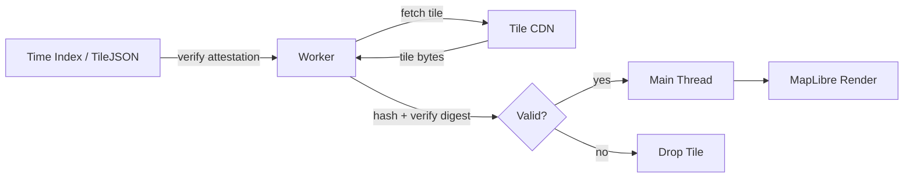

<!-- [KFM_META_BLOCK_V2]
doc_id: kfm://doc/TODO-verifiable-tile-rendering
title: Verifiable Tile Rendering (Mobile)
type: standard
version: v1
status: draft
owners: TODO
created: TODO
updated: TODO
policy_label: public
related: [apps/web/src, docs/architecture, data/catalog, TODO]
tags: [kfm, maplibre, verification, tiles]
notes: [NEEDS_VERIFICATION: owners, dates, related paths]
[/KFM_META_BLOCK_V2] -->

# Verifiable Tile Rendering (Mobile)
> Fail-closed, evidence-bound tile rendering for KFM public clients

---

## 🔎 Purpose

Define a **mobile-friendly, governed tile rendering pipeline** that ensures:

- Only **cryptographically verifiable tiles** are rendered
- All visible map data aligns with **KFM evidence and release doctrine**
- Rendering respects **fail-closed, public-safe defaults**

This document bridges:
- client rendering (MapLibre / Cesium)
- release artifacts (PMTiles, manifests)
- governance primitives (attestations, digests, receipts)

---

## ⚖️ Status & Scope

| Area | Status |
|------|--------|
| Verification pattern | PROPOSED |
| Worker model | PROPOSED |
| Time-slice indexing | PROPOSED |
| KFM integration alignment | INFERRED |
| Production readiness | NEEDS VERIFICATION |

---

## 🧭 Core Principles (KFM-Aligned)

### 1. Renderer ≠ Truth Source
Map clients **render only**:
- They do not assert truth
- They do not bypass governance

### 2. Evidence-Bound Rendering
Every tile must trace back to:
- ReleaseManifest
- EvidenceBundle lineage
- cryptographic verification

### 3. Fail-Closed Behavior
If verification fails:
- tile is **not rendered**
- no fallback to unverified data

### 4. Public-Safe Only
Client must:
- never access RAW / WORK / QUARANTINE
- only consume **released / published artifacts**

---

## 🧱 Architecture Overview



---

## 🧩 Core Components

### 1. Time Index (TileJSON + Attestation)

Maps time intervals → tile sources:

```json
{
  "att": {
    "sig": "<base64>",
    "payload": {
      "issued": "2026-04-10T00:00:00Z",
      "key_id": "kfm:sig:v1"
    }
  },
  "intervals": [
    {
      "iso": "2026-04-01/2026-04-15",
      "base": "pmtiles://kansas/base@v2026-03",
      "delta": "https://cdn/.../delta.json"
    }
  ]
}
```

| Field | Meaning |
|------|--------|
| `att` | signed attestation (Cosign / DSSE compatible) |
| `intervals` | time slicing for replay / playback |
| `base` | immutable PMTiles |
| `delta` | recent updates |

**Status:** PROPOSED

---

### 2. Tile Verification Worker

All verification MUST occur off the main thread.

#### Responsibilities

- Fetch index + verify signature
- Fetch tiles
- Compute SHA-256 digest
- Compare against manifest
- Return only verified tiles

---

### 3. Digest Manifest

Minimal structure:

```json
{
  "z/x/y": {
    "digest": "sha256:abcdef...",
    "url": "https://cdn/.../tile.mvt"
  }
}
```

| Constraint | Rule |
|----------|------|
| Digest | REQUIRED |
| URL | immutable or versioned |
| Missing entry | FAIL |

---

### 4. Rendering Boundary

Main thread:
- receives verified buffers only
- never performs trust decisions

---

## ⚙️ Minimal Worker Implementation

```js
// worker.js (illustrative example — PROPOSED)

self.onmessage = async (e) => {
  const { pubKeyJwk, indexUrl, tiles } = e.data;

  const res = await fetch(indexUrl);
  const index = await res.json();

  // Verify attestation
  const key = await crypto.subtle.importKey(
    "jwk",
    pubKeyJwk,
    { name: "ECDSA", namedCurve: "P-256" },
    false,
    ["verify"]
  );

  const enc = new TextEncoder();
  const ok = await crypto.subtle.verify(
    { name: "ECDSA", hash: "SHA-256" },
    key,
    Uint8Array.from(atob(index.att.sig), c => c.charCodeAt(0)),
    enc.encode(JSON.stringify(index.att.payload))
  );

  if (!ok) {
    postMessage({ type: "attestation_failed" });
    return;
  }

  const results = [];

  for (const t of tiles) {
    try {
      const r = await fetch(t.url);
      const buf = await r.arrayBuffer();

      const digest = await crypto.subtle.digest("SHA-256", buf);
      const hex = [...new Uint8Array(digest)]
        .map(b => b.toString(16).padStart(2, "0"))
        .join("");

      if (hex !== t.digest) throw new Error("bad_digest");

      results.push({ ...t, ok: true, buffer: buf });
    } catch (err) {
      results.push({ ...t, ok: false });
    }
  }

  postMessage({ type: "verified_tiles", results });
};
```

---

## 📱 Mobile Constraints

| Constraint | Target |
|-----------|--------|
| Workers | 1–2 |
| Concurrent fetches | 6–8 |
| Memory | bounded tile cache |
| CPU | avoid main-thread crypto |

---

## 🧪 Failure Modes

| Scenario | Behavior |
|----------|----------|
| Attestation invalid | abort layer |
| Digest mismatch | drop tile |
| Missing manifest entry | drop tile |
| Network failure | retry (bounded) |

**No fallback rendering allowed**

---

## 🔐 Security Model

| Layer | Control |
|------|--------|
| Identity | public key (JWK) |
| Integrity | SHA-256 digest |
| Authenticity | signature verification |
| Distribution | CDN (untrusted transport) |

---

## 🧭 KFM Integration

### Alignment with Doctrine

| KFM Concept | Mapping |
|------------|--------|
| ReleaseManifest | tile index + attestation |
| EvidenceBundle | upstream data lineage |
| Proof / Receipt | digest + signature |
| Public API | tile endpoints |
| Fail-closed | enforced in worker |

---

### Constraints

- Tiles must originate from **released artifacts**
- No direct model outputs allowed
- No RAW/WORK access
- Public DTO must remain safe

---

## 🖥️ UI Integration

### Evidence Drawer (INFERRED)

Should display:
- verification status
- source descriptor
- release version
- digest / signature reference
- limitations

---

### Trust Indicators

| Indicator | Meaning |
|----------|--------|
| Verified | fully trusted tile |
| Partial | some tiles dropped |
| Unverified | layer disabled |

---

## 📦 Suggested File Placement (PROPOSED)

```
apps/web/src/
  tiles/
    worker.ts
    verifier.ts
    manifest.ts

docs/architecture/
  VERIFIABLE_TILE_RENDERING.md
```

---

## 🚧 Open Questions

- Key rotation strategy (NEEDS VERIFICATION)
- Delta publishing pipeline (NEEDS VERIFICATION)
- Integration with STAC / DCAT catalogs (INFERRED)
- Proof/receipt emission for client verification (PROPOSED)

---

## ✅ Definition of Done

- [ ] Worker verifies attestation
- [ ] Digest validation enforced
- [ ] Fail-closed confirmed
- [ ] No unverified tiles rendered
- [ ] UI shows verification state
- [ ] Integration with governed API (NEEDS VERIFICATION)

---

## 🔁 Back to Top

[↑ Back to top](#verifiable-tile-rendering-mobile)
