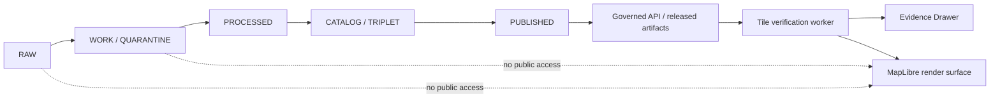
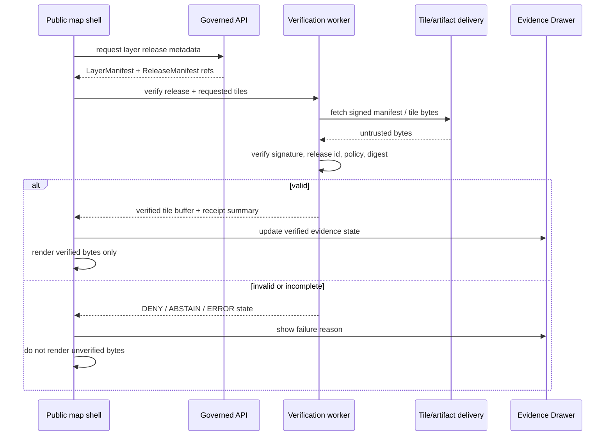

<!-- [KFM_META_BLOCK_V2]
doc_id: kfm://doc/TODO-verifiable-tile-rendering-mobile
title: Verifiable Tile Rendering (Mobile)
type: standard
version: v1
status: draft
owners: TODO: verify owner
created: 2026-04-30
updated: 2026-04-30
policy_label: public
related: [docs/architecture/VERIFIABLE_TILE_RENDERING_MOBILE.md, apps/web/src/TODO, schemas/contracts/v1/TODO, data/catalog/TODO]
tags: [kfm, maplibre, mobile, tiles, verification, release-manifest, evidence-bundle, fail-closed]
notes: [NEEDS_VERIFICATION: owner, final repo path, schema home, app path, release-manifest path, signing stack, key rotation, MapLibre adapter hook]
[/KFM_META_BLOCK_V2] -->

# Verifiable Tile Rendering (Mobile)

<p align="center">
  <strong>Fail-closed, evidence-bound tile rendering for KFM public map clients.</strong><br>
  Renderer pixels are downstream of release, evidence, policy, and review state.
</p>

<p align="center">
  
  
  
  
  
  
</p>

<p align="center">
  <a href="#scope">Scope</a> ·
  <a href="#operating-law">Operating law</a> ·
  <a href="#architecture">Architecture</a> ·
  <a href="#contracts">Contracts</a> ·
  <a href="#mobile-runtime">Mobile runtime</a> ·
  <a href="#validation">Validation</a> ·
  <a href="#rollback-and-correction">Rollback</a>
</p>

---

> [!IMPORTANT]
> This document is repo-ready guidance, not proof of current implementation. Paths, schemas, worker modules, adapter hooks, tests, workflows, signing commands, and runtime behavior remain `PROPOSED` or `NEEDS_VERIFICATION` until verified from a mounted KFM repository and pinned toolchain.

## At a glance

| Field | Value |
|---|---|
| Status | `draft` |
| Evidence mode | `CORPUS_ONLY / NO_LOCAL_REPO_EVIDENCE` for current implementation depth |
| Public posture | Render only released, public-safe artifacts; fail closed on missing evidence, policy, review, release, digest, or signature state |
| Renderer posture | MapLibre-first 2D rendering; Cesium/3D is conditional and downstream |
| Accepted inputs | `ReleaseManifest`, `LayerManifest`, `TileDigestManifest`, signed attestation, released tile artifact, `EvidenceBundle` references, `PolicyDecision` |
| Exclusions | `RAW`, `WORK`, `QUARANTINE`, unpublished candidates, direct model output, private endpoints, unreviewed sensitive exact geometry |
| Target first slice | No-network fixture slice with signed test manifest, digest-verified tile fixture, worker adapter contract, UI trust-state fixture, negative-path tests |

| What this document does | What it does not do |
|---|---|
| Defines the governed tile-verification pattern for mobile/public clients. | Does not prove the KFM repo already has these files, routes, schemas, tests, or workflows. |
| Gives proposed contracts, worker boundaries, UI states, tests, and rollback rules. | Does not authorize public release of any tile layer. |
| Preserves the KFM rule that tiles are downstream carriers, not truth. | Does not replace `EvidenceBundle` resolution, policy gates, review state, or release manifests. |

---

## Scope

This standard defines a mobile-friendly verification pattern for KFM map clients that consume public-safe tile artifacts such as vector tiles, PMTiles-backed tiles, and other released tile distributions.

It covers:

- signed release and layer manifests;
- digest verification for tile bytes or immutable tile artifacts;
- worker-based verification off the main thread;
- fail-closed renderer behavior;
- UI trust indicators and Evidence Drawer payload expectations;
- test, validation, rollback, and correction requirements.

It does **not** define:

- canonical source ingestion;
- promotion authority;
- signing-key custody;
- live source connectors;
- emergency alerting behavior;
- direct access to canonical/internal stores;
- exact sensitive-location publication rules beyond the fail-closed default.

<p align="right"><a href="#verifiable-tile-rendering-mobile">Back to top ↑</a></p>

## Repo fit

`PROPOSED` target location:

```text
docs/architecture/VERIFIABLE_TILE_RENDERING_MOBILE.md
```

`PROPOSED` adjacent implementation families, pending repo verification:

| Family | Proposed role | Status |
|---|---|---|
| `apps/web/src/tiles/verified/` | Worker, verifier, cache, adapter boundary | `PROPOSED` |
| `schemas/contracts/v1/tile_verification/` | Manifest, attestation, request/result, Evidence Drawer payload schemas | `PROPOSED / NEEDS_VERIFICATION: schema home` |
| `tests/fixtures/tile_verification/` | Valid and invalid manifest/tile fixtures | `PROPOSED` |
| `tools/validators/tile_release/` | Offline manifest and digest validator | `PROPOSED` |
| `data/catalog/TODO` | Catalog and release-manifest linkage | `NEEDS_VERIFICATION` |

> [!NOTE]
> If the mounted repo proves `contracts/` rather than `schemas/contracts/v1/` is the machine-contract home, create an ADR before landing duplicate schema definitions.

<p align="right"><a href="#verifiable-tile-rendering-mobile">Back to top ↑</a></p>

## Source basis

| Source | Status | Use in this document |
|---|---|---|
| Original `Verifiable Tile Rendering (Mobile)` draft | `CONFIRMED source draft` | Preserves the core idea: signed index, digest manifest, worker verification, fail-closed rendering, Evidence Drawer integration. |
| KFM project guidance | `CONFIRMED instruction/source posture` | Establishes truth labels, no-overclaim rule, renderer boundaries, public-client constraints, fail-closed posture, and GitHub Markdown expectations. |
| KFM MapLibre operating doctrine | `CORPUS-CONFIRMED doctrine / UNKNOWN repo implementation` | Supports MapLibre as downstream renderer, governed shell, Evidence Drawer, Focus Mode, released artifacts, and public-client rule. |
| KFM artifactization doctrine | `CORPUS-CONFIRMED doctrine / PROPOSED implementation` | Supports `ReleaseManifest`, `EvidenceBundle`, receipts, proof packs, catalog closure, correction, rollback, and `spec_hash` patterns. |
| Current repository evidence | `UNKNOWN` | No mounted repo was available in the visible workspace during this edit. |

## Operating law

### One-sentence rule

The renderer is downstream of trust, never upstream of it.

### KFM lifecycle boundary



### Non-negotiables

- Tiles are **released artifacts**, not canonical truth.
- A visible tile layer must resolve to a release, source role, policy posture, review state, and evidence lineage appropriate to its significance.
- A missing or invalid attestation, digest, manifest entry, policy decision, review state, or release state disables the affected layer or tile path.
- No renderer fallback may silently draw unverified data.
- Gaps caused by dropped tiles must be presented as verification failure or degraded verified coverage, not as absence of the underlying phenomenon.
- Public clients must not read `RAW`, `WORK`, `QUARANTINE`, unpublished candidate data, direct model output, or private source-system side effects.

<p align="right"><a href="#verifiable-tile-rendering-mobile">Back to top ↑</a></p>

## Architecture

### Governed verification flow



### Trust boundary map

| Boundary | Allowed | Blocked |
|---|---|---|
| Public client → governed API | Released layer metadata, public-safe DTOs, EvidenceRef resolution, policy-safe envelopes | RAW/WORK/QUARANTINE, unpublished candidates, direct model runtime, internal canonical stores |
| Worker → delivery endpoint | Immutable/versioned tile artifacts, signed manifests, bounded network fetches | Private endpoints, unsigned manifests, mutable unversioned tiles, direct source-system side effects |
| Worker → main thread | Verified buffers, finite trust states, receipt summaries | Unverified bytes, private keys, secrets, raw evidence payloads beyond public-safe DTO |
| Main thread → renderer | Verified buffers or disabled/degraded layer state | Trust decisions, digest bypass, silent fallback |

### Recommended integration patterns

| Pattern | When to use | Status |
|---|---|---|
| Backend-verified tile gateway | First implementation slice, simpler policy enforcement, easier observability | `PROPOSED / recommended first` |
| Client worker verification | Mobile/offline-friendly verification of immutable public artifacts | `PROPOSED / requires adapter proof` |
| MapLibre custom protocol / adapter hook | Needed if renderer must receive verified bytes through a protocol boundary | `NEEDS_VERIFICATION against pinned MapLibre wrapper` |
| Pre-verified PMTiles release bundle | Stable public-safe bundles with manifest-level integrity | `PROPOSED` |
| Cesium/3D verification adapter | Only where 3D carries evidence burden and same controls survive | `CONDITIONAL` |

> [!WARNING]
> Do not start with broad tile generation or public layer rollout. Start with a no-network fixture slice, one signed manifest, one valid tile fixture, one invalid digest fixture, one stale-release fixture, and a disabled-layer UI state.

<p align="right"><a href="#verifiable-tile-rendering-mobile">Back to top ↑</a></p>

## Contracts

All contracts in this section are `PROPOSED` and should become JSON Schemas or equivalent repo-native contracts after schema-home verification.

### Object families

| Object | Purpose | Minimum status |
|---|---|---|
| `ReleaseManifest` | Identifies the promoted release and immutable artifacts. | Required before public rendering. |
| `LayerManifest` | Connects a map layer to release, style, source role, policy, and evidence references. | Required before layer registration. |
| `TileDigestManifest` | Maps tile keys or artifact ranges to expected digests. | Required for tile-byte verification. |
| `TileVerificationAttestation` | Signature over canonical release/layer/digest payload. | Required unless backend gateway supplies equivalent proof. |
| `EvidenceRef` / `EvidenceBundle` | Connects visible layer claims to admissible evidence. | Required for consequential claims and Evidence Drawer. |
| `PolicyDecision` | Records allowed/denied/redacted/degraded public posture. | Required before public display. |
| `TileVerificationReceipt` | Records verification outcome and failure reason without leaking private data. | Required for review and rollback. |
| `CorrectionNotice` / `RollbackPlan` | Handles release withdrawal, replacement, or degraded-state correction. | Required before publication maturity. |

### Release manifest sketch

```json
{
  "manifest_version": "kfm.tile_release.v1",
  "release_id": "TODO: release id",
  "release_state": "published",
  "policy_label": "public",
  "issued_at": "2026-04-30T00:00:00Z",
  "expires_at": "TODO: optional expiry or rotation policy",
  "spec_hash": "sha256:TODO",
  "layers": [
    {
      "layer_id": "TODO: layer id",
      "layer_manifest_uri": "TODO: immutable layer manifest URI",
      "layer_manifest_digest": "sha256:TODO"
    }
  ],
  "attestation": {
    "scheme": "TODO: dsse|sigstore|jws|repo-native",
    "key_id": "TODO: key id",
    "payload_canonicalization": "TODO: JCS or repo-native canonicalization",
    "signature": "TODO: base64 or bundle ref"
  }
}
```

### Layer manifest sketch

```json
{
  "manifest_version": "kfm.layer_manifest.v1",
  "layer_id": "TODO: layer id",
  "release_id": "TODO: release id",
  "source_role": "released_public_derivative",
  "renderer": "maplibre",
  "tile_format": "mvt",
  "artifact_uri": "TODO: immutable tile URL or pmtiles URI",
  "artifact_digest": "sha256:TODO",
  "digest_manifest_uri": "TODO: immutable digest manifest URI",
  "digest_manifest_digest": "sha256:TODO",
  "evidence_refs": ["TODO: kfm://evidence/..."],
  "policy_decision_ref": "TODO: kfm://policy-decision/...",
  "review_state": "TODO: reviewed|approved|draft",
  "limitations": ["TODO: public-safe limitation text"]
}
```

### Tile digest manifest sketch

```json
{
  "manifest_version": "kfm.tile_digest_manifest.v1",
  "release_id": "TODO: release id",
  "layer_id": "TODO: layer id",
  "digest_algorithm": "sha256",
  "tiles": {
    "z/x/y": {
      "url": "TODO: immutable tile URL",
      "digest": "sha256:TODO",
      "byte_size": 0,
      "media_type": "application/vnd.mapbox-vector-tile"
    }
  }
}
```

### Worker request / result sketch

```ts
export type TileVerificationOutcome =
  | "VERIFIED"
  | "DEGRADED"
  | "DENY"
  | "ABSTAIN"
  | "ERROR";

export interface TileVerificationRequest {
  requestId: string;
  releaseId: string;
  layerId: string;
  tileKey: string;
  tileUrl: string;
  expectedDigest: `sha256:${string}`;
  abortAfterMs?: number;
}

export interface VerifiedTileResult {
  requestId: string;
  releaseId: string;
  layerId: string;
  tileKey: string;
  outcome: TileVerificationOutcome;
  reason?: string;
  digest?: `sha256:${string}`;
  byteLength?: number;
  /** Present only when outcome is VERIFIED. Transfer the ArrayBuffer, do not clone it. */
  buffer?: ArrayBuffer;
}
```

> [!CAUTION]
> Signatures must cover exactly the canonical bytes that were signed. Do not verify a reserialized JavaScript object with `JSON.stringify(...)` unless the canonicalization method is specified, tested, and used identically by the signer and verifier.

<p align="right"><a href="#verifiable-tile-rendering-mobile">Back to top ↑</a></p>

## Mobile runtime

### Worker responsibilities

The verification worker should:

- fetch only immutable/versioned public-safe manifests and tile artifacts;
- verify release and layer attestation before tile verification;
- compute SHA-256 or repo-approved digest for tile bytes;
- compare against the digest manifest;
- return buffers only for `VERIFIED` tiles;
- emit finite negative states for invalid, stale, missing, denied, or failed verification;
- preserve bounded receipt metadata for review without leaking sensitive internals.

The main thread should:

- request verification;
- render verified buffers only;
- display disabled/degraded layer states;
- update Evidence Drawer payloads;
- never make trust decisions itself.

### Mobile constraints

| Constraint | Target | Notes |
|---|---|---|
| Workers | 1–2 verification workers | Tune after profiling; avoid starving rendering and gestures. |
| Concurrent fetches | 4–8 bounded requests | Original target was 6–8; final value needs device profiling. |
| Memory | Bounded cache keyed by `release_id + layer_id + tile_key + digest` | Never reuse cache entries across releases without digest match. |
| CPU | Hashing off main thread | Main thread remains for UI and renderer interaction. |
| Network | Retry with backoff and abort | Avoid infinite retries and battery drain. |
| Offline | Previously verified cache may be used only when release validity and digest still match | Stale or expired releases degrade or disable. |

### Cache rules

- Cache keys include release id, layer id, tile key, expected digest, and byte length when available.
- A digest mismatch invalidates the cache entry immediately.
- A newer release must not reuse old tile bytes unless the digest and release policy permit reuse.
- A cache hit is still a verified tile only if the stored digest matches the current manifest and release state is valid.

### Illustrative worker skeleton

```ts
// PROPOSED / illustrative only — adapt to repo-native worker framework and pinned renderer adapter.

async function sha256Hex(buffer: ArrayBuffer): Promise<`sha256:${string}`> {
  const digest = await crypto.subtle.digest("SHA-256", buffer);
  const hex = [...new Uint8Array(digest)]
    .map((byte) => byte.toString(16).padStart(2, "0"))
    .join("");

  return `sha256:${hex}`;
}

function normalizeDigest(value: string): `sha256:${string}` {
  if (!value.startsWith("sha256:")) {
    throw new Error("unsupported_digest_format");
  }

  return value.toLowerCase() as `sha256:${string}`;
}

async function verifyTile(request: TileVerificationRequest): Promise<VerifiedTileResult> {
  try {
    const response = await fetch(request.tileUrl, {
      cache: "no-store",
      credentials: "omit"
    });

    if (!response.ok) {
      return { ...request, outcome: "ERROR", reason: `network_${response.status}` };
    }

    const buffer = await response.arrayBuffer();
    const actualDigest = await sha256Hex(buffer);
    const expectedDigest = normalizeDigest(request.expectedDigest);

    if (actualDigest !== expectedDigest) {
      return {
        ...request,
        outcome: "DENY",
        reason: "digest_mismatch",
        digest: actualDigest,
        byteLength: buffer.byteLength
      };
    }

    return {
      ...request,
      outcome: "VERIFIED",
      digest: actualDigest,
      byteLength: buffer.byteLength,
      buffer
    };
  } catch (error) {
    return {
      ...request,
      outcome: "ERROR",
      reason: error instanceof Error ? error.message : "unknown_error"
    };
  }
}
```

<p align="right"><a href="#verifiable-tile-rendering-mobile">Back to top ↑</a></p>

## Security model

### Threats and controls

| Threat | Control | Failure posture |
|---|---|---|
| CDN tampering | Digest manifest + signed release/layer manifest | Drop tile or disable layer. |
| Manifest tampering | Signature over canonical manifest payload | Abort layer. |
| Stale/replayed release | `release_id`, issued/expiry policy, allowed key id, release-state check | Disable layer or show stale/degraded state. |
| Mixed-release tile cache | Cache keyed by release id and digest | Reject cache hit. |
| Worker bypass | Renderer adapter accepts only worker-verified buffers or backend-verified gateway responses | Disable layer. |
| Key compromise | Key registry, rotation policy, revocation/withdrawal, release invalidation | Withdraw release and clear cache. |
| Sensitive exact geometry exposure | Policy decision, review state, generalized/redacted artifacts only | Deny public rendering. |
| Resource exhaustion | Bounded workers, fetch concurrency, tile size limits, retry caps | ERROR/degraded state. |
| Private endpoint leakage | Public-safe URL allowlist; no credentials in client requests | Deny request. |

### Key handling

`PROPOSED` key rules:

- Client verification uses public keys only.
- Private signing keys never enter client code, fixtures, screenshots, documentation examples, or worker payloads.
- `key_id` must resolve through an approved public key registry or pinned release metadata.
- Key rotation and revocation are `NEEDS_VERIFICATION` before production use.
- A release signed by an unknown, revoked, expired, or wrong-purpose key fails closed.

<p align="right"><a href="#verifiable-tile-rendering-mobile">Back to top ↑</a></p>

## UI and Evidence Drawer

### Trust states

| State | Meaning | UI behavior |
|---|---|---|
| `VERIFIED` | Manifest, policy, release, and tile digest checks passed. | Render tile; show verified release/evidence state. |
| `DEGRADED` | Only a verified subset is available, or noncritical metadata is incomplete. | Render verified subset only; show visible degraded banner or layer note. |
| `ABSTAIN` | Evidence or release linkage is insufficient for a consequential claim. | Do not make claim; show why evidence is insufficient. |
| `DENY` | Policy, sensitivity, review, source role, signature, or digest rule blocks rendering. | Disable tile/layer; show denial reason where public-safe. |
| `ERROR` | Technical failure prevents reliable verification. | Disable or retry boundedly; show error state without fallback rendering. |

### Evidence Drawer payload expectations

The Evidence Drawer should show public-safe details such as:

- layer id and display name;
- release id and release state;
- verification outcome;
- source role;
- policy label and policy decision summary;
- EvidenceBundle reference or reason for abstention;
- digest and signature reference summary;
- limitations and known caveats;
- correction or rollback notice if active.

It should not show:

- private keys or secret material;
- private source endpoints;
- RAW/WORK/QUARANTINE details;
- exact sensitive coordinates when public-safe geometry is generalized;
- internal reviewer notes not cleared for public view.

<p align="right"><a href="#verifiable-tile-rendering-mobile">Back to top ↑</a></p>

## Failure modes

| Scenario | Required behavior | Outcome |
|---|---|---|
| Attestation invalid | Abort affected layer before tile rendering. | `DENY` |
| Attestation missing | Abort affected layer unless backend gateway supplies equivalent verified proof. | `ABSTAIN` or `DENY` |
| Digest mismatch | Drop tile; invalidate cache; record receipt summary. | `DENY` |
| Missing digest manifest entry | Do not fetch/render tile. | `ABSTAIN` |
| Network failure | Retry boundedly with backoff; never render unverified fallback. | `ERROR` |
| Expired release | Disable layer or require updated manifest. | `DENY` |
| Unknown source role | Disable layer until source role is resolved. | `ABSTAIN` |
| Missing review state | Disable layer for public clients. | `ABSTAIN` |
| Sensitive exact geometry unresolved | Deny public exact layer; require redaction/generalization receipt. | `DENY` |
| Worker unavailable | Disable verified rendering or route through backend-verified gateway. | `ERROR` |

<p align="right"><a href="#verifiable-tile-rendering-mobile">Back to top ↑</a></p>

## Validation

### Minimum test matrix

| Test | Fixture | Expected result |
|---|---|---|
| Valid release + valid tile digest | Signed manifest + matching tile bytes | `VERIFIED`, buffer returned |
| Bad attestation | Signature mismatch | `DENY`, no buffer |
| Missing manifest entry | Tile key absent | `ABSTAIN`, no fetch or no render |
| Digest mismatch | Manifest digest differs from bytes | `DENY`, no buffer, cache invalidated |
| Unknown key id | Signed with unapproved key | `DENY` |
| Expired release | Past expiry or withdrawn state | `DENY` |
| Unclear sensitivity | Missing policy decision for sensitive layer | `DENY` |
| Missing EvidenceBundle ref | Layer has consequential claim with no evidence ref | `ABSTAIN` |
| Network timeout | Aborted fetch | `ERROR`, bounded retry only |
| Cache collision attempt | Same tile key, different release/digest | Reject old cache entry |
| Main-thread bypass | Attempt to render unverified bytes | Test fails; adapter blocks |

### Proposed validation commands

```bash
# Illustrative only — NEEDS VERIFICATION against mounted repo conventions.
python tools/validators/tile_release/validate_manifest.py \
  tests/fixtures/tile_verification/valid/release_manifest.json

# Illustrative only — NEEDS VERIFICATION against mounted repo conventions.
pnpm test -- tile-verification
```

### Definition of Done

- [ ] Repo path and schema home are verified or recorded in an ADR.
- [ ] `ReleaseManifest`, `LayerManifest`, and `TileDigestManifest` schemas exist in the accepted schema home.
- [ ] Valid and invalid no-network fixtures cover signature, digest, stale release, missing evidence, missing review, and policy denial.
- [ ] Worker or backend gateway verifies manifest authenticity before tile bytes are eligible for rendering.
- [ ] Tile digest validation is enforced before any renderer path receives bytes.
- [ ] Main-thread renderer adapter cannot render unverified bytes.
- [ ] Evidence Drawer shows release, verification, policy, evidence, and limitation state.
- [ ] Degraded/disabled layer states are visible and not confused with real-world absence.
- [ ] Public client has no RAW/WORK/QUARANTINE or direct model-output path.
- [ ] Rollback/withdrawal clears or invalidates affected tile caches.
- [ ] CI gate or equivalent validator blocks public-release candidates that fail verification.

<p align="right"><a href="#verifiable-tile-rendering-mobile">Back to top ↑</a></p>

## Rollback and correction

A tile release must be withdrawable without relying on users to understand internal release mechanics.

| Trigger | Required action |
|---|---|
| Bad digest manifest | Withdraw affected release; publish correction notice; block cache reuse by release id. |
| Compromised signing key | Revoke key id; invalidate releases signed by key according to policy; rotate key; publish rollback plan. |
| Sensitive geometry leak | Deny layer; purge public cache where possible; issue redaction receipt; publish generalized replacement only after review. |
| Incorrect evidence linkage | Disable Evidence Drawer claim; publish correction notice; rebuild layer only after EvidenceBundle closure. |
| Policy regression | Block release candidate; revert policy or layer manifest change; retain validation report. |
| Renderer adapter bypass | Disable adapter; force backend-verified gateway or no-render state until fixed. |

Correction artifacts should preserve:

- affected release id;
- affected layer ids;
- reason for withdrawal or correction;
- replacement release id if any;
- public-safe notice text;
- cache invalidation rule;
- reviewer and approval state where required.

<p align="right"><a href="#verifiable-tile-rendering-mobile">Back to top ↑</a></p>

## Implementation sequence

### Phase 0 — verify repo reality

- [ ] Confirm branch, dirty state, package manager, app path, schema home, tests, workflows, release artifact paths, MapLibre wrapper, and existing layer registry.
- [ ] Identify whether public tile delivery is currently backend-mediated, CDN/PMTiles-based, or mixed.
- [ ] Identify existing object families: `ReleaseManifest`, `LayerManifest`, `EvidenceBundle`, `PolicyDecision`, receipts, proof packs, correction notices, rollback plans.

### Phase 1 — schema + fixture slice

- [ ] Add schema-home ADR if needed.
- [ ] Add manifest and worker DTO schemas.
- [ ] Add valid/invalid fixtures.
- [ ] Add offline validator and negative-path tests.
- [ ] Add documentation links from MapLibre/UI architecture docs.

### Phase 2 — worker or gateway verification

- [ ] Implement manifest attestation verification.
- [ ] Implement tile digest verification.
- [ ] Add bounded cache, retry, and abort behavior.
- [ ] Block main-thread/rendering bypass.

### Phase 3 — UI trust surface

- [ ] Add layer trust states.
- [ ] Add Evidence Drawer payload mapping.
- [ ] Add degraded/disabled layer affordances.
- [ ] Add public-safe error and abstention copy.

### Phase 4 — release and rollback rehearsal

- [ ] Run release dry-run.
- [ ] Simulate bad digest withdrawal.
- [ ] Simulate key rotation or revoked key.
- [ ] Verify cache invalidation and correction notice behavior.

<p align="right"><a href="#verifiable-tile-rendering-mobile">Back to top ↑</a></p>

## Open questions

| Question | Status | Why it matters |
|---|---|---|
| Which schema home is authoritative? | `NEEDS_VERIFICATION` | Prevents duplicate contract definitions. |
| Which signing stack is accepted? | `NEEDS_VERIFICATION` | Determines attestation format and CI gate. |
| Is client-side verification required, or is backend gateway verification enough for first slice? | `PROPOSED decision` | Controls complexity and mobile battery cost. |
| What MapLibre adapter hook is pinned in repo? | `NEEDS_VERIFICATION` | Determines how verified bytes enter renderer. |
| What is the key rotation and revocation process? | `NEEDS_VERIFICATION` | Required before production trust claims. |
| How are PMTiles/range requests represented in manifests? | `NEEDS_VERIFICATION` | Needed for whole-artifact versus per-tile digest strategy. |
| How does Evidence Drawer resolve tile-level versus layer-level evidence? | `PROPOSED` | Prevents overclaiming tile pixels as evidence. |
| How are stale or withdrawn releases communicated to offline users? | `NEEDS_VERIFICATION` | Required for mobile/offline trust. |

## Anti-patterns

Do not:

- render unsigned or digest-mismatched tiles;
- fall back to an unverified source when verification fails;
- treat a tile, PMTiles archive, scene, graph edge, vector index, or screenshot as sovereign truth;
- let a map popup make a consequential claim without EvidenceBundle resolution;
- expose RAW/WORK/QUARANTINE or unpublished candidates to public clients;
- put private signing keys, credentials, or private endpoints in client code or fixtures;
- use green CI/security/release badges until current repo evidence verifies the target;
- publish exact sensitive geometries without policy, review, and redaction/generalization receipts.

<details>
<summary>Appendix — Proposed file inventory</summary>

| Proposed path | Purpose | Status |
|---|---|---|
| `docs/architecture/VERIFIABLE_TILE_RENDERING_MOBILE.md` | This standard | `PROPOSED` |
| `docs/adr/ADR-tile-verification-schema-home.md` | Resolve schema-home ambiguity | `PROPOSED` |
| `schemas/contracts/v1/tile_verification/release_manifest.schema.json` | Release manifest schema | `PROPOSED` |
| `schemas/contracts/v1/tile_verification/layer_manifest.schema.json` | Layer manifest schema | `PROPOSED` |
| `schemas/contracts/v1/tile_verification/tile_digest_manifest.schema.json` | Digest manifest schema | `PROPOSED` |
| `schemas/contracts/v1/tile_verification/tile_verification_result.schema.json` | Worker result schema | `PROPOSED` |
| `schemas/contracts/v1/tile_verification/evidence_drawer_tile_payload.schema.json` | Evidence Drawer payload schema | `PROPOSED` |
| `apps/web/src/tiles/verified/worker.ts` | Verification worker | `PROPOSED / NEEDS_VERIFICATION: app path` |
| `apps/web/src/tiles/verified/verifier.ts` | Manifest and digest verification helpers | `PROPOSED / NEEDS_VERIFICATION: app path` |
| `apps/web/src/tiles/verified/cache.ts` | Bounded verified tile cache | `PROPOSED / NEEDS_VERIFICATION: app path` |
| `apps/web/src/tiles/verified/maplibreAdapter.ts` | Renderer adapter boundary | `PROPOSED / NEEDS_VERIFICATION: MapLibre hook` |
| `tests/fixtures/tile_verification/valid/` | Valid no-network fixtures | `PROPOSED` |
| `tests/fixtures/tile_verification/invalid/` | Negative-path fixtures | `PROPOSED` |
| `tools/validators/tile_release/validate_manifest.py` | Offline validation | `PROPOSED / language NEEDS_VERIFICATION` |

</details>

<details>
<summary>Appendix — Review checklist</summary>

- [ ] Metadata block owner and related paths verified.
- [ ] Schema-home decision recorded.
- [ ] Source role for every tile layer is explicit.
- [ ] Release state is explicit and public-safe.
- [ ] Policy decision exists and blocks unclear sensitivity.
- [ ] Evidence references resolve or layer abstains.
- [ ] Signature verification cannot be bypassed.
- [ ] Digest verification cannot be bypassed.
- [ ] Worker never returns unverified buffers.
- [ ] Renderer never receives unverified buffers.
- [ ] Evidence Drawer shows verification state and limitations.
- [ ] Rollback invalidates caches.
- [ ] Public docs do not contain secrets, private endpoints, or fabricated badge claims.

</details>

---

## Final rule

Render verified released artifacts, surface uncertainty honestly, and fail closed before a tile becomes a false claim.

<p align="right"><a href="#verifiable-tile-rendering-mobile">Back to top ↑</a></p>
