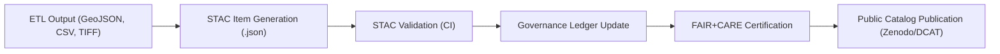

<div align="center">

# 🗂️ **ADR-0001 — Adopt STAC 1.0 for Dataset Metadata and Data Storage Hierarchy (v2.1.1)**  
`docs/architecture/adr/ADR-0001-data-storage.md`

**Decision:** Establish **STAC 1.0** as the canonical metadata framework for all KFM datasets and adopt a consistent **data storage hierarchy** ensuring FAIR+CARE compliance, reproducibility, and open standard interoperability.

[](../../../.github/workflows/stac-validate.yml)
[](../../../docs/)
[](../../../.github/workflows/docs-validate.yml)
[](../../../LICENSE)

</div>

---

## 🧭 Context

The Kansas Frontier Matrix required a unified, open-standard metadata framework to organize, publish, and validate its diverse dataset collections — encompassing historical archives, environmental records, AI enrichments, and GIS assets.

Previous ad-hoc JSON or CSV metadata structures lacked:
- Common metadata vocabulary (preventing interoperability with OGC/W3C systems)
- Machine-validated schema and FAIR+CARE audit support
- Traceable links between datasets, derivatives, and their provenance
- Efficient catalog search and API discovery

Adopting **STAC (SpatioTemporal Asset Catalog) 1.0** provides a flexible, JSON-based structure aligning with **FAIR** and **DCAT 3.0** while remaining compatible with OGC standards.

---

## 🧩 Decision

KFM will:

1. **Adopt STAC 1.0** as the core metadata schema for all dataset catalogs and collections.  
2. **Implement hierarchical storage** aligned to STAC concepts:  
   ```
   data/
   ├── raw/
   ├── work/
   │   ├── tmp/
   │   ├── processed/
   │   └── validation/
   ├── stac/
   │   ├── catalog.json
   │   ├── collections/
   │   └── items/
   └── archive/
   ```
3. Integrate **STAC/DCAT crosswalks** in metadata workflows (using `stac2dcat.py`).  
4. Link STAC metadata directly to **Governance Ledgers** and **FAIR+CARE validation reports**.  
5. Require all ETL pipelines to emit validated `.stac-item.json` and `.stac-collection.json` outputs.  
6. Synchronize checksum integrity across STAC and `manifest.zip` via CI.  

---

## 🧮 Alternatives Considered

| Alternative | Description | Outcome |
|:--|:--|:--|
| **DCAT-only (W3C)** | Dataset-level cataloging; lacks spatial/temporal granularity. | ❌ Inadequate for geospatial lineage. |
| **Custom JSON Schema** | Lightweight, bespoke schema. | ❌ High maintenance; no interoperability. |
| **STAC 0.9.x** | Older pre-1.0 structure. | ❌ Non-compliant with FAIR & OGC. |
| **GeoBlacklight** | Solr-based metadata for academic repositories. | ❌ Heavy dependencies, non-FAIR native. |

---

## ⚙️ Consequences

### ✅ Positive
- Full **FAIR+CARE** alignment via open schemas (STAC + DCAT).  
- Unified catalog across all domains (data, AI, historical, climate).  
- Automated validation (`stac-validate.yml`) ensures metadata quality.  
- Seamless DCAT export to external catalogs (CKAN, Zenodo, Data.gov).  
- Direct link between metadata and **Governance Ledger** (`data/reports/audit/data_provenance_ledger.json`).

### ⚠️ Negative
- Increased ETL pipeline complexity (must emit valid STAC).  
- Periodic schema upgrades required as STAC evolves.  
- Requires dedicated validator infrastructure in CI.  

---

## 🧠 Implementation

| Phase | Action | Responsible | Tools |
|:--|:--|:--|:--|
| Phase 1 | Define STAC schema integration & metadata export pipeline | @kfm-data | `stac-validator`, `jq`, `python-stac` |
| Phase 2 | Update ETL templates to output `.stac-item.json` | @kfm-etl-ops | `src/pipelines/templates/` |
| Phase 3 | Implement CI validation & crosswalk (`stac-validate.yml`) | @kfm-architecture | GitHub Actions + `stac-validator` |
| Phase 4 | FAIR+CARE audit linkage | @kfm-governance | `faircare-validate.yml` |
| Phase 5 | Provenance + manifest integration | @kfm-docs | `data/reports/audit/data_provenance_ledger.json` |

---

## 🧭 Governance & Validation


<!-- END OF MERMAID -->

> All STAC validation results are automatically published under  
> `data/reports/validation/stac_validation_report.json`.

---

## ⚖️ FAIR + CARE Alignment

| Principle | Implementation | Evidence |
|:--|:--|:--|
| **Findable** | STAC catalog, item IDs, and API indexing | `data/stac/catalog.json` |
| **Accessible** | Open data via FAIR repository exports | Zenodo · CKAN · STAC API |
| **Interoperable** | STAC/DCAT/CIDOC crosswalk | `src/pipelines/metadata_bridge/` |
| **Reusable** | CC-BY 4.0 license; checksum audit | `LICENSE` · `manifest.zip` |
| **Collective Benefit (CARE)** | Transparent and ethical data traceability | Governance Ledger |

---

## 🧾 Decision Summary

| Field | Value |
|:--|:--|
| **ADR ID** | ADR-0001 |
| **Title** | Adopt STAC 1.0 for Dataset Metadata and Data Storage Hierarchy |
| **Decision Date** | 2025-10-05 |
| **Status** | Accepted |
| **Reviewed By** | @kfm-architecture · @kfm-data · @kfm-docs |
| **Governance Link** | `docs/standards/governance/ROOT-GOVERNANCE.md` |
| **Validation Link** | `data/reports/validation/stac_validation_report.json` |

---

## 🕰️ Version History

| Version | Date | Author | Summary |
|:--|:--|:--|:--|
| **v2.1.1** | 2025-11-16 | @kfm-architecture | Standardized under MCP-DL v6.4.3; added storage hierarchy, FAIR+CARE mapping, and CI validation details. |
| v2.0.0 | 2025-10-05 | @kfm-data-lab | Initial ADR creation adopting STAC 1.0 and hierarchical data storage policy. |

---

<div align="center">

**Kansas Frontier Matrix © 2025**  
*“Metadata with Meaning — Provenance with Purpose.”*  
📍 `docs/architecture/adr/ADR-0001-data-storage.md` — Decision record for dataset metadata and storage standards.

</div>