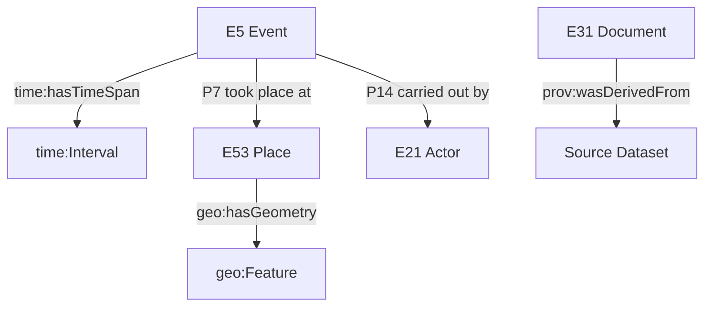

# 🧠 **ADR-0002 — Ontology Alignment: Neo4j CIDOC CRM + OWL-Time + GeoSPARQL (v2.1.1)**  
`docs/architecture/adr/ADR-0002-ontology-mapping.md`

**Decision:** Establish a **unified semantic ontology model** combining **CIDOC CRM**, **OWL-Time**, and **GeoSPARQL** for the Kansas Frontier Matrix (KFM) Knowledge Graph — enabling temporal, spatial, and cultural-historical interoperability under FAIR+CARE principles.

---

## 🧭 Context

The Kansas Frontier Matrix integrates historical, environmental, and spatial datasets — linking people, places, events, and documents across centuries.  
However, without a shared ontology, relationships between datasets (e.g., treaties, flood events, land cover, geologic features) were inconsistent across pipelines.

Previous graph schemas were ad hoc and domain-specific, limiting interoperability and machine reasoning.  
The system required an ontology framework capable of:

- Representing **temporal** and **geospatial** relationships consistently.  
- Enabling **semantic inference** across datasets.  
- Supporting **Linked Open Data (LOD)** and **FAIR data publishing**.  
- Maintaining **CIDOC CRM** cultural heritage semantics with OWL-Time and GeoSPARQL interoperability.

---

## 🧩 Decision

KFM adopts a **hybrid ontology model** combining:

| Ontology | Purpose | Integration Scope |
|:--|:--|:--|
| **CIDOC CRM** | Core conceptual model for cultural and historical data (people, events, places, documents). | Graph backbone (`E5_Event`, `E53_Place`, `E21_Person`, `E31_Document`). |
| **OWL-Time** | Temporal reasoning for events, periods, and intervals. | Temporal edges (`time:Interval`, `time:Instant`). |
| **GeoSPARQL** | Spatial geometry and topological reasoning. | Geospatial edges (`geo:Feature`, `geo:hasGeometry`). |
| **PROV-O** | Provenance ontology for dataset derivations and workflows. | AI/ETL provenance nodes (`prov:wasDerivedFrom`, `prov:Activity`). |

### Model Architecture

<!-- END OF MERMAID -->

- **Neo4j Graph Model:** `(:Person)-[:PARTICIPATED_IN]->(:Event)-[:OCCURRED_AT]->(:Place)`  
- **Temporal Data:** OWL-Time intervals mapped to `Event.start_date` / `Event.end_date`.  
- **Spatial Data:** GeoSPARQL geometries represented as WKT literals and GeoJSON.

---

## 🧮 Alternatives Considered

| Option | Description | Status |
|:--|:--|:--|
| **Schema.org + DCAT** | Lightweight but limited for deep temporal or cultural modeling. | ❌ Insufficient detail. |
| **Custom JSON-LD Ontology** | KFM-specific ontology without LOD alignment. | ❌ High maintenance; not reusable. |
| **CIDOC CRM only** | Lacks temporal geometry reasoning. | ⚠️ Too rigid for environmental integration. |

---

## ⚙️ Consequences

### ✅ Positive
- Unified ontology for cross-domain queries and reasoning.  
- Enables FAIR+CARE publishing as Linked Open Data.  
- Supports AI-driven semantic search and contextual inference.  
- Reusable graph schema for future domain expansion.  
- Enhances explainability of AI models through structured context.

### ⚠️ Negative
- Requires higher technical expertise to maintain ontology mappings.  
- Complex query logic (multi-ontology joins in Cypher/GraphQL).  
- Larger metadata overhead per node.

---

## 🧠 Implementation Plan

| Phase | Action | Responsible | Tools |
|:--|:--|:--|:--|
| Phase 1 | Integrate CIDOC CRM core classes (`E5_Event`, `E53_Place`, `E21_Person`) | @kfm-graph | Neo4j APOC + Python ETL |
| Phase 2 | Extend temporal reasoning with OWL-Time (interval edges) | @kfm-ai | `rdflib`, `pySHACL` |
| Phase 3 | Add GeoSPARQL support for spatial reasoning | @kfm-data | `geosparql`, `postgrest` |
| Phase 4 | Implement ontology validation CI (`ontology-validate.yml`) | @kfm-architecture | `pySHACL` + GitHub Actions |
| Phase 5 | FAIR+CARE Council review of ethical implications | @kfm-governance | `data/reports/fair/data_care_assessment.json` |

---

## ⚖️ FAIR + CARE Integration

| Principle | Implementation | Artifact |
|:--|:--|:--|
| **Findable** | URI-based entity resolution (CIDOC identifiers). | `src/graph/schema/ontology_mapping.py` |
| **Accessible** | JSON-LD graph exports + FAIR API | `/api/v1/graph/export` |
| **Interoperable** | RDF-based ontology alignment | `docs/architecture/knowledge-graph.md` |
| **Reusable** | Open license (CC-BY 4.0) + SPARQL endpoints | `LICENSE` |
| **Collective Benefit** | Culturally sensitive modeling approved by governance council. | `data/stac/*properties.data_ethics` |

---

## 🔍 Validation & Governance

- **Ontology Validator:** `ontology-validate.yml` (runs SHACL shape checks).  
- **Graph Integrity CI:** Verifies Cypher schema alignment with CIDOC/OWL-Time.  
- **Governance Ledger:** Records versioned ontology decisions and changes.  
- **FAIR+CARE Audit:** Validates cultural and ethical mappings across datasets.

> **Artifacts:**  
> - `reports/validation/ontology_validation_report.json`  
> - `reports/audit/data_provenance_ledger.json`  

---

## 🧾 Decision Summary

| Field | Value |
|:--|:--|
| **ADR ID** | ADR-0002 |
| **Decision Date** | 2025-10-07 |
| **Status** | Accepted |
| **Governance Link** | `docs/standards/governance/ROOT-GOVERNANCE.md` |
| **Validation Report** | `data/reports/validation/ontology_validation_report.json` |
| **Linked ADRs** | ADR-0001-data-storage, ADR-0003-ai-governance-framework |

---

## 🕰 Version History

| Version | Date | Author | Summary |
|:--|:--|:--|:--|
| **v2.1.1** | 2025-11-16 | @kfm-architecture | Standardized ADR; integrated OWL-Time & GeoSPARQL alignment; CI validator added. |
| v2.0.0 | 2025-10-07 | @kfm-graph | Initial adoption of CIDOC CRM ontology for Neo4j schema design. |

---

**Kansas Frontier Matrix © 2025**  
*“Ontologies connect knowledge — Governance connects meaning.”*  
📍 `docs/architecture/adr/ADR-0002-ontology-mapping.md` — Decision record for semantic ontology alignment.

