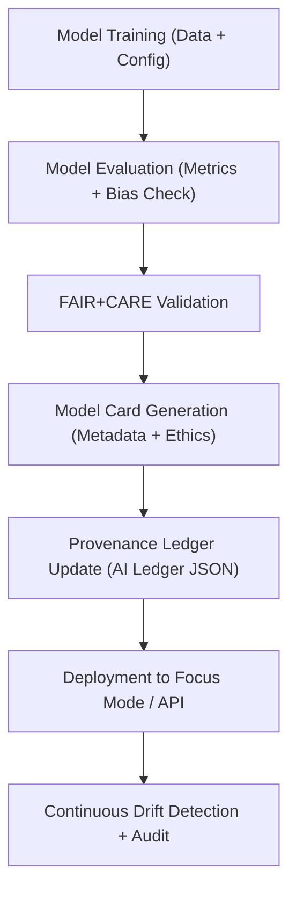

# 🧮 **ADR-0003 — AI Governance Framework: FAIR+CARE Compliance & Model Lifecycle Management (v2.1.1)**  
`docs/architecture/adr/ADR-0003-ai-governance-framework.md`

**Decision:** Establish a comprehensive **AI Governance Framework** ensuring transparency, ethical compliance, and provenance control for all models deployed within the **Kansas Frontier Matrix (KFM)** — uniting FAIR+CARE principles, model cards, audits, and continuous validation pipelines.

---

## 🧭 Context

KFM integrates AI models to enrich metadata, summarize documents, and perform entity extraction and reasoning within the Focus Mode AI interface.  
However, prior to 2025, these models operated without centralized **governance**, **bias tracking**, or **FAIR+CARE oversight**, creating risk of unverified outputs and ethical blind spots.

Governance was needed to ensure:
- Transparent AI decision-making and auditability.  
- FAIR+CARE ethical compliance across all AI-generated outputs.  
- Lifecycle tracking of model training, validation, and drift metrics.  
- Integration of explainability and provenance into each model’s metadata.  

---

## 🧩 Decision

### Framework Overview

KFM will adopt a **FAIR+CARE AI Governance Framework** consisting of:

| Layer | Description | Deliverables |
|:--|:--|:--|
| **Model Registry** | Central repository of all trained models with metadata. | `releases/v*/models.json` |
| **Model Cards** | Human-readable summaries documenting purpose, data, metrics, and ethics. | `docs/templates/model_card.md` |
| **FAIR+CARE Validation** | Continuous audit of datasets, training, and inference ethics. | `faircare-validate.yml` |
| **Bias and Drift Detection** | Automated metrics checking statistical fairness and temporal drift. | `ai-drift-detect.yml` |
| **Provenance Ledger** | Immutable record of model lineage, data sources, and governance actions. | `data/reports/audit/ai_hazards_ledger.json` |

All AI workflows must emit **signed, versioned model artifacts** with accompanying SBOMs and governance attestations.

---

## 🧱 Architecture & Workflow

<!-- END OF MERMAID -->

- **Registry:** Each model registered with version, checksum, and metadata references.  
- **Ethics Review:** FAIR+CARE Council approval logged before public release.  
- **Provenance:** Models linked to datasets via `derived_from` (PROV-O compliant).  
- **Explainability:** SHAP/LIME summaries included in model cards for transparency.  

---

## 🧠 Governance Domains

| Domain | Objective | Compliance Artifact |
|:--|:--|:--|
| **Data Provenance** | Ensure all training data are FAIR+CARE aligned. | `data/reports/audit/data_provenance_ledger.json` |
| **Bias & Fairness** | Detect and document model bias metrics. | `reports/validation/ai_validation_metrics.csv` |
| **Explainability** | Provide SHAP/LIME-based interpretability. | `docs/templates/model_card.md` |
| **Reproducibility** | Model hash verification + deterministic builds. | `releases/v*/manifest.zip` |
| **Ethics Oversight** | Council review for data sensitivity. | `data/reports/fair/data_care_assessment.json` |

---

## ⚙️ Consequences

### ✅ Positive
- Unified AI lifecycle management and reproducibility.
- Automated FAIR+CARE validation for model releases.
- Integrated governance with human oversight (Council sign-off).
- Comprehensive transparency through model cards and ledgers.

### ⚠️ Negative
- Adds CI/CD complexity to AI pipeline validation.
- Requires cross-disciplinary governance (AI + ethics + data).
- Increases model deployment latency due to review gates.

---

## 🧩 Implementation Phases

| Phase | Objective | Responsible | Artifacts |
|:--|:--|:--|:--|
| Phase 1 | Define model metadata schema & card template | @kfm-ai | `docs/templates/model_card.md` |
| Phase 2 | Integrate validation into CI (`faircare-validate.yml`) | @kfm-architecture | FAIR+CARE audit reports |
| Phase 3 | Establish AI provenance ledger | @kfm-data | `data/reports/audit/ai_hazards_ledger.json` |
| Phase 4 | Implement drift detection and bias tracking | @kfm-ai-lab | `reports/validation/ai_validation_metrics.csv` |
| Phase 5 | Governance sign-off and public release | @kfm-governance | Council-approved report |

---

## ⚖️ FAIR + CARE Compliance Mapping

| Principle | Implementation | Evidence |
|:--|:--|:--|
| **Findable** | Model registry with unique IDs & JSON index. | `releases/v*/models.json` |
| **Accessible** | Model cards published under CC-BY. | `docs/templates/model_card.md` |
| **Interoperable** | Linked via PROV-O and STAC-derived metadata. | `src/pipelines/ai/metadata_bridge.py` |
| **Reusable** | Deterministic reproducibility and SBOM trace. | `releases/v*/manifest.zip` |
| **Collective Benefit (CARE)** | Ethical reviews ensure AI outputs benefit communities. | `data/reports/fair/data_care_assessment.json` |

---

## 🔍 Validation & CI Integration

| Workflow | Function | Output |
|:--|:--|:--|
| `faircare-validate.yml` | FAIR+CARE audit for models | `reports/fair/data_fair_summary.json` |
| `ai-drift-detect.yml` | Bias and drift detection pipeline | `reports/validation/ai_validation_metrics.csv` |
| `governance-ledger.yml` | Model lineage & checksum attestation | `data/reports/audit/ai_hazards_ledger.json` |
| `policy-check.yml` | Metadata validation & license enforcement | `reports/audit/governance_results.json` |

---

## 🧾 Decision Summary

| Field | Value |
|:--|:--|
| **ADR ID** | ADR-0003 |
| **Title** | AI Governance Framework — FAIR+CARE Compliance and Model Lifecycle Management |
| **Status** | Accepted |
| **Decision Date** | 2025-10-10 |
| **Governance Link** | `docs/standards/governance/ROOT-GOVERNANCE.md` |
| **Validation Reports** | `reports/fair/data_fair_summary.json`, `reports/validation/ai_validation_metrics.csv` |
| **Linked ADRs** | ADR-0001-data-storage, ADR-0002-ontology-mapping |

---

## 🕰 Version History

| Version | Date | Author | Summary |
|:--|:--|:--|:--|
| **v2.1.1** | 2025-11-16 | @kfm-ai | Standardized ADR format; added CI pipeline details and provenance ledger integration. |
| v2.0.0 | 2025-10-10 | @kfm-governance | Initial adoption of FAIR+CARE AI governance with model lifecycle policy. |

---

**Kansas Frontier Matrix © 2025**  
*“Ethical Intelligence is Transparent Intelligence.”*  
📍 `docs/architecture/adr/ADR-0003-ai-governance-framework.md` — Decision record for AI governance and ethical lifecycle compliance.

