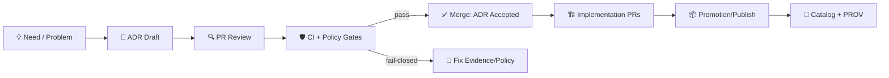

<a id="top"></a>

# 🧭📜 `docs/architecture/adr/` — KFM Architecture Decision Records


> **ADRs are the “why” behind KFM.**  
> If it changes *architecture, contracts, provenance, governance, sovereignty posture, security posture,* or *operational guarantees*, it should land here.

---

## 🧭 What Makes KFM ADRs Different

KFM isn’t “just” a GIS app. It’s a **governed evidence platform** with **policy-gated publishing**, **provenance-first outputs**, and **human-in-the-loop AI**.

> [!IMPORTANT]
> **KFM defaults to “fail-closed.”**  
> If provenance/evidence/governance checks can’t be performed, the correct behavior is to **block** promotion/publishing—not “best effort” ship-it.

Key architectural principles that ADRs must protect:

- 🧾 **Evidence-first narrative**: any narrative output (Story Nodes, Focus Mode, summaries) must be labeled and *cited*; no citations → no answer.
- 🔐 **Policy Pack enforcement** (OPA/Rego + Conftest): governance rules apply equally to humans and automation; violations block merges/promotions.
- 🧬 **Provenance is a first-class contract**: STAC/DCAT/PROV are not “metadata later,” they’re part of the artifact.
- 🧑‍⚖️ **FAIR+CARE + sovereignty** are engineering constraints (not a checklist at the end).
- 🤖 **AI is advisory**: AI may propose plans/configs; deterministic code executes; PR review remains mandatory.
- 🗺️ **Map UI must show trust signals**: provenance, sensitivity markings, and (when necessary) obfuscation/generalization are UX primitives.

---

## 🎯 Purpose

This folder contains **Architecture Decision Records (ADRs)** for the Kansas Frontier Matrix (KFM). ADRs:

- ✅ capture *context → decision → consequences* (including “what we didn’t choose”)
- ✅ provide a durable audit trail for **governance-impacting** and **trust-impacting** choices
- ✅ prevent “tribal knowledge” across the KFM stack:
  - 🧱 **data pipelines** (STAC/DCAT/PROV, promotion workflow, deterministic transforms)
  - 🕸️ **knowledge graph** (Neo4j + ontology alignment, entity linking, provenance edges)
  - 🧩 **API contracts** (REST/OpenAPI, GraphQL, JSON Schema)
  - 🗺️ **web UI** (MapLibre 2D, Cesium 3D, Story Nodes, timeline, Focus Mode)
  - 🔐 **governance & security** (policy gates, secrets posture, supply-chain attestations)
  - 🧪 **simulation & modeling** (reproducibility rules, V&V, uncertainty quantification)

---

## 🗂️ Directory Layout

```text
docs/architecture/adr/ 🧭📜
├─ ✅📄 README.md                          # ✅ (this file) 📌 ADR purpose, lifecycle, and naming/numbering rules
├─ 🧩📄 TEMPLATE.md                         # 🧩 Canonical ADR template (copy for new decisions)
├─ 🧪📄 ADR-0001-example-decision.md        # 🧪 Example ADR (remove once real ADRs exist)
├─ ➕📄 ADR-0002-....md                     # ➕ New decisions live here (increment numbers; keep titles kebab-case)
├─ 🗺️📄 INDEX.md                            # 🗺️ Optional ADR register (auto-generated list + status summary)
└─ 🧷 _assets/                              # 🧷 Optional diagrams/images referenced by ADRs (keep small + cited)
```

> [!TIP]
> If you generate `INDEX.md`, treat it like build output:
> - ✅ regenerate in CI (from ADR frontmatter)
> - ✅ don’t hand-edit

---

## 🧱 When an ADR Is Required

Create an ADR when a change impacts **one or more** categories below.

### 🧬 Evidence / provenance / catalog contracts
- STAC/DCAT/PROV profile changes (required fields, extensions, folder conventions)
- lineage guarantees: determinism rules, hashing strategy, signing/attestation
- promotion saga changes (e.g., *sign → attest → publish → catalog*) behavior changes
- provenance modeling changes (e.g., PROV Agents/Activities/Entities semantics)

### 🧾 Public-facing contracts
- breaking changes to REST/OpenAPI payloads
- GraphQL schema/directive changes
- JSON Schemas that shape API, catalog, or UI payloads
- time-filtered query contracts (time is first-class in KFM; changes are **contract changes**)

### 🏗️ Architecture & infrastructure shape
- DB topology (PostGIS/Neo4j), indexing/partitioning/replication strategy
- storage canonicalization (COG/PMTiles/GeoParquet/vector tiles, etc.)
- orchestration posture (queue/broker adoption, job runners, workflow engines)
- “sandbox vs promotion” boundaries and enforcement (workbench outputs ≠ official outputs)

### 🤖 AI, automation, and “assistants”
- Focus Mode constraints (citation enforcement, refusal behavior, logging)
- agent architecture (Watcher/Planner/Executor), kill-switch semantics, bot identity/signing
- “AI proposes, deterministic code executes” boundary changes
- any change to how AI outputs are stored/audited (governance ledger, PROV for AI answers)

### 🗺️ UI, narrative, and trust UX
- Story Node format/schema (Markdown/JSON), playback engine behavior, citation rendering
- map timeline changes (slider behavior, caching strategy for time-sliced tiles)
- sensitivity enforcement in UI (lock icons, hidden layers, generalized geometry rules)
- 2D/3D transition behavior (MapLibre ↔ Cesium continuity guarantees)

### 🔐 Security, privacy, sovereignty, and policy gates
- authn/authz changes, secrets posture, token lifetimes
- OPA/Conftest policy semantics or required checks
- data access tiering, obfuscation strategies (e.g., hex/generalization for sensitive sites)
- PII handling (EXIF stripping, face blur, deterministic filenames for field capture)
- CARE/Indigenous sovereignty constraints that affect data access/publishing

### 🧪 Simulation & modeling credibility (M&S)
- verification/validation requirements
- reproducibility requirements (pinned inputs, pinned environments, seeds)
- calibration/validation separation; uncertainty quantification (UQ) deliverables
- drift detection gates, CI credibility checks, “model output promotion” rules

> **Rule of thumb:** if someone could reasonably ask “why is it this way?” in 6 months, that’s an ADR. 🧠

---

## 🧷 ADR Taxonomy (Recommended)

Use tags/scopes so ADRs remain searchable:

| Tag 🏷️ | Meaning | Examples |
|---|---|---|
| `contracts` | API/schema compatibility | OpenAPI shape, GraphQL directives |
| `provenance` | lineage + evidence rules | PROV JSON-LD, citation enforcement |
| `governance` | FAIR+CARE + sovereignty posture | sensitivity tiers, access controls |
| `security` | supply chain + auth | signing, SBOM, secrets scanning |
| `pipelines` | ingest/transform/publish | promotion saga, deterministic transforms |
| `ui` | map/narrative UX | timeline behavior, Story Nodes playback |
| `ai` | assistants/agents | Focus Mode refusal rules, bot kill-switch |
| `simulation` | modeling credibility | V&V gates, UQ expectations |
| `performance` | scaling + caching | tile caching, time-sliced performance |

---

## 🧾 Minimum “Evidence Bundle” for a KFM ADR

KFM ADRs should be *auditable*, not just readable.

Include (or link to) the relevant artifacts:

- 🧷 **Affected contracts**: OpenAPI/GraphQL/schema diffs, STAC/DCAT/PROV diffs
- 🧬 **Provenance plan**: what entities/activities/agents change? what gets logged?
- 🔐 **Governance notes**:
  - FAIR+CARE impacts
  - sensitivity/access tier changes
  - sovereignty constraints and approvals
- 🧪 **Rollout plan**: forward migration + backout + how to validate success
- 📈 **Ops + telemetry**: new metrics/log schema, SLO impact, failure modes
- 🧠 **AI impact statement** (if relevant): citation/refusal behavior, logging/audit
- 🗺️ **UI trust impact** (if relevant): how provenance + sensitivity are surfaced

> [!NOTE]
> KFM’s default expectation is **PR + CI + policy gates** for anything that becomes “official.”  
> ADRs should describe how the change remains enforceable (not just documented).

---

## 🚦 Workflow



1. 🧩 **Draft** ADR from template
2. 🔍 **Review** via PR (tag: `architecture`, `governance`, `security` when relevant)
3. 🛡️ **Run gates** (markdown lint + schema lint + policy pack checks)
4. ✅ **Accept** by merging + setting status to `accepted`
5. 🧱 **Implement** with references:
   - PR description links the ADR
   - commit trailer (recommended): `Refs: ADR-00XX`
6. 🧪 **Enforce** with CI:
   - policy pack checks (OPA/Conftest)
   - provenance/citation checks where relevant
   - secrets scanning / supply-chain rules (as applicable)

---

## 🏷️ Naming & Status Rules

### File naming
- `ADR-####-kebab-case-title.md`
- 4 digits, zero-padded: `ADR-0007-...`

### Required statuses
Use one of:
- `proposed`
- `accepted`
- `superseded`
- `deprecated`
- `rejected`

### Superseding
If you supersede a decision:
- create a new ADR that **references** the older one
- update the older ADR’s status to `superseded`
- add a `superseded_by:` pointer

---

## 🧠 Decision Quality Checklist

Before merging an ADR, confirm:

- [ ] The *problem* is stated in a way a new contributor can understand
- [ ] The decision is **specific & testable** (not “we should improve X”)
- [ ] Alternatives are real options (not strawmen)
- [ ] Consequences include tradeoffs (latency, cost, complexity, risk)
- [ ] Governance notes exist when touching FAIR+CARE / sovereignty
- [ ] Rollout **and** backout path exist for high-impact changes
- [ ] The decision is enforceable via CI/policy gates (or explicitly scoped as non-enforceable)

---

## 🧪 Recommended CI Guardrails

Keep ADRs useful and enforceable:

- ✅ **One ADR per major architectural shift**
- ✅ ADR frontmatter must include: `status`, `date`, `owners`, `scope`, `impacts`
- ✅ Superseded ADR must declare successor
- ✅ Contract-breaking PRs must reference an ADR
- ✅ Automation changes (agents/Focus Mode) must reference an ADR
- ✅ Optional but powerful: **frontmatter guard** via Conftest + OPA

> [!TIP]
> Consider auto-generating `INDEX.md` from ADR frontmatter in CI to keep the register current 📌

---

## 🧩 `TEMPLATE.md` (canonical)

> Keep the actual template in `docs/architecture/adr/TEMPLATE.md`.  
> This excerpt shows the **KFM-ready** structure (contracts + provenance + governance).

```markdown
---
title: "ADR-0000: <Decision Title>"
status: "proposed"
date: "YYYY-MM-DD"
owners: ["@team-or-handle"]
scope: ["api", "pipelines", "graph", "web", "ops", "ai", "governance", "simulation"]
impacts:
  - "contracts"
  - "provenance"
  - "security"
  - "ui_trust"
supersedes: []
superseded_by: []

# Optional (recommended for KFM governance/search)
tags: ["governance", "provenance"]
risk_level: "low|medium|high"
policy_pack_touched: true
---

# ADR-0000: <Decision Title>

## Context
What is happening? Why now? What constraints exist?
- Evidence links:
- Known invariants (must not break):
- Governance constraints (FAIR+CARE + sovereignty):

## Decision
What are we doing? Be crisp and testable.

## Alternatives Considered
- A) ...
- B) ...
- C) ...

## Consequences
### ✅ Positive
- ...

### ⚠️ Negative / Risks
- ...

## Rollout / Migration Plan
- Step 1 ...
- Step 2 ...
- Backout plan ...

## Policy, Governance, Ethics, Sovereignty Notes
- FAIR+CARE considerations
- Sensitivity/access-tier changes
- Sovereignty constraints + approvals
- UI trust signals (provenance + sensitivity surfaced)

## Verification & Enforcement
- CI checks added/updated
- Policy pack rules added/updated
- How we prove compliance (artifacts, logs, PROV bundles)

## References
- Links to relevant docs/PRs/issues
```

---

## 📚 Project Evidence Pointers

Use these as “system context anchors” when drafting ADRs:

### 🧱 Core KFM architecture & implementation
- 📘 **Comprehensive Architecture, Features, and Design** (v13 architecture posture)
- 📙 **Comprehensive Technical Documentation** (implementation + constraints)
- 🗺️ **Comprehensive UI System Overview** (MapLibre/Cesium, timeline, story UX, sensitivity UI)

### 🤖 AI + automation posture
- 🧭🤖 **AI System Overview** (Focus Mode, citations, XAI/audit expectations)
- 📥 **Data Intake – Technical & Design Guide** (policy gates, agents, sandbox→promotion, provenance)
- 🌟 **Latest Ideas & Future Proposals** (roadmap drivers; real-time feeds, bulk ingest, story evolution)

### 🧪 Ops / CI / governance hardening
- 💡 **Pulse Ideas** (governance metadata patterns, CI gate patterns, provenance bundles)

### 🚀 Innovation & future-facing design inputs
- ✨ **Innovative Concepts to Evolve KFM** (AR, 4D digital twins, AI co-pilots, sensitivity-aware UX)

### 📚 Research library portfolios (background references)
These are “multi-doc” PDF portfolios used for deeper technical grounding (NOT normative on their own):
- 🤖 **AI Concepts & more** (ML/AI textbooks, evaluation, theory)
- 🧠 **Data Management / Bayesian / Data Engineering** (DB scaling, CI/CD, privacy, inference, cryptography)
- 🗺️ **Maps / WebGL / Virtual Worlds / Archaeology** (map design, projections, WebGL, GEE, 3D GIS)
- 🧰 **Programming Languages & Resources** (React/TS/Node/Postgres/Docker/security references)

<details>
<summary>🗂️ Suggested repo location for the research portfolios</summary>

```text
docs/_library/ 📚
├─ portfolios/ 🧳
│  ├─ AI Concepts & more.pdf
│  ├─ Data Managment-Theories-...pdf
│  ├─ Maps-GoogleMaps-...webgl.pdf
│  └─ Various programming langurages & resources 1.pdf
└─ README.md 🧭
```

</details>

---

## 🔗 Navigation

- ⬅️ Back to **Architecture**: `docs/architecture/README.md`
- ⬅️ Back to **Docs Home**: `docs/README.md`
- 🧑‍⚖️ **Governance Root**: `docs/governance/ROOT_GOVERNANCE.md`
- 🧷 **Ethics**: `docs/governance/ETHICS.md`
- 🪶 **Sovereignty Policy**: `docs/governance/SOVEREIGNTY.md`

---

## 🧾 Version History

- **v13.0.1** (2026-01-20) — Expanded KFM-specific ADR triggers (AI/agents, UI trust, simulation credibility), added evidence bundle + research library guidance, and strengthened CI/policy-gate alignment.
- **v13.0.0** (2026-01-12) — Initial ADR README for KFM v13 architecture cycle.

<a id="bottom"></a>
