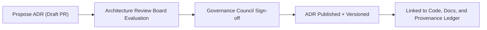

<div align="center">

# 📜 **Kansas Frontier Matrix — Architecture Decision Records (ADR) Index (v2.1.1 · Tier-Ω+∞ Certified)**  
`docs/architecture/adr/README.md`

**Mission:** Record, govern, and preserve the **architectural reasoning, trade-offs, and design decisions** that shape the Kansas Frontier Matrix (KFM).  
Each ADR is a **permanent governance artifact** validated under **Master Coder Protocol (MCP-DL)** ensuring provenance, reproducibility, and FAIR+CARE ethical traceability.

[](../../../docs/)
[](../../../.github/workflows/docs-validate.yml)
[](../../../.github/workflows/policy-check.yml)
[](../../../LICENSE)

</div>

---

## 📚 Overview

**Architecture Decision Records (ADRs)** document **why** and **how** technical and design decisions were made.  
They capture the context, rationale, consequences, and governance metadata ensuring long-term reproducibility and institutional memory.

Each ADR includes:
- **Context:** The problem, constraints, and alternative approaches considered  
- **Decision:** The final resolution and reasoning  
- **Consequences:** Technical and governance implications  
- **Status:** Proposed · Accepted · Superseded · Deprecated  
- **Cross-links:** Related ADRs, issues, PRs, or architecture files  

---

## 🗂️ Directory Layout

```bash
docs/architecture/adr/
├── README.md                          # This file — ADR index & governance guide
│
├── ADR-0001-data-storage.md           # Defines data storage hierarchy & STAC integration
├── ADR-0002-ontology-mapping.md       # Aligns Neo4j schema to CIDOC CRM / OWL-Time
├── ADR-0003-ai-governance-framework.md# Establishes FAIR+CARE AI compliance workflow
└── templates/
    ├── adr-template.md                # ADR front-matter + section structure
    └── adr-decision-guide.md          # Authoring & review guidelines
```

---

## 🧩 ADR Schema Template

Every ADR follows the **KFM-ADR Standard v3.0**, harmonized with **MADR 3.0** and **MCP-DL 6.4.3**.

```yaml
---
adr_id: "ADR-####"
title: "Concise Decision Title"
authors: ["@author"]
reviewers: ["@kfm-architecture","@kfm-docs"]
status: "Proposed|Accepted|Superseded|Deprecated"
decision_date: "YYYY-MM-DD"
last_reviewed: "YYYY-MM-DD"
governance_link: "docs/standards/governance/ROOT-GOVERNANCE.md"
related_adrs: ["ADR-####"]
license: "CC-BY 4.0"
---
```

### Section Layout

```md
# Context
Explain the problem, goals, and alternatives evaluated.

# Decision
State the final decision and rationale.

# Consequences
List trade-offs, implications, and technical or ethical impacts.

# Status
Proposed · Accepted · Superseded · Deprecated.

# References
Include related ADRs, PRs, tickets, or external standards.
```

---

## 🧭 ADR Lifecycle


<!-- END OF MERMAID -->

| State | Description | Validation |
|:--|:--|:--|
| **Proposed** | Drafted ADR submitted for review. | Checked for front-matter + metadata. |
| **Accepted** | Officially approved by the Architecture Council. | Added to governance ledger. |
| **Superseded** | Replaced by a newer ADR. | Linked via `related_adrs`. |
| **Deprecated** | Retained for historical record. | Archived and version-locked. |

---

## ⚙️ Governance Integration

| Artifact | Function | Location |
|:--|:--|:--|
| **Governance Ledger** | Stores ADR approvals & reviewer signatures | `data/reports/audit/data_provenance_ledger.json` |
| **Policy-Check.yml** | Validates ADR front-matter + status fields | `.github/workflows/policy-check.yml` |
| **ADR Validator** | Ensures required sections & completeness | `adr_validate.yml` |
| **Release Manifest** | Publishes ADR checksums for provenance | `releases/v2.1.1/manifest.zip` |

---

## 🔗 ADR Cross-References

| ADR ID | Title | Relationship |
|:--|:--|:--|
| `ADR-0001` | Adopt STAC 1.0 for Dataset Metadata | Precedent |
| `ADR-0002` | Align Graph Ontology to CIDOC CRM + OWL-Time | Parallel |
| `ADR-0003` | Define FAIR+CARE AI Governance Framework | Complementary |

> Use `related_adrs:` to link dependent decisions or updates.

---

## 🧠 Best Practices for Authors

- Keep **titles concise** (≤ 10 words).  
- Write **decisions**, not debates. Focus on outcome.  
- Reference **implementation links** (PRs, diagrams, tickets).  
- Maintain **consistent numbering** (`ADR-####`).  
- Cross-reference **related ADRs** to maintain lineage.  
- Review annually for relevance and archival status.  

---

## 🧾 Example ADR

```yaml
---
adr_id: "ADR-0001"
title: "Adopt STAC 1.0 for Dataset Metadata"
authors: ["@kfm-architecture","@kfm-data"]
status: "Accepted"
decision_date: "2025-10-05"
last_reviewed: "2025-11-16"
governance_link: "docs/standards/governance/ROOT-GOVERNANCE.md"
license: "CC-BY 4.0"
---
```

### Context
KFM required a consistent metadata framework for spatial and temporal datasets.

### Decision
Adopt the **SpatioTemporal Asset Catalog (STAC 1.0)** as the canonical metadata schema for discoverability and FAIR compliance.

### Consequences
- ✅ Interoperability with OGC and DCAT ecosystems.  
- ✅ Alignment with FAIR+CARE.  
- ⚠️ Ongoing validator maintenance required for future STAC releases.

---

## 🧾 Review & Sign-Off

| Reviewer | Role | Date | Status |
|:--|:--|:--|:--|
| @kfm-architecture | Lead Architect | 2025-11-16 | ✅ Approved |
| @kfm-docs | Documentation Steward | 2025-11-16 | ✅ Published |
| @kfm-governance | FAIR+CARE Council | 2025-11-16 | ✅ Certified |

---

## 🧩 Observability Metrics

| Metric | Description | Threshold | Source |
|:--|:--|:--|:--|
| `adr_frontmatter_coverage` | ADRs containing required metadata | 100% | Policy-Check |
| `adr_review_frequency` | ADRs reviewed within 12 months | ≥ 95% | Governance Dashboard |
| `adr_crossref_integrity` | Valid links between related ADRs | 100% | ADR Validator |
| `adr_retention_compliance` | ADRs retained per policy | 100% | Audit Logs |

---

## 🕰 Version History

| Version | Date | Author | Summary |
|:--|:--|:--|:--|
| **v2.1.1** | 2025-11-16 | @kfm-architecture | Standardized ADR index, schema, governance links, and CI policy alignment. |
| v2.0.0 | 2025-10-25 | @kfm-data-lab | Added cross-references and annual review policy. |
| v1.0.0 | 2025-10-05 | @kfm-architecture | Initial ADR framework under MCP-DL governance. |

---

<div align="center">

**Kansas Frontier Matrix © 2025**  
*“Decisions Made Transparent — Knowledge Made Permanent.”*  
📍 `docs/architecture/adr/README.md` — Central ADR Registry for the Kansas Frontier Matrix.

</div>