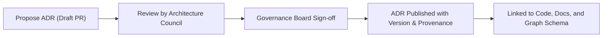

<div align="center">

# 📜 **Kansas Frontier Matrix — Architecture Decision Records (ADR) Index (v2.1.1 · Tier-Ω+∞ Certified)**  
`docs/architecture/adr/README.md`

**Mission:** Record and preserve the **architectural reasoning, trade-offs, and technical decisions** that shape the Kansas Frontier Matrix (KFM).  
Each ADR is a **governance artifact** under **MCP-DL v6.4.3**, ensuring provenance, FAIR+CARE alignment, and traceability between decisions, implementations, and documentation.

[](../../../docs/)
[](../../../.github/workflows/docs-validate.yml)
[](../../../.github/workflows/policy-check.yml)
[](../../../LICENSE)

</div>

---

## 🧭 Overview

Architecture Decision Records (ADRs) document **why** and **how** KFM’s architectural choices were made.  
They provide **historical context**, **rationale**, and **traceability** to implementation, ensuring that design intent and governance alignment remain verifiable.

Each ADR includes:
- **Context:** Problem background and alternatives considered  
- **Decision:** Final resolution and justification  
- **Consequences:** Technical, ethical, and operational impacts  
- **Status:** Proposed · Accepted · Deprecated  
- **Cross-links:** Related ADRs, issues, and commits  

---

## 🗂️ Directory Layout

```bash
docs/architecture/adr/
├── README.md                          # This file — ADR index and policy
│
├── ADR-0001-data-storage.md           # Decision: data storage hierarchy and STAC integration
├── ADR-0002-ontology-mapping.md       # Decision: Neo4j CIDOC CRM + OWL-Time ontology alignment
├── ADR-0003-ai-governance-framework.md# Decision: FAIR+CARE compliance and model audit pipeline
└── templates/
    ├── adr-template.md                # Reusable ADR front-matter + structure
    └── adr-decision-guide.md          # Guidelines for authoring & reviewing ADRs
```

---

## 🧩 ADR Structure Template

Every ADR follows the **KFM-ADR Standard v3.0**, derived from the MADR 3.0 and MCP-DL 6.4.3 specifications.

```yaml
---
adr_id: "ADR-####"
title: "Concise Decision Title"
authors: ["@username1","@username2"]
reviewers: ["@kfm-architecture","@kfm-docs"]
status: "Proposed|Accepted|Superseded|Deprecated"
decision_date: "YYYY-MM-DD"
last_reviewed: "YYYY-MM-DD"
governance_link: "docs/standards/governance/ROOT-GOVERNANCE.md"
related_adrs: ["ADR-####"]
license: "CC-BY 4.0"
---
```

### Section Layout
```md
# Context
Explain the problem, alternatives, and rationale.

# Decision
Describe what was chosen and why.

# Consequences
List positive and negative effects.

# Status
Current state (Proposed, Accepted, Superseded, Deprecated).

# References
Links to issues, PRs, standards, or external documentation.
```

---

## 🧮 ADR Lifecycle


<!-- END OF MERMAID -->

| State | Description | CI Enforcement |
|:--|:--|:--|
| **Proposed** | Submitted via PR for Council review. | Policy-check ensures metadata completeness. |
| **Accepted** | Officially approved and implemented. | ADR validated + versioned in manifest. |
| **Superseded** | Replaced by a new ADR. | Linked via `related_adrs`. |
| **Deprecated** | No longer relevant but kept for history. | Flagged in governance ledger. |

---

## ⚙️ Governance Integration

| Artifact | Purpose | Location |
|:--|:--|:--|
| **Governance Ledger** | Records ADR approvals and authorship signatures. | `data/reports/audit/data_provenance_ledger.json` |
| **Policy-Check.yml** | Validates ADR front-matter and status fields. | `.github/workflows/policy-check.yml` |
| **ADR Validation** | Confirms required sections and Markdown structure. | `adr_validate.yml` |
| **Release Manifest** | Includes ADR checksums for provenance. | `releases/v2.1.1/manifest.zip` |

---

## 🔗 ADR Cross-References

| Related ADRs | Description | Relationship |
|:--|:--|:--|
| `ADR-0001-data-storage.md` | Defines the data hierarchy and STAC integration policy. | Precedent |
| `ADR-0002-ontology-mapping.md` | Defines semantic alignment between Neo4j schema and CIDOC CRM. | Parallel |
| `ADR-0003-ai-governance-framework.md` | Establishes ethical AI governance framework. | Complementary |

---

## 🧠 Best Practices for ADR Authors

- Keep **titles concise** and avoid jargon.  
- Write **decisions, not discussions** — focus on outcome and reasoning.  
- Link to supporting **PRs, diagrams, or documents**.  
- Ensure **cross-references** to dependent ADRs and related governance docs.  
- Maintain **consistent numbering**: increment sequentially (no reuse).  
- Review all ADRs at least once per year for currency.  

---

## 🧾 Example ADR Entry

```yaml
---
adr_id: "ADR-0001"
title: "Adopt STAC 1.0 for Dataset Metadata"
authors: ["@kfm-architecture","@kfm-data"]
status: "Accepted"
decision_date: "2025-10-05"
last_reviewed: "2025-11-16"
governance_link: "docs/standards/governance/ROOT-GOVERNANCE.md"
license: "CC-BY 4.0"
---
```

### Context
KFM required a consistent metadata framework for spatial and temporal datasets.

### Decision
Adopt the **SpatioTemporal Asset Catalog (STAC 1.0)** specification to ensure interoperability, discoverability, and FAIR compliance.

### Consequences
- ✅ Increased metadata interoperability.  
- ✅ Simplified FAIR+CARE alignment.  
- ⚠️ Requires validator maintenance with future STAC releases.

---

## 🧾 Review & Sign-Off

| Reviewer | Role | Date | Status |
|:--|:--|:--|:--|
| @kfm-architecture | Lead Architect | 2025-11-16 | ✅ Approved |
| @kfm-docs | Documentation Steward | 2025-11-16 | ✅ Published |
| @kfm-governance | FAIR+CARE Board | 2025-11-16 | ✅ Certified |

---

## 🕰️ Version History

| Version | Date | Author | Summary |
|:--|:--|:--|:--|
| **v2.1.1** | 2025-11-16 | @kfm-architecture | Added ADR index, templates, governance integration, and lifecycle diagram. |
| v2.0.0 | 2025-10-25 | @kfm-data-lab | Introduced ADR cross-references and version tracking. |
| v1.0.0 | 2025-10-05 | @kfm-architecture | Initial ADR structure and governance workflow. |

---

<div align="center">

**Kansas Frontier Matrix © 2025**  
*“Decisions Made Transparent — Knowledge Made Permanent.”*  
📍 `docs/architecture/adr/README.md` — Central ADR registry for Kansas Frontier Matrix.

</div>