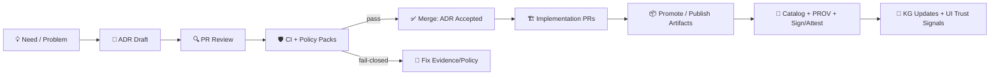

<a id="top"></a>

# 🧭📜 `docs/architecture/adr/` — Kansas Frontier Matrix Architecture Decision Records


> **ADRs are the “why” behind KFM.**  
> If it changes **architecture**, **contracts**, **provenance**, **governance**, **sovereignty posture**, **security posture**, **AI guardrails**, or **operational guarantees**, it belongs here. ✅

---

<details>
<summary>📌 Quick Navigation</summary>

- 🧠 [Purpose](#purpose)
- 🧷 [KFM Non‑Negotiables](#kfm-non-negotiables)
- 🗂️ [Directory Layout](#directory-layout)
- 🧱 [When an ADR Is Required](#when-an-adr-is-required)
- 🧭 [How to Create an ADR](#how-to-create-an-adr)
- 🧾 [Minimum Evidence Bundle](#minimum-evidence-bundle-for-a-kfm-adr)
- 🚦 [Workflow](#workflow)
- 🏷️ [Naming & Status Rules](#naming--status-rules)
- 🧩 [Template](#templatemd-canonical)
- 📚 [Project Evidence Pointers](#project-evidence-pointers)
- 🔗 [Navigation](#navigation)
- 🧾 [Version History](#version-history)

</details>

---

## 🧠 What Makes KFM ADRs Different

KFM is not “just” a mapping app. It is a **governed evidence platform** built to support:

- 🗺️ **4D exploration** (space + time + narrative + uncertainty)
- 🧬 **provenance-first artifacts** (STAC/DCAT/PROV are contracts, not afterthoughts)
- 🛡️ **policy-gated publishing** (OPA/Rego + Conftest + CI = enforceable governance)
- 🤖 **human-in-the-loop AI** (Focus Mode is advisory + auditable, never “magic”)

> [!IMPORTANT]
> **KFM defaults to “fail-closed.”**  
> If evidence, provenance, or policy checks cannot be performed, the correct behavior is to **block** promotion/publishing/answers — not “best effort.”

---

## 🧷 KFM Non‑Negotiables

These principles are “architectural invariants” ADRs must protect:

- 🔒 **Governed access boundary (no bypass):** clients and tools access data via the **API layer**, not direct DB connections. The API is the enforcement point for policy + provenance.
- 🧾 **Evidence-first narrative (“no citation, no answer”):** narrative output (Story Nodes, summaries, Focus Mode answers) must be source‑backed and citation‑rendered.
- 🧬 **Provenance is a first-class contract:** production artifacts ship with provenance (and ideally signatures/attestations) and remain traceable through derivation chains.
- 🛡️ **Policy as code:** OPA/Rego policies apply to humans *and* automation (agents). Violations block merges/promotions.
- 🤖 **AI is advisory & sandboxed:** AI proposes text/plans; deterministic code executes; PR review remains mandatory. Focus Mode is isolated (no filesystem/internet by default; explicit allowlists only).
- 🧱 **Deterministic, reproducible pipelines:** transforms should be repeatable with pinned inputs, pinned environments, and stable hashing/IDs.
- 🧭 **UI must surface trust signals:** provenance, sensitivity markings, and (when required) generalization/obfuscation are UX primitives, not optional “advanced” features.

---

## 🎯 Purpose

This folder contains **Architecture Decision Records (ADRs)** for the Kansas Frontier Matrix (KFM). ADRs:

- ✅ capture **context → constraints → decision → consequences**
- ✅ preserve a durable audit trail for **trust-impacting** choices
- ✅ prevent “tribal knowledge” across the full KFM stack:
  - 🧱 **pipelines** (ingest/transform/promotion, deterministic transforms, catalog emission)
  - 🧬 **catalog + provenance** (STAC/DCAT/PROV, signing/attestation, artifact packaging)
  - 🧠 **knowledge graph** (Neo4j ontology alignment, entity linking, provenance edges)
  - 🧩 **API contracts** (REST/OpenAPI, GraphQL directives, JSON Schema)
  - 🗺️ **web UI** (MapLibre 2D, Cesium 3D, timeline, Story Nodes, Focus Mode)
  - 🔐 **governance/security** (OPA gates, secrets posture, SBOMs, supply chain)
  - 🧪 **simulation/modeling** (reproducibility, V&V, uncertainty quantification)

---

## 🧭 KFM Architecture Snapshot (Context Anchor)

Use this as shared vocabulary when writing ADRs (keep ADRs readable without requiring a “tribal” mental model).

```mermaid
flowchart TB
  UI[🗺️ Web UI<br/>React + TS<br/>MapLibre 2D / Cesium 3D] --> API[🧩 API Layer<br/>REST + GraphQL<br/>Policy enforcement point]

  API --> PG[(🗄️ PostGIS)]
  API --> G[(🧠 Neo4j KG)]
  API --> SI[(🔎 Search Index)]
  API --> OBJ[(📦 Artifact Storage<br/>COG/PMTiles/GeoParquet/etc)]

  UI --> FM[🤖 Focus Mode Panel]
  FM --> API

  API --> AI[🤖 AI Service (sandboxed)<br/>RAG: retrieve → generate → govern]
  AI --> LLM[(🧠 LLM Backend<br/>e.g., Ollama)]
  AI --> OPA[(🛡️ OPA Policy Engine)]
```

> [!NOTE]
> **The API layer is the “policy choke point.”**  
> It merges PostGIS/Neo4j/search results, injects provenance, and applies policy decisions consistently.

---

## 🗂️ Directory Layout

```text
docs/architecture/adr/ 🧭📜
├─ ✅📄 README.md                           # ✅ (this file) ADR purpose, lifecycle, rules
├─ 🧩📄 TEMPLATE.md                          # 🧩 Canonical ADR template (copy for new decisions)
├─ 🗺️📄 INDEX.md                             # 🗺️ Optional ADR register (auto-generated list + status summary)
├─ 🧪📄 ADR-0001-example-decision.md         # 🧪 Example ADR (delete once real ADRs exist)
├─ ➕📄 ADR-0002-....md                      # ➕ New decisions live here (increment numbers; kebab-case)
└─ 🧷 _assets/                               # 🧷 Small diagrams/images referenced by ADRs (cited + accessible)
```

> [!TIP]
> If you generate `INDEX.md`, treat it like build output:
> - ✅ regenerate in CI (from ADR frontmatter)
> - ✅ don’t hand-edit

---

## 🧱 When an ADR Is Required

Create an ADR when a change impacts **one or more** categories below. (If you can imagine asking “why is it this way?” in 6 months… write it down 🧠)

### 🧬 Evidence / provenance / catalog contracts
- STAC/DCAT/PROV profile changes (required fields, extensions, folder conventions)
- lineage guarantees: determinism rules, hashing strategy, signing/attestation posture
- promotion workflow changes (e.g., **sign → attest → publish → catalog**) or governance gates
- how provenance is modeled (Agents/Activities/Entities semantics, provenance-to-graph mapping)

### 📦 Artifact packaging, storage, and verification
- adopting/changing artifact registry strategy (e.g., OCI/ORAS packaging)
- signature/attestation tooling changes (Cosign/Sigstore/SBOM/SLSA posture)
- data versioning changes (DVC strategies, content-addressing, immutable IDs)
- cache invalidation & retention policies for time-sliced artifacts/tiles

### 🧾 Public-facing contracts
- breaking changes to REST/OpenAPI payloads
- GraphQL schema/directive changes
- JSON Schemas that shape API, catalog, UI payloads, or Story Node schemas
- time-filtered query semantics (time is first-class in KFM; changes are contract changes)

### 🏗️ Architecture & infrastructure shape
- DB topology (PostGIS/Neo4j/search), indexing/partitioning/replication strategy
- ingestion topology (batch vs streaming), queue/broker/workflow engine adoption
- “sandbox vs promotion” boundaries and enforcement (Workbench outputs ≠ official outputs)
- API enforcement boundary (any attempt to bypass policy/provenance enforcement)

### 🤖 AI, automation, and “assistants”
- Focus Mode pipeline changes (retrieval sources, citation rules, refusal behavior, logging)
- prompt security (“Prompt Gate”), allow/deny lists, sandbox rules
- agent architecture changes (Watcher/Planner/Executor), kill-switch semantics, bot identity/signing
- changes to AI provenance storage (e.g., “AI Answer” nodes linked to sources + model tag/version)

### 🗺️ UI, narrative, and trust UX
- Story Node format/schema (Markdown narrative + JSON storyboard), playback engine behavior
- citation rendering UX (footnotes vs links, click-through behavior, source viewers)
- sensitivity enforcement in UI (lock icons, hidden layers, generalized geometry rules)
- 2D/3D continuity (MapLibre ↔ Cesium), timeline behavior & caching strategy

### 🔐 Security, privacy, sovereignty, and policy gates
- authn/authz changes, secrets posture, token lifetimes
- OPA/Conftest policy semantics or required checks (including “policy hash logging” expectations)
- data access tiering, obfuscation strategies (hex/generalization for sensitive sites)
- PII handling and inference controls (e.g., query auditing / redaction approaches)
- CARE / Indigenous sovereignty constraints that affect data access/publishing

### 🧪 Simulation & modeling credibility (M&S)
- verification/validation requirements and gates
- reproducibility requirements (pinned inputs/envs/seeds, deterministic timestamps)
- calibration/validation separation; uncertainty quantification (UQ) deliverables
- drift detection gates and “model output promotion” rules (simulation results become artifacts too)

---

## 🧭 How to Create an ADR

1. 🧩 Copy the template: `docs/architecture/adr/TEMPLATE.md` → `ADR-####-your-title.md`
2. 🧾 Fill out **frontmatter** completely (status/date/owners/scope/impacts)
3. 🔗 Link evidence: contract diffs, benchmarks, policy changes, migration plans
4. 🛡️ Open a PR and tag reviewers:
   - `architecture` always
   - `governance` / `security` / `ai` / `ui` as relevant
5. ✅ Merge when:
   - CI passes (lint + schema + policy packs)
   - reviewers approve
   - status flips to `accepted`

> [!TIP]
> In implementation PRs, include:
> - PR body: `Implements ADR-00XX`
> - Commit trailer (recommended): `Refs: ADR-00XX`

---

## 🧾 Minimum Evidence Bundle for a KFM ADR

KFM ADRs should be **auditable**, not just readable.

Include (or link to) the relevant artifacts:

- 🧷 **Affected contracts**: OpenAPI/GraphQL/schema diffs, STAC/DCAT/PROV diffs
- 🧬 **Provenance plan**:
  - what new Entities/Activities/Agents exist?
  - what gets logged (and where)?
  - how is the model/version recorded (for AI outputs)?
- 🛡️ **Policy pack plan**:
  - which Rego packages change?
  - how Conftest/OPA is enforced in CI and at runtime
  - expected denial modes (fail-closed behaviors)
- 🔐 **Security posture**:
  - SBOM / dependency scan impacts
  - signing/attestation impacts (if artifacts change)
  - secrets implications
- 🗺️ **UI trust impact**:
  - how provenance + citations + sensitivity are surfaced
  - any changes to generalization/obfuscation behavior
- 🧪 **Validation plan**:
  - test strategy (unit/integration/e2e), plus policy tests
  - regression plan for time-sliced tiles/perf
  - AI regression tests (if Focus Mode affected)
- 🚀 **Rollout & backout**:
  - forward migration steps
  - rollback plan
  - success criteria + telemetry

> [!NOTE]
> KFM’s default expectation is **PR + CI + policy gates** for anything that becomes “official.”  
> ADRs must describe how the decision remains enforceable (not just documented).

---

## 🗃️ ADR Taxonomy (Recommended)

Use tags/scopes so ADRs remain searchable:

| Tag 🏷️ | Meaning | Examples |
|---|---|---|
| `contracts` | API/schema compatibility | OpenAPI payload shape, GraphQL directives |
| `provenance` | lineage + evidence rules | PROV JSON-LD, citation enforcement |
| `governance` | FAIR+CARE + sovereignty posture | sensitivity tiers, access controls |
| `security` | supply chain + auth | signing, SBOM, secrets posture |
| `artifacts` | storage + packaging | OCI artifacts, PMTiles/COG conventions |
| `pipelines` | ingest/transform/publish | promotion workflow, deterministic transforms |
| `ui` | map/narrative UX | timeline behavior, Story Nodes playback |
| `ai` | assistants/agents | Prompt Gate rules, OPA output checks, kill-switch |
| `simulation` | modeling credibility | V&V gates, UQ expectations |
| `performance` | scaling + caching | tile caching, time-sliced performance |

---

## 🚦 Workflow



---

## 🏷️ Naming & Status Rules

### File naming
- `ADR-####-kebab-case-title.md`
- 4 digits, zero-padded: `ADR-0007-...`

### Required statuses
Use one of:
- `proposed`
- `accepted`
- `superseded`
- `deprecated`
- `rejected`

### Superseding
If you supersede a decision:
- create a new ADR that **references** the older one
- update the older ADR’s status to `superseded`
- add a `superseded_by:` pointer

---

## ✅ Decision Quality Checklist

Before merging an ADR, confirm:

- [ ] The *problem* is stated so a new contributor can understand it
- [ ] The decision is **specific & testable** (not “we should improve X”)
- [ ] Constraints are explicit (governance, sovereignty, security, latency, cost)
- [ ] Alternatives are real options (not strawmen)
- [ ] Consequences include tradeoffs (latency, cost, complexity, risk)
- [ ] Rollout **and** backout path exist for high-impact changes
- [ ] Enforcement plan exists (CI/policy gates) or is explicitly scoped as non-enforceable

---

## 🛡️ Recommended CI Guardrails

Keep ADRs enforceable and useful:

- ✅ **Frontmatter schema validation** (required keys + allowed values)
- ✅ **Markdown lint + link check** (docs quality is a first-class build)
- ✅ **Policy pack checks** (Conftest/OPA) for governance + security rules
- ✅ **Contract checks** (OpenAPI/GraphQL/JSON Schema + STAC/DCAT/PROV validators)
- ✅ **Supply chain checks** (SBOM, signature verification) when artifacts/tooling change
- ✅ **AI regression checks** when Focus Mode changes:
  - citations present
  - disallowed content refused
  - policy outcomes logged
  - model tag/version recorded in provenance

> [!TIP]
> Consider auto-generating `INDEX.md` from ADR frontmatter in CI to keep the register current 📌

---

## 🧩 `TEMPLATE.md` Canonical

> Keep the actual template in `docs/architecture/adr/TEMPLATE.md`.  
> This excerpt shows the **KFM-ready** structure (contracts + provenance + governance + enforceability).

```markdown
---
title: "ADR-0000: <Decision Title>"
status: "proposed"
date: "YYYY-MM-DD"
owners: ["@team-or-handle"]
scope: ["api", "pipelines", "graph", "web", "ops", "ai", "governance", "simulation"]
impacts:
  - "contracts"
  - "provenance"
  - "security"
  - "ui_trust"
supersedes: []
superseded_by: []

# KFM doc governance metadata (recommended)
fair_category: "FAIR+CARE"
care_label: "Public|Restricted|Indigenous|..."
sensitivity: "public|internal|sensitive"
classification: "open|controlled|confidential"
doc_uuid: "urn:kfm:doc:adr:0000:<slug>:v1"

# KFM enforcement hooks (recommended)
risk_level: "low|medium|high"
policy_pack_touched: true
contracts_touched: ["openapi", "graphql", "stac", "dcat", "prov"]
artifact_changes: ["oci", "cog", "pmtiles", "geoparquet"]
---

# ADR-0000: <Decision Title>

## Context
What is happening? Why now? What constraints exist?
- Evidence links:
- Known invariants (must not break):
- Governance constraints (FAIR+CARE + sovereignty):
- Threat model notes (if security/privacy impacted):

## Decision
What are we doing? Be crisp and testable.

## Alternatives Considered
- A) ...
- B) ...
- C) ...

## Consequences
### ✅ Positive
- ...

### ⚠️ Negative / Risks
- ...

## Rollout / Migration Plan
- Step 1 ...
- Step 2 ...
- Backout plan ...

## Policy, Governance, Ethics, Sovereignty Notes
- FAIR+CARE considerations
- Sensitivity/access-tier changes
- Sovereignty constraints + approvals
- UI trust signals (provenance + sensitivity surfaced)

## Verification & Enforcement
- CI checks added/updated
- Policy pack rules added/updated
- How we prove compliance (artifacts, logs, PROV bundles)

## References
- Links to relevant docs/PRs/issues
```

---

## 📚 Project Evidence Pointers

Use these as “system context anchors” when drafting ADRs. (These are **normative** for KFM unless explicitly labeled as background/reference.)

### 🧱 Core KFM architecture & implementation
- 📘 `Kansas Frontier Matrix (KFM) – Comprehensive Architecture, Features, and Design.pdf`
- 📙 `Kansas Frontier Matrix (KFM) – Comprehensive Technical Documentation.pdf`
- 🗺️ `Kansas Frontier Matrix (KFM) – Comprehensive UI System Overview (Technical Architecture Guide).pdf`
- 🧭 `Kansas Frontier Matrix (KFM) – Comprehensive Platform Overview and Roadmap.pdf`
- 📚 `📚 Kansas Frontier Matrix (KFM) – Expanded Technical & Design Guide.pdf`

### 🤖 AI + automation posture
- 🧭🤖 `Kansas Frontier Matrix (KFM) – AI System Overview 🧭🤖.pdf`
- 🧠🧰 `KFM AI Infrastructure – Ollama Integration Overview.pdf`

### 🧰 Docs + standards + method
- 🧾 `MARKDOWN_GUIDE_v13.md.gdoc` (repo structure + contract-first docs posture)
- 🧪 `Scientific Method _ Research _ Master Coder Protocol Documentation.pdf` (MCP patterns for experiments & rigor)
- 🧯 `Kansas-Frontier-Matrix Design Audit – Gaps, Missing Components, and Recommendations.pdf` (quality gaps worth ADRs)
- 🗺️ `Kansas-Frontier-Matrix_ Open-Source Geospatial Historical Mapping Hub Design.pdf` (background architecture & tooling ideas)

### 📚 Research library portfolios (background references — not normative on their own)
These are multi-document portfolios used for deeper grounding and engineering “muscle memory”:

- 🤖 `AI Concepts & more.pdf`
- 🧠 `Data Managment-Theories-Architures-Data Science-Baysian Methods-Some Programming Ideas.pdf`
- 🗺️ `Maps-GoogleMaps-VirtualWorlds-Archaeological-Computer Graphics-Geospatial-webgl.pdf`
- 🧰 `Various programming langurages & resources 1.pdf`
- 🧱 `Mapping-Modeling-Python-Git-HTTP-CSS-Docker-GraphQL-Data Compression-Linux-Security.pdf`
- 🛰️ `Geographic Information-Security-Git-R coding-SciPy-MATLAB-ArcGIS-Apache Spark-Type Script-Web Applications.pdf`
- 🧪 `KFM- python-geospatial-analysis-cookbook-over-60-recipes-to-work-with-topology-overlays-indoor-routing-and-web-application-analysis-with-python.pdf`
- 🔐 `Data Mining Concepts & applictions.pdf` (privacy, auditing, inference control — useful for sensitivity design)

<details>
<summary>🗂️ Suggested repo location for research portfolios</summary>

```text
docs/_library/ 📚
├─ portfolios/ 🧳
│  ├─ AI Concepts & more.pdf
│  ├─ Data Managment-Theories-...pdf
│  ├─ Maps-GoogleMaps-...webgl.pdf
│  ├─ Various programming langurages & resources 1.pdf
│  ├─ Mapping-Modeling-Python-Git-...pdf
│  ├─ Geographic Information-Security-...pdf
│  ├─ KFM- python-geospatial-analysis-cookbook-...pdf
│  └─ Data Mining Concepts & applictions.pdf
└─ README.md 🧭
```

</details>

---

## 🔗 Navigation

- ⬅️ Back to **Architecture**: `docs/architecture/README.md`
- ⬅️ Back to **Docs Home**: `docs/README.md`
- 🧑‍⚖️ **Governance Root**: `docs/governance/ROOT_GOVERNANCE.md`
- 🧷 **Ethics**: `docs/governance/ETHICS.md`
- 🪶 **Sovereignty Policy**: `docs/governance/SOVEREIGNTY.md`

---

## 🧾 Version History

- **v13.1.0** (2026-01-26) — Upgraded ADR README to align with KFM’s governed-API boundary, Focus Mode policy pipeline (Prompt Gate → RAG → OPA output checks), artifact packaging/signing posture, and enhanced doc metadata + CI guardrails. Added expanded evidence pointers across AI/Ollama, UI trust, platform roadmap, MCP rigor, and research portfolios.
- **v13.0.1** (2026-01-20) — Expanded KFM-specific ADR triggers (AI/agents, UI trust, simulation credibility), added evidence bundle + research library guidance, strengthened CI/policy-gate alignment.
- **v13.0.0** (2026-01-12) — Initial ADR README for KFM v13 architecture cycle.

<a id="bottom"></a>