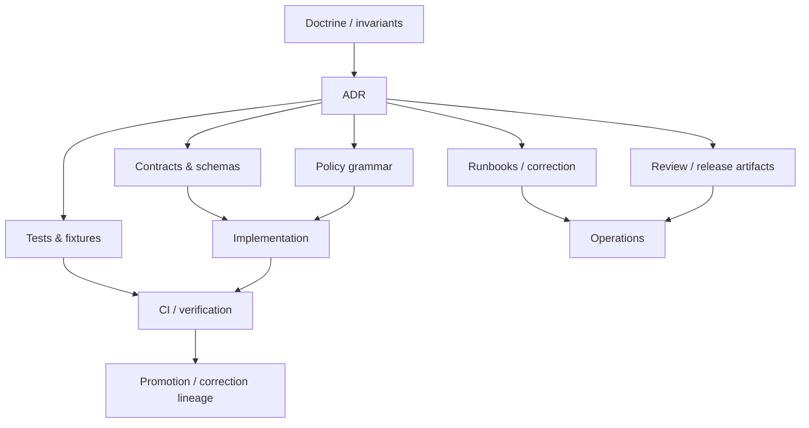

<!-- [KFM_META_BLOCK_V2]
doc_id: kfm://doc/<NEEDS-UUID>
title: Architecture Decision Records (ADRs)
type: standard
version: v1
status: draft
owners: <NEEDS-VERIFICATION>
created: <YYYY-MM-DD NEEDS VERIFICATION>
updated: <YYYY-MM-DD NEEDS VERIFICATION>
policy_label: <NEEDS-VERIFICATION>
related: [../../../README.md, ../../../contracts/README.md, ../../../schemas/README.md, ../../../policy/README.md, ../../../tests/README.md, ../../reports/readme-structure-reconciliation.md, <PROPOSED: ../../adr/index.md>, <PROPOSED: ../../adr/traceability-table.md>]
tags: [kfm, adr, architecture, governance]
notes: [No mounted repo tree was directly inspected in this session; attached repo-grounded summaries indicate adjacent README/doc surfaces exist, but ADR inventory, owners, dates, policy label, and the canonical ADR directory still need direct verification before merge.]
[/KFM_META_BLOCK_V2] -->

> [!IMPORTANT]
> **Status:** Experimental *(directory README shape is intentional; mounted-tree verification still required before merge)*  
> **Owners:** `<NEEDS-VERIFICATION>`  
>      
> **Quick jump:** [Scope](#scope) · [Repo fit](#repo-fit) · [Directory tree](#directory-tree) · [Quickstart](#quickstart) · [Usage](#usage) · [Priority ADR candidates](#priority-adr-candidates-proposed) · [FAQ](#faq)

# Architecture Decision Records (ADRs)

Freeze cross-cutting KFM architecture choices as governed, traceable memory for contracts, tests, runbooks, release review, and correction.

This README is written for the directory targeted by the current work item: `docs/architecture/adr/README.md`. It stays doctrine-first and evidence-bounded: where the attached KFM corpus is strong, it states project law; where the mounted tree was not directly inspected, it keeps uncertainty visible instead of turning guessed paths into accidental doctrine.

> [!WARNING]
> **Canonical location still needs verification.**  
> The current task targets `docs/architecture/adr/README.md`, but attached March 2026 planning material also points toward `docs/adr/*` as a possible ADR home. Do not keep two canonical ADR locations alive after merge. Reconcile the directory choice against the mounted tree first.

## Scope

ADRs belong here when a decision is **cross-cutting**, **hard to reverse**, and **trust-bearing**.

In KFM, an ADR is not a generic architecture essay. It is a durable record for the seams that change what the system is allowed to mean: truth-path transitions, trust boundaries, contract grammar, route-family obligations, shell trust states, runtime outcomes, promotion rules, correction behavior, and lane-admission burdens.

### Truth posture used in this README

| Label | Meaning here |
| --- | --- |
| **CONFIRMED** | Directly supported by the attached KFM corpus or by the attached repo-grounded summary artifacts |
| **INFERRED** | Conservative structural completion strongly implied by the corpus, but not presented as mounted implementation reality |
| **PROPOSED** | Recommended directory shape, workflow, or ADR seed topic that fits KFM doctrine but is not verified as existing |
| **UNKNOWN** | Not verified strongly enough in this session to claim as current repo or runtime fact |
| **NEEDS VERIFICATION** | Explicit review marker for fields, paths, ownership, or inventory that should be checked before commit |

### What ADRs do in KFM

- Preserve decisions that would otherwise get re-litigated across docs, packages, routes, and reviews
- Tie doctrine to concrete consequences in contracts, fixtures, tests, runbooks, and proof objects
- Make invisible authority assumptions reviewable before they leak into implementation
- Preserve supersession history instead of letting architecture memory disappear inside edits

[Back to top](#architecture-decision-records-adrs)

## Repo fit

| Field | Value |
| --- | --- |
| **Path** | `docs/architecture/adr/README.md` |
| **Role** | Directory guide and operating contract for KFM architecture decision records |
| **Upstream doctrine** | [Repo root](../../../README.md) · [Contracts](../../../contracts/README.md) · [Schemas](../../../schemas/README.md) · [Policy](../../../policy/README.md) · [Tests](../../../tests/README.md) · [Structure reconciliation report](../../reports/readme-structure-reconciliation.md) |
| **Downstream artifacts** | `ADR-*.md` files in this directory; optionally an ADR index and traceability table once the canonical ADR location is verified |
| **Current evidence posture** | **CONFIRMED in attached repo-grounded summary:** the repo already has documentation surfaces for `contracts/`, `schemas/`, `policy/`, `tests/`, CODEOWNERS, a PR template, and a `.github/workflows/README.md` placeholder. **UNKNOWN until direct tree inspection:** the live ADR inventory, exact canonical ADR directory, merge-blocking workflow YAMLs, and any existing ADR index/traceability files. |

## Accepted inputs

Put material here when the decision changes shared meaning across the system.

| Accepted input | Typical examples |
| --- | --- |
| Authority or write-boundary rules | five-plane boundaries, allowed-write surfaces, steward-only actions |
| Lifecycle law | truth-path state transitions, promotion rules, rollback/correction posture |
| Cross-package contract meaning | contract families, standards profile, runtime envelope grammar |
| Trust-visible shell obligations | Evidence Drawer payloads, Focus outcome rules, surface-state behavior |
| Route and API boundary choices | public vs internal route families, evidence resolution obligations |
| Verification burden | proof-pack minimums, correction drills, citation-negative tests |
| Thin-slice sequencing | hydrology-first exit criteria, lane-admission prerequisites |

## Exclusions

Do **not** use ADRs for everything architecture-adjacent.

| Exclusion | Put it there instead |
| --- | --- |
| Tickets, sprint tasks, or execution checklists | issue tracker, project board, or implementation plan |
| Runbooks and drills | `docs/runbooks/*` or the repo’s runbook area |
| Schema files, fixtures, or policy bundles themselves | `contracts/`, `schemas/`, `fixtures/`, `policy/`, `tests/` |
| Local implementation notes for one package | package-local docs, code comments, or module README |
| Exploratory research notes without a governing decision | `docs/reports/*`, research notes, or working dossiers |
| UI polish notes that do not alter system law | shell/UI docs, not ADR memory |

[Back to top](#architecture-decision-records-adrs)

## Directory tree

**PROPOSED** target shape, normalized to the path in this work item:

```text
docs/architecture/adr/
├── README.md
├── ADR-001-*.md                      # PROPOSED placeholder numbering only
├── ADR-002-*.md                      # PROPOSED
├── ADR-003-*.md                      # PROPOSED
├── ADR-00x-*.md                      # PROPOSED continuation in dependency order
├── index.md                          # PROPOSED / NEEDS VERIFICATION
└── traceability-table.md             # PROPOSED / NEEDS VERIFICATION
```

> [!NOTE]
> Keep the tree small and dependency-ordered. The attached doctrine repeatedly favors the smallest useful artifact set over broad speculative expansion.

## Quickstart

1. Decide whether the topic is truly **ADR-worthy**. If it changes trust, contracts, policy, route classes, release behavior, or correction lineage, it probably is.
2. Check for overlap first. Supersede an existing ADR if the seam already has governing memory.
3. Draft in **dependency order**: doctrine -> contracts -> route families -> shell obligations -> runtime outcomes -> correction.
4. Link the ADR to the consequences that make it real: contracts, fixtures, tests, runbooks, review artifacts, and rollback posture.
5. Mark the status clearly. Do not smuggle a draft in as settled law.
6. Preserve history. When the governing choice changes, supersede; do not quietly rewrite the old decision.

### Starter ADR template

```md
# ADR-00X — Concrete decision title

- Status: Proposed
- Date: <YYYY-MM-DD>
- Supersedes: <none|ADR-###>
- Superseded by: <none>

## Decision pressure
What ambiguity, conflict, or governance risk forced this ADR?

## Decision
What is being decided, in concrete and testable terms?

## Consequences
What becomes required, forbidden, narrower, or more expensive?

## Affected artifacts
- Contracts / schemas:
- Tests / fixtures:
- Runbooks / drills:
- Review / release objects:

## Evidence basis
List the governing KFM documents and any directly verified repo evidence used.

## Rollback and correction implications
How is this superseded, rolled back, or corrected without erasing lineage?
```

[Back to top](#architecture-decision-records-adrs)

## Usage

### Workflow

1. **Open** an ADR when the decision spans multiple directories, services, route families, or public trust surfaces.
2. **Name** it concretely. Prefer a seam name over a vague umbrella title.
3. **State the pressure** that forced the decision.
4. **Record the decision** and the consequences together.
5. **Attach traceability** to contracts, tests, fixtures, review artifacts, and rollback/correction behavior.
6. **Review** it with the same seriousness as a contract or policy change.
7. **Supersede** when the governing answer changes.

### Suggested lifecycle language

| Status | Meaning | Use when |
| --- | --- | --- |
| **Proposed** | Under review; not yet governing | the team is evaluating the seam |
| **Accepted** | Current governing decision | the seam now sets project law |
| **Superseded** | Preserved, but replaced | a later ADR now governs the seam |
| **Rejected** | Considered and intentionally not adopted | the losing option still matters historically |

### Minimum traceability for every ADR

| Field | Why it matters in KFM |
| --- | --- |
| Decision pressure | keeps the tradeoff visible |
| Decision | freezes the governing choice |
| Consequences | shows what becomes mandatory or forbidden |
| Affected contracts | turns doctrine into diffable structure |
| Affected tests / fixtures | makes the choice falsifiable |
| Affected runbooks / drills | keeps operations aligned |
| Review / release implications | connects architecture to governance |
| Rollback / correction posture | preserves lineage under change |
| Supersession links | prevents silent memory loss |
| Evidence basis | separates doctrine from invention |

## Diagram


```mermaid
flowchart TD
    D[Doctrine / invariants] --> A[ADR]
    A --> B[Contracts & schemas]
    A --> C[Policy grammar]
    A --> E[Tests & fixtures]
    A --> F[Runbooks / correction]
    A --> G[Review / release artifacts]
    B --> H[Implementation]
    C --> H
    E --> I[CI / verification]
    F --> J[Operations]
    G --> J
    H --> I
    I --> K[Promotion / correction lineage]
```

## Tables

### When to use an ADR

| Use an ADR when… | Keep it elsewhere when… |
| --- | --- |
| the decision changes trust, policy, release, correction, or public meaning | the change is a local refactor or package-only detail |
| multiple packages or surfaces need the same answer | the note matters to one file only |
| contracts, fixtures, tests, or runbooks must move with the choice | the change is exploratory and not yet governing |
| the decision is expensive to reverse later | the choice is still sandbox-only and disposable |

## Priority ADR candidates (PROPOSED)

The list below is a **doctrine-shaped starter set**, not a confirmed inventory. Candidate numbering is placeholder-only until the current ADR directory is directly verified.

| Candidate ID* | Decision seam to freeze | Why early |
| --- | --- | --- |
| ADR-001 | Five-plane system model and write-boundary rules | Stabilizes who may write where before local shortcuts spread |
| ADR-002 | Truth-path stage transitions and promotion law | Turns lifecycle doctrine into something machine-checkable |
| ADR-003 | First schema wave and shared contract grammar | Locks the contract lattice before parallel schema drift grows |
| ADR-004 | EvidenceBundle, Evidence Drawer, and evidence-resolution obligations | Keeps evidence operational at point of use |
| ADR-005 | RuntimeResponseEnvelope, finite outcomes, and citation-negative behavior | Bounds Focus/runtime behavior before wider AI adoption |
| ADR-006 | Route families and trust obligations | Separates discovery, read, portrayal, evidence, export, Focus, and review surfaces cleanly |
| ADR-007 | Verification families, proof-pack minimums, and correction drills | Makes fail-closed behavior testable rather than rhetorical |
| ADR-008 | Hydrology-first thin-slice exit criteria | Anchors sequencing in a public-safe, place/time-rich proof lane |

\* Placeholder numbering only. Reconcile against the real ADR inventory before creating files.

### Review gate for a new ADR

| Check | Definition of done |
| --- | --- |
| Title | concrete seam, not generic “architecture overview” wording |
| Scope | cross-cutting and trust-bearing |
| Pressure | stated explicitly |
| Evidence | doctrine and repo evidence named separately |
| Traceability | contracts, tests, runbooks, and review/release consequences listed |
| Status | current and unambiguous |
| Supersession | linked if applicable |
| Duplication check | prior ADRs and nearby design fragments reviewed first |
| Rollback / correction | visible, not implied |

[Back to top](#architecture-decision-records-adrs)

## Task list

- [ ] Reconcile the canonical ADR location: `docs/architecture/adr/` vs `docs/adr/`
- [ ] Directly inspect the mounted tree for existing ADR files before adding numbers
- [ ] Verify repo-relative links in this README against the live repo
- [ ] Replace placeholder owners, dates, policy label, and doc ID
- [ ] Decide whether `index.md` and `traceability-table.md` already exist or should be created
- [ ] Publish the first dependency-ordered ADR wave
- [ ] Require every accepted ADR to name affected contracts, tests, and runbooks
- [ ] Add a simple ADR traceability view once the inventory is stable
- [ ] Add correction and supersession guidance to architecture review practice

## FAQ

### Why not keep architecture memory in one big design note?

Because KFM’s highest-risk seams are specific, review-bearing choices. They need stable names, consequences, supersession history, and artifact traceability.

### When should I supersede instead of edit?

Supersede when the governing choice changes. Edit only for wording, clarity, or typo fixes that do **not** change the decision.

### Can an ADR claim that a path, route, or workflow already exists?

Only when the mounted tree or other direct repo evidence confirms it. Otherwise keep the claim marked **INFERRED**, **PROPOSED**, **UNKNOWN**, or **NEEDS VERIFICATION**.

### Do ADRs replace contracts, tests, or runbooks?

No. They govern them. An ADR should point to the contracts, fixtures, tests, runbooks, and review artifacts that make the decision real.

### Why is the README so explicit about uncertainty?

Because KFM’s doctrine treats overclaiming as a trust failure. A visible unknown is better than a polished false fact.

[Back to top](#architecture-decision-records-adrs)

## Appendix

<details>
<summary><strong>PROPOSED fields for an ADR traceability table</strong></summary>

| Field | Purpose |
| --- | --- |
| ADR ID | stable decision identifier |
| Title | concrete seam name |
| Status | Proposed / Accepted / Superseded / Rejected |
| Supersedes | backward link |
| Superseded by | forward link |
| Affected contracts | schema or payload surfaces changed |
| Affected tests | falsifiability burden changed |
| Affected runbooks | operational practice changed |
| Related policy objects | reason codes, obligation codes, review roles, or bundles affected |
| Notes | migration, rollback, or correction consequences |

</details>

<details>
<summary><strong>Suggested authoring rules for new ADR files</strong></summary>

1. Start with a seam-specific title.
2. Keep decision pressure short, concrete, and reviewable.
3. State the decision in language that can be tested.
4. Record consequences, not just intentions.
5. Link the ADR to contracts, fixtures, tests, and runbooks in the same change if possible.
6. Prefer supersession over silent replacement.
7. Keep repo-state claims proportional to directly visible evidence.

</details>

<details>
<summary><strong>NEEDS VERIFICATION before commit</strong></summary>

- Canonical ADR directory location
- Existing ADR inventory and numbering
- Owners for this directory
- Meta block identifiers and dates
- Whether local conventions in `docs/architecture/` require a different section order
- Whether `index.md` and `traceability-table.md` already exist
- Whether adjacent README files use an additional status/ownership pattern

</details>

[Back to top](#architecture-decision-records-adrs)