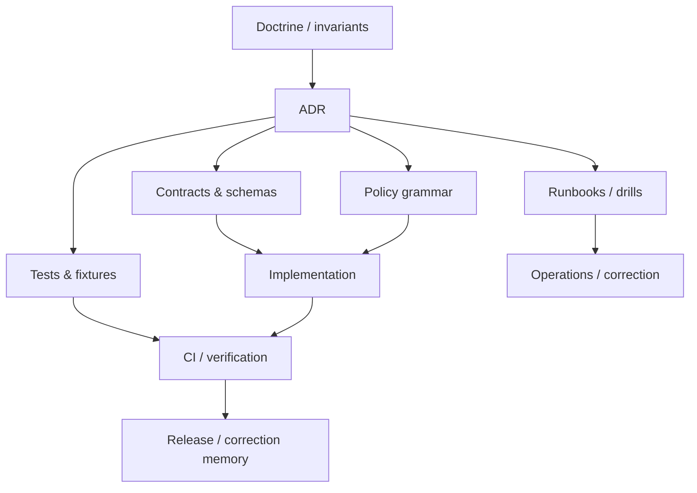

<!-- [KFM_META_BLOCK_V2]
doc_id: kfm://doc/<NEEDS-UUID>
title: Architecture Decision Records (ADRs)
type: standard
version: v1
status: draft
owners: <NEEDS-VERIFICATION>
created: <YYYY-MM-DD NEEDS VERIFICATION>
updated: <YYYY-MM-DD NEEDS VERIFICATION>
policy_label: <NEEDS-VERIFICATION>
related: [../../../README.md, ../../../contracts/README.md, ../../../schemas/README.md, ../../../policy/README.md, ../../../tests/README.md, ../../reports/readme-structure-reconciliation.md, <PROPOSED: docs/adr/index.md>, <PROPOSED: docs/adr/traceability-table.md>]
tags: [kfm, adr, architecture, governance]
notes: [Mounted repo tree was not directly inspected in this session; the current task targets docs/architecture/adr/README.md, while March 2026 manuals also propose docs/adr/* and that directory choice must be reconciled before merge.]
[/KFM_META_BLOCK_V2] -->

> [!IMPORTANT]
> **Status:** Experimental *(PROPOSED until mounted-tree verification)*  
> **Owners:** `<NEEDS-VERIFICATION>`  
>      
> **Quick jump:** [Scope](#scope) · [Repo fit](#repo-fit) · [Directory tree](#directory-tree) · [Quickstart](#quickstart) · [Usage](#usage) · [Priority first ADR set](#priority-first-adr-set) · [FAQ](#faq)

# Architecture Decision Records (ADRs)

Freeze cross-cutting KFM architecture choices as governed, traceable memory for contracts, tests, runbooks, and later correction.

This README is for the ADR directory targeted by the current work item: `docs/architecture/adr/README.md`. It is doctrine-first and source-bounded: it preserves KFM’s trust posture, keeps implementation uncertainty visible, and avoids turning unverified repo details into accidental law.

> [!WARNING]
> **Directory choice needs verification.** The March 2026 manuals propose ADR artifacts under `docs/adr/`, while the current task targets `docs/architecture/adr/`. Keep one canonical location only, and reconcile that choice against the mounted tree before merge.

## Scope

Use ADRs to record **cross-cutting, hard-to-reverse, trust-bearing** decisions.

In KFM, ADRs are not generic architecture essays. They exist to lock down the seams that change system meaning: authority boundaries, truth-path rules, contract grammar, surface obligations, policy grammar, thin-slice sequencing, correction propagation, and observability joins.

### What an ADR is for in KFM

- Freezing a decision before local implementation habits spread
- Linking doctrine to concrete contracts, tests, and runbooks
- Preserving decision lineage through supersession rather than silent rewrites
- Making invisible authority assumptions visible and reviewable

[Back to top](#architecture-decision-records-adrs)

## Repo fit

| Field | Value |
| --- | --- |
| **Path** | `docs/architecture/adr/README.md` |
| **Role** | Directory guide and operating contract for KFM architecture decision records |
| **Upstream doctrine** | [Repo root](../../../README.md) · [Contracts](../../../contracts/README.md) · [Schemas](../../../schemas/README.md) · [Policy](../../../policy/README.md) · [Tests](../../../tests/README.md) · [PR template](../../../.github/PULL_REQUEST_TEMPLATE.md) · [Workflows README](../../../.github/workflows/README.md) · [Structure reconciliation report](../../reports/readme-structure-reconciliation.md) |
| **Downstream artifacts** | `ADR-00x-*.md` files in this directory **or** `docs/adr/*` if that location is confirmed as canonical |
| **Current evidence posture** | **CONFIRMED:** the repo has README/doc surfaces for contracts, schemas, policy, tests, tools, scripts, PR workflow scaffolding, and structure reconciliation. **UNKNOWN:** mounted ADR inventory, exact canonical ADR directory, active workflow YAML gates, and any existing ADR traceability files. |

## Inputs

Accept material here when the decision:

| Accepted input | Typical examples |
| --- | --- |
| Changes who may write, publish, promote, or correct | five-plane authority model; allowed writes |
| Changes lifecycle law | truth-path stage transitions; release/correction rules |
| Changes cross-package or cross-route meaning | contract header grammar; route family registry |
| Changes trust-visible surface obligations | Evidence Drawer payload; Focus envelope; 2D/3D burden |
| Changes policy execution semantics | reason/obligation registries; policy engine choice |
| Changes first-slice sequencing or exit criteria | hydrology-first implementation path |
| Changes observability or rollback semantics | audit join keys; proof-pack composition; correction propagation |

## Exclusions

Do **not** put the following here:

| Exclusion | Put it there instead |
| --- | --- |
| Tickets, sprint tasks, or local implementation chores | issue tracker or execution planning docs |
| Runbooks and drills | `docs/runbooks/*` or equivalent |
| Contract specs, fixtures, and examples | `contracts/`, `schemas/`, `fixtures/`, `tests/` |
| Product copy, flow polish, or isolated UI tweaks | UI or surface-taxonomy docs |
| Repo-state claims that are not directly verified | verification backlog or review notes |
| Generic tool tutorials | dedicated docs, not ADR memory |

## Directory tree

**PROPOSED target shape** for this directory, normalized to the current work item path:

```text
docs/architecture/adr/
├── README.md
├── ADR-001-five-plane-authority-model.md            # PROPOSED
├── ADR-002-truth-path-stage-transition-registry.md  # PROPOSED
├── ADR-003-shared-contract-header-grammar.md        # PROPOSED
├── ADR-004-evidence-drawer-payload.md               # PROPOSED
├── ADR-005-focus-envelope-and-citation-policy.md    # PROPOSED
├── ADR-006-route-family-registry.md                 # PROPOSED
├── ADR-00x-*.md                                     # PROPOSED; continue in dependency order
├── index.md                                         # PROPOSED / NEEDS VERIFICATION
└── traceability-table.md                            # PROPOSED / NEEDS VERIFICATION
```

> [!NOTE]
> March 2026 manuals also propose `docs/adr/index.md` and `docs/adr/traceability-table.md`. Do not keep both directory schemes alive long-term.

## Quickstart

1. Decide whether the topic is truly **ADR-worthy**. If it changes trust, contracts, policy, authority, sequencing, or correction, it probably is.
2. Draft the decision in **dependency order**: authority -> truth path -> contracts -> surfaces -> runtime -> operations.
3. Link the ADR to the **real downstream obligations**: contracts, tests, fixtures, runbooks, rollback, correction.
4. Reconcile duplicates before merge. Do not create a new ADR if an existing one already governs the same seam.
5. Supersede explicitly. Never erase older decision memory.

### PROPOSED starter template

```md
# ADR-00X — Concrete decision title

- Status: Proposed
- Date: <YYYY-MM-DD>
- Supersedes: <none|ADR-###>
- Superseded by: <none>

## Decision pressure
What ambiguity, risk, or conflict forced this ADR?

## Decision
What is being decided, in concrete terms?

## Consequences
What becomes easier, harder, narrower, or forbidden?

## Affected contracts, tests, and runbooks
- Contracts:
- Tests / fixtures:
- Runbooks / drills:

## Evidence basis
List the governing KFM docs and any mounted repo evidence used.

## Rollback and correction implications
How is this reversed, superseded, or corrected without erasing lineage?
```

[Back to top](#architecture-decision-records-adrs)

## Usage

### Workflow

1. **Open** an ADR when the decision would otherwise be re-litigated across multiple files or teams.
2. **Name** it concretely. “Five-plane authority model” is better than “architecture overview.”
3. **State the pressure** that forced the decision.
4. **Record the decision** and its consequences.
5. **Attach traceability** to affected contracts, tests, fixtures, runbooks, and rollback paths.
6. **Review** it as part of architecture change control.
7. **Supersede** it with a new ADR when needed; do not rewrite history.

### PROPOSED lifecycle language

| Status | Meaning | Use when |
| --- | --- | --- |
| Proposed | Draft under review | the decision is not yet governing |
| Accepted | Current governing decision | the team has chosen and adopted it |
| Superseded | Preserved, but replaced | a newer ADR now governs the seam |
| Rejected | Considered, not adopted | the decision path matters, but the option lost |

### Traceability minimums

| ADR field | Why it matters in KFM |
| --- | --- |
| Decision pressure | keeps the tradeoff visible |
| Decision | freezes the governing choice |
| Consequences | shows what becomes required or forbidden |
| Affected contracts | connects architecture to machine-readable edges |
| Affected tests / fixtures | makes the decision falsifiable |
| Affected runbooks / drills | keeps operations aligned with doctrine |
| Rollback / correction | preserves lineage under change |
| Supersession | prevents silent memory loss |
| Evidence basis | separates doctrine from invention |

## Diagram


```mermaid
flowchart TD
    A[Doctrine / invariants] --> B[ADR]
    B --> C[Contracts & schemas]
    B --> D[Policy grammar]
    B --> E[Tests & fixtures]
    B --> F[Runbooks / drills]
    C --> G[Implementation]
    D --> G
    E --> H[CI / verification]
    F --> I[Operations / correction]
    G --> H
    H --> J[Release / correction memory]
```

## Tables

### What belongs in an ADR

| Use an ADR when… | Keep it elsewhere when… |
| --- | --- |
| the decision changes authority, policy, release, correction, or public trust behavior | the change is a local refactor with no cross-cutting consequence |
| multiple packages or surfaces need the same answer | the note is only useful to one file or one component |
| contracts, tests, or runbooks must move with the decision | the change is a one-off implementation detail |
| the choice is expensive to reverse later | the choice is exploratory and not yet governing |

### Priority first ADR set

The March 2026 manuals point to the following **first-wave** ADR topics.

| Seed | Decision to freeze | Why early |
| --- | --- | --- |
| ADR-001 | Five-plane authority model and allowed writes | Freezes the main authority grammar |
| ADR-002 | Truth-path stage-transition registry | Turns lifecycle doctrine into machine-checkable law |
| ADR-003 | Shared contract header grammar and first schema wave | Enables validation and diffable interfaces |
| ADR-004 | Evidence Drawer payload and visibility tiers | Keeps evidence operational at point of use |
| ADR-005 | Focus envelope, finite outcomes, and citation policy | Bounds AI before broad adoption |
| ADR-006 | Route family registry and trust obligations | Stabilizes public vs steward vs review boundaries |
| Seed topic | Authoritative-versus-derived rules | Prevents projections from drifting into sovereign truth |
| ADR-008 | MapLibre-centered 2D shell and controlled 3D burden rubric | Locks renderer placement and 3D discipline |
| ADR-009 | Policy engine choice and reason/obligation registries | Makes policy executable and reviewable |
| ADR-010 | Hydrology-first thin slice and exit criteria | Turns doctrine into a credible first implementation path |
| Seed topic | Release proof-pack composition | Makes release evidence reviewable |
| Seed topic | Correction propagation | Preserves visible lineage under change |
| Seed topic | Package boundaries | Keeps trust seams aligned with ownership |
| Seed topic | Observability join keys | Keeps audit, runtime, and correction traces joinable |

> [!IMPORTANT]
> The manuals explicitly number some early ADRs, but the mounted ADR inventory was not directly inspected in this session. Reconcile numbering before creating duplicates.

### Review gate for a new ADR

| Check | Definition of done |
| --- | --- |
| Title | concrete, not generic |
| Scope | cross-cutting and trust-bearing |
| Pressure | written down explicitly |
| Traceability | contracts, tests, runbooks, rollback listed |
| Status | current and unambiguous |
| Supersession | recorded if applicable |
| Evidence | source basis named |
| Duplication | existing design fragments checked first |

[Back to top](#architecture-decision-records-adrs)

## Task list

- [ ] Reconcile the canonical ADR directory: `docs/architecture/adr/` vs `docs/adr/`
- [ ] Inventory any existing ADRs, design notes, or README fragments before writing duplicates
- [ ] Publish the first dependency-ordered ADR wave
- [ ] Add an ADR index and a traceability table
- [ ] Require every accepted ADR to name affected contracts, tests, and runbooks
- [ ] Verify repo-relative links in this README against the mounted tree
- [ ] Replace placeholder owners, dates, and metadata values
- [ ] Add correction and supersession guidance to architecture review practice

## FAQ

### Why not keep architecture memory in one big design note?

Because KFM’s highest-risk seams are not “general architecture.” They are specific, review-bearing decisions that need stable titles, consequences, and supersession history.

### When should I supersede instead of edit?

Supersede when the governing choice changes. Edit only for wording, typos, or clarity that does **not** change the decision.

### Can an ADR claim a route, file path, or package exists?

Not unless the mounted tree or other direct evidence confirms it. Otherwise keep it **INFERRED**, **PROPOSED**, or **UNKNOWN**.

### Do ADRs replace contracts, tests, or runbooks?

No. They govern them. An ADR should point to the contracts, tests, fixtures, and runbooks that make the decision real.

[Back to top](#architecture-decision-records-adrs)

## Appendix

<details>
<summary><strong>PROPOSED starter fields for the ADR traceability table</strong></summary>

| Field | Purpose |
| --- | --- |
| ADR ID | stable decision identifier |
| Title | concrete decision name |
| Status | Proposed / Accepted / Superseded / Rejected |
| Supersedes | backward link |
| Superseded by | forward link |
| Affected contracts | schema or payload surface changed |
| Affected tests | validation burden changed |
| Affected runbooks | operational practice changed |
| Related policy objects | reason/obligation registries or rules affected |
| Notes | migration or correction consequences |

</details>

<details>
<summary><strong>PROPOSED authoring rules for new ADR files</strong></summary>

1. Start with a concrete title.
2. Keep the decision pressure short and specific.
3. State the decision in language that can be tested.
4. Record consequences, not just intent.
5. Link the ADR to contracts, fixtures, tests, and runbooks in the same pull request when possible.
6. Prefer supersession over silent replacement.
7. Keep implementation claims proportional to visible evidence.

</details>

<details>
<summary><strong>NEEDS VERIFICATION before commit</strong></summary>

- Canonical ADR directory location
- Existing ADR inventory, if any
- Owners for this directory
- Meta block identifiers and dates
- Whether `index.md` and `traceability-table.md` already exist
- Whether local README conventions in `docs/architecture/` differ from this structure

</details>

[Back to top](#architecture-decision-records-adrs)
