# 📜 Architecture Decision Records (ADR)


Welcome to the **ADR hub** for the Kansas Frontier Matrix (KFM) architecture.  
ADRs capture *why* we made a decision, *what* we decided, and *what it changes*—so we can evolve the system without losing the “rationale trail” 🧭.

---

## 🧠 Why ADRs exist (KFM-style)

KFM is built around **non-negotiable boundaries** (data → catalogs → graph → API → UI → narrative). ADRs are how we keep those boundaries consistent and auditable as we grow.

ADRs are especially important here because:
- ✅ We operate **contract-first** (schemas + API contracts are first-class artifacts).
- ✅ We operate **evidence-first** (data + provenance before interpretation).
- ✅ We operate with **governance + sovereignty guardrails** across domains.

---

## 🧭 Quick links

- 📘 `docs/MASTER_GUIDE_v13.md` (canonical pipeline + repo invariants)
- 🧱 `docs/architecture/` (blueprints, vision, diagrams)
- 📐 `docs/standards/` (STAC/DCAT/PROV + repo/document standards)
- ⚖️ `docs/governance/` (review gates, ethics, sovereignty)

---

## 📁 What lives in this folder

```text
docs/
└── architecture/
    └── adr/
        ├── README.md                👈 you are here
        ├── 0001-some-decision.md    ✅ accepted/proposed/etc
        ├── 0002-another-decision.md ✅
        └── assets/                  🖼️ optional diagrams/screenshots
```

> 💡 Keep ADRs *small and sharp*. One decision per ADR.

---

## 🧱 How ADRs map to the KFM pipeline

When writing an ADR, explicitly state which pipeline boundary (or subsystem contract) it touches:

```mermaid
flowchart LR
  S[Raw sources] --> E[ETL & normalization]
  E --> P[Processed datasets]
  P --> C[Catalog boundary<br/>STAC • DCAT • PROV]
  C --> G[Graph boundary<br/>Neo4j]
  G --> A[API boundary<br/>contracts + redaction]
  A --> U[UI boundary<br/>Map + timeline]
  U --> N[Narrative boundary<br/>Story Nodes]
  N --> F[Focus Mode<br/>evidence-locked]
```



---

## ✅ When to write an ADR

Create an ADR when you are about to:
- 🧩 Add/replace a **major dependency** (DB, search, map engine, LLM runtime, queue, etc.)
- 🧱 Change a **boundary contract** (schemas, OpenAPI routes, DCAT/STAC/PROV profiles, graph ontology)
- 🔐 Change **security or governance behavior** (redaction, access tiers, review gates)
- 🗺️ Change the **pipeline ordering** or “definition of done” for publishing datasets
- ⚙️ Make a choice that affects **multiple subsystems** (pipelines + server + web)
- 💥 Introduce a **non-trivial tradeoff** (latency vs provenance, cost vs reproducibility, etc.)

If it will matter in 6 months… write it now 🧠✨

---

## 🧾 ADR lifecycle (statuses)

Use one of these statuses at the top of each ADR:

| Status | Meaning |
|---|---|
| `draft` | In progress (usually inside a PR) |
| `proposed` | Ready for review; decision not yet adopted |
| `accepted` | Adopted + expected to be implemented |
| `rejected` | Considered but not chosen (keep rationale!) |
| `deprecated` | No longer recommended, but not explicitly replaced |
| `superseded` | Replaced by a newer ADR (link it both ways) |

> 🔁 **Do not “edit history”**: once `accepted`, prefer writing a *new* ADR that supersedes the old one.

---

## 🧰 Naming & numbering convention

- Format: `NNNN-kebab-case-title.md`
- Example: `0007-api-contract-versioning.md`

Rules:
- 🔢 Numbers are **monotonic** (never reuse)
- 🧷 Title is short + specific (“use-postgis-for-vector-storage”, not “database”)
- 🔗 Link related ADRs in a “Related” section (and back-link from the other ADR)

---

## 🏗️ How to create a new ADR (workflow)

1. **Pick the next number** (look at existing ADR filenames).
2. **Copy the template** below into a new file.
3. **Write context first**, then the decision, then consequences.
4. **Link the impacted artifacts** (schemas, endpoints, pipelines, standards, governance docs).
5. Open a PR and request review from the subsystem owners.
6. When merged, set status to `accepted` (or `rejected`) and ensure implementation issues exist.

> ✅ Pro tip: Treat the ADR as the “mini-spec” that prevents the same debate from happening again.

---

## 🧩 ADR template (copy/paste)

> You can keep this template inside the ADR file. Don’t over-polish—clarity wins.

```markdown
---
id: adr-NNNN
title: "<short decision title>"
status: proposed
date: YYYY-MM-DD
owners: ["@team-or-handle"]
scope:
  - "pipelines"
  - "catalogs"
  - "graph"
  - "api"
  - "ui"
decision_drivers:
  - "contract-first compatibility"
  - "evidence-first provenance"
  - "governance / sovereignty"
impacted_artifacts:
  - "docs/standards/..."
  - "schemas/..."
  - "src/..."
related:
  - "NNNN-some-related-adr.md"
---

# ADR NNNN: <short decision title>

## Context
What problem are we solving? What constraints matter in KFM?
- Include data scale, governance constraints, contract compatibility, and who is impacted.

## Decision
What did we decide?
- Be explicit about boundaries (what moves where, and through what contract).

## Alternatives considered
List realistic options and why they weren’t chosen.

## Consequences
### Positive ✅
### Negative ⚠️
### Neutral / follow-ups 🧭

## Rollout plan
- Steps to implement
- Migration strategy
- Backwards compatibility approach (if any)
- Validation/CI updates required

## Security, governance, and sovereignty notes
- Data classification implications
- Redaction/access tier impact
- Review gates triggered

## References
- Links to relevant docs, issues, PRs, datasets, schema versions, etc.
```

---

## 🧪 ADR “Definition of Done” checklist

Before marking an ADR `accepted`, verify:

- [ ] Status + date are set correctly
- [ ] Decision clearly names **which boundary** is affected (catalog/graph/api/etc.)
- [ ] Contracts/schemas impacted are linked
- [ ] Evidence/provenance implications are addressed (STAC/DCAT/PROV as needed)
- [ ] Governance + review triggers are explicitly called out
- [ ] A rollout/migration plan exists (even if minimal)
- [ ] Alternatives were considered (at least 2, unless trivial)

---

## 🧷 What belongs in ADRs (examples)

Good ADR topics for KFM:
- 🗃️ Storage decisions (e.g., vector/raster strategy, archival format)
- 🧭 Metadata profile changes (STAC/DCAT/PROV additions, versioning rules)
- 🧠 AI constraints (evidence-bounded retrieval rules, citation policy, model hosting)
- 🔐 Security/redaction policy implementation at the API boundary
- 🧩 Graph modeling decisions (ontology patterns, provenance relationships)
- 🧪 CI validation rules for schemas + catalogs

---

## 🤝 Contributing

- Prefer small ADRs + fast iteration.
- If a decision is controversial, write the ADR early and use it to structure review.
- Keep the tone factual and the tradeoffs explicit.

✨ If you’re unsure whether something “needs an ADR,” it probably does.