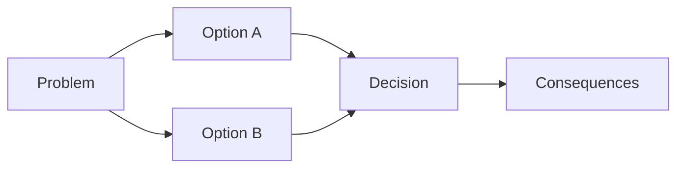

<!-- [KFM_META_BLOCK_V2]
doc_id: kfm://doc/0b69a0bd-73c4-4d28-9c91-950d9cbb1794
title: Architecture Decision Record (ADR) Template
type: standard
version: v1
status: draft
owners: TBD
created: 2026-03-01
updated: 2026-03-01
policy_label: public
related:
  - docs/architecture/adr/   # recommended canonical home (if following v13 layout)
tags: [kfm, adr, template]
notes:
  - Copy this file to create a new ADR; replace placeholders; keep decisions small and reversible.
[/KFM_META_BLOCK_V2] -->

# Architecture Decision Record (ADR) — <Decision title>

> **How to use:** Copy this file into a new ADR (recommended location: `docs/architecture/adr/`), rename it, and replace all `<placeholders>`.  
> **PR rule of thumb:** If the change touches core invariants (policy, IDs, catalogs, trust membrane), link the ADR in the PR description.

---

## Quick links

- [Summary](#summary)
- [Context](#context)
- [Decision drivers & constraints](#decision-drivers--constraints)
- [Options considered](#options-considered)
- [Decision](#decision)
- [Rationale](#rationale)
- [Consequences](#consequences)
- [Implementation plan](#implementation-plan)
- [Validation & acceptance criteria](#validation--acceptance-criteria)
- [Rollback plan](#rollback-plan)
- [Security, privacy, and governance review](#security-privacy-and-governance-review)
- [Evidence & references](#evidence--references)

---

## ADR metadata

| Field | Value |
|---|---|
| **ADR ID** | `<adr-id>` (e.g., `ADR-YYYYMMDD-<slug>` or `ADR-####-<slug>`) |
| **Status** | `Proposed` \| `Accepted` \| `Rejected` \| `Deprecated` \| `Superseded` |
| **Date** | `YYYY-MM-DD` |
| **Deciders** | `<names / roles>` |
| **Reviewers** | `<names / roles>` |
| **Owner** | `<single accountable owner>` |
| **Related PR(s)** | `<link(s)>` |
| **Related issue(s) / tickets** | `<link(s)>` |
| **Scope** | `<domain / subsystem>` (e.g., `pipelines`, `catalogs`, `graph`, `api`, `ui`, `policy`, `infra`) |
| **Invariants touched?** | ☐ trust membrane ☐ truth path ☐ deterministic identity ☐ cite-or-abstain ☐ other: `<...>` |

---

## Summary

**One sentence:** <what decision are we making?>

**Outcome:** <what changes for users/maintainers once this is done?>

---

## Context

### Problem statement

<Describe the problem and why it matters. Include who/what is impacted.>

### Constraints

- <constraint 1>
- <constraint 2>
- <constraint 3>

### Non-goals

- <explicit non-goal 1>
- <explicit non-goal 2>

---

## Decision drivers & constraints

List the forces that matter most (and will be used to evaluate options):

- **Governance / policy:** <e.g., default-deny, redaction obligations, auditability>
- **Provenance / reproducibility:** <e.g., deterministic IDs, receipts, rebuildability>
- **Performance:** <latency, throughput, storage>
- **Reliability:** <failure modes, disaster recovery, rollback>
- **Developer experience:** <testability, CI gates, maintainability>
- **User experience:** <evidence drawer discoverability, clarity, accessibility>

> **KFM invariant check:** If any driver implies weakening the trust membrane, truth path, or evidence-first UX, document why and what compensating controls exist.

---

## Options considered

> Add/remove options as needed, but keep them concrete and testable.

### Option A — <name>

**Description**  
<What would we build/change?>

**Pros**
- <pro 1>
- <pro 2>

**Cons**
- <con 1>
- <con 2>

**Risks / open questions**
- <risk 1>
- <unknown 1>

**Operational notes**
- <monitoring, runbooks, on-call impact>

---

### Option B — <name>

**Description**  
<What would we build/change?>

**Pros**
- <pro 1>
- <pro 2>

**Cons**
- <con 1>
- <con 2>

**Risks / open questions**
- <risk 1>
- <unknown 1>

**Operational notes**
- <monitoring, runbooks, on-call impact>

---

### Option C — <name> (optional)

<...>

---

## Decision

**We will:** <state the chosen option and what we will do>

### Decision details

- <key design choice 1>
- <key design choice 2>
- <interfaces/contracts changed: schemas, APIs, policies>

---

## Rationale

<Explain why this option best satisfies the drivers/constraints. Reference evidence and measurements where possible.>

---

## Consequences

### Positive

- <benefit 1>
- <benefit 2>

### Negative

- <cost 1>
- <cost 2>

### Neutral / follow-on work

- <follow-on 1>
- <follow-on 2>

---

## Risks & mitigations

| Risk | Likelihood | Impact | Mitigation | Owner |
|---|---:|---:|---|---|
| <risk> | <L/M/H> | <L/M/H> | <mitigation> | <owner> |

---

## Tradeoffs

<Call out the irreducible tradeoffs explicitly.>

- <tradeoff 1>
- <tradeoff 2>

---

## Implementation plan

### Milestones

1. **M1:** <smallest reversible step>
2. **M2:** <next step>
3. **M3:** <hardening + docs + gates>

### Work items

- [ ] Contract changes (schemas / OpenAPI / policy packs)
- [ ] Implementation (code + adapters)
- [ ] Tests (unit/integration/e2e) and CI gate updates
- [ ] Docs updates (runbooks, diagrams, user docs)
- [ ] Migration (if applicable): <plan + back-compat window>
- [ ] Observability: logs/metrics/traces (policy-safe)

### Diagram (optional)

---

## Validation & acceptance criteria

> This section should be specific enough to become CI checks.

### Minimum verification steps (convert unknowns → confirmed)

- <verification step 1: e.g., run validators, link checks, schema validation>
- <verification step 2: e.g., reproduce build, recompute hashes, compare digests>
- <verification step 3: e.g., manual steward review for sensitive domains>

### “Done” checklist

- [ ] Decision implemented behind governed interfaces (no direct DB/object store access from UI)
- [ ] Deterministic IDs/hashes are recomputable in CI
- [ ] Required artifacts exist (receipts, manifests, checksums) and validate
- [ ] Policy labels and obligations are enforced (default-deny tests pass)
- [ ] Evidence links resolve to stable, inspectable views (no unverifiable shadow sources)
- [ ] Rollback is documented and tested (at least once in a dev/staging environment)

---

## Rollback plan

> Rollback must be realistic and cheap.

### Trigger conditions

- <what would make us roll back?>

### Rollback steps

1. <step 1>
2. <step 2>
3. <step 3>

### Data / projection rebuild notes

- <Can we rebuild indexes/tiles/search/graph projections from processed artifacts + catalogs?>
- <What receipts/manifests prove the rollback/promotion state?>

---

## Security, privacy, and governance review

### Policy / sensitivity impact

- **Policy labels impacted:** <public/restricted/...>
- **Obligations introduced/changed:** <redaction/generalization/removal>
- **Rights/licensing changes:** <license snapshot, attribution rules>
- **Exports/downloads impacted:** <yes/no + how policy is enforced>

### Threat model (quick checks)

- [ ] Frontend never fetches directly from storage/DB (trust membrane intact)
- [ ] API errors are policy-safe (no restricted inference via timing/messages)
- [ ] All downloads/exports include license + attribution and are policy-checked
- [ ] Audit logs are access-controlled and redacted
- [ ] Any AI/LLM surface (if applicable) is citation-gated and tool-allowlisted

---

## Evidence & references

### EvidenceRefs (preferred; stable + resolvable)

List the EvidenceRefs that justify this decision (use one per bullet):

- `<dcat://...>`
- `<stac://...>`
- `<prov://...>`
- `<doc://sha256:...#page=<n>&span=<a>:<b>>`
- `<graph://...>`

### Human-readable references (allowed, but do not replace EvidenceRefs)

- <links to internal docs, PRs, tickets, diagrams>

---

## Appendix

### Decision log

| Date | Change | Author |
|---|---|---|
| `YYYY-MM-DD` | Initial draft | `<name>` |
