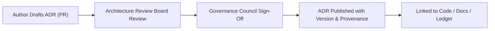

<div align="center">

# 🧩 **Kansas Frontier Matrix — ADR Templates & Authoring Guide (v2.1.1 · Tier-Ω+∞ Certified)**  
`docs/architecture/adr/templates/README.md`

**Mission:** Provide standardized, reproducible, and auditable templates for creating  
**Architecture Decision Records (ADRs)** across the Kansas Frontier Matrix (KFM).  
All ADRs adhere to **MCP-DL v6.4.3** and **FAIR+CARE** governance, ensuring transparent architectural decision-making.

[](../../../../docs/)
[](../../../../.github/workflows/docs-validate.yml)
[](../../../../.github/workflows/policy-check.yml)
[](../../../../LICENSE)

</div>

---

## 📚 Overview

This directory contains the **templates and authoring guide** for all Architecture Decision Records (ADRs)  
within the Kansas Frontier Matrix repository.

**Purpose:**  
To ensure every ADR follows a uniform structure, metadata policy, and traceable versioning standard,  
enabling transparent architectural governance, reproducibility, and historical auditability.

Each ADR template includes:
- Front-matter metadata block for governance and validation  
- Required sections for **context**, **decision**, **consequences**, and **references**  
- FAIR+CARE alignment and MCP-DL compliance  
- Links to governance and validation workflows  

---

## 🗂️ Directory Layout

```bash
docs/architecture/adr/templates/
├── README.md                # This guide — ADR authoring policy and reference
├── adr-template.md           # Base template for all new ADRs
└── adr-decision-guide.md     # Best practices for decision documentation
```

---

## 🧩 ADR Front-Matter Template

All ADRs must start with the following YAML block:

```yaml
---
adr_id: "ADR-####"
title: "Decision Title"
authors: ["@username"]
reviewers: ["@kfm-architecture","@kfm-docs"]
status: "Proposed|Accepted|Superseded|Deprecated"
decision_date: "YYYY-MM-DD"
last_reviewed: "YYYY-MM-DD"
governance_link: "docs/standards/governance/ROOT-GOVERNANCE.md"
related_adrs: ["ADR-####"]
license: "CC-BY 4.0"
---
```

> **Note:** Missing metadata fields will cause `policy-check.yml` to fail during CI validation.

---

## 🧭 ADR Section Requirements

Each ADR must include the following sections in Markdown:

```md
# Context
Explain background, problem scope, and alternatives.

# Decision
Describe the final decision and its rationale.

# Consequences
List impacts, trade-offs, and implementation implications.

# Status
Mark as Proposed, Accepted, Superseded, or Deprecated.

# References
Include linked ADRs, GitHub issues, PRs, or relevant documents.
```

---

## ⚙️ ADR Lifecycle Diagram


<!-- END OF MERMAID -->

| Lifecycle Stage | Description | Validation |
|:--|:--|:--|
| **Proposed** | New ADR submitted for review. | CI ensures valid front-matter. |
| **Accepted** | Approved and merged by governance. | Ledger entry recorded. |
| **Superseded** | Replaced by new ADR. | Cross-reference validated. |
| **Deprecated** | Archived for historical context. | Retained permanently. |

---

## 🧠 Authoring Guidelines

| Guideline | Description |
|:--|:--|
| **Clarity** | Write concise, non-ambiguous decisions. Avoid excessive background. |
| **Neutrality** | Focus on rationale and outcomes — avoid subjective tone. |
| **Traceability** | Link to related PRs, issues, or documentation artifacts. |
| **Ethics** | Address FAIR+CARE and governance implications when relevant. |
| **Review Cadence** | Reassess ADRs annually or after major releases. |
| **Cross-Linking** | Always use `related_adrs` for contextual continuity. |

---

## 🧾 Example ADR Template

```yaml
---
adr_id: "ADR-XXXX"
title: "Adopt Open Standard for Metadata Exchange"
authors: ["@kfm-data"]
reviewers: ["@kfm-architecture","@kfm-governance"]
status: "Proposed"
decision_date: "2025-11-16"
last_reviewed: "2025-11-16"
governance_link: "docs/standards/governance/ROOT-GOVERNANCE.md"
license: "CC-BY 4.0"
---
```

### Context
KFM needed a standardized format for metadata exchange between pipelines and external systems.

### Decision
Adopt **STAC/DCAT hybrid metadata schema** to unify dataset interoperability.

### Consequences
- ✅ Promotes open data sharing across FAIR+CARE-aligned systems.  
- ⚠️ Requires CI metadata validation (`stac-validate.yml`).

---

## ⚖️ FAIR + CARE Integration

| Principle | Implementation | Evidence |
|:--|:--|:--|
| **Findable** | ADRs are indexed and versioned with IDs. | `docs/architecture/adr/README.md` |
| **Accessible** | All ADRs are open (CC-BY 4.0). | Repository / GitHub Pages |
| **Interoperable** | Markdown + YAML schema; machine-readable metadata. | CI validation |
| **Reusable** | Version control & checksum logs ensure reproducibility. | `releases/v*/manifest.zip` |
| **Collective Benefit** | Captures transparent reasoning behind design choices. | Governance reports |

---

## 🧾 Validation & Governance Integration

| Workflow | Description | Output |
|:--|:--|:--|
| `docs-validate.yml` | Ensures correct Markdown + Mermaid syntax. | `reports/validation/docs_validation_report.json` |
| `policy-check.yml` | Validates front-matter compliance. | `reports/audit/governance_results.json` |
| `adr_validate.yml` | Checks ADR structure and required sections. | `reports/validation/adr_validation_report.json` |
| `governance-ledger.yml` | Adds ADR checksums to provenance ledger. | `data/reports/audit/data_provenance_ledger.json` |

---

## 🧾 Version History

| Version | Date | Author | Summary |
|:--|:--|:--|:--|
| **v2.1.1** | 2025-11-16 | @kfm-architecture | Standardized ADR template guide; added FAIR+CARE compliance mapping; aligned with MCP-DL v6.4.3. |
| v2.0.0 | 2025-10-25 | @kfm-data-lab | Introduced front-matter schema validation & CI checks. |
| v1.0.0 | 2025-10-05 | @kfm-architecture | Initial ADR authoring guide creation. |

---

<div align="center">

**Kansas Frontier Matrix © 2025**  
*“Decisions Documented Once — Referenced Forever.”*  
📍 `docs/architecture/adr/templates/README.md` — ADR authoring guide and template reference for KFM.

</div>