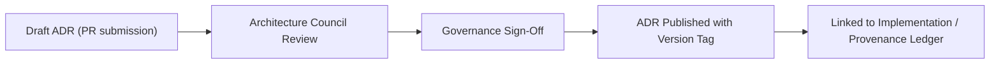

<div align="center">

# 📘 **Kansas Frontier Matrix — ADR Decision Authoring Guide (v2.1.1 · Tier-Ω+∞ Certified)**  
`docs/architecture/adr/templates/adr-decision-guide.md`

**Mission:** Provide detailed instructions, examples, and validation rules for writing, reviewing, and maintaining  
**Architecture Decision Records (ADRs)** under **MCP-DL v6.4.3**, ensuring transparent governance, reproducibility, and FAIR+CARE compliance.

[](../../../../docs/)
[](../../../../.github/workflows/docs-validate.yml)
[](../../../../.github/workflows/policy-check.yml)
[](../../../../LICENSE)

</div>

---

## 📚 Overview

The **ADR Decision Authoring Guide** defines the editorial and technical standards for all architecture decisions in KFM.  
It enforces the **ADR-Template Standard**, providing structure, tone, and lifecycle policies aligned with FAIR+CARE and MCP documentation principles.

ADRs are **governance artifacts**, not just technical notes — each one must be auditable, reviewable, and cross-linked to implementation and policy.

---

## 🧩 Required ADR Sections

Each ADR must contain **five core sections** in the following order:

| Section | Description | Purpose |
|:--|:--|:--|
| **Context** | Describe the problem, constraints, and relevant background. | Provide scope and justification. |
| **Decision** | Summarize what was decided and why. | Document reasoning and trade-offs. |
| **Consequences** | Outline technical, ethical, or operational effects. | Anticipate impact on system and governance. |
| **Status** | Indicate whether proposed, accepted, superseded, or deprecated. | Track lifecycle stage. |
| **References** | Link to related ADRs, PRs, issues, or governance documents. | Maintain traceability. |

---

## 🧱 ADR Metadata (Front-Matter)

Each ADR begins with YAML metadata, validated automatically during CI.

```yaml
---
adr_id: "ADR-####"
title: "Concise Decision Title"
authors: ["@username"]
reviewers: ["@kfm-architecture","@kfm-docs"]
status: "Proposed|Accepted|Superseded|Deprecated"
decision_date: "YYYY-MM-DD"
last_reviewed: "YYYY-MM-DD"
governance_link: "docs/standards/governance/ROOT-GOVERNANCE.md"
related_adrs: ["ADR-####"]
license: "CC-BY 4.0"
---
```

> ✅ **Tip:** Use the next sequential ADR number. The CI workflow (`adr_validate.yml`) enforces numbering order and prevents duplicates.

---

## 🧭 ADR Lifecycle


<!-- END OF MERMAID -->

| Lifecycle State | Description | Trigger |
|:--|:--|:--|
| **Proposed** | Draft ADR submitted as PR. | `policy-check.yml` validation passes. |
| **Accepted** | Decision ratified by Council and merged. | Governance sign-off logged. |
| **Superseded** | Replaced by newer ADR. | Cross-link added to `related_adrs`. |
| **Deprecated** | Retained for history; no longer active. | Flagged in ledger, archived. |

---

## 🧠 Writing Guidelines

### ✅ Best Practices
- Write in **clear, concise, neutral language**.  
- Describe **why** the decision was made — not just **what** was implemented.  
- Use **present tense** for decisions and **past tense** for context.  
- Always include **ethical or FAIR+CARE** considerations where applicable.  
- Reference related **ADRs**, **PRs**, and **CI workflows** directly.  
- Limit each ADR to **one primary decision** for clarity.

### ⚠️ Common Mistakes
- ❌ Writing ADRs like changelogs — they are rationale documents, not commits.  
- ❌ Omitting FAIR+CARE or ethical implications.  
- ❌ Failing to document rejected alternatives.  
- ❌ Forgetting cross-links between dependent ADRs.  

---

## 🧩 FAIR + CARE Integration Policy

Every ADR must explicitly reference FAIR+CARE principles where applicable.

| Principle | Application in ADRs |
|:--|:--|
| **Findable** | ADRs are indexed via unique IDs (`ADR-####`). |
| **Accessible** | Openly licensed (CC-BY 4.0) and searchable on GitHub Pages. |
| **Interoperable** | YAML front-matter + Markdown structure are machine-parseable. |
| **Reusable** | Versioned, checksum-verified, and validated under MCP-DL. |
| **CARE (Ethics)** | Include ethical or community considerations for major system decisions. |

---

## ⚙️ ADR Validation via CI/CD

| Workflow | Function | Enforcement |
|:--|:--|:--|
| `docs-validate.yml` | Validates structure, Markdown syntax, and links. | Fails on syntax or link issues. |
| `policy-check.yml` | Ensures metadata compliance and owners list. | Fails if fields missing. |
| `adr_validate.yml` | Confirms required ADR sections are present. | Fails if structure incomplete. |
| `governance-ledger.yml` | Adds ADR checksum and reviewer signatures. | Ensures immutability and provenance. |

---

## 🧮 ADR Example Snippet

```yaml
---
adr_id: "ADR-0100"
title: "Implement FAIR+CARE Metadata Gate in ETL Pipelines"
authors: ["@kfm-architecture","@kfm-governance"]
status: "Proposed"
decision_date: "2025-11-16"
last_reviewed: "2025-11-16"
governance_link: "docs/standards/governance/ROOT-GOVERNANCE.md"
license: "CC-BY 4.0"
---
```

### Context
Pipeline metadata lacked automated FAIR+CARE validation, risking inconsistency across releases.

### Decision
Introduce a CI workflow (`faircare-validate.yml`) for continuous FAIR+CARE checks on all data transformations.

### Consequences
- ✅ Consistent governance enforcement across all datasets.  
- ⚠️ Slightly longer pipeline execution times due to validation overhead.

---

## 🧾 Review and Sign-Off Procedure

| Role | Responsibility | CI Enforcement |
|:--|:--|:--|
| **Author(s)** | Draft ADR and submit via PR. | `policy-check.yml` |
| **Architecture Council** | Review, request changes, and approve. | `adr_validate.yml` |
| **Governance Council** | Final ethics and FAIR+CARE sign-off. | `governance-ledger.yml` |
| **Documentation Team** | Maintain ADR index and template compliance. | `docs-validate.yml` |

---

## 🧩 Annual ADR Review Process

1. Export all ADR metadata to `adr_index.json`.  
2. Verify that each ADR:
   - Has been reviewed within 12 months.  
   - Contains valid cross-references.  
   - Maintains `Accepted` or `Deprecated` state accuracy.  
3. Governance Council signs the **ADR Audit Summary** (`reports/audit/adr_audit.json`).  

---

## 🧾 Version History

| Version | Date | Author | Summary |
|:--|:--|:--|:--|
| **v2.1.1** | 2025-11-16 | @kfm-architecture | Created standardized ADR authoring guide with CI/CD enforcement and FAIR+CARE policy. |
| v2.0.0 | 2025-10-25 | @kfm-data-lab | Expanded ADR template guidance with governance linkage. |
| v1.0.0 | 2025-10-05 | @kfm-architecture | Initial ADR writing guide under MCP-DL. |

---

<div align="center">

**Kansas Frontier Matrix © 2025**  
*“Architecture Decisions Govern Systems — Governance Sustains Trust.”*  
📍 `docs/architecture/adr/templates/adr-decision-guide.md` — ADR authoring and lifecycle governance guide for KFM.

</div>