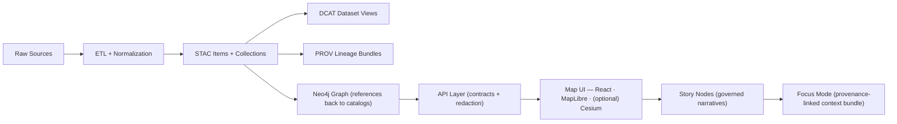

<div align="center">

# 🧠 **Kansas Frontier Matrix — Agent Architecture Overview**  
`docs/architecture/agents/README.md`

**Purpose:**  
A centralized, governance-first view of the **KFM v10+ Agent Architecture** — how automation + AI assistants safely move data from **raw → published → narrative → Focus Mode**, without breaking contracts, provenance, or FAIR+CARE commitments.

<br/>


</div>

---

## 🔭 What “Agent Architecture” Means in KFM

In KFM, “agents” are **governed actors** (human-assisted automation, schedulers, AI copilots, batch pipelines, MCP tools) that:

- ✅ **Produce publishable artifacts** (datasets, STAC/DCAT/PROV, graph links, Story Nodes)
- ✅ **Respect the canonical pipeline ordering**
- ✅ **Operate behind contracts and validators**
- ✅ **Log telemetry + provenance for reproducibility**
- ✅ **Never publish unsourced claims (Focus Mode / narratives)**

> 🧩 Agents are not “magic chatbots.” They are *operational software components* living inside KFM’s clean architecture.

---

## 🧭 Quick Navigation

- 🧬 **Pipeline Invariants (Non-Negotiable)** → [Canonical Pipeline Ordering](#-canonical-pipeline-ordering) · [Hard Invariants](#-hard-invariants)
- 🧱 **Architecture Mapping** → [Clean Architecture Layer Mapping](#-clean-architecture-layer-mapping)
- 🧩 **Core Agent Components** → [Orchestration](#-orchestration--execution-engine) · [Governance](#-governance-firewall-dynamic-tool-calling) · [Tool Gateway](#-tool-gateway-mcp--tool-bus) · [Validators](#-contracts--schema-validators)
- 📦 **Contracts & Schemas** → [Contract Surfaces](#-contract-surfaces) · [Schema Families](#-schema-families)
- 🧪 **Validation** → [CI Gates](#-ci-gates--validation)
- 🛣️ **Roadmap** → [Near-Term + Next](#-roadmap-near-term--next)

---

## 🧬 Canonical Pipeline Ordering

KFM’s **agent system is designed to enforce** the project’s canonical pipeline:



**Key idea:** Each stage consumes only *published boundary artifacts* from the prior stage — so traceability is preserved end-to-end.

---

## 🔒 Hard Invariants

These invariants are the **guardrails** every agent must follow:

### 1) 🚦 No skipping stages  
Agents must not jump from raw → UI or raw → story. Each stage must produce its boundary artifacts first (e.g., PROV + STAC).

### 2) 📜 Contracts are the law  
OpenAPI + schema profiles define what can be exchanged across boundaries. Breaking a contract requires explicit versioning and migration.

### 3) 🧼 Evidence-first outputs  
Story Nodes and Focus Mode are governed outputs: they must attach citations and provenance-linked artifacts (no “free-floating” claims).

### 4) 🧿 Sensitivity propagation  
Output sensitivity cannot be **less restrictive** than any of its inputs. Redaction/generalization is required when needed.

---

## 🧱 Clean Architecture Layer Mapping

KFM is designed with clean architecture separation:

- **Domain** → Core models (datasets, items, entities, time, provenance)
- **Service** → Use-cases (ingest, validate, publish, link, narrate)
- **Integration** → Adapters (DB repos, STAC writers, graph writers, MCP tools)
- **Infrastructure** → PostGIS, Neo4j, object storage, task runners
- **Interface** → API + UI (FastAPI, React/MapLibre/Cesium)

🎯 **Agents primarily live in the Service layer** and must call downward through Integration → Infrastructure. They should not “reach around” contracts from UI to databases.

---

## 🧩 Core Agent Components

### 🧠 Orchestration / Execution Engine
A deterministic + resumable engine to run agent workflows as DAGs/state machines:

- node-level step isolation
- checkpointing
- retry policies
- deterministic runs (where possible)
- reproducible inputs/outputs

> 🧩 Implementation can be LangGraph-style, a job runner, or a pipeline orchestrator — the important part is *governed state + provenance*.

---

### 🛡️ Governance Firewall (Dynamic Tool Calling)
This is the policy gate between “intent” and “capability.”

It enforces:

- ✅ read/write permissions by role + dataset tier + sensitivity
- ✅ per-stage tool allowlists (ETL tools ≠ graph mutation tools)
- ✅ “verify before write” gates
- ✅ redaction requirements before public outputs
- ✅ schema validation before publication

---

### 🧰 Tool Gateway (MCP / Tool Bus)
A standardized way for agent nodes to call capabilities:

- PostGIS queries (safe read APIs)
- Neo4j graph updates (write through controlled adapters)
- STAC/DCAT/PROV generation tools
- OCR + NLP pipelines
- GDAL/tiling toolchain

> 📌 Tool gateway ≠ “direct DB access.” It is a *governed adapter layer*.

---

### ✅ Contracts & Schema Validators
Every agent output must be validated **before it can flow downstream**:

- OpenAPI contract compliance (server endpoints)
- JSON Schema validation (STAC/DCAT/PROV/story/ui/telemetry)
- link integrity checks
- provenance completeness checks
- “sensitivity policy” checks

---

## 📦 Contract Surfaces

### 🔗 API Contracts
- `../../../api/contracts/openapi/README.md`  
  → OpenAPI (Swagger) specs + versioning rules + generated clients.

### 🧾 Schema Contracts
- `../../../api/contracts/schemas/stac/README.md`  
  → STAC profile constraints (Collections, Items, Assets).
- `../../../api/contracts/schemas/ui/README.md`  
  → UI-facing configuration schemas (layers, timelines, story steps, etc.)

> 🧠 The agent system treats these contracts as **compile-time rules**: if a workflow produces a payload that fails schema validation, it cannot publish.

---

## 🧬 Schema Families

KFM schemas typically fall into these families:

- 🛰️ **STAC** — catalog metadata for datasets/items/assets
- 🧾 **DCAT** — discovery metadata (JSON-LD feed)
- 🧬 **PROV** — lineage of inputs → activities → outputs
- 📚 **Story Nodes** — governed narratives and their map step configs
- 🧠 **Telemetry** — Focus Mode + agent run traces
- 🗺️ **UI** — layer configs, styling, timelines, dashboards

---

## 🗺️ Data + UI Context Agents Must Understand

KFM’s map stack (the “reality” agents are serving) includes:

- 🗄️ **PostGIS** for vector spatial tables and spatial querying
- 🧱 **Tiling/caching** patterns for large rasters + base layers
- 🧭 **MapLibre GL JS** for interactive 2D WebGL mapping
- 🌍 **CesiumJS** for optional 3D globe/terrain visualization

Agents that publish map-ready outputs must produce artifacts compatible with these clients (tiles, GeoJSON/GeoParquet, style configs, etc.).

---

## 🧬 System-Level Runtime Flow

```text
🧑 User / Maintainer
  ↓
🌐 UI (Focus Mode / Story Editor / Admin Tools)
  ↓
🧠 Agent Router (intent → workflow selection)
  ↓
🛡️ Governance Firewall (policy + validation gates)
  ↓
🧱 Pipeline / Graph / Catalog Actions
  ├── ETL (data/raw → data/processed)
  ├── STAC/DCAT/PROV writers
  ├── Graph linking (Neo4j via adapters)
  ├── API publication (OpenAPI-bound)
  └── Story Node packaging
  ↓
📈 Telemetry + Provenance (immutable logs)
  ↓
✅ Published outputs (UI + Story Nodes + Focus Mode bundles)
```

---

## 🧑‍🤝‍🧑 Agent Roles & “What They Produce”

| Agent / Workflow | Primary Inputs | Primary Outputs | Publishes Into |
|---|---|---|---|
| 🧱 ETL Runner | data/raw + configs | data/processed + run logs | `data/processed/…` |
| 🛰️ STAC Curator | processed datasets | STAC Collections/Items | `data/stac/…` |
| 🧾 DCAT Publisher | STAC + metadata | DCAT dataset views | `data/catalog/dcat/…` |
| 🧬 PROV Lineage Builder | pipeline runs | provenance bundles | `data/prov/…` |
| 🧬 Graph Linker | STAC + entity refs | Neo4j nodes/edges | Neo4j (via adapters) |
| 📚 Story Node Builder | curated datasets + media | story markdown + step JSON | `docs/story_nodes/…` |
| 🧠 Focus Mode Assistant | UI context + graph + catalogs | provenance-linked answers | telemetry + UI view |
| 📡 Watcher (Real-time) | external feeds | events/time-series datasets | processed + STAC + PROV |

> 🗝️ Rule: Anything agent-produced that can affect decisions becomes a first-class dataset + provenance artifact.

---

## 🧪 CI Gates & Validation

### ✅ Expected CI behaviors
- PRs fail if:
  - schemas don’t validate
  - provenance is missing
  - links are broken
  - sensitive information leaks
  - Story Nodes lack citations

### 🛠️ Local validator commands
```bash
make validate-agent-architecture
make validate-contracts
make validate-schemas
make validate-story-nodes
make validate-provenance
```

> 💡 Not all targets may exist yet — the architecture requires them. If a target is missing, treat it as a 🚧 TODO for repo hardening.

---

## 📦 MCP Runs, Experiments, and Reproducibility

Agents should record:

- 🧾 run manifests (inputs/outputs)
- 🔁 parameters + hashes
- 📈 metrics (timings, counts, coverage)
- 🧬 provenance links to STAC/DCAT entries
- 🧠 Focus Mode context bundles (what the assistant saw)

This enables:
- auditability,
- rollback and replay,
- governance review,
- reproducible science workflows.

---

## 🛣️ Roadmap Near-Term + Next

Aligned roadmap items that influence agent architecture:

- 📲 **Mobile + Offline packs** (region bundles with tiles + stories)
- 🕰️ **Timeline slider (4D mapping)** improvements for filtering/animation
- 📊 **Dashboards + charts** attached to selections (county/watershed)
- 🤝 **Collaborative editing** (roles, moderation, “draft → review → publish”)
- 🔐 **AuthZ/AuthN** and tiered access controls tied into governance gates

---

## 🕒 Version History

| Version  | Date       | Notes |
|----------|------------|------|
| v10.3.2  | 2026-01-12 | Aligned agent overview to contract-first + pipeline invariants; added contract surfaces, CI gate model, and MCP run expectations. |
| v10.3.1  | 2025-11-13 | Added memory-rule compliant structure + directory layout alignment. |
| v10.3.0  | 2025-11-13 | Initial Agent Architecture overview for LangGraph/CrewAI-style integration. |

---
