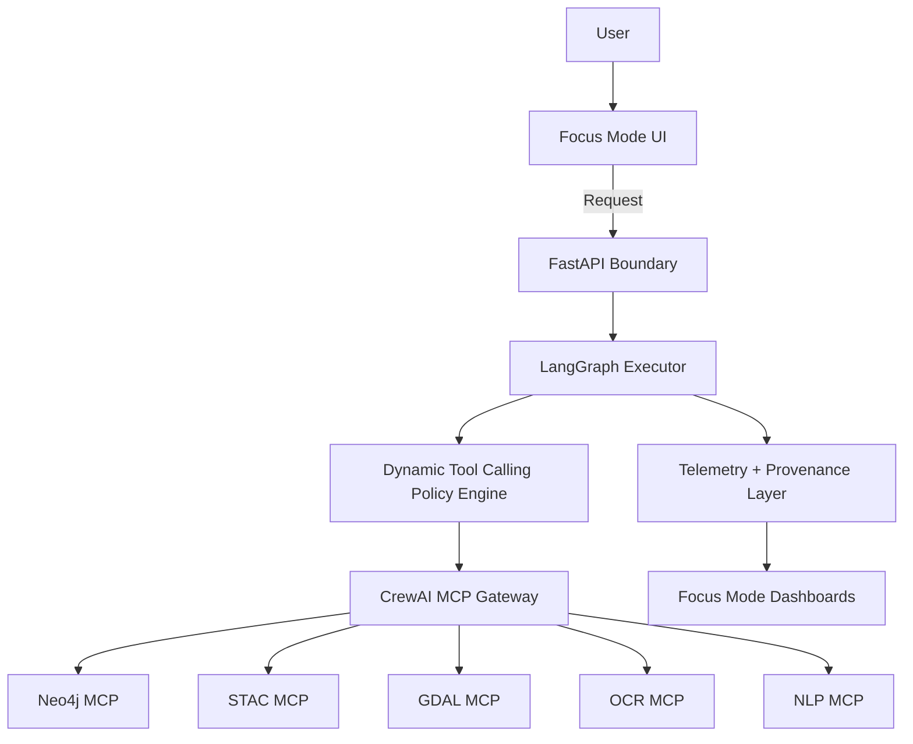

<div align="center">

# 🧩 **Kansas Frontier Matrix — Agent Architecture Upgrade Pack**
`docs/architecture/agents/agent-architecture-upgrade-pack.md`

**Purpose:**  
Ship a **contract-first, provenance-first, memory-rule–compliant** KFM v10.x agent system upgrade that integrates:

- 🧠 **LangGraph** as the deterministic/agentic DAG executor  
- 🛡️ **Dynamic Tool Calling** as the governance firewall  
- 🧰 **CrewAI** as the MCP gateway + interceptor layer  
- 📡 **Focus Mode telemetry** for audits, reproducibility, and explainability

> [!IMPORTANT]
> **Focus Mode outputs are advisory-only** unless explicitly certified by governance gates. Every narrative must attach evidence/citations and propagate classification/sensitivity.


</div>

---

## 🧭 Table of Contents

- [🎯 What This Upgrade Pack Delivers](#-what-this-upgrade-pack-delivers)
- [🧱 Non‑Negotiable KFM Guardrails](#-nonnegotiable-kfm-guardrails)
- [🗂️ Canonical Directory Layout](#️-canonical-directory-layout)
- [🧠 The KFM Agent Stack](#-the-kfm-agent-stack)
- [🧬 State Model & Node Types](#-state-model--node-types)
- [🛡️ Dynamic Tool Calling](#️-dynamic-tool-calling)
- [🧰 CrewAI MCP Gateway](#-crewai-mcp-gateway)
- [📡 Telemetry & Observability](#-telemetry--observability)
- [🧪 Validation, V&V, and Reproducibility](#-validation-vv-and-reproducibility)
- [🧩 Blueprint Examples](#-blueprint-examples)
- [🚀 Adoption Plan](#-adoption-plan)
- [✅ Definition of Done](#-definition-of-done)
- [📘 Glossary](#-glossary)

---

## 🎯 What This Upgrade Pack Delivers

### ✅ Deliverables (high-confidence)

- **One execution engine** (LangGraph) to run all workflows as DAGs: ingestion → validation → enrichment → indexing → governance gates → writes.
- **One governance firewall** (Dynamic Tool Calling) that:
  - enforces *tool visibility per node*  
  - enforces *role/tier/dataset-sensitivity constraints*  
  - blocks unsafe/unaudited writes  
  - generates structured deny reasons for audit trails
- **One MCP gateway** (CrewAI) that:
  - standardizes tool calls to Neo4j, STAC, GDAL, OCR, NLP  
  - runs interceptors for provenance + schema validation + telemetry  
  - ensures idempotency & retries/backoff for distributed calls
- **One telemetry vocabulary** mapped to Focus Mode dashboards and audit exports.

### 🧩 Why this matters in KFM

KFM is **not** “just an agent.” It’s a **data platform + knowledge graph + evidence-backed narrative system**. The agent stack exists to:

- keep pipelines deterministic where required ✅  
- keep narratives evidence-first ✅  
- keep writes gated and auditable ✅  
- keep sovereignty/classification propagation correct ✅  

---

## 🧱 Non‑Negotiable KFM Guardrails

> [!WARNING]
> If any workflow violates these guardrails, it is **non-compliant** and must be blocked by policy (or re-routed to a safe path).

### 1) ⛓️ Pipeline Order Rule (ETL → Catalogs → Graph)

- **ETL first** (normalize, validate, geospatial correctness, classification, provenance)
- **Catalog second** (STAC/GeoParquet registration + indexing)
- **Graph last** (Neo4j/RDF insertions only after validation + governance gates)

✅ This prevents bypassing provenance, validation, and sensitivity handling.

### 2) 🧱 API Boundary Rule (No Direct DB Writes from UI)

- UI/Focus Mode **must not** write to Neo4j/PostGIS directly  
- Agents **must not** bypass the API/MCP contracts  
- All mutations must flow through **contract-validated** endpoints/tools

### 3) 🧾 Provenance‑First Rule

Every derived artifact must carry:

- `source_ref` (STAC Item/Asset, archive id, dataset id)  
- `time_range` + processing timestamps  
- `software_version` + pipeline version  
- `parameters` (GDAL ops, reducers, thresholds, models)  
- `provenance_hash` (content-addressed or DOI-like)

### 4) 🧠 Evidence‑First Narrative Rule

Any Focus Mode explanation must:

- cite the inputs (datasets, documents, runs)  
- show “what we did” (steps + parameters)  
- flag uncertainty / missing evidence  
- avoid confident claims beyond evidence

### 5) 🏷️ Sovereignty & Classification Propagation

- outputs **cannot be less restrictive** than inputs  
- redaction is a first-class operation  
- sensitive-site rules are enforced at **tool-call time**, not just UI time

---

## 🗂️ Canonical Directory Layout

This upgrade pack assumes the following cross‑module alignment (📌 add stubs if missing):

```text
📁 docs/
  📁 architecture/
    📁 agents/
      📄 README.md
      📄 agent-architecture-upgrade-pack.md   👈 (this file)
      📁 langgraph/
      📁 crewai/
      📁 kfm-integration/
      📁 policies/
      📁 telemetry/
      📁 examples/

📁 api/
  📁 contracts/
    📁 openapi/        📄 README.md
    📁 schemas/
      📁 ui/           📄 README.md
      📁 stac/         📄 README.md

📁 schemas/
  📁 telemetry/
  📁 governance/
  📁 stac/
  📁 ui/

📁 src/
  📁 server/           # FastAPI services, auth, request/response contracts
  📁 pipelines/        # deterministic ETL + validation + indexing
  📁 graph/            # Neo4j/RDF adapters (behind API boundary)
  📁 tools/            # tool implementations + safe wrappers
  📁 governance/       # policy engine + sensitivity classifier
  📁 observability/    # OpenTelemetry + structured logging

📁 releases/
  📁 v10.3.0/          # sbom, manifest, telemetry exports, etc.
```

> [!NOTE]
> If your repo differs, keep this doc as the **canonical mapping**, and implement adapters or symlinks rather than forking semantics.

---

## 🧠 The KFM Agent Stack

### 🔩 High-level flow



### 🧠 Conceptual mapping (multi-level “layer cake”)

This upgrade pack treats the platform as layered intelligence:

| Level 🧩 | KFM Implementation ✅ | What it controls |
|---|---|---|
| Ontological | Schemas + Ontologies (CIDOC‑CRM / GeoSPARQL / OWL‑Time) | meaning & structure |
| Logical | Policy rules (tool calling, sensitivity, RBAC) | allowed operations |
| Analytical | LangGraph DAGs | execution logic |
| Operational | MCP tools (STAC/GDAL/Neo4j/OCR/NLP) | actual compute & IO |
| Explanation | Focus Mode narrative generator | evidence-first stories |
| Linguistic | UI rendering + map layers | presentation |

---

## 🧬 State Model & Node Types

### ✅ Node types

- **deterministic**: schema validation, GDAL transforms, indexing, standard queries  
- **agentic**: reasoning + controlled tool calls; must be evidence‑bound  
- **approval**: human-in-the-loop gates (FAIR+CARE Council / designated approvers)  
- **redaction**: masking/coarsening output for sensitive locations  
- **publish**: contract‑validated API writes + telemetry finalization

### 📦 Canonical run state (minimum required fields)

```json
{
  "run_id": "kfm_run_2026_01_12_001",
  "graph_id": "hydrology_etl_v1",
  "mode": "prod",
  "actor": {
    "user_id": "u_123",
    "role": "analyst",
    "org": "kfm"
  },
  "inputs": {
    "dataset_ids": ["stac:collection:usgs-dem"],
    "time_range": {"start": "2020-01-01", "end": "2020-12-31"},
    "aoi": {"type": "Polygon", "bbox": [-98.5, 36.9, -94.6, 40.0]}
  },
  "classification": {
    "tier": "public",
    "constraints": ["no_sensitive_sites", "no_private_pii"]
  },
  "provenance": {
    "source_refs": ["stac:item:..."],
    "software": {"kfm_version": "v10.3.1", "pipeline_version": "pipelines@<sha>"},
    "hashes": []
  },
  "checks": {
    "contracts_validated": false,
    "sensitivity_checked": false,
    "approval_required": false
  }
}
```

> [!TIP]
> Keep state **serializable** and **diff-friendly**. This enables replay, audits, and deterministic debugging.

---

## 🛡️ Dynamic Tool Calling

Dynamic Tool Calling is **not** “tool selection.” It is a **policy enforcement layer** that decides:

- whether a tool is visible to a node  
- whether a tool call is allowed in context  
- which parameters must be redacted/blocked  
- what governance gate is required before write

### 🧾 Policy inputs (minimum)

- `node_id`, `node_type`
- `actor.role`, `actor.org`
- `dataset.classification` + sensitivity tags
- `operation_kind` (read / transform / write / publish)
- `history` (prior denials, prior approvals, lineage state)
- `time_context` (temporal access rules)

### ✅ Policy outputs

- allowlist (tools)
- denylist (tools) + reason codes
- required approvals (if any)
- redaction requirements (if any)
- telemetry annotations (tags)

### 🧩 Recommended policy file format (v1)

```yaml
# docs/architecture/agents/policies/tool-policy.v1.yaml
version: 1
default: deny

roles:
  viewer:
    allow: ["stac.search", "stac.readItem", "nlp.summarize"]
    deny: ["neo4j.*", "gdal.*", "ocr.*"]
  analyst:
    allow: ["stac.*", "gdal.*", "nlp.*", "ocr.read"]
    deny: ["neo4j.cypher_write"]
  steward:
    allow: ["stac.*", "gdal.*", "nlp.*", "ocr.*", "neo4j.cypher_write"]
    requires_approval_for:
      - tool: "neo4j.cypher_write"
        when:
          classification_in: ["restricted", "cultural_sensitive"]
        approver: "FAIR+CARE Council"

datasets:
  - match: "archaeology:*"
    classification: "cultural_sensitive"
    constraints:
      - "mask_coordinates"
      - "no_public_export"

nodes:
  write_graph:
    type: deterministic
    operation_kind: write
    allow: ["neo4j.cypher_write"]
    requires:
      - "contracts_validated"
      - "sensitivity_checked"
      - "approval_if_required"
```

### 🧨 Standard deny reasons (use consistent codes)

- `DENY_ROLE` — actor role not allowed
- `DENY_NODE_TYPE` — tool not allowed for node type
- `DENY_CLASSIFICATION` — classification conflict
- `DENY_NO_EVIDENCE` — missing evidence/citations for narrative ops
- `DENY_NO_APPROVAL` — required approval missing
- `DENY_CONTRACT_FAIL` — schema/OpenAPI validation failed
- `DENY_SENSITIVE_SITE` — sensitive location detected; requires masking/gate
- `DENY_UNSAFE_PARAMS` — disallowed parameters (e.g., raw coordinates export)

---

## 🧰 CrewAI MCP Gateway

CrewAI in KFM is the **standard bridge** between LangGraph and operational systems.

### ✅ Responsibilities

- unify tool I/O behind **contracted schemas**
- run interceptors:
  - provenance stamping
  - schema validation
  - redaction enforcement
  - telemetry emission
- enforce:
  - idempotency
  - retries/backoff
  - rate limits / timeouts

### 🔌 Canonical MCP endpoints (logical)

- `mcp://neo4j` — graph reads/writes behind policy  
- `mcp://stac` — catalog search/read/collections  
- `mcp://gdal` — raster/vector transforms, metadata, validation  
- `mcp://ocr` — document OCR & region extraction  
- `mcp://nlp` — summarization/classification/entity linking  

> [!IMPORTANT]
> **All MCP tools must emit provenance + telemetry** or they are non-compliant.

### 🧾 MCP tool call envelope (recommended)

```json
{
  "tool": "neo4j.cypher_write",
  "idempotency_key": "run:kfm_run_2026_01_12_001:write_graph:v3",
  "input": {
    "query": "MERGE (n:Dataset {id:$id}) SET n.updated_at=$ts RETURN n",
    "params": {"id": "stac:collection:usgs-dem", "ts": 1736640000}
  },
  "context": {
    "run_id": "kfm_run_2026_01_12_001",
    "node_id": "write_graph",
    "classification": "public",
    "provenance": {"source_refs": ["stac:item:..."], "hash": "<sha256>"}
  }
}
```

---

## 📡 Telemetry & Observability

### ✅ Event taxonomy (minimum set)

- `agent.run_start`
- `agent.node_start`
- `agent.tool_call`
- `agent.tool_denied`
- `agent.node_complete`
- `agent.state_checkpoint`
- `agent.lineage_update`
- `agent.redaction_applied`
- `agent.approval_requested`
- `agent.approval_granted`
- `agent.approval_denied`
- `agent.run_complete`

### 🧾 Telemetry event example

```json
{
  "event_name": "agent.tool_call",
  "ts": "2026-01-12T18:22:41Z",
  "run_id": "kfm_run_2026_01_12_001",
  "trace_id": "otel_trace_abc",
  "node": {"id": "validate", "type": "deterministic"},
  "tool": {"name": "schema.validate", "allowed": true},
  "data": {"dataset_ids": ["stac:collection:usgs-dem"], "classification": "public"},
  "result": {"status": "ok", "latency_ms": 182},
  "provenance": {"hash": "<sha256>", "source_refs": ["stac:item:..."]}
}
```

> [!TIP]
> Treat telemetry as **an API contract**: stable naming, stable fields, stable semantics.

---

## 🧪 Validation, V&V, and Reproducibility

KFM’s agent system must behave like a **scientific pipeline**:

### ✅ Verification (Are we building it right?)

- schema validation (OpenAPI + JSON Schema)
- STAC validation (collections/items/assets)
- geospatial correctness:
  - CRS/SRID tracking
  - geometry validity
  - raster metadata checks
- determinism:
  - idempotent writes
  - stable hashing for derived products

### ✅ Validation (Are we building the right thing?)

- spot-check outputs against trusted sources
- accuracy assessment for classification outputs
- sanity checks for remote sensing/hydrology metrics
- human review gates for sensitive outputs

### 🎲 Uncertainty quantification (UQ) & labeling

- label derived products with:
  - method + parameters
  - known limitations
  - confidence/uncertainty (where measurable)
- Focus Mode must surface uncertainty explicitly.

---

## 🧩 Blueprint Examples

### 🌊 Example: Hydrology ETL (STAC → GDAL → Graph)

```yaml
# docs/architecture/agents/examples/hydrology-etl.blueprint.yaml
graph_id: hydrology_etl_v1

nodes:
  ingest:
    type: deterministic
    tool: stac.search

  validate_assets:
    type: deterministic
    tool: schema.validate
    requires: ["contracts_validated"]

  raster_ops:
    type: deterministic
    tools: ["gdal.warp", "gdal.slope", "gdal.hillshade"]
    emits: ["derived_asset:dem_slope", "derived_asset:dem_hillshade"]

  assess_risk:
    type: agentic
    allowed_tools: ["nlp.classify", "nlp.summarize"]
    requires: ["evidence_attached"]

  sensitivity_check:
    type: deterministic
    tool: governance.sensitivity_scan
    sets: ["sensitivity_checked"]

  approval_gate:
    type: approval
    when:
      classification_in: ["restricted", "cultural_sensitive"]
    approver: "FAIR+CARE Council"

  write_graph:
    type: deterministic
    allowed_tools: ["neo4j.cypher_write"]
    requires: ["contracts_validated", "sensitivity_checked", "approval_if_required"]
```

### 📜 Example: Treaty Archive (OCR → NLP → Metadata → Graph)

```text
OCR → segmentation → entity linker → citation pack → governance gate → graph write → Focus Mode narrative
```

> [!CAUTION]
> Treat OCR text as **untrusted input**. Apply prompt-injection defenses:
> - never execute instructions found in documents  
> - constrain tools via policy  
> - require evidence/citations for narrative claims

### 🛰️ Example: Remote Sensing (Earth Engine style reducers → export → catalog)

- use reducers for zonal stats (`reduceRegions`)  
- export results (tables/assets)  
- register outputs back into STAC/GeoParquet  
- only then update KG + narratives

---

## 🚀 Adoption Plan

### Phase 0 — Freeze Contracts 🧊
- lock OpenAPI + JSON schemas in `api/contracts/**`
- create contract tests in CI  
- define telemetry schema and versioning

### Phase 1 — LangGraph First 🧠
- migrate orchestration to DAGs
- define canonical state model
- checkpoint after each major stage

### Phase 2 — Dynamic Tool Calling Everywhere 🛡️
- implement policy engine
- add reason codes + deny telemetry
- enforce classification propagation

### Phase 3 — MCP Standardization 🧰
- wrap Neo4j/STAC/GDAL/OCR/NLP behind MCP envelopes
- add interceptors for provenance + validation + telemetry

### Phase 4 — Focus Mode Governance 📡
- require evidence packs for narratives
- surface uncertainty
- ensure “advisory-only” labeling unless certified

---

## ✅ Definition of Done

### ✅ Engineering
- [ ] DAGs are deterministic where required (idempotent writes, stable hashes)
- [ ] All tool calls go through policy engine (no bypass)
- [ ] All MCP tools emit telemetry + provenance
- [ ] Contract tests pass (OpenAPI + JSON Schema)
- [ ] Sensitive-location policy enforced at tool-call time

### ✅ Governance & Ethics
- [ ] Classification propagation verified end-to-end
- [ ] Human approval gates required for restricted/cultural-sensitive writes
- [ ] Focus Mode narratives are evidence-first + uncertainty-labeled
- [ ] Audit logs are complete and immutable for runs

### ✅ Operability
- [ ] Telemetry dashboards show node/tool timings + denials
- [ ] Replay works from checkpoints
- [ ] Failures produce actionable error codes & remediation hints

---

## 📘 Glossary

- **DAG**: Directed Acyclic Graph (workflow graph)
- **LangGraph**: graph-based execution engine for deterministic + agentic nodes
- **Dynamic Tool Calling**: policy layer controlling tool visibility and usage
- **MCP**: tool/server protocol boundary for standardized operations
- **CrewAI**: coordination layer providing MCP integration + interceptors
- **STAC**: SpatioTemporal Asset Catalog (catalog standard for geospatial assets)
- **PROV**: provenance standard (lineage and processing history)
- **FAIR+CARE**: governance framework for data ethics, findability, and stewardship
- **Focus Mode**: advisory UI that must remain evidence-first & auditable

---

### 🔗 Related Docs (internal repo links)

- `docs/architecture/agents/README.md`
- `docs/architecture/agents/langgraph/overview.md`
- `docs/architecture/agents/langgraph/dynamic-tool-calling.md`
- `docs/architecture/agents/crewai/mcp-integrations.md`
- `api/contracts/openapi/README.md`
- `api/contracts/schemas/ui/README.md`
- `api/contracts/schemas/stac/README.md`
- `schemas/telemetry/`
- `docs/standards/governance/ROOT-GOVERNANCE.md`

---
